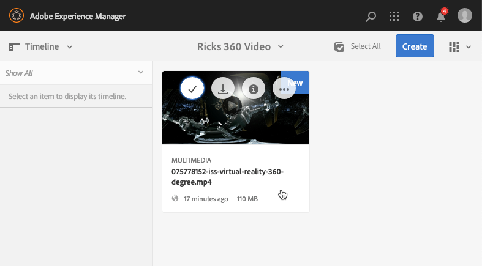
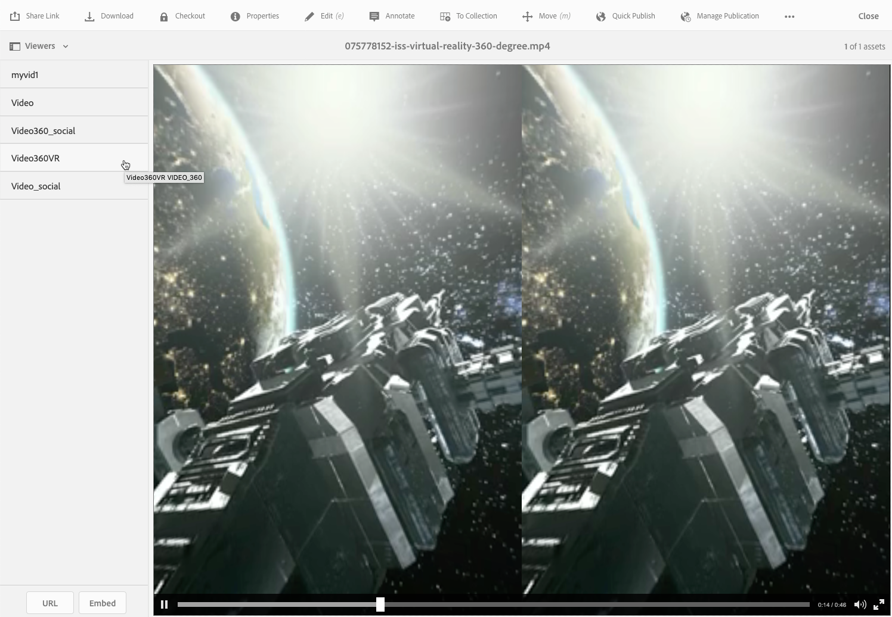

# 360/VR 비디오 {#vr-video}

360도 동영상은 모든 방향에서 동시에 보기를 기록합니다. 그것들은 전방향 카메라나 카메라 모음을 사용하여 촬영된다. 평면 디스플레이에서 재생 중에 사용자는 보기 각도를 제어할 수 있습니다.모바일 장치에서 재생은 일반적으로 내장된 회전 제어 기능을 활용합니다.

Dynamic Media - Scene7 모드에는 360개의 비디오 자산 전달을 위한 기본 지원이 포함되어 있습니다. 기본적으로 보거나 재생하는 데 추가 구성이 필요하지 않습니다. .mp4, .mkv 및 .mov와 같은 표준 비디오 확장 기능을 사용하여 360 비디오를 제공합니다. 가장 일반적인 코덱은 H.264입니다.

이 섹션에서는 360/VR Video 뷰어와 함께 룸이나 속성, 위치, 가로, 의료 절차 등의 몰입형 보기 환경을 위해 필요한 사각형 비디오를 렌더링하는 방법에 대해 설명합니다.

공간 오디오가 현재 지원되지 않습니다.오디오가 스테레오에 혼합되어 있는 경우 고객이 카메라 보기 각도를 변경할 때 균형(L/R)이 변경되지 않습니다.

또한 [뷰어 사전 설정 관리](/help/assets/managing-viewer-presets.md)를 참조하십시오.

## 360 작동 중인 비디오 {#video-in-action}

[Space Station 360](http://mobiletest.scene7.com/s7viewers/html5/Video360Viewer.html?asset=Viewers/space_station_360-AVS)을 탭하여 브라우저 창을 열고 360도 비디오를 시청하십시오. 비디오 재생 중에 마우스 포인터를 새 위치로 드래그하여 보기 각도를 변경합니다.

*Station 360에서 360 비디오 샘플 비디오 프레임*

## 360/VR 비디오 및 Adobe Premiere Pro {#vr-video-and-adobe-premiere-pro}

Adobe Premier Pro를 사용하여 360/VR 푸티지를 보고 편집할 수 있습니다. 예를 들어 장면에 로고와 텍스트를 제대로 배치하고 특정 사각형 미디어용으로 디자인된 효과 및 전환을 적용할 수 있습니다.

[360/VR 비디오](https://helpx.adobe.com/premiere-pro/how-to/edit-360-vr-video.html)를 참조하십시오.

## 360 비디오 뷰어 {#uploading-assets-for-use-with-the-video-viewer}에서 사용할 자산 업로드

AEM에 업로드된 360개의 비디오 자산은 자산 페이지에서 **멀티미디어**&#x200B;로 레이블이 지정되며, 일반적인 비디오 자산과 유사합니다.

*selecttopreview카드 보기에 표시된 업로드된 360 비디오 자산입니다. 자산은 Multimedia로 레이블이 지정됩니다.*

**360 비디오 뷰어에서 사용할 자산을 업로드하려면:**

1. 360 비디오 자산 전용 폴더를 만들었습니다.
1. [응용 비디오 프로필을 폴더에 적용합니다.](/help/assets/video-profiles.md#applying-a-video-profile-to-folders)

   360개의 비디오 컨텐츠를 렌더링하면 표준 비360 비디오 컨텐츠보다 소스 비디오 해상도와 인코딩된 변환 해상도에 대한 요구 사항이 더 높습니다.

   Dynamic Media과 함께 이미 제공되는 기본 응용 비디오 프로필을 사용할 수 있습니다. 그러나 360이 아닌 비디오 뷰어로 렌더링되는 것과 동일한 설정으로 인코딩된 비360 비디오에 대해 가져오는 것보다 360개 비디오 품질이 확실히 더 낮습니다. 따라서 고품질 360 비디오가 필요한 경우 다음을 수행하십시오.

   * 가장 좋은 방법은 원래 360 비디오 컨텐츠에 다음 해상도 중 하나를 사용하는 것입니다.

      * 풀 HD 또는 FHD 해상도 또는,
      * 4K, UHD 또는 Ultra HD 해상도로 알려진 2160p - 3840 x 2160 이 매우 큰 디스플레이 해상도는 프리미엄 TV 세트와 컴퓨터 모니터에서 가장 자주 발견됩니다. 너비는 4000픽셀에 가깝기 때문에 2160p 해상도를 &quot;4K&quot;라고 합니다. 즉, 1080p의 4배 픽셀을 제공합니다.
   * [고품질 표현물로 사용자 ](/help/assets/video-profiles.md#creating-a-video-encoding-profile-for-adaptive-streaming) 지정 응용 비디오 프로필을 만듭니다. 예를 들어 다음 세 가지 설정을 포함하는 응용 비디오 프로필을 만들 수 있습니다.

      * width=auto;height=720;bitrate=2500kbps
      * width=auto;height=1080;bitrate=5000kbps
      * width=auto;height=1440;bitrate=6600kbps
   * 360개의 비디오 자산만 사용하는 폴더에서 360개의 비디오 컨텐츠를 처리합니다.

   이 접근 방식은 최종 사용자의 네트워크 및 CPU에 더 많은 요구도 초래할 수 있습니다.

1. [비디오를 폴더에 업로드합니다](/help/assets/managing-video-assets.md#upload-and-preview-video-assets).

## 360개 비디오의 기본 종횡비 재정의 {#overriding-the-default-aspect-ratio-of-videos}

업로드된 자산이 360 비디오 뷰어와 함께 사용할 360 비디오로 분류되도록 하려면 자산의 종횡비가 2여야 합니다.

기본적으로 AEM은 비디오를 &quot;360&quot;으로 감지합니다(종횡비(너비/높이)가 2.0이면). 관리자라면 다음 위치에서 CRXDE Lite에서 선택적 `s7video360AR` 속성을 설정하여 기본 종횡비 설정을 2로 재정의할 수 있습니다.

* `/conf/global/settings/cloudconfigs/dmscene7/jcr:content`

   * **속성 유형**:이중
   * **값**:부동 소수점 종횡비, 기본 2.0.

이 속성을 설정하면 기존 비디오와 새로 업로드한 비디오 모두에 즉시 적용됩니다.

종횡비는 자산 세부 사항 페이지 및 [비디오 360 Media WCM 구성 요소](/help/assets/adding-dynamic-media-assets-to-pages.md#dynamic-media-components)에 대한 360 비디오 자산에 적용됩니다.

먼저 360개의 비디오를 업로드합니다.

## 360 비디오 미리 보기 {#previewing-video}

미리 보기 를 사용하여 360 비디오가 고객에게 어떻게 표시되는지 확인하고 예상대로 작동하는지 확인할 수 있습니다.

[뷰어 사전 설정 편집](/help/assets/managing-viewer-presets.md#editing-viewer-presets)을 참조하십시오.

360 비디오가 마음에 들면 게시할 수 있습니다.

웹 페이지에 비디오 또는 이미지 뷰어 포함 을 참조하십시오.
웹  [애플리케이션에 URL 연결](https://helpx.adobe.com/experience-manager/6-5/help/assets/linking-urls-to-yourwebapplication.html)을 참조하십시오. 대화형 컨텐츠에 상대 URL이 있는 링크, 특히 AEM Sites 페이지에 대한 링크가 있는 경우 URL 기반 연결 방법이 지원되지 않습니다.
[페이지에 Dynamic Media 자산 추가](https://helpx.adobe.com/experience-manager/6-5/help/assets/adding-dynamic-media-assets-to-pages.html)를 참조하십시오.

**360개의 비디오를 미리 보려면**

1. **[!UICONTROL Assets]**&#x200B;에서 만든 기존 360 비디오로 이동합니다. 360 비디오 자산을 탭하여 미리 보기 모드에서 엽니다.

   

   360 비디오 자산을 탭하여 비디오를 미리 봅니다.

1. 페이지의 왼쪽 위 모서리 근처에 있는 미리 보기 페이지에서 드롭다운 목록을 탭한 다음 **[!UICONTROL Viewers를 선택합니다.]**

   

   뷰어 목록에서 **[!UICONTROL Video360_social]**&#x200B;을 탭한 다음, 다음 중 하나를 수행합니다.

   * 마우스 포인터를 비디오 위로 드래그하여 정적 장면의 보기 각도를 변경합니다.
   * 비디오의 **[!UICONTROL Play]** 단추를 탭하여 재생을 시작합니다.비디오가 재생될 때 마우스 포인터를 비디오 위로 드래그하여 보기 각도를 변경합니다.

   *socialA 360 비디오 스크린샷입니다.*

   * 뷰어 목록에서 **[!UICONTROL Video360VR.]**

      VR(Virtual Reality) 비디오는 가상 현실 헤드셋을 사용하여 액세스하는 몰입형 비디오 콘텐츠입니다. 일반 비디오처럼 360도 비디오 카메라를 사용하여 비디오를 녹화하거나 캡처할 때 초기에 VR 비디오를 만들 수 있습니다.
   
   *360 VR 비디오 스크린샷입니다.*

1. 미리 보기 페이지의 오른쪽 위 근처에 있는 **[!UICONTROL 닫기.]**

## 360 비디오 게시 {#publishing-video}

사용하려면 360 비디오를 게시해야 합니다. 360 비디오를 게시하면 URL 및 포함 코드가 활성화됩니다. 또한 확장 가능하고 성능 전달을 위해 CDN과 통합된 Dynamic Media 클라우드에 360 비디오를 게시합니다.

360 비디오를 게시하는 방법에 대한 자세한 내용은 [Dynamic Media 자산 게시](/help/assets/publishing-dynamicmedia-assets.md) 를 참조하십시오.
또한 [웹 페이지에 비디오 또는 이미지 뷰어 포함](https://helpx.adobe.com/experience-manager/6-5/help/assets/embed-code.html)을 참조하십시오.
또한 [URL을 웹 애플리케이션에 연결](https://helpx.adobe.com/experience-manager/6-5/help/assets/linking-urls-to-yourwebapplication.html)을 참조하십시오. 대화형 컨텐츠에 상대 URL이 있는 링크, 특히 AEM Sites 페이지에 대한 링크가 있는 경우 URL 기반 연결 방법이 지원되지 않습니다.
또한 [페이지에 Dynamic Media 자산 추가](https://helpx.adobe.com/experience-manager/6-5/help/assets/adding-dynamic-media-assets-to-pages.html)를 참조하십시오.
