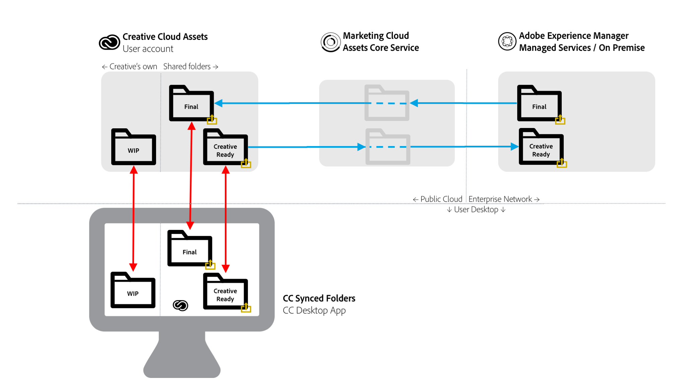

# [!DNL Adobe Experience Manager] to [!DNL Adobe Creative Cloud] 폴더 공유 {#aem-to-creative-cloud-folder-sharing-best-practices}

>[!CAUTION]
>
>다음 [!DNL Experience Manager] to [!DNL Creative Cloud] 폴더 공유 기능은 더 이상 사용되지 않습니다. Adobe은 다음과 같은 최신 기능을 사용하는 것이 좋습니다 [Adobe 자산 링크](https://helpx.adobe.com/enterprise/admin-guide.html/enterprise/using/adobe-asset-link.ug.html) 또는 [Experience Manager 데스크탑 앱](https://experienceleague.adobe.com/docs/experience-manager-desktop-app/using/using.html). 추가 정보 [Experience Manager 및 Creative Cloud 통합 우수 사례](/help/assets/aem-cc-integration-best-practices.md).

[!DNL Adobe Experience Manager] 는 사용자가 [!DNL Assets] 의 사용자와 폴더를 공유하려면 [!DNL Adobe Creative Cloud] 앱에서 공유 폴더로 사용할 수 있습니다 [!DNL Adobe Creative Cloud] 자산 서비스. 이 기능은 크리에이티브 팀과 [!DNL Assets] 특히 크리에이티브 사용자가 [!DNL Assets] 배포(엔터프라이즈 네트워크에 있지 않음)

이 유형의 통합은 다음 사용 사례에서 사용할 수 있습니다. 특히 액세스 권한이 없는 사용자와 작업하는 경우 사용할 수 있습니다 [!DNL Assets]:

* [!DNL Assets] 사용자는 특정 디지털 자산 세트를 [!DNL Adobe Creative Cloud] 파일(예: 새로운 마케팅 활동에 대해 디자인용으로 승인된 자산의 크리에이티브 개요 및 세트)을 만들 수 있습니다.
* [!DNL Assets] 사용자는 [!DNL Adobe Creative Cloud] 앱 사용자.

>[!NOTE]
>
>이 문서를 읽기 전에 전체 문서를 검토할 수 있습니다 [Experience Manager 및 Creative Cloud 통합 우수 사례](/help/assets/aem-cc-integration-best-practices.md) 를 참조하십시오.

## 개요 {#overview}

[!DNL Experience Manager] to [!DNL Creative Cloud] 폴더 공유는 폴더 및 파일 간의 서버측 공유에 의존합니다 [!DNL Assets] 및 [!DNL Creative Cloud] 계정. 을 사용하는 크리에이티브 전문가 [!DNL Creative Cloud] 데스크탑 앱의 경우 공유 폴더를 디스크에서 직접 사용 가능하게 만들 수도 있습니다 [!DNL Adobe CreativeSync] 기술.

다음 다이어그램은 통합에 대한 개요를 제공합니다.

통합에는 다음 요소가 포함됩니다.

* **[!DNL Experience Manager Assets]** 엔터프라이즈 네트워크(관리 서비스 또는 온-프레미스)에 배포됩니다. 여기에서 폴더 공유가 시작됩니다.
* **[!DNL Adobe Marketing Cloud Assets]핵심 서비스**: 다음 사이의 매개체 역할을 합니다 [!DNL Experience Manager] 및 [!DNL Creative Cloud] 스토리지 서비스. 통합을 사용하는 조직의 관리자는 Marketing Cloud 조직과 [!DNL Assets] 배포. 또한 [승인된 Creative Cloud 협력자 목록 정의](https://experienceleague.adobe.com/docs/core-services/interface/assets/t-admin-add-cc-user.html), [!DNL Assets] 사용자는 추가 보안을 위해 폴더를 공유할 수 있습니다.

* **[!DNL Creative Cloud]Assets 웹 서비스** (저장 및 [!DNL Creative Cloud] 파일 웹 UI): 여기에서 Creative Cloud 앱 사용자를 [!DNL Assets] 폴더가 공유되어 있으면 초대를 수락하고 Creative Cloud 계정 저장소에서 폴더를 볼 수 있습니다.
* **Creative Cloud 데스크탑 앱**: (선택 사항) Creative User의 데스크탑에서 [!DNL Creative Cloud] 자산 저장.

## 특성 및 제한 사항 {#characteristics-and-limitations}

* **변경 사항의 단방향 전파:** 파일 변경 내용은 시스템([!DNL Experience Manager] 또는 [!DNL Creative Cloud Assets]). 자산을 원래 생성(업로드함)한 위치에서 생성합니다. 통합은 두 시스템 간에 완전히 자동화된 양방향 동기화를 제공하지 않습니다.
* **버전 관리:**

   * [!DNL Experience Manager] 파일이 [!DNL Experience Manager] 여기에서 업데이트된 내용을 확인할 수 있습니다.
   * [!DNL Creative Cloud] 자산은 자체 자산을 제공합니다 [버전 관리 기능](https://helpx.adobe.com/creative-cloud/help/versioning-faq.html) 진행 중인 작업 업데이트(기본적으로 최대 10일 동안 업데이트 저장)를 대상으로 합니다.

* **공간 제한:** 교환된 파일의 크기와 볼륨은 [Creative Cloud 자산 할당량](https://helpx.adobe.com/creative-cloud/kb/file-storage-quota.html) 크리에이티브 사용자의 경우(구독 수준에 따라 다름) 및 최대 파일 크기가 5GB로 제한됩니다. 조직은 Adobe Marketing Cloud Assets 핵심 서비스에 있는 자산 할당량에 의해 공간이 추가로 제한됩니다.

* **공간 요구 사항:** 공유 폴더의 파일도 물리적으로 [!DNL Experience Manager] 그리고 [!DNL Creative Cloud] 계정, 캐시된 복사본을 [!DNL Marketing Cloud Assets] 핵심 서비스.
* **네트워킹 및 대역폭:** 공유 폴더의 파일과 모든 업데이트는 시스템 간 네트워크를 통해 전송되어야 합니다. 관련 파일 및 업데이트만 공유되도록 해야 합니다.
* **폴더 유형**: 공유 [!DNL Assets] 유형의 폴더 `sling:OrderedFolder`는에서 공유 컨텍스트에서 지원되지 않습니다 [!DNL Adobe Marketing Cloud]. 폴더를 공유하려면에서 만들 때 [!DNL Assets]를 선택하지 않습니다 [!UICONTROL 주문] 선택 사항입니다.

## 우수 사례 {#best-practices}

활용 우수 사례 [!DNL Experience Manager] to [!DNL Creative Cloud] 폴더 공유 대상:

* **볼륨 고려 사항:** [!DNL Experience Manager] 및 [!DNL Creative Cloud] 폴더 공유는 특정 캠페인이나 활동과 관련된 작은 파일 수를 공유하는 데 사용해야 합니다. 조직의 승인된 모든 자산과 같이 더 큰 자산 세트를 공유하려면 다른 배포 방법(예: [!DNL Assets Brand Portal]) 또는 [!DNL Experience Manager] 데스크탑 앱.
* **딥 계층 공유 방지:** 공유는 재귀적으로 작동하며 선택적 공유 취소를 허용하지 않습니다. 일반적으로 하위 폴더가 없거나 하위 폴더 레벨과 같이 매우 낮은 계층 구조를 가진 폴더만 공유로 간주해야 합니다.
* **단방향 공유를 위한 별도의 폴더:** 최종 자산을 공유하는 데 별도의 폴더를 사용해야 합니다. [!DNL Assets] to [!DNL Creative Cloud] 파일을 검색하고, [!DNL Creative Cloud] 파일 위치 [!DNL Assets]. 이러한 폴더에 대한 올바른 이름 지정 규칙을 함께 사용하면 [!DNL Assets] 및 [!DNL Creative Cloud] 사용자와 유사합니다.
* **공유 폴더에서 WIP 방지:** 진행 중인 작업에 공유 폴더를 사용하지 마십시오. 파일을 자주 변경해야 하는 작업을 수행하려면 Creative Cloud 파일의 별도의 폴더를 사용하십시오.
* **공유 폴더 외부에서 새 작업 시작:** 새 디자인(크리에이티브 파일)은 Creative Cloud 파일의 별도의 WIP 폴더에서 시작하고, 새로운 디자인(크리에이티브 파일)을 공유할 준비가 되면 시작해야 합니다 [!DNL Assets] 사용자는 공유 폴더로 이동하거나 저장해야 합니다.
* **공유 구조 간소화:** 관리가 용이한 운영 설정을 위해서는 공유 구조를 단순화하는 것이 좋습니다. 모든 크리에이티브 사용자와 공유하는 대신 [!DNL Assets] 폴더는 크리에이티브 디렉터 또는 팀 관리자와 같은 팀 담당자에게만 공유해야 합니다. 크리에이티브 측의 관리자는 최종 자산을 수신하고, 작업 지정을 결정한 다음, 디자이너가 WIP 자산에서 자신의 Creative Cloud 계정으로 작업할 수 있도록 합니다. Creative Cloud 공동 작업 기능을 사용하여 작업을 조정하고 마지막으로 공유할 준비가 된 자산을 선택하고 다시 배치할 수 있습니다 [!DNL Assets] 을 만들 수 있는 공유 폴더로 이동합니다.

다음 다이어그램은 의 기존 최종 자산을 기반으로 새 디자인을 만드는 예제 구성을 보여줍니다. [!DNL Assets].

