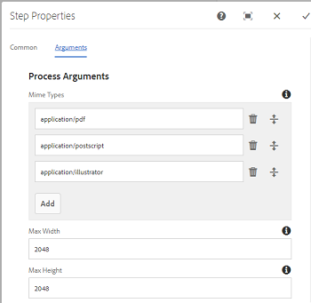

# PDF 래스터라이저 사용 {#using-pdf-rasterizer}

컨텐츠가 많은 대용량 PDF 또는 AI 파일을 [!DNL Adobe Experience Manager Assets]에 업로드할 때 기본 라이브러리가 정확한 출력을 생성하지 않을 수 있습니다. Adobe의 PDF 래스터라이저 라이브러리는 기본 라이브러리의 출력과 비교할 때 보다 안정적이고 정확한 출력을 생성할 수 있습니다. Adobe은 다음과 같은 경우 PDF 래스터라이저 라이브러리를 사용할 것을 권장합니다.

Adobe은 다음에 대해 PDF 래스터라이저 라이브러리를 사용할 것을 권장합니다.

* 무겁고 콘텐츠 집약적인 AI 파일 또는 PDF 파일.
* 기본적으로 생성되지 않는 썸네일이 있는 AI 파일 및 PDF 파일.
* PMS(Pantone Matching System) 색상이 있는 AI 파일.

PDF 래스터라이저를 사용하여 생성된 축소판 및 미리 보기는 기본 제공 출력에 비해 품질이 우수하므로 여러 장치에서 일관된 보기 환경을 제공합니다. Adobe PDF 래스터라이저 라이브러리는 색상 공간 변환을 지원하지 않습니다. 소스 파일의 색상 공간에 관계없이 항상 RGB에 출력됩니다.

1. [소프트웨어 배포](https://experience.adobe.com/#/downloads/content/software-distribution/en/aem.html?package=/content/software-distribution/en/details.html/content/dam/aem/public/adobe/packages/cq650/product/assets/aem-assets-pdf-rasterizer-pkg-4.6.zip)에서 [!DNL Adobe Experience Manager] 배포에 PDF 래스터라이저 패키지를 설치하십시오.

   >[!NOTE]
   >
   >PDF 래스터라이저 라이브러리는 Windows 및 Linux®에서만 사용할 수 있습니다.

1. `https://[aem_server]:[port]/workflow`에서 [!DNL Assets] 워크플로 콘솔에 액세스합니다. [!UICONTROL DAM 자산 업데이트] 워크플로우를 엽니다.

1. 기본 방법을 사용하여 PDF 파일 및 AI 파일에 대한 썸네일 및 웹 렌디션을 생성하지 못하게 하려면 다음 단계를 수행하십시오.

   * **[!UICONTROL 썸네일 처리]** 단계를 열고 필요에 따라 **[!UICONTROL 썸네일]** 탭 아래의 **[!UICONTROL MIME 유형 건너뛰기]** 필드에 `application/pdf` 또는 `application/postscript`을(를) 추가합니다.

   

   * **[!UICONTROL 웹 사용 이미지]** 탭에서 요구 사항에 따라 **[!UICONTROL 목록 건너뛰기]**&#x200B;에 `application/pdf` 또는 `application/postscript`을(를) 추가합니다.

   

1. **[!UICONTROL PDF/AI 이미지 미리 보기 렌디션 래스터화]** 단계를 열고 미리 보기 이미지 렌디션의 기본 생성을 건너뛸 MIME 형식을 제거합니다. 예를 들어 **[!UICONTROL MIME 형식]** 목록에서 MIME 형식 `application/pdf`, `application/postscript` 또는 `application/illustrator`을(를) 제거합니다.

   

1. **[!UICONTROL PDF 래스터라이저 처리기]** 단계를 사이드 패널에서 **[!UICONTROL 축소판 처리]** 단계 아래로 드래그합니다.
1. **[!UICONTROL PDF 래스터라이저 처리기]** 단계에 대해 다음 인수를 구성합니다.

   * MIME 유형: `application/pdf` 또는 `application/postscript`
   * 명령: `PDFRasterizer -d -s 1280 -t PNG -i ${file}`
   * 썸네일 크기 추가: 319:319, 140:100, 48:48. 필요한 경우 사용자 정의 썸네일 구성을 추가합니다.

   `PDFRasterizer` 명령의 명령줄 인수에는 다음 항목이 포함될 수 있습니다.

   * `-d`: 텍스트, 벡터 아트워크 및 이미지의 매끄러운 렌더링을 활성화하는 플래그. 더 좋은 품질의 이미지를 만듭니다. 그러나 이 매개 변수를 포함하면 명령이 느리게 실행되고 이미지 크기가 커집니다.

   * `-s`: 최대 이미지 차원(높이 또는 너비). 각 페이지에 대해 DPI로 변환됩니다. 페이지 크기가 다른 경우 각 페이지의 크기가 다른 크기별로 확장될 수 있습니다. 기본값은 실제 페이지 크기입니다.

   * `-t`: 출력 이미지 형식입니다. 유효한 유형은 JPEG, PNG, GIF 및 BMP입니다. 기본값은 JPEG 입니다.

   * `-i`: 입력 PDF 경로. 필수 매개 변수입니다.

   * `-h`: 도움말

1. 중간 렌디션을 삭제하려면 **[!UICONTROL 생성된 렌디션 삭제]**&#x200B;를 선택합니다.
1. PDF 래스터라이저가 웹 렌디션을 생성하도록 하려면 **[!UICONTROL 웹 렌디션 생성]**&#x200B;을 선택합니다.

   

1. **[!UICONTROL 웹 사용 이미지]** 탭에서 설정을 지정하십시오.

   

1. 워크플로우를 저장합니다.
1. PDF 래스터라이저가 PDF 라이브러리를 사용하여 PDF 페이지를 처리할 수 있도록 하려면 [!UICONTROL Workflow] 콘솔에서 **[!UICONTROL DAM Process Subasset]** 모델을 엽니다.
1. 사이드 패널에서 **[!UICONTROL 웹 사용 이미지 렌디션 만들기]** 단계 아래의 래스터라이저 PDF 단계를 드래그합니다.
1. **[!UICONTROL PDF 래스터라이저 처리기]** 단계에 대해 다음 인수를 구성합니다.

   * MIME 유형: `application/pdf` 또는 `application/postscript`
   * 명령: `PDFRasterizer -d -s 1280 -t PNG -i ${file}`
   * 썸네일 크기 추가: `319:319`, `140:100`, `48:48`. 필요에 따라 사용자 정의 썸네일 구성을 추가합니다.

   `PDFRasterizer` 명령의 명령줄 인수에는 다음 항목이 포함될 수 있습니다.

   * `-d`: 텍스트, 벡터 아트워크 및 이미지의 매끄러운 렌더링을 활성화하는 플래그. 더 좋은 품질의 이미지를 만듭니다. 그러나 이 매개 변수를 포함하면 명령이 느리게 실행되고 이미지 크기가 커집니다.

   * `-s`: 최대 이미지 차원(높이 또는 너비). 각 페이지에 대해 DPI로 변환됩니다. 페이지 크기가 다른 경우 각 페이지의 크기가 다른 크기별로 확장될 수 있습니다. 기본값은 실제 페이지 크기입니다.

   * `-t`: 출력 이미지 형식입니다. 유효한 유형은 JPEG, PNG, GIF 및 BMP입니다. 기본값은 JPEG 입니다.

   * `-i`: 입력 PDF 경로. 필수 매개 변수입니다.

   * `-h`: 도움말

1. 중간 렌디션을 삭제하려면 **[!UICONTROL 생성된 렌디션 삭제]**&#x200B;를 선택합니다.
1. PDF 래스터라이저가 웹 렌디션을 생성하도록 하려면 **[!UICONTROL 웹 렌디션 생성]**&#x200B;을 선택합니다.

   

1. **[!UICONTROL 웹 사용 이미지]** 탭에서 설정을 지정하십시오.

   

1. 워크플로우를 저장합니다.
1. PDF 파일 또는 AI 파일을 [!DNL Experience Manager Assets]에 업로드합니다. PDF 래스터라이저는 파일의 썸네일과 웹 렌디션을 생성합니다.
