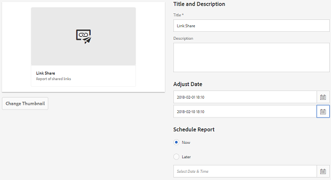

# 자산 보고서 {#asset-reports}

자산 보고는 Adobe Experience Manager 자산 배포의 유용성을 평가하는 주요 도구입니다. 자산을 사용하여 디지털 자산에 대한 다양한 보고서를 생성할 수 있습니다. 이 보고서에서는 시스템 사용량, 사용자가 자산과 상호 작용하는 방법, 다운로드 및 공유되는 자산에 대한 유용한 정보를 제공합니다.

보고서의 정보를 사용하여 주요 성공 지표를 추출하여 기업 내 및 고객별 자산의 채택을 측정합니다.

자산 보고 프레임워크는 Sling 작업을 사용하여 보고서 요청을 정렬된 방식으로 비동기식으로 처리합니다. 대형 저장소에 맞게 확장 가능합니다. 비동기 보고서 처리는 보고서가 생성되는 효율성과 속도를 높입니다.

보고서 관리 인터페이스는 직관적이며, 보관된 보고서에 액세스하고 보고서 실행 상태(성공, 실패 및 큐에 있음)를 볼 수 있도록 세부적으로 분류된 옵션과 컨트롤을 포함합니다.

보고서가 생성되면 이메일(선택 사항) 및 받은 편지함 알림을 통해 사용자에게 알립니다. 이전에 생성된 모든 보고서가 표시되는 보고서 목록 페이지에서 보고서를 보거나, 다운로드하거나, 삭제할 수 있습니다.

## 보고서 생성 {#generate-reports}

Adobe Experience Manager Assets는 다음과 같은 표준 보고서를 생성합니다.

* 업로드
* 다운로드
* 만료
* 수정
* 게시
* 브랜드 포털 게시
* 디스크 사용량
* 파일
* 공유 링크

Adobe Experience Manager 관리자는 구현을 위해 이러한 보고서를 손쉽게 생성하고 사용자 정의할 수 있습니다. 관리자는 다음 단계에 따라 보고서를 생성할 수 있습니다.

1. Experience Manager 인터페이스에서 **[!UICONTROL 도구]** > 자산 **[!UICONTROL > 보고서]** 를 **[!UICONTROL 클릭합니다]**.
   

1. 자산 [!UICONTROL 보고서] 페이지의 도구 모음에서 **[!UICONTROL 만들기를]** 클릭합니다.
1. 보고서 **[!UICONTROL 만들기]** 페이지에서 만들 보고서를 선택하고 다음을 **[!UICONTROL 클릭합니다]**.

   

   >[!NOTE]
   >
   >다운로드한 **[!UICONTROL 자산]** 보고서를 생성하려면 먼저 자산 다운로드 서비스가 활성화되어 있는지 확인하십시오. 웹 콘솔(`https://[aem_server]:[port]/system/console/configMgr`)에서 **[!UICONTROL 일 CQ DAM 이벤트 레코더]** 구성을 열고 이벤트 유형 **[!UICONTROL 에서 아직 선택되지 않은 경우 자산 다운로드(DOWNLOADED)]** 옵션을 선택합니다.

   >[!NOTE]
   >
   >기본적으로 컨텐츠 조각 및 링크 공유는 자산 다운로드 보고서에 포함됩니다. 링크 공유 보고서를 만들거나 콘텐트 조각을 다운로드 보고서에서 제외하려면 적절한 옵션을 선택합니다.

1. 보고서가 저장되는 CRX 저장소의 제목, 설명, 축소판 및 폴더 경로와 같은 보고서 세부 사항을 구성합니다. 기본적으로 폴더 경로는 입니다 `/content/dam`. 다른 경로를 지정할 수 있습니다.

   

   보고서의 날짜 범위를 선택합니다.

   지금 또는 미래 날짜와 시간에 보고서를 생성하도록 선택할 수 있습니다.

   >[!NOTE]
   >
   >나중에 보고서를 예약하도록 선택하는 경우 날짜 및 시간 필드에 날짜와 시간을 지정해야 합니다. 값을 지정하지 않으면 보고서 엔진은 이 값을 즉시 생성할 보고서로 처리합니다.

   구성 필드는 만드는 보고서 유형에 따라 다를 수 있습니다. 예를 들어, **[!UICONTROL 디스크 사용량]** 보고서는 자산에 사용되는 디스크 공간을 계산할 때 자산 표현물을 포함하는 옵션을 제공합니다. 디스크 사용량 계산을 위해 하위 폴더에 자산을 포함하거나 제외하도록 선택할 수 있습니다.

   >[!NOTE]
   >
   >디스크 **[!UICONTROL 사용량]** 보고서에는 현재 디스크 공간 사용만을 나타내므로 날짜 범위 필드가 포함되지 않습니다.

   

   파일 **[!UICONTROL 보고서를]** 만들 때 하위 폴더를 포함/제외할 수 있습니다. 그러나 이 보고서에 대한 자산 표현물은 포함할 수 없습니다.

   

   링크 **[!UICONTROL 공유]** 보고서는 자산 내에서 외부 사용자와 공유되는 자산에 대한 URL을 표시합니다. 여기에는 자산을 공유한 사용자의 이메일 ID, 자산이 공유되는 사용자의 이메일 ID, 링크에 대한 공유 날짜 및 만료 날짜가 포함됩니다. 열을 사용자 지정할 수 없습니다.

   링크 **[!UICONTROL 공유]** 보고서는 하위 폴더 및 변환에 대한 옵션을 포함하지 않습니다. 하위 폴더 및 변환은 아래에 표시되는 공유 URL만 게시하기 때문입니다 `/var/dam/share`.

   

1. 도구 모음 **[!UICONTROL 에서]** 다음을 클릭합니다.

1. 열 **[!UICONTROL 구성]** 페이지에서 기본적으로 보고서에 일부 열이 표시되도록 선택됩니다. 열을 더 선택할 수 있습니다. 보고서에서 제외하려면 선택한 열을 선택 취소합니다.

   

   사용자 지정 열 이름 또는 속성 경로를 표시하려면 CRX의 jcr:content 노드 아래에 자산 바이너리에 대한 속성을 구성합니다. 또는 속성 경로 선택기를 통해 추가합니다.

   

1. 도구 **[!UICONTROL 모음에서]** 만들기를 클릭합니다. 보고서 생성이 시작되었음을 알리는 메시지가 표시됩니다.
1. 자산 보고서 페이지에서 보고서 생성 상태는 보고서 작업의 현재 상태를 기반으로 합니다(예: 성공, 실패, 대기 중 또는 예약됨). 동일한 상태가 알림 받은 편지함에 나타납니다.보고서 페이지를 보려면 보고서 링크를 클릭하십시오. 또는 보고서를 선택하고 도구 모음에서 **[!UICONTROL 보기를]** 클릭합니다.

   

   도구 모음에서 **[!UICONTROL 다운로드를]** 클릭하여 보고서를 CSV 형식으로 다운로드합니다.

## 사용자 정의 열 추가 {#add-custom-columns}

다음 보고서에 사용자 지정 열을 추가하여 사용자 지정 요구 사항에 대한 추가 데이터를 표시할 수 있습니다.

* 업로드
* 다운로드
* 만료
* 수정
* 게시
* 브랜드 포털 게시
* 파일

이러한 보고서에 사용자 지정 열을 추가하려면 다음 단계를 따르십시오.

1. Experience Manager 인터페이스에서 **[!UICONTROL 도구]** > 자산 **[!UICONTROL > 보고서]** 를 **[!UICONTROL 클릭합니다]**.
1. 자산 [!UICONTROL 보고서] 페이지의 도구 모음에서 **[!UICONTROL 만들기를]** 클릭합니다.

1. 보고서 **[!UICONTROL 만들기]** 페이지에서 만들 보고서를 선택하고 다음을 **[!UICONTROL 클릭합니다]**.
1. 제목, 설명, 축소판, 폴더 경로 및 날짜 범위와 같은 보고서 세부 사항을 적절히 구성합니다.

1. 사용자 지정 열을 표시하려면 [사용자 지정 열] 아래에서 열 이름을 **[!UICONTROL 지정합니다]**.

   

1. 속성 경로 선택기를 사용하여 CRXDE의 `jcr:content` 노드 아래에 속성 경로를 추가합니다. 또는 속성 경로 필드에 경로를 입력합니다.

   

   사용자 지정 열을 더 추가하려면 **[!UICONTROL 추가를]** 클릭하고 5단계와 6단계를 반복합니다.

1. 도구 **[!UICONTROL 모음에서]** 만들기를 클릭합니다. 보고서 생성이 시작되었음을 알리는 메시지가 표시됩니다.

## 제거 서비스 구성 {#configure-purging-service}

더 이상 필요하지 않은 보고서를 제거하려면 웹 콘솔에서 DAM 보고서 삭제 서비스를 구성하여 해당 수량 및 연령을 기준으로 기존 보고서를 삭제합니다.

1. 에서 웹 콘솔(구성 관리자)에 액세스합니다 `https://[aem_server]:[port]/system/console/configMgr`.
1. DAM 보고서 **[!UICONTROL 삭제 서비스]** 구성을 엽니다.
1. 필드에서 제거 서비스의 빈도(시간 간격)를 `scheduler.expression.name` 지정합니다. 보고서에 대한 연령 및 수량 임계값을 구성할 수도 있습니다.
1. 변경 사항을 저장합니다.
