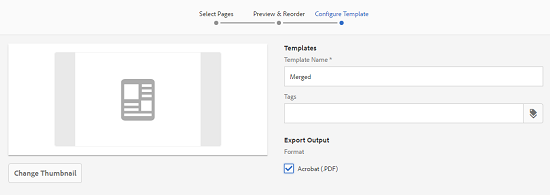

# 자산 템플릿 {#asset-templates}

에셋 템플릿은 디지털 및 인쇄 미디어에 시각적으로 풍부한 컨텐츠를 신속하게 재활용할 수 있는 에셋의 특별한 클래스입니다. 자산 템플릿에는 고정 메시징 섹션과 편집 가능한 섹션이 포함되어 있습니다. 고정 메시징 섹션에는 브랜드 로고 및 편집을 위해 비활성화된 저작권 정보와 같은 독점 컨텐츠가 포함될 수 있습니다. 편집 가능한 섹션에는 메시지를 사용자 지정하기 위해 편집할 수 있는 필드에 시각적 컨텐츠와 텍스트 컨텐츠가 포함될 수 있습니다.

글로벌 사이니지를 보호하면서 제한된 편집 작업을 할 수 있는 유연성을 갖춘 에셋 템플릿을 사용하면 콘텐츠를 빠르게 조정하고 다양한 기능을 위해 컨텐츠를 가공물로 배포할 수 있는 이상적인 기본 구성 요소를 만들 수 있습니다. 컨텐츠를 재활용하면 인쇄 및 디지털 채널을 관리하는 데 소요되는 비용을 줄일 수 있고 이러한 채널에서 전체적이고 일관된 경험을 제공할 수 있습니다.

마케터는 [!DNL Experience Manager Assets] 내에서 템플릿을 저장 및 관리할 수 있고 단일 기본 템플릿을 사용하여 개인화된 여러 인쇄 경험을 간편하게 만들 수 있습니다. 브로셔, 전단지, 엽서, 명함 등 다양한 유형의 마케팅 자료를 만들어 고객에게 마케팅 메시지를 신속하게 전달할 수 있습니다. 또한 기존 또는 새로운 인쇄 출력에서 여러 페이지의 인쇄 출력을 취합할 수 있습니다. 무엇보다도 디지털 경험과 인쇄 경험을 동시에 간편하게 전달하여 사용자에게 일관된 통합 경험을 제공할 수 있습니다.

자산 템플릿이 대부분 [!DNL Adobe InDesign] 파일이지만 [!DNL Adobe InDesign]에 대한 숙련도는 별의 아티팩트를 만드는 데 장애가 되지 않습니다. 카탈로그를 만들 때 필요한 제품 필드와 [!DNL Adobe InDesign] 템플릿의 필드를 매핑할 필요는 없습니다. 웹 인터페이스에서 직접 WYSIWYG 모드에서 템플릿을 편집할 수 있습니다. 그러나 [!DNL Adobe InDesign]에서 편집 변경 내용을 처리하려면 먼저 [!DNL Experience Manager Assets]을(를) [!DNL Adobe InDesign Server]와 통합하도록 구성해야 합니다.

웹 인터페이스에서 [!DNL Adobe InDesign] 템플릿을 편집할 수 있으므로 크리에이티브 및 마케팅 담당자 간의 공동 작업을 향상시킬 수 있습니다. 콘텐츠 제작 속도가 향상되어 마케팅 자료를 출시할 시간을 단축할 수 있습니다.

자산 템플릿을 사용하여 다음을 수행할 수 있습니다.

* 웹 인터페이스에서 편집 가능한 템플릿 필드를 수정합니다.
* 글꼴 크기, 스타일 및 태그 수준의 문자 등 텍스트의 기본 스타일을 제어할 수 있습니다.
* 컨텐츠 선택기를 사용하여 템플릿 내의 이미지를 변경합니다.
* 템플릿 편집 내용을 미리 볼 수 있습니다.
* 여러 템플릿 파일을 병합하여 여러 페이지로 된 아티팩트를 만들 수 있습니다.

보조 템플릿의 템플릿을 선택하면 [!DNL Experience Manager Assets]에서 편집할 수 있는 템플릿 복사본이 만들어집니다. 원본 템플릿은 그대로 유지되므로 글로벌 사이니지는 그대로 유지되고 브랜드 일관성을 유지하기 위해 다시 사용할 수 있습니다.

업데이트된 파일을 INDD, PDF 또는 JPG 형식으로 상위 폴더 내에 내보낼 수 있습니다. 이러한 형식의 출력을 로컬 파일 시스템에 다운로드할 수도 있습니다.

## 자료 {#creating-a-collateral} 만들기

향후 캠페인을 위해 브로셔, 전단지 및 광고와 같은 디지털 인쇄 가능한 자료를 만들고 전 세계적으로 아울렛 매장과 공유하는 시나리오를 생각해 보십시오. 템플릿을 기반으로 마케팅 자료를 만들어 다양한 채널에서 일관된 고객 경험을 제공할 수 있습니다. 디자이너는 [!DNL InDesign]과 같은 크리에이티브 솔루션을 사용하여 캠페인 템플릿(단일 페이지 또는 다중 페이지)을 만들고 템플릿을 [!DNL Experience Manager Assets]에 업로드할 수 있습니다. 자료를 만들기 전에 하나 이상의 INDD 템플릿이 미리 [!DNL Experience Manager]에 업로드되어 사용할 수 있도록 하십시오.

1. [!DNL Experience Manager] 인터페이스에서 [!UICONTROL 자산]을 클릭합니다.

1. 옵션에서 **[!UICONTROL 템플릿]**&#x200B;을 선택합니다.

   

1. **[!UICONTROL 만들기]**&#x200B;를 클릭한 다음 메뉴에서 만들 자료를 선택합니다. 예를 들어 **[!UICONTROL 브로셔]**&#x200B;를 선택합니다.

   

1. 하나 이상의 INDD 템플릿을 업로드하여 [!DNL Experience Manager]에 미리 사용할 수 있도록 하십시오. 브로셔에 사용할 템플릿을 선택하고 **[!UICONTROL 다음]**&#x200B;을 클릭합니다.
1. 브로셔의 이름과 선택적 설명을 지정합니다.

   

1. (선택 사항) **[!UICONTROL 태그]**&#x200B;를 클릭하고 브로셔에 대해 하나 이상의 태그를 선택합니다. **[!UICONTROL 확인]**&#x200B;을 클릭하여 선택을 확인합니다.
1. **[!UICONTROL 만들기]**&#x200B;를 클릭합니다. 새 브로셔가 만들어졌는지 확인하는 대화 상자가 표시됩니다. **[!UICONTROL 열기]**&#x200B;를 클릭하여 브로셔를 편집 모드로 엽니다.

   <!-- -->

   또는 대화 상자를 닫고 시작했던 템플릿 페이지의 폴더로 이동하여 만든 브로셔를 확인합니다. 카드 보기의 축소판에 자료 유형이 표시됩니다. 예를 들어 이 경우 축소판에 [!UICONTROL 브로셔]라는 단어가 표시됩니다.

   

## 자료 편집 {#editing-a-collateral}

자료를 만든 직후 자료를 편집할 수 있습니다. 또는 [!UICONTROL 템플릿] 페이지 또는 자산 페이지에서 엽니다.

1. 편집할 자료를 열려면 다음 중 하나를 수행합니다.

   * [자료 만들기](/help/assets/asset-templates.md#creating-a-collateral)의 7단계에서 만든 자료(이 경우에는 브로셔)를 엽니다.
   * 템플릿 페이지에서 자료를 만든 폴더로 이동하고 자료 축소판에서 [!UICONTROL 편집] 빠른 작업을 클릭합니다.
   * 보조 자료의 자산 페이지에서 도구 모음에서 **[!UICONTROL 편집]**&#x200B;을 클릭합니다.
   * 자료를 선택하고 도구 모음에서 **[!UICONTROL 편집]**&#x200B;을 클릭합니다.

   <!-- -->

   자산 파인더와 텍스트 편집기가 페이지 왼쪽에 표시됩니다. 텍스트 편집기는 기본적으로 열려 있습니다.

   텍스트 편집기를 사용하여 텍스트 필드에 표시할 텍스트를 수정할 수 있습니다. 태그 수준에서 글꼴 크기, 스타일, 색상 및 문자를 수정할 수 있습니다.

   자산 파인더를 사용하면 [!DNL Experience Manager Assets] 내에서 이미지를 찾거나 검색하고 템플릿의 편집 가능한 이미지를 원하는 이미지로 바꿀 수 있습니다.

   

   편집 가능 영역이 오른쪽에 표시됩니다. [!DNL Experience Manager Assets]에서 필드를 편집할 수 있으려면 템플릿의 해당 필드에 [!DNL InDesign]에 태그가 지정되어 있어야 합니다. 즉, [!DNL InDesign]에서 편집 가능한 것으로 표시되어야 합니다.

   >[!NOTE]
   >
   >[!DNL Experience Manager] 배포가 [!DNL InDesign Server]과 통합되어 [!DNL InDesign] 템플릿에서 데이터를 추출하고 편집할 수 있도록 [!DNL Experience Manager Assets]를 활성화합니다. 자세한 내용은 [InDesign Server](/help/assets/indesign.md)에 Experience Manager 자산 통합을 참조하십시오.

1. 편집 가능한 필드의 텍스트를 수정하려면 편집 가능한 필드 목록에서 텍스트 필드를 클릭하고 필드의 텍스트를 편집합니다.

   

   제공된 옵션을 사용하여 글꼴 스타일, 색상 및 크기 등의 텍스트 속성을 편집할 수 있습니다.

1. 텍스트 변경 내용을 미리 보려면 **[!UICONTROL 미리 보기]**&#x200B;를 클릭합니다.

1. 이미지를 교체하려면 **[!UICONTROL 자산 파인더]** 을 클릭합니다.

1. 편집 가능한 필드 목록에서 이미지 필드를 선택한 다음 자산 선택기에서 원하는 이미지를 편집 가능한 필드로 드래그합니다.

   

   키워드, 태그 및 게시 상태를 기반으로 이미지를 검색할 수도 있습니다. [!DNL Experience Manager Assets] 저장소를 탐색하고 원하는 이미지의 위치로 이동할 수 있습니다.

   

1. 이미지를 미리 보려면 **[!UICONTROL 미리 보기]**&#x200B;를 클릭합니다.
1. 다중 페이지 제공 자료의 특정 페이지를 편집하려면 하단에 있는 페이지 탐색기를 사용합니다.

1. 도구 모음에서 **[!UICONTROL 미리 보기]**&#x200B;를 클릭하여 모든 변경 내용을 미리 봅니다. 자료에 대한 편집 변경 내용을 저장하려면 **[!UICONTROL 완료]**&#x200B;를 클릭합니다.

   >[!NOTE]
   >
   >미리 보기 및 완료 옵션은 담보물 내의 편집 가능한 이미지 필드에 누락된 아이콘이 없는 경우에만 활성화됩니다. 자료에 누락된 아이콘이 있는 경우는 [!DNL Experience Manager]에서 [!DNL InDesign] 템플릿의 이미지를 확인할 수 없기 때문입니다. 일반적으로 다음 경우 [!DNL Experience Manager]에서 이미지를 확인할 수 없습니다.
   >
   >* 이미지는 기본 [!DNL InDesign] 템플릿에 포함되지 않습니다.
   >* 이미지는 로컬 파일 시스템에서 연결됩니다.

   >
   >[!DNL Experience Manager]에서 이미지를 해결하려면 다음을 수행합니다.
   >
   >* [!DNL InDesign] 템플릿을 만드는 동안 이미지 포함(링크 및 포함된 그래픽 ](https://helpx.adobe.com/indesign/using/graphics-links.html) 참조).[
   >* [!DNL Experience Manager]을(를) 로컬 파일 시스템에 마운트한 다음 누락된 아이콘을 [!DNL Experience Manager]의 기존 에셋에 매핑합니다.

   >
   >[!DNL InDesign] 문서 작업에 대한 자세한 내용은 [Experience Manager](https://helpx.adobe.com/experience-manager/kb/best-practices-idd-docs-aem.html)에서 InDesign 문서를 사용하여 작업하는 모범 사례를 참조하십시오.

1. 브로셔에 대한 PDF 변환을 생성하려면 대화 상자에서 Acrobat 옵션을 선택한 다음 **[!UICONTROL 계속]**&#x200B;을 클릭합니다.
1. 보조 자료는 처음 사용한 폴더에 만들어집니다. 변환을 보려면, 자료를 열고 GlobalNav 목록에서 **[!UICONTROL 표현물]**&#x200B;을 선택합니다.

   

1. 변환 목록에서 PDF 변환을 클릭하여 PDF 파일을 다운로드합니다. PDF 파일을 열어 자료를 검토합니다.

   

## 자료 병합 {#merge-collateral}

1. [!DNL Experience Manager] 인터페이스에서 탐색 페이지의 [!UICONTROL 자산]을 클릭합니다.

1. 옵션에서 **[!UICONTROL 템플릿]**&#x200B;을 선택합니다.

1. **[!UICONTROL 만들기]**&#x200B;를 클릭하고 메뉴에서 **[!UICONTROL 병합]**&#x200B;을 선택합니다.

   

1. [!UICONTROL 템플릿 병합] 페이지에서 **[!UICONTROL 병합]** 를 클릭합니다.

1. 병합할 자료의 위치로 이동하고 병합할 자료의 축소판을 클릭하여 선택합니다.

   

   Omnisearch 상자에서 템플릿을 검색할 수도 있습니다.

   [!DNL Experience Manager Assets] 저장소 또는 컬렉션을 탐색하고 원하는 템플릿의 위치로 이동한 다음 병합할 템플릿을 선택할 수 있습니다.

   다양한 필터를 적용하여 원하는 템플릿을 검색할 수 있습니다. 예를 들어 파일 유형 또는 태그를 기반으로 템플릿을 검색할 수 있습니다.

1. 도구 모음에서 **[!UICONTROL 다음]**&#x200B;을 클릭합니다.
1. **[!UICONTROL 미리 보기 및 순서 바꾸기]** 화면에서 필요에 따라 템플릿을 다시 정렬하고 병합할 템플릿 선택을 미리 봅니다. 그런 다음 도구 모음에서 **[!UICONTROL 다음]**&#x200B;을 클릭합니다.

   

1. [!UICONTROL 템플릿 구성] 화면에서 보조 이름을 지정합니다. 원하는 경우, 적절하다고 생각하는 태그를 지정합니다. 출력을 PDF 형식으로 내보내려면 **[!UICONTROL Acrobat(.PDF)]**&#x200B;을 선택합니다. 기본적으로 보조 자료는 JPG 및 [!DNL InDesign] 형식으로 내보내집니다. 여러 페이지로 구성된 제공 자료의 표시 축소판을 변경하려면 **[!UICONTROL 축소판 변경]**&#x200B;을 클릭합니다.

   

1. 대화 상자에서 **[!UICONTROL 저장]**&#x200B;을 클릭한 다음 **[!UICONTROL 확인]**&#x200B;을 클릭하여 대화 상자를 닫습니다. 여러 페이지로 구성된 보조 자료는 처음 시작한 폴더에 만들어집니다.

   >[!NOTE]
   >
   >나중에 병합된 자료를 편집하거나 다른 자료를 만들 수 없습니다.

## 우수 사례 및 제한 사항 {#best-practices-limitations-tips}

* [!DNL Experience Manager]의 [!DNL InDesign] 편집기는 태그 수준에서 작동하며, 단일 태그 아래의 모든 텍스트는 단일 엔티티로 간주됩니다. 편집 시 텍스트 서식 및 스타일을 유지하려면 각 단락 또는 스타일이 다른 텍스트에 개별적으로 태그를 지정합니다.
