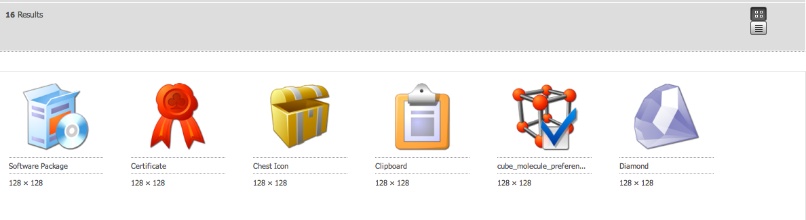

# 자산 편집기 페이지 만들기 및 구성 {#creating-and-configuring-asset-editor-pages}

이 문서에서는 다음 사항에 대해 설명합니다.

* 사용자 지정된 자산 편집기 페이지를 만드는 이유입니다.
* 메타데이터를 보고 편집할 수 있을 뿐만 아니라 자산에 대한 작업을 수행할 수 있는 WCM 페이지인 자산 편집기 페이지를 만들고 사용자 지정하는 방법입니다.
* 여러 자산을 동시에 편집하는 방법입니다.

<!-- TBD: Add UICONTROL tags. Need PM review. Flatten the structure a bit. Re-write to remove Geometrixx mentions and to adhere to 6.5 default samples. -->

>[!NOTE]
>
>자산 공유는 오픈 소스 참조 구현으로 사용할 수 있습니다. [Asset Share Commons](https://adobe-marketing-cloud.github.io/asset-share-commons/)를 참조하십시오. 공식적으로 지원되지 않습니다.

## 자산 편집기 페이지를 만들고 구성하는 이유는 무엇입니까?{#why-create-and-configure-asset-editor-pages}

디지털 자산 관리는 점점 더 많은 시나리오에서 사용됩니다. 전문 사용자용 [!DNL Adobe Experience Manager Assets]의 강력한 사용자 인터페이스는 사진사나 분류법 등 전문 교육을 받은 소규모 사용자 그룹의 소규모 사용자 그룹에서 비즈니스 사용자, WCM 작성자, 언론인 등으로 이동할 때 너무 많은 정보를 제공하고 이해 관계자가 관련 있는 디지털 자산에 액세스할 수 있도록 특정 사용자 인터페이스 또는 애플리케이션을 요청할 수 있습니다.

이러한 자산 중심 응용 프로그램은 인트라넷의 간단한 사진 갤러리로서 직원이 무역 박람회 방문이나 공개 웹 사이트의 프레스 센터에서 사진을 업로드할 수 있습니다. 자산 중심 애플리케이션은 장바구니, 체크아웃 및 확인 프로세스를 포함한 전체 솔루션으로 확장할 수도 있습니다.

자산 중심 애플리케이션을 만들면 코딩 작업이 필요 없는 구성 프로세스, 사용자 그룹 및 해당 요구 사항에 대한 지식 및 사용 중인 메타데이터에 대한 지식만 포함됩니다. [!DNL Assets]으로 만든 자산 중심의 응용 프로그램은 다음과 같이 확장됩니다.적절한 코딩 작업으로 자산을 검색, 보기 및 수정하기 위한 재사용 가능한 구성 요소를 만들 수 있습니다.

[!DNL Experience Manager]의 자산 중심의 애플리케이션은 자산 편집기 페이지로 구성되며, 이 페이지를 사용하여 특정 자산을 자세히 볼 수 있습니다. 자산 편집기 페이지에서도 자산에 액세스하는 사용자에게 필요한 권한이 있는 경우 메타데이터를 편집할 수 있습니다.

<!--
## Create and configure an Asset Share page {#creating-and-configuring-an-asset-share-page}

You customize the DAM Finder functionality and create pages that have all the functionality you require, which are called Asset Share pages. To create a new Asset Share page, you add the page using the Geometrixx Asset Share template and then you customize the actions users can perform on that page, determine how viewers see the assets, and decide how users can build their queries.

Here are some use cases for creating a customized Asset Share page:

* Press Center for Journalists.
* Image Search Engine for internal business users.
* Image Database for website users.
* Media Tagging Interface for metadata editors.

### Create an Asset Share page {#creating-an-asset-share-page}

To create a new Asset Share page, you can either create it when you are working on web sites or from the digital asset manager.

>[!NOTE]
>
>By default, when you create an Asset Share page from **New** in the digital asset manager, an Asset viewer and Asset editor are automatically created for you.

To create an new Asset Share page in the **Websites** console:

1. In the **Websites** tab, navigate to the place where you want to create an asset share page and click **New**.

1. Select the **Asset Share** page and click **Create**. The new page is created and the asset share page is listed in the **Websites** tab.

The basic page created using the Geometrixx DAM Asset Share template looks as follows:

To customize your Asset Share page, you use elements from the sidekick and you also edit query builder properties. The page **Geometrixx Press Center** is a customized version of a page based on this template:

To create a new asset share page via the digital asset manager:

1. In the digital asset manager, in **New**, select **New Asset Share**.
1. In the **Title**, enter the name of the asset share page. If desired, enter a name for the URL.

   

1. Double-click the asset share page to open it and configure the page.

   

   By default, when you create an Asset Share page from **New**, an Asset viewer and Asset editor are automatically created for you.

#### Customize actions {#customizing-actions}

You can determine what actions users can perform on selected digital assets from a selection of predefined actions.

To add actions to the Asset Share page:

1. In the Asset Share page that you want to customize, click **Actions** in the sidekick.

The following actions are available:

 | Action | Description |
 |---|---|
 | [!UICONTROL Delete Action] | Users can delete the selected assets. |
 | [!UICONTROL Download Action] | Lets users download selected assets to their computers. |
 | [!UICONTROL Lightbox Action] | Saves assets to a "lightbox"   where you can perform other actions on them. This comes in handy when working   with assets across multiple pages. The lightbox can also be used as a   shopping cart for assets. |
 | [!UICONTROL Move Action] | Users can move the asset to another   location |
 | [!UICONTROL Tags Action] | Lets users add tags to selected assets |
 | [!UICONTROL View Asset Action] | Opens the asset in the Asset editor for   user manipulation. |

1. Drag the appropriate action to the **Actions** area on the page. Doing so creates a button that is used to execute that action.

#### Determine how search results are presented {#determining-how-search-results-are-presented}

You determine how results are displayed from a predefined list of lenses.

To change how search results are viewed:

1. In the Asset Share page that you want to customize, click Search.

1. Drag the appropriate lens to the top center of the page. In the Press Center, the lenses are already available. Users press the appropriate lens icon to display search results as desired.

The following lenses are available:

| Lens | Description |
|---|---|
| **[!UICONTROL List Lens]** |Presents the assets in a list fashion with details. |
| **[!UICONTROL Mosaic Lens]** |Presents assets in a mosaic fashion. |

#### Mosaic Lens {#mosaic-lens}

#### List Lens {#list-lens}

#### Customize the Query Builder {#customizing-the-query-builder}

The query builder lets you enter search terms and create content for the Asset Share page. When you edit the query builder, you also get to determine how many search results are displayed per page, which asset editor opens when you double-click an asset, the path the query searches, and customizes nodetypes.

To customize the query builder:

1. In the Asset Share page that you want to customize, click **Edit** in the Query Builder. By default, the **General** tab opens.
1. Select the number of results per page, the path of the asset editor (if you have a customized asset editor) and the Actions title.

1. Click the **Paths** tab. Enter a path or multiple paths that the search will run. These paths are overwritten if the user uses the Paths predicate.

1. Enter another node type, if desired.

1. In the **Query Builder URL** field, you can override or wrap the query builder and enter the new servlet URLs with the existing query builder component. In the **Feed URL** field, you can override the Feed URL as well.

1. In the **Text** field, enter the text you want to appear for results and page numbers of results. Click **OK** when finished making changes.

#### Add predicates {#adding-predicates}

Experience Manager Assets includes a number of predicates that you can add to the Asset Share page. These let your users further narrow searches. In some cases, they may override a query builder parameter (for example, the Path parameter).

To add predicates:

1. In the Asset Share page that you want to customize, click **Search**.

1. Drag the appropriate predicates to the Asset Share page underneath the query builder. Doing so creates the appropriate fields.

The following predicates are available:

| Predicate | Description |
|---|---|
| **[!UICONTROL Date Predicate]** |Lets users search for assets that were modified before and after certain dates. |
| **[!UICONTROL Options Predicate]** |The site owner can specify a property to search for (as in the property predicate, for example cq:tags) and a content tree to populate the options from (for example the tag tree). Doing so generates a list of options where the users can select the values (tags) that the selected property (tag property) should have. This predicate lets you build list controls like the list of tags, file types, image orientations, and so on. It is great for a fixed set of options. |
| **[!UICONTROL Path Predicate]** |Lets users define the path and subfolders, if desired. |
| **[!UICONTROL Property Predicate]** |The site owner specifies a property to search for, e.g. tiff:ImageLength and the user can then enter a value, e.g. 800. This returns all images that are 800 pixels high. Useful predicate if your property can have arbitrary values. |

For more information, see the [predicate Javadocs](https://helpx.adobe.com/experience-manager/6-5/sites/developing/using/reference-materials/javadoc/com/day/cq/search/eval/package-summary.html).

1. To configure the predicate further, double-click it. For example, when you open the Path Predicate, you need to assign the root path.

-->

## 자산 편집기 페이지 {#creating-and-configuring-an-asset-editor-page} 만들기 및 구성

자산 편집기를 사용자 지정하여 사용자가 디지털 자산을 보고 편집할 수 있는 방법을 결정합니다. 이렇게 하려면 새 자산 편집기 페이지를 만든 다음 해당 페이지에서 사용자가 수행할 수 있는 보기 및 작업을 사용자 지정합니다.

>[!NOTE]
>
>DAM 자산 편집기에 사용자 지정 필드를 추가하려면 새 `cq:Widget` 노드를 `/apps/dam/content/asseteditors.`에 추가하십시오

### 자산 편집기 페이지 만들기 {#creating-the-asset-editor-page}

자산 편집기 페이지를 만들 때 자산 공유 페이지 바로 아래에 페이지를 만드는 것이 좋습니다.

자산 편집기 페이지를 만들려면 다음을 수행하십시오.

1. **[!UICONTROL 웹 사이트]** 탭에서 자산 편집기 페이지를 만들 위치로 이동하고 **새로 만들기**&#x200B;를 클릭합니다.
1. **Geometrixx 자산 편집기**&#x200B;를 선택하고 **만들기**&#x200B;를 클릭합니다. 새 페이지가 만들어지고 페이지가 **웹 사이트** 탭에 나열됩니다.

Geometrixx 자산 편집기 템플릿을 사용하여 만든 기본 페이지는 다음과 같습니다.

자산 편집기 페이지를 사용자 지정하려면 사이드 킥의 요소를 사용합니다. **Geometrixx Press Center**&#x200B;에서 액세스하는 자산 편집기 페이지는 이 템플릿을 기반으로 한 페이지의 사용자 지정된 버전입니다.

#### 자산 공유 페이지 {#setting-which-asset-editor-opens-from-an-asset-share-page}에서 열 자산 편집기 설정

사용자 지정된 자산 편집기 페이지를 만든 후에는 사용자 지정된 자산 공유에서 만든 자산을 두 번 클릭할 때 사용자 지정된 편집기 페이지에서 자산이 열리는지 확인해야 합니다.

자산 편집기 페이지를 설정하려면 다음을 수행하십시오.

1. 자산 공유 페이지에서 쿼리 빌더 옆에 있는 **편집**&#x200B;을 클릭합니다.

1. 아직 선택되지 않은 경우 **일반** 탭을 클릭합니다.

1. **자산 편집기의 경로** 필드에 자산 공유 페이지에서 자산을 열 자산 편집기의 경로를 입력하고 **확인**&#x200B;을 클릭합니다.

#### 자산 편집기 구성 요소 추가 {#adding-asset-editor-components}

페이지에 구성 요소를 추가하여 자산 편집기의 기능을 결정합니다.

자산 편집기 구성 요소를 추가하려면

1. 사용자 지정할 자산 편집기 페이지의 사이드킥에서 **자산 편집기**&#x200B;를 선택합니다. 사용 가능한 모든 자산 편집기 구성 요소가 표시됩니다.

>[!NOTE]
>
>사용자 지정할 수 있는 내용은 사용 가능한 구성 요소에 따라 다릅니다. 구성 요소를 활성화하려면 디자인 모드로 이동하여 활성화되어야 하는 구성 요소를 선택합니다.

1. 사이드 킥에서 자산 편집기로 구성 요소를 드래그하고 구성 요소 대화 상자에서 모든 사항을 수정합니다. 구성 요소는 다음 표에 설명되어 있으며 다음에 나오는 세부 지침에 설명되어 있습니다.

>[!NOTE]
>
>자산 편집기 페이지를 디자인할 때 읽기 전용 또는 편집 가능한 구성 요소를 만듭니다. 사용자는 해당 구성 요소에 연필의 이미지가 표시되는 경우 필드를 편집할 수 있다는 것을 알고 있습니다. 기본적으로 대부분의 구성 요소는 읽기 전용으로 설정됩니다.

| 구성 요소 | 설명 |
|---|---|
| **[!UICONTROL 메타데이터 ] 형식 및  [!UICONTROL 메타데이터 텍스트 필드]** | 자산에 추가 메타데이터를 추가하고 해당 자산에 제출 등의 작업을 수행할 수 있습니다. |
| **[!UICONTROL 하위 자산]** | 하위 자산을 사용자 지정할 수 있습니다. |
| **태그** | 사용자가 자산을 선택하고 태그를 자산에 추가할 수 있습니다. |
| **[!UICONTROL 썸네일]** | 자산의 축소판과 해당 파일 이름을 표시하며 대체 텍스트를 추가할 수 있도록 해줍니다. 여기에 자산 편집기 작업도 추가할 수 있습니다. |
| **[!UICONTROL 제목]** | 사용자 지정할 수 있는 자산 제목을 표시합니다. |

#### 메타데이터 양식 및 텍스트 필드 - 보기 메타데이터 구성 요소 {#metadata-form-and-text-field-configuring-the-view-metadata-component} 구성

메타데이터 양식은 시작 및 종료 작업을 포함하는 양식입니다. 사이에 **텍스트** 필드를 입력합니다. 양식 작업에 대한 자세한 내용은 [Forms](/help/sites-authoring/default-components-foundation.md#form-component)을 참조하십시오.

1. 양식의 시작 영역에서 **편집**&#x200B;을 클릭하여 시작 작업을 만듭니다. 원하는 경우 상자 제목을 입력할 수 있습니다. 기본적으로 상자 제목은 **메타데이터**&#x200B;입니다. 검증을 위해 java-script 클라이언트 코드를 생성하려면 클라이언트 검증 확인란을 선택합니다.

1. 양식의 끝 영역에서 **편집**&#x200B;을 클릭하여 끝 작업을 만듭니다. 예를 들어 사용자가 메타데이터 변경 사항을 제출할 수 있도록 **[!UICONTROL Submit]** 옵션을 만들 수 있습니다. 원할 경우 메타데이터를 원래 상태로 재설정하는 **재설정** 옵션을 추가할 수 있습니다.

1. **양식 시작** 및 **양식 끝** 사이에 있는 메타데이터 텍스트 필드를 양식으로 드래그합니다. 사용자가 이러한 텍스트 필드에 메타데이터를 채우면 다른 작업을 제출하거나 완료할 수 있습니다.

1. 필드 이름을 두 번 클릭합니다(예: **Title**). 메타데이터 필드를 열고 변경합니다. **구성 요소 편집** 창의 **일반** 탭에서 네임스페이스와 필드 레이블을 정의하고, 예를 들어 `dc:title` 유형을 정의합니다.

메타데이터 양식에서 사용할 수 있는 네임스페이스 수정에 대한 자세한 내용은 [자산 사용자 지정 및 확장](/help/assets/extending-assets.md)을 참조하십시오.

1. **제약 조건** 탭을 클릭합니다. 여기에서 필수 필드를 선택할 수 있으며 필요한 경우 제한을 추가할 수 있습니다.

1. **표시** 탭을 클릭합니다. 여기에서 메타데이터 필드에 새 너비와 행 수를 입력할 수 있습니다. 사용자가 메타데이터를 편집할 수 있도록 **필드가 읽기 전용** 확인란을 선택합니다.

다음은 다양한 필드가 있는 메타데이터 양식의 예입니다.

그런 다음 자산 편집기 페이지에서 메타데이터 필드에 값을 입력하고(편집 가능한 경우) 종료 작업을 수행할 수 있습니다(예: 변경 내용 제출).

#### 하위 자산 {#sub-assets}

하위 자산 구성 요소는 하위 자산을 보고 선택할 수 있는 곳입니다. [주 자산](/help/assets/assets.md#what-are-digital-assets) 및 하위 자산 아래에 표시되는 이름을 결정할 수 있습니다.

하위 자산 구성 요소를 두 번 클릭하여 기본 자산 및 하위 자산의 제목을 변경할 수 있는 하위 자산 대화 상자를 엽니다. 기본값은 해당 필드 아래에 나타납니다.

다음은 채워진 하위 자산 구성 요소의 예입니다.

예를 들어, 하위 자산을 선택하는 경우, 구성 요소에 적절한 페이지가 표시되고 상자 제목이 하위 자산에서 동위 멤버로 변경됩니다.

#### 태그 {#tags}

태그 구성 요소는 사용자가 자산에 기존 태그를 지정할 수 있는 구성 요소로서, 나중에 조직 및 검색할 수 있도록 해줍니다. 이 구성 요소를 읽기 전용으로 만들어 사용자가 태그를 추가할 수 없지만 태그만 볼 수 있습니다.

태그 구성 요소를 두 번 클릭하여 원할 경우 태그에서 제목을 변경할 수 있고, 할당된 네임스페이스를 선택할 수 있는 태그 대화 상자를 엽니다. 이 필드를 편집할 수 있도록 하려면 **[!UICONTROL 편집 숨기기]** 확인란의 선택을 취소합니다. 기본적으로 태그는 편집할 수 있습니다.

사용자가 태그를 편집할 수 있는 경우 태그 드롭다운 메뉴에서 태그를 선택하여 연필을 클릭하여 태그를 추가할 수 있습니다.

다음은 채워진 태그 구성 요소입니다.

#### 썸네일 {#thumbnail}

축소판 구성 요소는 자산에서 선택한 축소판을 표시하는 위치입니다(여러 형식의 경우 축소판이 자동으로 추출됨). 또한 구성 요소에는 파일 이름과 [수정할 수 있는 작업이 표시됩니다](/help/assets/assets-finder-editor.md#adding-asset-editor-actions).

축소판 구성 요소를 두 번 클릭하여 대체 텍스트를 변경할 수 있는 축소판 대화 상자를 엽니다. 기본적으로 축소판 대체 텍스트는 **으로 설정됩니다. 클릭하여** 자산을 다운로드합니다.

다음은 채워진 축소판 구성 요소의 예입니다.

#### 제목 {#title}

제목 구성 요소는 자산의 제목과 설명을 표시합니다.

기본적으로 읽기 전용 모드이므로 사용자가 편집할 수 없습니다. 편집 가능하게 하려면 구성 요소를 두 번 클릭하고 **편집 단추 숨기기** 확인란을 선택 취소합니다. 또한 여러 자산의 제목을 입력합니다.

제목을 편집할 수 있는 경우 연필을 클릭하여 **자산 속성** 창을 열어 제목과 설명을 추가할 수 있습니다. 또한 날짜 및 시간을 선택하여 자산을 켜거나 끌 수 있습니다.

[!UICONTROL 제목]을 편집할 때 사용자는 **제목**, **설명**&#x200B;을 변경하고, **설정** 및 **해제 시간**&#x200B;을 입력하여 자산을 켜거나 끌 수 있습니다.

다음은 채워진 제목 구성 요소의 예입니다.

#### 자산 편집기 작업 추가 {#adding-asset-editor-actions}

사전 정의된 작업 선택 사항에서 사용자가 선택한 디지털 자산에 대해 수행할 수 있는 작업을 결정할 수 있습니다.

자산 편집기 페이지에 작업을 추가하려면:

1. 사용자 지정할 자산 편집기 페이지에서 사이드 킥에서 **자산 편집기**&#x200B;를 클릭합니다.

다음 작업을 사용할 수 있습니다.

| 작업 | 설명 |
|---|---|
| [!UICONTROL 다운로드] | 사용자가 선택한 항목을 다운로드할 수 있습니다   자산을 컴퓨터에 추가합니다. |
| [!UICONTROL 편집자] | 사용자가 이미지를 편집할 수 있도록 해줍니다   (대화형 편집) |
| [!UICONTROL Lightbox] | 자산을   &quot;lightbox&quot;에서 다른 작업을 수행할 수 있습니다. 다음이 표시됩니다   여러 페이지에서 자산을 사용할 때 유용할 수 있습니다. |
| [!UICONTROL 잠금] | 사용자가 자산을 잠글 수 있도록 해줍니다. 이   기능은 기본적으로 활성화되지 않으며 목록에서 활성화해야 합니다   구성 요소의 두 번째 구성 요소입니다. |
| [!UICONTROL 참조] | 이 아이콘을 클릭하여 어떤 페이지를 표시합니다   자산을 사용 중입니다. |
| [!UICONTROL 버전 관리] | 생성 및 복원 가능   자산의 버전입니다. |

1. 적절한 작업을 페이지의 **작업** 영역으로 드래그합니다. 페이지에서 드래그하는 작업을 실행하는 데 사용되는 옵션을 만듭니다.

## 자산 편집기 페이지 {#multi-editing-assets-with-the-asset-editor-page}를 사용하여 자산 다중 편집

[!DNL Experience Manager Assets]을 사용하면 여러 자산을 한 번에 변경할 수 있습니다. 자산을 선택한 후 자산을 동시에 변경할 수 있습니다.

* 태그
* 메타데이터

자산 편집기 페이지에서 자산을 다중 편집하려면:

1. Geometrixx **Press Center** 페이지를 엽니다.
   `https://localhost:4502/content/geometrixx/en/company/press.html`

1. 자산을 선택합니다.

   * Windows:`Ctrl + click` 각 자산
   * Mac:`Cmd + click` 각 자산

   자산 범위를 선택하려면 다음을 수행하십시오.첫 번째 자산을 클릭한 다음 마지막 자산을 `Shift + click` 클릭합니다.

1. **작업** 필드(페이지의 왼쪽 부분)에서 **메타데이터 편집**&#x200B;을 클릭합니다.
1. Geometrixx **중앙 자산 편집기** 페이지가 새 탭에 열립니다. 자산의 메타데이터는 다음과 같이 표시됩니다.

   * 일부 자산에만 적용되지 않는 태그는 이탤릭체로 표시됩니다.
   * 모든 자산에 적용되는 태그는 일반 글꼴로 표시됩니다.
   * 태그 이외의 메타데이터:필드의 값은 선택한 모든 자산에 대해 동일한 경우에만 표시됩니다.

1. **다운로드**&#x200B;를 클릭하여 자산 원래 표현물이 포함된 ZIP 파일을 다운로드합니다.
1. **태그** 필드 옆에 있는 태그 편집 옵션을 클릭합니다.

   * 일부 자산에만 적용되지 않고 일부 자산에만 적용되는 태그에는 회색 배경이 있습니다.
   * 모든 자산에 적용되는 태그에는 흰색 배경이 있습니다.

   다음을 작업을 수행할 수 있습니다.

   * 모든 자산에 대한 태그를 제거하려면 `x` 을 클릭하십시오.
   * `+` 을 클릭하여 태그를 모든 자산에 추가합니다.
   * **화살표**&#x200B;를 클릭하고 태그를 선택하여 모든 자산에 새 태그를 추가합니다.

   **확인**&#x200B;을 클릭하여 양식에 변경 내용을 씁니다. **태그** 필드 옆의 상자가 자동으로 선택됩니다.

1. 설명 필드를 편집합니다. 예를 들어 다음을 로 설정합니다.

   `This is a common description`

   필드를 편집하면 해당 값이 양식을 제출할 때 선택한 자산의 기존 값을 덮어씁니다.

   참고:필드를 편집하면 필드 옆의 상자가 자동으로 선택됩니다.

1. **메타데이터 업데이트**&#x200B;를 클릭하여 양식을 제출하고 모든 자산에 대한 변경 사항을 저장합니다.

   참고:선택한 메타데이터만 수정됩니다.
