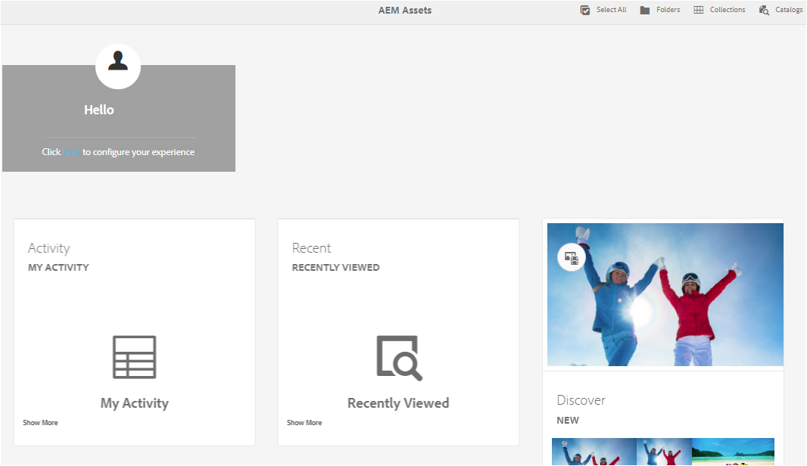

# [!DNL Adobe Experience Manager Assets] 홈 페이지 경험  {#aem-assets-home-page-experience}

자산의 최근 활동에 대한 스냅숏을 포함하여 풍부한 시작 화면 경험을 위해 [!DNL Adobe Experience Manager Assets] 홈 페이지를 개인화합니다.

[!DNL Assets] 홈 페이지에는 최근에 보거나 업로드한 자산과 같은 최근 활동에 대한 스냅숏이 포함된 풍부하고 개인화된 시작 화면 경험이 있습니다.

기본적으로 [!DNL Assets] 홈 페이지가 비활성화됩니다. 활성화하려면 다음 단계를 수행하십시오.

1. [!DNL Experience Manager] 구성 관리자 `https://[aem_server]:[port]/system/console/configMgr`를 엽니다.
1. **[!UICONTROL 일 CQ DAM 이벤트 레코더]** 서비스를 엽니다.
1. 활동 기록을 사용하려면 **[!UICONTROL 이 서비스]**&#x200B;를 활성화하십시오.

   

1. **[!UICONTROL 이벤트 유형]** 목록에서 기록할 이벤트를 선택하고 변경 내용을 저장합니다.

   >[!CAUTION]
   >
   >본 자산, 본 프로젝트 및 본 컬렉션 옵션을 활성화하면 기록된 이벤트 수가 크게 증가합니다.

1. 구성 관리자에서 **[!UICONTROL DAM 자산 홈페이지 기능 플래그]** 서비스를 엽니다. `https://[aem_server]:[port]/system/console/configMgr`
1. `isEnabled.name` 옵션을 선택하여 [!DNL Assets] 홈 페이지 기능을 활성화합니다. 변경 사항을 저장합니다.

   

1. **[!UICONTROL 사용자 환경 설정]** 대화 상자를 열고 **[!UICONTROL 자산 홈 페이지 활성화]**&#x200B;를 선택합니다. 변경 사항을 저장합니다.

   

[!DNL Assets] 홈 페이지를 활성화한 후 탐색 페이지에서 [!DNL Assets] 사용자 인터페이스로 이동하거나 URL `https://[aem_server]:[port]/aem/assetshome.html/content/dam`에서 직접 액세스합니다.

사용자 이름, 배경 이미지 및 프로필 이미지를 추가하기 위해 경험 링크&#x200B;]**를 구성하려면**[!UICONTROL &#x200B;여기를 클릭하십시오 .

[!DNL Assets] 홈 페이지에는 다음 섹션이 포함됩니다.

* 시작 섹션
* 위젯 섹션

**시작 섹션**

프로필이 존재하면 시작 섹션에 지정된 환영 메시지가 표시됩니다. 또한 프로필 사진과 시작 이미지를 표시합니다(이미 구성된 경우).

프로필이 불완전한 경우 시작 섹션에 일반 환영 메시지와 프로필 그림의 자리 표시자가 표시됩니다.

**위젯 섹션**

이 섹션은 시작 섹션 아래에 표시되며 다음 섹션 아래에 기본 제공 위젯을 표시합니다.

* 활동
* 최근
* 검색

**활동**:이 섹션 **[!UICONTROL 에서 내]** 활동 위젯은 자산(변환되지 않은 자산 포함)이 있는 로그인한 사용자가 수행한 최근 활동(예: 자산 업로드, 다운로드, 자산 생성, 편집, 주석, 주석 및 공유)을 표시합니다.

**최근**:이  **[!UICONTROL 섹션 아래의 최근]** 보기 위젯은 폴더, 컬렉션 및 프로젝트를 포함하여 로그인한 사용자가 최근에 액세스한 엔티티를 표시합니다.

**검색**:이  **** 섹션 아래의 Newwidget에는 최근 배포에 업로드된 자산 및 표현물이  [!DNL Assets] 표시됩니다.

사용자 활동 데이터 제거를 활성화하려면 구성 관리자에서 **[!UICONTROL DAM 이벤트 삭제 서비스]**&#x200B;를 활성화하십시오. 이 서비스를 사용하면 지정된 수를 초과하는 로그인한 사용자의 활동이 시스템에 의해 삭제됩니다.

시작 화면에서는 도구 모음의 아이콘 등을 사용하여 폴더, 컬렉션 및 카탈로그에 액세스하는 쉬운 탐색 도구를 제공합니다.

>[!NOTE]
>
>[!UICONTROL 일 CQ DAM 이벤트 레코더] 및 [!UICONTROL DAM 이벤트 삭제] 서비스를 사용하면 JCR 및 검색 색인에 대한 쓰기 작업이 증가하므로 [!DNL Experience Manager] 서버의 로드가 크게 증가합니다. [!DNL Experience Manager] 서버의 추가 로드는 성능에 영향을 줄 수 있습니다.

>[!CAUTION]
>
>[!DNL Assets] 홈 페이지에 필요한 사용자 활동을 캡처, 필터링 및 제거하면 성능에 오버헤드가 발생합니다. 따라서 관리자는 Target 사용자를 위해 홈 페이지를 효과적으로 구성해야 합니다.
>
>Adobe은 대량 작업을 수행하는 관리자 및 사용자가 사용자 활동이 증가하는 것을 방지하기 위해 자산 홈 페이지 기능을 사용하지 않도록 권장합니다. 또한 관리자는 [!UICONTROL 구성 관리자]에서 [!UICONTROL 일 CQ DAM 이벤트 레코더]를 구성하여 특정 사용자를 위한 기록 활동을 제외할 수 있습니다.
>
>이 기능을 사용하는 경우 서버 로드에 따라 제거 빈도를 예약하는 것이 좋습니다.
