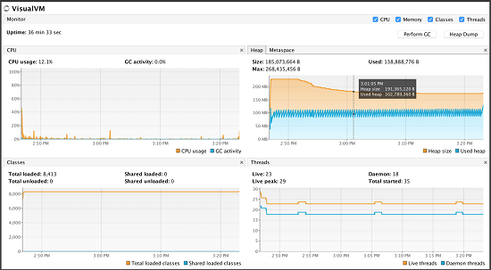

# [!DNL Adobe Experience Manager Assets] 배포 모니터링 우수 사례 {#assets-monitoring-best-practices}

[!DNL Experience Manager Assets]의 관점에서 모니터링에는 다음 프로세스 및 기술에 대한 관찰과 보고가 포함되어야 합니다.

* 시스템 CPU
* 시스템 메모리 사용
* 시스템 디스크 IO 및 IO 대기 시간
* 시스템 네트워크 IO
* JMX MBeans를 사용하여 작업 과정과 같은 비동기 프로세스를
* OSGi 콘솔 상태 검사

일반적으로 실시간 모니터링과 장기 모니터링이라는 두 가지 방법으로 [!DNL Experience Manager Assets]을 모니터링할 수 있습니다.

## 실시간 모니터링 {#live-monitoring}

개발 단계나 고로드 상황에서 라이브 모니터링을 수행하여 환경의 성능 특성을 파악해야 합니다. 일반적으로 라이브 모니터링은 도구 모음을 사용하여 수행해야 합니다. 다음은 권장 사항입니다.

* [시각적 VM](https://visualvm.github.io/):Visual VM을 사용하면 CPU 사용, Java 메모리 사용을 비롯한 자세한 Java VM 정보를 볼 수 있습니다. 또한 배포에서 실행되는 코드를 샘플링하고 평가할 수 있습니다.
* [위쪽](https://man7.org/linux/man-pages/man1/top.1.html):맨 위에는 CPU, 메모리 및 IO 사용을 비롯한 사용 통계를 표시하는 대시보드가 표시되는 Linux 명령입니다. 인스턴스에서 일어나고 있는 일에 대한 높은 수준의 개요를 제공합니다.
* [위쪽](https://hisham.hm/htop/):상단은 대화형 프로세스 뷰어입니다. Top이 제공할 수 있는 기능 외에 자세한 CPU 및 메모리 사용량을 제공합니다. 이 핫픽스는 `yum install htop` 또는 `apt-get install htop`을 사용하여 대부분의 Linux 시스템에 설치할 수 있습니다.

* 위쪽:Iotop은 디스크 IO 사용을 위한 세부 대시보드입니다. 여기에는 디스크 IO를 사용하는 프로세스와 사용하는 양을 나타내는 막대와 미터가 표시됩니다. Iotop은 `yum install iotop` 또는 `apt-get install iotop`을 사용하여 대부분의 Linux 시스템에 설치할 수 있습니다.

* [위쪽](https://www.ex-parrot.com/pdw/iftop/):이 보고서는 이더넷/네트워크 사용에 대한 자세한 정보를 표시합니다. 이 경우 이더넷을 사용하는 엔티티에 대한 통신 채널 통계별 정보와 이들이 사용하는 대역폭의 양을 표시합니다. 이벤트는 `yum install iftop` 또는 `apt-get install iftop`을 사용하여 대부분의 Linux 시스템에 설치할 수 있습니다.

* Java Flight 레코더(JFR):비프로덕션 환경에서 무료로 사용할 수 있는 Oracle의 상업용 도구입니다. 자세한 내용은 [Java Flight Recorder를 사용하여 CQ 런타임 문제 진단](https://cq-ops.tumblr.com/post/73865704329/how-to-use-java-flight-recorder-to-diagnose-cq)을 참조하십시오.
* [!DNL Experience Manager] `error.log` 파일:시스템에  [!DNL Experience Manager] `error.log` 기록된 오류에 대한 세부 정보를 확인하려면 파일을 조사할 수 있습니다. 조사할 오류를 식별하려면 `tail -F quickstart/logs/error.log` 명령을 사용합니다.
* [워크플로우 콘솔](/help/sites-administering/workflows.md):워크플로우 콘솔을 활용하여 뒤로 지연되거나 문제가 발생하는 워크플로우를 모니터링할 수 있습니다.

일반적으로 이러한 도구를 함께 사용하여 [!DNL Experience Manager] 배포의 성능에 대한 포괄적인 아이디어를 얻을 수 있습니다.

>[!NOTE]
>
>이러한 도구는 표준 도구이며 Adobe에서 직접 지원되지 않습니다. 추가 라이선스는 필요하지 않습니다.

*그림:Visual VM 도구를 사용한 실시간 모니터링.*

## 장기 모니터링 {#long-term-monitoring}

[!DNL Experience Manager] 배포에 대한 장기 모니터링은 라이브로 모니터링되는 것과 동일한 부분을 장기간 모니터링합니다. 환경에 대한 경고를 정의하는 것도 포함됩니다.

### 로그 집계 및 보고 {#log-aggregation-and-reporting}

Splunk(TM) 및 Elastic Search, Logstash 및 Kabana(ELK)와 같이 로그를 집계하는 데 사용할 수 있는 여러 가지 도구가 있습니다. [!DNL Experience Manager] 배포의 가동 시간을 평가하려면 시스템 관련 로그 이벤트를 파악하고 이를 기반으로 경고를 생성하는 것이 중요합니다. 개발 및 작업 방침에 대한 뛰어난 지식을 통해 로그 수집 프로세스를 조정하여 중요한 경고를 생성하는 방법을 보다 잘 이해할 수 있습니다.

### 환경 모니터링 {#environment-monitoring}

환경 모니터링에는 다음 모니터링이 포함됩니다.

* 네트워크 처리량
* 디스크 IO
* 메모리
* CPU 활용도
* JMX MBeans
* 외부 웹 사이트

각 항목을 모니터링하려면 NewRelic(TM) 및 AppDynamics(TM)와 같은 외부 도구가 필요합니다. 이러한 도구를 사용하여 시스템 활용도, 워크플로우 백업, 상태 점검 실패 또는 웹 사이트에 대한 인증되지 않은 액세스 등과 같이 시스템별 경고를 정의할 수 있습니다. Adobe은 다른 도구에 비해 특정 도구를 권장하지 않습니다. 사용자에게 적합한 툴을 찾고 이를 활용하여 설명한 항목을 모니터링할 수 있습니다.

#### 내부 응용 프로그램 모니터링 {#internal-application-monitoring}

내부 응용 프로그램 모니터링에는 JVM, 콘텐트 저장소 등 [!DNL Experience Manager] 스택을 구성하는 응용 프로그램 구성 요소를 모니터링하고 플랫폼에 내장된 사용자 정의 응용 프로그램 코드를 통해 모니터링합니다. 일반적으로 JMX Mbeans를 통해 수행되므로 SolarWinds(TM), HP OpenView(TM), Hyperic(TM), Zabbix(TM) 등과 같이 널리 사용되는 많은 모니터링 솔루션을 통해 직접 모니터링할 수 있습니다. JMX에 대한 직접 연결을 지원하지 않는 시스템의 경우 셸 스크립트를 작성하여 JMX 데이터를 추출하고 이러한 시스템에 기본적으로 이해하는 형식으로 표시할 수 있습니다.

JMX Mbeans에 대한 원격 액세스는 기본적으로 활성화되어 있지 않습니다. JMX를 통한 모니터링에 대한 자세한 내용은 [JMX 기술을 사용한 모니터링 및 관리](https://docs.oracle.com/javase/7/docs/technotes/guides/management/agent.html)를 참조하십시오.

대부분의 경우 통계를 효과적으로 모니터링하려면 기준선이 필요합니다. 기준을 만들려면 미리 결정된 기간 동안 정상적인 작업 조건에서 시스템을 관찰한 다음 일반 지표를 식별합니다.

**JVM 모니터링**

Java 기반 응용 프로그램 스택과 마찬가지로, [!DNL Experience Manager]은 기본 Java 가상 시스템을 통해 제공된 리소스에 따라 달라집니다. JVM에 의해 노출되는 플랫폼 MXBeans를 통해 이러한 리소스 중 많은 수의 상태를 모니터링할 수 있습니다. MXBeans에 대한 자세한 내용은 [플랫폼 MBean 서버 및 플랫폼 MXBeans](https://docs.oracle.com/javase/7/docs/technotes/guides/management/mxbeans.html) 사용을 참조하십시오.

다음은 JVM에 대해 모니터링할 수 있는 몇 가지 기준 매개 변수입니다.

메모리

* `MBean: lava.lang:type=Memory`
* URL: `/system/console/jmx/java.lang:type=Memory`
* 인스턴스:모든 서버
* 경보 임계값:더미 또는 비더미 메모리 사용률이 해당 최대 메모리 중 75%를 초과하는 경우
* 경보 정의:시스템 메모리가 부족하거나 코드에 메모리 누수가 있습니다. 스레드 덤프를 분석하여 정의에 도달합니다.

>[!NOTE]
>
>이 콩에서 제공하는 정보는 바이트 단위로 표시됩니다.

스레드

* MBean:`java.lang:type=Threading`
* URL:`/system/console/jmx/java.lang:type=Threading`
* 인스턴스:모든 서버
* 경보 임계값:스레드 수가 기준선의 150%보다 큰 경우.
* 경보 정의:능동적인 절차가 있거나 비효율적인 작업은 많은 양의 자원을 소비한다. 스레드 덤프를 분석하여 정의에 도달합니다.

**모니터[!DNL Experience Manager]**

[!DNL Experience Manager] 또한 JMX를 통해 통계 및 작업 세트를 표시합니다. 이러한 기능은 시스템 상태를 평가하고 사용자에게 영향을 주기 전에 잠재적인 문제를 식별하는 데 도움이 될 수 있습니다. 자세한 내용은 [!DNL Experience Manager] JMX MBeans의 [설명서](/help/sites-administering/jmx-console.md)를 참조하십시오.

다음은 [!DNL Experience Manager]에 대해 모니터링할 수 있는 몇 가지 기준 매개 변수입니다.

복제 에이전트

* MBean:`com.adobe.granite.replication:type=agent,id=”<AGENT_NAME>”`
* URL:`/system/console/jmx/com.adobe.granite.replication:type=agent,id=”<AGENT_NAME>"`
* 인스턴스:작성자 및 모든 게시 인스턴스(플러시 에이전트의 경우) 1개
* 경보 임계값:`QueueBlocked` 값이 `true`이거나 `QueueNumEntries` 값이 기준선의 150%보다 큰 경우.

* 경보 정의:시스템에 복제 대상이 다운되었거나 연결할 수 없음을 나타내는 차단된 큐가 있습니다. 네트워크 또는 인프라 문제로 인해 과도한 항목이 큐에 올라가 시스템 성능에 부정적인 영향을 줄 수 있는 경우가 많습니다.

>[!NOTE]
>
>MBean 및 URL 매개 변수의 경우 `<AGENT_NAME>`을 모니터링할 복제 에이전트 이름으로 바꿉니다.

세션 카운터

* MBean:`org.apache.jackrabbit.oak:id=7,name="OakRepository Statistics",type="RepositoryStats"`
* URL:*/system/console/jmx/org.apache.jackrabbit.oak:id=7,name=&quot;OakRepository Statistics&quot;,입력*=&quot;RepositoryStats&quot;
* 인스턴스:모든 서버
* 경보 임계값:열려 있는 세션이 기준선을 50% 이상 초과하는 경우
* 경보 정의:세션은 코드 일부를 통해 열 수 있으며 절대 닫지 않습니다. 이것은 시간이 지남에 따라 천천히 일어날 수 있고 결국 시스템에 메모리 누수를 일으킬 수 있다. 시스템에서 세션 수가 변동해야 하지만 지속적으로 증가해서는 안 됩니다.

상태 검사

[작업 대시보드](/help/sites-administering/operations-dashboard.md#health-reports)에서 사용할 수 있는 상태 확인에는 모니터링에 해당하는 JMX MBean이 있습니다. 그러나 사용자 정의 상태 검사를 작성하여 추가 시스템 통계를 표시할 수 있습니다.

다음은 즉시 사용 가능한 상태 검사로, 모니터링에 도움이 됩니다.

* 시스템 확인
   * MBean:`org.apache.sling.healthcheck:name=systemchecks,type=HealthCheck`
   * URL:`/system/console/jmx/org.apache.sling.healthcheck:name=systemchecks,type=HealthCheck`
   * 인스턴스:작성자 1명, 모든 게시 서버
   * 경보 임계값:상태가 좋지 않을 때
   * 경보 정의:지표 중 하나의 상태는 WARN 또는 CRITICAL입니다. 문제의 원인에 대한 자세한 내용은 로그 속성을 확인하십시오.

* 복제 큐

   * MBean:`org.apache.sling.healthcheck:name=replicationQueue,type=HealthCheck`
   * URL:`/system/console/jmx/org.apache.sling.healthcheck:name=replicationQueue,type=HealthCheck`
   * 인스턴스:작성자 1명, 모든 게시 서버
   * 경보 임계값:상태가 좋지 않을 때
   * 경보 정의:지표 중 하나의 상태는 WARN 또는 CRITICAL입니다. 문제를 일으킨 큐에 대한 자세한 내용은 로그 속성을 확인하십시오.

* 응답 성능

   * MBean:`org.apache.sling.healthcheck:name=requestsStatus,type=HealthCheck`
   * URL:`/system/console/jmx/org.apache.sling.healthcheck:name=requestsStatus,type=HealthCheck`
   * 인스턴스:모든 서버
   * 경보 기간:상태가 좋지 않을 때
   * 경보 정의:지표 중 하나의 상태는 경고 또는 위험 상태입니다. 문제를 일으킨 큐에 대한 자세한 내용은 로그 속성을 확인하십시오.

* 쿼리 성능

   * MBean:`org.apache.sling.healthcheck:name=queriesStatus,type=HealthCheck`
   * URL:`/system/console/jmx/org.apache.sling.healthcheck:name= queriesStatus,type=HealthCheck`
   * 인스턴스:작성자 1명, 모든 게시 서버
   * 경보 임계값:상태가 좋지 않을 때
   * 경보 정의:시스템에서 하나 이상의 쿼리가 느리게 실행 중입니다. 문제를 일으킨 쿼리에 대한 자세한 내용은 로그 속성을 확인하십시오.

* 활성 상태 번들

   * MBean:`org.apache.sling.healthcheck:name=inactiveBundles,type=HealthCheck`
   * URL:`/system/console/jmx/org.apache.sling.healthcheck:name=inactiveBundles,type=HealthCheck`
   * 인스턴스:모든 서버
   * 경보 임계값:상태가 좋지 않을 때
   * 경보 정의:시스템에 비활성 또는 해결되지 않은 OSGi 번들이 있습니다. 문제를 일으킨 번들에 대한 자세한 내용은 로그 속성을 확인하십시오.

* 오류 로그

   * MBean:`org.apache.sling.healthcheck:name=logErrorHealthCheck,type=HealthCheck`
   * URL:`/system/console/jmx/org.apache.sling.healthcheck:name=logErrorHealthCheck,type=HealthCheck`
   * 인스턴스:모든 서버
   * 경보 임계값:상태가 좋지 않을 때
   * 경보 정의:로그 파일에 오류가 있습니다. 문제의 원인에 대한 자세한 내용은 로그 속성을 확인하십시오.

## 일반적인 문제 및 해결 방법 {#common-issues-and-resolutions}

모니터링 과정에서 문제가 발생하는 경우 [!DNL Experience Manager] 배포의 일반적인 문제를 해결하기 위해 수행할 수 있는 몇 가지 문제 해결 작업이 있습니다.

* TarMK를 사용하는 경우 Tar 컴포지션을 자주 실행합니다. 자세한 내용은 [저장소 유지](/help/sites-deploying/storage-elements-in-aem-6.md#maintaining-the-repository)를 참조하십시오.
* `OutOfMemoryError` 로그를 확인합니다. 자세한 내용은 [메모리 문제 분석](https://helpx.adobe.com/experience-manager/kb/AnalyzeMemoryProblems.html)을 참조하십시오.

* 색인이 없는 쿼리, 트리 탐색 또는 색인 탐색에 대한 참조가 있는지 로그를 확인합니다. 인덱싱되지 않은 쿼리 또는 인덱싱되지 않은 쿼리를 나타냅니다. 쿼리 및 색인 성능 최적화에 대한 우수 사례를 보려면 [쿼리 및 색인화에 대한 우수 사례](/help/sites-deploying/best-practices-for-queries-and-indexing.md)를 참조하십시오.
* 워크플로우 콘솔을 사용하여 워크플로우가 예상대로 작동하는지 확인합니다. 가능한 경우 여러 워크플로우를 하나의 워크플로우로 압축합니다.
* 실시간 모니터링을 다시 방문하여 특정 리소스의 병목 현상 또는 높은 소비자에 대한 정보를 확인할 수 있습니다.
* 클라이언트 네트워크의 송신 지점을 조사하고 수신 지점이 디스패처를 포함하여 [!DNL Experience Manager] 배포 네트워크를 가리키는지 확인합니다. 주로 병목 영역입니다. 자세한 내용은 [자산 네트워크 고려 사항](/help/assets/assets-network-considerations.md)을 참조하십시오.
* [!DNL Experience Manager] 서버의 크기를 늘립니다. [!DNL Experience Manager] 배포의 크기가 적절하게 맞지 않을 수 있습니다. Adobe 고객 지원 센터는 서버의 크기가 낮은지 여부를 확인하는 데 도움이 됩니다.
* 오류가 발생한 시간대의 항목에 대해 `access.log` 및 `error.log` 파일을 검사합니다. 사용자 지정 코드 예외 항목을 나타낼 수 있는 패턴을 찾습니다. 모니터하는 이벤트 목록에 추가합니다.
