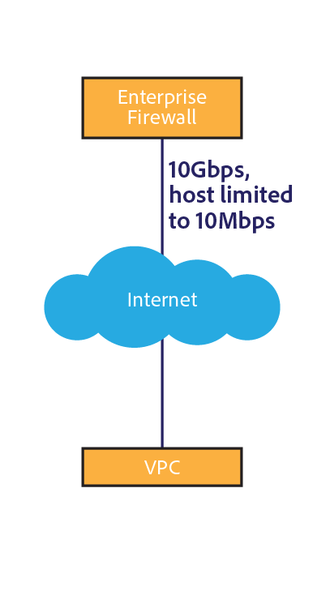

# [!DNL Assets] 네트워크 고려 사항  {#assets-network-considerations}

[!DNL Adobe Experience Manager Assets] 이해 못지않게 네트워크를 이해하는 것이 중요합니다. 네트워크는 업로드, 다운로드 및 사용자 경험에 영향을 줄 수 있습니다. 네트워크 토폴로지를 다이어그래밍하면 네트워크 성능 및 사용자 환경을 개선하기 위해 수정해야 하는 네트워크에서 초크 포인트 및 하위 최적화 영역을 식별할 수 있습니다.

네트워크 다이어그램에 다음을 포함해야 합니다.

* 클라이언트 장치(예: 컴퓨터, 모바일 및 태블릿)에서 네트워크에 연결
* 기업 네트워크의 토폴로지.
* 회사 네트워크 및 [!DNL Experience Manager] 환경에서 인터넷에 대한 상향링크.
* [!DNL Experience Manager] 환경의 토폴로지.
* [!DNL Experience Manager] 네트워크 인터페이스의 동시 소비자를 정의합니다.
* [!DNL Experience Manager] 배포의 워크플로우가 정의되었습니다.

## 클라이언트 장치에서 회사 네트워크에 연결 {#connectivity-from-the-client-device-to-the-corporate-network}

개별 클라이언트 장치와 회사 네트워크 간의 연결을 다이어그램으로 시작합니다. 이 단계에서 여러 사용자가 동일한 포인트 또는 이더넷 스위치에 액세스하여 자산을 업로드하고 다운로드하는 WiFi 연결과 같은 공유 리소스를 식별합니다.

클라이언트 장치는 공유 WiFi, 공유 스위치에 이더넷, VPN과 같은 다양한 방법으로 회사 네트워크에 연결합니다. 이 네트워크의 선택 지점을 식별하고 이해하는 것은 [!DNL Assets] 계획과 네트워크를 수정하는 데 중요합니다.

다이어그램의 왼쪽 위에 세 개의 장치가 48Mbps WiFi 액세스 포인트를 공유하는 것으로 표시됩니다. 모든 장치가 동시에 업로드되면 장치 간에 WiFi 네트워크 대역폭이 공유됩니다. 전체 시스템에 비해, 사용자는 이 분할된 채널을 통해 세 클라이언트에 대해 다른 초크 포인트를 발생할 수 있습니다.

느린 장치가 액세스 포인트의 다른 클라이언트에 영향을 줄 수 있으므로 WiFi 네트워크의 실제 속도를 측정하는 것은 어려운 과제입니다. 자산 상호 작용에 WiFi를 사용할 계획이라면 동시에 여러 클라이언트에서 속도 테스트를 수행하여 처리량을 평가합니다.

다이어그램의 왼쪽 아래쪽에는 독립 채널을 통해 회사 네트워크에 연결된 두 개의 장치가 표시됩니다. 따라서 각 장치는 최소 10Mbps 및 100Mbps의 속도를 사용할 수 있습니다.

오른쪽에 표시되는 컴퓨터는 1Mbps 속도로 VPN을 통해 회사 네트워크의 업스트림을 제한할 수 있습니다. 1Mbps 연결에 대한 사용자 환경은 1Gbps 연결을 통해 사용자 경험과는 크게 다릅니다. 사용자가 상호 작용하는 자산의 크기에 따라 VPN 업링크가 작업에 적합하지 않을 수 있습니다.

## 회사 네트워크 토폴로지 {#topology-of-the-corporate-network}

다이어그램은 일반적으로 사용되는 것보다 회사 네트워크 내에서 더 높은 업링크 속도를 표시합니다. 이 파이프는 공유 리소스입니다. 공유 스위치가 50개의 클라이언트를 처리할 것으로 예상되면 초크 지점일 수 있습니다. 초기 다이어그램에서는 두 컴퓨터만 특정 연결을 공유합니다.

## 회사 네트워크 및 [!DNL Experience Manager] 환경에서 인터넷에 대한 업링크 {#uplink-to-the-internet-from-the-corporate-network-and-aem-environment}

최대 로드 또는 대규모 제공자 중단으로 인해 인터넷을 통한 대역폭이 손상될 수 있으므로 인터넷과 VPC 연결에서 알 수 없는 요소를 고려해야 합니다. 일반적으로 인터넷 연결이 안정적입니다. 하지만, 그것은 때때로 선택점을 도입할 수 있습니다.

상기 업링크에서는 기업 네트워크에서 인터넷으로의 상향링크 시 상기 대역폭을 사용하는 다른 서비스가 있을 수 있다. 자산에 대해 전용 또는 우선 순위를 지정할 수 있는 대역폭 양을 이해하는 것이 중요합니다. 예를 들어, 1Gbps 링크가 이미 80% 활용률에 있는 경우 [!DNL Experience Manager Assets]에 대해 대역폭의 최대 20%만 할당할 수 있습니다.

엔터프라이즈 방화벽과 프록시는 다양한 방식으로 대역폭을 형성할 수도 있습니다. 이러한 유형의 장치는 서비스 품질, 사용자당 대역폭 제한 또는 호스트당 비트율 제한을 사용하여 대역폭의 우선 순위를 지정할 수 있습니다. 이러한 선택 사항은 [!DNL Assets] 사용자 경험에 크게 영향을 줄 수 있으므로 검토해야 할 중요한 선택 사항입니다.

이 예에서는 엔터프라이즈에 10Gbps 업링크가 있습니다. 여러 고객에게 충분히 클 것입니다. 또한 방화벽은 호스트 속도 제한을 10Mbps로 지정합니다. 이 제한은 인터넷에 대한 상향링크가 10Gbps에도 불구하고 단일 호스트에 대한 트래픽을 10Mbps로 조절할 수 있습니다.

가장 작은 클라이언트 중심 초크 지점입니다. 그러나 이 방화벽을 담당하는 네트워크 작업 그룹으로 허용 목록 변경 또는 구성을 평가할 수 있습니다.

샘플 다이어그램에서 6개의 장치가 개념 10Mbps 채널을 공유한다고 결론 내릴 수 있습니다. 활용하는 자산의 크기에 따라, 이것은 사용자 기대를 충족하기에 충분하지 않을 수 있습니다.

## [!DNL Experience Manager] 환경의 토폴로지 {#topology-of-the-aem-environment}

[!DNL Experience Manager] 환경의 토폴로지를 디자인하려면 시스템 구성과 사용자 환경 내에서 네트워크가 어떻게 연결되는지 자세히 알고 있어야 합니다.

샘플 시나리오에는 5개의 서버가 있는 게시 팜, S3 이진 저장소 및 Dynamic Media이 구성되어 있습니다.

디스패처는 외부 세계 및 [!DNL Experience Manager] 배포의 두 엔티티와 100Mbps 연결을 공유합니다. 업로드 및 다운로드 작업을 동시에 수행하려면 이 숫자를 2로 나누어야 합니다. 연결된 외부 저장소는 별도의 연결을 사용합니다.

[!DNL Experience Manager] 배포는 여러 서비스와 1Gbps 연결을 공유합니다. 네트워크 토폴로지 관점에서 볼 때, 하나의 채널을 서로 다른 서비스와 공유하는 것과 같습니다.

클라이언트 장치에서 [!DNL Experience Manager] 배포로 네트워크를 검토하면 최소 초크 지점이 10Mbit 엔터프라이즈 방화벽 스로틀로 나타납니다. [자산 크기 조정 가이드](assets-sizing-guide.md)의 크기 조정 계산기에서 이러한 값을 사용하여 사용자 경험을 확인할 수 있습니다.

## [!DNL Experience Manager] 배포의 정의된 워크플로우 {#defined-workflows-of-the-aem-deployment}

네트워크 성능을 고려할 때 시스템에서 발생할 워크플로우 및 게시를 고려해야 할 수 있습니다. 또한, 사용자가 사용하고 입출력 요청을 사용하는 S3 또는 기타 NAS 스토리지는 네트워크 대역폭을 사용합니다. 따라서 완전히 최적화된 네트워크에서도 디스크 I/O에 의해 성능이 제한될 수 있습니다.

자산 수집 관련 프로세스를 간소화하려면(특히 많은 자산을 업로드할 때) 자산 워크플로우를 탐색하고 구성에 대해 자세히 알아봅니다.

내부 워크플로우 토폴로지를 평가할 때 다음을 분석해야 합니다.

* 자산을 작성하는 절차
* 자산/메타데이터가 수정될 때 트리거되는 워크플로우/이벤트
* 자산을 읽는 절차

고려해야 할 몇 가지 항목은 다음과 같습니다.

* XMP 메타데이터 읽기/쓰기 되돌리기
* 자동 활성화 및 복제
* 원본에 쓰기
* 하위 자산 수집/페이지 추출
* 워크플로우가 겹칩니다.

다음은 자산 워크플로우의 정의에 대한 고객 예입니다.

