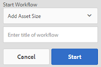

# 디지털 자산 처리 {#process-assets}

[!DNL Adobe Experience Manager Assets] 강력한 자산 처리를 위해 다양한 방법으로 디지털 자산 작업을 수행할 수 있습니다. 사용 가능한 처리 방법을 사용하거나 방법을 확장하여 디지털 자산의 검토 및 준수, 검색 및 배포, 기본 안정성 등을 사용하여 전체 비즈니스 프로세스를 완료할 수 있습니다. 이 모든 작업을 수행할 수 있을 뿐만 아니라 필요한 확장 및 사용자 정의 기능을 구현할 수 있습니다.

## 워크플로우 이해 {#understand-workflows}

자산 처리를 위해 [!DNL Experience Manager] 워크플로우를 사용합니다. 워크플로우는 비즈니스 로직 또는 활동을 자동화하는 데 도움이 됩니다. 특정 작업을 수행하는 세밀한 단계는 기본적으로 제공되며 개발자는 고유한 사용자 정의 단계를 만들 수 있습니다. 이러한 단계를 논리적 순서로 결합하여 워크플로우를 만들 수 있습니다. 예를 들어 워크플로우는 이미지에 임베드된 메타데이터, 업로드된 폴더, 이미지 해상도 등과 같은 특정 기준을 기반으로 업로드된 이미지에 워터마크를 자동으로 적용할 수 있습니다. 또 다른 예로 메타데이터 추가, 변환 만들기, 자산 검색을 위한 지능형 태그 추가, 데이터 저장소에 게시, 사용자 액세스에 대한 권한 설정 등과 같이 여러 자산 관리 요구 사항을 동시에 해결하도록 구성된 워크플로우가 있습니다.

## Experience Manager에서 사용할 수 있는 기본 워크플로우 {#default-workflows}

기본적으로 업로드된 모든 자산은 DAM 자산 업데이트 [!UICONTROL 워크플로우를 사용하여] 처리됩니다. 이 워크플로우는 업로드된 각 자산에 대해 실행되며 변환 생성, 메타데이터 쓰기 저장, 페이지 추출, 미디어 추출, 트랜스코딩과 같은 기본 자산 관리 작업을 수행합니다.

기본적으로 제공되는 다양한 워크플로우 모델을 보려면 도구 > 워크플로우 [!UICONTROL > 모델을] 참조하십시오 [!DNL Experience Manager].

*그림:일부 기본 워크플로우는[!DNL Experience Manager]*

## 워크플로우를 적용하여 에셋 처리 {#applying-workflows-to-assets}

디지털 자산에 워크플로우를 적용하는 것은 웹 사이트 페이지와 동일합니다. 워크플로우를 만들고 사용하는 방법에 대한 전체 지침은 워크플로우 [시작을 참조하십시오](/help/sites-authoring/workflows-participating.md).

디지털 자산의 워크플로우를 사용하여 자산을 활성화하거나 워터마크를 만들 수 있습니다. 자산에 대한 많은 워크플로우가 자동으로 설정됩니다. 예를 들어, 이미지를 편집한 후 자동으로 표현물을 만드는 워크플로우가 자동으로 활성화됩니다.

>[!NOTE]
>
>클래식 UI에서 사용할 수 있는 워크플로우가 터치 활성화 UI에서 사용할 수 없는 경우(예: 활성화 요청 [!UICONTROL 및] 비활성화 [!UICONTROL 요청]) 워크플로우 모델만들기를 참조하십시오.

## 자산에 워크플로우 적용 {#apply-a-workflow-to-an-asset}

자산에 워크플로우를 적용하려면 다음 단계를 따르십시오.

1. 워크플로우를 시작할 자산의 위치로 이동하고 자산을 클릭하여 자산 페이지를 엽니다. 메뉴에서 **[!UICONTROL 타임라인을]** 선택하여 타임라인을 표시합니다.

   

1. 맨 **[!UICONTROL 아래에]** 있는 작업을 클릭하여 자산에 사용할 수 있는 작업 목록을 엽니다.

   

1. 목록에서 **[!UICONTROL 워크플로우]** 시작을 클릭합니다.

   

1. 워크플로우 **[!UICONTROL 시작]** 대화 상자의 목록에서 워크플로우 모델을 선택합니다.

   

1. (선택 사항) 워크플로우의 인스턴스를 참조하는 데 사용할 수 있는 워크플로우의 제목을 지정합니다.

   

1. 시작을 **[!UICONTROL 클릭한]** 다음 진행을 **[!UICONTROL 클릭합니다]**. 각 워크플로우 단계는 타임라인에 이벤트로 표시됩니다.

   

## 여러 자산에 워크플로우 적용 {#applying-a-workflow-to-multiple-assets}

1. 자산 콘솔에서 워크플로우를 시작할 자산의 위치로 이동하고 자산을 선택합니다. 메뉴에서 **[!UICONTROL 타임라인을]** 선택하여 타임라인을 표시합니다.

   

1. 아래쪽에 **[!UICONTROL 있는]** 작업을 클릭합니다.

   

1. 워크플로우 **[!UICONTROL 시작을 클릭합니다]**. 워크플로우 **[!UICONTROL 시작]** 대화 상자의 목록에서 워크플로우 모델을 선택합니다.

   

1. (선택 사항) 워크플로우 인스턴스를 참조하는 데 사용할 수 있는 워크플로우의 제목을 지정합니다.
1. 시작을 **[!UICONTROL 클릭한]** 다음 **[!UICONTROL 대화 상자에서]** 확인을 클릭합니다. 워크플로우는 선택한 모든 자산에서 실행됩니다.

## 여러 폴더에 워크플로우 적용 {#applying-a-workflow-to-multiple-folders}

여러 폴더에 워크플로우를 적용하는 절차는 여러 자산에 워크플로우를 적용하는 절차와 유사합니다. 자산 콘솔에서 폴더를 선택하고 절차의 2-7단계를 수행하여 여러 자산에 [워크플로우를](/help/assets/assets-workflow.md#applying-a-workflow-to-multiple-assets)적용합니다.

## 컬렉션에 워크플로우 적용 {#applying-a-workflow-to-a-collection}

컬렉션에 워크플로우 적용을 참조하십시오.

## 조건부로 자산을 처리하는 워크플로우 자동 시작 {#auto-execute-workflow-on-some-assets}

관리자는 미리 정의된 조건을 기반으로 자산을 자동으로 실행하고 처리하도록 워크플로우를 구성할 수 있습니다. 이 기능은 비즈니스 사용자 및 마케터의 라인(예: 특정 폴더에 사용자 정의 워크플로우 생성)에 유용합니다. 에이전시의 사진 촬영에서 나온 모든 에셋을 워터마크하거나 프리랜서가 업로드한 모든 에셋을 처리하여 특정 표현물을 만들 수 있다고 가정해 보십시오.

워크플로우 모델의 경우 사용자는 워크플로우 런처를 실행하는 워크플로우 런처를 만들 수 있습니다. 관리자는 마케터에게 워크플로우를 만들고 런처를 구성할 수 있는 권한을 제공할 수 있습니다. 사용자는 기본 DAM 자산 [!UICONTROL 업데이트] 워크플로우를 수정하여 특정 자산을 처리하는 데 필요한 추가 단계를 추가할 수 있습니다. 워크플로우는 새로 업로드된 모든 자산에서 실행되므로 다음 방법 중 하나를 사용하여 특정 자산에 대한 추가 단계 실행을 제한합니다.

* DAM 자산 업데이트 [!UICONTROL 워크플로우의 복사본을 만들고] 이를 수정하여 특정 폴더 계층에서 실행합니다. 이 방법은 몇 개의 폴더에 유용합니다.
* 추가 처리 단계는 필요에 따라 폴더에 [해당하는 조건부로 OR 분할을](/help/sites-developing/workflows-step-ref.md#or-split) 사용하여 추가할 수 있습니다.

>[!MORELIKETHIS]
>
>* [워크플로우 적용 및 참여](/help/sites-authoring/workflows.md)
>* [워크플로우 모델 생성 및 워크플로우 기능 확장](/help/sites-developing/workflows.md)
>* [워크플로우 모범 사례](/help/sites-developing/workflows-best-practices.md)
>* [워크플로우를 사용하여 자산 수정에 대한 커뮤니티 아티클](https://helpx.adobe.com/experience-manager/using/modify_asset_workflow.html)

