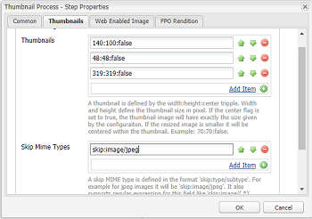

# ImageMagick 설치 및 구성 [!DNL Experience Manager Assets] {#install-and-configure-imagemagick-to-work-with-aem-assets}

ImageMagick은 비트맵 이미지를 작성, 편집, 작성 또는 변환하는 소프트웨어 플러그인입니다. PNG, JPEG, JPEG-2000, GIF, TIFF, DPX, EXR, WebP, Postscript, PDF, SVG 등 다양한 형식(200개 이상)으로 이미지를 읽고 쓸 수 있습니다. ImageMagick을 사용하여 이미지의 크기 조정, 뒤집기, 대칭복사, 회전, 왜곡, 기울이기 및 변형을 수행할 수 있습니다. ImageMagick를 사용하여 이미지 색상을 조정하거나 다양한 특수 효과를 적용하거나 텍스트, 선, 다각형, 타원 및 곡선을 그릴 수도 있습니다.

사용 [!DNL Adobe Experience Manager] ImageMagick를 통해 이미지를 처리할 명령줄의 미디어 핸들러입니다. ImageMagick를 사용하여 다양한 파일 형식으로 작업하려면 다음을 참조하십시오. [자산 파일 형식 우수 사례](/help/assets/assets-file-format-best-practices.md). 지원되는 모든 파일 형식에 대해 알아보려면 [에셋 지원 형식](/help/assets/assets-formats.md).

ImageMagick을 사용하여 대용량 파일을 처리하려면 일반적인 메모리 요구 사항, IM 정책에 필요한 잠재적인 변경 사항 및 성능에 미치는 전반적인 영향을 고려하십시오. 메모리 요구 사항은 해상도, 비트 깊이, 색상 프로파일 및 파일 형식과 같은 다양한 요소에 따라 다릅니다. ImageMagick을 사용하여 매우 큰 파일을 처리하려는 경우 [!DNL Experience Manager] 서버입니다. 유용한 리소스는 마지막에 제공됩니다.

>[!NOTE]
>
>을 사용하는 경우 [!DNL Experience Manager] 날짜 [!DNL Adobe Managed Services] (AMS) 고해상도 PSD 또는 PSB 파일을 많이 처리하려면 Adobe 고객 지원 센터에 문의하십시오. [!DNL Experience Manager] 은 x 23000 픽셀보다 30000픽셀 이상 높은 해상도의 PSB 파일을 처리하지 못할 수 있습니다.

## ImageMagick 설치 {#installing-imagemagick}

ImageMagic 설치 파일의 여러 버전은 다양한 운영 체제에서 사용할 수 있습니다. 운영 체제에 적합한 버전을 사용합니다.

1. 적절한 항목 다운로드 [ImageMagick 설치 파일](https://www.imagemagick.org/script/download.php) 운영 체제용.
1. 를 호스팅하는 디스크에 ImageMagick를 설치하려면 [!DNL Experience Manager] 서버에서 설치 파일을 시작합니다.

1. 경로 환경 변수를 ImageMagic 설치 디렉토리로 설정합니다.
1. 설치가 성공했는지 확인하려면 다음을 실행합니다. `identify -version` 명령입니다.

## 명령줄 프로세스 단계 설정 {#set-up-the-command-line-process-step}

특정 사용 사례에 대한 명령줄 프로세스 단계를 설정할 수 있습니다. JPEG 이미지 파일을 추가할 때마다 대칭 이동된 이미지 및 썸네일(140x100, 48x48, 319x319 및 1280x1280)을 생성하려면 다음 단계를 수행하십시오 `/content/dam` 다음에 있음 [!DNL Experience Manager] 서버:

1. 다음에서 [!DNL Experience Manager] 서버에서 워크플로 콘솔(`https://[aem_server]:[port]/workflow`) 및 를 엽니다 **[!UICONTROL DAM 자산 업데이트]** 워크플로우 모델.
1. 다음에서 **[!UICONTROL DAM 자산 업데이트]** 워크플로우 모델에서 **[!UICONTROL EPS 썸네일(ImageMagick 제공)]** 단계.
1. 다음에서 **[!UICONTROL 인수 탭]**, 추가 `image/jpeg` (으)로 **[!UICONTROL Mime 유형]** 목록을 표시합니다.

   

1. 다음에서 **[!UICONTROL 명령]** 상자에 다음 명령을 입력합니다.

   `convert ./${filename} -flip ./${basename}.flipped.jpg`

1. 다음 항목 선택 **[!UICONTROL 생성된 렌디션 삭제]** 및 **[!UICONTROL 웹 표현물 생성]** 플래그.

   

1. 다음에서 **[!UICONTROL 웹 사용 이미지]** 탭에서 1280x1280 픽셀 크기의 렌디션에 대한 세부 사항을 지정합니다. 또한 다음을 지정합니다. `image/jpeg` 다음에서 **[!UICONTROL Mimetype]** 상자.

   

1. 클릭 **[!UICONTROL 확인]** 변경 내용을 저장합니다.

   >[!NOTE]
   >
   >다음 `convert` 명령이 기본 버전과 충돌하기 때문에 특정 Windows 버전(예: Windows SE)에서는 실행되지 않을 수 있습니다 `convert` Windows 설치의 일부인 유틸리티입니다. 이 경우 ImageMagick 유틸리티의 전체 경로를 언급하십시오. 예를 들어, 을 지정합니다.
   >
   >
   >`"C:\Program Files\ImageMagick-6.8.9-Q16\convert.exe" -define jpeg:size=319x319 ./${filename} -thumbnail 319x319 cq5dam.thumbnail.319.319.png`

1. 를 엽니다. **[!UICONTROL 프로세스 썸네일]** 단계 및 MIME 유형 추가 `image/jpeg` 아래에 **[!UICONTROL Mime 유형 건너뛰기]**.

   

1. 다음에서 **[!UICONTROL 웹 사용 이미지]** 탭에서 MIME 유형 추가 `image/jpeg` 다음 아래에 **[!UICONTROL 목록 건너뛰기]**. 클릭 **[!UICONTROL 확인]** 변경 내용을 저장합니다.

   

1. 워크플로우를 저장합니다.

1. 적절한 처리를 확인하려면 JPG 이미지를 다음에 업로드하십시오. [!DNL Assets]. 처리가 완료되면 뒤집힌 이미지와 표현물이 생성되는지 확인합니다.

## 보안 취약성 완화 {#mitigating-security-vulnerabilities}

ImageMagick을 사용하여 이미지를 처리하는 것과 관련된 여러 보안 취약점이 있습니다. 예를 들어 사용자가 제출한 이미지를 처리하면 RCE(원격 코드 실행)가 발생합니다.

또한 PHP의 이미지, Ruby의 이미지 및 paperclip, nodejs의 이미지magick 등 다양한 이미지 처리 플러그인은 ImageMagick 라이브러리에 따라 다릅니다.

Adobe ImageMagick 또는 영향을 받는 라이브러리를 사용하는 경우 다음 작업 중 하나 이상(하지만 둘 다)을 수행하여 알려진 취약성을 완화하는 것이 좋습니다.

1. 모든 이미지 파일이 예상대로 시작하는지 확인합니다. [&quot;매직 바이트&quot;](https://en.wikipedia.org/wiki/List_of_file_signatures) 처리를 위해 ImageMagick으로 보내기 전에 지원하는 이미지 파일 형식에 해당합니다.
1. 정책 파일을 사용하여 취약한 ImageMagick 코드를 비활성화합니다. ImageMagick에 대한 전역 정책은 다음 위치에서 찾을 수 있습니다. `/etc/ImageMagick`.
