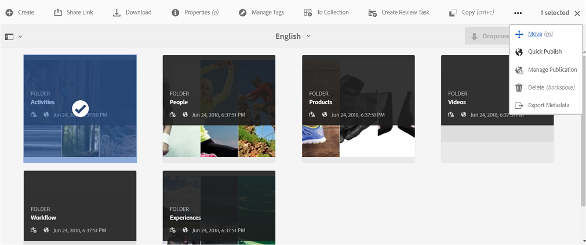

# 브랜드 포털과 AEM 자산 통합 구성 {#configure-aem-assets-integration-with-brand-portal}

AEM(Adobe Experience Manager) 자산 브랜드 포털 고객의 경우 AEM 자산을 브랜드 포털에 게시하기 위해 브랜드 포털에 통합할 수 있습니다. Adobe.io 인터페이스를 통해 이 통합을 설정할 수 있습니다.

먼저 Marketing Cloud 공개 게이트웨이에 인증 메커니즘을 포함하는 응용 프로그램을 만듭니다. 그런 다음, 게이트웨이에서 얻은 애플리케이션 ID를 사용하여 AEM 자산 인스턴스에서 프로필을 만듭니다.

이 구성을 사용하여 AEM 자산에서 브랜드 포털에 자산을 게시합니다. 백엔드에서 AEM 서버가 게이트웨이로 프로필을 인증한 다음 AEM 자산을 브랜드 포털과 통합합니다.

>[!NOTE]
>
>Auth 통합을 구성하기 위한 사용자 인터페이스는 https://legacy-oauth.cloud.adobe.io/ [에서 호스팅되며](https://legacy-oauth.cloud.adobe.io/), 이전 호스팅된 파일은 https://marketing.adobe.com/developer/에서 [호스팅됩니다](https://marketing.adobe.com/developer/).

## JWT 응용 프로그램 만들기 {#create-jwt-application}

1. Adobe [ID로](https://legacy-oauth.cloud.adobe.io/) https://legacy-oauth.cloud.adobe.io/에 로그인합니다. **JWT 애플리케이션** 페이지가 열립니다.

   >[!NOTE]
   >
   >조직의 시스템 관리자인 경우에만 응용 프로그램 ID를 만들 수 있습니다. 테넌트는 Adobe Marketing Cloud에 등록된 조직의 기술 이름입니다.

1. 응용 **[!UICONTROL 프로그램]** 추가를 선택하여 응용 프로그램을 만듭니다.
1. 응용 프로그램의 이름과 선택적 설명을 지정합니다.
1. 조직 **[!UICONTROL 목록에서]** 자산을 동기화할 조직을 선택합니다.
1. [ **[!UICONTROL 범위]** ] 목록에서 **[!UICONTROL dam-read]**, **[!UICONTROL dam-sync]**, dam-write **[!UICONTROL ,]****** dam-writeAndCc-share를 선택합니다.
1. **[!UICONTROL 추가]**&#x200B;를 클릭합니다. JWT 서비스 응용 프로그램이 생성됩니다. 애플리케이션을 편집하고 저장할 수 있습니다.
1. 새 응용 프로그램에 대해 생성된 응용 프로그램 ID를 복사합니다.

   >[!NOTE]
   >
   >응용 프로그램 ID 대신 응용 프로그램 암호를 실수로 복사하지 않도록 하십시오.

## 새 클라우드 구성 만들기 {#create-a-new-cloud-configuration}

1. 로컬 AEM **[!UICONTROL 자산]** 인스턴스의 탐색 페이지에서 왼쪽의 **[!UICONTROL 도구]** 아이콘을 클릭합니다.

1. 클라우드 서비스 **[!UICONTROL > 기존]클라우드[!UICONTROL 서비스로 이동합니다]**.

   

1. 클라우드 **[!UICONTROL 서비스에서]** Adobe Experience Cloud **[!UICONTROL 에서]** Assets 브랜드 **[!UICONTROL 포털 서비스를]**&#x200B;찾습니다.

   

1. 서비스 **[!UICONTROL 아래에 있는 지금]** 구성 링크를 클릭하여 구성 **[!UICONTROL 만들기 대화 상자를 표시합니다]** .
1. 구성 **[!UICONTROL 만들기]** 대화 상자에서 새 구성의 제목과 이름을 지정하고 만들기를 **[!UICONTROL 클릭합니다]**.

   

1. AEM **[!UICONTROL 자산 브랜드 포털 복제]** 대화 상자의 테넌트 URL **[!UICONTROL 필드에 조직의 URL을 지정합니다]** .
1. 클라이언트 **[!UICONTROL ID]** 필드에서 복사한 응용 프로그램 ID를 응용 프로그램 [만들기](/help/assets/brand-portal-configuring-integration.md#create-jwt-application)절차의 끝에 붙여 넣습니다. 확인을 **[!UICONTROL 선택합니다]**.

   

1. AEM에서 게시된 자산을 일반 사용자가 브랜드 포털에서 공개적으로 사용할 수 있도록 하려면 공개 폴더 게시 **[!UICONTROL 확인란을]** 활성화합니다.

   >[!NOTE]
   >
   >공용 폴더 게시를 **[!UICONTROL 활성화하는 옵션은]** AEM 6.3.2.1 이상 버전에서 사용할 수 있습니다.

1. 브랜드 포털 **[!UICONTROL 구성]** 페이지에서 공개 키 **[!UICONTROL 표시를 클릭하여]** 인스턴스에 대해 생성된 공개 키를 표시합니다.

   

   또는 OAuth **[!UICONTROL 게이트웨이에 대한 공개 키 다운로드를]** 클릭하여 공개 키가 포함된 파일을 다운로드합니다. 그런 다음 파일을 열어 공개 키를 표시합니다.

## 통합 활성화 {#enable-integration}

1. Marketing Cloud에 새 구성 추가 절차의 마지막 단계에서 언급한 다음 방법 중 [하나를 사용하여 공개 키를 표시합니다](/help/assets/brand-portal-configuring-integration.md#create-a-new-cloud-configuration).

   * 공개 **[!UICONTROL 키]** 표시 단추를 클릭하여 키를 표시합니다.
   * 키가 들어 있는 다운로드한 파일을 엽니다.

1. Marketing Cloud Developer Connection 인터페이스를 열고 애플리케이션 [만들기에서 만든 응용 프로그램을](/help/assets/brand-portal-configuring-integration.md#create-jwt-application)클릭합니다.
1. 구성 인터페이스의 공개 **[!UICONTROL 키]** 필드에 공개 키 붙여넣기
1. **[!UICONTROL 저장]**&#x200B;을 클릭합니다. 응용 프로그램이 업데이트되었다는 메시지가 나타납니다.

## 통합 테스트 {#test-the-integration}

1. 로컬 AEM **[!UICONTROL 자산]** 인스턴스의 탐색 페이지에서 왼쪽의 **[!UICONTROL 도구]** 아이콘을 클릭합니다.

1. 배포 **[!UICONTROL > 복제로]** 이동합니다 ****.

   

1. 복제 **[!UICONTROL 페이지에서]** 작성자의 **[!UICONTROL 에이전트를 클릭합니다]**.

   

1. AEM 작성자 및 브랜드 포털 간의 연결을 확인하려면 4개의 복제 에이전트 중 하나를 열고 연결 **[!UICONTROL 테스트를 클릭합니다]**.

   >[!NOTE]
   >
   >복제 에이전트는 동시에 작동하여 작업 분포를 동일하게 공유하므로 게시 속도가 원래 속도보다 4배 더 빨라집니다. 클라우드 서비스가 구성된 후에는 여러 자산의 병렬 게시를 활성화하기 위해 기본적으로 활성화된 복제 에이전트를 활성화하는 추가 구성이 필요하지 않습니다.

   >[!NOTE]
   >
   >일부 자산의 복제가 실패할 수 있으므로 복제 에이전트를 비활성화하지 마십시오.

   

1. 테스트 결과 하단을 확인하여 복제가 성공했는지 확인합니다.

   

복제가 성공하면 자산, 폴더 및 컬렉션을 브랜드 포털에 게시할 수 있습니다. 자세한 내용은 다음을 참조하십시오.

* [브랜드 포털에 자산 및 폴더 게시](/help/assets/brand-portal-publish-folder.md)
* [브랜드 포털에 컬렉션 게시](/help/assets/brand-portal-publish-collection.md)

## Publish assets to Brand Portal {#publish-assets-to-brand-portal}

복제가 성공하면 자산, 폴더 및 컬렉션을 브랜드 포털에 게시할 수 있습니다. 브랜드 포털에 자산을 게시하려면 다음 단계를 따르십시오.

>[!NOTE]
>
>피크 시간이 아닌 시간에 구애받지 않고 AEM 작성자가 초과 리소스를 차지하지 않도록 시차 게시를 권장합니다.

1. 자산 콘솔에서 게시할 자산/폴더를 선택하고 도구 모음에서 빠른 **[!UICONTROL 게시]** 옵션을 클릭합니다.

   또는 브랜드 포털에 게시할 자산을 선택합니다.

   

1. 자산을 브랜드 포털에 게시하려면 다음 두 가지 옵션을 사용할 수 있습니다.
   * [즉시 에셋 게시](#publish-to-bp-now)
   * [나중에 자산 게시](#publish-to-bp-now)

### 지금 자산 게시 {#publish-to-bp-now}

선택한 자산을 브랜드 포털에 게시하려면 다음 중 하나를 수행합니다.

* 도구 모음에서 빠른 게시를 **[!UICONTROL 선택합니다]**. 그런 다음 메뉴에서 브랜드 포털에 **[!UICONTROL 게시를 선택합니다]**.

* 도구 모음에서 게시 **[!UICONTROL 관리를 선택합니다]**.

   1. 그런 다음 작업에서 **[!UICONTROL 브랜드 포털에]** 게시를 **[!UICONTROL 선택하고]**&#x200B;예약에서 **[!UICONTROL 지금 게시를]** 선택합니다 ****. **[!UICONTROL 다음]**&#x200B;을 클릭합니다.

   2. 범위 **[!UICONTROL 내에서]**&#x200B;선택을 확인하고 브랜드 포털에 **[!UICONTROL 게시를 클릭합니다]**.

에셋이 브랜드 포털에 게시하기 위해 큐에 올라가 있음을 나타내는 메시지가 나타납니다. 브랜드 포털 인터페이스에 로그인하여 게시된 자산을 확인합니다.

### 나중에 자산 게시 {#publish-to-bp-later}

Brand Portal에 자산을 나중에 게시할 수 있도록 예약하려면:

1. 게시할 자산/폴더를 선택한 후 **[!UICONTROL 맨 위의 도구 모음에서]** 게시 관리를 선택합니다.

1. 게시 **[!UICONTROL 페이지에서]** **[!UICONTROL 게시]** 작업에서 **[!UICONTROL 브랜드 포털에]** 게시를 **[!UICONTROL 선택하고]** 나중에 게시 예약에서 ****&#x200B;을 선택합니다.

   

1. 활성화 **[!UICONTROL 날짜를]** 선택하고 시간을 지정합니다. **[!UICONTROL 다음]**&#x200B;을 클릭합니다.

1. 활성화 **날짜를** 선택하고 시간을 지정합니다. **다음**&#x200B;을 클릭합니다.

1. 워크플로우에서 **[!UICONTROL 워크플로우 제목을]** 지정합니다 ****. 나중에 **[!UICONTROL 게시를 클릭합니다]**.

   

이제 브랜드 포털에 로그인하여 게시된 자산을 브랜드 포털 인터페이스에서 사용할 수 있는지 확인합니다.

