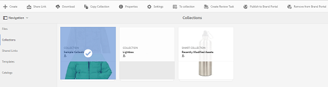

# 컬렉션을 Brand Portal에 게시 {#publish-collections-to-brand-portal}

Adobe Experience Manager(AEM) 자산 관리자는 조직의 AEM Assets 브랜드 포털 인스턴스에 컬렉션을 게시할 수 있습니다. 그러나 먼저 AEM Assets을 브랜드 포털과 통합해야 합니다. 자세한 내용은 [Brand Portal에서 AEM Assets 구성](/help/assets/configure-aem-assets-with-brand-portal.md)을 참조하십시오.

AEM Assets에서 원래 컬렉션을 나중에 수정하는 경우 컬렉션을 다시 게시하기 전까지 변경 내용이 브랜드 포털에 반영되지 않습니다. 이러한 특성을 통해 브랜드 포털에서 진행 중인 변경 작업을 사용할 수 없습니다. 관리자가 게시한 승인된 변경 사항만 Brand Portal에서 사용할 수 있습니다.

>[!NOTE]
>
>컨텐츠 조각은 Brand Portal에 게시할 수 없습니다. 따라서 AEM 작성자에서 컨텐츠 조각을 선택하면 **브랜드 포털에 게시** 작업을 사용할 수 없습니다.
>
>콘텐츠 조각이 포함된 컬렉션이 AEM 작성자에서 브랜드 포털로 게시되면 콘텐츠 조각을 제외한 폴더의 모든 콘텐츠가 브랜드 포털 인터페이스에 복제됩니다.

## 컬렉션을 브랜드 포털 {#publish-a-collection-to-brand-portal}에 게시

1. AEM Assets UI에서 AEM 로고를 클릭합니다.
1. **탐색** 페이지에서 **자산 > 컬렉션**&#x200B;으로 이동합니다.
1. 컬렉션 콘솔에서 브랜드 포털에 게시할 컬렉션을 선택합니다.

   

1. 도구 모음에서 **Brand Portal에 게시**&#x200B;를 클릭합니다.
1. 확인 대화 상자에서 **게시**&#x200B;를 클릭합니다.
1. 확인 메시지를 닫습니다.
1. Brand Portal에 관리자로 로그인합니다. 게시된 컬렉션은 컬렉션 콘솔에서 사용할 수 있습니다.

   

## 컬렉션 게시 취소 {#unpublish-collections}

AEM Assets에서 브랜드 포털에 게시하는 컬렉션을 게시 취소할 수 있습니다. 원본 컬렉션을 게시 취소한 후에는 더 이상 브랜드 포털 사용자가 해당 사본을 사용할 수 없습니다.

1. AEM Assets 인스턴스의 컬렉션 콘솔에서 게시 취소할 컬렉션을 선택합니다.

   

1. 도구 모음에서 **Brand Portal에서 제거** 아이콘을 클릭합니다.
1. 대화 상자에서 **게시 취소**&#x200B;를 클릭합니다.
1. 확인 메시지를 닫습니다. 컬렉션이 Brand Portal 인터페이스에서 제거됩니다.

