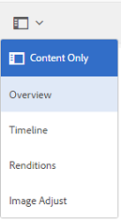

# Camera Raw {#camera-raw-support}를 사용하여 이미지 처리

[!DNL Adobe Camera Raw] 지원을 사용하여 CR2, NEF 및 RAF와 같은 원시 파일 형식을 처리하고 JPEG 형식으로 이미지를 렌더링할 수 있습니다. 이 기능은 소프트웨어 배포에서 사용할 수 있는 [Camera Raw 패키지](https://experience.adobe.com/#/downloads/content/software-distribution/en/aem.html?package=/content/software-distribution/en/details.html/content/dam/aem/public/adobe/packages/aem630/product/assets/aem-assets-cameraraw-pkg)를 사용하여 [!DNL Adobe Experience Manager Assets]에서 지원됩니다.

>[!NOTE]
>
>기능은 JPEG 표현물만 지원합니다. Windows 64비트, Mac OS 및 RHEL 7.x에서 지원됩니다.

[!DNL Experience Manager Assets]에서 [!DNL Camera Raw] 지원을 활성화하려면 다음 단계를 수행하십시오.

1. 소프트웨어 배포에서 [Camera Raw 패키지](https://experience.adobe.com/#/downloads/content/software-distribution/en/aem.html?package=/content/software-distribution/en/details.html/content/dam/aem/public/adobe/packages/aem630/product/assets/aem-assets-cameraraw-pkg)를 다운로드합니다.
1. 액세스 `https://[aem_server]:[port]/workflow`. **[!UICONTROL DAM 자산 업데이트]** 워크플로우를 엽니다.
1. **[!UICONTROL 축소판 처리]** 단계를 엽니다.
1. **[!UICONTROL 축소판 그림]** 탭에서 다음 구성을 제공합니다.

   * **[!UICONTROL 축소판 그림]**:  `140:100:false, 48:48:false, 319:319:false`
   * **[!UICONTROL MIME 유형 건너뛰기]**: `skip:image/dng, skip:image/x-raw-(.*)`

   

1. **[!UICONTROL 웹 지원 이미지]** 탭의 **[!UICONTROL 목록 건너뛰기]** 필드에서 `audio/mpeg, video/(.*), image/dng, image/x-raw-(.*)`를 지정합니다.

   

1. 사이드 패널에서 **[!UICONTROL 축소판 작성]** 단계 아래에 **[!UICONTROL Camera Raw/DNG 처리기]** 단계를 추가합니다.
1. **[!UICONTROL Camera Raw/DNG 핸들러]** 단계의 **[!UICONTROL 인수]** 탭에 다음 구성을 추가합니다.

   * **[!UICONTROL Mime 유형]**: `image/dng` 및  `image/x-raw-(.*)`
   * **[!UICONTROL Command]**:

      * `DAM_Raw_Converter ${directory}/${filename} ${directory} cq5dam.web.1280.1280.jpeg 1280 1280`
      * `DAM_Raw_Converter ${directory}/${filename} ${directory} cq5dam.thumbnail.319.319.jpeg 319 319`
      * `DAM_Raw_Converter ${directory}/${filename} ${directory} cq5dam.thumbnail.140.100.jpeg 140 100`
      * `DAM_Raw_Converter ${directory}/${filename} ${directory} cq5dam.thumbnail.48.48.jpeg 48 48`

   

1. **[!UICONTROL 저장]**&#x200B;을 클릭합니다.

>[!NOTE]
>
>위의 구성이 **[!UICONTROL 샘플 DAM 자산 업데이트 및 Camera Raw 및 DNG 처리 단계]** 구성과 동일한지 확인합니다.

이제 Camera Raw 파일을 Assets에 가져올 수 있습니다. Camera Raw 패키지를 설치하고 필요한 워크플로우를 구성하면 측면 창 목록에 **[!UICONTROL 이미지 조정]** 옵션이 나타납니다.

*그림:사이드 창의 옵션.*

*그림:옵션을 사용하여 이미지를 간단히 편집할 수 있습니다.*

편집 내용을 [!DNL Camera Raw] 이미지에 저장하면 이미지에 대한 새 표현물 `AdjustedPreview.jpg`이 생성됩니다. [!DNL Camera Raw] 이외의 다른 이미지 유형의 경우 변경 사항이 모든 변환에 반영됩니다.

## 우수 사례, 알려진 문제 및 제한 사항 {#best-practices}

기능에는 다음과 같은 제한 사항이 있습니다.

* 기능은 JPEG 표현물만 지원합니다. Windows 64비트, Mac OS 및 RHEL 7.x에서 지원됩니다.
* 메타데이터 원본에 쓰기 작업은 RAW 및 DNG 형식에 대해 지원되지 않습니다.
* [!DNL Camera Raw] 라이브러리에는 한 번에 처리할 수 있는 총 픽셀에 대한 제한이 있습니다. 현재 파일의 긴 쪽에서는 최대 65000 픽셀이나 먼저 조건에 맞는 512MP를 처리할 수 있습니다.
