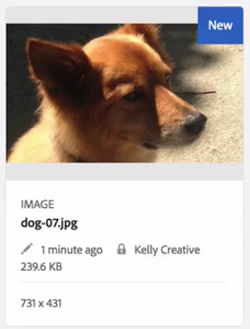
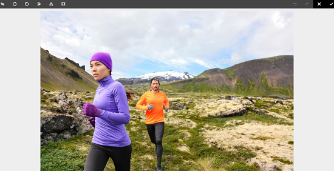

# [!DNL Experience Manager] DAM {#check-in-and-check-out-files-in-assets}의 체크 인 및 체크 아웃 파일

[!DNL Adobe Experience Manager Assets] 편집할 에셋을 확인하고 변경을 완료한 후 다시 체크 인할 수 있습니다. 자산을 체크 아웃한 후, 자신만 자산을 편집, 주석 달기, 게시, 이동 또는 삭제할 수 있습니다. 자산을 체크 아웃하면 자산이 잠깁니다. 자산을 다시 [!DNL Assets]으로 체크 인하기 전에는 다른 사용자가 자산에 대해 이러한 작업을 수행할 수 없습니다. 하지만 잠긴 자산에 대한 메타데이터를 변경할 수는 있습니다.

자산을 체크 아웃/체크 인하려면 자산에 대해 쓰기 액세스 권한이 필요합니다.

이 기능은 여러 사용자가 팀 간의 편집 워크플로우에 대해 공동으로 작업하는 작성자가 변경한 내용을 다른 사용자가 덮어쓰는 것을 방지할 수 있도록 도와줍니다.

## 자산 {#checking-out-assets} 확인

1. [!DNL Assets] 사용자 인터페이스에서 체크 아웃할 자산을 선택합니다. 여러 자산을 선택하여 체크 아웃할 수도 있습니다.
1. 도구 모음에서 **[!UICONTROL 체크아웃]**을 클릭합니다.
**[!UICONTROL 체크아웃]** 옵션은 **[!UICONTROL 체크 인]**으로 전환합니다.
체크 아웃한 자산을 다른 사용자가 편집할 수 있는지 확인하려면 다른 사용자로 로그인합니다. 체크 아웃한 자산의 축소판에 잠금 기호가 표시됩니다.

   

   자산을 선택합니다. 도구 모음에는 자산을 편집, 주석, 게시 또는 삭제할 수 있는 옵션이 표시되지 않습니다.

   

   **[!UICONTROL 속성 보기]**&#x200B;를 클릭하여 잠긴 자산에 대한 메타데이터를 편집할 수 있습니다.

1. **[!UICONTROL 편집]**&#x200B;을 클릭하여 자산을 편집 모드로 엽니다.

   

1. 자산을 편집하고 변경 내용을 저장합니다. 예를 들어 이미지를 자르고 저장합니다.

   

   자산에 주석을 달거나 게시하도록 선택할 수도 있습니다.

1. [!DNL Assets] 인터페이스에서 편집된 자산을 선택하고 도구 모음에서 **[!UICONTROL 체크 인]**&#x200B;을 클릭합니다. 수정된 자산이 [!DNL Assets]에 체크 인되고 다른 사용자가 편집할 수 있습니다.

## {#forced-check-in} 강제 체크 인

관리자는 다른 사용자가 체크 아웃한 자산을 체크 인할 수 있습니다.

1. [!DNL Assets]에 관리자로 로그인합니다.
1. [!DNL Assets] 사용자 인터페이스에서 다른 사용자가 체크 아웃한 자산을 하나 이상 선택합니다.

   

1. 도구 모음에서 **[!UICONTROL 잠금 해제]**&#x200B;를 클릭합니다. 자산이 다시 체크 인되고 다른 사용자가 편집할 수 있습니다.

## 모범 사례 및 제한 사항 {#tips-limitations}

* 체크 아웃된 자산 파일이 포함된 *폴더*&#x200B;를 삭제할 수 있습니다. 폴더를 삭제하기 전에 사용자가 디지털 자산을 체크 아웃하지 않았는지 확인합니다.

>[!MORELIKETHIS]
>
>* [Experience Manager 데스크탑 앱에서 체크 인 및 체크 아웃 이해](https://experienceleague.adobe.com/docs/experience-manager-desktop-app/using/using.html?lang=en#how-app-works2)
>* [자산 체크 인 및 체크 아웃을 이해하는 비디오 자습서](https://experienceleague.adobe.com/docs/experience-manager-learn/assets/collaboration/check-in-and-check-out.html)

