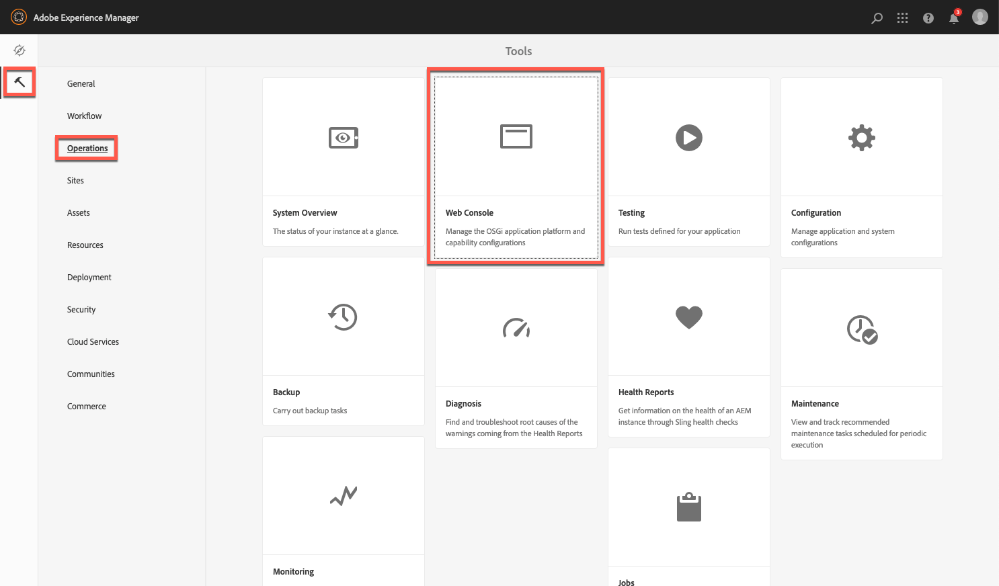
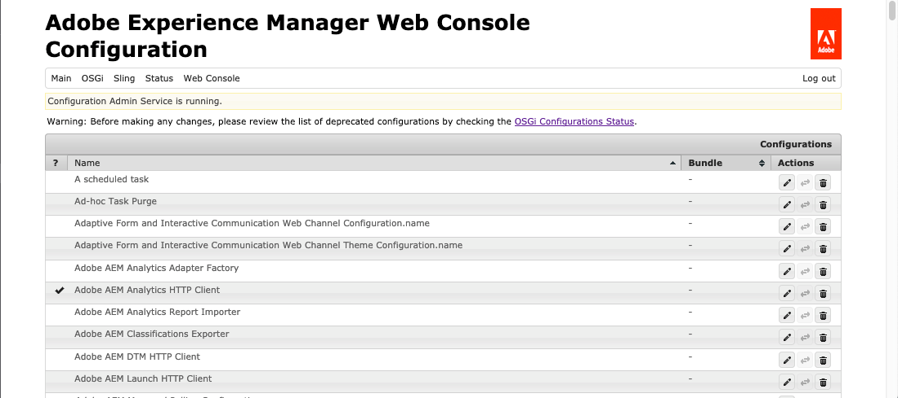
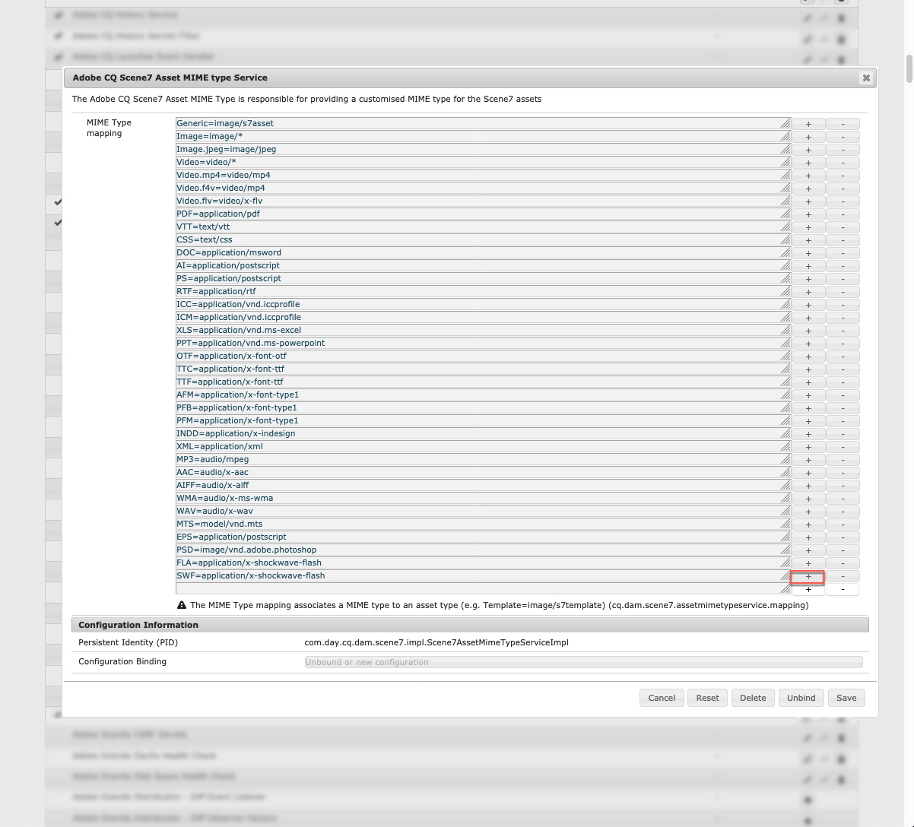
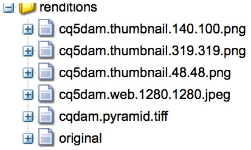

# Dynamic Media 구성 - Scene7 모드{#configuring-dynamic-media-scene-mode}

개발, 스테이징 및 프로덕션과 같은 다른 환경에 대해 Adobe Experience Manager 설정을 사용하는 경우 해당 환경 각각에 대해 Dynamic Media Cloud Services을 구성합니다.

## Dynamic Media 아키텍처 다이어그램 - Scene7 모드 {#architecture-diagram-of-dynamic-media-scene-mode}

다음 아키텍처 다이어그램에서는 Dynamic Media - Scene7 모드가 작동하는 방식을 설명합니다.

새로운 아키텍처에서는 Experience Manager이 기본 소스 자산을 담당하고 에셋 처리 및 게시를 위해 Dynamic Media과 동기화합니다.

1. 기본 소스 에셋이 Experience Manager에 업로드되면 Dynamic Media에 복제됩니다. 이때 Dynamic Media은 이미지의 비디오 인코딩 및 동적 변형과 같은 모든 에셋 처리 및 변환 생성을 처리합니다.<!-- (In Dynamic Media - Scene7 mode, be aware that you can only upload assets whose file sizes are 2 GB or less.) Jira ticket CQ-4286561 fixed this issue. DM-S7 NOW SUPPORTS THE UPLOAD OF ASSETS LARGER THAN 2 GB. -->
1. 변환이 생성되면 Experience Manager에서 안전하게 원격 Dynamic Media 변환에 액세스하고 미리 볼 수 있습니다(이진 파일은 Experience Manager 인스턴스로 다시 전송되지 않음).
1. 컨텐츠가 게시 및 승인될 준비가 되면, Dynamic Media 서비스는 컨텐츠를 전달 서버로 푸시하고 CDN(Content Delivery Network)의 컨텐츠를 캐시하도록 트리거합니다.


>[!IMPORTANT]
>
>Experience Manager Dynamic Media과 함께 번들로 제공되는 CDN을 사용하지 않는 고객은 다음 기능을 이용할 수 없습니다.
>* [스마트 이미징](https://experienceleague.adobe.com/docs/experience-manager-cloud-service/assets/dynamicmedia/imaging-faq.html?lang=en#dynamicmedia)
>* [캐시 무효화](https://experienceleague.adobe.com/docs/experience-manager-cloud-service/assets/dynamicmedia/invalidate-cdn-cache-dynamic-media.html?lang=en#dynamicmedia)
>* [핫링크 보호](https://experienceleague.adobe.com/docs/experience-manager-cloud-service/assets/dynamicmedia/hotlink-protection.html?lang=en#dynamicmedia)
>* [컨텐츠의 HTTP/2 전달](https://experienceleague.adobe.com/docs/experience-manager-cloud-service/assets/dynamicmedia/http2faq.html?lang=en#dynamicmedia)
>* [Dynamic Media 뷰어와 Adobe Analytics 및 Experience Platform Launch 통합](https://experienceleague.adobe.com/docs/experience-manager-cloud-service/assets/dynamicmedia/launch.html?lang=en#dynamicmedia)
>* CDN 수준에서 URL 리디렉션
>* Akamai ChinaCDN(중국에서 최적의 전달을 위해)


## Scene7 모드에서 Dynamic Media 활성화 {#enabling-dynamic-media-in-scene-mode}

[Dynamic Media는 기본적으로 비활성화됩니다. ](https://www.adobe.com/solutions/web-experience-management/dynamic-media.html) Dynamic Media 기능을 활용하려면 활성화해야 합니다.

>[!NOTE]
>
>Dynamic Media - Scene7 모드는 Experience Manager 작성자 인스턴스에만 사용됩니다. 이와 같이 Experience Manager 작성자 인스턴스에 `runmode=dynamicmedia_scene7`이(가)*아닌*&#x200B;을(를) 구성해야 합니다.

Dynamic Media을 활성화하려면 터미널 창에 다음을 입력하여 명령줄에서 `dynamicmedia_scene7` 실행 모드를 사용하여 Experience Manager을 시작해야 합니다(사용된 예제 포트는 4502).

```shell
java -Xms4096m -Xmx4096m -Doak.queryLimitInMemory=500000 -Doak.queryLimitReads=500000 -jar cq-quickstart-6.5.0.jar -gui -r author,dynamicmedia_scene7 -p 4502
```

## (선택 사항) Dynamic Media 사전 설정 및 구성을 6.3에서 6.5 가동 중지 시간 0으로 마이그레이션 {#optional-migrating-dynamic-media-presets-and-configurations-from-to-zero-downtime}

이제 6.3에서 6.4 또는 6.5로 Experience Manager Dynamic Media을 업그레이드하면 다운타임 없이 배포할 수 있습니다. 모든 사전 설정 및 구성을 CRXDE Lite의 `/etc`에서 `/conf`(으)로 마이그레이션하려면 반드시 다음 curl 명령을 실행하십시오.

>[!NOTE]
>
>호환성 모드에서 Experience Manager 인스턴스를 실행하는 경우(즉, 패키지화된 호환성 설치) 이러한 명령을 실행할 필요가 없습니다.

호환성 패키지가 있거나 없는 모든 업그레이드의 경우 다음 Linux 말림 명령을 실행하여 원래 Dynamic Media과 함께 제공된 기본 기본 기본 기본 뷰어 사전 설정을 복사할 수 있습니다.

`curl -u admin:admin -X POST https://<server_address>:<server_port>/libs/settings/dam/dm/presets/viewer.pushviewerpresets.json`

`/etc`에서 만든 사용자 정의 뷰어 사전 설정 및 구성을 `/conf`(으)로 마이그레이션하려면 다음 Linux 말림 명령을 실행하십시오.

`curl -u admin:admin -X POST https://<server_address>:<server_port>/libs/settings/dam/dm/presets.migratedmcontent.json`

## 벌크 자산 마이그레이션을 위한 기능 팩 18912 설치 {#installing-feature-pack-for-bulk-asset-migration}

기능 팩 18912의 설치는 *선택 사항*&#x200B;입니다.

기능 팩 18912를 사용하면 FTP를 통해 에셋을 일괄적으로 인제스트하거나 Dynamic Media - 하이브리드 모드 또는 Dynamic Media Classic에서 Experience Manager의 Dynamic Media - Scene7 모드로 에셋을 마이그레이션할 수 있습니다. [Adobe Professional Services](https://www.adobe.com/experience-cloud/consulting-services.html)에서 사용할 수 있습니다.

자세한 내용은 [벌크 에셋 마이그레이션에 대한 기능 팩 18912 설치](/help/assets/bulk-ingest-migrate.md)를 참조하십시오.

## Cloud Services {#configuring-dynamic-media-cloud-services}에서 Dynamic Media 구성 만들기

**Dynamic Media**  구성 전 - Dynamic Media 자격 증명을 사용하여 프로비저닝 이메일을 받은 후  [Dynamic Media Classic 데스크톱 응용](https://experienceleague.adobe.com/docs/dynamic-media-classic/using/getting-started/signing-out.html#getting-started) 프로그램을 연 다음 계정에 로그인하여 암호를 변경해야 합니다. 프로비저닝 이메일에 제공된 암호는 시스템에서 생성되며 임시 암호에만 사용됩니다. Dynamic Media Cloud Service이 올바른 자격 증명으로 설정되도록 암호를 업데이트해야 합니다.


**Cloud Services에서 Dynamic Media 구성을 만들려면**

1. Experience Manager에서 Experience Manager 로고를 눌러 글로벌 탐색 콘솔에 액세스하고 도구 아이콘을 누른 다음 **[!UICONTROL Cloud Services > Dynamic Media 구성을 누릅니다.]**
1. Dynamic Media 구성 브라우저 페이지의 왼쪽 창에서 **[!UICONTROL global]**(**[!UICONTROL global]** 왼쪽에 있는 폴더 아이콘을 탭하거나 선택하지 않음)을 누른 다음 **[!UICONTROL 만들기를 탭합니다.]**
1. **[!UICONTROL Dynamic Media 구성 만들기]** 페이지에서 제목, Dynamic Media 계정 이메일 주소, 암호를 입력한 다음 지역을 선택합니다. 이 정보는 Adobe이 제공 이메일에서 제공합니다. 이메일을 받지 못한 경우 Adobe 고객 지원 센터에 문의하십시오.

   **[!UICONTROL Dynamic Media에 연결을 누릅니다.]**

   >[!NOTE]
   Dynamic Media 자격 증명을 사용하여 프로비저닝 전자 메일을 받은 후 [Dynamic Media Classic 데스크톱 응용 프로그램](https://experienceleague.adobe.com/docs/dynamic-media-classic/using/getting-started/signing-out.html#getting-started)을(를) 연 다음 계정에 로그인하여 암호를 변경합니다. 프로비저닝 이메일에 제공된 암호는 시스템에서 생성되며 임시 암호에만 사용됩니다. Dynamic Media Cloud Service이 올바른 자격 증명으로 설정되도록 암호를 업데이트해야 합니다.

1. 연결이 성공하면 다음을 설정합니다. 별표(*)가 있는 머리글은 필수입니다.

   * **[!UICONTROL 회사]**  - Dynamic Media 계정의 이름입니다. 여러 개의 Dynamic Media 계정이 있습니다. 예를 들어 서로 다른 하위 브랜드, 사업부, 스테이징 또는 프로덕션 환경을 가질 수 있습니다.

   * **[!UICONTROL 회사 루트 폴더 경로]**

   * **[!UICONTROL 자산 게시]**  - 다음 3가지 옵션 중에서 선택할 수 있습니다.
      * **[!UICONTROL 즉시]** 는 에셋이 업로드되면 시스템이 에셋을 인제스트하고 URL/포함을 즉시 제공함을 의미합니다. 자산을 게시하는 데 필요한 사용자 개입은 없습니다.
      * **[!UICONTROL 활성화 시]** 는 URL/포함 링크가 제공되기 전에 먼저 자산을 명시적으로 게시해야 함을 의미합니다.
      * **[!UICONTROL 선택적]** 게시이 옵션을 사용하면 Dynamic Media에 게시되는 폴더를 제어할 수 있습니다. 스마트 자르기 또는 동적 표현물과 같은 기능을 사용하거나 미리 보기 위해 Experience Manager에서만 게시되는 폴더를 결정할 수 있습니다. 동일한 자산은 공개 도메인에 배달을 위해 Dynamic Media에 게시되지 *않습니다*.<br>이 옵션은  **[!UICONTROL Dynamic Media Cloud]** 구성에서 설정하거나, 원할 경우 폴더의  **[!UICONTROL 속성에서 폴더 수준에서 설정할 수 있습니다]**.<br>[Dynamic Media의 선택적 게시 작업을 참조하십시오.](/help/assets/selective-publishing.md)<br>나중에 이 구성을 변경하거나 나중에 폴더 수준에서 변경하면 해당 시점부터 업로드한 새 자산에만 변경 사항이 적용됩니다. **[!UICONTROL 빠른 게시]** 또는 **[!UICONTROL 발행물 관리]** 대화 상자에서 수동으로 변경할 때까지 폴더의 기존 자산의 게시 상태는 그대로 유지됩니다.
   * **[!UICONTROL 보안 미리 보기 서버]**  - 보안 변환 미리 보기 서버에 대한 URL 경로를 지정할 수 있습니다. 즉, 변환이 생성된 후 Experience Manager은 원격 Dynamic Media 변환에 안전하게 액세스하고 미리 볼 수 있습니다(이진 파일은 Experience Manager 인스턴스로 다시 전송되지 않음).
회사 서버 또는 특수 서버를 사용하기 위해 특별한 일정이 없으면 이 설정을 지정한 대로 유지하는 것이 좋습니다.

   * **[!UICONTROL 모든 컨텐츠]**  동기화  <!-- NEW OPTION, CQDOC-15371, Added March 4, 2020-->- 기본적으로 선택되어 있습니다. Dynamic Media에 대한 동기화에서 자산을 선택적으로 포함하거나 제외하려면 이 옵션을 선택 취소합니다. 이 옵션을 선택 해제하면 다음 두 가지 Dynamic Media 동기화 모드 중에서 선택할 수 있습니다.

   * **[!UICONTROL Dynamic Media 동기화 모드]**
      * **[!UICONTROL 기본적으로]**  활성화됨 - 제외용으로 특별히 폴더를 표시하지 않는 한 기본적으로 모든 폴더에 구성이 적용됩니다.  <!-- you can then deselect the folders that you do not want the configuration applied to.-->
      * **[!UICONTROL 기본적으로]**  사용 안 함 - Dynamic Media에 동기화하도록 선택한 폴더를 명시적으로 표시할 때까지 해당 구성은 폴더에 적용되지 않습니다.
Dynamic Media에 동기화할 선택한 폴더를 표시하려면 자산 폴더를 선택한 다음 도구 모음에서 **[!UICONTROL 속성]**&#x200B;을 탭합니다. **[!UICONTROL 세부 사항]** 탭의 **[!UICONTROL Dynamic Media 동기화 모드]** 드롭다운 목록에서 다음 3가지 옵션 중에서 선택합니다. 완료되면 **[!UICONTROL 저장을 누릅니다.]** *기억:이 3가지 옵션은 [모든 내용&#x200B;**동기화]를 선택한 경우 사용할 수**없습니다.* Dynamic Media [의 폴더 수준에서 선택적 게시로 작업을 참조하십시오.](/help/assets/selective-publishing.md)
         * **[!UICONTROL 상속됨]**  - 폴더에 명시적 동기화 값이 없습니다.대신 폴더는 상위 폴더 중 하나 또는 클라우드 구성의 기본 모드에서 동기화 값을 상속합니다. 상속된 도구 설명을 통해 표시되는 세부 상태입니다.
         * **[!UICONTROL 하위 폴더에 대해]**  활성화 - Dynamic Media에 동기화할 수 있도록 이 하위 트리에 모든 것을 포함합니다. 폴더 특정 설정은 클라우드 구성에서 기본 모드를 덮어씁니다.
         * **[!UICONTROL 하위 폴더에 대해]**  사용 안 함 - 이 하위 트리의 모든 항목을 Dynamic Media으로 동기화에서 제외합니다.

   >[!NOTE]
   DMS7에서는 버전 관리가 지원되지 않습니다. 또한, Dynamic Media 구성 편집 페이지의 **[!UICONTROL 자산 게시]**&#x200B;이 **[!UICONTROL 활성화 시]**&#x200B;로 설정된 경우에만 지연된 활성화가 적용됩니다. 그런 다음 자산이 처음 활성화될 때까지만 적용됩니다.
   자산이 활성화되면 모든 업데이트가 즉시 S7 전달에 실시간으로 게시됩니다.

1. **[!UICONTROL 저장을 탭합니다.]**
1. Dynamic Media 컨텐츠를 게시하기 전에 안전하게 미리 보려면 Dynamic Media에 연결하려면 Experience Manager 작성자 인스턴스를 &quot;허용 목록에 추가하다&quot;해야 합니다.

   * [Dynamic Media Classic 데스크톱 응용 프로그램](https://experienceleague.adobe.com/docs/dynamic-media-classic/using/getting-started/signing-out.html#getting-started)을(를) 열고 계정에 로그인합니다. 자격 증명 및 로그인 세부 정보는 프로비저닝 시 Adobe에서 제공되었습니다. 이 정보가 없는 경우 기술 지원에 문의하십시오.

   * 페이지 오른쪽 상단의 탐색 막대에서 **[!UICONTROL 설정 > 응용 프로그램 설정 > 게시 설정 > 이미지 서버]**&#x200B;를 탭합니다.

   * 이미지 서버 게시 페이지의 게시 컨텍스트 드롭다운 목록에서 **[!UICONTROL 이미지 제공 테스트를 선택합니다.]**
   * 클라이언트 주소 필터의 경우 **[!UICONTROL 추가.]**
   * 주소를 활성화(켜기)하려면 확인란을 선택합니다. Experience Manager 작성자 인스턴스의 IP 주소를 입력합니다(발송자 IP가 아님).
   * **[!UICONTROL 저장을 탭합니다.]**

이제 기본 구성으로 완료되었습니다.Dynamic Media - Scene7 모드를 사용할 준비가 되었습니다.

구성을 추가로 사용자 정의하려면 Dynamic Media - Scene7 모드](#optional-configuring-advanced-settings-in-dynamic-media-scene-mode)에서 [(선택 사항) 고급 설정 구성 아래의 작업을 선택적으로 완료할 수 있습니다.

## (선택 사항) Dynamic Media에서 고급 설정 구성 - Scene7 모드 {#optional-configuring-advanced-settings-in-dynamic-media-scene-mode}

Dynamic Media - Scene7 모드의 구성 및 설정을 추가로 사용자 정의하거나 성능을 최적화하려는 경우 다음 *선택적* 작업 중 하나 이상을 완료할 수 있습니다.

* [(선택 사항) Dynamic Media 설정 및 구성 - Scene7 모드 설정](#optional-setup-and-configuration-of-dynamic-media-scene7-mode-settings)

* [(선택 사항) Dynamic Media - Scene7 모드의 성능 조정](#optional-tuning-the-performance-of-dynamic-media-scene-mode)

* [(선택 사항) 복제에 대한 자산 필터링](#optional-filtering-assets-for-replication)

### (선택 사항) Dynamic Media 설정 및 구성 - Scene7 모드 설정 {#optional-setup-and-configuration-of-dynamic-media-scene7-mode-settings}

실행 모드 `dynamicmedia_scene7`에 있는 경우 Dynamic Media Classic 사용자 인터페이스를 사용하여 Dynamic Media 설정을 변경합니다.

위의 작업 중 일부는 [Dynamic Media Classic 데스크톱 응용 프로그램](https://experienceleague.adobe.com/docs/dynamic-media-classic/using/getting-started/signing-out.html#getting-started)을(를) 연 다음 계정에 로그인해야 합니다.

설정 및 구성 작업은 다음과 같습니다.

* [이미지 서버에 대한 게시 설정](#publishing-setup-for-image-server)
* [응용 프로그램 일반 설정 구성](#configuring-application-general-settings)
* [색상 관리 구성](#configuring-color-management)
* [지원되는 형식에 대한 MIME 유형 편집](#editing-mime-types-for-supported-formats)
* [지원되지 않는 형식에 대한 MIME 유형 추가](#adding-mime-types-for-unsupported-formats)
* [이미지 세트 및 스핀 세트를 자동으로 생성하기 위한 일괄 세트 사전 설정 만들기](#creating-batch-set-presets-to-auto-generate-image-sets-and-spin-sets)

#### 이미지 서버 {#publishing-setup-for-image-server}에 대한 게시 설정

제작 설정 설정은 Dynamic Media에서 기본적으로 자산을 제공하는 방법을 결정합니다. 설정이 지정되지 않은 경우 Dynamic Media은 제작 설정에 정의된 기본 설정에 따라 자산을 제공합니다. 예를 들어 해상도 특성을 포함하지 않는 이미지를 전달하도록 요청하면 기본 개체 해상도 설정이 있는 이미지가 생성됩니다.

게시 설정을 구성하려면:Dynamic Media Classic에서 **[!UICONTROL 설정 > 응용 프로그램 설정 > 게시 설정 > 이미지 서버]**&#x200B;를 탭합니다.

[이미지 서버] 화면은 이미지 전달을 위한 기본 설정을 설정합니다. 각 설정에 대한 설명은 UI 화면을 참조하십시오.

* **[!UICONTROL 요청 속성]**  - 이러한 설정은 서버에서 전달할 수 있는 이미지에 대한 제한을 적용합니다.
* **[!UICONTROL 기본 요청 속성]**  - 이 설정은 이미지의 기본 모양과 관련이 있습니다.
* **[!UICONTROL 공통 축소판 속성]**  - 이 설정은 축소판 이미지의 기본 모양과 관련이 있습니다.
* **[!UICONTROL 카탈로그 필드의 기본값]** - 이 설정은 이미지의 해상도 및 기본 축소판 유형과 관련이 있습니다.
* **[!UICONTROL 색상 관리 속성]**  - 이 설정에 따라 사용되는 ICC 색상 프로파일이 결정됩니다.
* **[!UICONTROL 호환성 속성]**  - 이 설정을 사용하면 텍스트 레이어의 맨 앞 및 뒤에 있는 단락이 이전 버전과의 호환성을 위해 버전 3.6에서와 같이 처리됩니다.
* **[!UICONTROL 현지화 지원]**  - 이 설정을 사용하여 여러 로케일 속성을 관리할 수 있습니다. 또한 로케일 맵 문자열을 지정할 수 있으므로 뷰어에서 다양한 도구 설명을 지원할 언어를 정의할 수 있습니다. **[현지화 지원]** 설정에 대한 자세한 내용은 자산 현지화 설정 시 [고려 사항](https://help.adobe.com/en_US/scene7/using/WS997f1dc4cb0179f034e07dc31412799d19a-8000.html)을 참조하십시오.

#### 응용 프로그램 일반 설정 구성 중 {#configuring-application-general-settings}

[응용 프로그램 일반 설정] 페이지를 열려면 Dynamic Media Classic 전역 탐색 막대에서 **[!UICONTROL 설정 > 응용 프로그램 설정 > 일반 설정을 누릅니다.]**

**Servers - **On account provisioning에서는 Dynamic Media이 자동으로 회사에 할당된 서버를 제공합니다. 이러한 서버는 웹 사이트 및 응용 프로그램의 URL 문자열을 구성하는 데 사용됩니다. 이러한 URL 호출은 계정에 따라 다릅니다. Adobe 고객 지원 센터에서 명시적으로 지침을 따르지 않는 한 서버 이름을 변경하지 마십시오.

**[!UICONTROL 이미지]**  덮어쓰기 - Dynamic Media에서는 두 파일의 이름이 같은 파일을 허용하지 않습니다. 각 항목의 URL ID(파일 이름은 확장자를 뺀 값)는 고유해야 합니다. 다음 옵션은 대체 자산을 업로드하는 방법을 지정합니다.원본을 바꾸거나 복제할 것인지 여부입니다. 중복 에셋은 &quot;-1&quot;으로 이름이 바뀝니다. 예를 들어 chair.tif는 chair-1.tif로 이름이 변경되었습니다. 이러한 옵션은 원본과 다른 폴더에 업로드된 에셋이나 원본 파일 이름 확장자가 다른 에셋(예: JPG, TIF 또는 PNG)에 영향을 줍니다.

* **[!UICONTROL 현재 폴더에 덮어쓰기, 동일한 기본 이미지 이름/확장명]**  - 이 옵션은 바꿀 수 있는 가장 엄격한 규칙입니다. 교체 이미지를 원본과 동일한 폴더에 업로드하고 교체 이미지의 파일 이름 확장명은 원본과 같아야 합니다. 이러한 요구 사항이 충족되지 않으면 복사본이 만들어집니다.

>[!NOTE]
Experience Manager과 일관성을 유지하려면 항상 이 설정을 선택합니다.**현재 폴더에 덮어쓰기, 동일한 기본 이미지 이름/확장명**

* **[!UICONTROL 모든 폴더에 덮어쓰기, 동일한 기본 자산 이름/확장자]**  - 대체 이미지의 파일 이름 확장명이 원본 이미지와 동일해야 합니다(예: chair.jpg는 chair.tif가 아니라 chair.jpg를 대체해야 함). 그러나 교체 이미지를 원본과 다른 폴더에 업로드할 수 있습니다. 업데이트된 이미지는 새 폴더에 있습니다.파일을 원래 위치에서 더 이상 찾을 수 없습니다.
* **[!UICONTROL 확장명에 관계없이 동일한 기본 자산 이름으로 모든 폴더에 덮어쓰기]**  - 이 옵션은 가장 포괄적인 교체 규칙입니다. 교체 이미지를 원본과 다른 폴더에 업로드하고 파일 이름 확장자가 다른 파일을 업로드하고 원본 파일을 바꿀 수 있습니다. 원본 파일이 다른 폴더에 있는 경우 대체 이미지는 업로드된 새 폴더에 있습니다.

**[!UICONTROL 기본 색상 프로필]**  - 자세한  [내용은 ](#configuring-color-management) 색상관리 구성을 참조하십시오.

>[!NOTE]
자산의 세부 정보 보기에서 **[!UICONTROL 뷰어]**&#x200B;를 선택하면 기본적으로 시스템은 **[!UICONTROL 표현물]** 및 15개의 뷰어 사전 설정을 선택할 때 15개의 표현물을 표시합니다. 이 한도를 늘릴 수 있습니다. [](/help/assets/managing-image-presets.md#increasing-or-decreasing-the-number-of-image-presets-that-display) 또는 [표시되는 뷰어 사전 설정의 수 증가](/help/assets/managing-viewer-presets.md#increasing-the-number-of-viewer-presets-that-display)를 참조하십시오.


#### 색상 관리 구성 {#configuring-color-management}

다이내믹 미디어 색상 관리를 사용하면 올바른 에셋에 색상을 적용할 수 있습니다. 색상 교정을 통해 인제스트한 에셋은 색상 공간(RGB, CMYK, 회색) 및 포함된 색상 프로파일을 유지합니다. 동적 변환을 요청하면 이미지 색상이 CMYK, RGB 또는 회색 출력을 사용하여 대상 색상 공간으로 교정됩니다. [이미지 사전 설정 구성](/help/assets/managing-image-presets.md)을 참조하십시오.

이미지가 요청될 때 색상 교정이 활성화되도록 기본 색상 속성을 구성하려면:

1. [Dynamic Media Classic 데스크톱 응용 프로그램](https://experienceleague.adobe.com/docs/dynamic-media-classic/using/getting-started/signing-out.html#getting-started)을(를) 연 다음 프로비저닝 동안 제공된 자격 증명을 사용하여 계정에 로그인합니다.
1. **[!UICONTROL 설정 > 응용 프로그램 설정으로 이동합니다.]**
1. **[!UICONTROL 제작 설정]** 영역을 확장하고 **[!UICONTROL 이미지 서버를 선택합니다.]** 게시  **[!UICONTROL 인스턴스]** 에 대한 기본값 **[!UICONTROL 을]** 설정할때 [게시 컨텍스트]를 이미지 서비스로 설정합니다.
1. 변경할 속성으로 스크롤합니다. 예를 들어 **[!UICONTROL 색상 관리 특성]** 영역의 속성을 반환합니다.

   다음 색상 교정 속성을 설정할 수 있습니다.

   * **[!UICONTROL CMYK 기본 색상 공간]**  - 기본 CMYK 색상 프로파일의 이름입니다.
   * **[!UICONTROL 회색 크기 조절 기본 색상 공간]**  - 기본 회색 색상 프로파일의 이름입니다.
   * **[!UICONTROL RGB 기본 색상 공간]**  - 기본 RGB 색상 프로파일의 이름입니다.
   * **[!UICONTROL 색상 변환 렌더링 의도]**  - 렌더링 의도를 지정합니다. 사용할 수 있는 값은 다음과 같습니다.**[!UICONTROL perceptual]**, **[!UICONTROL 상대 colorometric]**, **[!UICONTROL 채도]**, **[!UICONTROL 절대 열 도표.]** Adobe에서는  **** 기본적으로 관계를 권장합니다.

1. **[!UICONTROL 저장을 탭합니다.]**

예를 들어 **[!UICONTROL RGB 기본 색상 공간]**&#x200B;을 *sRGB* 및 **[!UICONTROL CMYK 기본 색상 공간]**&#x200B;을 *WebCoated*&#x200B;으로 설정할 수 있습니다.

이렇게 하면 다음이 수행됩니다.

* RGB 및 CMYK 이미지에 대한 색상 교정을 활성화합니다.
* 색상 프로필이 없는 RGB 이미지는 *sRGB* 색상 공간에 있는 것으로 가정합니다.
* 색상 프로필이 없는 CMYK 이미지는 *WebCoated* 색상 공간에 있는 것으로 가정합니다.
* RGB 출력을 반환하는 동적 변환은 *sRGB* 색상 공간으로 반환합니다.
* CMYK 출력을 반환하는 동적 변환을 *WebCoated* 색상 공간으로 반환합니다.

#### 지원되는 형식 {#editing-mime-types-for-supported-formats}에 대한 MIME 유형 편집

Dynamic Media에서 처리할 자산 유형을 정의하고 고급 자산 처리 매개 변수를 사용자 정의할 수 있습니다. 예를 들어 자산 처리 매개 변수를 지정하여 다음을 수행할 수 있습니다.

* Adobe PDF을 eCatalog 에셋으로 변환합니다.
* 개인화를 위해 Adobe Photoshop 문서(.PSD)를 배너 템플릿 에셋으로 변환합니다.
* Adobe Illustrator 파일(.AI) 또는 Adobe Photoshop Encapsulated PostScript® 파일(.EPS)을 래스터화합니다.
* [비디오 ](/help/assets/video-profiles.md) 프로필 및  [이미징 프로필](/help/assets/image-profiles.md) 을 사용하여 각각 비디오와 이미지 처리를 정의할 수 있습니다.

[자산 업로드](/help/assets/manage-assets.md#uploading-assets)를 참조하십시오.

**지원되는 형식에 대해 MIME 형식을 편집하려면**

1. Experience Manager에서 Experience Manager 로고를 눌러 글로벌 탐색 콘솔에 액세스한 다음 **[!UICONTROL 도구 > 일반 > CRXDE Lite을 누릅니다.]**
1. 왼쪽 레일에서 다음 항목으로 이동합니다.

   `/conf/global/settings/cloudconfigs/dmscene7/jcr:content/mimeTypes`

   

1. mimeTypes 폴더 아래에서 MIME 유형을 선택합니다.
1. CRXDE Lite 페이지의 오른쪽에서:

   * **[!UICONTROL enabled]** 필드를 두 번 클릭합니다. 기본적으로 모든 에셋 MIME 유형이 활성화되어 있습니다(이 유형은 **[!UICONTROL true]**). 즉, 자산은 처리를 위해 Dynamic Media에 동기화됩니다. 이 자산 MIME 형식을 처리하지 않도록 제외하려면 이 설정을 **[!UICONTROL false로 변경하십시오.]**

   * **[!UICONTROL jobParam]**&#x200B;을 두 번 눌러 연관된 텍스트 필드를 엽니다. 지정된 MIME 유형에 사용할 수 있는 허용된 처리 매개 변수 값 목록은 [지원되는 MIME 유형](/help/assets/assets-formats.md#supported-mime-types)을 참조하십시오.

1. 다음 중 하나를 수행하십시오.

   * 3-4단계를 반복하여 MIME 형식을 더 편집합니다.
   * CRXDE Lite 페이지의 메뉴 모음에서 **[!UICONTROL 모두 저장을 탭합니다.]**

1. 페이지의 왼쪽 위 모서리에서 **[!UICONTROL CRXDE Lite]**&#x200B;을 눌러 Experience Manager으로 돌아갑니다.

#### 지원되지 않는 형식 {#adding-mime-types-for-unsupported-formats}에 대한 MIME 형식을 추가하는 중

Experience Manager 자산에서 지원되지 않는 형식에 대해 사용자 지정 MIME 형식을 추가할 수 있습니다. CRXDE Lite에 추가하는 새 노드가 Experience Manager에서 `image_` 앞에 MIME 유형을 이동함으로써 삭제되지 않도록 하십시오. 또한 활성화된 값이 **[!UICONTROL false로 설정되어 있는지 확인하십시오.]**

**지원되지 않는 형식에 대해 MIME 형식을 추가하려면**

1. Experience Manager에서 **[!UICONTROL 도구 > 작업 > 웹 콘솔을 누릅니다.]**

   

1. 새 브라우저 탭이 **[!UICONTROL Adobe Experience Manager 웹 콘솔 구성]** 페이지에 열립니다.

   

1. 페이지에서 다음 스크린샷과 같이 *Adobe CQ Scene7 Asset MIME 유형 서비스* 이름으로 아래로 스크롤합니다. 이름 오른쪽에 있는 **[!UICONTROL 구성 값 편집]**(연필 아이콘)을 누릅니다.

   

1. **Adobe CQ Scene7 Asset MIME 유형 서비스** 페이지에서 더하기 기호 아이콘 &lt;+>을 탭합니다. 표에 있는 더하기 기호를 눌러 새 MIME 형식을 추가하는 위치는 매우 작습니다.

   

1. 방금 추가한 빈 텍스트 필드에 `DWG=image/vnd.dwg`을 입력합니다.

   `DWG=image/vnd.dwg` 예제는 그림 용도로만 사용됩니다. 여기에 추가하는 MIME 유형은 지원되지 않는 다른 형식일 수 있습니다.

   

1. 페이지의 오른쪽 아래 모서리에서 **[!UICONTROL 저장을 탭합니다.]**

   이때 열린 Adobe Experience Manager 웹 콘솔 구성 페이지가 있는 브라우저 탭을 닫을 수 있습니다.

1. 열린 Experience Manager 콘솔이 있는 브라우저 탭으로 돌아갑니다.
1. Experience Manager에서 **[!UICONTROL 도구 > 일반 > CRXDE Lite을 탭합니다.]**

   

1. 왼쪽 레일에서 다음 항목으로 이동합니다.

   `conf/global/settings/cloudconfigs/dmscene7/jcr:content/mimeTypes`

1. MIME 유형 `image_vnd.dwg`을 드래그하고 다음 스크린샷에 표시된 것처럼 트리의 `image_` 바로 위에 놓습니다.

   

1. MIME 유형 `image_vnd.dwg`이 여전히 선택된 상태에서 **[!UICONTROL 속성]** 탭의 **[!UICONTROL enabled]** 행의 **[!UICONTROL 값]** 열 머리글 아래에 있는 값을 두 번 눌러 **[!UICONTROL 값]** 드롭다운 목록을 엽니다.
1. 필드에 `false`을 입력합니다(또는 드롭다운 목록에서 **[!UICONTROL false]**&#x200B;를 선택합니다).

   

1. CRXDE Lite 페이지의 왼쪽 위 모서리 근처에 있는 **[!UICONTROL 모두 저장을 탭합니다.]**

#### 이미지 세트 및 스핀 세트 자동 생성을 위한 일괄 세트 사전 설정 만들기 {#creating-batch-set-presets-to-auto-generate-image-sets-and-spin-sets}

일괄 세트 사전 설정을 사용하여 에셋을 Dynamic Media에 업로드하는 동안 이미지 세트 또는 스핀 세트 생성을 자동화할 수 있습니다.

먼저 자산을 집합으로 그룹화하는 방법에 대한 이름 지정 규칙을 정의합니다. 그런 다음 고유한 이름의 독립적인 지침 세트인 일괄 세트 사전 설정을 만듭니다. 사전 설정 레서피에서 정의된 이름 지정 규칙과 일치하는 이미지를 사용하여 세트를 구성하는 방법을 정의해야 합니다.

파일을 업로드하면 Dynamic Media은 활성 사전 설정에서 정의된 이름 지정 규칙과 일치하는 모든 파일이 포함된 세트를 자동으로 만듭니다.

**기본 이름 지정 구성**

일괄 세트 사전 설정 레서피에 사용되는 기본 이름 지정 규칙을 만듭니다. 일괄 세트 사전 설정 정의에서 선택한 기본 이름 지정 규칙은 회사에서 세트를 일괄 생성하는 데 필요한 모든 것입니다. 정의한 기본 이름 지정 규칙을 사용하도록 일괄 세트 사전 설정이 만들어집니다. 회사 정의된 기본 이름 지정에 대한 예외가 있는 경우 특정 컨텐츠 세트에 필요한 대체 사용자 정의 이름 지정 규칙을 사용하여 일괄 세트 사전 설정을 여러 개 만들 수 있습니다.

일괄 세트 사전 설정 기능을 사용하는 데 기본 이름 지정 규칙을 설정할 필요는 없지만 기본 이름 지정 규칙을 사용하는 것이 좋습니다. 세트 내에서 그룹화할 이름 지정 규칙의 요소를 수만큼 정의하여 배치 세트 생성을 간소화할 수 있습니다.

대신 사용할 수 있는 양식 필드가 없는 **[!UICONTROL 코드 보기]**&#x200B;를 사용할 수 있습니다. 이 보기에서는 이름 지정 규칙 정의를 정규 표현식을 완전히 사용하여 만듭니다.

2개의 요소를 정의하면 일치 및 기본 이름을 사용할 수 있습니다. 이러한 필드를 사용하면 이름 지정 규칙의 모든 요소를 정의하고 해당 항목이 포함된 집합의 이름을 지정하는 데 사용되는 규칙의 일부를 식별할 수 있습니다. 회사의 개별 명명 규칙에서는 이러한 각 요소에 대해 하나 이상의 정의 라인을 사용하는 경우가 많습니다. 고유 정의에 많은 선을 사용하고 기본 이미지, 색상 요소, 대체 보기 요소 및 견본 요소와 같은 별개의 요소로 그룹화할 수 있습니다.

**기본 이름 지정을 구성하려면**

1. [Dynamic Media Classic 데스크톱 응용 프로그램](https://experienceleague.adobe.com/docs/dynamic-media-classic/using/getting-started/signing-out.html#getting-started)을(를) 열고 계정에 로그인합니다.

   자격 증명 및 로그인 세부 정보는 프로비저닝 시 Adobe에서 제공되었습니다. 이 정보가 없는 경우 기술 지원에 문의하십시오.

1. 페이지 상단 근처의 내비게이션 막대에서 **[!UICONTROL 설정 > 애플리케이션 설정 > 배치 집합 사전 설정 > 기본 이름 지정을 탭합니다.]**
1. 각 요소에 대한 정보를 보고 입력할 방법을 지정하려면 **[!UICONTROL 양식 보기]** 또는 **[!UICONTROL 코드 보기]**&#x200B;를 선택합니다.

   **[!UICONTROL 코드 보기]** 확인란을 선택하여 양식 선택과 함께 빌드되는 정규 표현식 값을 볼 수 있습니다. 양식 보기가 어떤 이유로든 사용자를 제한하는 경우 이러한 값을 입력하거나 변경하여 이름 지정 규칙의 요소를 정의할 수 있습니다. 값을 양식 보기에서 구문 분석할 수 없는 경우 양식 필드가 비활성화됩니다.

   >[!NOTE]
   양식 필드가 비활성화되면 일반 표현식이 올바른지 확인할 수 없습니다. 결과 라인 뒤에 각 요소에 대해 빌드하는 정규 표현식 결과가 표시됩니다. 전체 정규 표현식은 페이지 하단에 표시됩니다.

1. 필요에 따라 각 요소를 확장하고 사용할 이름 지정 규칙을 입력합니다.
1. 필요에 따라 다음 중 하나를 수행합니다.

   * **[!UICONTROL 추가]**&#x200B;를 눌러 요소에 대한 다른 명명 규칙을 추가합니다.
   * 요소에 대한 이름 지정 규칙을 삭제하려면 **[!UICONTROL 제거]**&#x200B;를 누릅니다.

1. 다음 중 하나를 수행하십시오.

   * **[!UICONTROL 다른 이름으로 저장]**&#x200B;을 누르고 사전 설정의 이름을 입력합니다.
   * 기존 사전 설정을 편집하는 경우 **[!UICONTROL 저장]**&#x200B;을 누릅니다.

**배치 집합 사전 설정 만들기**

Dynamic Media은 일괄 처리 집합 사전 설정을 사용하여 뷰어에 표시할 이미지 집합(대체 이미지, 색상 옵션, 360회전)으로 자산을 구성합니다. 일괄 세트 사전 설정은 Dynamic Media의 자산 업로드 프로세스와 함께 자동으로 실행됩니다.

배치 집합 사전 설정을 만들고, 편집하고, 관리할 수 있습니다. 두 가지 형태의 일괄 세트 사전 설정 정의가 있습니다.설정할 수 있는 기본 이름 지정 규칙과 시간에 만든 사용자 지정 이름 지정 규칙에 대한 이름 지정 규칙을 위한 규칙 하나를 제공합니다.

양식 필드 메서드를 사용하여 일괄 처리 집합 사전 설정 또는 정규 표현식을 사용할 수 있는 코드 메서드를 정의할 수 있습니다. 기본 이름 지정에서와 마찬가지로 양식 보기에서 정의하는 동시에 코드 보기를 선택하고 정규 표현식을 사용하여 정의를 작성할 수 있습니다. 또는 뷰를 선택 취소하여 하나 또는 다른 뷰를 독점적으로 사용할 수 있습니다.

**배치 집합 사전 설정을 만들려면**

1. [Dynamic Media Classic 데스크톱 응용 프로그램](https://experienceleague.adobe.com/docs/dynamic-media-classic/using/getting-started/signing-out.html#getting-started)을(를) 열고 계정에 로그인합니다.

   자격 증명 및 로그인 세부 정보는 프로비저닝 시 Adobe에서 제공되었습니다. 이 정보가 없는 경우 기술 지원에 문의하십시오.

1. 페이지 상단 근처의 내비게이션 막대에서 **[!UICONTROL 설정 > 애플리케이션 설정 > 배치 집합 사전 설정 > 배치 집합 사전 설정을 누릅니다.]**

   **[!UICONTROL [세부 사항]**] 페이지의 오른쪽 위 모서리에 설정된 보기 양식이 기본 보기입니다.

1. 사전 설정 목록 패널에서 **[!UICONTROL 추가]**&#x200B;를 눌러 화면 오른쪽의 세부 정보 패널에서 정의 필드를 활성화합니다.
1. [세부 사항] 패널의 [사전 설정 이름] 필드에 사전 설정의 이름을 입력합니다.
1. [배치 집합 유형] 드롭다운 메뉴에서 사전 설정 유형을 선택합니다.
1. 다음 중 하나를 수행하십시오.

   * 이전에 **[!UICONTROL 응용 프로그램 설정 > 배치 집합 사전 설정 > 기본 이름 지정]**&#x200B;에서 설정한 기본 이름 지정 규칙을 사용 중인 경우 **[!UICONTROL 자산 이름 지정 규칙]**&#x200B;을 확장한 다음 파일 이름 지정 드롭다운 목록에서 **[!UICONTROL 기본값을 탭합니다.]**

   * 사전 설정을 설정할 때 새 이름 지정 규칙을 정의하려면 **[!UICONTROL 자산 이름 지정 규칙]**&#x200B;을 확장한 다음 파일 이름 지정 드롭다운 목록에서 **[!UICONTROL 사용자 지정.]**

1. 시퀀스 순서의 경우, 세트를 Dynamic Media으로 그룹화한 후 이미지가 표시되는 순서를 정의합니다.

   기본적으로 자산은 영숫자 순서로 정렬됩니다. 그러나, 정규 표현식의 쉼표로 구분된 목록을 사용하여 순서를 정의할 수 있습니다.

1. [이름 지정 및 생성 규칙 설정]에 [자산 이름 지정 규칙]에서 정의한 기본 이름에 접미어 또는 접두어를 지정합니다. 또한 Dynamic Media 폴더 구조 내에서 세트가 만들어지는 위치를 정의합니다.

   많은 수의 세트를 정의하는 경우 자산 자체가 포함된 폴더와 세트를 구분하십시오. 예를 들어 이미지 세트 폴더를 만들고 여기에 생성된 세트를 배치합니다.

1. 세부 사항 패널에서 **[!UICONTROL 저장을 탭합니다.]**
1. 새 사전 설정 이름 옆에 있는 **[!UICONTROL 활성]**&#x200B;을 누릅니다.

   사전 설정을 활성화하면 에셋을 Dynamic Media에 업로드할 때 배치 집합 사전 설정이 세트를 생성하기 위해 적용됩니다.

**2D 회전 집합의 자동 생성을 위한 일괄 세트 사전 설정 만들기**

배치 집합 유형 **[!UICONTROL 다축 회전 집합]**&#x200B;을 사용하여 2D 회전 집합 생성을 자동화하는 레서피를 만들 수 있습니다. 이미지 그룹화에서는 이미지 자산이 다차원 배열의 해당 위치에 올바르게 정렬되도록 행 및 열 정규 표현식을 사용합니다. 다중 축 회전 집합에 포함해야 하는 최소 또는 최대 행 수 또는 열 수가 없습니다.

예를 들어 `spin-2dspin`이라는 다중 축 회전 집합을 만들려고 한다고 가정합니다. 행당 12개의 이미지가 포함된 3개의 행을 포함하는 스핀 세트 이미지가 있습니다. 이미지의 이름은 다음과 같습니다.

```
spin-01-01
 spin-01-02
 …
 spin-01-12
 spin-02-01
 …
 spin-03-12
```

이 정보를 사용하여 다음과 같이 배치 세트 유형 레서피를 생성할 수 있습니다.


회전 집합의 공유 에셋 이름 부분에 대한 그룹화가 **일치** 필드(강조 표시)에 추가됩니다. 행과 열이 포함된 자산 이름의 변수 부분이 각각 **행** 및 **열** 필드에 추가됩니다.

스핀 세트가 업로드되고 게시되면 **업로드 작업 옵션** 대화 상자의 **배치 집합 사전 설정** 아래에 나열된 2D 스핀 집합 레서피의 이름을 활성화합니다.

**2D 회전 집합의 자동 생성을 위한 일괄 세트 사전 설정을 만들려면**

1. [Dynamic Media Classic 데스크톱 응용 프로그램](https://experienceleague.adobe.com/docs/dynamic-media-classic/using/getting-started/signing-out.html#getting-started)을(를) 열고 계정에 로그인합니다.

   자격 증명 및 로그인 세부 정보는 프로비저닝 시 Adobe에서 제공되었습니다. 이 정보가 없는 경우 기술 지원에 문의하십시오.

1. 페이지 상단 근처의 내비게이션 막대에서 **[!UICONTROL 설정] > [!UICONTROL 애플리케이션 설정] > [!UICONTROL 배치 집합 사전 설정] > [!UICONTROL 배치 집합 사전 설정]**&#x200B;을 탭합니다.

   **[!UICONTROL [세부 사항]**] 페이지의 오른쪽 위 모서리에 설정된 보기 양식이 기본 보기입니다.

1. 사전 설정 목록 패널에서 **[!UICONTROL 추가]**&#x200B;를 눌러 화면 오른쪽의 세부 정보 패널에서 정의 필드를 활성화합니다.
1. [세부 사항] 패널의 [사전 설정 이름] 필드에 사전 설정의 이름을 입력합니다.
1. 배치 집합 유형 드롭다운 메뉴에서 **[!UICONTROL 자산 집합을 선택합니다.]**
1. 하위 유형 드롭다운 목록에서 **[!UICONTROL 다중 축 회전 집합을 선택합니다.]**
1. **[!UICONTROL 자산 이름 지정 규칙]**&#x200B;을 확장한 다음 파일 이름 지정 드롭다운 목록에서 **[!UICONTROL 사용자 지정을 탭합니다.]**
1. **[!UICONTROL 일치]** 및 선택적으로 **[!UICONTROL 기본 이름]** 속성을 사용하여 그룹화를 구성하는 이미지 자산의 이름을 지정하는 정규식을 정의합니다.

   예를 들어 리터럴 Match 정규 표현식은 다음과 같을 수 있습니다.

   `(w+)-w+-w+`

1. **[!UICONTROL 행 열 위치]**&#x200B;를 확장한 다음 2D 회전 집합 배열 내에서 이미지 자산의 위치에 대한 이름 형식을 정의합니다.

   괄호를 사용하여 파일 이름의 행 또는 열 위치를 수용합니다.

   예를 들어 행 정규 표현식의 경우 다음과 같이 보일 수 있습니다.

   `\w+-R([0-9]+)-\w+`

   또는

   `\w+-(\d+)-\w+`

   열 정규 표현식의 경우 다음과 같이 표시될 수 있습니다.

   `\w+-\w+-C([0-9]+)`

   또는

   `\w+-\w+-C(\d+)`

   위의 샘플은 그림 용도로만 사용할 수 있습니다. 필요에 맞게 일반 표현식을 만들 수 있습니다.

   >[!NOTE]
   행과 열 정규 표현식의 조합이 다차원 회전 집합 배열 내의 자산 위치를 결정할 수 없는 경우, 자산은 집합에 추가되지 않습니다. 오류가 기록됩니다.

1. [이름 지정 및 생성 규칙 설정]에 [자산 이름 지정 규칙]에서 정의한 기본 이름에 접미어 또는 접두어를 지정합니다.

   또한 Dynamic Media Classic 폴더 구조 내에서 스핀 세트가 만들어지는 위치를 정의합니다.

   많은 수의 세트를 정의하는 경우 자산 자체가 포함된 폴더와 세트를 구분하십시오. 예를 들어, 여기에 생성된 세트를 배치하려면 회전 집합 폴더를 만듭니다.

1. 세부 사항 패널에서 **[!UICONTROL 저장을 탭합니다.]**
1. 새 사전 설정 이름 옆에 있는 **[!UICONTROL 활성]**&#x200B;을 누릅니다.

   사전 설정을 활성화하면 에셋을 Dynamic Media에 업로드할 때 배치 집합 사전 설정이 세트를 생성하기 위해 적용됩니다.

### (선택 사항) Dynamic Media 성능 조정 - Scene7 모드 {#optional-tuning-the-performance-of-dynamic-media-scene-mode}

Dynamic Media - Scene7 모드가 원활하게 실행되도록 유지하려면 다음과 같은 동기화 성능/확장성 세부 조정 팁을 Adobe에서 권장합니다.

* 다양한 파일 형식을 처리하기 위해 사전 정의된 작업 매개 변수를 업데이트합니다.
* 미리 정의된 Granite 워크플로(비디오 자산) 큐 작업자 스레드를 업데이트하는 중입니다.
* 미리 정의된 [화강암 임시 워크플로(이미지 및 비비디오 자산) 큐 작업자 스레드 업데이트
* Dynamic Media Classic 서버에 대한 최대 업로드 연결을 업데이트하는 중입니다.

#### 다양한 파일 형식을 처리하기 위해 사전 정의된 작업 매개 변수 업데이트

파일을 업로드할 때 작업 매개 변수를 조정하여 보다 신속하게 처리할 수 있습니다. 예를 들어 PSD 파일을 업로드하지만 템플릿으로 처리하지는 않으려는 경우 레이어 추출을 false(off)로 설정할 수 있습니다. 이 경우 조정된 작업 매개 변수는 `process=None&createTemplate=false`으로 표시됩니다.

Adobe은 PDF, PostScript® 및 PSD 파일에 대해 다음과 같은 &quot;조정&quot; 작업 매개 변수를 사용하는 것이 좋습니다.

<!-- OLD PDF JOB PARAMETERS `pdfprocess=Rasterize&resolution=150&colorspace=Auto&pdfbrochure=false&keywords=false&links=false` -->

<!-- OLD POSTSCRIPT JOB PARAMETERS `psprocess=Rasterize&psresolution=150&pscolorspace=Auto&psalpha=false&psextractsearchwords=false&aiprocess=Rasterize&airesolution=150&aicolorspace=Auto&aialpha=false` -->

| 파일 유형 | 권장 작업 매개 변수 |
| ---| ---|
| PDF | `pdfprocess=Thumbnail&resolution=150&colorspace=Auto&pdfbrochure=false&keywords=false&links=false` |
| PostScript® | `psprocess=Rasterize&psresolution=150&pscolorspace=Auto&psalpha=false&psextractsearchwords=false&aiprocess=Thumbnail&airesolution=150&aicolorspace=Auto&aialpha=false` |
| PSD | `process=None&layerNaming=Layername&anchor=Center&createTemplate=false&extractText=false&extendLayers=false` |

이러한 매개 변수를 업데이트하려면 [MIME 유형 기반 자산 활성화/Dynamic Media Classic 업로드 작업 매개 변수 지원](#enabling-mime-type-based-assets-scene-upload-job-parameter-support)의 단계를 따릅니다.

#### Granite 일시적 워크플로 큐 {#updating-the-granite-transient-workflow-queue} 업데이트

Granite Transit 워크플로 큐는 **[!UICONTROL DAM Update Asset]** 작업 과정에 사용됩니다. Dynamic Media에서 이미지 수집 및 처리에 사용됩니다.

**Granite 일시적 워크플로 큐를 업데이트하려면**

1. [https://&lt;server>/system/console/configMgr](https://localhost:4502/system/console/configMgr)로 이동하여 **큐:Granite Tranent Workflow Queue**.

   >[!NOTE]
   OSGi PID가 동적으로 생성되므로 직접 URL 대신 텍스트 검색이 필요합니다.

1. **[!UICONTROL 최대 병렬 작업]** 필드에서 숫자를 원하는 값으로 변경합니다.

   **[!UICONTROL 최대 병렬 작업]**&#x200B;을 증가시켜 Dynamic Media에 대한 대용량 파일 업로드를 적절하게 지원할 수 있습니다. 정확한 값은 하드웨어 용량에 따라 다릅니다. 초기 마이그레이션 또는 일회성 벌크 업로드와 같은 특정 시나리오에서는 큰 값을 사용할 수 있습니다. 하지만 큰 값(예: 코어 수의 2배)을 사용하면 다른 동시 활동에 부정적인 영향을 줄 수 있습니다. 따라서 특정 사용 사례에 따라 값을 테스트하고 조정합니다.

<!--    By default, the maximum number of parallel jobs depends on the number of available CPU cores. For example, on a 4-core server, it assigns 2 worker threads. (A value between 0.0 and 1.0 is ratio based, or any numbers greater than 1 will assign the number of worker threads.)

   Adobe recommends that 32 **[!UICONTROL Maximum Parallel Jobs]** be configured to adequately support heavy upload of files to Dynamic Media Classic (Scene7). -->


1. **[!UICONTROL 저장을 탭합니다.]**

#### Granite 워크플로 큐 {#updating-the-granite-workflow-queue} 업데이트

[Granite Workflow 큐]는 비임시 워크플로우에 사용됩니다. Dynamic Media에서는 **[!UICONTROL Dynamic Media 인코딩 비디오]** 작업 과정으로 비디오를 처리하는 데 사용됩니다.

**Granite 작업 과정 큐를 업데이트하려면**

1. `https://<server>/system/console/configMgr`으로 이동하여 **대기열:Granite Workflow Queue**.

   >[!NOTE]
   OSGi PID가 동적으로 생성되므로 직접 URL 대신 텍스트 검색이 필요합니다.

1. **[!UICONTROL 최대 병렬 작업]** 필드에서 숫자를 원하는 값으로 변경합니다.

   최대 병렬 작업을 늘려 Dynamic Media에 대한 대용량 파일 업로드를 적절하게 지원할 수 있습니다. 정확한 값은 하드웨어 용량에 따라 다릅니다. 초기 마이그레이션 또는 일회성 벌크 업로드와 같은 특정 시나리오에서는 큰 값을 사용할 수 있습니다. 하지만 큰 값(예: 코어 수의 2배)을 사용하면 다른 동시 활동에 부정적인 영향을 줄 수 있습니다. 따라서 특정 사용 사례에 따라 값을 테스트하고 조정합니다.

   

1. **[!UICONTROL 저장을 탭합니다.]**

#### Dynamic Media Classic 업로드 연결 업데이트 중 {#updating-the-scene-upload-connection}

Scene7 업로드 연결 설정은 Experience Manager 에셋을 Dynamic Media Classic 서버에 동기화합니다.

**Dynamic Media Classic 업로드 연결을 업데이트하려면**

1. 다음으로 이동 `https://<server>/system/console/configMgr/com.day.cq.dam.scene7.impl.Scene7UploadServiceImpl`
1. **[!UICONTROL 연결 수]** 필드 및/또는 **[!UICONTROL 활성 작업 시간 초과]** 필드에서 원하는 대로 번호를 변경합니다.

   **[!UICONTROL 연결 수]** 설정은 Experience Manager에서 Dynamic Media 업로드에 허용되는 최대 HTTP 연결 수를 제어합니다.일반적으로 사전 정의된 10개의 연결 값이면 충분합니다.

   **[!UICONTROL 활성 작업 시간 초과]** 설정은 업로드된 Dynamic Media 에셋이 배달 서버에 게시될 때까지 기다리는 시간을 결정합니다. 이 값은 기본적으로 2100초 또는 35분입니다.

   대부분의 경우 2100으로 설정하면 충분합니다.

   

1. **[!UICONTROL 저장을 탭합니다.]**

### (선택 사항) 복제 에셋 필터링 {#optional-filtering-assets-for-replication}

Dynamic Media이 아닌 배포에서는 Experience Manager 작성 환경에서 *모든* 자산(이미지와 비디오 모두)을 Experience Manager 게시 노드로 복제합니다. Experience Manager 게시 서버도 자산을 제공하므로 이 워크플로우가 필요합니다.

그러나 Dynamic Media 배포에서는 자산이 Cloud Service을 통해 제공되므로 동일한 자산을 Experience Manager 게시 노드에 복제할 필요가 없습니다. 이러한 &quot;하이브리드 게시&quot; 워크플로우는 에셋을 복제하는 데 필요한 추가 스토리지 비용과 더 긴 처리 시간을 방지합니다. 사이트 페이지와 같은 다른 컨텐츠는 Experience Manager 게시 노드에서 계속 제공됩니다.

필터는 Experience Manager 게시 노드에 대해 *자산 복제 대상에서* 제외하는 방법을 제공합니다.

#### 복제 {#using-default-asset-filters-for-replication}에 대한 기본 자산 필터 사용

이미징, 비디오 또는 두 가지 모두를 위해 Dynamic Media을 사용하는 경우 Adobe이 있는 그대로 기본 필터를 사용할 수 있습니다. 다음 필터는 기본적으로 활성화됩니다.

<table>
 <tbody>
  <tr>
   <td> </td>
   <td><strong>필터</strong></td>
   <td><strong>MIME 유형</strong></td>
   <td><strong>표현물</strong></td>
  </tr>
  <tr>
   <td>Dynamic Media 이미지 전달</td>
   <td><p>필터 이미지</p> <p>필터 세트</p> <p> </p> </td>
   <td><p><strong>image/</strong>로 시작</p> <p><strong>application/</strong>을 포함하며 <strong>set</strong>으로 끝납니다.</p> </td>
   <td>즉시 사용 가능한 "필터 이미지"(대화형 이미지를 포함하여 단일 이미지 자산에 적용) 및 "필터 세트"(스핀 세트, 이미지 세트, 혼합 미디어 집합 및 캐러셀 집합에 적용)는 다음과 같습니다.
    <ul>
     <li>복제에서 원본 이미지 및 정적 이미지 표현물을 제외합니다.</li>
    </ul> </td>
  </tr>
  <tr>
   <td>Dynamic Media 비디오 전달</td>
   <td>필터 비디오</td>
   <td><strong>video/</strong>로 시작</td>
   <td>곧바로 사용할 수 있는 "필터 비디오"는 다음과 같습니다.
    <ul>
     <li>원본 비디오와 정적 축소판 변환의 복제에서 제외합니다.<br /> <br /> </li>
    </ul> </td>
  </tr>
 </tbody>
</table>

>[!NOTE]
필터는 MIME 유형에 적용되며 경로별로 지정할 수 없습니다.

#### 복제 {#customizing-asset-filters-for-replication}에 대한 자산 필터 사용자 정의

1. Experience Manager에서 Experience Manager 로고를 눌러 글로벌 탐색 콘솔에 액세스하고 **[!UICONTROL 도구 > 일반 > CRXDE Lite을 누릅니다.]**
1. 왼쪽 폴더 트리에서 `/etc/replication/agents.author/publish/jcr:content/damRenditionFilters`으로 이동하여 필터를 검토합니다.

   

1. 필터에 대한 MIME 유형을 정의하려면 다음과 같이 MIME 유형을 찾을 수 있습니다.

   왼쪽 레일에서 `content > dam > <locate_your_asset> > jcr:content > metadata`을 확장한 다음 표에서 `dc:format`을 찾습니다.

   다음 그래픽은 자산의 `dc:format` 경로의 예입니다.

   

   자산 `Fiji Red.jpg`에 대한 `dc:format`은 `image/jpeg`입니다.

   형식에 상관없이 이 필터를 모든 이미지에 적용하려면 값을 `image/*`으로 설정합니다. 여기서 `*`은 형식의 모든 이미지에 적용되는 일반 표현식입니다.

   필터가 JPEG 유형의 이미지에만 적용되도록 하려면 `image/jpeg` 값을 입력합니다.

1. 복제에서 포함하거나 제외할 변환을 정의합니다.

   복제를 위해 필터링하는 데 사용할 수 있는 문자는 다음과 같습니다.

<table>
 <tbody>
  <tr>
   <td><strong>사용할 문자</strong></td>
   <td><strong>복제용 에셋을 필터링하는 방법</strong></td>
  </tr>
  <tr>
   <td>*</td>
   <td>와일드카드 문자<br /> </td>
  </tr>
  <tr>
   <td>+</td>
   <td>복제용 에셋을 포함합니다.</td>
  </tr>
  <tr>
   <td>-</td>
   <td>복제에서 자산을 제외합니다.</td>
  </tr>
 </tbody>
</table>

다음으로 이동 `content/dam/<locate your asset>/jcr:content/renditions`.

다음 그래픽은 자산의 표현물의 예입니다.



원본만 복제하려면 `+original`을 입력합니다.

