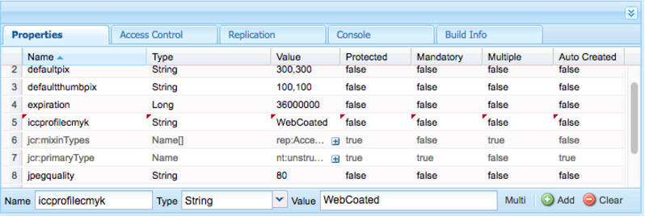

# Dynamic Media 구성 - 하이브리드 모드 {#configuring-dynamic-media-hybrid-mode}

Dynamic Media-Hybrid를 사용하도록 설정하고 구성해야 합니다. 사용 사례에 따라 Dynamic Media에는 지원되는 구성](#supported-dynamic-media-configurations)이 몇 개 있습니다.[

>[!NOTE]
>
>Scene7 실행 모드에서 Dynamic Media을 구성 및 실행하려면 [Dynamic Media 구성 - Scene7 모드](/help/assets/config-dms7.md)를 참조하십시오.
>
>하이브리드 실행 모드에서 Dynamic Media을 구성하고 실행하려는 경우 이 페이지의 지침을 따르십시오.

Dynamic Media에서 [video](/help/assets/video.md) 작업에 대해 자세히 알아보십시오.

>[!NOTE]
>
>개발, 스테이징 및 라이브 프로덕션용 환경 등과 같이 서로 다른 환경에 대해 Adobe Experience Manager 설정을 사용하는 경우 각 환경에 대해 Dynamic Media Cloud Services을 구성합니다.

>[!NOTE]
>
>Dynamic Media 구성에 문제가 있으면 Dynamic Media에 관련된 로그 파일을 찾습니다. 이러한 파일은 Dynamic Media을 활성화할 때 자동으로 설치됩니다.
>
>* `s7access.log`
>* `ImageServing.log`

>
>
이러한 내용은 [Experience Manager 인스턴스 모니터링 및 유지 관리에 설명되어 있습니다](/help/sites-deploying/monitoring-and-maintaining.md).

하이브리드 게시 및 게재는 Adobe Experience Manager에 추가된 Dynamic Media의 핵심 기능입니다. 하이브리드 게시를 사용하면 Experience Manager 게시 노드 대신 클라우드에서 이미지, 세트 및 비디오와 같은 Dynamic Media 자산을 제공할 수 있습니다.

Dynamic Media 뷰어, 사이트 페이지 및 정적 컨텐츠와 같은 다른 컨텐츠는 Experience Manager 게시 노드에서 계속 제공됩니다.

Dynamic Media의 고객인 경우, 하이브리드 게재를 모든 Dynamic Media 컨텐츠에 대한 게재 메커니즘으로 사용해야 합니다.

## 비디오용 하이브리드 게시 아키텍처 {#hybrid-publishing-architecture-for-videos}


## 이미지 {#hybrid-publishing-architecture-for-images}에 대한 하이브리드 게시 아키텍처


## 지원되는 Dynamic Media 구성 {#supported-dynamic-media-configurations}

다음에 나오는 구성 작업은 다음 용어를 참조합니다.

| **용어** | **Dynamic Media 사용** | **설명** |
|---|---|---|
| Experience Manager 작성자 노드 | 녹색 원의 흰색 체크 표시 | 온프레미스 또는 Managed Services을 통해 배포하는 작성자 노드입니다. |
| Experience Manager 게시 노드 | 흰색 &quot;X&quot;를 빨간색 사각형입니다. | 온프레미스 또는 Managed Services을 통해 배포하는 게시 노드입니다. |
| 이미지 서비스 게시 노드 | 녹색 원의 흰색 체크마크. | Adobe에서 관리하는 데이터 센터에서 실행하는 게시 노드입니다. 이미지 서비스 URL을 나타냅니다. |

이미징에 대해서만, 비디오용으로 또는 이미징과 비디오 모두에 대해 Dynamic Media을 구현하도록 선택할 수 있습니다. 특정 시나리오에 대한 Dynamic Media 구성 단계를 확인하려면 다음 표를 참조하십시오.

<table>
 <tbody>
  <tr>
   <td><strong>시나리오</strong></td>
   <td ><strong>작동 방법</strong></td>
   <td><strong>구성 단계</strong></td>
  </tr>
  <tr>
   <td>프로덕션 환경에서 이미지만 제공</td>
   <td>이미지는 Adobe의 전 세계 데이터 센터에 있는 서버를 통해 전달된 다음 CDN에 의해 캐시되어 확장 가능한 성능 및 글로벌 도달 범위를 제공합니다.</td>
   <td>
    <ol>
     <li>Experience Manager <strong>author</strong> 노드에서 <a href="#enabling-dynamic-media">Dynamic Media</a>을 활성화합니다.</li>
     <li><a href="#configuring-dynamic-media-cloud-services">Dynamic Media Cloud Services</a>에서 이미징을 구성합니다.</li>
     <li><a href="#configuring-image-replication">이미지 복제를 구성합니다</a>.</li>
     <li><a href="#replicating-catalog-settings">카탈로그 설정을 복제합니다</a>.</li>
     <li><a href="#replicating-viewer-presets">뷰어 사전 설정을 복제합니다</a>.</li>
     <li><a href="#using-default-asset-filters-for-replication">복제에 기본 자산 필터를 사용합니다</a>.</li>
     <li><a href="#configuring-dynamic-media-image-server-settings">Dynamic Media 이미지 서버 설정을 구성합니다</a>.</li>
     <li><a href="#delivering-assets">자산 제공</a>.</li>
    </ol> </td>
  </tr>
  <tr>
   <td>사전 프로덕션(개발, QE, 스테이지 등)에서 이미지만 제공</td>
   <td>이미지는 Experience Manager 게시 노드를 통해 전달됩니다. 이 시나리오에서는 트래픽이 최소화되므로 Adobe의 데이터 센터에 이미지를 전달할 필요가 없습니다. 또한 프로덕션 시작 전에 컨텐츠를 안전하게 미리 볼 수 있습니다.</td>
   <td>
    <ol>
     <li>Experience Manager <strong>author</strong> 노드에서 <a href="#enabling-dynamic-media">Dynamic Media</a>을 활성화합니다.</li>
     <li>Experience Manager <strong>publish</strong> 노드에서 <a href="#enabling-dynamic-media">Dynamic Media</a>을 활성화합니다.</li>
     <li><a href="#replicating-viewer-presets">뷰어 사전 설정을 복제합니다</a>.</li>
     <li>비프로덕션 이미지에 대해 <a href="#setting-up-asset-filters-for-imaging-in-non-production-deployments">자산 필터를 설정합니다</a>.</li>
     <li><a href="#configuring-dynamic-media-image-server-settings">Dynamic Media 이미지 서버 설정을 구성합니다.</a></li>
     <li><a href="#delivering-assets">자산 제공.</a></li>
    </ol> </td>
  </tr>
  <tr>
   <td>모든 환경(프로덕션, 개발, QE, 스테이지 등)에서 비디오만 제공</td>
   <td>CDN에서 확장 가능한 성능 및 글로벌 도달 범위를 위해 비디오를 전달하고 캐시합니다. 비디오 포스터 이미지(재생 시작 전에 표시되는 비디오 축소판)는 Experience Manager 게시 인스턴스에 의해 전달됩니다.</td>
   <td>
    <ol>
     <li>Experience Manager <strong>author</strong> 노드에서 <a href="#enabling-dynamic-media">Dynamic Media</a>을 활성화합니다.</li>
     <li>Experience Manager <strong>publish</strong> 노드에서 <a href="#enabling-dynamic-media">Dynamic Media</a>을 활성화합니다(게시 인스턴스는 비디오 포스터 이미지를 제공하고 비디오 재생에 대한 메타데이터를 제공합니다).</li>
     <li><a href="#configuring-dynamic-media-cloud-services">Dynamic Media Cloud Services에서 비디오를 구성합니다.</a></li>
     <li><a href="#replicating-viewer-presets">뷰어 사전 설정을 복제합니다</a>.</li>
     <li>비디오 전용</a>에 대해 <a href="#setting-up-asset-filters-for-video-only-deployments">자산 필터를 설정합니다.</a></li>
     <li><a href="#delivering-assets">자산 제공.</a></li>
    </ol> </td>
  </tr>
  <tr>
   <td>프로덕션 환경에서 이미지와 비디오 모두 제공</td>
   <td><p>CDN에서 확장 가능한 성능 및 글로벌 도달 범위를 위해 비디오를 전달하고 캐시합니다. 이미지 및 비디오 포스터 이미지는 Adobe의 전 세계 데이터 센터에 있는 서버를 통해 전달된 다음 확장 가능한 성능 및 글로벌 도달 범위를 위해 CDN에 의해 캐시됩니다.</p> <p>사전 프로덕션에서 이미지 또는 비디오를 설정하려면 이전 섹션을 참조하십시오. </p> </td>
   <td>
    <ol>
     <li>Experience Manager <strong>author</strong> 노드에서 <a href="#enabling-dynamic-media">Dynamic Media</a>을 활성화합니다.</li>
     <li><a href="#configuring-dynamic-media-cloud-services">Dynamic Media Cloud Services에서 비디오를 구성합니다.</a></li>
     <li><a href="#configuring-dynamic-media-cloud-services">Dynamic Media Cloud Services에서 이미징을 구성합니다.</a></li>
     <li><a href="#configuring-image-replication">이미지 복제를 구성합니다</a>.</li>
     <li><a href="#replicating-catalog-settings">카탈로그 설정을 복제합니다</a>.</li>
     <li><a href="#replicating-viewer-presets">뷰어 사전 설정을 복제합니다</a>.</li>
     <li><a href="#using-default-asset-filters-for-replication">복제에 기본 자산 필터를 사용합니다.</a></li>
     <li><a href="#configuring-dynamic-media-image-server-settings">Dynamic Media 이미지 서버 설정을 구성합니다.</a></li>
     <li><a href="#delivering-assets">자산 제공.</a></li>
    </ol> </td>
  </tr>
 </tbody>
</table>

## Dynamic Media {#enabling-dynamic-media} 활성화

[Dynamic Media는 기본적으로 비활성화됩니다. ](https://www.adobe.com/solutions/web-experience-management/dynamic-media.html) Dynamic Media 기능을 활용하려면 `dynamicmedia` 실행 모드(예: `publish` 실행 모드)를 사용하여 Dynamic Media을 활성화해야 합니다. 활성화하기 전에 [기술 요구 사항을 검토하십시오.](/help/sites-deploying/technical-requirements.md#requirements-for-aem-dynamic-media-add-on)

>[!NOTE]
>
>실행 모드를 통해 Dynamic Media을 활성화하면 `dynamicMediaEnabled` 플래그를 **[!UICONTROL true로 설정하여 Dynamic Media을 활성화한 Experience Manager 6.1 및 Experience Manager 6.0의 기능이 대체합니다.]** 이 플래그는 Experience Manager 6.2 이상에서 기능이 없습니다. 또한 Dynamic Media을 활성화하기 위해 빠른 시작을 다시 시작할 필요가 없습니다.

Dynamic Media을 활성화하면 UI에서 Dynamic Media 기능을 사용할 수 있으며, 업로드된 모든 이미지 자산은 동적 이미지 표현물을 빠르게 전달하는 데 사용되는 *cqdam.pyramid.tiff* 표현물을 수신합니다. 이러한 PTIFF는 다음과 같은 중요한 이점을 제공합니다.

* 단일 기본 소스 이미지만 관리하고 추가 스토리지 없이 즉시 무한 렌디션을 생성할 수 있습니다.
* 확대/축소, 패닝 및 스핀과 같은 대화형 시각화를 사용하는 기능.

Experience Manager에서 Dynamic Media Classic을 사용하려면 [특정 시나리오](/help/sites-administering/scene7.md#aem-scene-integration-versus-dynamic-media)를 사용하지 않는 한 Dynamic Media을 활성화하지 마십시오. 실행 모드로 Dynamic Media을 활성화하지 않으면 Dynamic Media이 비활성화됩니다.

Dynamic Media을 활성화하려면 명령줄에서 또는 빠른 시작 파일 이름에서 Dynamic Media 실행 모드를 활성화해야 합니다.

**Dynamic Media을 활성화하려면**

1. 명령줄에서 quickstart를 시작할 때 다음을 수행합니다.

   * jar 파일을 시작할 때 명령줄 끝에 `-r dynamicmedia`을 추가합니다.

   ```shell
   java -Xmx4096m -Doak.queryLimitInMemory=500000 -Doak.queryLimitReads=500000 -jar cq-quickstart-6.5.0.jar -r dynamicmedia
   ```

   s7delivery에 게시하는 경우 다음 trustStore 인수도 포함해야 합니다.

   ```
   -Djavax.net.ssl.trustStore=<absoluteFilePath>/customerTrustStoreFileName>
   
    -Djavax.net.ssl.trustStorePassword=<passwordForTrustStoreFile>
   ```

1. `https://localhost:4502/is/image`을 요청하고 이제 이미지 서버가 실행 중인지 확인하십시오.

   >[!NOTE]
   >
   >Dynamic Media 문제를 해결하려면 `crx-quickstart/logs/` 디렉토리에서 다음 로그를 참조하십시오.
   >
   >* ImageServer-&lt;PortId>-&lt;yyyy>&lt;mm>&lt;dd>.log - ImageServer 로그는 내부 ImageServer 프로세스의 동작을 분석하는 데 사용되는 통계 및 분석 정보를 제공합니다.

   이미지 서버 로그 파일 이름의 예:`ImageServer-57346-2020-07-25.log`
   * s7access-&lt;yyyy>&lt;mm>&lt;dd>.log - s7access 로그는 `/is/image` 및 `/is/content`을 통해 Dynamic Media에 대한 각 요청을 기록합니다.

   이러한 로그는 Dynamic Media이 활성화된 경우에만 사용됩니다. `system/console/status-Bundlelist` 페이지에서 생성된 **Download Full** 패키지에는 포함되지 않습니다.Dynamic Media 문제가 있는 경우 고객 지원 센터에 문의할 때 이러한 로그를 모두 문제에 추가합니다.

### 다른 포트 또는 컨텍스트 경로에 대한 Experience Manager을 설치한 경우.. {#if-you-installed-aem-to-a-different-port-or-context-path}

[Experience Manager을 응용 프로그램 서버](/help/sites-deploying/application-server-install.md)에 배포하고 Dynamic Media이 활성화되어 있는 경우, 외부 도우미에서 **self** 도메인을 구성해야 합니다. 그렇지 않으면 Dynamic Media 자산에 대한 축소판 생성이 제대로 작동하지 않습니다.

또한 다른 포트나 컨텍스트 경로에서 quickstart를 실행하는 경우 **self** 도메인도 변경해야 합니다.

Dynamic Media이 활성화되면 이미지 자산에 대한 정적 축소판 표현물이 Dynamic Media을 사용하여 생성됩니다. Dynamic Media에 대해 축소판 생성이 제대로 작동하려면 Experience Manager이 URL 요청을 직접 수행하고 포트 번호와 컨텍스트 경로를 모두 알고 있어야 합니다.

Experience Manager:

* [외부 도우미](/help/sites-developing/externalizer.md)의 **self** 도메인은 포트 번호와 컨텍스트 경로를 모두 검색하는 데 사용됩니다.
* **self** 도메인이 구성되어 있지 않으면 포트 번호와 컨텍스트 경로가 Jetty HTTP 서비스에서 검색됩니다.

Experience Manager QuickStart WAR 배포에서 포트 번호 및 컨텍스트 경로를 파생할 수 없으므로 **self** 도메인을 구성해야 합니다. **self** 도메인을 구성하는 방법에 대해서는 [외부 도우미 설명서](/help/sites-developing/externalizer.md) 를 참조하십시오.

>[!NOTE]
[Experience Manager Quickstart 독립형 배포](/help/sites-deploying/deploy.md)에서는 포트 번호 및 컨텍스트 경로를 자동으로 구성할 수 있으므로 일반적으로 **self** 도메인을 구성할 필요가 없습니다. 그러나 모든 네트워크 인터페이스가 꺼져 있으면 **self** 도메인을 구성해야 합니다.

## Dynamic Media {#disabling-dynamic-media} 비활성화

Dynamic Media은 기본적으로 활성화되지 않습니다. 그러나 이전에 Dynamic Media을 활성화한 경우에는 나중에 해제할 수 있습니다.

Dynamic Media을 활성화한 후 비활성화하려면 `-r dynamicmedia` 실행 모드 플래그를 제거합니다.

**Dynamic Media이 활성화되면 비활성화하십시오**

1. 명령줄에서 quickstart를 시작할 때 다음 중 하나를 수행할 수 있습니다.

   * jar 파일을 시작할 때 명령줄에 `-r dynamicmedia`을 추가하지 마십시오.

   ```shell
   java -Xmx4096m -Doak.queryLimitInMemory=500000 -Doak.queryLimitReads=500000 -jar cq-quickstart-6.5.0.jar
   ```

1. 요청 `https://localhost:4502/is/image`. Dynamic Media이 비활성화되었다는 메시지가 표시됩니다.

   >[!NOTE]
   Dynamic Media 실행 모드가 비활성화되면 `cqdam.pyramid.tiff` 변환을 생성하는 워크플로우 단계가 자동으로 생략됩니다. 또한 동적 표현물 지원 및 기타 Dynamic Media 기능이 비활성화됩니다.
   또한 Experience Manager 서버를 구성한 후 Dynamic Media 실행 모드가 비활성화되면 해당 실행 모드에서 업로드된 모든 자산이 이제 유효하지 않습니다.

## (선택 사항) Dynamic Media 사전 설정 및 구성을 6.3에서 6.5로 마이그레이션 다운타임 없음 {#optional-migrating-dynamic-media-presets-and-configurations-from-to-zero-downtime}

Experience Manager Dynamic Media을 6.3에서 6.5로 업그레이드하는 경우(이제 가동 중지 시간 없이 배포할 수 있는 기능이 포함됨) 다음 curl 명령을 실행해야 합니다. 이 명령은 모든 사전 설정 및 구성을 CRXDE Lite의 `/etc`에서 `/conf`(으)로 마이그레이션합니다.

>[!NOTE]
호환성 모드에서 Experience Manager 인스턴스를 실행하는 경우, 즉 호환성 패키지가 설치되어 있으므로 이러한 명령을 실행할 필요가 없습니다.

호환성 패키지를 사용하거나 사용하지 않는 모든 업그레이드의 경우 다음 Linux® curl 명령을 실행하여 원래 Dynamic Media과 함께 제공된 기본 기본 기본 기본 뷰어 사전 설정을 복사할 수 있습니다.

`curl -u admin:admin -X POST https://<server_address>:<server_port>/libs/settings/dam/dm/presets/viewer.pushviewerpresets.json`

`/etc`에서 `/conf`(으)로 생성한 사용자 정의 뷰어 사전 설정 및 구성을 마이그레이션하려면 다음 Linux® curl 명령을 실행하십시오.

`curl -u admin:admin -X POST https://<server_address>:<server_port>/libs/settings/dam/dm/presets.migratedmcontent.json`

## 이미지 복제 구성 {#configuring-image-replication}

Dynamic Media 이미지 전달은 Experience Manager 작성자에서 비디오 축소판을 포함한 이미지 자산을 게시하고 Adobe의 주문형 복제 서비스(복제 서비스 URL)로 복제하여 작동합니다. 그런 다음 자산은 온디맨드 이미지 전달 서비스(이미지 서비스 URL)를 통해 전달됩니다.

다음을 수행합니다.

1. [인증을 설정합니다](#setting-up-authentication).
1. [복제 에이전트를 구성합니다](#configuring-the-replication-agent).

복제 에이전트는 이미지, 비디오 메타데이터 및 세트와 같은 Dynamic Media 자산을 게시하고 Adobe이 호스팅하는 이미지 서비스에 설정합니다. 기본적으로 복제 에이전트가 활성화되어 있지 않습니다.

복제 에이전트를 구성한 후에는 [을(를) 확인하고 성공적으로 설정되었는지 테스트해야 합니다](#validating-the-replication-agent-for-dynamic-media). 이 섹션에서는 이러한 절차에 대해 설명합니다.

>[!NOTE]
PTIFF 만들기의 기본 메모리 제한은 모든 워크플로우에서 3GB입니다. 예를 들어 다른 워크플로가 일시 중지된 동안 3GB 메모리가 필요한 이미지 하나를 처리하거나 각각 300MB의 메모리가 필요한 10개의 이미지를 동시에 처리할 수 있습니다.
메모리 제한은 구성 가능하고 시스템 리소스 가용성과 처리 중인 이미지 컨텐츠 유형에 해당합니다. 많은 자산이 있고 시스템에 충분한 메모리가 있는 경우 이 제한을 늘려 이미지가 동시에 처리되도록 할 수 있습니다.
최대 메모리 제한을 초과하는 이미지가 거부됩니다.
PTIFF 만들기에 대한 메모리 제한을 변경하려면 **[!UICONTROL 도구 > 작업 > 웹 콘솔 > Adobe CQ Scene7 PTiffManager]**&#x200B;로 이동하여 **[!UICONTROL maxMemory]** 값을 변경하십시오.

### 인증 설정 {#setting-up-authentication}

Dynamic Media 이미지 제공 서비스에 이미지를 복제할 수 있도록 작성자에 대한 복제 인증을 설정합니다. 먼저 KeyStore를 가져온 다음 **[!UICONTROL dynamic-media-replication]** 사용자 아래에 저장하고 구성합니다. 회사 관리자가 프로비저닝 프로세스 중에 KeyStore 파일과 필요한 자격 증명이 포함된 환영 이메일을 받았습니다. 이 정보를 받지 못한 경우 Adobe 고객 지원 센터에 문의하십시오.

**인증을 설정하려면**

1. 아직 파일 및 암호가 없는 경우 Adobe 고객 지원 센터에서 KeyStore 파일 및 암호를 문의하십시오. 이 정보는 프로비저닝의 필수 부분입니다. 그것은 당신의 계정에 열쇠를 연결합니다.
1. Experience Manager에서 Experience Manager 로고를 탭하여 전역 탐색 콘솔에 액세스한 다음, **[!UICONTROL 도구 > 보안 > 사용자.]**
1. 사용자 관리 페이지에서 **[!UICONTROL dynamic-media-replication]** 사용자로 이동한 다음 탭하여 엽니다.

   

1. Dynamic-media-replication에 대한 사용자 설정 편집 페이지에서 **[!UICONTROL 키 저장소]** 탭을 탭한 다음 **[!UICONTROL 키 저장소 만들기를 클릭합니다.]**

   

1. **[!UICONTROL Set KeyStore Access Password]** 대화 상자에서 암호를 입력하고 암호를 확인합니다.

   >[!NOTE]
   나중에 복제 에이전트를 구성할 때 암호를 다시 입력해야 하므로 암호를 기억하십시오.

   

1. **[!UICONTROL Edit User Settings For dynamic-media-replication]** 페이지에서 **Add Private Key from KeyStore file** 영역을 확장하고 다음을 추가합니다(다음 이미지 참조).

   * **[!UICONTROL 새 별칭]** 필드에 나중에 복제 구성에서 사용할 별칭의 이름을 입력합니다. 예를 들어 `replication` 을 별칭으로 사용할 수 있습니다.
   * **[!UICONTROL KeyStore 파일을 누릅니다.]** Adobe이 제공한 KeyStore 파일로 이동하여 선택한 다음  **[!UICONTROL 열기 를 누릅니다.]**
   * **[!UICONTROL KeyStore 파일 암호]** 필드에 KeyStore 파일 암호를 입력합니다. 이 암호는 **5단계에서 만든 KeyStore 암호가 아닌**&#x200B;이지만 KeyStore 파일 암호 Adobe은 프로비저닝 중에 사용자에게 보낸 환영 전자 메일에 제공합니다. KeyStore 파일 암호를 받지 못한 경우 Adobe 고객 지원 센터에 문의하십시오.
   * **[!UICONTROL 개인 키 암호]** 필드에 개인 키 암호를 입력합니다(이전 단계에서 제공한 동일한 개인 키 암호일 수 있음). Adobe은 프로비전 중에 사용자에게 보낸 시작 전자 메일에 있는 개인 키 암호를 제공합니다. 개인 키 암호를 받지 못한 경우 Adobe 고객 지원 센터에 문의하십시오.
   * **[!UICONTROL 개인 키 별칭]** 필드에 개인 키 별칭을 입력합니다. 예, `*companyname*-alias`. Adobe은 프로비전 중에 사용자에게 전송된 시작 전자 메일에 개인 키 별칭을 제공합니다. 개인 키 별칭을 받지 않은 경우 Adobe 고객 지원 센터에 문의하십시오.

   

1. **[!UICONTROL 저장 및 닫기]**&#x200B;를 탭하여 이 사용자에게 변경 사항을 저장합니다.

   다음으로 [복제 에이전트를 구성해야 합니다.](#configuring-the-replication-agent)

### 복제 에이전트 구성 {#configuring-the-replication-agent}

1. Experience Manager에서 Experience Manager 로고를 탭하여 전역 탐색 콘솔에 액세스한 다음, 작성자의 **[!UICONTROL 도구 > 배포 > 복제 > 에이전트 를 탭합니다.]**
1. 작성자의 에이전트 페이지에서 **[!UICONTROL Dynamic Media Hybrid 이미지 복제(s7delivery)를 누릅니다.]**
1. **[!UICONTROL 편집을 누릅니다.]**
1. **[!UICONTROL 설정]** 탭을 탭한 다음, 다음을 입력합니다.

   * **[!UICONTROL 활성화됨]**  - 복제 에이전트를 활성화하려면 이 확인란을 선택합니다.
   * **[!UICONTROL 지역]**  - 해당 지역으로 설정합니다.북미, 유럽 또는 아시아
   * **[!UICONTROL 테넌트 ID]**  - 이 값은 복제 서비스에 게시되는 회사/테넌트의 이름입니다. 이 값은 Adobe이 프로비전 중에 사용자에게 보낸 환영 이메일에서 제공하는 테넌트 ID입니다. 이 정보를 받지 못한 경우 Adobe 고객 지원 센터에 문의하십시오.
   * **[!UICONTROL 키 저장소 별칭]**  - 이 값은 인증 설정에서 키를 생성할 때 ** 새 별칭** 값  [세트와 동일합니다](#setting-up-authentication).예,  `replication`. ([인증 설정](#setting-up-authentication)의 7단계를 참조하십시오.)
   * **[!UICONTROL 키 저장소 암호]**  - 키 저장소 만들기를 탭했을 때 만든  **[!UICONTROL 키 저장소 암호입니다.]** Adobe이 이 암호를 제공하지 않습니다. [인증 설정](#setting-up-authentication)의 5단계를 참조하십시오.

   다음 이미지는 샘플 데이터가 있는 복제 에이전트를 보여줍니다.

   

1. **[!UICONTROL 확인]**

### Dynamic Media용 복제 에이전트 확인 {#validating-the-replication-agent-for-dynamic-media}

Dynamic Media용 복제 에이전트의 유효성을 검사하려면 다음을 수행하십시오.

**[!UICONTROL 연결 테스트를 누릅니다.]** 출력의 예는 다음과 같습니다.

```shell
11.03.2016 10:57:55 - Transferring content for ReplicationAction{type=TEST, path[0]='/content/dam', time=1457722675402, userId='admin', revision='null'}
11.03.2016 10:57:55 - * Auth User: replication-receiver
11.03.2016 10:57:55 - * HTTP Version: 1.1
11.03.2016 10:57:55 - * Using OAuth 2.0 Authorization Grants
11.03.2016 10:57:55 - * OAuth 2.0 User: dynamic-media-replication
11.03.2016 10:57:55 - * OAuth 2.0 Token: '*****' initialized
11.03.2016 10:57:55 - Publishing: POST[https://replicate-na.assetsadobe.com:8580/is-publish/publish-receiver?Cmd=Test&RootId=xfpuu-6613]
11.03.2016 10:57:55 - Publish response: OK[]
11.03.2016 10:57:55 - Transfer succeeded in 141 ms for ReplicationAction{type=TEST, path[0]='/content/dam', time=1457722675402, userId='admin', revision='null'}
-------------------------------------------------------------------------------------------------------------------------------
Replication test succeeded
```

>[!NOTE]
다음 중 하나를 수행하여 확인할 수도 있습니다.
* 복제 로그를 확인하여 자산이 복제되었는지 확인합니다.
* 이미지를 게시합니다. 이미지를 탭하고 드롭다운 메뉴에서 **[!UICONTROL Viewers]**&#x200B;를 선택한 다음, 뷰어 사전 설정을 선택합니다. **[!UICONTROL URL]**&#x200B;을 클릭합니다. 이미지가 표시되는지 확인하려면 브라우저에서 URL 경로를 복사하여 붙여넣습니다.


### 인증 문제 해결 {#troubleshooting-authentication}

인증을 설정할 때 솔루션 사용 시 발생할 수 있는 몇 가지 문제가 있습니다. 이러한 문제를 확인하기 전에 복제를 설정했는지 확인하십시오.

#### 문제:HTTP 상태 코드 401(메시지 포함) - 권한 부여 필요 {#problem-http-status-code-with-message-authorization-required}

이 문제는 `dynamic-media-replication` 사용자에 대해 KeyStore를 설정하지 못해서 발생할 수 있습니다.

```shell
Replication test to s7delivery:https://s7bern.macromedia.com:8580/is-publish/
17.06.2016 18:54:43 - Transferring content for ReplicationAction{type=TEST, path[0]='/content/dam', time=1466214883309, userId='admin', revision='null'}
17.06.2016 18:54:43 - * Auth User: replication-receiver
17.06.2016 18:54:43 - * HTTP Version: 1.1
17.06.2016 18:54:43 - * Using OAuth 2.0 Authorization Grants
17.06.2016 18:54:43 - * OAuth 2.0 User: dynamic-media-replication
17.06.2016 18:54:43 - No OAuth token available. OAuth not initialized
17.06.2016 18:54:43 - * Using Client Auth SSL alias - replication-alias *
17.06.2016 18:54:43 - Publishing: POST[https://<localhost>:8580/is-publish//publish-receiver?Cmd=Test&RootId=brough]
17.06.2016 18:54:43 - Transfer failed for ReplicationAction{type=TEST, path[0]='/content/dam', time=1466214883309, userId='admin', revision='null'}. java.io.IOException: Failed to execute request
'https://<localhost>:8580/is-publish//publish-receiver?Cmd=Test&RootId=brough':
 Server returned status code 401 with message: Authorization required.
17.06.2016 18:54:43 - Error while replicating: com.day.cq.replication.ReplicationException: Transfer failed for ReplicationAction{type=TEST, path[0]='/content/dam', time=1466214883309,
 userId='admin', revision='null'}. java.io.IOException: Failed to execute request
'https://<localhost>:8580/is-publish//publish-receiver?Cmd=Test&RootId=brough':
 Server returned status code 401 with message: Authorization required.
```

**솔루션**:이  `KeyStore` (가)  **dynamic-media-replicationuser** 에 저장되고 올바른 암호가 제공되는지 확인합니다.

#### 문제:키 암호를 해독할 수 없습니다. {#problem-could-not-decrypt-key-could-not-decrypt-data} 데이터를 해독할 수 없습니다.

```xml
Replication test to s7delivery:https://<localhost>:8580/is-publish/
17.06.2016 19:00:16 - Transferring content for ReplicationAction{type=TEST, path[0]='/content/dam', time=1466215216662, userId='admin', revision='null'}
17.06.2016 19:00:16 - * Auth User: replication-receiver
17.06.2016 19:00:16 - * HTTP Version: 1.1
17.06.2016 19:00:16 - * Using OAuth 2.0 Authorization Grants
17.06.2016 19:00:16 - * OAuth 2.0 User: dynamic-media-replication
17.06.2016 19:00:16 - No OAuth token available. OAuth not initialized
17.06.2016 19:00:16 - * Using Client Auth SSL alias - replication-alias *
17.06.2016 19:00:16 - Transfer failed for ReplicationAction{type=TEST, path[0]='/content/dam', time=1466215216662, userId='admin', revision='null'}. java.lang.SecurityException: java.security.UnrecoverableKeyException: Could not decrypt key: Could not decrypt data.
```

**솔루션**:암호를 확인합니다. 복제 에이전트에 저장된 암호가 키 저장소를 만드는 데 사용된 암호와 다릅니다.

#### 문제:InvalidAlgorithmParameterException {#problem-invalidalgorithmparameterexception}

이 문제는 Experience Manager 작성자 인스턴스의 구성 오류로 인해 발생합니다. 작성자의 Java™ 프로세스에 올바른 `javax.net.ssl.trustStore`이(가) 없습니다. 복제 로그에 다음 오류가 표시됩니다.

```shell
14.04.2016 09:37:43 - Transfer failed for ReplicationAction{type=TEST, path[0]='/content/dam', time=1460651862089, userId='admin', revision='null'}. java.io.IOException: Failed to execute request 'https://<localhost>:8580/is-publish/publish-receiver?Cmd=Test&RootId=rbrough-osx2': java.lang.RuntimeException: Unexpected error: java.security.InvalidAlgorithmParameterException: the trustAnchors parameter must be non-empty
14.04.2016 09:37:43 - Error while replicating: com.day.cq.replication.ReplicationException: Transfer failed for ReplicationAction{type=TEST, path[0]='/content/dam', time=1460651862089, userId='admin', revision='null'}. java.io.IOException: Failed to execute request 'https://<localhost>:8580/is-publish/publish-receiver?Cmd=Test&RootId=rbrough-osx2': java.lang.RuntimeException: Unexpected error: java.security.InvalidAlgorithmParameterException: the trustAnchors parameter must be non-empty
```

또는 오류 로그:

```shell
07.25.2019 12:00:59.893 *ERROR* [sling-threadpool-db2763bb-bc50-4bb5-bb64-10a09f432712-(apache-sling-job-thread-pool)-90-com_day_cq_replication_job_s7delivery(com/day/cq/replication/job/s7delivery)] com.day.cq.replication.Agent.s7delivery.queue Error during processing of replication.

java.io.IOException: Failed to execute request 'https://replicate-na.assetsadobe.com:8580/is-publish/publish-receiver?Cmd=Test&RootId=rbrough-osx': java.lang.RuntimeException: Unexpected error: java.security.InvalidAlgorithmParameterException: the trustAnchors parameter must be non-empty
        at com.scene7.is.catalog.service.publish.atomic.PublishingServiceHttp.executePost(PublishingServiceHttp.scala:195)
```

**솔루션**:Experience Manager 작성자의 Java™ 프로세스에 시스템 속성이 유효한 truststore로  `-Djavax.net.ssl.trustStore=` 설정되어 있는지 확인하십시오.

#### 문제:KeyStore가 설정되지 않았거나 {#problem-keystore-is-either-not-set-up-or-it-is-not-initialized} 초기화되지 않았습니다.

이 문제는 핫픽스, 또는 기능 팩이 dynamic-media-user 또는 keystore 노드를 덮어쓰는 경우 발생할 수 있습니다.

복제 로그 예:

```shell
Replication test to s7delivery:https://replicate-na.assetsadobe.com/is-publish
02.08.2016 14:37:44 - Transferring content for ReplicationAction{type=TEST, path[0]='/content/dam', time=1470173864834, userId='admin', revision='null'}
02.08.2016 14:37:44 - * Auth User: replication-receiver
02.08.2016 14:37:44 - * HTTP Version: 1.1
02.08.2016 14:37:44 - * Using OAuth 2.0 Authorization Grants
02.08.2016 14:37:44 - * OAuth 2.0 User: dynamic-media-replication
02.08.2016 14:37:44 - Transfer failed for ReplicationAction{type=TEST, path[0]='/content/dam', time=1470173864834, userId='admin', revision='null'}. com.adobe.granite.keystore.KeyStoreNotInitialisedException: Uninitialised key store for user dynamic-media-replication
```

**솔루션**:

1. 사용자 관리 페이지로 이동합니다.
   `localhost:4502/libs/granite/security/content/useradmin.html`
1. 사용자 관리 페이지에서 `dynamic-media-replication` 사용자로 이동한 다음 탭하여 엽니다.
1. **[!UICONTROL KeyStore]** 탭을 클릭합니다. **[!UICONTROL Create KeyStore]** 단추가 나타나면 [Setting up Authentication](#setting-up-authentication)의 단계를 먼저 다시 실행해야 합니다.
1. KeyStore 설정을 다시 실행해야 하는 경우 [복제 에이전트 구성](/help/assets/config-dynamic.md#configuring-the-replication-agent)도 다시 수행해야 합니다.

   s7delivery 복제 에이전트를 다시 구성합니다.
   `localhost:4502/etc/replication/agents.author/s7delivery.html`

1. **[!UICONTROL 연결 테스트]**&#x200B;를 눌러 구성이 올바른지 확인합니다.

#### 문제:게시 에이전트가 OAuth {#problem-publish-agent-is-using-ssl-instead-of-oauth} 대신 SSL을 사용하고 있습니다.

이 문제는 핫픽스 또는 기능 팩이 올바르게 설치되지 않거나 설정이 과다 기록되어 발생할 수 있습니다.

복제 로그 예:

```shell
01.08.2016 18:42:59 - Transferring content for ReplicationAction{type=TEST, path[0]='/content/dam', time=1470073379634, userId='admin', revision='null'}
01.08.2016 18:42:59 - * Auth User: replication-receiver
01.08.2016 18:42:59 - * HTTP Version: 1.1
01.08.2016 18:42:59 - * Using Client Auth SSL alias - replication-receiver *
01.08.2016 18:42:59 - Publishing: POST[https://replicate-eu.assetsadobe2.com:443/is-publish/publish-receiver?Cmd=Test&RootId=altayerstaging]
01.08.2016 18:42:59 - Transfer failed for ReplicationAction{type=TEST, path[0]='/content/dam', time=1470073379634, userId='admin', revision='null'}. java.io.IOException: Failed to execute request 'https://replicate-eu.assetsadobe2.com:443/is-publish/publish-receiver?Cmd=Test&RootId=rbroughstaging': Server returned status code 401 with message: Authorization required.
01.08.2016 18:42:59 - Error while replicating: com.day.cq.replication.ReplicationException: Transfer failed for ReplicationAction{type=TEST, path[0]='/content/dam', time=1470073379634, userId='admin', revision='null'}. java.io.IOException: Failed to execute request 'https://replicate-eu.assetsadobe2.com:443/is-publish/publish-receiver?Cmd=Test&RootId=rbroughstaging': Server returned status code 401 with message: Authorization required.
```

**솔루션:**

1. Experience Manager에서 **[!UICONTROL 도구 > 일반 > CRXDE Lite을 클릭합니다.]**

   `localhost:4502/crx/de/index.jsp`

1. s7배달 복제 에이전트 노드로 이동합니다.
   `localhost:4502/crx/de/index.jsp#/etc/replication/agents.author/s7delivery/jcr:content`

1. 이 설정을 복제 에이전트(값이 **[!UICONTROL True]**&#x200B;로 설정된 부울)에 추가합니다.

   `enableOauth=true`

1. 페이지의 왼쪽 위 모서리 근처에 있는 **[!UICONTROL 모두 저장.]**

### 구성 테스트 {#testing-your-configuration}

Adobe은 구성에 대한 엔드 투 엔드 테스트를 수행할 것을 권장합니다.

이 테스트를 시작하기 전에 다음을 이미 수행했는지 확인하십시오.

* 이미지 사전 설정이 추가되었습니다.
* Cloud Services 아래에 **[!UICONTROL Dynamic Media 구성(6.3 이전)]**&#x200B;을 구성합니다. 이 테스트에는 이미지 서비스 URL이 필요합니다

**구성을 테스트하려면**

1. 이미지 자산을 업로드합니다. (Assets에서 **[!UICONTROL 만들기 > 파일]**&#x200B;을 탭하고 파일을 선택합니다.)
1. 워크플로우가 완료될 때까지 기다립니다.
1. 이미지 자산을 게시합니다. (자산을 선택하고 **[!UICONTROL 빠른 게시.]**)를 누릅니다.
1. 이미지를 열고 **[!UICONTROL 표현물 을 탭하여 해당 이미지에 대한 표현물로 이동합니다.]**

   

1. 동적 변환을 선택합니다.
1. 이 자산의 URL을 가져오려면 **[!UICONTROL URL]**&#x200B;을 클릭하십시오.
1. 선택한 URL로 이동하고 이미지가 예상대로 작동하는지 확인합니다.

자산이 전달되었는지 테스트하는 또 다른 방법은 URL에 req=exists 를 추가하는 것입니다.

## Dynamic Media Cloud Services 구성 {#configuring-dynamic-media-cloud-services}

Dynamic Media Cloud Service은 여러 가지 이미지, 비디오, 비디오 분석 및 비디오 인코딩의 하이브리드 게시 및 전달을 지원합니다.

구성의 일부로서 등록 ID, 비디오 서비스 URL, 이미지 서비스 URL, 복제 서비스 URL을 입력하고 인증을 설정해야 합니다. 이 정보는 계정 프로비저닝 프로세스의 일부로 사용자에게 이메일로 전송되었습니다. 이 정보를 받지 못한 경우 Adobe Experience Manager 관리자 또는 Adobe 고객 지원 센터에 문의하여 정보를 얻으십시오.

>[!NOTE]
Dynamic Media Cloud Services을 설정하기 전에 게시 인스턴스를 설정해야 합니다. Dynamic Media Cloud Services을 구성하기 전에 복제를 설정해야 합니다.

Dynamic Media Cloud Services을 구성하려면:

1. Experience Manager에서 Experience Manager 로고를 탭하여 전역 탐색 콘솔에 액세스하고 **[!UICONTROL 도구 > Cloud Services > Dynamic Media 구성(Pre-6.3).]**
1. Dynamic Media 구성 브라우저 페이지의 왼쪽 창에서 **[!UICONTROL global]**&#x200B;을 선택한 다음 **[!UICONTROL 만들기]**&#x200B;를 탭합니다.
1. **[!UICONTROL Dynamic Media 구성 만들기]** 대화 상자의 제목 필드에 제목을 입력합니다.
1. 비디오에 대한 Dynamic Media을 구성하는 경우,

   * **[!UICONTROL 등록 ID]** 필드에 등록 ID를 입력합니다.
   * **[!UICONTROL 비디오 서비스 URL]** 필드에 Dynamic Media 게이트웨이의 비디오 서비스 URL을 입력합니다.

1. 이미지화를 위해 Dynamic Media을 구성하는 경우 **[!UICONTROL 이미지 서비스 URL]** 필드에 Dynamic Media 게이트웨이의 이미지 서비스 URL을 입력합니다.
1. **[!UICONTROL 저장]**&#x200B;을 눌러 Dynamic Media 구성 브라우저 페이지로 돌아갑니다.
1. 전역 탐색 콘솔에 액세스하려면 Experience Manager 로고를 누릅니다.

## 비디오 보고 구성 {#configuring-video-reporting}

Dynamic Media Hybrid를 사용하여 여러 Experience Manager 설치에서 비디오 보고를 구성할 수 있습니다.

**사용 시기:** Dynamic Media 구성(6.3 이전)을 구성할 때 비디오 보고를 포함하여 다양한 기능을 시작합니다. 구성은 지역 Analytics 회사에 보고서 세트를 만듭니다. 여러 작성자 노드를 구성하는 경우 각 작성자 노드에 대해 별도의 보고서 세트를 만듭니다. 따라서 설치 간에 보고 데이터가 일치하지 않습니다. 또한 각 작성자 노드가 동일한 하이브리드 게시 서버를 참조하는 경우 마지막 작성자 설치가 모든 비디오 보고에 대한 대상 보고서 세트를 변경합니다. 이 문제는 너무 많은 보고서 세트가 있는 Analytics 시스템을 오버로드합니다.

**시작하기:** 다음 세 가지 작업을 완료하여 비디오 보고를 구성합니다.

1. 첫 번째 작성자 노드에서 Dynamic Media 구성(6.3 이전)을 구성한 후 Video Analytics 사전 설정 패키지를 만듭니다. 이 초기 작업은 새 구성이 동일한 보고서 세트를 계속 사용할 수 있도록 허용하므로 중요합니다.
1. Dynamic Media 구성(6.3 이전)을 구성하기 전에 ***새*** 작성자 노드 ***앞에 Video Analytics 사전 설정 패키지를 설치합니다.***
1. 패키지 설치를 확인하고 디버깅합니다.

### 첫 번째 작성자 노드 {#creating-a-video-analytics-preset-package-after-configuring-the-first-author-node} 구성 후 Video Analytics 사전 설정 패키지 생성

이 작업을 완료하면 Video Analytics 사전 설정이 포함된 패키지 파일이 있습니다. 이러한 사전 설정에는 보고서 세트, 추적 서버, 추적 네임스페이스 및 Marketing Cloud 조직 ID가 포함되어 있습니다(사용 가능한 경우).

1. 아직 구성하지 않은 경우 Dynamic Media 구성(6.3 이전)을 구성합니다.
1. (선택 사항) 보고서 세트 ID를 보고 복사합니다. JCR에 액세스할 수 있어야 합니다. 보고서 세트 ID는 필요하지 않지만 유효성 검사를 쉽게 합니다.
1. 패키지 관리자를 사용하여 패키지를 만듭니다.
1. 필터를 포함하도록 패키지를 편집합니다.

   Experience Manager:`/conf/global/settings/dam/dm/presets/analytics/jcr:content/userdata`

1. 패키지를 빌드합니다.
1. 후속 새 작성자 노드와 공유할 수 있도록 Video Analytics 사전 설정 패키지를 다운로드하거나 공유합니다.

### 추가 작성자 노드 {#installing-the-video-analytics-preset-package-before-you-configure-additional-author-nodes}를 구성하기 전에 Video Analytics 사전 설정 패키지 설치

Dynamic Media 구성(6.3 이전)을 구성하기 전에 ***이 작업을 완료했는지 확인하십시오.*** 이렇게 하지 않으면 사용되지 않는 다른 보고서 세트가 생성됩니다. 또한 비디오 보고가 올바르게 작동하지만 데이터 수집은 최적화되지 않습니다.

첫 번째 작성자 노드의 Video Analytics 사전 설정 패키지가 새 작성자 노드에서 액세스할 수 있는지 확인합니다.

1. 이전에 만든 Video Analytics 사전 설정 패키지를 패키지 관리자에 업로드합니다.
1. Video Analytics 사전 설정 패키지를 설치합니다.
1. Dynamic Media 구성 구성(6.3 이전)을 구성합니다.

### 패키지 설치 확인 및 디버깅 {#verifying-and-debugging-the-package-installation}

1. 다음 중 하나를 수행하여 확인하고 필요한 경우 패키지 설치를 디버깅합니다.

   * **JCR을 통해 Video Analytics**
사전 설정을 검사하여 JCR을 통해 Video Analytics 사전 설정을 확인하십시오. CRXDE Lite에 액세스할 수 있어야 합니다.

      Experience Manager - CRXDE Lite에서 `/conf/global/settings/
dam/dm/presets/analytics/jcr:content/userdata` 로 이동합니다.

      `https://localhost:4502/crx/de/index.jsp#/conf/global/settings/dam/dm/presets/analytics/jcr%3Acontent/userdata`에서와 같이

      작성자 노드에서 CRXDE Lite에 대한 액세스 권한이 없는 경우 게시 서버를 통해 사전 설정을 확인할 수 있습니다.

   * **이미지 서버를 통해 Video Analytics 사전 설정을 확인합니다.**

      이미지 서버 req=userdata 요청을 만들어 Video Analytics 사전 설정의 유효성을 직접 확인할 수 있습니다.
예를 들어 작성자 노드에서 Analytics 사전 설정을 보기 위해 다음 요청을 수행할 수 있습니다.

      `https://localhost:4502/is/image/conf/global/settings/dam/dm/presets/analytics?req=userdata`

      게시 서버에서 사전 설정의 유효성을 검사하기 위해 게시 서버와 유사한 직접 요청을 할 수 있습니다. 작성자 및 게시 노드에서 응답이 동일합니다. 응답은 다음과 유사합니다.

      ```
      marketingCloudOrgId=0FC4E86B573F99CC7F000101
       reportSuite=aemaem6397618-2018-05-23
       trackingNamespace=aemvideodal
       trackingServer=aemvideodal.d2.sc.omtrdc.net
      ```

   * **Experience Manager의 비디오 보고 도구를 통해 Video**
Analytics 사전 설정을 확인합니다.  **[!UICONTROL 도구 > 자산 > 비디오 보고 탭하기]**

      `https://localhost:4502/mnt/overlay/dam/gui/content/s7dam/videoreports/videoreport.html`

      다음 오류 메시지가 표시되면 보고서 세트를 사용할 수 있지만 채워지지 않은 것입니다. 시스템에서 데이터를 수집하기 전에 새 설치에서 이 오류가 정확하며 원하는 대로 표시됩니다.
   

   보고 데이터를 생성하려면 비디오를 한 개 업로드하고 게시하십시오. **[!UICONTROL URL 복사]**&#x200B;를 사용하고 비디오를 한 번 이상 실행합니다.

   비디오 뷰어 사용에서 보고 데이터를 채우려면 최대 12시간이 걸릴 수 있습니다.

   오류가 있고 보고서 세트가 올바로 설정되지 않은 경우 다음 경고가 표시됩니다.

   

   이 오류는 Dynamic Media 구성(6.3 이전) 서비스를 구성하기 전에 비디오 보고가 실행되는 경우에도 표시됩니다.

### 비디오 보고 구성 문제 해결 {#troubleshooting-the-video-reporting-configuration}

* 설치 중에 Analytics API 서버에 대한 연결이 시간 초과되는 경우가 있습니다. 설치를 통해 연결을 20번 다시 시도하지만 여전히 실패합니다. 이 경우 로그 파일이 여러 오류를 기록합니다. `SiteCatalystReportService`을 검색합니다. 
* Analytics 사전 설정 패키지를 먼저 설치하지 않으면 새 보고서 세트가 생성될 수 있습니다.
* Experience Manager 6.3에서 Experience Manager 6.4 또는 Experience Manager 6.4.1로 업그레이드한 다음 Dynamic Media 구성(6.3 이전)을 구성하면 여전히 보고서 세트가 생성됩니다. 이 문제는 알려진 대로 해결되며 Experience Manager 6.4.2에 대해 수정되었습니다.

### Video Analytics 사전 설정 {#about-the-video-analytics-preset} 정보

Video Analytics 사전 설정(경우에 따라 Analytics 사전 설정이라고도 함)은 Dynamic Media의 뷰어 사전 설정 옆에 저장됩니다. 이것은 기본적으로 뷰어 사전 설정과 동일하지만 AppMeasurement 및 비디오 하트비트 보고를 구성하는 데 사용되는 정보가 있습니다.

사전 설정의 속성은 다음과 같습니다.

* `reportSuite`
* `trackingServer`
* `trackingNamespace`
* `marketingCloudOrgId` (이전 Experience Manager 버전에 없음)

Experience Manager 6.4 이상 버전은 `/conf/global/settings/dam/dm/presets/analytics/jcr:content/userdata`에 이 사전 설정을 저장합니다

## 카탈로그 설정 복제 중 {#replicating-catalog-settings}

JCR을 통해 설정 프로세스의 일부로 고유한 기본 카탈로그 설정을 게시합니다. 카탈로그 설정을 복제하려면 다음을 수행하십시오.

1. 터미널 창에서 다음을 실행합니다.

   `curl -u admin:admin localhost:4502/libs/settings/dam/dm/presets/viewer.pushviewerpresets`

1. Experience Manager에서 CRXDE Lite의 다음 위치로 이동합니다(관리자 권한 필요).

   `https://<*server*>:<*port*>/crx/de/index.jsp#/conf/global/settings/dam/dm/imageserver/`

1. **[!UICONTROL 복제]** 탭을 탭합니다.
1. **[!UICONTROL 복제]**&#x200B;를 누릅니다.

## 뷰어 사전 설정 복제 {#replicating-viewer-presets}

뷰어 사전 설정이 있는 *자산을 전달하려면 뷰어 사전 설정을 복제/게시*&#x200B;해야 합니다. (자산에 대한 URL 또는 포함 코드를 가져오려면 모든 뷰어 사전 설정을 *과*로 활성화해야 합니다.
자세한 내용은 [뷰어 사전 설정 게시](/help/assets/managing-viewer-presets.md#publishing-viewer-presets)를 참조하십시오.

>[!NOTE]
기본적으로, 자산의 세부 사항 보기에서 **[!UICONTROL Viewers]**&#x200B;를 선택하면 시스템은 **[!UICONTROL 표현물]** 및 다양한 뷰어 사전 설정을 선택할 때 다양한 표현물을 표시합니다. 표시되는 숫자를 늘리거나 줄일 수 있습니다. [표시](/help/assets/managing-image-presets.md#increasing-or-decreasing-the-number-of-image-presets-that-display) 또는 [표시되는 뷰어 사전 설정의 수를 늘립니다](/help/assets/managing-viewer-presets.md#increasing-the-number-of-viewer-presets-that-display).

## 복제용 자산 필터링 {#filtering-assets-for-replication}

Dynamic Media이 아닌 배포에서는 Experience Manager 작성 환경에서 모든 *자산(이미지와 비디오 모두)을 Experience Manager 게시 노드에 복제합니다.* Experience Manager 게시 서버에서도 자산을 전달하므로 이 워크플로우가 필요합니다.

그러나 Dynamic Media 배포에서는 자산이 클라우드 방식으로 전달되므로 동일한 자산을 Experience Manager 게시 노드에 복제할 필요가 없습니다. 이러한 &quot;하이브리드 게시&quot; 워크플로우를 통해 추가 스토리지 비용과 자산 복제 처리 시간이 늘어납니다. Dynamic Media 뷰어, 사이트 페이지 및 정적 컨텐츠와 같은 다른 컨텐츠는 Experience Manager 게시 노드에서 계속 제공됩니다.

자산을 복제할 뿐만 아니라 다음 비자산도 복제됩니다.

* Dynamic Media 전달 구성:`/conf/global/settings/dam/dm/imageserver/jcr:content`
* 이미지 사전 설정: `/conf/global/settings/dam/dm/presets/macros`
* 뷰어 사전 설정: `/conf/global/settings/dam/dm/presets/viewer`

필터는 *제외* 자산이 Experience Manager 게시 노드에 복제되지 않도록 하는 방법을 제공합니다.

### 복제에 기본 자산 필터 사용 {#using-default-asset-filters-for-replication}

프로덕션 **이나** (2) 이미징과 비디오에서 (1) 이미징용 Dynamic Media을 사용하는 경우, Adobe이 그대로 제공하는 기본 필터를 사용할 수 있습니다. 다음 필터는 기본적으로 활성화되어 있습니다.

<table>
 <tbody>
  <tr>
   <td> </td>
   <td><strong>필터</strong></td>
   <td><strong>MIME 유형</strong></td>
   <td><strong>표현물</strong></td>
  </tr>
  <tr>
   <td>Dynamic Media 이미지 제공</td>
   <td><p>필터 이미지</p> <p>필터 세트</p> <p> </p> </td>
   <td><p><strong>image/</strong>로 시작</p> <p><strong>application/</strong>을 포함하고 <strong>set</strong>로 끝납니다.</p> </td>
   <td>곧바로 사용할 수 있는 "필터 이미지"(대화형 이미지를 포함하여 단일 이미지 자산에 적용) 및 "필터 세트"(스핀 세트, 이미지 세트, 혼합 미디어 세트 및 회전 메뉴 세트에 적용)는 다음과 같습니다.
    <ul>
     <li>복제용 PTIFF 이미지 및 메타데이터 포함(<strong>cqdam</strong>으로 시작하는 모든 변환).</li>
     <li>복제에서 원본 이미지 및 정적 이미지 표현물을 제외합니다.</li>
    </ul> </td>
  </tr>
  <tr>
   <td>Dynamic Media 비디오 제공</td>
   <td>필터 비디오</td>
   <td><strong>video/</strong>로 시작합니다.</td>
   <td>곧바로 사용할 수 있는 "filter-video"는
    <ul>
     <li>복제에 대한 프록시 비디오 표현물, 비디오 축소판/포스터 이미지, 메타데이터(상위 비디오와 비디오 표현물 모두)를 포함합니다(<strong>cqdam</strong> 로 시작하는 모든 표현물).</li>
     <li>원본 비디오 및 정적 축소판 그림 표현물을 복제에서 제외합니다.<br /> <br /> <strong>참고:</strong> 프록시 비디오 표현물에 바이너리가 들어 있지 않고 단지 노드 속성일 뿐입니다. 따라서 게시자 저장소 크기에 영향을 주지 않습니다.</li>
    </ul> </td>
  </tr>
  <tr>
   <td>Dynamic Media Classic(Scene7) 통합</td>
   <td><p>필터 이미지</p> <p>필터 세트</p> <p>필터 비디오</p> </td>
   <td><p><strong>image/</strong>로 시작</p> <p><strong>application/</strong>을 포함하고 <strong>set</strong>로 끝납니다.</p> <p><strong>video/</strong>로 시작합니다.</p> </td>
   <td><p>Adobe Dynamic Media 클라우드 복제 서비스 URL 대신 Experience Manager 게시 서버를 가리키도록 전송 URI를 구성합니다. 이 필터를 설정하면 Dynamic Media Classic에서 Experience Manager 게시 인스턴스 대신 자산을 제공할 수 있습니다.</p> <p>곧바로 사용할 수 있는 "필터 이미지", "필터 세트" 및 "필터 비디오"는 다음과 같습니다.</p>
    <ul>
     <li>복제용 PTIFF 이미지, 프록시 비디오 표현물 및 메타데이터를 포함합니다. 그러나 이 변수는 실행 중인 Experience Manager의 JCR에 존재하지 않으므로 Dynamic Media Classic 통합 - 아무것도 효과적으로 수행하지 않습니다.</li>
     <li>원본 이미지, 정적 이미지 표현물, 원본 비디오 및 정적 축소판 표현물 복제에서 제외합니다. 대신 Dynamic Media Classic에서 이미지 및 비디오 자산을 제공합니다.</li>
    </ul> </td>
  </tr>
 </tbody>
</table>

>[!NOTE]
필터는 MIME 유형에 적용되며 경로별로 지정할 수 없습니다.

### 비디오 전용 배포에 대한 자산 필터 설정 {#setting-up-asset-filters-for-video-only-deployments}

비디오 전용에 Dynamic Media을 사용하는 경우 다음 단계에 따라 복제에 대한 자산 필터를 설정합니다.

1. Experience Manager에서 Experience Manager 로고를 탭하여 전역 탐색 콘솔에 액세스하고 **[!UICONTROL 도구 > 배포 > 복제 > 작성자의 에이전트]**&#x200B;를 누릅니다.
1. 작성자의 에이전트 페이지에서 **[!UICONTROL 기본 에이전트(게시)를 누릅니다.]**
1. **[!UICONTROL 편집을 누릅니다.]**
1. **[!UICONTROL 에이전트 설정]** 대화 상자의 **[!UICONTROL 설정]** 탭에서 **[!UICONTROL 활성화됨]**&#x200B;을 선택하여 에이전트를 켜십시오.
1. **[!UICONTROL 확인]**
1. Experience Manager에서 **[!UICONTROL 도구 > 일반 > CRXDE Lite을 누릅니다.]**
1. 왼쪽 폴더 트리에서 `/etc/replication/agents.author/dynamic_media_replication/jcr:content/damRenditionFilters` 로 이동합니다.
1. **[!UICONTROL filter-video]**&#x200B;를 찾은 다음 마우스 오른쪽 단추를 클릭하고 **[!UICONTROL 복사.]**
1. 왼쪽 폴더 트리에서 `/etc/replication/agents.author/publish` 로 이동합니다.
1. **[!UICONTROL jcr:content]**&#x200B;을 찾아 마우스 오른쪽 단추로 클릭하고 **[!UICONTROL 붙여넣기.]**

이러한 단계는 비디오 자체가 Dynamic Media Cloud Service에 의해 전달되는 동안 비디오 포스터 이미지와 재생에 필요한 비디오 메타데이터를 전달하도록 Experience Manager 게시 인스턴스를 설정합니다. 이 필터는 원본 비디오와 정적 축소판 그림 표현물 복제에서 제외하며 게시 인스턴스에는 필요하지 않습니다.

### 비프로덕션 배포에서 이미징을 위한 자산 필터 설정 {#setting-up-asset-filters-for-imaging-in-non-production-deployments}

비프로덕션 배포에서 이미징에 Dynamic Media을 사용하는 경우 다음 단계에 따라 복제에 대한 자산 필터를 설정합니다.

1. Experience Manager에서 Experience Manager 로고를 탭하여 전역 탐색 콘솔에 액세스하고 **[!UICONTROL 도구 > 배포 > 복제 > 작성자의 에이전트]**&#x200B;를 누릅니다.
1. 작성자의 에이전트 페이지에서 **[!UICONTROL 기본 에이전트(게시)를 누릅니다.]**
1. **[!UICONTROL 편집을 누릅니다.]**
1. **[!UICONTROL 에이전트 설정]** 대화 상자의 **[!UICONTROL 설정]** 탭에서 **[!UICONTROL 활성화됨]**&#x200B;을 선택하여 에이전트를 켜십시오.
1. **[!UICONTROL 확인]**
1. Experience Manager에서 **[!UICONTROL 도구 > 일반 > CRXDE Lite을 누릅니다.]**
1. 왼쪽 폴더 트리에서 `/etc/replication/agents.author/dynamic_media_replication/jcr:content/damRenditionFilters` 로 이동합니다.

   

1. **[!UICONTROL filter-images]**&#x200B;를 찾은 다음 마우스 오른쪽 단추로 클릭하고 **[!UICONTROL 복사.]**
1. 왼쪽 폴더 트리에서 `/etc/replication/agents.author/publish` 로 이동합니다.
1. **[!UICONTROL jcr:content]**&#x200B;을 찾아 마우스 오른쪽 단추로 클릭하고 **[!UICONTROL 만들기 > 노드 만들기를 선택합니다.]** 유형 `damRenditionFilters` 의 이름을  `nt:unstructured`입력합니다.
1. `damRenditionFilters`을 찾아 마우스 오른쪽 단추를 클릭하고 **[!UICONTROL 붙여넣기.]**

이러한 단계는 비프로덕션 환경에 이미지를 전달하도록 Experience Manager 게시 인스턴스를 설정합니다. 이 필터는 원본 이미지와 정적 표현물 복제에서 제외되며, 게시 인스턴스에는 필요하지 않습니다.

>[!NOTE]
작성자에 다양한 필터가 있는 경우 각 에이전트에는 다른 사용자가 할당되어야 합니다. granite 코드에서는 사용자당 하나의 필터 모델을 적용합니다. 각 필터를 설정할 때마다 항상 다른 사용자가 있어야 합니다.
서버에서 두 개 이상의 필터를 사용하고 있습니까? 예를 들어 게시할 복제용 필터 1개와 s7delivery용 두 번째 필터가 있습니다. 그럴 경우 이러한 두 필터에 **userId**&#x200B;가 **jcr:content** 노드에서 할당되어 있는지 확인해야 합니다. 다음 이미지를 참조하십시오.


### 복제에 대한 자산 필터 사용자 지정 {#customizing-asset-filters-for-replication}

복제에 대한 자산 필터를 선택적으로 사용자 지정하려면 다음을 수행합니다.

1. Experience Manager에서 Experience Manager 로고를 탭하여 전역 탐색 콘솔에 액세스하고 **[!UICONTROL 도구 > 일반 > CRXDE Lite을 누릅니다.]**
1. 왼쪽 폴더 트리에서 `/etc/replication/agents.author/dynamic_media_replication/jcr:content/damRenditionFilters` 로 이동하여 필터를 검토합니다.

   

1. 필터에 대한 MIME 유형을 정의하려면 다음과 같이 MIME 유형을 찾을 수 있습니다.

   왼쪽 레일에서 `content > dam > <locate_your_asset> >  jcr:content > metadata` 를 확장한 다음 테이블에서 **[!UICONTROL dc:format.]**

   다음 그래픽은 dc:format 자산의 경로의 예입니다.

   

   `Fiji Red.jpg` 자산의 `dc:format`은 `image/jpeg`입니다.

   형식에 관계없이 모든 이미지에 이 필터를 적용하려면 값을 `image/*`(으)로 설정합니다. 여기서 `*` 은 모든 형식의 모든 이미지에 적용되는 정규식입니다.

   JPEG 유형의 이미지에만 필터가 적용되도록 하려면 `image/jpeg` 값을 입력하십시오.

1. 복제에서 포함하거나 제외할 변환을 정의합니다.

   복제에 대해 필터링할 수 있는 문자는 다음과 같습니다.

<table>
 <tbody>
  <tr>
   <td><strong>사용할 문자</strong></td>
   <td><strong>복제용으로 자산을 필터링하는 방법</strong></td>
  </tr>
  <tr>
   <td>*</td>
   <td>와일드카드 문자<br /> </td>
  </tr>
  <tr>
   <td>+</td>
   <td>복제할 자산을 포함합니다.</td>
  </tr>
  <tr>
   <td>-</td>
   <td>복제에서 자산을 제외합니다.</td>
  </tr>
 </tbody>
</table>

다음으로 이동 `content/dam/<locate your asset>/jcr:content/renditions`.

다음 그래픽은 자산 표현물의 예입니다.


위의 예를 사용하여 PTIFF(피라미드형 TIFF)를 복제하려는 경우 `cqdam`로 시작하는 모든 렌디션을 포함하는 `+cqdam,*`을 입력합니다. 이 예에서 해당 표현물은 `cqdam.pyramid.tiff`입니다.

원본만 복제하려면 `+original`을 입력합니다.

## Dynamic Media 이미지 서버 설정 구성 {#configuring-dynamic-media-image-server-settings}

Dynamic Media 이미지 서버 구성에 Adobe CQ Scene7 ImageServer 번들과 Adobe CQ Scene7 PlatformServer 번들을 편집하는 작업이 포함됩니다.

>[!NOTE]
Dynamic Media은 [이 활성화되면 즉시 사용할 수 있습니다](#enabling-dynamic-media). 그러나 특정 사양 또는 요구 사항을 충족하도록 Dynamic Media Image Server를 구성하여 설치를 세밀하게 조정할 수도 있습니다.

**전제 조건**: ** Dynamic Media 이미지 서버를 구성하기 전에 Windows® VM에 Microsoft® Visual C++ 라이브러리 설치가 포함되어 있는지 확인하십시오. 라이브러리는 Dynamic Media 이미지 서버를 실행하는 데 필요합니다. [여기에서 Microsoft® Visual C++ 2010 재배포 가능 패키지(x64)를 다운로드할 수 있습니다](https://www.microsoft.com/en-us/download/details.aspx?id=14632).

Dynamic Media 이미지 서버 설정을 구성하려면:

1. Experience Manager의 왼쪽 위 모서리에서 **[!UICONTROL Adobe Experience Manager]**&#x200B;을 탭하여 전역 탐색 콘솔에 액세스한 다음, **[!UICONTROL 도구 > 작업 > 웹 콘솔을 탭합니다.]**
1. Adobe Experience Manager 웹 콘솔 구성 페이지에서 **[!UICONTROL OSGi > 구성]** 을 탭하여 현재 Experience Manager 내에서 실행 중인 모든 번들을 나열합니다.

   Dynamic Media 게재 서버는 목록의 다음 이름 아래에 있습니다.

   * `Adobe CQ Scene7 ImageServer`
   * `Adobe CQ Scene7 PlatformServer`

1. 번들 목록에서 Adobe CQ Scene7 ImageServer 오른쪽에 있는 편집 아이콘을 탭합니다.
1. Adobe CQ Scene7 ImageServer 대화 상자에서 다음 구성 값을 설정합니다.

   >[!NOTE]
   일반적으로 기본값을 변경할 필요가 없습니다. 그러나 기본값을 변경하는 경우 변경 사항을 적용하려면 번들을 다시 시작해야 합니다.

<table>
 <tbody>
  <tr>
   <td><strong>속성</strong></td>
   <td><strong>기본값</strong></td>
   <td><strong>설명</strong></td>
  </tr>
  <tr>
   <td>TcpPort.name</td>
   <td><code><em>empty</em></code></td>
   <td>ImageServer 프로세스와의 통신에 사용할 포트 번호입니다. 기본적으로 사용 가능한 포트는 자동으로 감지됩니다.</td>
  </tr>
  <tr>
   <td>AllowRemoteAccess.name</td>
   <td><code><em>empty</em></code></td>
   <td><p>ImageServer 프로세스에 대한 원격 액세스를 허용하거나 허용하지 않습니다. false이면 이미지 서버가 localhost에서만 수신 대기합니다.</p> <p>localhost를 가리키는 기본 외부 도우미 설정은 특정 VM 인스턴스의 실제 도메인 또는 IP 주소를 지정해야 합니다. 로컬 호스트가 VM의 상위 시스템을 가리키기 때문입니다.</p> <p>VM의 도메인 또는 IP 주소에는 호스트 파일 항목이 있어야 문제를 해결할 수 있습니다.</p> </td>
  </tr>
  <tr>
   <td>MaxRenderRgnPixels</td>
   <td>16마일</td>
   <td>렌더링되는 최대 크기(메가픽셀)입니다.</td>
  </tr>
  <tr>
   <td>MaxMessageSize</td>
   <td>16MB바이트</td>
   <td>배달되는 최대 메시지 크기(MB)입니다.</td>
  </tr>
  <tr>
   <td>RandomAccessUrlTimeout</td>
   <td>20</td>
   <td>시간 초과 값은 이미지 서버가 JCR이 범위 타일 요청에 응답할 때까지 대기하는 시간(초)입니다.</td>
  </tr>
  <tr>
   <td>WorkerThreads</td>
   <td>10</td>
   <td>작업자 스레드 수입니다.</td>
  </tr>
 </tbody>
</table>

1. **[!UICONTROL 저장.]**
1. 번들 목록에서 Adobe CQ Scene7 PlatformServer 오른쪽에 있는 **[!UICONTROL 편집]** 아이콘을 탭합니다.
1. Adobe CQ Scene7 PlatformServer 대화 상자에서 다음 기본값 옵션을 설정합니다.

   >[!NOTE]
   Dynamic Media 이미지 서버는 자체 디스크 캐시를 사용하여 응답을 캐시합니다. Experience Manager HTTP 캐시 및 Dispatcher를 사용하여 Dynamic Media Image Server의 응답을 캐시할 수 없습니다.

   | **속성** | **기본값** | **설명** |
   |---|---|---|
   | 캐시 사용 | 선택됨 | 응답 캐시가 사용되는지 여부 |
   | 캐시 루트 | 캐시 | 응답 캐시 폴더에 대한 하나 이상의 경로입니다. 상대 경로는 내부 s7imaging 번들 폴더에 대해 확인됩니다. |
   | 캐시 최대 크기 | 200000000 | 응답 캐시의 최대 크기(바이트)입니다. |
   | 캐시 최대 항목 | 100000 | 캐시에서 허용되는 최대 항목 수입니다. |

### 기본 매니페스트 설정 {#default-manifest-settings}

기본 매니페스트를 사용하면 Dynamic Media 게재 응답을 생성하는 데 사용되는 기본값을 구성할 수 있습니다. 품질(JPEG 품질, 해상도, 리샘플링 모드), 캐싱(만료)을 미세 조정하고, 너무 큰 이미지(defaultpix, defaultthumpix, maxpix)의 렌더링을 방지할 수 있습니다.

기본 매니페스트 구성의 위치는 **[!UICONTROL 카탈로그 루트]** 기본값(**[!UICONTROL Adobe CQ Scene7 PlatformServer]** 번들)에서 가져옵니다. 기본적으로 이 값은 **[!UICONTROL 도구 > 일반 > CRXDE Lite]** 내에 다음 경로에 있습니다.

`/conf/global/settings/dam/dm/imageserver/`


아래 표에 설명된 대로 새 값을 입력하여 등록 정보 값을 변경할 수 있습니다.

기본 매니페스트 변경을 마치면 페이지의 왼쪽 위 모서리에서 **[!UICONTROL 모두 저장]**&#x200B;을 누릅니다.

**[!UICONTROL Access Control]** 탭([속성] 탭 오른쪽)을 탭한 다음, 모든 사용자 및 dynamic-media-replication 사용자에 대해 액세스 제어 권한을 `jcr:read`로 설정해야 합니다.


매니페스트 설정 테이블 및 그 기본값:

<table>
 <tbody>
  <tr>
   <td><strong>속성</strong></td>
   <td><strong>기본값</strong></td>
   <td><strong>설명</strong></td>
  </tr>
  <tr>
   <td>bkgcolor</td>
   <td>FFFFFF</td>
   <td><p>기본 배경색입니다. 실제 이미지 데이터를 포함하지 않는 회신 이미지의 영역을 채우는 데 사용되는 RGB 값입니다.</p> <p>이미지 제공 API의 <a href="https://experienceleague.adobe.com/docs/dynamic-media-developer-resources/image-serving-api/image-serving-api/attributes/r-bkgcolor.html#image-serving-api">BkgColor</a>도 참조하십시오.</p> </td>
  </tr>
  <tr>
   <td>defaultpix</td>
   <td>300,300</td>
   <td><p>기본 보기 크기입니다. 서버가 wid=, hei= 또는 scl=를 사용하여 보기 크기를 명시적으로 지정하지 않는 경우 이 너비와 높이보다 크지 않은 회신 이미지를 제한합니다.</p> <p>쉼표로 구분된 0 이상의 정수 두 수로 지정됩니다. 너비와 높이(픽셀 단위)입니다. 두 값 중 하나 또는 둘 다 0으로 설정하여 제약 조건을 해제할 수 있습니다. 중첩/포함된 요청에는 적용되지 않습니다.</p> <p>이미지 제공 API에서 <a href="https://experienceleague.adobe.com/docs/dynamic-media-developer-resources/image-serving-api/image-serving-api/attributes/r-defaultpix.html#image-serving-api">DefaultPix</a>도 참조하십시오.</p> <p>그러나 일반적으로 자산을 전달하는 데 뷰어 사전 설정 또는 이미지 사전 설정을 사용합니다. Defaultpix는 뷰어 사전 설정 또는 이미지 사전 설정을 사용하지 않는 자산에만 적용됩니다.</p> </td>
  </tr>
  <tr>
   <td>defaultthumpix</td>
   <td>100,100</td>
   <td><p>기본 축소판 크기 축소판 요청에 대해 attribute::DefaultPix 대신 사용됩니다(req=tmb).</p> <p>서버가 이 너비와 높이보다 크지 않은 회신 이미지를 제한합니다. 축소판 요청(req=tmb)에서 크기를 명시적으로 지정하지 않고 'wid=', 'hei=' 또는 'scl='를 사용하여 보기 크기를 명시적으로 지정하지 않는 경우 이 작업은 true입니다.</p> <p>쉼표로 구분된 0 이상의 정수 두 수로 지정됩니다. 너비와 높이(픽셀 단위)입니다. 두 값 중 하나 또는 둘 다 0으로 설정하여 제약 조건을 해제할 수 있습니다. </p> <p>중첩/포함된 요청에는 적용되지 않습니다.</p> <p>이미지 제공 API에서 <a href="https://experienceleague.adobe.com/docs/dynamic-media-developer-resources/image-serving-api/image-serving-api/attributes/r-defaultthumbpix.html#image-serving-api">DefaultThumbPix</a>도 참조하십시오. </p> </td>
  </tr>
  <tr>
   <td>만료</td>
   <td>36000000</td>
   <td><p>기본 클라이언트 캐시 사용 시간입니다. 특정 카탈로그 레코드에 유효한 카탈로그:만료 값이 없는 경우 기본 만료 간격을 제공합니다.</p> <p>실수, 0 이상 회신 데이터가 생성된 이후 만료까지 남은 밀리초 수입니다. 항상 회신 이미지를 즉시 만료하려면 0으로 설정하여 클라이언트 캐싱을 효과적으로 사용하지 않도록 설정합니다. 기본적으로 이 값은 10시간으로 설정되어 있습니다. 즉, 새 이미지가 게시되면 이전 이미지가 사용자의 캐시를 나가는 데 10시간이 걸립니다. 캐시를 더 빨리 지워야 하는 경우 고객 지원 센터에 문의하십시오.</p> <p>이미지 제공 API에서 <a href="https://experienceleague.adobe.com/docs/dynamic-media-developer-resources/image-serving-api/image-serving-api/attributes/r-expiration.html">만료</a>도 참조하십시오.</p> </td>
  </tr>
  <tr>
   <td>jpegquality</td>
   <td>80</td>
   <td><p>기본 JPEG 인코딩 속성입니다. JPEG 회신 이미지의 기본 속성을 지정합니다.</p> <p>쉼표로 구분된 정수 및 플래그. 첫 번째 값은 1.100 범위에 있고 품질을 정의합니다. 두 번째 값은 일반 동작의 경우 0이거나, 1은 JPEG 인코딩에 사용되는 RGB 색상-도시화 다운 샘플링을 사용하지 않도록 설정할 수 있습니다.</p> <p>이미지 제공 API의 <a href="https://experienceleague.adobe.com/docs/dynamic-media-developer-resources/image-serving-api/image-serving-api/attributes/r-jpegquality.html#image-serving-api">JpegQuality</a>도 참조하십시오.</p> </td>
  </tr>
  <tr>
   <td>maxpix</td>
   <td>2000,2000</td>
   <td><p>회신 이미지 크기 제한. 클라이언트에 반환되는 최대 회신 이미지 폭과 높이입니다.</p> <p>폭이나 높이가 속성:MaxPix보다 큰 응답 이미지가 요청에 의해 발생하는 경우 서버에서 오류를 반환합니다.</p> <p>이미지 제공 API의 <a href="https://experienceleague.adobe.com/docs/dynamic-media-developer-resources/image-serving-api/image-serving-api/attributes/r-maxpix.html?lang=en#image-serving-api">MaxPix</a>도 참조하십시오.</p> </td>
  </tr>
  <tr>
   <td>resmode</td>
   <td>SHARP2</td>
   <td><p>기본 재샘플링 모드입니다. 이미지 데이터 크기 조절에 사용할 기본 리샘플링 및 보간 속성을 지정합니다.</p> <p>요청에 resMode=가 지정되지 않은 경우 사용됩니다.</p> <p>허용되는 값에는 BILIN, BICUB 또는 SHARP2가 포함됩니다.</p> <p>열거형. 빌린의 경우 2, 바이그룹의 경우 3, 샤프2 보간 모드의 경우 4로 설정합니다. 최상의 결과를 얻으려면 sharp2를 사용하십시오.</p> <p>이미지 제공 API에서 <a href="https://experienceleague.adobe.com/docs/dynamic-media-developer-resources/image-serving-api/image-serving-api/attributes/r-is-cat-resmode.html#image-serving-api">ResMode</a>도 참조하십시오.</p> </td>
  </tr>
  <tr>
   <td>해상도</td>
   <td>72</td>
   <td><p>기본 개체 해상도. 특정 카탈로그 레코드에 올바른 카탈로그::Resolution 값이 없는 경우 기본 개체 해상도를 제공합니다.</p> <p>0보다 큰 실수 일반적으로 인치당 픽셀로 표시되지만 미터 당 픽셀 등의 다른 단위로 표시될 수도 있습니다.</p> <p>이미지 제공 API에서 <a href="https://experienceleague.adobe.com/docs/dynamic-media-developer-resources/image-serving-api/image-serving-api/attributes/r-resolution.html#image-serving-api">해상도</a>도 참조하십시오.</p> </td>
  </tr>
  <tr>
   <td>축소판 그림</td>
   <td>1%,11%,21%,31%,41%,51%,61%,71%,81%,91%</td>
   <td>이 값은 비디오 재생 시간의 스냅샷을 나타내며 <a href="https://www.encoding.com/">encoding.com</a>에 전달됩니다. 자세한 내용은 <a href="/help/assets/video.md#about-video-thumbnails-in-dynamic-media-hybrid-mode">비디오 축소판 정보</a>를 참조하십시오.</td>
  </tr>
 </tbody>
</table>

## Dynamic Media 색상 관리 구성 {#configuring-dynamic-media-color-management}

Dynamic Media 색상 관리를 사용하여 미리 볼 자산의 색상을 올바르게 지정할 수 있습니다.

색상 교정을 통해 수집된 자산은 생성된 피라미드 TIFF 표현물에 색상 공간(RGB, CMYK, 회색)과 포함된 색상 프로파일을 유지합니다. 동적 변환을 요청하면 이미지 색상이 대상 색상 공간으로 수정됩니다. JCR의 Dynamic Media 게시 설정에서 출력 색상 프로필을 구성합니다.

Adobe 색상 관리는 ICC에서 정의한 형식인 ICC(International Color Consortium) 프로파일을 사용합니다.

CMYK, RGB 또는 회색 출력을 사용하여 Dynamic Media 색상 관리를 구성하고 이미지 사전 설정을 구성할 수 있습니다. [이미지 사전 설정 구성](/help/assets/managing-image-presets.md)을 참조하십시오.

고급 사용 사례에서는 수동 구성 `icc=` 한정자를 사용하여 출력 색상 프로필을 명시적으로 선택할 수 있습니다.

* `icc` -  [https://experienceleague.adobe.com/docs/dynamic-media-developer-resources/image-serving-api/image-serving-api/http-protocol-reference/command-reference/r-icc.html](https://experienceleague.adobe.com/docs/dynamic-media-developer-resources/image-serving-api/image-serving-api/http-protocol-reference/command-reference/r-icc.html)

* `iccEmbed` -  [https://experienceleague.adobe.com/docs/dynamic-media-developer-resources/image-serving-api/image-serving-api/http-protocol-reference/command-reference/r-iccembed.html](https://experienceleague.adobe.com/docs/dynamic-media-developer-resources/image-serving-api/image-serving-api/http-protocol-reference/command-reference/r-iccembed.html)

>[!NOTE]
표준 Adobe 색상 프로필 세트는 소프트웨어 배포](https://experience.adobe.com/#/downloads/content/software-distribution/en/aem.html?package=/content/software-distribution/en/details.html/content/dam/aem/public/adobe/packages/cq630/featurepack/cq-6.3.0-featurepack-12445)의 [기능 팩 12445이 설치된 경우에만 사용할 수 있습니다. 모든 기능 팩과 서비스 팩은 [소프트웨어 배포](https://experience.adobe.com/#/downloads/content/software-distribution/en/aem.html)에서 사용할 수 있습니다. 기능 팩 12445에서는 Adobe 색상 프로필을 제공합니다.


### 기능 팩 12445 {#installing-feature-pack} 설치

Dynamic Media 색상 관리 기능을 사용하려면 기능 팩 12445을 설치하십시오.

**기능 팩 12445을 설치하려면**

1. [소프트웨어 배포](https://experience.adobe.com/#/downloads/content/software-distribution/en/aem.html)로 이동하여 `cq-6.3.0-featurepack-12445`를 다운로드합니다.

   [!DNL Adobe Experience Manager]에서 패키지 사용에 대한 자세한 내용은 [패키지 사용 방법](/help/sites-administering/package-manager.md)을 참조하십시오.

1. 기능 팩을 설치합니다.

### 기본 색상 프로필 구성 {#configuring-the-default-color-profiles}

기능 팩을 설치한 후 RGB 또는 CMYK 이미지 데이터를 요청할 때 색상 교정을 사용하도록 적절한 기본 색상 프로파일을 구성합니다.

**기본 색상 프로파일을 구성하려면**

1. **[!UICONTROL 도구 > 일반 > CRXDE Lite]**&#x200B;에서 기본 Adobe Color 프로필이 포함된 `/conf/global/settings/dam/dm/imageserver/jcr:content`로 이동합니다.

   

1. **[!UICONTROL 속성]** 탭 아래쪽으로 스크롤하여 색상 수정 속성을 추가합니다. 다음 표에 설명된 속성 이름, 유형 및 값을 수동으로 입력합니다. 값을 입력한 후 **[!UICONTROL 추가]** 및 **[!UICONTROL 모두 저장]**&#x200B;을 탭하여 값을 저장합니다.

   색상 수정 속성은 **색상 교정 속성** 표에 설명되어 있습니다. 색상 교정 속성에 할당할 수 있는 값은 **색상 프로필** 표에 있습니다.

   예를 들어 **[!UICONTROL 이름]**&#x200B;에서 `iccprofilecmyk`를 추가하고 **[!UICONTROL 유형]** `String`을 선택하고 `WebCoated`을 **[!UICONTROL 값으로 추가합니다.]** 그런 다음  **** 추가 및  **[!UICONTROL 저장]** 을 탭하여 값을 저장합니다.

   

   **색상 교정 속성 테이블**

<table>
 <tbody>
  <tr>
   <td><strong>속성</strong></td>
   <td><strong>유형</strong></td>
   <td><strong>기본값</strong></td>
   <td><strong>설명</strong></td>
  </tr>
  <tr>
   <td><a href="https://experienceleague.adobe.com/docs/dynamic-media-developer-resources/image-serving-api/image-serving-api/attributes/r-iccprofilergb.html">iccprofilergb</a></td>
   <td>문자열</td>
   <td>&lt;empty&gt;</td>
   <td>기본 RGB 색상 프로필의 이름입니다.</td>
  </tr>
  <tr>
   <td><a href="https://experienceleague.adobe.com/docs/dynamic-media-developer-resources/image-serving-api/image-serving-api/attributes/r-iccprofilecmyk.html">iccprofilecmyk</a></td>
   <td>문자열</td>
   <td>&lt;empty&gt;</td>
   <td>기본 CMYK 색상 프로파일의 이름입니다.</td>
  </tr>
  <tr>
   <td><a href="https://experienceleague.adobe.com/docs/dynamic-media-developer-resources/image-serving-api/image-serving-api/attributes/r-iccprofilegray.html">iccprofilegray</a></td>
   <td>문자열</td>
   <td>&lt;empty&gt;</td>
   <td>기본 회색 색상 프로필의 이름입니다.</td>
  </tr>
  <tr>
   <td><a href="https://experienceleague.adobe.com/docs/dynamic-media-developer-resources/image-serving-api/image-serving-api/attributes/r-iccprofilesrcrgb.html">iccprofilesrcrgb</a></td>
   <td>문자열</td>
   <td>&lt;empty&gt;</td>
   <td>포함된 색상 프로필이 없는 RGB 이미지에 사용되는 기본 RGB 색상 프로필의 이름입니다</td>
  </tr>
  <tr>
   <td><a href="https://experienceleague.adobe.com/docs/dynamic-media-developer-resources/image-serving-api/image-serving-api/attributes/r-iccprofilesrccmyk.html">iccprofilesrccmyk</a></td>
   <td>문자열</td>
   <td>&lt;empty&gt;</td>
   <td>포함된 색상 프로파일이 없는 CMYK 이미지에 사용되는 기본 CMYK 색상 프로파일의 이름입니다.</td>
  </tr>
  <tr>
   <td><a href="https://experienceleague.adobe.com/docs/dynamic-media-developer-resources/image-serving-api/image-serving-api/attributes/r-iccprofilesrcgray.html">iccprofilesrcgray</a></td>
   <td>문자열</td>
   <td>&lt;empty&gt;</td>
   <td>포함된 색상 프로파일이 없는 CMYK 이미지에 사용되는 기본 회색 색상 프로파일의 이름입니다.</td>
  </tr>
  <tr>
   <td><a href="https://experienceleague.adobe.com/docs/dynamic-media-developer-resources/image-serving-api/image-serving-api/attributes/r-iccblackpointcompensation.html">cblackpoint보상</a></td>
   <td>부울</td>
   <td>True</td>
   <td>색상 교정 중에 검은 점 보상을 수행할지 여부를 지정합니다. Adobe은 이 설정을 켜는 것을 권장합니다.</td>
  </tr>
  <tr>
   <td><a href="https://experienceleague.adobe.com/docs/dynamic-media-developer-resources/image-serving-api/image-serving-api/attributes/r-iccdither.html">icdither</a></td>
   <td>부울</td>
   <td>False</td>
   <td>색상 교정 중에 디더링을 수행할지 여부를 지정합니다.</td>
  </tr>
  <tr>
   <td><a href="https://experienceleague.adobe.com/docs/dynamic-media-developer-resources/image-serving-api/image-serving-api/attributes/r-iccrenderintent.html">icrenderintent</a></td>
   <td>문자열</td>
   <td>상대적</td>
   <td><p>렌더링 의도를 지정합니다. 허용되는 값은 다음과 같습니다.<strong>지각, 상대, 채도, 절대. </strong><i></i>Adobe은  <strong>기본적으로 상대 </strong><i></i>를 권장합니다.</p> </td>
  </tr>
 </tbody>
</table>

>[!NOTE]
속성 이름은 대/소문자를 구분하며 모두 소문자여야 합니다.

**색상 프로파일 테이블**

다음 색상 프로필이 설치됩니다.

<table>
 <tbody>
  <tr>
   <th><p>이름</p> </th>
   <th><p>색상 공간</p> </th>
   <th><p>설명</p> </th>
  </tr>
  <tr>
   <td>AdobeRGB</td>
   <td>RGB</td>
   <td>Adobe RGB (1998)</td>
  </tr>
  <tr>
   <td>AppleRGB</td>
   <td>RGB</td>
   <td>Apple RGB</td>
  </tr>
  <tr>
   <td>CIERGB</td>
   <td>RGB</td>
   <td>CIE RGB</td>
  </tr>
  <tr>
   <td>CoatedFogra27</td>
   <td>CMYK</td>
   <td>Coated FOGRA27(ISO 12647-2:2004)</td>
  </tr>
  <tr>
   <td>CoatedFogra39</td>
   <td>CMYK</td>
   <td>Coated FOGRA39(ISO 12647-2:2004)</td>
  </tr>
  <tr>
   <td>코팅그래콜</td>
   <td>CMYK</td>
   <td>코팅 GRACoL 2006(ISO 12647-2:2004)</td>
  </tr>
  <tr>
   <td>ColorMatchRGB</td>
   <td>RGB</td>
   <td>ColorMatch RGB</td>
  </tr>
  <tr>
   <td>유럽 ISOCoated</td>
   <td>CMYK</td>
   <td>유럽 ISO 코팅 FOGRA27</td>
  </tr>
  <tr>
   <td>유로스케일 코팅</td>
   <td>CMYK</td>
   <td>유로스케일 코팅 v2</td>
  </tr>
  <tr>
   <td>EuroscaleUncoated</td>
   <td>CMYK</td>
   <td>Euroscale Uncoated v2</td>
  </tr>
  <tr>
   <td>JapanColorCoated</td>
   <td>CMYK</td>
   <td>일본 컬러 2001 코팅</td>
  </tr>
  <tr>
   <td>JapanColor신문</td>
   <td>CMYK</td>
   <td>일본 컬러 2002 신문</td>
  </tr>
  <tr>
   <td>JapanColorUncoated</td>
   <td>CMYK</td>
   <td>일본 컬러 2001 미코팅</td>
  </tr>
  <tr>
   <td>JapanColorWebCoated</td>
   <td>CMYK</td>
   <td>일본 컬러 2003 웹 코팅</td>
  </tr>
  <tr>
   <td>JapanWebCoated</td>
   <td>CMYK</td>
   <td>일본 웹 코팅(광고)</td>
  </tr>
  <tr>
   <td>NewslettrintSNAP2007</td>
   <td>CMYK</td>
   <td>미국 신문(SNAP 2007)</td>
  </tr>
  <tr>
   <td>NTSC</td>
   <td>RGB</td>
   <td>NTSC (1953)</td>
  </tr>
  <tr>
   <td>PAL</td>
   <td>RGB</td>
   <td>PAL/SECAM</td>
  </tr>
  <tr>
   <td>ProPhoto</td>
   <td>RGB</td>
   <td>ProPhoto RGB</td>
  </tr>
  <tr>
   <td>PS4Default</td>
   <td>CMYK</td>
   <td>Photoshop 4 기본 CMYK</td>
  </tr>
  <tr>
   <td>PS5Default</td>
   <td>CMYK</td>
   <td>Photoshop 5 기본 CMYK</td>
  </tr>
  <tr>
   <td>SheetfedCoated</td>
   <td>CMYK</td>
   <td>미국 Sheetfed Coated v2</td>
  </tr>
  <tr>
   <td>SheetfedUncoated</td>
   <td>CMYK</td>
   <td>미국 판금 미코팅 v2</td>
  </tr>
  <tr>
   <td>SMPTE</td>
   <td>RGB</td>
   <td>SMPTE-C</td>
  </tr>
  <tr>
   <td>sRGB</td>
   <td>RGB</td>
   <td>sRGB IEC61966-2.1</td>
  </tr>
  <tr>
   <td>UncoatedFogra29</td>
   <td>CMYK</td>
   <td>코팅되지 않은 FOGRA29(ISO 12647-2:2004)</td>
  </tr>
  <tr>
   <td>WebCoated</td>
   <td>CMYK</td>
   <td>미국 웹 코팅(SWOP) v2</td>
  </tr>
  <tr>
   <td>WebCoatedFogra28</td>
   <td>CMYK</td>
   <td>웹 코팅 FOGRA28(ISO 12647-2:2004)</td>
  </tr>
  <tr>
   <td>WebCoatedGrade3</td>
   <td>CMYK</td>
   <td>웹 코팅 SWOP 2006년 3등급 용지</td>
  </tr>
  <tr>
   <td>WebCoatedGrade5</td>
   <td>CMYK</td>
   <td>웹 코팅 SWOP 2006년 5등급 용지</td>
  </tr>
  <tr>
   <td>WebUncoated</td>
   <td>CMYK</td>
   <td>미국 웹 코팅되지 않은 v2</td>
  </tr>
  <tr>
   <td>광역 색상 영역RGB</td>
   <td>RGB</td>
   <td>광역 RGB</td>
  </tr>
 </tbody>
</table>

1. **[!UICONTROL 모두 저장.]**

예를 들어 **[!UICONTROL iccprofilergb]** 를 `sRGB`로 설정하고 **[!UICONTROL iccprofilecmyk]** 를 **[!UICONTROL WebCoated.]**&#x200B;로 설정할 수 있습니다.

이렇게 하면 다음 작업이 수행됩니다.

* RGB 및 CMYK 이미지에 색상 교정을 활성화합니다.
* 색상 프로필이 없는 RGB 이미지는 *sRGB* 색상 공간에 있는 것으로 간주됩니다.
* 색상 프로파일이 없는 CMYK 이미지는 *WebCoated* 색상 공간에 있는 것으로 간주됩니다.
* RGB 출력을 반환하는 동적 변환은 *sRGB *색상 공간에 반환됩니다.
* CMYK 출력을 반환하는 동적 변환은 *WebCoated* 색상 공간에 반환합니다.

## 자산 제공 {#delivering-assets}

위의 모든 작업을 완료하면 활성화된 Dynamic Media 자산이 이미지 또는 비디오 서비스에서 제공됩니다. Experience Manager에서 이 기능은 **[!UICONTROL 이미지 URL 복사]**, **[!UICONTROL 뷰어 URL 복사]**, **[!UICONTROL 포함 뷰어 코드]** 및 WCM에 표시됩니다.

[Dynamic Media 자산 제공](/help/assets/delivering-dynamic-media-assets.md)을 참조하십시오.

<table>
 <tbody>
  <tr>
   <td><strong>당신이..</strong></td>
   <td><strong>결과</strong></td>
  </tr>
  <tr>
   <td>이미지 URL 복사</td>
   <td><p>URL 복사 대화 상자에는 다음과 유사한 URL이 표시됩니다(URL은 데모용으로만 사용됨).</p> <p><code>https://IMAGESERVICEPUBLISHNODE/is/image/content/dam/path/to/Image.jpg?$preset$</code></p> <p>여기서 <code>IMAGESERVICEPUBLISHNODE</code>은 이미지 서비스 URL을 참조합니다.</p> <p>또한 <a href="/help/assets/delivering-dynamic-media-assets.md">Dynamic Media 자산 제공</a>을 참조하십시오.</p> </td>
  </tr>
  <tr>
   <td>뷰어 URL 복사</td>
   <td><p>URL 복사 대화 상자에는 다음과 유사한 URL이 표시됩니다(URL은 데모용으로만 사용됨).</p> <p><code>https://PUBLISHNODE/etc/dam/viewers/s7viewers/html5/BasicZoomViewer.html?asset=/content/dam/path/to/Image.jpg&amp;config=/conf/global/settings/dam/dm/presets/viewer/Zoom_dark&amp;serverUrl=https://IMAGESERVICEPUBLISHNODE/is/image/&amp;contentRoot=%2F</code></p> <p>여기서 <code>PUBLISHNODE</code>은 일반 Experience Manager 게시 노드를 참조하고 <code>IMAGESERVICEPUBLISHNODE</code>은 이미지 서비스 URL을 참조합니다.</p> <p>또한 <a href="/help/assets/delivering-dynamic-media-assets.md">Dynamic Media 자산 제공</a>을 참조하십시오.</p> </td>
  </tr>
  <tr>
   <td>뷰어의 포함 코드 복사</td>
   <td><p>포함 코드 복사 대화 상자에는 다음과 유사한 코드 조각이 표시됩니다(코드 샘플은 데모용으로만 사용).</p> <p><code class="code">&lt;style type="text/css"&gt;
       #s7basiczoom_div.s7basiczoomviewer{
       width:100%;
       height:auto;
       }
       &lt;/style&gt;
       &lt;script
       type="text/javascript" src="https://PUBLISHNODE/etc/dam/viewers/s7viewers/html5/js/BasicZoomViewer.js"&gt;&lt;/script&gt;
       &lt;div id="s7basiczoom_div"&gt;&lt;/div&gt;
       &lt;script type="text/javascript"&gt;
       var s7basiczoomviewer = new s7viewers.BasicZoomViewer({
       "containerId" : "s7basiczoom_div",
       "params" : {
       "serverurl" : "https://IMAGESERVICEPUBLISHNODE/is/image/",
       "contenturl" : "https://PUBLISHNODE/",
       "config" : "/conf/global/settings/dam/dm/presets/viewer/Zoom_dark",
       "asset" : "/content/dam/path/to/Image.jpg" }
       }).init();
       &lt;/script&gt;</code></p> <p>여기서 <code>PUBLISHNODE</code>은 일반 Experience Manager 게시 노드를 참조하고 <code>IMAGESERVICEPUBLISHNODE</code>은 이미지 서비스 URL을 참조합니다.</p> <p>또한 <a href="/help/assets/delivering-dynamic-media-assets.md">Dynamic Media 자산 제공</a>을 참조하십시오.</p> </td>
  </tr>
 </tbody>
</table>

### WCM Dynamic Media 및 대화형 미디어 구성 요소 {#wcm-dynamic-media-and-interactive-media-components}

Dynamic Media 및 Interactive Media 구성 요소를 참조하는 WCM 페이지는 게재 서비스를 참조합니다.
