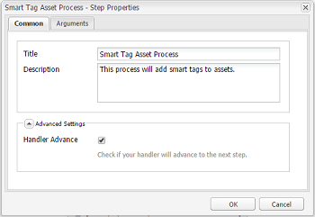

# 스마트 콘텐츠 서비스를 사용하여 자산 태그 지정 구성 {#configure-asset-tagging-using-the-smart-content-service}

Adobe I/O [!DNL Adobe Experience Manager] 를 사용하여 스마트 콘텐츠 서비스와 통합할 수 있습니다.이 구성을 사용하여 내에서 스마트 콘텐츠 서비스에 액세스할 수 [!DNL Experience Manager]있습니다.

이 문서에서는 스마트 콘텐츠 서비스를 구성하는 데 필요한 다음 주요 작업에 대해 자세히 설명합니다. Smart Content Service에 요청을 전달하기 전에 백엔드에서 Adobe I/O 게이트웨이로 서비스 자격 증명을 인증합니다. [!DNL Experience Manager]

* 공개 키를 생성하려면 스마트 콘텐츠 서비스 구성을 [!DNL Experience Manager] 만드십시오. OAuth 통합을 위한 공용 인증서를 얻습니다.
* Adobe I/O에서 통합을 만들고 생성된 공개 키를 업로드합니다.
* API 키 및 Adobe I/O의 다른 자격 증명을 사용하여 [!DNL Experience Manager] 인스턴스를 구성합니다.
* 선택적으로 자산 업로드 시 자동 태그 지정을 활성화합니다.

## 전제 조건 {#prerequisites}

스마트 콘텐츠 서비스를 사용하려면 먼저 Adobe I/O에 통합을 만들려면 다음을 확인하십시오.

* 조직에 대한 관리자 권한이 있는 Adobe ID 계정.
* 조직에서 스마트 콘텐츠 서비스 서비스를 사용할 수 있습니다.

## 공개 인증서 받기 {#obtain-public-certificate}

공개 인증서를 사용하면 Adobe I/O에서 프로필을 인증할 수 있습니다.

1. 사용자 [!DNL Experience Manager] 인터페이스에서 도구 > **[!UICONTROL 클라우드 서비스]**> 레거시 클라우드 서비스에 **[!UICONTROL 액세스합니다]**.

1. 클라우드 서비스 페이지에서 자산 스마트 **[!UICONTROL 태그 아래의]** 지금 **[!UICONTROL 구성을 클릭합니다]**.
1. 구성 **[!UICONTROL 만들기]** 대화 상자에서 스마트 태그 구성의 제목과 이름을 지정합니다. **[!UICONTROL 만들기]**&#x200B;를 클릭합니다.
1. AEM **[!UICONTROL 스마트 콘텐츠 서비스]** 대화 상자에서 다음 값을 사용합니다.

   **[!UICONTROL 서비스 URL]**: `https://mc.adobe.io/marketingcloud/smartcontent`

   **[!UICONTROL 인증 서버]**: `https://ims-na1.adobelogin.com`

   지금은 다른 필드를 비워 두십시오(나중에 제공하려면). **[!UICONTROL 확인]**&#x200B;을 클릭합니다.

   

1. OAuth **[!UICONTROL 통합을 위한 공용 인증서 다운로드를]**&#x200B;클릭하고 공개 인증서 파일을 `AEM-SmartTags.crt`다운로드합니다.

   

### 인증서가 만료될 때 다시 구성 {#certrenew}

인증서가 만료되면 더 이상 신뢰되지 않습니다. 새 인증서를 추가하려면 다음 단계를 따르십시오. 만료된 인증서는 갱신할 수 없습니다.

1. 관리자로 [!DNL Experience Manager] 배포에 로그인합니다. 도구 **[!UICONTROL > 보안]** **[!UICONTROL > 사용자를]** **[!UICONTROL 클릭합니다]**.

1. DAM **[!UICONTROL 업데이트 서비스]** 사용자를 찾아 클릭합니다. Keystore **[!UICONTROL 탭을]** 클릭합니다.
1. 만료된 인증서로 기존 **[!UICONTROL 유사성 검색]** 키 저장소를 삭제합니다. Click **[!UICONTROL Save &amp; Close]**.

   

   Keystore에서 기존 유사검색 항목을 삭제하여 새 보안 인증서 추가

1. 도구 > **[!UICONTROL 클라우드]** 서비스 **[!UICONTROL >]** 레거시 클라우드 **[!UICONTROL 서비스로]**&#x200B;이동합니다. 자산 **[!UICONTROL 스마트 태그]** > 구성 **[!UICONTROL 표시]** > 사용 가능한 구성을 **[!UICONTROL 클릭합니다]**. 필요한 구성을 클릭합니다.

1. 공용 인증서를 다운로드하려면 OAuth 통합에 **[!UICONTROL 대한 공용 인증서 다운로드를 클릭합니다]**.
1. 통합 [페이지에서 https://console.adobe.io](https://console.adobe.io) 에 액세스하고 기존 Smart Content Services로 **[!UICONTROL 이동합니다]** . 새 인증서를 업로드합니다. 자세한 내용은 Adobe I/O [통합](#create-adobe-i-o-integration)만들기의 지침을 참조하십시오.

## Adobe I/O 통합 만들기 {#create-adobe-i-o-integration}

스마트 콘텐츠 서비스 API를 사용하려면 Adobe I/O에서 통합을 만들어 API 키, 기술 계정 ID, 조직 ID 및 클라이언트 암호를 생성합니다.

1. https://console.adobe.io [에 액세스합니다](https://console.adobe.io/).
1. 통합 **[!UICONTROL 페이지에서]** 적절한 계정을 선택하고 연결된 조직 역할이 시스템 관리자인지 확인합니다.
1. 새 **[!UICONTROL 통합을]**&#x200B;클릭합니다.
1. 새 **[!UICONTROL 통합]** 만들기 페이지에서 API **[!UICONTROL 액세스를 선택합니다]**. 계속을 **[!UICONTROL 클릭합니다]**.
1. Experience **[!UICONTROL Cloud]**&#x200B;아래에서 스마트 **[!UICONTROL 콘텐츠를 선택합니다]**. 계속을 **[!UICONTROL 클릭합니다]**.

   

1. 다음 페이지에서 새 통합을 **[!UICONTROL 선택합니다]**. 계속을 **[!UICONTROL 클릭합니다]**.
1. [ **[!UICONTROL 통합 세부]** 사항] 페이지에서 통합 게이트웨이의 이름을 지정하고 설명을 추가합니다.
1. 공개 **[!UICONTROL 키 인증서에서]**&#x200B;위에 다운로드한 `AEM-SmartTags.crt` 파일을 업로드합니다.
1. **[!UICONTROL 통합 만들기]**&#x200B;를 클릭합니다.
1. 통합 정보를 보려면 [계속]을 클릭하여 **[!UICONTROL 통합 세부 사항을]**&#x200B;확인합니다.

   

## 스마트 콘텐츠 서비스 구성 {#configure-smart-content-service}

통합을 구성하려면 Adobe I/O 통합에서 기술 계정 ID, 조직 ID, 클라이언트 암호, 인증 서버 및 API 키 필드의 값을 사용하십시오. 스마트 태그 클라우드 구성을 만들면 [!DNL Experience Manager] 인스턴스에서 API 요청을 인증할 수 있습니다.

1. 에서 [!DNL Experience Manager]도구 > 클라우드 서비스 **[!UICONTROL > 기존 클라우드 서비스로]** 이동하여 클라우드 서비스 [!UICONTROL 콘솔을] 엽니다.
1. 자산 **[!UICONTROL 스마트 태그]**&#x200B;아래에서 위에서 만든 구성을 엽니다. 서비스 설정 페이지에서 편집을 **[!UICONTROL 클릭합니다]**.
1. AEM **[!UICONTROL 스마트 콘텐츠 서비스]** 대화 상자에서 서비스 URL 및 **[!UICONTROL 인증 서버]** 필드에 미리 채워진 값을 **[!UICONTROL 사용할]** 수있습니다.
1. 필드 API 키, 기술 **[!UICONTROL 계정]****[!UICONTROL ID]**, **[!UICONTROL Client Secret]**&#x200B;및 Client Secret **[!UICONTROL 의 경우 위에서 생성된 값을]**&#x200B;사용합니다.

## 구성 유효성 확인 {#validate-the-configuration}

구성을 완료한 후 JMX MBean을 사용하여 구성을 확인할 수 있습니다. 유효성을 확인하려면 다음 단계를 따르십시오.

1. 에서 [!DNL Experience Manager] 서버에 액세스합니다 `https://[aem_server]:[port]`.

1. 도구 > **[!UICONTROL 작업 > 웹 콘솔로]** 이동하여 OSGi 콘솔을 엽니다. 기본 **[!UICONTROL > JMX를 클릭합니다]**.
1. com.day.cq.da **[!UICONTROL m.similaritysearch.internal.impl을 클릭합니다]**. 유사성 **[!UICONTROL 검색기타 작업을 엽니다.]**
1. configs() **[!UICONTROL 를 클릭합니다]**. 구성 유효성 **[!UICONTROL 확인]** 대화 상자에서 호출을 **[!UICONTROL 클릭합니다]**.

   유효성 검사 결과가 동일한 대화 상자에 표시됩니다.

## 자산 업데이트 워크플로우에서 스마트 태그 지정 활성화(선택 사항) {#enable-smart-tagging-in-the-update-asset-workflow-optional}

1. 에서 도구 [!DNL Experience Manager]> 워크플로우 **[!UICONTROL > 모델로 이동합니다]**.
1. 워크플로우 **[!UICONTROL 모델]** 페이지에서 DAM 자산 **[!UICONTROL 업데이트 워크플로우]** 모델을 선택합니다.
1. 도구 **[!UICONTROL 모음에서]** 편집을 클릭합니다.
1. 사이드 패널을 확장하여 단계를 표시합니다. DAM **[!UICONTROL 워크플로우]** 섹션에서 사용할 수 있는 스마트 태그 자산 단계를 드래그하여 [축소판 처리] **[!UICONTROL 단계 다음에 배치합니다]** .

   ![DAM 자산 업데이트 워크플로우에서 프로세스 축소판 단계 이후 스마트 태그 [!UICONTROL 자산 추가]](assets/chlimage_1-105.png)

   *그림:DAM 자산 업데이트 워크플로우에서 프로세스 축소판 단계 뒤에 스마트 태그[!UICONTROL 자산 단계를]추가합니다.*

1. 편집 모드에서 단계를 엽니다. 고급 **[!UICONTROL 설정에서]**&#x200B;처리기 **[!UICONTROL 고급]** 옵션이 선택되어 있는지 확인합니다.

   

1. 자동 태그 **[!UICONTROL 지정]** 단계가 실패하더라도 **** 워크플로우를 완료하려면 인수 탭에서 오류 무시를 선택합니다.

   

   폴더에서 스마트 태그 지정 활성화 여부에 관계없이 업로드될 때 자산에 태그를 지정하려면 스마트 태그 **[!UICONTROL 플래그 무시를 선택합니다]**.

   

1. 확인을 **[!UICONTROL 클릭하여]** 프로세스 단계를 닫은 다음 워크플로우를 저장합니다.

>[!MORELIKETHIS]
>
>* [스마트 태그 관리](managing-smart-tags.md)
>* [스마트 태그 개요 및 교육 방법](enhanced-smart-tags.md)
>* [스마트 콘텐츠 서비스 트레이닝을 위한 지침 및 규칙](smart-tags-training-guidelines.md)
>* [스마트 태그 구성 방법에 대한 비디오 자습서](https://docs.adobe.com/content/help/en/experience-manager-learn/assets/metadata/smart-tags-technical-video-setup.html)

