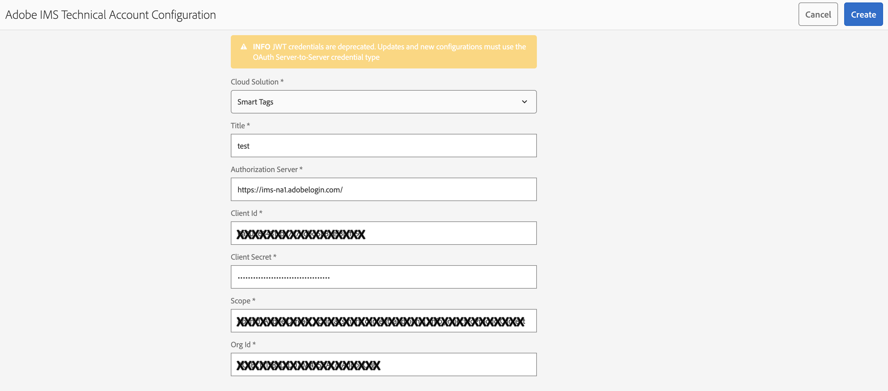
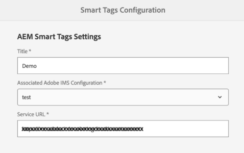

# 스마트 태그 지정을 위해 [!DNL Assets] 준비 {#configure-asset-tagging-using-the-smart-content-service}

스마트 컨텐츠 서비스를 사용하여 자산에 태그를 지정하려면 [!DNL Experience Manager Assets]을(를) Adobe Developer Console과 통합하여 [!DNL Adobe Sensei]의 스마트 서비스를 사용하십시오. 구성이 완료되면 몇 개의 이미지와 태그를 사용하여 서비스를 교육합니다.

>[!NOTE]
>
>* 새 [!DNL Experience Manager Assets] On-Premise 고객은 스마트 콘텐츠 서비스를 더 이상 사용할 수 없습니다. 이미 이 기능이 활성화되어 있는 기존 온-프레미스 고객은 스마트 컨텐츠 서비스를 계속 사용할 수 있습니다.
>* 스마트 컨텐츠 서비스는 이미 이 기능이 활성화되어 있는 기존 [!DNL Experience Manager Assets] Managed Services 고객이 사용할 수 있습니다.
>* 새로운 Experience Manager Assets Managed Services 고객은 이 문서에 언급된 지침에 따라 스마트 컨텐츠 서비스를 설정할 수 있습니다.
>* 서비스 팩 20 이상의 경우 SCS가 Oauth 통합을 지원하도록 해결 단계를 수행해야 합니다. [OAuth 자격 증명에 대한 스마트 태그 문제 해결](#config-smart-tagging.md)을 참조하십시오.
>* 서비스 팩 21에서 Oauth 통합을 지원하려면 [핫픽스](https://experience.adobe.com/#/downloads/content/software-distribution/en/aem.html?pack[...]ackages/cq650/product/assets/cq-6.5.0-hotfix-40772-1.2.zip)를 설치해야 합니다.
>* 기존 SCS 구성의 경우 프로세스는 새 OAuth 통합을 설정하는 것과 같습니다. 모든 이전 구성은 자동으로 정리됩니다.

스마트 컨텐츠 서비스를 사용하기 전에 다음을 확인하십시오.

* [Adobe Developer Console과 통합](#integrate-adobe-io).
* [스마트 컨텐츠 서비스를 교육합니다](#training-the-smart-content-service).

* 최신 [[!DNL Experience Manager] 서비스 팩](https://experienceleague.adobe.com/docs/experience-manager-release-information/aem-release-updates/aem-releases-updates.html)을 설치하십시오.

## Adobe Developer Console과 통합 {#integrate-adobe-io}

Adobe Developer Console과 통합하면 요청을 스마트 컨텐츠 서비스로 전달하기 전에 [!DNL Experience Manager] 서버에서 Adobe Developer Console 게이트웨이로 서비스 자격 증명을 인증합니다. 통합하려면 조직에 대한 관리자 권한이 있는 Adobe ID 계정과, 조직에 대해 구매 및 활성화된 Smart Content Service 라이선스가 필요합니다.

스마트 컨텐츠 서비스를 구성하려면 다음 최상위 단계를 수행합니다.

1. [Adobe Developer Console](#create-adobe-io-integration)에서 통합을 만듭니다.

1. API 키 및 Adobe Developer Console의 기타 자격 증명을 사용하여 [IMS 기술 계정 구성](#create-ims-account-config)을(를) 만듭니다.

1. [스마트 컨텐츠 서비스를 구성합니다](#configure-smart-content-service).

1. [구성을 테스트합니다](#validate-the-configuration).

<!--
To configure the Smart Content Service, follow these top-level steps:

1. To generate a public key, [Create a Smart Content Service] (#obtain-public-certificate) configuration in [!DNL Experience Manager]. 

1. Optionally, [enable auto-tagging on asset upload](#enable-smart-tagging-in-the-update-asset-workflow-optional).

   <!--1. [Obtain public certificate](#obtain-public-certificate) for OAuth integration.
   1. [Create an integration in Adobe Developer Console](#create-adobe-i-o-integration) and upload the generated public key.

   1. [Configure your deployment](#configure-smart-content-service) using the API key and other credentials from Adobe Developer Console.

   1. [Test the configuration](#validate-the-configuration).-->

### Adobe Developer Console 통합 만들기 {#create-adobe-io-integration}

스마트 컨텐츠 서비스 API를 사용하려면 Adobe Developer Console에서 통합을 만들어 [!DNL Experience Manager]에 클라우드 구성의 [!UICONTROL Assets 스마트 태깅 서비스 설정]에 대한 [!UICONTROL API 키](Adobe Developer Console 통합의 [!UICONTROL 클라이언트 ID] 필드에서 생성됨), [!UICONTROL 조직 ID] 및 [!UICONTROL 클라이언트 암호]를 얻으십시오.

1. 브라우저에서 [https://developer.adobe.com](https://developer.adobe.com/)에 액세스합니다. 적절한 계정을 선택하고 연결된 조직 역할이 시스템 **관리자**&#x200B;인지 확인하십시오.

1. 원하는 이름으로 프로젝트를 만듭니다. **[!UICONTROL API 추가]**&#x200B;를 클릭합니다.

1. **[!UICONTROL API 추가]** 페이지에서 **[!UICONTROL Experience Cloud]**&#x200B;를 선택하고 **[!UICONTROL 스마트 컨텐츠]**&#x200B;를 선택합니다. **[!UICONTROL 다음]**&#x200B;을 클릭합니다.

1. **[!UICONTROL OAuth 서버 간]**&#x200B;을(를) 선택합니다. **[!UICONTROL 다음]**을 클릭합니다.
이 구성을 수행하는 방법에 대한 자세한 내용은 요구 사항에 따라 Developer Console 설명서를 참조하십시오.

   * 개요:
      * [서버 간 인증](https://developer.adobe.com/developer-console/docs/guides/authentication/ServerToServerAuthentication/)

   * 새 OAuth 자격 증명 만들기:
      * [OAuth 서버 간 자격 증명 구현 안내서](https://developer.adobe.com/developer-console/docs/guides/authentication/ServerToServerAuthentication/implementation/)

   * 기존 JWT 자격 증명을 OAuth 자격 증명으로 마이그레이션:
      * [서비스 계정(JWT) 자격 증명에서 OAuth 서버 간 자격 증명으로 마이그레이션](https://developer.adobe.com/developer-console/docs/guides/authentication/ServerToServerAuthentication/migration/)

1. **[!UICONTROL 제품 프로필 선택]** 페이지에서 **[!UICONTROL 스마트 컨텐츠 서비스]**&#x200B;를 선택합니다. **[!UICONTROL 구성된 API 저장]**&#x200B;을 클릭합니다.

   페이지에 구성에 대한 자세한 정보가 표시됩니다. 스마트 태그를 구성하려면 [!DNL Experience Manager]에 있는 클라우드 구성의 [!UICONTROL Assets 스마트 태그 지정 서비스 설정]에서 이 값을 복사하고 추가하려면 이 페이지를 열어 두십시오.

   

### IMS 기술 계정 구성 만들기 {#create-ims-account-config}

아래 단계를 사용하여 IMS 기술 계정 구성을 만들어야 합니다.

1. [!DNL Experience Manager] 사용자 인터페이스에서 **[!UICONTROL 도구]** > **[!UICONTROL 보안]** > **[!UICONTROL Adobe IMS 구성]**&#x200B;에 액세스합니다.

1. **[!UICONTROL 만들기]**&#x200B;를 클릭합니다.

1. IMS 기술 계정 구성 대화 상자에서 다음 값을 사용합니다.

   

   | 필드 | 설명 |
   | -------- | ---------------------------- |
   | 클라우드 솔루션 | 드롭다운에서 **[!UICONTROL 스마트 태그]**&#x200B;를 선택합니다. |
   | 제목 | 구성하는 IMS 계정의 제목을 추가합니다. |
   | 인증 서버 | `https://ims-na1.adobelogin.com` 추가 |
   | 클라이언트 ID | [Adobe Developer 콘솔](https://developer.adobe.com/console/)을 통해 제공될 예정입니다. |
   | 클라이언트 암호 | [Adobe Developer 콘솔](https://developer.adobe.com/console/)을 통해 제공될 예정입니다. |
   | 범위 | [Adobe Developer 콘솔](https://developer.adobe.com/console/)을 통해 제공될 예정입니다. |
   | 조직 ID | [Adobe Developer 콘솔](https://developer.adobe.com/console/)을 통해 제공될 예정입니다. |

1. 만든 구성을 선택하고 **[!UICONTROL 상태 확인]**&#x200B;을 클릭합니다.

1. 구성 상태가 정상 상태인 경우 상태 확인 대화 상자를 확인하고 닫기 를 클릭합니다.

### 새 구성 만들기 {#configure-smart-content-service}

<!--
>[!CAUTION]
>
>Previously, configurations that were made with JWT Credentials are now subject to deprecation in the Adobe Developer Console. You cannot create new JWT credentials after June 3, 2024. Such configurations can no longer be created or updated, but can be migrated to OAuth configurations.
> See [Setting up IMS integrations for AEM](https://experienceleague.adobe.com/en/docs/experience-manager-cloud-service/content/security/setting-up-ims-integrations-for-aem-as-a-cloud-service)
>See [Steps to configure OAuth for on-premise users](#config-oauth-onprem)
> See [Troubleshooting smart tags for OAuth credentials](#config-smart-tagging.md)
-->

통합을 구성하려면 Adobe Developer Console 통합에서 [!UICONTROL 기술 계정 ID], [!UICONTROL 조직 ID], [!UICONTROL 클라이언트 암호] 및 [!UICONTROL 클라이언트 ID] 필드 값을 사용합니다. 스마트 태그 클라우드 구성을 만들면 [!DNL Experience Manager] 배포의 API 요청을 인증할 수 있습니다.

1. [!DNL Experience Manager]에서 **[!UICONTROL 도구]** > **[!UICONTROL Cloud Service]** > **[!UICONTROL 스마트 태그]**(으)로 이동하여 [!UICONTROL 스마트 태그 구성]을 엽니다.

1. 새 구성을 만들려면 **[!UICONTROL 만들기]**&#x200B;를 클릭하십시오. 그렇지 않으면 **[!UICONTROL 속성]**&#x200B;을 클릭하여 기존 구성을 업데이트합니다.

1. 다음 필드를 채웁니다.

   

   | 필드 | 설명 |
   | -------- | ---------------------------- |
   | 제목 | 구성하는 IMS 계정의 제목을 추가합니다. |
   | 연관된 Adobe IMS 구성 | 드롭다운에서 구성을 선택합니다. |
   | 서비스 URL | `https://smartcontent.adobe.io/<region where your Experience Manager author instance is hosted>`. 예, `https://smartcontent.adobe.io/apac`. `na`, `emea` 또는 `apac`을(를) Experience Manager 작성자 인스턴스가 호스팅되는 지역으로 지정할 수 있습니다. |

   >[!NOTE]
   >
   >Experience Manager Managed Service가 2022년 9월 1일 이전에 프로비저닝된 경우 다음 서비스 URL을 사용하십시오.
   >`https://mc.adobe.io/marketingcloud/smartcontent`

1. **[!UICONTROL 저장 및 닫기]**&#x200B;를 클릭합니다.

### 구성 유효성 검사 {#validate-the-configuration}

구성을 완료한 후 JMX MBean을 사용하여 구성의 유효성을 검사할 수 있습니다. 유효성을 검사하려면 다음 단계를 수행합니다.

1. `https://[aem_server]:[port]`에서 [!DNL Experience Manager] 서버에 액세스합니다.

1. **[!UICONTROL 도구]** > **[!UICONTROL 작업]** > **[!UICONTROL 웹 콘솔]**(으)로 이동하여 OSGi 콘솔을 엽니다. **[!UICONTROL 기본] > [!UICONTROL JMX]**&#x200B;을(를) 클릭합니다.

<!--
1. Click `com.day.cq.dam.similaritysearch.internal.impl`. It opens **[!UICONTROL SimilaritySearch Miscellaneous Tasks]**.-->

1. `com.day.cq.dam.similaritysearch.internal.impl (SCS)`를 클릭합니다.

   

1. `validateConfigs()`를 클릭합니다. **[!UICONTROL 구성 유효성 검사]** 대화 상자에서 **[!UICONTROL 호출]**&#x200B;을 클릭합니다.

유효성 검사 결과는 동일한 대화 상자에 표시됩니다.

<!--
### Obtain public certificate by creating Smart Content Service configuration {#obtain-public-certificate}

A public certificate lets you authenticate your profile on Adobe Developer Console.

1. In the [!DNL Experience Manager] user interface, access **[!UICONTROL Tools]** > **[!UICONTROL Cloud Services]** > **[!UICONTROL Legacy Cloud Services]**.

1. In the Cloud Services page, click **[!UICONTROL Configure Now]** under **[!UICONTROL Assets Smart Tags]**.

1. In the **[!UICONTROL Create Configuration]** dialog, specify a title and name for the Smart Tags configuration. Click **[!UICONTROL Create]**.

1. In the **[!UICONTROL AEM Smart Content Service]** dialog, use the following values:

   **[!UICONTROL Service URL]**: `https://smartcontent.adobe.io/<region where your Experience Manager author instance is hosted>`

   For example, `https://smartcontent.adobe.io/apac`. You can specify `na`, `emea`, or, `apac` as the regions where your Experience Manager author instance is hosted. 

   >[!NOTE]
   >
   >If the Experience Manager Managed Service is provisioned before September 01, 2022, use the following Service URL:
   >`https://mc.adobe.io/marketingcloud/smartcontent`

   **[!UICONTROL Authorization Server]**: `https://ims-na1.adobelogin.com`

   Leave the other fields blank for now (to be provided later). Click **[!UICONTROL OK]**.

   

   *Figure: Smart Content Service dialog to provide content service URL*

   >[!NOTE]
   >
   >The URL provided as [!UICONTROL Service URL] is not accessible via browser and generates a 404 error. The configuration works OK with the same value of the [!UICONTROL Service URL] parameter. For the overall service status and maintenance schedule, see [https://status.adobe.com](https://status.adobe.com).

1. Click **[!UICONTROL Download Public Certificate for OAuth Integration]**, and download the public certificate file `AEM-SmartTags.crt`.

   

   *Figure: Settings for smart tagging service.*

#### Reconfigure when a certificate expires {#certrenew}

After a certificate expires, it is no longer trusted. You cannot renew an expired certificate. To add a certificate, follow these steps.

1. Log in your [!DNL Experience Manager] deployment as an administrator. Click **[!UICONTROL Tools]** > **[!UICONTROL Security]** > **[!UICONTROL Users]**.

1. Locate and click **[!UICONTROL dam-update-service]** user. Click **[!UICONTROL Keystore]** tab.

1. Delete the existing **[!UICONTROL similaritysearch]** keystore with the expired certificate. Click **[!UICONTROL Save & Close]**.

   

   *Figure: Delete the existing `similaritysearch` entry in Keystore to add a security certificate.*

1. Navigate to **[!UICONTROL Tools]** > **[!UICONTROL Cloud Services]** > **[!UICONTROL Legacy Cloud Services]**. Click **[!UICONTROL Asset Smart Tags]** > **[!UICONTROL Show Configuration]** > **[!UICONTROL Available Configurations]**. Click the required configuration.  

1. To download a public certificate, click **[!UICONTROL Download Public Certificate for OAuth Integration]**.

1. Access [https://console.adobe.io](https://console.adobe.io) and navigate to the existing Smart Content Services on the **[!UICONTROL Integrations]** page. Upload the new certificate. For more information, see the instructions in [Create Adobe Developer Console integration](#create-adobe-i-o-integration).

### Create Adobe Developer Console integration {#create-adobe-i-o-integration}

To use Smart Content Service APIs, create an integration in Adobe Developer Console to obtain [!UICONTROL API Key] (generated in [!UICONTROL CLIENT ID] field of Adobe Developer Console integration), [!UICONTROL TECHNICAL ACCOUNT ID], [!UICONTROL ORGANIZATION ID], and [!UICONTROL CLIENT SECRET] for [!UICONTROL Assets Smart Tagging Service Settings] of cloud configuration in [!DNL Experience Manager].

1. Access [https://console.adobe.io](https://console.adobe.io/) in a browser. Select the appropriate account and verify that the associated organization role is system administrator.

1. Create a project with any desired name. Click **[!UICONTROL Add API]**.

1. On the **[!UICONTROL Add an API]** page, select **[!UICONTROL Experience Cloud]** and select **[!UICONTROL Smart Content]**. Click **[!UICONTROL Next]**.

1. Select **[!UICONTROL Upload your public key]**. Provide the certificate file downloaded from [!DNL Experience Manager]. A message [!UICONTROL Public key(s) uploaded successfully] is displayed. Click **[!UICONTROL Next]**.

   [!UICONTROL Create a new Service Account (JWT) credential] page displays the public key for the service account.

1. Click **[!UICONTROL Next]**.

1. On the **[!UICONTROL Select product profiles]** page, select **[!UICONTROL Smart Content Services]**. Click **[!UICONTROL Save configured API]**.

   A page displays more information about the configuration. Keep this page open to copy and add these values in [!UICONTROL Assets Smart Tagging Service Settings] of cloud configuration in [!DNL Experience Manager] to configure smart tags.

   

   *Figure: Details of integration in Adobe Developer Console*

### Configure Smart Content Service {#configure-smart-content-service}

>[!CAUTION]
>
>Previously, configurations that were made with JWT Credentials are now subject to deprecation in the Adobe Developer Console. You cannot create new JWT credentials after June 3, 2024. Such configurations can no longer be created or updated, but can be migrated to OAuth configurations.
> See [Setting up IMS integrations for AEM](https://experienceleague.adobe.com/en/docs/experience-manager-cloud-service/content/security/setting-up-ims-integrations-for-aem-as-a-cloud-service)
>See [Steps to configure OAuth for on-premise users](#config-oauth-onprem)
> See [Troubleshooting smart tags for OAuth credentials](#config-smart-tagging.md)

To configure the integration, use the values of [!UICONTROL TECHNICAL ACCOUNT ID], [!UICONTROL ORGANIZATION ID], [!UICONTROL CLIENT SECRET], and [!UICONTROL CLIENT ID] fields from the Adobe Developer Console integration. Creating a Smart Tags cloud configuration allows authentication of API requests from the [!DNL Experience Manager] deployment.

1. In [!DNL Experience Manager], navigate to **[!UICONTROL Tools]** > **[!UICONTROL Cloud Service]** > **[!UICONTROL Legacy Cloud Services]** to open the [!UICONTROL Cloud Services] console.

1. Under the **[!UICONTROL Assets Smart Tags]**, open the configuration created above. On the service settings page, click **[!UICONTROL Edit]**.

1. In the **[!UICONTROL AEM Smart Content Service]** dialog, use the pre-populated values for the **[!UICONTROL Service URL]** and **[!UICONTROL Authorization Server]** fields.

1. For the fields [!UICONTROL Api Key], [!UICONTROL Technical Account ID], [!UICONTROL Organization ID], and [!UICONTROL Client Secret], copy and use the following values generated in [Adobe Developer Console integration](#create-adobe-i-o-integration).

   | [!UICONTROL Assets Smart Tagging Service Settings] | [!DNL Adobe Developer Console] integration fields |
   |--- |--- |
   | [!UICONTROL Api Key] | [!UICONTROL CLIENT ID] |
   | [!UICONTROL Technical Account ID] | [!UICONTROL TECHNICAL ACCOUNT ID] |
   | [!UICONTROL Organization ID] | [!UICONTROL ORGANIZATION ID] |
   | [!UICONTROL Client Secret] | [!UICONTROL CLIENT SECRET] |

### Configure OAuth for on-premise users {#config-oauth-onprem}

#### Prerequisites {#prereqs-config-oauth-onprem}

An authorization scope is an OAuth string that contains the following prerequisites:

* Create a new OAuth integration in the [Developer Console](https://developer.adobe.com/console/user/servicesandapis) using `ClientID`, `ClientSecretID`, and `OrgID`.
* Add the following files at this path `/apps/system/config in crx/de`:
   * `com.adobe.granite.auth.oauth.accesstoken.provider.<randomnumbers>.config`
   * `com.adobe.granite.auth.ims.impl.IMSAccessTokenRequestCustomizerImpl.<randomnumber>.config`

#### Configure OAuth for on-premise users {#steps-config-oauth-onprem}

1. Add or update the below properties in `com.adobe.granite.auth.oauth.accesstoken.provider.<randomnumbers>.config`:

   * `auth.token.provider.authorization.grants="client_credentials"`
   * `auth.token.provider.orgId="<OrgID>"`
   * `auth.token.provider.default.claims=("\"iss\"\ :\ \"<OrgID>\"")`
   * `auth.token.provider.scope="read_pc.dma_smart_content,\ openid,\ AdobeID,\ additional_info.projectedProductContext"`
     `auth.token.validator.type="adobe-ims-similaritysearch"`
   * Update the `auth.token.provider.client.id` with the Client ID of the new OAuth configuration.
   * Update `auth.access.token.request` to `"https://ims-na1.adobelogin.com/ims/token/v3"`
2. Rename the file to `com.adobe.granite.auth.oauth.accesstoken.provider-<randomnumber>.config`.
3. Perform the steps below in `com.adobe.granite.auth.ims.impl.IMSAccessTokenRequestCustomizerImpl.<randomnumber>.config`:
   * Update the property auth.ims.client.secret with the Client Secret from the new OAuth integration.
   * Rename the file to `com.adobe.granite.auth.ims.impl.IMSAccessTokenRequestCustomizerImpl-<randomnumber>.config`
4. Save all the changes in content repository development console, for example, CRXDE.
5. Navigate to `/system/console/configMgr` and replace the OSGi configuration from `.<randomnumber>` to `-<randomnumber>`.
6. Delete the old configuration for `"Access Token provider name: adobe-ims-similaritysearch"` in `/system/console/configMgr`.
7. Restart the console.

### Validate the configuration {#validate-the-configuration}

After you have completed the configuration, you can use a JMX MBean to validate the configuration. To validate, follow these steps.

1. Access your [!DNL Experience Manager] server at `https://[aem_server]:[port]`.

1. Go to **[!UICONTROL Tools]** > **[!UICONTROL Operations]** > **[!UICONTROL Web Console]** to open the OSGi console. Click **[!UICONTROL Main] > [!UICONTROL JMX]**.

1. Click `com.day.cq.dam.similaritysearch.internal.impl`. It opens **[!UICONTROL SimilaritySearch Miscellaneous Tasks]**.

1. Click `validateConfigs()`. In the **[!UICONTROL Validate Configurations]** dialog, click **[!UICONTROL Invoke]**.

The validation results are displayed in the same dialog.
-->

### [!UICONTROL DAM 자산 업데이트] 워크플로우에서 스마트 태그 지정 사용(선택 사항) {#enable-smart-tagging-in-the-update-asset-workflow-optional}

1. [!DNL Experience Manager]에서 **[!UICONTROL 도구]** > **[!UICONTROL 워크플로]** > **[!UICONTROL 모델]**(으)로 이동합니다.

1. **[!UICONTROL 워크플로 모델]** 페이지에서 **[!UICONTROL DAM 자산 업데이트]** 워크플로 모델을 선택합니다.

1. 도구 모음에서 **[!UICONTROL 편집]**&#x200B;을 클릭합니다.

1. 사이드 패널을 확장하여 단계를 표시합니다. DAM 워크플로 섹션에서 사용할 수 있는 **[!UICONTROL 스마트 태그 자산]** 단계를 드래그하여 **[!UICONTROL 프로세스 썸네일]** 단계 이후에 배치합니다.

   

1. 세부 정보를 수정하려면 단계의 속성을 엽니다. **[!UICONTROL 고급 설정]**&#x200B;에서 **[!UICONTROL 핸들러 고급]** 옵션을 선택해야 합니다.

   

1. In the **[!UICONTROL Arguments]** tab, select **[!UICONTROL Ignore Errors]** if you want the workflow to complete even if the automatic tagging step fails.

   또한 폴더에서 스마트 태그 지정 사용 여부와 관계없이 업로드될 때 자산에 태그를 지정하려면 **[!UICONTROL 스마트 태그 플래그 무시]**&#x200B;를 선택합니다.

   

1. 완료 을 클릭하여 프로세스 단계를 닫습니다.

1. 워크플로우를 저장하려면 **[!UICONTROL 동기화]**&#x200B;를 클릭합니다.

## 스마트 컨텐츠 서비스 교육 {#training-the-smart-content-service}

스마트 컨텐츠 서비스가 비즈니스 분류법을 인식하도록 하려면 비즈니스와 관련된 태그가 이미 포함된 자산 세트에서 실행합니다. 브랜드 이미지에 효과적으로 태그를 지정하려면 스마트 컨텐츠 서비스는 교육 이미지가 특정 지침을 준수해야 합니다. 교육 후 서비스는 유사한 에셋 세트에 동일한 분류법을 적용할 수 있습니다.

관련 태그를 적용하는 기능을 개선하기 위해 서비스를 여러 번 교육할 수 있습니다. 각 교육 주기 후에 태그 지정 워크플로우를 실행하고 자산에 적절하게 태그가 지정되었는지 확인합니다.

스마트 컨텐츠 서비스를 정기적으로 또는 요구 사항에 따라 교육할 수 있습니다.

>[!NOTE]
>
>교육 워크플로우는 폴더에서만 실행됩니다.

### 교육 지침 {#guidelines-for-training}

최상의 결과를 얻기 위해 교육 세트의 이미지는 다음 지침을 따릅니다.

**Quantity and size:** Minimum 30 images per tag. Minimum of 500 pixels on the longer side.

**일관성**: 특정 태그에 사용되는 이미지가 시각적으로 유사합니다.

예를 들어 이러한 모든 이미지는 시각적으로 유사하지 않으므로 `my-party`(교육용)으로 태그를 지정하는 것은 좋지 않습니다.

**적용 범위**: 교육에 있는 이미지에 충분한 다양성을 사용하십시오. 아이디어는 Experience Manager이 올바른 것에 초점을 맞추는 방법을 배울 수 있도록 몇 가지 그러나 합리적으로 다양한 사례를 제공하는 것입니다. 시각적으로 다른 이미지에 동일한 태그를 적용하는 경우에는 각 종류의 예제를 5개 이상 포함하십시오.

예를 들어 태그 *모델-아래-포즈*&#x200B;의 경우 태그 지정 중에 유사한 이미지를 더 정확하게 식별하기 위해 서비스에 대해 아래 강조 표시된 이미지와 유사한 교육 이미지를 더 포함하십시오.

**주의 산만함/방해**: 서비스는 주의 산만함이 적은 이미지(주요 주체가 있는 개체/사람과 같이 눈에 띄는 배경, 관련 없는 반주)에서 더 잘 훈련합니다.

예를 들어 태그 *캐주얼 신발*&#x200B;의 경우 두 번째 이미지는 좋은 교육 후보가 아닙니다.

**Completeness:** If an image qualifies for more than one tag, add all applicable tags before including the image for training. 예를 들어 `raincoat` 및 `model-side-view`과(와) 같은 태그의 경우 교육을 위해 태그를 포함하기 전에 적격 에셋에 태그를 모두 추가하십시오.

>[!NOTE]
>
>태그에 대해 교육하고 다른 이미지에 적용하는 스마트 컨텐츠 서비스의 기능은 교육에 사용하는 이미지의 품질에 따라 다릅니다. Adobe 최상의 결과를 얻으려면 시각적으로 유사한 이미지를 사용하여 각 태그에 대한 서비스를 교육하는 것이 좋습니다.

### 정기 교육 {#periodic-training}

스마트 컨텐츠 서비스를 사용하여 폴더 내의 자산 및 관련 태그에 대해 정기적으로 교육할 수 있습니다. 자산 폴더의 [!UICONTROL 속성] 페이지를 열고 **[!UICONTROL 세부 정보]** 탭에서 **[!UICONTROL 스마트 태그 사용]**&#x200B;을 선택한 다음 변경 내용을 저장합니다.

폴더에 대해 이 옵션을 선택하면 [!DNL Experience Manager]에서 자동으로 교육 워크플로를 실행하여 폴더 자산 및 해당 태그에 대한 스마트 컨텐츠 서비스를 교육합니다. 기본적으로 교육 워크플로우는 매주 토요일 오전 12시 30분에 실행됩니다.

### 온디맨드 교육 {#on-demand-training}

필요할 때마다 워크플로우 콘솔에서 스마트 컨텐츠 서비스를 교육할 수 있습니다.

1. [!DNL Experience Manager] 인터페이스에서 **[!UICONTROL 도구]** > **[!UICONTROL 워크플로]** > **[!UICONTROL 모델]**(으)로 이동합니다.
1. **[!UICONTROL 워크플로 모델]** 페이지에서 **[!UICONTROL 스마트 태그 교육]** 워크플로를 선택한 다음 도구 모음에서 **[!UICONTROL 워크플로 시작]**&#x200B;을 클릭합니다.
1. **[!UICONTROL 워크플로 실행]** 대화 상자에서 서비스 교육을 위해 태그가 지정된 자산이 포함된 페이로드 폴더를 찾습니다.
1. 워크플로우의 제목을 지정하고 댓글을 추가합니다. 그런 다음 **[!UICONTROL 실행]**&#x200B;을 클릭합니다. 에셋 및 태그가 교육을 위해 제출됩니다.

   

>[!NOTE]
>
>폴더의 에셋이 교육에 대해 처리되면 수정된 에셋만 후속 교육 주기에서 처리됩니다.

### 교육 보고서 보기 {#viewing-training-reports}

스마트 컨텐츠 서비스가 교육 에셋 세트의 태그에 대해 교육되었는지 확인하려면 보고서 콘솔에서 교육 워크플로우 보고서를 검토하십시오.

1. [!DNL Experience Manager] 인터페이스에서 **[!UICONTROL 도구]** > **[!UICONTROL Assets]** > **[!UICONTROL 보고서]**(으)로 이동합니다.
1. **[!UICONTROL 자산 보고서]** 페이지에서 **[!UICONTROL 만들기]**&#x200B;를 클릭합니다.
1. **[!UICONTROL 스마트 태그 교육]** 보고서를 선택한 다음 도구 모음에서 **[!UICONTROL 다음]**&#x200B;을 클릭합니다.
1. Specify a title and description for the report. Under **[!UICONTROL Schedule Report]**, leave the **[!UICONTROL Now]** option selected. If you want to schedule the report for later, select **[!UICONTROL Later]** and specify a date and time. 그런 다음 도구 모음에서 **[!UICONTROL 만들기]**&#x200B;를 클릭합니다.
1. In the **[!UICONTROL Asset Reports]** page, select the report you generated. 보고서를 보려면 도구 모음에서 **[!UICONTROL 보기]**&#x200B;를 클릭하십시오.
1. 보고서의 세부 사항을 검토합니다.

   The report displays the training status for the tags you trained. The green color in the **[!UICONTROL Training Status]** column indicates that the Smart Content Service is trained for the tag. Yellow color indicates that the service is not completely trained for a particular tag. In this case, add more images with the particular tag and run the training workflow to train the service completely on the tag.

   이 보고서에 태그가 표시되지 않으면 이러한 태그에 대한 교육 워크플로우를 다시 실행하십시오.

1. 보고서를 다운로드하려면 목록에서 선택한 다음 도구 모음에서 **[!UICONTROL 다운로드]**&#x200B;를 클릭하십시오. 보고서는 Microsoft Excel 스프레드시트로 다운로드됩니다.

## 제한 사항 {#limitations}

* 향상된 스마트 태그는 이미지 및 해당 태그의 학습 모델을 기반으로 합니다. 이러한 모델이 태그를 식별하는 데 항상 완벽하지는 않습니다. 현재 버전의 스마트 컨텐츠 서비스에는 다음과 같은 제한 사항이 있습니다.

   * 이미지의 미묘한 차이를 인식할 수 없음. 예를 들어, 슬림과 일반 맞춤 셔츠.
   * 이미지의 작은 패턴/부분을 기반으로 태그를 식별할 수 없음. 예를 들어 T 셔츠의 로고.
   * [!DNL Experience Manager]이(가) 지원되는 로케일에서 태깅이 지원됩니다.

* 스마트 태그(일반 또는 고급)로 자산을 검색하려면 [!DNL Assets] Omnisearch(전체 텍스트 검색)를 사용하십시오. 스마트 태그에 대한 별도의 검색 조건자는 없습니다.

>[!MORELIKETHIS]
>
>* [개요 및 스마트 태그 교육 방법](enhanced-smart-tags.md)
>* [OAuth 자격 증명에 대한 스마트 태그 문제 해결](config-oauth.md)
>* 스마트 태그에 대한 [비디오 튜토리얼](https://experienceleague.adobe.com/docs/experience-manager-learn/assets/metadata/image-smart-tags.html)
