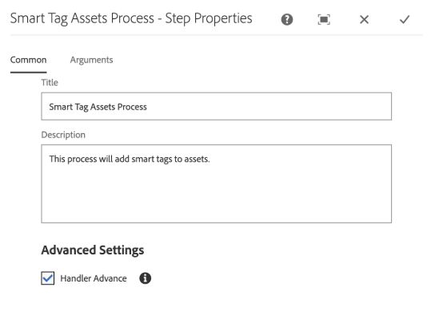

# 스마트 태그 지정 {#configure-asset-tagging-using-the-smart-content-service}에 대해 [!DNL Assets] 준비

스마트 콘텐츠 서비스를 사용하여 에셋에 태그를 지정하기 전에 [!DNL Experience Manager Assets]을(를) Adobe 개발자 콘솔과 통합하여 [!DNL Adobe Sensei]의 스마트 서비스를 활용합니다. 구성된 후에는 이미지와 태그를 사용하여 서비스를 교육합니다.

스마트 콘텐츠 서비스를 사용하기 전에 다음을 확인하십시오.

* [Adobe 개발자 콘솔과 통합](#integrate-adobe-io).
* [스마트 콘텐츠 서비스 트레이닝을 참조하십시오](#training-the-smart-content-service).

   <!-- TBD: This link will update soon after the new articles goes live on docs.adobe.com. Change it when new URL is available.
  -->

* 최신 [Experience Manager 서비스 팩](https://experienceleague.adobe.com/docs/experience-manager-release-information/aem-release-updates/aem-releases-updates.html)을(를) 설치합니다.

## Adobe 개발자 콘솔과 통합 {#integrate-adobe-io}

Adobe 개발자 콘솔과 통합하면 스마트 콘텐츠 서비스로 요청을 전달하기 전에 [!DNL Experience Manager] 서버가 Adobe 개발자 콘솔 게이트웨이로 서비스 자격 증명을 인증합니다. 통합하려면 조직에 대한 관리자 권한이 있는 Adobe ID 계정과 조직에서 사용할 수 있는 스마트 콘텐츠 서비스 라이선스가 있는 계정이 필요합니다.

스마트 콘텐츠 서비스를 구성하려면 다음 최상위 단계를 따르십시오.

1. 공개 키를 생성하려면 [스마트 콘텐츠 서비스](#obtain-public-certificate) 구성을 [!DNL Experience Manager]에 만듭니다. OAuth 통합을 위한 [공개 인증서를 받습니다](#obtain-public-certificate).

1. [Adobe 개발자 콘솔에서 통합을 만들고](#create-adobe-i-o-integration) 생성된 공개 키를 업로드합니다.

1. [Adobe 개발자 ](#configure-smart-content-service) 콘솔에서 API 키 및 기타 자격 증명을 사용하여 배포를 구성합니다.

1. [구성을 테스트합니다](#validate-the-configuration).

1. 원할 경우, 자산 업로드](#enable-smart-tagging-in-the-update-asset-workflow-optional)에 자동 태그 지정을 활성화합니다.[

### 스마트 콘텐츠 서비스 구성 {#obtain-public-certificate}을(를) 만들어 공용 인증서를 얻습니다.

공개 인증서를 사용하면 Adobe 개발자 콘솔에서 프로필을 인증할 수 있습니다.

1. [!DNL Experience Manager] 사용자 인터페이스에서 **[!UICONTROL 도구]** > **[!UICONTROL Cloud Services]** > **[!UICONTROL 기존 Cloud Services]**&#x200B;에 액세스합니다.

1. Cloud Services 페이지에서 **[!UICONTROL 자산 스마트 태그]**&#x200B;에서 **[!UICONTROL 지금 구성]**&#x200B;을 클릭합니다.

1. **[!UICONTROL 구성 만들기]** 대화 상자에서 스마트 태그 구성의 제목과 이름을 지정합니다. **[!UICONTROL 만들기]**&#x200B;를 클릭합니다.

1. **[!UICONTROL AEM 스마트 콘텐츠 서비스]** 대화 상자에서 다음 값을 사용합니다.

   **[!UICONTROL 서비스 URL]**: `https://mc.adobe.io/marketingcloud/smartcontent`

   **[!UICONTROL 인증 서버]**: `https://ims-na1.adobelogin.com`

   지금은 다른 필드를 비워 두십시오(나중에 제공하려면). **[!UICONTROL 확인]**&#x200B;을 클릭합니다.

   

   *그림:콘텐츠 서비스 URL을 제공하는 스마트 콘텐츠 서비스 대화 상자*

   >[!NOTE]
   >
   >[!UICONTROL 서비스 URL]으로 제공된 URL은 브라우저를 통해 액세스할 수 없으며 404 오류를 생성합니다. 이 구성은 [!UICONTROL 서비스 URL] 매개 변수와 동일한 값으로 OK됩니다. 전체 서비스 상태 및 유지 관리 일정은 [https://status.adobe.com](https://status.adobe.com)을(를) 참조하십시오.

1. **[!UICONTROL OAuth 통합용 공용 인증서 다운로드]**&#x200B;를 클릭하고 공용 인증서 파일 `AEM-SmartTags.crt`을 다운로드합니다.

   

   *그림:스마트 태그 지정 서비스에 대한 설정입니다.*

#### 인증서가 {#certrenew} 만료될 때 다시 구성

인증서가 만료되면 더 이상 신뢰되지 않습니다. 만료된 인증서는 갱신할 수 없습니다. 인증서를 추가하려면 다음 단계를 수행합니다.

1. 관리자로 [!DNL Experience Manager] 배포에 로그인합니다. **[!UICONTROL 도구]** > **[!UICONTROL 보안]** > **[!UICONTROL 사용자]**&#x200B;를 클릭합니다.

1. **[!UICONTROL dam-update-service]** 사용자를 찾아 클릭합니다. **[!UICONTROL Keystore]** 탭을 클릭합니다.

1. 만료된 인증서로 기존의 **[!UICONTROL 유사 검색]** 키 저장소를 삭제합니다. **[!UICONTROL 저장 후 닫기]**&#x200B;를 클릭합니다.

   

   *그림:보안 인증서를 추가하려면 Keystore `similaritysearch` 의 기존 항목을 삭제합니다.*

1. **[!UICONTROL 도구]** > **[!UICONTROL Cloud Services]** > **[!UICONTROL 기존 Cloud Services]**&#x200B;으로 이동합니다. **[!UICONTROL 자산 스마트 태그]** > **[!UICONTROL 구성 표시]** > **[!UICONTROL 사용 가능한 구성]**&#x200B;을 클릭합니다. 필요한 구성을 클릭합니다.

1. 공용 인증서를 다운로드하려면 **[!UICONTROL OAuth 통합용 공용 인증서 다운로드]**&#x200B;를 클릭합니다.

1. [https://console.adobe.io](https://console.adobe.io)에 액세스하고 **[!UICONTROL 통합]** 페이지에서 기존 스마트 콘텐츠 서비스로 이동합니다. 새 인증서를 업로드합니다. 자세한 내용은 [Adobe 개발자 콘솔 통합 만들기](#create-adobe-i-o-integration)의 지침을 참조하십시오.

### Adobe 개발자 콘솔 통합 만들기 {#create-adobe-i-o-integration}

스마트 콘텐츠 서비스 API를 사용하려면 Adobe 개발자 콘솔에서 통합을 만들어 [!UICONTROL API 키](Adobe 개발자 콘솔 통합의 [!UICONTROL CLIENT ID] 필드에서 생성), [!UICONTROL TECHNICAL ACCOUNT ID], [!UICONTROL ORGANIZATION [!UICONTROL 자산 스마트 태그 지정 서비스 설정]에 대한 ID] 및 [!UICONTROL CLIENT SECRET]입니다. [!DNL Experience Manager]에 있는 클라우드 구성의 ID.

1. 브라우저에서 [https://console.adobe.io](https://console.adobe.io/)에 액세스합니다. 적절한 계정을 선택하고 관련 조직 역할이 시스템 관리자인지 확인합니다.

1. 원하는 이름으로 프로젝트를 만듭니다. **[!UICONTROL API 추가]**&#x200B;를 클릭합니다.

1. **[!UICONTROL API 추가]** 페이지에서 **[!UICONTROL Experience Cloud]**&#x200B;를 선택하고 **[!UICONTROL 스마트 컨텐츠]**&#x200B;를 선택합니다. **[!UICONTROL 다음]**&#x200B;을 클릭합니다.

1. **[!UICONTROL 공개 키 업로드]**&#x200B;를 선택합니다. [!DNL Experience Manager]에서 다운로드한 인증서 파일을 제공합니다. [!UICONTROL 공개 키가 업로드되었습니다] 메시지가 표시됩니다. **[!UICONTROL 다음]**&#x200B;을 클릭합니다.

   [!UICONTROL 새 서비스 계정(JWT) 자격 증명 ] 페이지를 생성하면 서비스 계정의 공개 키가 표시됩니다.

1. **[!UICONTROL 다음]**&#x200B;을 클릭합니다.

1. **[!UICONTROL 제품 프로필 선택]** 페이지에서 **[!UICONTROL 스마트 컨텐츠 서비스]**&#x200B;를 선택합니다. **[!UICONTROL 구성된 API 저장]**&#x200B;을 클릭합니다.

   페이지에 구성에 대한 자세한 정보가 표시됩니다. 스마트 태그를 구성하려면 [!DNL Experience Manager]에서 클라우드 구성의 [!UICONTROL 자산 스마트 태그 지정 서비스 설정]에 이 값을 복사하고 추가하려면 이 페이지를 열어 두십시오.

   

   *그림:Adobe 개발자 콘솔에서의 통합 세부 사항*

### 스마트 콘텐츠 서비스 {#configure-smart-content-service} 구성

통합을 구성하려면 Adobe 개발자 콘솔 통합에서 [!UICONTROL TECHNICAL ACCOUNT ID], [!UICONTROL ORGANIZATION ID], [!UICONTROL CLIENT SECRET] 및 [!UICONTROL CLIENT ID] 필드의 값을 사용하십시오. 스마트 태그 클라우드 구성을 만들면 [!DNL Experience Manager] 배포의 API 요청에 대한 인증을 수행할 수 있습니다.

1. [!DNL Experience Manager]에서 **[!UICONTROL 도구]** > **[!UICONTROL Cloud Service]** > **[!UICONTROL 기존 Cloud Services]**&#x200B;으로 이동하여 [!UICONTROL Cloud Services] 콘솔을 엽니다.

1. **[!UICONTROL 자산 스마트 태그]**&#x200B;에서 위에서 만든 구성을 엽니다. 서비스 설정 페이지에서 **[!UICONTROL 편집]**&#x200B;을 클릭합니다.

1. **[!UICONTROL AEM 스마트 콘텐츠 서비스]** 대화 상자에서 **[!UICONTROL 서비스 URL]** 및 **[!UICONTROL 인증 서버]** 필드에 대해 미리 채워진 값을 사용합니다.

1. [!UICONTROL Api 키], [!UICONTROL 기술 계정 ID], [!UICONTROL 조직 ID] 및 [!UICONTROL 클라이언트 암호] 필드에 대해 [Adobe 개발자 콘솔 통합](#create-adobe-i-o-integration)에서 생성된 다음 값을 복사하고 사용합니다.

   | [!UICONTROL 자산 스마트 태깅 서비스 설정] | [!DNL Adobe Developer Console] 통합 필드 |
   |--- |--- |
   | [!UICONTROL Api 키] | [!UICONTROL 클라이언트 ID] |
   | [!UICONTROL 기술 계정 ID] | [!UICONTROL 기술 계정 ID] |
   | [!UICONTROL 조직 ID] | [!UICONTROL 조직 ID] |
   | [!UICONTROL 클라이언트 암호] | [!UICONTROL 클라이언트 암호] |

### 구성 유효성 확인 {#validate-the-configuration}

구성을 완료한 후 JMX MBean을 사용하여 구성을 확인할 수 있습니다. 유효성을 확인하려면 다음 단계를 수행합니다.

1. `https://[aem_server]:[port]`에서 [!DNL Experience Manager] 서버에 액세스합니다.

1. **[!UICONTROL 도구]** > **[!UICONTROL 작업]** > **[!UICONTROL 웹 콘솔]**&#x200B;으로 이동하여 OSGi 콘솔을 엽니다. **[!UICONTROL Main] > [!UICONTROL JMX]**&#x200B;를 클릭합니다.

1. 클릭 `com.day.cq.dam.similaritysearch.internal.impl`. **[!UICONTROL SimilaritySearch 기타 작업]**&#x200B;이 열립니다.

1. 클릭 `validateConfigs()`. **[!UICONTROL 구성 유효성 검사]** 대화 상자에서 **[!UICONTROL 호출]**&#x200B;을 클릭합니다.

유효성 검사 결과가 동일한 대화 상자에 표시됩니다.

### [!UICONTROL DAM 자산 업데이트] 작업 과정에서 스마트 태그 지정 사용(선택 사항) {#enable-smart-tagging-in-the-update-asset-workflow-optional}

1. [!DNL Experience Manager]에서 **[!UICONTROL 도구]** > **[!UICONTROL 워크플로우]** > **[!UICONTROL 모델]**&#x200B;으로 이동합니다.

1. **[!UICONTROL 워크플로우 모델]** 페이지에서 **[!UICONTROL DAM 자산 업데이트]** 워크플로우 모델을 선택합니다.

1. 도구 모음에서 **[!UICONTROL 편집]**&#x200B;을 클릭합니다.

1. 사이드 패널을 확장하여 단계를 표시합니다. DAM 워크플로우 섹션에서 사용할 수 있는 **[!UICONTROL 스마트 태그 자산]** 단계를 드래그하여 **[!UICONTROL 프로세스 썸네일]** 단계 이후에 배치합니다.

   

   *그림: DAM 자산 업데이트 워크플로우에서 프로세스 썸네일 단계 이후에 스마트 태그 자산 단계를 추가합니다.*

1. 편집 모드에서 단계를 엽니다. **[!UICONTROL 고급 설정]**&#x200B;에서 **[!UICONTROL 핸들러 고급]** 옵션을 선택해야 합니다.

   

   *그림:DAM 자산 업데이트 워크플로우 구성 및 스마트 태그 단계 추가*

1. 자동 태그 지정 단계가 실패하는 경우에도 워크플로우를 완료하려면 **[!UICONTROL 인수]** 탭에서 **[!UICONTROL 오류 무시]**&#x200B;를 선택합니다.

   

   *그림:스마트 태그 단계를 추가하고 처리기 고급을 선택하도록 DAM 자산 업데이트 작업 흐름 구성*

   폴더에서 스마트 태그 지정 사용 여부와 관계없이 업로드될 때 자산에 태그를 지정하려면 **[!UICONTROL 스마트 태그 플래그 무시]**&#x200B;를 선택합니다.

   

   *그림:스마트 태그 단계를 추가하고 스마트 태그 플래그 무시를 선택하여 DAM 자산 업데이트 작업 과정을 구성합니다.*

1. **[!UICONTROL 확인]**&#x200B;을 클릭하여 프로세스 단계를 닫은 다음 워크플로우를 저장합니다.

## 스마트 콘텐츠 서비스 트레이닝 {#training-the-smart-content-service}

Smart Content Service가 비즈니스 분류 방식을 인식하려면 비즈니스와 관련이 있는 태그를 이미 포함하는 자산 세트에서 실행합니다. 브랜드 이미지에 효과적으로 태그를 지정하기 위해 스마트 콘텐츠 서비스에서는 교육 이미지가 특정 지침을 준수해야 합니다. 트레이닝 후 서비스는 유사한 자산 세트에 동일한 분류법을 적용할 수 있습니다.

관련 태그를 적용할 수 있도록 서비스를 여러 번 트레이닝할 수 있습니다. 각 교육 주기 후에 태그 지정 워크플로우를 실행하고 에셋에 태그가 적절하게 지정되어 있는지 확인합니다.

Smart Content Service를 정기적으로 또는 필요에 따라 트레이닝할 수 있습니다.

>[!NOTE]
>
>교육 워크플로우는 폴더에서만 실행됩니다.

### 교육 지침 {#guidelines-for-training}

최상의 결과를 얻으려면 교육 세트의 이미지가 다음 지침을 따릅니다.

**수량 및 크기:** 태그당 최소 30개의 이미지입니다. 긴 면에서 최소 500픽셀입니다.

**일관성**:특정 태그에 사용되는 이미지는 시각적으로 유사합니다.

예를 들어 이러한 모든 이미지는 시각적으로 유사하지 않기 때문에 `my-party`(교육용)으로 태그를 지정하는 것은 좋지 않습니다.

**적용 범위**:트레이닝에서 이미지에 다양한 요소를 사용할 수 있습니다. Experience Manager이 올바른 것에 초점을 맞추도록 배우도록 몇 가지 하지만 상당히 다양한 예를 제공하는 것이 그 생각입니다. 시각적으로 다른 이미지에 동일한 태그를 적용하는 경우 각 종류의 최소 5개의 예를 포함합니다.

예를 들어 태그 *model-down-pose*&#x200B;에 대해, 태그 지정 중에 서비스에서 유사한 이미지를 보다 정확하게 식별할 수 있도록 아래 강조 표시된 이미지와 유사한 더 많은 교육 이미지를 포함시킵니다.

**방해/방해**:이 서비스는 집중을 덜 하는 이미지(두드러진 배경, 주제와 관련된 물건이나 사람과 같은 관련없는 배경)에서 더 잘 훈련한다.

예를 들어, 태그 *캐주얼-shoe*&#x200B;의 경우 두 번째 이미지는 올바른 교육 후보자가 아닙니다.

**완전성: 이미지가 둘 이상의 태그에** 적합하면 교육을 위한 이미지를 포함하기 전에 해당 태그를 모두 추가합니다. 예를 들어, `raincoat` 및 `model-side-view` 같은 태그의 경우 교육을 위해 태그를 포함하기 전에 해당 자산에 태그를 모두 추가합니다.

>[!NOTE]
>
>스마트 콘텐츠 서비스에서 태그를 교육하고 다른 이미지에 적용할 수 있는 기능은 교육에 사용하는 이미지의 품질에 따라 달라집니다. 최상의 결과를 얻으려면 시각적으로 비슷한 이미지를 사용하여 각 태그에 대한 서비스를 교육하는 것이 좋습니다.

### 정기적인 교육 {#periodic-training}

Smart Content Service를 사용하여 폴더 내의 자산 및 관련 태그를 정기적으로 교육할 수 있습니다. 자산 폴더의 [!UICONTROL 속성] 페이지를 열고 **[!UICONTROL 세부 사항]** 탭 아래에서 **[!UICONTROL 스마트 태그 활성화]**&#x200B;를 선택하고 변경 내용을 저장합니다.

폴더에 대해 이 옵션을 선택하면 [!DNL Experience Manager]은 폴더 자산 및 해당 태그에서 스마트 콘텐츠 서비스를 교육하는 교육 워크플로우를 자동으로 실행합니다. 기본적으로 교육 워크플로우는 매주 토요일 오전 12시 30분에 실행됩니다.

### 주문형 교육 {#on-demand-training}

워크플로우 콘솔에서 필요할 때마다 스마트 콘텐츠 서비스를 트레이닝할 수 있습니다.

1. [!DNL Experience Manager] 인터페이스에서 **[!UICONTROL 도구]** > **[!UICONTROL 워크플로우]** > **[!UICONTROL 모델]**&#x200B;으로 이동합니다.
1. **[!UICONTROL 워크플로우 모델]** 페이지에서 **[!UICONTROL 스마트 태그 교육]** 작업 과정을 선택한 다음 도구 모음에서 **[!UICONTROL 워크플로우 시작]**&#x200B;을 클릭합니다.
1. **[!UICONTROL 워크플로우 실행]** 대화 상자에서 서비스 교육을 위해 태그가 지정된 에셋이 포함된 페이로드 폴더를 찾습니다.
1. 워크플로우의 제목을 지정하고 주석을 추가합니다. 그런 다음 **[!UICONTROL 실행]**&#x200B;을 클릭합니다. 교육과 관련하여 자산 및 태그가 제출됩니다.

   

>[!NOTE]
>
>한 폴더의 자산이 교육을 위해 처리되면 후속 교육 주기에 수정된 자산만 처리됩니다.

### 교육 보고서 보기 {#viewing-training-reports}

Smart Content Service가 자산 트레이닝 세트의 태그에 대해 교육 받았는지 확인하려면 보고서 콘솔에서 교육 워크플로우 보고서를 검토하십시오.

1. [!DNL Experience Manager] 인터페이스에서 **[!UICONTROL 도구]** > **[!UICONTROL 자산]** > **[!UICONTROL 보고서]**&#x200B;로 이동합니다.
1. **[!UICONTROL 자산 보고서]** 페이지에서 **[!UICONTROL 만들기]**&#x200B;를 클릭합니다.
1. **[!UICONTROL 스마트 태그 교육]** 보고서를 선택한 다음 도구 모음에서 **[!UICONTROL 다음]**&#x200B;을 클릭합니다.
1. 보고서의 제목과 설명을 지정합니다. **[!UICONTROL 보고서 예약]**&#x200B;에서 **[!UICONTROL 지금]** 옵션을 선택한 상태로 두십시오. 나중에 보고서를 예약하려면 **[!UICONTROL 나중에]**&#x200B;를 선택하고 날짜와 시간을 지정합니다. 그런 다음 도구 모음에서 **[!UICONTROL 만들기]**&#x200B;를 클릭합니다.
1. **[!UICONTROL 자산 보고서]** 페이지에서 생성한 보고서를 선택합니다. 보고서를 보려면 도구 모음에서 **[!UICONTROL 보기]**&#x200B;를 클릭합니다.
1. 보고서의 세부 사항을 검토합니다.

   보고서에는 교육 받은 태그에 대한 교육 상태가 표시됩니다. **[!UICONTROL 교육 상태]** 열의 녹색 색상은 스마트 콘텐츠 서비스가 태그에 대해 교육 받았음을 나타냅니다. 노란색 색상은 서비스가 특정 태그에 대해 완전히 훈련되지 않음을 나타냅니다. 이 경우 특정 태그로 이미지를 더 추가하고 교육 워크플로우를 실행하여 태그에서 서비스를 완전히 교육할 수 있습니다.

   이 보고서에 태그가 표시되지 않으면 이러한 태그에 대해 교육 워크플로우를 다시 실행하십시오.

1. 보고서를 다운로드하려면 목록에서 보고서를 선택하고 도구 모음에서 **[!UICONTROL 다운로드]**&#x200B;를 클릭합니다. 보고서가 Microsoft Excel 스프레드시트로 다운로드됩니다.

## 제한 사항 {#limitations}

* 향상된 스마트 태그는 이미지와 해당 태그의 학습 모델을 기반으로 합니다. 이러한 모델이 태그를 식별하기에 완벽한 것은 아닙니다. 현재 버전의 Smart Content Service에는 다음과 같은 제한 사항이 있습니다.

   * 이미지의 미묘한 차이를 인식하지 못함 예를 들어, 슬림형 셔츠와 보통 맞춤 셔츠입니다.
   * 이미지의 작은 패턴/부분을 기반으로 태그를 식별하지 못함 예를 들어 T-shirts의 로고가 있습니다.
   * 태깅은 [!DNL Experience Manager]이(가) 지원되는 로케일에서 지원됩니다. 언어 목록은 [스마트 콘텐츠 서비스 릴리스 노트](https://experienceleague.adobe.com/docs/experience-manager-64/release-notes/smart-content-service-release-notes.html)를 참조하십시오.

* 스마트 태그가 있는 에셋을 검색하려면(일반 또는 향상된 기능) [!DNL Assets] Omnisearch(전체 텍스트 검색)를 사용합니다. 스마트 태그에 대한 별도의 검색 조건자가 없습니다.

>[!MORELIKETHIS]
>
>* [스마트 태그 개요 및 교육 방법](enhanced-smart-tags.md)
>* [스마트 태그에 대한 비디오 자습서](https://experienceleague.adobe.com/docs/experience-manager-learn/assets/metadata/image-smart-tags.html)

