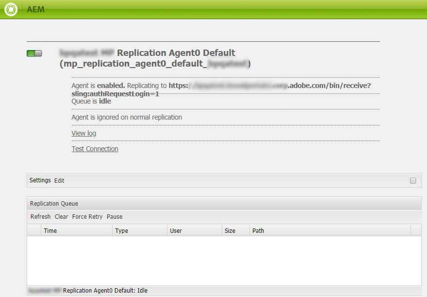

# Brand Portal에서 AEM Assets 구성 {#configure-integration-65}

Adobe Experience Manager Assets 브랜드 포털에서는 승인된 브랜드 자산을 Adobe Experience Manager Assets에서 브랜드 포털에 게시하고 브랜드 포털 사용자에게 배포할 수 있습니다.

AEM Assets은 Brand Portal 임차인 인증을 위해 Adobe Identity Management Services(IMS) 계정 토큰을 조달하는 Adobe 개발자 콘솔을 통해 브랜드 포털로 구성됩니다.

>[!NOTE]
>
>AEM 6.5.4.0 이상에서 Adobe 개발자 콘솔을 통해 Brand Portal에 AEM Assets을 구성할 수 있습니다.
>
>이전에 브랜드 포털은 JWT(JSON Web Token) 교환을 사용하여 IMS 인증 액세스 토큰을 입수하는 레거시 OAuth 게이트웨이를 통해 구성되었습니다.
>
>레거시 OAuth 게이트웨이를 통한 구성은 2020년 4월 6일부터 더 이상 지원되지 않으며, Adobe 개발자 콘솔로 변경됩니다.

>[!TIP]
>
>***기존 고객 전용***
>
>기존 레거시 OAuth 게이트웨이 구성을 계속 사용하는 것이 좋습니다. 기존 OAuth 게이트웨이 구성 문제가 발생하는 경우 기존 구성을 삭제하고 Adobe 개발자 콘솔을 통해 새 구성을 만드십시오.

이 도움말은 다음 두 가지 사용 사례에 대해 설명합니다.

* [새 구성](#configure-new-integration-65):새 브랜드 포털 사용자이고 브랜드 포털로 AEM Assets 작성자 인스턴스를 구성하려면 Adobe 개발자 콘솔을 통해 구성을 만들 수 있습니다.
* [업그레이드 구성](#upgrade-integration-65):기존 OAuth 게이트웨이에 대한 구성이 있는 기존 브랜드 포털 사용자의 경우, 기존 구성을 삭제하고 Adobe 개발자 콘솔을 통해 새 구성을 만드십시오.

제공된 정보는 이 도움말을 읽는 사람이 다음 기술을 잘 알고 있다는 가정을 기반으로 합니다.

* Adobe Experience Manager 및 AEM 패키지 설치, 구성 및 관리.

* Linux 및 Microsoft Windows 운영 체제 사용.

## 전제 조건 {#prerequisites}

Brand Portal을 사용하여 AEM Assets를 구성하려면 다음 항목이 필요합니다.

* 최신 서비스 팩을 통해 AEM Assets 작성자 인스턴스 실행
* 브랜드 포털 테넌트 URL
* Brand Portal 임차인의 IMS 조직에 대한 시스템 관리자 권한이 있는 사용자

[AEM 6.5 다운로드 및 설치](#aemquickstart)

[최신 AEM 서비스 팩 다운로드 및 설치](#servicepack)

### AEM 6.5 다운로드 및 설치 {#aemquickstart}

AEM 작성자 인스턴스를 설정하려면 AEM 6.5가 있어야 합니다. AEM을 실행하지 않은 경우 다음 위치에서 다운로드하십시오.

* 기존 AEM 고객의 경우 [Adobe 라이선스 웹 사이트](http://licensing.adobe.com)에서 AEM 6.5를 다운로드합니다.

* Adobe 파트너인 경우 [Adobe 파트너 교육 프로그램](https://adobe.allegiancetech.com/cgi-bin/qwebcorporate.dll?idx=82357Q)을 사용하여 AEM 6.5를 요청합니다.

AEM을 다운로드한 후 AEM 작성자 인스턴스를 설정하는 방법은 [배포 및 유지 관리](https://docs.adobe.com/content/help/en/experience-manager-65/deploying/deploying/deploy.html#default-local-install)를 참조하십시오.

### AEM 최신 서비스 팩 다운로드 및 설치 {#servicepack}

세부 지침은 다음을 참조하십시오.

* [AEM 6.5 서비스 팩 릴리스 노트](https://docs.adobe.com/content/help/en/experience-manager-65/release-notes/service-pack/sp-release-notes.html)

최신 AEM 패키지 또는 서비스 팩을 찾을 수 없는 경우 **지원 센터에 문의**&#x200B;하십시오.

## 구성 만들기 {#configure-new-integration-65}

브랜드 포털에서 AEM Assets을 구성하려면 Adobe 개발자 콘솔뿐만 아니라 AEM Assets 작성자 인스턴스에도 구성이 필요합니다.

1. AEM Assets에서 IMS 계정을 만들고 공개 인증서(공개 키)를 생성합니다.
1. Adobe 개발자 콘솔에서 Brand Portal 테넌트(조직)에 대한 프로젝트를 만듭니다.
1. 프로젝트에서 공개 키로 API를 구성하여 서비스 계정(JWT) 연결을 만듭니다.
1. 서비스 계정 자격 증명과 JWT 페이로드 정보를 가져옵니다.
1. AEM Assets에서 서비스 계정 자격 증명과 JWT 페이로드를 사용하여 IMS 계정을 구성합니다.
1. AEM Assets에서 IMS 계정 및 브랜드 포털 끝점(조직 URL)을 사용하여 브랜드 포털 클라우드 서비스를 구성합니다.
1. AEM Assets에서 브랜드 포털에 자산을 게시하여 구성을 테스트합니다.

>[!NOTE]
>
>AEM Assets 작성자 인스턴스는 하나의 브랜드 포털 임차인으로만 구성할 수 있습니다.

브랜드 포털에서 처음으로 AEM Assets을 구성하는 경우 나열된 시퀀스에서 다음 단계를 수행하십시오.
1. [공개 인증서 받기](#public-certificate)
1. [서비스 계정(JWT) 연결 만들기](#createnewintegration)
1. [IMS 계정 구성](#create-ims-account-configuration)
1. [클라우드 서비스 구성](#configure-the-cloud-service)
1. [구성 테스트](#test-integration)

### IMS 구성 만들기 {#create-ims-configuration}

IMS 구성은 브랜드 포털 테넌트로 AEM Assets 작성자 인스턴스를 인증합니다.

IMS 구성에는 두 단계가 포함됩니다.

* [공개 인증서 받기](#public-certificate)
* [IMS 계정 구성](#create-ims-account-configuration)

### 공개 인증서 받기 {#public-certificate}

공개 키(인증서)는 Adobe 개발자 콘솔에서 프로필을 인증합니다.

1. AEM Assets 작성자 인스턴스에 로그인합니다. 기본 URL은 `http://localhost:4502/aem/start.html`.

1. **도구**  패널에서 **[!UICONTROL 보안]** > **[!UICONTROL Adobe IMS 구성]**&#x200B;으로 이동합니다.

1. Adobe IMS 구성 페이지에서 **[!UICONTROL 만들기]**&#x200B;를 클릭합니다. **[!UICONTROL Adobe IMS 기술 계정 구성]** 페이지로 리디렉션됩니다. 기본적으로 **인증서** 탭이 열립니다.

1. **[!UICONTROL 클라우드 솔루션]** 드롭다운 목록에서 **[!UICONTROL Adobe 브랜드 포털]**&#x200B;을 선택합니다.

1. **[!UICONTROL 새 인증서 만들기]** 확인란을 선택하고 공개 키에 대해 **별칭**&#x200B;을 지정합니다. 별칭은 공개 키 이름 역할을 합니다.

1. **[!UICONTROL 인증서 만들기]**&#x200B;를 클릭합니다. 그런 다음 **[!UICONTROL 확인]**&#x200B;을 클릭하여 공개 키를 생성합니다.

   

1. **[!UICONTROL 공개 키 다운로드]** 아이콘을 클릭하고 컴퓨터에 공개 키(.crt) 파일을 저장합니다.

   공개 키는 나중에 브랜드 포털 테넌트에 대한 API를 구성하고 Adobe 개발자 콘솔에서 서비스 계정 자격 증명을 생성하는 데 사용됩니다.

   

1. **[!UICONTROL 다음]**&#x200B;을 클릭합니다.

   **계정** 탭에서 Adobe 개발자 콘솔에서 생성된 서비스 계정 자격 증명을 필요로 하는 Adobe IMS 계정이 만들어집니다. 우선은 이 페이지를 열어 두십시오.

   새 탭을 열고 [Adobe 개발자 콘솔에 서비스 계정(JWT) 연결을 만들어](#createnewintegration) IMS 계정을 구성하기 위한 자격 증명과 JWT 페이로드를 가져옵니다.

### 서비스 계정(JWT) 연결 만들기 {#createnewintegration}

Adobe 개발자 콘솔에서 프로젝트 및 API는 브랜드 포털 테넌트(조직) 수준에서 구성됩니다. API를 구성하면 서비스 계정(JWT) 연결이 만들어집니다. 키 쌍(개인 및 공개 키)을 생성하거나 공개 키를 업로드하여 API를 구성하는 두 가지 방법이 있습니다. 브랜드 포털에서 AEM Assets을 구성하려면 AEM Assets에서 공개 키(인증서)를 생성하고 공개 키를 업로드하여 Adobe 개발자 콘솔에서 자격 증명을 만들어야 합니다. 이러한 자격 증명은 AEM Assets에서 IMS 계정을 구성하는 데 필요합니다. IMS 계정이 구성되면 AEM Assets에서 브랜드 포털 클라우드 서비스를 구성할 수 있습니다.

서비스 계정 자격 증명과 JWT 페이로드를 생성하려면 다음 단계를 수행합니다.

1. IMS 조직(Brand Portal 테넌트)에 대한 시스템 관리자 권한으로 Adobe 개발자 콘솔에 로그인합니다. 기본 URL은 [https://www.adobe.com/go/devs_console_ui](https://www.adobe.com/go/devs_console_ui).

   >[!NOTE]
   >
   >오른쪽 상단 모서리에 있는 드롭다운(조직) 목록에서 올바른 IMS 조직(브랜드 포털 임차인)을 선택했는지 확인합니다.

1. **[!UICONTROL 새 프로젝트 만들기]**&#x200B;를 클릭합니다. 조직에 대해 시스템에서 생성된 이름을 가진 빈 프로젝트가 생성됩니다.

   **[!UICONTROL 프로젝트 편집]**&#x200B;을 클릭하여 **[!UICONTROL 프로젝트 제목]** 및 **[!UICONTROL 설명]**&#x200B;을 업데이트하고 **[!UICONTROL 저장]**&#x200B;을 클릭합니다.

1. **[!UICONTROL 프로젝트 개요]** 탭에서 **[!UICONTROL API 추가]**&#x200B;를 클릭합니다.

1. **[!UICONTROL API 추가 창]**&#x200B;에서 **[!UICONTROL AEM 브랜드 포털]**&#x200B;을 선택하고 **[!UICONTROL 다음]**&#x200B;을 클릭합니다.

   AEM Brand Portal 서비스에 대한 액세스 권한이 있는지 확인합니다.

1. **[!UICONTROL API 구성]** 창에서 **[!UICONTROL 공개 키 업로드]**&#x200B;를 클릭합니다. 그런 다음 **[!UICONTROL 파일]**&#x200B;을 선택하고 [공개 인증서](#public-certificate) 받기 섹션에서 다운로드한 공개 키(.crt 파일)를 업로드합니다.

   **[!UICONTROL 다음]**&#x200B;을 클릭합니다.

   

1. 공개 키를 확인하고 **[!UICONTROL 다음]**&#x200B;을 클릭합니다.

1. **[!UICONTROL 자산 브랜드 포털]**&#x200B;을 기본 제품 프로필로 선택하고 **[!UICONTROL 구성된 API 저장]**&#x200B;을 클릭합니다.

   <!-- 
   In Brand Portal, a default profile is created for each organization. The Product Profiles are created in admin console for assigning users to groups (based on the roles and permissions). For configuration with Brand Portal, the OAuth token is created at organization level. Therefore, you must configure the default Product Profile for your organization. 
   -->

   

1. API가 구성되면 API 개요 페이지로 리디렉션됩니다. 왼쪽 탐색 메뉴에서 **[!UICONTROL 자격 증명]** 아래의 **[!UICONTROL 서비스 계정(JWT)]** 옵션을 클릭합니다.

   >[!NOTE]
   >
   >자격 증명을 보고 JWT 토큰 생성, 자격 증명 세부 사항 복사, 클라이언트 암호 검색 등의 작업을 수행할 수 있습니다.

1. **[!UICONTROL 클라이언트 자격 증명]** 탭에서 **[!UICONTROL 클라이언트 ID]**&#x200B;를 복사합니다.

   **[!UICONTROL 클라이언트 암호 검색]**&#x200B;을 클릭하고 **[!UICONTROL 클라이언트 암호 키]**&#x200B;를 복사합니다.

   

1. **[!UICONTROL JWT]** 탭으로 이동하여 **[!UICONTROL JWT 페이로드]** 정보를 복사합니다.

이제 클라이언트 ID(API 키), 클라이언트 암호 및 JWT 페이로드를 AEM Assets에서 [IMS 계정](#create-ims-account-configuration)을(를) 구성할 수 있습니다.

<!--
### Create Adobe I/O integration {#createnewintegration}

Adobe I/O integration generates API Key, Client Secret, and Payload (JWT) which is required in setting up the IMS Account configurations.

1. Login to Adobe I/O Console with system administrator privileges on the IMS organization of the Brand Portal tenant.

   Default URL: [https://console.adobe.io/](https://console.adobe.io/) 

1. Click **[!UICONTROL Create Integration]**.

1. Select **[!UICONTROL Access an API]**, and click **[!UICONTROL Continue]**.

   

1. Create a new integration page opens. 
   
   Select your organization from the drop-down list.

   In **[!UICONTROL Experience Cloud]**, Select **[!UICONTROL AEM Brand Portal]** and click **[!UICONTROL Continue]**. 

   If the Brand Portal option is disabled for you, ensure that you have selected correct organization from the drop-down box above the **[!UICONTROL Adobe Services]** option. If you do not know your organization, contact your administrator.

   

1. Specify a name and description for the integration. Click **[!UICONTROL Select a File from your computer]** and upload the `AEM-Adobe-IMS.crt` file downloaded in the [obtain public certificates](#public-certificate) section.

1. Select the profile of your organization. 

   Or, select the default profile **[!UICONTROL Assets Brand Portal]** and click **[!UICONTROL Create Integration]**. The integration is created.

1. Click **[!UICONTROL Continue to integration details]** to view the integration information. 

   Copy the **[!UICONTROL API Key]** 
   
   Click **[!UICONTROL Retrieve Client Secret]** and copy the Client Secret key.

   

1. Navigate to **[!UICONTROL JWT]** tab, and copy the **[!UICONTROL JWT payload]**.

   The API Key, Client Secret key, and JWT payload information will be used to create IMS account configuration.
-->

### IMS 계정 구성 {#create-ims-account-configuration}

다음 절차를 수행했는지 확인하십시오.

* [공개 인증서 받기](#public-certificate)
* [서비스 계정(JWT) 연결 만들기](#createnewintegration)

IMS 계정을 구성하려면 다음 단계를 수행하십시오.

1. IMS 구성을 열고 **[!UICONTROL 계정]** 탭으로 이동합니다. 공개 인증서](#public-certificate)을(를) 가져오는 동안 페이지를 열어 두었습니다.[

1. IMS 계정에 대한 **[!UICONTROL 제목]**&#x200B;을 지정합니다.

   **[!UICONTROL 인증 서버]** 필드에서 URL을 지정합니다.[https://ims-na1.adobelogin.com/](https://ims-na1.adobelogin.com/).

   [서비스 계정(JWT) 연결](#createnewintegration)을 만드는 동안 복사한 **[!UICONTROL API 키]** 필드, **[!UICONTROL 클라이언트 암호]** 및 **[!UICONTROL 페이로드]**(JWT 페이로드)에 클라이언트 ID를 지정합니다.

   **[!UICONTROL 만들기]**&#x200B;를 클릭합니다.

   IMS 계정이 구성되었습니다.

   

1. IMS 계정 구성을 선택하고 **[!UICONTROL 상태 확인]**&#x200B;을 클릭합니다.

   대화 상자에서 **[!UICONTROL 확인]**&#x200B;을 클릭합니다. 구성이 성공하면 *토큰이 성공적으로 검색되었습니다.*&#x200B;라는 메시지가 나타납니다.

   

>[!CAUTION]
>
>IMS 구성은 하나만 있어야 합니다.
>
>IMS 구성이 상태 검사를 통과하는지 확인합니다. 구성이 상태 검사를 통과하지 않으면 구성이 잘못된 것입니다. 이 구성을 삭제하고 유효한 새 구성을 만들어야 합니다.

### 클라우드 서비스 구성 {#configure-the-cloud-service}

브랜드 포털 클라우드 서비스를 구성하려면 다음 단계를 수행하십시오.

1. AEM Assets 작성자 인스턴스에 로그인합니다.

1. **도구**  패널에서 **[!UICONTROL 클라우드 서비스]** > **[!UICONTROL AEM Brand Portal]**&#x200B;로 이동합니다.

1. Brand Portal 구성 페이지에서 **[!UICONTROL 만들기]**&#x200B;를 클릭합니다.

1. 구성에 대한 **[!UICONTROL 제목]**&#x200B;을 지정합니다.

   [IMS 계정을 구성](#create-ims-account-configuration)하는 동안 만든 IMS 구성을 선택합니다.

   **[!UICONTROL 서비스 URL]** 필드에서 브랜드 포털 임차인(조직) URL을 지정합니다.

   

1. **[!UICONTROL 저장 후 닫기]**&#x200B;를 클릭합니다. 클라우드 구성이 만들어집니다.

   이제 AEM Assets 작성자 인스턴스가 Brand Portal 테넌트로 구성됩니다.

### 구성 테스트 {#test-integration}

다음 단계를 수행하여 구성을 확인합니다.

1. AEM Assets 클라우드 인스턴스에 로그인합니다.

1. **도구**  패널에서 **[!UICONTROL 배포]** > **[!UICONTROL 복제]**&#x200B;로 이동합니다.

   

1. 복제 페이지에서 **[!UICONTROL 작성자의 에이전트]**&#x200B;를 클릭합니다.

   

   브랜드 포털 테넌트에 대해 만들어진 4개의 복제 에이전트를 볼 수 있습니다.

   브랜드 포털 테넌트의 복제 에이전트를 찾아 복제 에이전트 URL을 클릭합니다.

   

   >[!NOTE]
   >
   >복제 에이전트가 동시에 작동하여 작업 분포를 동일하게 공유하므로 게시 속도가 원래 속도보다 4배 더 빨라집니다. 클라우드 서비스가 구성된 후에는 여러 자산의 병렬 게시를 활성화하기 위해 기본적으로 활성화된 복제 에이전트를 활성화하는 데 추가 구성이 필요하지 않습니다.

1. AEM Assets과 브랜드 포털 간의 연결을 확인하려면 **[!UICONTROL 연결 테스트]** 아이콘을 클릭합니다.

   

   *테스트 패키지가*&#x200B;에 성공적으로 전달되었다는 메시지가 나타납니다.

   

1. 4개의 복제 에이전트 모두에서 테스트 결과를 확인합니다.

   >[!NOTE]
   >
   >자산(실행 중인 큐)의 복제가 실패할 수 있으므로 복제 에이전트를 비활성화하지 마십시오.
   >
   >시간 초과 오류를 방지하도록 4개의 복제 에이전트가 모두 구성되어 있는지 확인합니다. 브랜드 포털](https://docs.adobe.com/content/help/en/experience-manager-brand-portal/using/publish/troubleshoot-parallel-publishing.html#connection-timeout)에 동시 게시 시 문제 해결을 참조하십시오.[

이제 다음을 수행할 수 있습니다.

* [AEM Assets에서 Brand Portal에 자산 게시](../assets/brand-portal-publish-assets.md)
* [브랜드 포털에서 AEM Assets](https://docs.adobe.com/content/help/ko-KR/experience-manager-brand-portal/using/asset-sourcing-in-brand-portal/brand-portal-asset-sourcing.html)  - 브랜드 포털의 자산 소싱에 자산 게시
* [AEM Assets의 폴더를 Brand Portal에 게시](../assets/brand-portal-publish-folder.md)
* [AEM Assets의 컬렉션을 Brand Portal에 게시](../assets/brand-portal-publish-collection.md)
* [사전 설정, 스키마 및 패싯을 Brand Portal에 게시](https://docs.adobe.com/content/help/en/experience-manager-brand-portal/using/publish/publish-schema-search-facets-presets.html)
* [태그를 Brand Portal에 게시](https://docs.adobe.com/content/help/en/experience-manager-brand-portal/using/publish/brand-portal-publish-tags.html)

자세한 내용은 [브랜드 포털 설명서](https://docs.adobe.com/content/help/ko-KR/experience-manager-brand-portal/using/home.html)를 참조하십시오.

## 구성 업그레이드 {#upgrade-integration-65}

나열된 시퀀스에서 다음 단계를 수행하여 기존 구성을 Adobe 개발자 콘솔로 업그레이드합니다.
1. [실행 중인 작업 확인](#verify-jobs)
1. [기존 구성 삭제](#delete-existing-configuration)
1. [구성 만들기](#configure-new-integration-65)

### 실행 중인 작업 확인 {#verify-jobs}

수정하기 전에 AEM Assets 작성자 인스턴스에서 게시 작업이 실행되고 있지 않은지 확인합니다. 이러한 경우 4개의 복제 에이전트 모두에서 활성 작업의 상태를 확인하고 대기열이 유휴 상태인지 확인할 수 있습니다.

1. AEM Assets 작성자 인스턴스에 로그인합니다.

1. **도구**  패널에서 **[!UICONTROL 배포]** > **[!UICONTROL 배포 복제]**&#x200B;로 이동합니다.

1. 복제 페이지에서 **[!UICONTROL 작성자의 에이전트]**&#x200B;를 클릭합니다.

   

1. Brand Portal 임차인의 복제 에이전트를 찾습니다.

   모든 복제 에이전트에 대해 **큐가 유휴 상태**&#x200B;인지, 활성 상태인 게시 작업이 없는지 확인합니다.

   

### 기존 구성 삭제 {#delete-existing-configuration}

기존 구성을 삭제하는 동안 다음 검사 목록을 실행해야 합니다.
* 4개의 복제 에이전트 모두 삭제
* 브랜드 포털 클라우드 서비스 삭제
* MAC 사용자 삭제

1. AEM Assets 작성자 인스턴스에 로그인하고 CRX Lite를 관리자로 엽니다. 기본 URL은  `http://localhost:4502/crx/de/index.jsp`.

1. `/etc/replications/agents.author`로 이동하고 Brand Portal 임차인의 4개 복제 에이전트를 모두 삭제합니다.

   

1. `/etc/cloudservices/mediaportal`으로 이동하여 브랜드 포털 클라우드 서비스 구성을 삭제합니다.

   

1. `/home/users/mac`로 이동하고 Brand Portal 임차인의 **MAC 사용자**&#x200B;를 삭제합니다.

   

이제 AEM 6.5 작성자 인스턴스에서 Adobe 개발자 콘솔을 통해 [구성](#configure-new-integration-65)을 만들 수 있습니다.

<!--
   Comment Type: draft

   <li> </li>
   -->

<!--
   Comment Type: draft

   <li>Step text</li>
   -->

