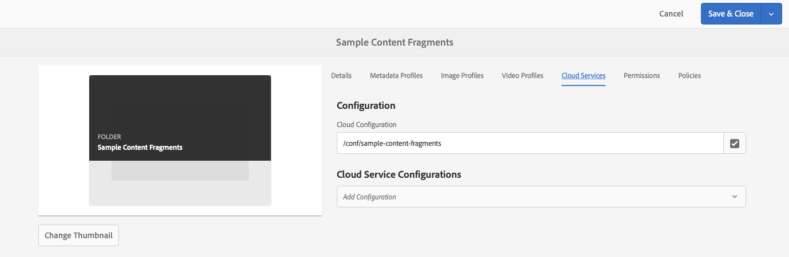

# 콘텐츠 조각 - 구성 브라우저{#content-fragments-configuration-browser}

AEM의 강력한 Headless 게재 기능을 활용하기 위해 구성 브라우저에서 특정 콘텐츠 조각 기능을 활성화하는 방법에 대해 알아봅니다.

## 인스턴스에 대해 콘텐츠 조각 기능 활성화 {#enable-content-fragment-functionality-instance}

콘텐츠 조각을 사용하기 전에 **구성 브라우저**&#x200B;를 사용하여 다음을 활성화해야 합니다.

* **콘텐츠 조각 모델** - 필수
* **GraphQL 지속 쿼리** - 선택 사항

>[!CAUTION]
>
>**콘텐츠 조각 모델**&#x200B;을 활성화하지 않는 경우
>
>* 새 모델을 만들 때 **만들기** 옵션을 사용할 수 없습니다.
>* [사이트 구성을 선택하여 관련 끝점을 생성](/help/assets/content-fragments/graphql-api-content-fragments.md#enabling-graphql-endpoint)할 수 없습니다.

콘텐츠 조각 기능 활성화하려면 다음 작업을 수행해야 합니다.

* 구성 브라우저를 통해 콘텐츠 조각 기능을 사용할 수 있도록 설정
* 에셋 폴더에 구성 적용

### 구성 브라우저에서 콘텐츠 조각 기능 활성화 {#enable-content-fragment-functionality-in-configuration-browser}

[특정 콘텐츠 조각 기능을 사용](#creating-a-content-fragment-model)하려면 먼저 **구성 브라우저**&#x200B;를 통해 이를 **활성화해야 합니다**.

>[!NOTE]
>
>또한 자세한 내용은 [구성 브라우저](/help/sites-administering/configurations.md#using-configuration-browser)를 참조하십시오.

1. **도구**, **일반**&#x200B;으로 이동한 다음 **구성 브라우저**&#x200B;를 엽니다.

1. **만들기**&#x200B;를 사용하여 대화 상자를 열고 여기에서

   1. **제목**&#x200B;을 지정합니다.
   1. 사용을 활성화하려면 다음을 선택합니다.
      * **콘텐츠 조각 모델**
      * **GraphQL 지속 쿼리**

      

1. **만들기**&#x200B;를 선택하여 정의를 저장합니다.

<!-- 1. Select the location appropriate to your website. -->

### 에셋 폴더에 구성 적용 {#apply-the-configuration-to-your-assets-folder}

구성 시 **글로벌** 가 콘텐츠 조각 기능에 대해 활성화된 후 모든 에셋 폴더에 적용됩니다.

비슷한 에셋 폴더와 함께 다른 구성(전역 제외)을 사용하려면 연결을 정의해야 합니다. This is done by selecting the appropriate **Configuration** in the **Cloud Services** tab of the **Folder Properties** of the appropriate folder.

