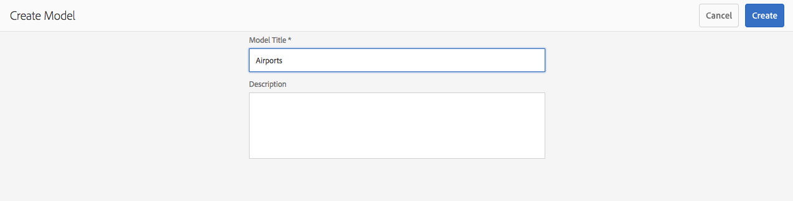

# 컨텐츠 조각 모델{#content-fragment-models}

컨텐츠 조각 모델은 [컨텐츠 조각](/help/assets/content-fragments/content-fragments.md)에 대한 컨텐츠 구조를 정의합니다.

## 컨텐츠 조각 모델 활성화 {#enable-content-fragment-models}

>[!CAUTION]
>
>**컨텐츠 조각 모델**&#x200B;을 활성화하지 않으면 새 모델을 만드는 데 **만들기** 옵션을 사용할 수 없습니다.

컨텐츠 조각 모델을 활성화하려면 필요한 단계가 있습니다.

* [구성 브라우저](/help/sites-administering/configurations.md)에서 컨텐츠 조각 모델을 사용할 수 있습니다.
* 자산 폴더에 구성 적용

### 구성 관리자에서 컨텐츠 조각 모델을 사용할 수 있도록 설정 {#enable-content-fragment-models-in-configuration-manager}

[새 컨텐츠 조각 모델을 생성](#creating-a-content-fragment-model)하려면 먼저 구성 관리자를 사용하여 컨텐츠 조각 모델을 활성화&#x200B;**해야 합니다**.

>[!CAUTION]
>
>하위 구성(구성 내에 중첩된 구성)은 컨텐츠 조각에서 사용할 수 없습니다.

1. **도구**, **일반**&#x200B;으로 이동한 후 **Configuration Browser**&#x200B;를 엽니다.

1. **만들기**&#x200B;를 사용하여 대화 상자를 열고 여기에서

   1. **제목**&#x200B;을 지정합니다.
   1. **컨텐츠 조각 모델**&#x200B;을 선택하여 사용할 수 있도록 설정합니다.

   

1. **만들기**&#x200B;를 선택하여 정의를 저장합니다.

<!-- 1. Select the location appropriate to your website. -->

### 자산 폴더에 구성 적용 {#apply-the-configuration-to-your-assets-folder}

컨텐츠 조각 모델에 대해 구성 **전역** 이 활성화되면 사용자가 만드는 모든 모델을 자산 폴더에서 사용할 수 있습니다.

비교 가능한 자산 폴더와 함께 다른 구성(즉, 전역 제외)을 사용하려면 연결을 정의해야 합니다. 이 작업은 적절한 폴더의 **폴더 속성**&#x200B;에서 **클라우드 서비스** 탭에 있는 **구성**&#x200B;을 사용하여 수행됩니다.

## 컨텐츠 조각 모델 만들기 {#creating-a-content-fragment-model}

1. **도구**, **자산**&#x200B;으로 이동한 후 **컨텐츠 조각 모델**&#x200B;을 엽니다.
1. [구성](#enable-content-fragment-models)에 적절한 폴더로 이동합니다.
1. **만들기**&#x200B;를 사용하여 마법사를 엽니다.

   >[!CAUTION]
   >
   >[컨텐츠 조각 모델 사용이 활성화되지 않은](#enable-content-fragment-models) 경우 **만들기** 옵션을 사용할 수 없습니다.

1. **모델 제목**&#x200B;을 지정합니다. 필요한 경우 **설명**&#x200B;을 추가할 수도 있습니다.

   

1. **만들기**&#x200B;를 사용하여 빈 모델을 저장합니다. 작업의 성공을 나타내는 메시지가 표시되면 **열기**&#x200B;를 선택하여 모델을 즉시 편집하거나 **완료**&#x200B;를 선택하여 콘솔로 돌아갈 수 있습니다.

## 컨텐츠 조각 모델 정의 {#defining-your-content-fragment-model}

컨텐츠 조각 모델은 결과 컨텐츠 조각의 구조를 효과적으로 정의합니다. 모델 편집기를 사용하여 필수 필드를 추가하고 구성할 수 있습니다.

>[!CAUTION]
>
>기존 컨텐츠 조각 모델을 편집하면 종속된 조각이 영향을 받을 수 있습니다.

1. **도구**, **자산**&#x200B;으로 이동한 후 **컨텐츠 조각 모델**&#x200B;을 엽니다.

1. 컨텐츠 조각 모델을 포함하는 폴더로 이동합니다.
1. **편집**&#x200B;에 필요한 모델을 엽니다. 빠른 작업을 사용하거나, 모델을 선택한 후 도구 모음에서 작업을 선택하십시오.

   모델 편집기를 열면 다음과 같이 표시됩니다.

   * 왼쪽: 이미 정의된 필드
   * 오른쪽: 필드를 만드는 데 사용할 수 있는 **데이터 유형**(필드가 만들어지면 사용할 **속성**)

   >[!NOTE]
   >
   >필드가 **필수**&#x200B;이면 왼쪽 창에 표시되는 **레이블**&#x200B;이 지정된 레이블은 별표(*****)로 표시됩니다.

   

1. **필드를 추가하려면**

   * 필수 데이터 유형을 필드에 필요한 위치로 드래그합니다.

   

   * 모델에 필드가 추가되면 오른쪽 패널에 그 특정 데이터 유형에 대해 정의할 수 있는 **속성**&#x200B;이 표시됩니다. 여기에서 해당 필드에 필요한 사항을 정의할 수 있습니다. 예:

   

   >[!NOTE]
   데이터 유형 **여러 줄 텍스트**&#x200B;의 경우 **기본 유형**&#x200B;을 다음 중 하나로 정의할 수 있습니다.
   * **리치 텍스트**

   * **Markdown**

   * **일반 텍스트**

   지정하지 않으면 이 필드에 기본값인 **리치 텍스트**&#x200B;가 사용됩니다.
   컨텐츠 조각 모델의 **기본 유형** 변경은 해당 조각을 편집기에서 열고 저장한 후에 기존 관련 컨텐츠 조각에만 적용됩니다.

1. **필드를 제거하려면**

   필요한 필드를 선택한 후 휴지통 아이콘을 클릭/탭합니다. 작업을 확인하는 메시지가 나타납니다.

   

1. 모든 필수 필드를 추가하고 속성을 정의한 후 **저장**&#x200B;을 사용하여 정의를 유지합니다. 예:

   

## 컨텐츠 조각 모델 삭제 {#deleting-a-content-fragment-model}

>[!CAUTION]
컨텐츠 조각 모델을 삭제하면 종속된 조각이 영향을 받을 수 있습니다.

컨텐츠 조각 모델을 삭제하려면

1. **도구**, **자산**&#x200B;으로 이동한 후 **컨텐츠 조각 모델**&#x200B;을 엽니다.

1. 컨텐츠 조각 모델을 포함하는 폴더로 이동합니다.
1. 모델을 선택한 후 도구 모음에서 **삭제**&#x200B;를 클릭합니다.

   >[!NOTE]
   참조되는 모델의 경우 경고가 표시됩니다. 적절하게 조치하십시오.

## 컨텐츠 조각 모델 게시 {#publishing-a-content-fragment-model}

컨텐츠 조각 모델은 종속된 컨텐츠 조각이 게시될 때/게시되기 전에 게시해야 합니다.

컨텐츠 조각 모델을 게시하려면

1. **도구**, **자산**&#x200B;으로 이동한 후 **컨텐츠 조각 모델**&#x200B;을 엽니다.

1. 컨텐츠 조각 모델을 포함하는 폴더로 이동합니다.
1. 모델을 선택한 후 도구 모음에서 **게시**&#x200B;를 클릭합니다.

   >[!NOTE]
   모델이 아직 게시되지 않은 컨텐츠 조각을 게시하는 경우 선택 목록에 이것이 표시되고 모델이 조각과 함께 게시됩니다.

