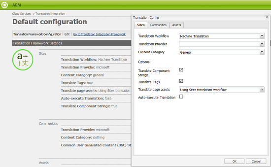
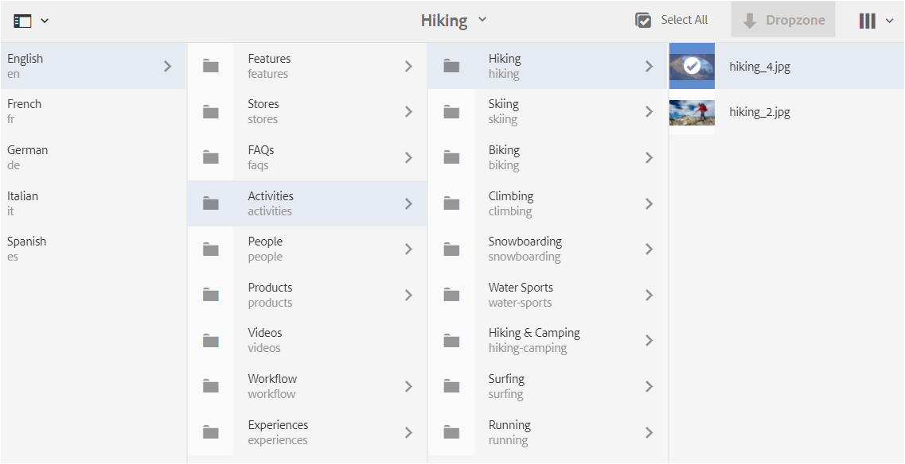
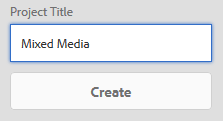

# 컨텐츠 조각에 대한 번역 프로젝트 만들기 {#creating-translation-projects-for-content-fragments}

자산 외에도 Adobe Experience Manager(AEM) 자산은 [컨텐츠 조각](/help/assets/content-fragments/content-fragments.md)(변형 포함)에 대한 언어 복사 워크플로우를 지원합니다. 컨텐츠 조각에서 언어 복사 워크플로우를 실행하려면 추가로 최적화할 필요가 없습니다. 각 워크플로우에서 전체 컨텐츠 조각이 번역을 위해 전송됩니다.

컨텐츠 조각에서 실행할 수 있는 워크플로우 유형은 자산에 대해 실행하는 워크플로우 유형과 정확하게 유사합니다. 또한 각 워크플로우 유형 내에서 사용할 수 있는 옵션은 자산에 대한 해당 워크플로우 유형 아래에서 사용할 수 있는 옵션과 일치합니다.

컨텐츠 조각에서 다음 유형의 언어 복사 워크플로우를 실행할 수 있습니다.

**작성 및 번역**

이 워크플로우에서 번역될 컨텐츠 조각은 번역할 언어의 언어 루트로 복사됩니다. 또한 선택한 옵션에 따라 프로젝트 콘솔에서 컨텐츠 조각에 대한 번역 프로젝트가 생성됩니다. 설정에 따라 번역 프로젝트를 수동으로 시작하거나 번역 프로젝트를 만드는 즉시 자동으로 실행할 수 있습니다.

**언어 복사 업데이트**

소스 컨텐츠 조각을 업데이트하거나 수정할 때 해당 로케일/언어 특정 컨텐츠 조각에 대한 재번역 작업이 필요합니다. 업데이트 언어 사본 워크플로우에서는 추가 컨텐츠 그룹을 변환할 수 있으며 특정 로케일에 대한 언어 복사본에 포함할 수 있습니다. 이 경우 번역된 컨텐츠 조각은 이전에 번역된 컨텐츠 조각을 이미 포함하는 대상 폴더에 추가됩니다.

## 워크플로 {#create-and-translate-workflow} 만들기 및 번역

만들기 및 번역 워크플로에는 다음 옵션이 포함됩니다. 각 옵션과 연관된 절차적 단계는 자산에 대한 해당 옵션과 연관된 절차입니다.

* 구조만 만들기:절차 단계는 [자산](translation-projects.md#create-structure-only)에 대해서만 구조 만들기를 참조하십시오.
* 새 번역 프로젝트 만들기:절차 단계는 [자산](translation-projects.md#create-a-new-translation-project)에 대한 새 번역 프로젝트 만들기를 참조하십시오.
* 기존 번역 프로젝트에 추가:절차 단계는 [자산](translation-projects.md#add-to-existing-translation-project)에 대한 기존 번역 프로젝트에 추가를 참조하십시오.

## 언어 사본 업데이트 워크플로 {#update-language-copies-workflow}

언어 사본 업데이트 작업 과정에는 다음 옵션이 포함됩니다. 각 옵션과 연관된 절차적 단계는 자산에 대한 해당 옵션과 연관된 절차입니다.

* 새 번역 프로젝트 만들기:절차 단계는 [자산](translation-projects.md#create-a-new-translation-project)(업데이트 워크플로)에 대한 새 번역 프로젝트 만들기를 참조하십시오.
* 기존 번역 프로젝트에 추가:절차 단계는 [자산](translation-projects.md#add-to-existing-translation-project)(업데이트 워크플로)에 대한 기존 번역 프로젝트에 추가를 참조하십시오.

에셋에 대한 임시 복사본을 만드는 방법과 유사한 조각에 대한 임시 언어 사본을 만들 수도 있습니다. 자세한 내용은 [자산](translation-projects.md#creating-temporary-language-copies)에 대한 임시 언어 사본 만들기를 참조하십시오.

## 혼합 미디어 조각 번역 중 {#translating-mixed-media-fragments}

AEM에서는 다양한 유형의 미디어 에셋 및 컬렉션을 포함하는 컨텐츠 조각을 변환할 수 있습니다. 인라인 자산을 포함하는 컨텐츠 조각을 번역할 경우 이러한 자산의 번역된 사본이 대상 언어 루트 아래에 저장됩니다.

컨텐츠 조각에 컬렉션이 포함된 경우 컬렉션 내의 자산은 컨텐츠 조각과 함께 변환됩니다. 번역된 에셋 사본은 소스 언어 루트 아래의 소스 에셋의 실제 위치와 일치하는 위치의 해당 대상 언어 루트 내에 저장됩니다.

혼합 미디어가 포함된 컨텐츠 조각을 번역할 수 있도록 하려면 먼저 기본 번역 프레임워크를 편집하여 콘텐츠 조각과 연결된 인라인 에셋 및 컬렉션을 번역할 수 있도록 합니다.

1. AEM 로고를 클릭/탭하고 **[!UICONTROL 도구 > 배포 > Cloud Services]**&#x200B;로 이동합니다.
1. **[!UICONTROL Adobe Marketing Cloud]**&#x200B;에서 **[!UICONTROL 번역 통합]**&#x200B;을 찾아 **[!UICONTROL 구성 표시]**&#x200B;를 클릭/탭합니다.

   

1. 사용 가능한 구성 목록에서 **[!UICONTROL 기본 구성(번역 통합 구성)]**&#x200B;을 클릭/탭하여 **[!UICONTROL 기본 구성]** 페이지를 엽니다.

   

1. 도구 모음에서 **[!UICONTROL 편집]**&#x200B;을 클릭하여 **[!UICONTROL 번역 구성]** 대화 상자를 표시합니다.

   

1. **[!UICONTROL 자산]** 탭으로 이동하고 **[!UICONTROL 인라인 미디어 자산 및 관련 컬렉션]**&#x200B;을 **[!UICONTROL 콘텐츠 조각 자산 번역]** 목록에서 선택합니다. **[!UICONTROL 확인]**&#x200B;을 클릭/탭하여 변경 내용을 저장합니다.

   

1. 영어 루트 폴더 내에서 컨텐츠 조각을 엽니다.

   

1. **[!UICONTROL 자산 삽입]** 아이콘을 클릭/탭합니다.

   

1. 자산을 컨텐츠 조각에 삽입합니다.

   

1. **[!UICONTROL 콘텐츠 연결]** 아이콘을 클릭/탭합니다.

   

1. **[!UICONTROL 콘텐츠 연결]**&#x200B;을 클릭/탭합니다.

   

1. 컬렉션을 선택하고 이를 컨텐츠 조각에 포함합니다. **[!UICONTROL 저장]**&#x200B;을 클릭/탭합니다.

   

1. 컨텐츠 조각을 선택하고 **[!UICONTROL GlobalNav]** 아이콘을 클릭/탭합니다.
1. 메뉴에서 **[!UICONTROL 참조]**&#x200B;를 선택하여 **[!UICONTROL 참조]** 창을 표시합니다.

   

1. 언어 사본을 표시하려면 **[!UICONTROL 복사]**&#x200B;에서 **[!UICONTROL 언어 사본]**&#x200B;을 클릭/탭합니다.

   

1. 패널 아래쪽에 있는 **[!UICONTROL 만들기 및 번역]**&#x200B;을 클릭/탭하여 **[!UICONTROL 만들기 및 번역]** 대화 상자를 표시합니다.

   

1. **[!UICONTROL Target 언어]** 목록에서 대상 언어를 선택합니다.

   

1. **[!UICONTROL 프로젝트]** 목록에서 번역 프로젝트 유형을 선택합니다.

   

1. **[!UICONTROL 프로젝트 제목]** 상자에 프로젝트의 제목을 지정한 다음 **만들기**&#x200B;를 클릭/탭합니다.

   

1. **[!UICONTROL 프로젝트]** 콘솔로 이동하고 만든 번역 프로젝트의 프로젝트 폴더를 엽니다.

   

1. 프로젝트 타일을 클릭/탭하여 프로젝트 세부 사항 페이지를 엽니다.

   

1. 번역 작업 타일에서 변환할 자산 수를 확인합니다.
1. **[!UICONTROL 번역 작업]** 타일에서 번역 작업을 시작합니다.

   

1. 번역 작업 타일 맨 아래의 줄임표를 클릭하여 번역 작업의 상태를 표시합니다.

   

1. 컨텐츠 조각을 클릭/탭하여 번역된 관련 자산의 경로를 확인합니다.

   

1. 컬렉션 콘솔에서 컬렉션의 언어 사본을 검토하십시오.

   

   컬렉션의 콘텐츠만 번역됩니다. 컬렉션 자체는 번역되지 않습니다.

1. 번역된 관련 자산의 경로로 이동합니다. 번역된 에셋이 대상 언어 루트 아래에 저장되는지 확인합니다.

   

1. 콘텐츠 조각과 함께 번역되는 컬렉션 내의 자산으로 이동합니다. 번역된 에셋 사본이 적절한 대상 언어 루트에 저장되는지 확인합니다.

   

   >[!NOTE]
   >
   >기존 프로젝트에 컨텐츠 조각을 추가하거나 업데이트 워크플로우를 수행하는 절차는 해당 자산에 대한 절차와 유사합니다. 이러한 절차에 대한 지침은 자산에 대해 설명된 절차를 참조하십시오.

