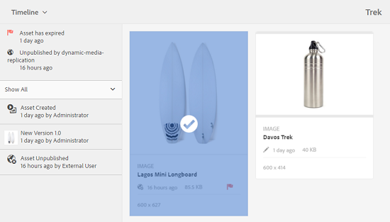
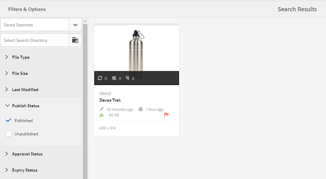

# 자산용 Digital Rights Management {#digital-rights-management-in-assets}

| 버전 | 문서 링크 |
| -------- | ---------------------------- |
| AEM as a Cloud Service | [여기 클릭](https://experienceleague.adobe.com/docs/experience-manager-cloud-service/content/assets/manage/drm.html?lang=en) |
| AEM 6.5 | 이 문서 |

디지털 에셋은 종종 사용 약관 및 기간을 지정하는 라이선스와 연결됩니다. 이유 [!DNL Adobe Experience Manager Assets] 와 완전히 통합되었습니다. [!DNL Experience Manager] 플랫폼에서 에셋 만료 정보 및 에셋 상태를 효율적으로 관리할 수 있습니다. 라이선스 정보를 자산과 연결할 수도 있습니다.

## 에셋 만료 {#asset-expiration}

에셋 만료는 에셋에 대한 라이선스 요구 사항을 적용할 수 있는 효과적인 방법입니다. 게시된 에셋이 만료되면 게시 취소되므로 라이센스 위반 가능성을 방지할 수 있습니다. 관리자 권한이 없는 사용자는 만료된 에셋을 편집, 복사, 이동, 게시 및 다운로드할 수 없습니다.

에서 에셋의 만료 상태를 볼 수 있습니다. [!DNL Assets] 카드 보기와 목록 보기 모두에서 콘솔을 엽니다.

*그림: 목록 보기에서 [!UICONTROL 상태] 열에 다음 항목이 표시됨 [!UICONTROL 만료됨] 배너.*

에서 에셋의 만료 상태를 볼 수 있습니다. [!UICONTROL 타임라인] 왼쪽 레일에서.

>[!NOTE]
>
>시간대가 다른 사용자에 대해 에셋의 만료 날짜가 다르게 표시됩니다.

에서 에셋의 만료 상태를 볼 수도 있습니다. **[!UICONTROL 참조]** 레일. 복합 에셋과 참조된 하위 에셋, 컬렉션 및 프로젝트 간의 에셋 만료 상태 및 관계를 관리합니다.

1. 참조 웹 페이지 및 복합 자산을 보려는 자산으로 이동합니다.
1. 에셋을 선택하고 열기 **[!UICONTROL 참조]** 왼쪽 레일에서. 만료된 자산의 경우 [!UICONTROL 참조] 레일에 만료 상태 표시 **[!UICONTROL 자산이 만료되었습니다.]** 맨 위에

   

   자산이 하위 자산으로 만료된 경우 [!UICONTROL 참조] 레일에 상태 표시 **[!UICONTROL 자산이 만료된 하위 자산]**.

   

### 만료된 에셋 검색 {#search-expired-assets}

검색 패널에서 만료된 하위 에셋을 포함하여 만료된 에셋을 검색할 수 있습니다.

1. 다음에서 [!DNL Assets] 콘솔을 클릭하고 **[!UICONTROL 검색]** 을 클릭하여 Omnisearch 상자를 표시합니다.

1. Omnisearch 상자에 커서를 놓고 `Enter` 키를 눌러 검색 결과 페이지를 표시합니다.
1. 왼쪽 레일에서 검색 패널을 엽니다. 다음을 클릭합니다. **[!UICONTROL 만료 상태]** 옵션을 사용하여 확장합니다.

   

1. 선택 **[!UICONTROL 만료됨]**. 검색 결과를 필터링하면 만료된 에셋만 표시됩니다.

다음을 선택할 때 **[!UICONTROL 만료됨]** 옵션, [!DNL Assets] 콘솔에는 복합 에셋에서 참조하는 만료된 에셋 및 하위 에셋만 표시됩니다. 만료된 하위 에셋을 참조하는 복합 에셋은 하위 에셋이 만료된 직후에 표시되지 않습니다. 대신 다음 뒤에 표시됩니다. [!DNL Experience Manager] 은(는) 다음에 스케줄러가 실행될 때 만료된 하위 에셋을 참조함을 감지합니다.

게시된 에셋의 만료 날짜를 현재 스케줄러 주기보다 빠른 날짜로 수정하는 경우 스케줄은 다음에 이 에셋을 실행할 때 만료된 에셋으로 계속 감지하고 상태에 맞게 을 반영합니다.

또한 사소한 결함이나 오류로 인해 스케줄러가 현재 주기에서 만료된 에셋을 감지할 수 없는 경우 스케줄러는 다음 주기에서 이러한 에셋을 다시 검사하고 만료된 상태를 감지합니다.

활성화하려면 [!DNL Assets] 참조 복합 에셋을 만료된 하위 에셋과 함께 표시하려면 콘솔에서 다음을 구성하십시오. **[!UICONTROL Adobe CQ DAM 만료 알림]** 워크플로우 [!DNL Experience Manager] 구성 관리자.

1. 열기 [!DNL Experience Manager] 구성 관리자.
1. 선택 **[!UICONTROL Adobe CQ DAM 만료 알림]**. 기본적으로, **[!UICONTROL 시간 기반 스케줄러]** 이 옵션을 선택하면 특정 시간에 자산이 하위 자산으로 만료되었는지 확인하기 위해 작업을 예약합니다. 작업이 완료되면 만료된 하위 에셋 및 참조된 에셋이 검색 결과에 만료된 것으로 표시됩니다.

1. To run the job periodically, clear the **[!UICONTROL Time Based Scheduler Rule]** field and modify the time in seconds in the **[!UICONTROL Periodic Scheduler]** field. 예: 표현식 예 `0 0 0 * * ?` 00시에 작업을 트리거합니다.
1. 선택 **[!UICONTROL 이메일 보내기]** 에셋이 만료되면 이메일을 수신합니다.

   >[!NOTE]
   >
   >에셋 생성자(특정 에셋을에 업로드하는 사람)만 [!DNL Assets]) 에셋이 만료되면 이메일을 수신합니다. 다음을 참조하십시오 [이메일 알림 구성 방법](/help/sites-administering/notification.md) 전반에서 이메일 알림 구성에 대한 자세한 내용은 [!DNL Experience Manager] 레벨.

1. 다음에서 **[!UICONTROL 초 단위의 이전 알림]** 필드에서 만료와 관련된 알림을 받으려는 경우 에셋이 만료되기 전의 시간을 초 단위로 지정합니다. 에셋 생성자는 에셋이 만료되기 전에 지정된 시간 이후에 만료될 것임을 알리는 메시지를 수신합니다. 자산이 만료된 후 만료를 확인하는 다른 알림을 받게 됩니다. 또한 만료된 에셋은 비활성화됩니다.

1. **[!UICONTROL 저장]**&#x200B;을 클릭합니다.

## 자산 상태 {#asset-states}

다음 [!DNL Assets] 콘솔에는 에셋에 대한 다양한 상태가 표시될 수 있습니다. 특정 에셋의 현재 상태에 따라 해당 카드 보기에는 만료됨, 게시됨, 승인됨, 거부됨 등과 같은 에셋 상태를 설명하는 레이블이 표시됩니다.

1. 다음에서 [!DNL Assets] 사용자 인터페이스에서 자산을 선택합니다.
1. 클릭 **[!UICONTROL 게시]** 을 클릭합니다. 표시되지 않는 경우 **게시** 도구 모음에서 를 클릭합니다 **[!UICONTROL 자세히]** 도구 모음에서 를 찾아 **[!UICONTROL 게시]**  옵션을 선택합니다.
1. 선택 **[!UICONTROL 게시]** 메뉴에서 확인 대화 상자를 닫습니다.
1. 선택 모드를 종료합니다. 에셋의 게시 상태는 카드 보기의 에셋 썸네일 하단에 나타납니다. 목록 보기의 게시됨 열에는 에셋이 게시된 시간이 표시됩니다.

   

1. 자산 세부 사항 페이지를 표시하려면 [!DNL Assets] 인터페이스에서 에셋을 선택하고 **[!UICONTROL 속성]** .

1. 다음에서 [!UICONTROL 고급] 탭에서 에셋의 만료 날짜를 설정합니다. **[!UICONTROL 만료]** 필드.

   

   *그림: [!UICONTROL 고급] 에셋의 탭 [!UICONTROL 속성] 에셋 만료를 설정할 페이지입니다.*

1. 클릭 **[!UICONTROL 저장]** 그런 다음 을 클릭합니다. **[!UICONTROL 닫기]** 자산 콘솔을 표시합니다.
1. 에셋의 게시 상태는 카드 보기의 에셋 썸네일 하단에 만료됨 상태를 나타냅니다. 목록 보기에서 에셋의 상태는 다음과 같이 표시됩니다. **[!UICONTROL 만료됨]**.

   

1. 다음에서 [!DNL Assets] 콘솔에서 폴더를 선택하고 폴더에 검토 작업을 만듭니다.
1. 리뷰 작업에서 에셋을 검토하고 승인/거부한 다음 **[!UICONTROL 완료]**.
1. 검토 작업을 생성한 폴더로 이동합니다. 승인/거부한 에셋의 상태가 카드 보기의 맨 아래에 표시됩니다. 목록 보기에서 승인 및 만료 상태가 적절한 열에 표시됩니다.

   

1. 상태에 따라 에셋을 검색하려면 **[!UICONTROL 검색]**  Omnisearch 막대를 표시합니다.
1. 선택 `Return` 및 클릭 [!DNL Experience Manager] 검색 패널을 표시합니다.
1. 검색 패널에서 를 클릭합니다. **[!UICONTROL 게시 상태]** 및 선택 **[!UICONTROL 게시됨]** 게시된 에셋을에서 검색하려면 [!DNL Assets].

   

1. 클릭 **[!UICONTROL 승인 상태]** 적절한 옵션을 클릭하여 승인 또는 거부된 에셋을 검색합니다.

   

1. To search for assets based on their expiration status, select **[!UICONTROL Expiry Status]** in the Search panel and choose the appropriate option.

   

1. 다양한 검색 패싯 아래의 상태 조합을 기반으로 에셋을 검색할 수도 있습니다. 예를 들어 검색 패싯에서 적절한 옵션을 선택하여 검토 작업에서 승인되고 아직 만료되지 않은 게시된 자산을 검색할 수 있습니다.

   

## Digital Rights Management 위치 [!DNL Assets] {#digital-rights-management-in-assets-1}

이 기능은에서 사용 허가된 자산을 다운로드하기 전에 라이선스 계약 수락을 시행합니다. [!DNL Adobe Experience Manager Assets].

보호된 자산을 선택하고 **[!UICONTROL 다운로드]**&#x200B;라이센스 계약에 동의하도록 라이센스 페이지로 리디렉션됩니다. 사용권 계약에 동의하지 않으면 **[!UICONTROL 다운로드]** 옵션을 사용할 수 없습니다.

선택 항목에 여러 개의 보호된 자산이 포함된 경우 한 번에 하나의 자산을 선택하고 라이선스 계약에 동의한 다음 자산 다운로드를 진행합니다.

다음 조건 중 하나가 충족되면 자산이 보호되는 것으로 간주됩니다.

* 에셋 메타데이터 속성 `xmpRights:WebStatement` 는 에셋에 대한 라이선스 계약이 포함된 페이지의 경로를 가리킵니다.
* 에셋 메타데이터 속성 값 `adobe_dam:restrictions` 는 사용권 계약을 지정하는 원시 HTML 입니다.

>[!NOTE]
>
>위치 `/etc/dam/drm/licenses` 의 이전 릴리스에 라이센스를 저장하는 데 사용됨 [!DNL Experience Manager] 더 이상 사용되지 않습니다.
>
>라이센스 페이지를 생성 또는 수정하거나 이전에서 포팅하는 경우 [!DNL Experience Manager] 릴리스, Adobe은 다음 위치에 저장하는 것을 권장합니다. `/apps/settings/dam/drm/licenses` 또는 `/conf/&ast;/settings/dam/drm/licenses`.

### DRM 보호 에셋 다운로드 {#downloading-drm-assets}

1. 카드 보기에서 다운로드할 자산을 선택하고 을(를) 클릭합니다 **[!UICONTROL 다운로드]**.
1. In the **[!UICONTROL Copyright Management]** page, select the asset you want to download from the list.
1. 다음에서 [!UICONTROL 라이선스] 창, 선택 **[!UICONTROL 동의]**. 자산 옆에 확인 표시가 나타납니다. 다음을 클릭합니다. **[!UICONTROL 다운로드]** 옵션을 선택합니다.

   >[!NOTE]
   >
   >다음 **[!UICONTROL 다운로드]** 보호된 자산에 대한 라이선스 계약에 동의하도록 선택한 경우에만 옵션이 활성화됩니다. 그러나 선택 항목이 보호된 자산과 보호되지 않은 자산을 모두 포함하는 경우 보호된 자산만 창과 **[!UICONTROL 다운로드]** 보호되지 않은 에셋을 다운로드할 수 있는 옵션이 활성화됩니다. To simultaneously accept license agreements for multiple protected assets, select the assets from the list and then choose **[!UICONTROL Agree]**.

   

1. 대화 상자에서 **[!UICONTROL 다운로드]** 에셋 또는 해당 렌디션을 다운로드하려면 다음 작업을 수행하십시오.
