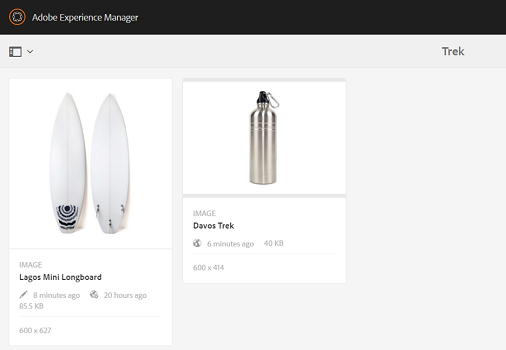

# 에셋용 Digital Rights Management {#digital-rights-management-in-assets}

| 버전 | 문서 링크 |
| -------- | ---------------------------- |
| AEM as a Cloud Service | [여기를 클릭하십시오.](https://experienceleague.adobe.com/docs/experience-manager-cloud-service/content/assets/manage/drm.html?lang=en) |
| AEM 6.5 | 이 문서 |

디지털 자산은 종종 사용 약관 및 기간을 지정하는 라이선스와 연결됩니다. 왜냐면 [!DNL Adobe Experience Manager Assets] 는 [!DNL Experience Manager] platform을 사용하면 자산 만료 정보 및 자산 상태를 효율적으로 관리할 수 있습니다. 라이선스 정보를 자산과 연결할 수도 있습니다.

## 자산 만료 {#asset-expiration}

자산 만료는 자산에 대한 라이선스 요구 사항을 적용하는 효과적인 방법입니다. 게시된 자산이 만료되면 게시 취소되어 라이선스 위반이 발생할 수 있습니다. 관리자 권한이 없는 사용자는 만료된 자산을 편집, 복사, 이동, 게시 및 다운로드할 수 없습니다.

에서 자산의 만료 상태를 볼 수 있습니다 [!DNL Assets] 카드 보기와 목록 보기 모두에 있는 콘솔입니다.

*그림: 목록 보기에서 [!UICONTROL 상태] 열이 표시됩니다 [!UICONTROL 만료됨] 배너.*

에서 자산의 만료 상태를 볼 수 있습니다 [!UICONTROL 타임라인] 왼쪽 레일에 있습니다.

>[!NOTE]
>
>자산의 만료 날짜가 다른 시간대에 있는 사용자에 대해 다르게 표시됩니다.

에서 자산의 만료 상태를 볼 수도 있습니다 **[!UICONTROL 참조]** 레일. 복합 자산과 참조된 하위 자산, 컬렉션 및 프로젝트 간의 자산 만료 상태 및 관계를 관리합니다.

1. 참조하는 웹 페이지와 복합 자산을 볼 자산으로 이동합니다.
1. 자산을 선택하고 엽니다. **[!UICONTROL 참조]** 왼쪽 레일에 있습니다. 만료된 자산의 경우 [!UICONTROL 참조] 레일에는 만료 상태가 표시됩니다 **[!UICONTROL 자산이 만료됨]** 바로 위에요

   

   자산이 만료된 하위 자산인 경우 [!UICONTROL 참조] 레일에는 상태가 표시됩니다 **[!UICONTROL 자산이 만료된 하위 자산이 있습니다.]**.

   

### 만료된 자산 검색 {#search-expired-assets}

검색 패널에서 만료된 하위 자산을 포함하여 만료된 자산을 검색할 수 있습니다.

1. 에서 [!DNL Assets] 콘솔에서 **[!UICONTROL 검색]** 도구 모음에서 Omnisearch 상자를 표시합니다.

1. Omnisearch 상자에 커서를 놓고 `Enter` 키를 눌러 검색 결과 페이지를 표시합니다.
1. 왼쪽 레일에서 검색 패널을 엽니다. 을(를) 클릭합니다. **[!UICONTROL 만료 상태]** 옵션을 확장하십시오.

   

1. 선택 **[!UICONTROL 만료됨]**. 검색 결과를 필터링하면 만료된 자산만 표시됩니다.

을(를) 선택하는 경우 **[!UICONTROL 만료됨]** 옵션, [!DNL Assets] 콘솔은 복합 자산에서 참조하는 만료된 자산 및 하위 자산만 표시합니다. 만료된 하위 자산을 참조하는 복합 자산은 하위 자산이 만료된 직후 표시되지 않습니다. 대신, 나중에 표시됩니다 [!DNL Experience Manager] 은 스케줄러가 다음에 실행될 때 만료된 하위 자산을 참조하는지 감지합니다.

게시된 자산의 만료 날짜를 현재 스케줄러 주기 이전 날짜로 수정하는 경우 예약은 여전히 다음 번에 이 자산을 실행할 때 만료된 자산으로 감지하고 그에 따라 이 상태를 반영합니다.

또한, 결함 또는 오류로 인해 스케줄러가 현재 사이클에서 만료된 자산을 감지하지 못하는 경우 스케줄러는 다음 사이클에서 이러한 자산을 다시 검사하여 만료된 상태를 감지합니다.

를 사용하려면 [!DNL Assets] 콘솔에 참조된 조합 자산과 만료된 하위 자산을 함께 표시하려면 다음을 구성합니다 **[!UICONTROL Adobe CQ DAM 만료 알림]** 의 워크플로우 [!DNL Experience Manager] 구성 관리자.

1. 열기 [!DNL Experience Manager] 구성 관리자.
1. 선택 **[!UICONTROL Adobe CQ DAM 만료 알림]**. 기본적으로 **[!UICONTROL 시간 기반 스케줄러]** 이(가) 선택되어 있을 경우, 자산이 하위 자산이 만료되었는지 여부를 특정 시간에 확인할 작업을 예약합니다. 작업이 완료되면, 하위 자산이 만료된 자산과 참조된 자산이 검색 결과에 만료된 것으로 표시됩니다.

1. To run the job periodically, clear the **[!UICONTROL Time Based Scheduler Rule]** field and modify the time in seconds in the **[!UICONTROL Periodic Scheduler]** field. 예 표현식 `0 0 0 * * ?` 00시간 후에 작업을 트리거합니다.
1. 선택 **[!UICONTROL 전자 메일 보내기]** 자산이 만료되면 이메일을 수신하려면 다음을 수행하십시오.

   >[!NOTE]
   >
   >자산 작성자만(특정 자산을 업로드하는 사람) [!DNL Assets])은 자산이 만료되면 이메일을 받습니다. 자세한 내용은 [이메일 알림 구성 방법](/help/sites-administering/notification.md) 전반적인 이메일 알림 구성에 대한 자세한 내용은 [!DNL Experience Manager] 수준.

1. 에서 **[!UICONTROL 이전 알림(초)]** 필드에서 만료와 관련된 알림을 받으려면 자산이 만료되기 전 시간(초)을 지정합니다. 자산 작성자는 자산이 지정된 시간 후에 만료된다는 알림을 받는 자산 만료 전에 메시지를 받습니다. 자산이 만료되면 만료를 확인하는 다른 알림을 받게 됩니다. 또한 만료된 자산이 비활성화됩니다.

1. **[!UICONTROL 저장]**&#x200B;을 클릭합니다.

## 자산 상태 {#asset-states}

다음 [!DNL Assets] 콘솔에 자산의 다양한 상태가 표시될 수 있습니다. 특정 자산의 현재 상태에 따라 해당 카드 보기에는 해당 상태를 설명하는 레이블(예: 만료됨, 게시됨, 승인됨, 거부됨)이 표시됩니다.

1. 에서 [!DNL Assets] 사용자 인터페이스에서 자산을 선택합니다.
1. 클릭 **[!UICONTROL 게시]** 를 클릭합니다. 표시되지 않으면 **게시** 도구 모음에서 **[!UICONTROL 자세히]** 도구 모음에서 **[!UICONTROL 게시]**  선택 사항입니다.
1. 선택 **[!UICONTROL 게시]** 메뉴에서 확인 대화 상자를 닫습니다.
1. 선택 모드를 종료합니다. 자산에 대한 게시 상태가 카드 보기에서 자산 축소판 아래에 표시됩니다. 목록 보기에서 게시됨 열에는 자산이 게시된 시간이 표시됩니다.

   

1. 해당 자산 세부 사항 페이지를 표시하려면 [!DNL Assets] 인터페이스, 자산 선택 및 클릭 **[!UICONTROL 속성]** .

1. 에서 [!UICONTROL 고급] 탭에서 자산의 만료 날짜를 설정합니다. **[!UICONTROL 만료]** 필드.

   

   *그림: [!UICONTROL 고급] 자산의 탭 [!UICONTROL 속성] 페이지 를 클릭하여 자산 만료를 설정합니다.*

1. 클릭 **[!UICONTROL 저장]** 을 클릭한 다음 **[!UICONTROL 닫기]** 자산 콘솔을 표시합니다.
1. 자산에 대한 게시 상태는 카드 보기에서 자산 축소판 아래에 있는 만료된 상태를 나타냅니다. 목록 보기에서 자산의 상태가 **[!UICONTROL 만료됨]**.

   

1. 에서 [!DNL Assets] 콘솔에서 폴더를 선택하고 폴더에 검토 작업을 만듭니다.
1. 검토 작업에서 자산을 검토 및 승인/거부하고 **[!UICONTROL 완료]**.
1. 검토 작업을 만든 폴더로 이동합니다. 승인/거부한 자산의 상태가 카드 보기의 맨 아래에 표시됩니다. 목록 보기에서 승인 및 만료 상태가 적절한 열에 표시됩니다.

   

1. 해당 상태에 따라 자산을 검색하려면 다음을 클릭합니다 **[!UICONTROL 검색]**  Omnisearch 막대를 표시합니다.
1. 선택 `Return` 을(를) 클릭합니다. [!DNL Experience Manager] 검색 패널을 표시하려면 다음을 수행하십시오.
1. 검색 패널에서 **[!UICONTROL 게시 상태]** 을(를) 선택합니다. **[!UICONTROL 게시됨]** 에서 게시된 자산을 검색하려면 [!DNL Assets].

   

1. 클릭 **[!UICONTROL 승인 상태]** 승인되었거나 거부된 자산을 검색하려면 적절한 옵션을 클릭합니다.

   

1. To search for assets based on their expiration status, select **[!UICONTROL Expiry Status]** in the Search panel and choose the appropriate option.

   

1. 다양한 검색 패싯에서 상태 조합을 기반으로 자산을 검색할 수도 있습니다. 예를 들어, 검색 패싯에서 적절한 옵션을 선택하여 검토 작업에서 승인되었으나 아직 만료되지 않은 게시된 자산을 검색할 수 있습니다.

   

## Digital Rights Management [!DNL Assets] {#digital-rights-management-in-assets-1}

이 기능은 라이선스 자산을 [!DNL Adobe Experience Manager Assets].

보호된 자산을 선택하고 **[!UICONTROL 다운로드]**&#x200B;를 입력하면 라이센스 계약에 동의하도록 라이센스 페이지로 리디렉션됩니다. 사용권 계약에 동의하지 않으면 **[!UICONTROL 다운로드]** 옵션을 사용할 수 없습니다.

선택한 항목에 여러 개의 보호된 자산이 포함되어 있는 경우 한 번에 한 개의 자산을 선택하고 사용권 계약에 동의한 다음 자산 다운로드를 계속 진행합니다.

다음 조건 중 하나가 충족되면 자산이 보호된 것으로 간주됩니다.

* 자산 메타데이터 속성 `xmpRights:WebStatement` 자산에 대한 사용권 계약이 들어 있는 페이지의 경로를 가리킵니다.
* 자산 메타데이터 속성 값 `adobe_dam:restrictions` 는 사용권 계약을 지정하는 원시 HTML입니다.

>[!NOTE]
>
>위치 `/etc/dam/drm/licenses` 이전 릴리스에서 라이센스를 저장하는 데 사용됩니다. [!DNL Experience Manager] 는 더 이상 사용되지 않습니다.
>
>라이센스 페이지를 만들거나 수정하거나 이전 페이지에서 포팅하는 경우 [!DNL Experience Manager] 릴리스, Adobe은 다음 위치에 저장할 것을 권장합니다. `/apps/settings/dam/drm/licenses` 또는 `/conf/&ast;/settings/dam/drm/licenses`.

### DRM 보호 자산 다운로드 {#downloading-drm-assets}

1. 카드 보기에서 다운로드할 자산을 선택하고 를 클릭합니다 **[!UICONTROL 다운로드]**.
1. In the **[!UICONTROL Copyright Management]** page, select the asset you want to download from the list.
1. 에서 [!UICONTROL 라이선스] 창 **[!UICONTROL 동의]**. 자산 옆에 확인 표시가 나타납니다. 을(를) 클릭합니다. **[!UICONTROL 다운로드]** 선택 사항입니다.

   >[!NOTE]
   >
   >다음 **[!UICONTROL 다운로드]** 이 옵션은 보호된 자산에 대한 사용권 계약에 동의하도록 선택한 경우에만 활성화됩니다. 그러나 선택한 항목에 보호된 자산과 보호되지 않은 자산이 모두 포함되어 있으면 창과 창에 보호된 자산만 나열됩니다 **[!UICONTROL 다운로드]** 보호되지 않은 자산을 다운로드할 수 있는 옵션이 활성화됩니다. To simultaneously accept license agreements for multiple protected assets, select the assets from the list and then choose **[!UICONTROL Agree]**.

   

1. 대화 상자에서 **[!UICONTROL 다운로드]** 자산 또는 해당 표현물을 다운로드하려면 다음을 수행하십시오.
