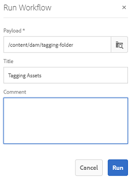

# 스마트 태그 이해, 적용 및 조정 {#enhanced-smart-tags}

디지털 자산을 처리하는 조직은 자산 메타데이터에서 분류 제어 어휘를 점점 더 많이 사용합니다. 기본적으로 직원, 파트너 및 고객이 특정 클래스의 디지털 자산을 참조하고 검색하는 데 일반적으로 사용하는 키워드 목록이 포함되어 있습니다. 분류 제어 어휘를 사용하여 자산에 태그를 지정하면 자산을 쉽게 식별하고 검색할 수 있습니다.

자연어 어휘와 비교하여 비즈니스 분류법을 기반으로 디지털 자산에 태그를 지정하면 기업의 비즈니스에 맞게 디지털 자산을 태그를 지정함으로써 가장 관련성이 높은 자산이 검색에 표시되도록 할 수 있습니다.

예를 들어, 자동차 제조업체는 모델 이름으로 자동차 이미지에 태그를 지정할 수 있으므로 다양한 모델의 이미지를 검색하여 프로모션 캠페인을 디자인할 때 관련 이미지만 표시할 수 있습니다.

Smart Content Service에서 올바른 태그를 적용하려면 해당 태그를 교육하여 분류법을 인식하십시오. 서비스를 교육하려면 먼저 이러한 자산을 가장 잘 설명하는 자산 및 태그 세트를 조정하십시오. 서비스 학습을 돕기 위해 자산에 이러한 태그를 적용하고 교육 워크플로우를 실행합니다.

태그가 교육 및 준비되면 서비스는 이제 태깅 워크플로우를 통해 자산에 이러한 태그를 적용할 수 있습니다.

백그라운드에서 Smart Content Service는 Adobe Sensei AI 프레임워크를 사용하여 태그 구조 및 비즈니스 분류에 대한 이미지 인식 알고리즘을 교육합니다. 그런 다음 이 컨텐츠 인텔리전스를 사용하여 다른 자산 세트에 관련 태그를 적용하는 데 사용됩니다.

스마트 컨텐츠 서비스는 [!DNL Adobe Developer Console]에 호스팅되는 클라우드 서비스입니다. [!DNL Adobe Experience Manager]에서 사용하려면 시스템 관리자가 [!DNL Experience Manager] 배포를 [!DNL Adobe Developer Console]와 통합해야 합니다.

다음은 스마트 컨텐츠 서비스를 사용하는 주요 단계입니다.

* 온보딩
* 자산 및 태그 검토(분류 정의)
* 스마트 컨텐츠 서비스 교육
* 자동 태깅

## 사전 요구 사항 및 지원되는 형식 {#prerequisites}

스마트 컨텐츠 서비스를 사용하려면 먼저 다음을 확인하여 [!DNL Adobe Developer Console]에 통합을 만드십시오.

* 조직에 대한 관리자 권한이 있는 Adobe ID 계정입니다.
* 조직에 대해 스마트 컨텐츠 서비스 서비스를 활성화합니다.
* 스마트 컨텐츠 서비스 기본 패키지를 배포에 추가하려면 [!DNL Adobe Experience Manager Sites] 기본 패키지 및 [!DNL Assets] 추가 기능에 라이선스를 부여합니다.

이 서비스는 다음 MIME 유형의 자산에 스마트 태그를 적용합니다.

* image/jpeg
* image/tiff
* image/png
* image/bmp
* image/gif
* image/pjpeg
* image/x-portable-anymap
* image/x-portable-bitmap
* image/x-portable-graymap
* image/x-portable-pixmap
* image/x-rgb
* image/x-xbitmap
* image/x-xpixmap
* image/x-icon
* 이미지/photoshop
* image/x-photoshop
* 이미지/psd
* image/vnd.adobe.photoshop

이 서비스는 다음 MIME 유형의 자산 변환에 스마트 태그를 적용합니다.

* 이미지/jpeg
* 이미지/pjpeg
* 이미지/png

## 온보딩 {#onboarding}

스마트 컨텐츠 서비스는 [!DNL Experience Manager]에 대한 추가 기능으로 구입할 수 있습니다. 구입하고 나면 [!DNL Adobe I/O] 링크가 포함된 이메일이 조직 관리자에게 전송됩니다.

관리자는 링크를 따라 스마트 컨텐츠 서비스를 [!DNL Experience Manager]과 통합할 수 있습니다. 서비스를 [!DNL Experience Manager Assets]과 통합하려면 [스마트 태그 구성](config-smart-tagging.md)을 참조하십시오.

관리자가 서비스를 구성하고 [!DNL Experience Manager]에 사용자를 추가하면 온보딩 프로세스가 완료됩니다.

>[!NOTE]
>
>[!DNL Experience Manager] 6.3 이전 버전을 사용 중이며 자산에 대한 태그 지정 서비스가 필요한 경우 [스마트 태그](https://helpx.adobe.com/experience-manager/6-3/assets/using/touch-ui-smart-tags.html)를 참조하십시오. 스마트 태그는 최신 AI 기능을 사용하지 않으므로 향상된 스마트 태그 지정 서비스보다 정확성이 낮습니다.

## 자산 및 태그 검토 {#reviewing-assets-and-tags}

온보딩한 후 먼저 비즈니스 컨텍스트에서 이러한 이미지를 가장 잘 설명하는 태그 세트를 식별하는 것이 좋습니다.

그런 다음 이미지를 검토하여 특정 비즈니스 요구 사항에 가장 적합한 이미지 세트를 식별합니다. 조정된 세트에 있는 자산이 [스마트 컨텐츠 서비스 교육 지침](/help/assets/config-smart-tagging.md#training-the-smart-content-service)을 따르는지 확인합니다.

자산을 폴더에 추가하고 속성 페이지의 각 자산에 태그를 적용합니다. 그런 다음 이 폴더에서 교육 워크플로우를 실행합니다. 조정된 자산 세트를 사용하면 Smart Content Service에서 분류 정의를 사용하여 더 많은 자산을 효과적으로 교육할 수 있습니다.

>[!NOTE]
>
>1. 훈련은 취소할 수 없는 과정이다. Adobe은 태그에서 스마트 컨텐츠 서비스를 교육하기 전에 조정된 자산 세트에서 태그를 검토할 것을 권장합니다.
>1. 태그에 대한 교육을 하기 전에 [스마트 컨텐츠 서비스 교육 지침](/help/assets/config-smart-tagging.md#training-the-smart-content-service)을 참조하십시오.
>1. 스마트 컨텐츠 서비스를 처음 교육할 때 두 개 이상의 개별 태그로 교육하는 것이 좋습니다.

## 스마트 태그를 사용하여 [!DNL Experience Manager] 검색 결과 이해 {#understandsearch}

기본적으로 [!DNL Experience Manager] 검색은 검색어와 `AND` 절을 결합합니다. 스마트 태그를 사용하면 이 기본 동작이 변경되지 않습니다. 스마트 태그를 사용하면 추가 `OR` 절을 추가하여 스마트 태그와 관련된 검색어를 찾습니다. 예를 들어 `woman running`을 검색하는 것이 좋습니다. 메타데이터에 `woman` 키워드만 있거나 `running` 키워드만 있는 자산은 기본적으로 검색 결과에 표시되지 않습니다. 그러나 스마트 태그를 사용하는 `woman` 또는 `running` 태그가 지정된 자산이 이러한 검색 쿼리에 나타납니다. 따라서 검색 결과는

* 메타데이터에 `woman` 및 `running` 키워드가 있는 자산.

* 두 키워드 중 하나로 스마트 태그가 지정된 자산.

메타데이터 필드의 모든 검색어와 일치하는 검색 결과가 먼저 표시되고, 그 뒤에는 스마트 태그의 검색어와 일치하는 검색 결과가 표시됩니다. 위의 예에서 검색 결과의 대략적인 표시 순서는 다음과 같습니다.

1. 다양한 메타데이터 필드에서 `woman running`과 일치합니다.
1. 스마트 태그의 `woman running`에 일치합니다.
1. 스마트 태그의 `woman` 또는 `running`에 해당합니다.

>[!CAUTION]
>
>Lucene 색인화가 [!DNL Adobe Experience Manager]에서 완료된 경우 스마트 태그를 기반으로 한 검색이 예상대로 작동하지 않습니다.

## 자산 {#tagging-assets-automatically}에 자동으로 태그 지정

스마트 컨텐츠 서비스를 교육한 후 태깅 워크플로우를 트리거하여 유사한 다른 자산 세트에 적절한 태그를 자동으로 적용할 수 있습니다.

정기적으로 또는 필요할 때마다 태깅 워크플로우를 실행할 수 있습니다.

>[!NOTE]
>
>태깅 워크플로우는 자산과 폴더 모두에서 실행됩니다.

### 주기적 태깅 {#periodic-tagging}

Smart Content Service가 폴더 내의 자산에 정기적으로 태그를 지정할 수 있도록 설정할 수 있습니다. 자산 폴더의 속성 페이지를 열고 **[!UICONTROL 세부 정보]** 탭 아래에서 **[!UICONTROL 스마트 태그 활성화]**&#x200B;를 선택하고 변경 사항을 저장합니다.

폴더에 대해 이 옵션을 선택하면 Smart Content Service가 폴더 내의 자산에 자동으로 태그를 지정합니다. 기본적으로 태깅 워크플로우는 매일 오전 12:00에 실행됩니다.

### 요청 시 태깅 {#on-demand-tagging}

워크플로우 콘솔 또는 타임라인에서 태그 지정 워크플로우를 트리거하여 즉시 자산에 태그를 지정할 수 있습니다.

>[!NOTE]
>
>타임라인에서 태그 지정 워크플로우를 실행하는 경우 한 번에 최대 15개의 자산에 태그를 적용할 수 있습니다.

#### 워크플로우 콘솔에서 자산에 태그 지정 {#tagging-assets-from-the-workflow-console}

1. [!DNL Experience Manager] 인터페이스에서 **[!UICONTROL 도구]** > **[!UICONTROL 워크플로우]** > **[!UICONTROL 모델]**&#x200B;으로 이동합니다.
1. **[!UICONTROL 워크플로우 모델]** 페이지에서 **[!UICONTROL DAM 스마트 태그 자산]** 워크플로우를 선택한 다음 도구 모음에서 **[!UICONTROL 워크플로우 시작]**&#x200B;을 클릭합니다.

   

1. **[!UICONTROL 워크플로우 실행]** 대화 상자에서 태그를 자동으로 적용할 자산이 들어 있는 페이로드 폴더를 찾습니다.
1. 워크플로우의 제목과 선택적 설명을 지정합니다. **[!UICONTROL 실행]**&#x200B;을 클릭합니다.

   

   Smart Content Service에서 자산에 태그가 지정되어 있는지 확인하려면 자산 폴더로 이동하고 태그를 검토합니다.

#### 타임라인에서 자산에 태그 지정 {#tagging-assets-from-the-timeline}

1. [!DNL Assets] 사용자 인터페이스에서 스마트 태그를 적용할 자산 또는 특정 자산이 들어 있는 폴더를 선택합니다.
1. 왼쪽 위 모서리에서 **[!UICONTROL 타임라인]**&#x200B;을 엽니다.
1. 왼쪽 사이드바의 맨 아래에서 작업을 열고 **[!UICONTROL 워크플로우 시작]**&#x200B;을 클릭합니다.

   

1. **[!UICONTROL DAM 스마트 태그 자산]** 워크플로우를 선택하고 워크플로우의 제목을 지정합니다.
1. **[!UICONTROL 시작]**&#x200B;을 클릭합니다. 워크플로우는 자산의 태그를 적용합니다. 스마트 컨텐츠 서비스에서 자산에 태그가 지정되었는지 확인하려면 자산 폴더로 이동하고 태그를 검토하십시오.

>[!NOTE]
>
>후속 태그 지정 사이클에서 수정된 자산만 새로 훈련된 태그로 다시 태그가 지정됩니다. 하지만 태깅하지 않은 자산이라도 태깅을 수행하면 태깅이 마지막 태깅과 현재 태깅 주기 사이의 간격이 24시간을 초과하는 경우 태그가 지정됩니다. 주기적인 태깅 워크플로우의 경우 시간 간격이 6개월을 초과할 때 변경되지 않은 자산에 태그가 지정됩니다.

## 적용된 스마트 태그 {#manage-smart-tags} 조정 또는 중재

가장 관련성이 높은 태그만 표시되도록 스마트 태그를 조정하여 브랜드 이미지에 할당된 부정확한 태그를 제거할 수 있습니다.

또한 스마트 태그를 중재하면 가장 관련성이 높은 태그를 검색 결과에 표시하는 방식으로 태그 기반 검색을 통해 이미지를 검색할 수 있습니다. 기본적으로, 이것은 관련 없는 이미지가 검색 결과에 나타날 가능성을 제거하는데 도움이 된다.

태그에 높은 등급을 할당하여 이미지에 대한 관련성을 높일 수도 있습니다. 이미지에 대한 태그를 승격하면 특정 태그를 검색할 때 검색 결과에 이미지가 표시될 가능성이 높아집니다.

1. 검색 상자에서 태그를 키워드로 사용하여 자산을 검색합니다.
1. 검색과 관련이 없는 이미지를 식별하려면 검색 결과를 검토하십시오.
1. 이미지를 선택하고 도구 모음에서 **[!UICONTROL 태그 관리]**&#x200B;를 클릭합니다.
1. **[!UICONTROL 태그 관리]** 페이지에서 태그를 검토합니다. 특정 태그를 기반으로 이미지를 검색하지 않으려면 태그를 선택한 다음 도구 모음에서 **[!UICONTROL 삭제]**&#x200B;를 클릭합니다. 또는 태그 옆에 나타나는 `x` 기호를 클릭합니다.
1. 태그에 높은 등급을 지정하려면 태그를 선택하고 도구 모음에서 **[!UICONTROL Promote]** 를 클릭합니다(선택 사항). 프로모션하는 태그는 **[!UICONTROL 태그]** 섹션으로 이동합니다.
1. **[!UICONTROL 저장]**&#x200B;을 클릭한 다음 **[!UICONTROL 확인]**&#x200B;을 클릭합니다
1. 이미지의 **[!UICONTROL 속성]** 페이지로 이동합니다. 프로모션한 태그는 더 관련성이 할당되고 검색 결과에 더 빨리 표시되는지 확인합니다.

## 팁 및 제한 사항 {#tips-best-practices-limitations}

* 스마트 컨텐츠 서비스 사용은 매년 최대 200만 개의 태그가 지정된 이미지로 제한됩니다. 처리 및 태그가 지정된 중복 이미지는 각각 태그가 지정된 이미지로 계산됩니다.
* 타임라인에서 태그 지정 워크플로우를 실행하는 경우 한 번에 최대 15개의 자산에 태그를 적용할 수 있습니다.
* 스마트 태그는 PNG 및 JPG 이미지 형식에만 작동합니다. 따라서 이러한 두 가지 형식으로 만들어진 표현물이 있는 지원되는 자산에 스마트 태그가 지정됩니다.
