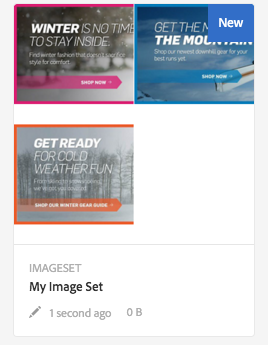
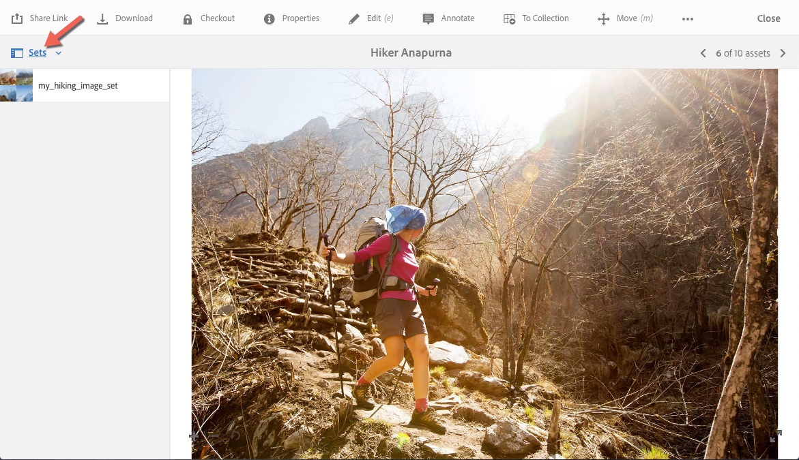

# 이미지 세트 {#image-sets}

이미지 세트는 사용자가 축소판 이미지를 선택하여 항목의 다른 보기를 볼 수 있는 통합된 보기 환경을 제공합니다. 이미지 세트를 사용하면 항목의 대체 보기를 표시할 수 있으며 뷰어는 이미지를 자세히 검사할 수 있는 확대/축소 도구를 제공합니다.

이미지 세트는 라는 단어가 포함된 배너에 의해 지정됩니다 `IMAGESET`. In addition, if the Image Set is published, then the publish date, indicated by the **[!UICONTROL World]** icon is on the banner along with the last modification date, indicated by the **[!UICONTROL Pencil]** icon displays.

이미지 세트 내에서 이미지 세트를 만들고 축소판을 추가하여 색상 견본을 만들 수도 있습니다.

이 응용 프로그램은 다른 색상, 패턴 또는 마무리로 항목을 표시하려는 경우에 유용합니다. 색상 견본으로 이미지 세트를 만들려면 사용자에게 표시할 각 색상, 패턴 또는 마무리에 대해 하나의 이미지가 필요합니다. 또한 각 색상, 패턴 또는 마무리에 색상, 패턴 또는 마무리 견본이 필요합니다.

예를 들어 서로 다른 색상 BOM이 있는 대문자들의 이미지를 제공한다고 가정합니다. 지폐는 빨간색, 녹색, 파란색이에요. 이 경우 동일한 캡의 샷이 세 개 필요합니다. 하나는 빨간색, 하나는 녹색이고 하나는 파란색 지폐가 있는 한 샷이 필요합니다. 또한 빨간색, 녹색 및 파란색 색상 견본이 필요합니다. 색상 견본은 색상 견본 세트 뷰어에서 사용자가 빨간색으로 청구되거나 녹색으로 청구되거나 파란색으로 청구되는 캡을 보기 위해 선택하는 축소판 역할을 합니다.

>[!NOTE]
>
>Assets 사용자 인터페이스에 대한 자세한 내용은 [자산 관리](/help/assets/manage-assets.md).

이미지 세트를 생성할 때 Adobe은 다음 우수 사례를 권장하고 다음 제한을 적용합니다.

| 자산 - 제한 유형 | 우수 사례 | 구현된 제한 | 제한 변경: 2022년 12월 31일 |
| --- | --- | --- | --- |
| **이미지 세트** - 세트당 중복 자산 수 | 중복 없음 | 100 | 20 |
| **이미지 세트** - 세트당 최대 이미지 수 | 세트당 5-10개 이미지 | 1000 |

참조 - [Dynamic Media 제한 사항](/help/assets/limitations.md).

## 빠른 시작: 이미지 세트 {#quick-start-image-sets}

**빠르게 시작하고 실행하려면**

1. [여러 보기를 위한 기본 소스 이미지 업로드](#uploading-assets-in-image-sets).

   이미지 세트에 대한 이미지를 업로드하여 시작합니다. 이미지를 선택할 때 고객이 이미지 세트 뷰어에서 이미지를 확대/축소할 수 있음을 기억하십시오. 최적의 확대/축소 세부 사항을 위해 가장 큰 차원에서 이미지가 2000픽셀 이상인지 확인하십시오. Dynamic Media은 각각 최대 25MP(메가픽셀)로 이미지를 렌더링할 수 있습니다. 예를 들어, 5000 x 5000 MP 이미지 또는 최대 25MP의 다른 크기 조합을 사용할 수 있습니다.

   자세한 내용은 [Dynamic Media - 지원되는 래스터 이미지 형식](/help/assets/assets-formats.md#supported-raster-image-formats-dynamic-media) 를 참조하십시오.

<!--    Adobe Experience Manager Assets supports many image file formats, but lossless TIFF, PNG, and EPS images are recommended. -->

1. [이미지 세트 만들기](#creating-image-sets).

   이미지 세트의 사용자가 이미지 세트 뷰어에서 축소판 이미지를 선택합니다.

   자산에서 이미지 세트를 만들려면 다음 위치로 이동하십시오. **[!UICONTROL 만들기]** > **[!UICONTROL 이미지 세트]**. 그런 다음 이미지를 추가하고 을(를) 선택합니다 **[!UICONTROL 저장]**.

   이미지 세트를 자동으로 만들 수도 있습니다 [일괄처리 집합 사전 설정](/help/assets/config-dms7.md).
   >[!IMPORTANT]
   >
   >배치 세트는 IPS(이미지 프로덕션 시스템)에 의해 자산 수집의 일부로 만들어지며 Dynamic Media - Scene7 모드에서만 사용할 수 있습니다.

   자세한 내용은 [파일 업로드 및 업로드할 이미지 세트 자산 준비](#uploading-assets-in-image-sets).

   자세한 내용은 [선택기를 사용한 작업](/help/assets/working-with-selectors.md).

1. 추가 [이미지 집합 뷰어 사전 설정](/help/assets/managing-viewer-presets.md)필요한 경우 ).

   관리자는 이미지 세트 뷰어 사전 설정을 만들거나 수정할 수 있습니다. 뷰어 사전 설정으로 이미지 세트를 보려면 이미지 세트를 선택하고 왼쪽 레일 드롭다운 메뉴에서 을 선택합니다 **[!UICONTROL 뷰어]**.

   다음으로 이동 **[!UICONTROL 도구]** > **[!UICONTROL 자산]** > **[!UICONTROL 뷰어 사전 설정]** 뷰어 사전 설정을 만들거나 편집하려면

1. (선택 사항) [이미지 집합 보기](/help/assets/image-sets.md#viewing-image-sets) 일괄처리 집합 사전 설정을 사용하여 만들었습니다.
1. [이미지 세트 미리 보기](/help/assets/previewing-assets.md).

   이미지 세트를 선택하고 미리 볼 수 있습니다. 선택한 뷰어에서 이미지 세트를 검사할 수 있도록 축소판 아이콘을 선택합니다. 에서 다른 뷰어를 선택할 수 있습니다 **[!UICONTROL 뷰어]** 메뉴 아래의 왼쪽 레일 드롭다운 메뉴에서 사용할 수 있습니다.

1. [이미지 집합 게시](/help/assets/publishing-dynamicmedia-assets.md).

   이미지 세트를 게시하면 URL 및 포함 코드가 활성화됩니다. 또한 다음을 수행해야 합니다 [모든 사용자 지정 뷰어 사전 설정 게시](/help/assets/managing-viewer-presets.md) 생성되었습니다. 즉시 사용 가능한 뷰어 사전 설정이 이미 게시되었습니다.

1. [웹 응용 프로그램에 URL 연결](/help/assets/linking-urls-to-yourwebapplication.md) 또는 [비디오 또는 이미지 뷰어 포함](/help/assets/embed-code.md).

   Experience Manager Assets은 이미지 세트에 대한 URL 호출을 생성하고 이미지 세트를 게시한 후 활성화합니다. 자산을 미리 볼 때 이러한 URL을 복사할 수 있습니다. 또는 웹 사이트에 포함할 수 있습니다.

   Select the Image Set, then in the left rail drop-down menu, select **[!UICONTROL Viewers]**.

   자세한 내용은 [웹 페이지에 이미지 집합 연결](/help/assets/linking-urls-to-yourwebapplication.md) 및 [비디오 또는 이미지 뷰어 포함](/help/assets/embed-code.md).

이미지 세트를 편집하려면 다음을 참조하십시오 [이미지 집합 편집](#editing-image-sets). 또한 를 보고 편집할 수 있습니다 [이미지 집합 속성](/help/assets/manage-assets.md#editing-properties).

세트를 만드는 데 문제가 있다면 의 이미지 및 세트 를 참조하십시오. [Dynamic Media 문제 해결 - Scene7 모드](/help/assets/troubleshoot-dms7.md#images-and-sets).

## 이미지 세트에서 자산 업로드 {#uploading-assets-in-image-sets}

이미지 세트에 대한 이미지를 업로드하여 시작합니다. 이미지를 선택할 때 고객이 이미지 세트 뷰어에서 이미지를 확대/축소할 수 있음을 기억하십시오. 가장 큰 차원에서 이미지가 2000픽셀 이상인지 확인합니다. 이미지 세트는 많은 이미지 파일 형식을 지원하지만 무손실 TIFF, PNG 및 EPS 이미지를 사용하는 것이 좋습니다.

이미지 세트에 대한 이미지를 업로드하는 것처럼 할 수 있습니다 [자산에서 다른 자산 업로드](/help/assets/manage-assets.md#uploading-assets).

자세한 내용은 [Dynamic Media - 지원되는 래스터 이미지 형식](/help/assets/assets-formats.md#supported-raster-image-formats-dynamic-media) 를 참조하십시오.

### 업로드할 이미지 세트 자산 준비 {#preparing-image-set-assets-for-upload}

이미지 세트를 만들기 전에 이미지가 올바른 크기와 형식인지 확인하십시오.

다중 보기 이미지 세트를 만들려면 다른 보기의 항목을 표시하거나 동일한 항목의 다른 측면을 표시하는 이미지가 필요합니다. 목표는 항목의 중요한 기능을 강조 표시하여 보기 또는 동작을 완벽하게 파악할 수 있도록 하는 것입니다.

사용자는 이미지 세트에서 이미지를 확대/축소할 수 있으므로 이미지가 가장 큰 차원에 최소 2000픽셀인지 확인하십시오. <!-- Assets support many image file formats, but lossless TIFF, PNG, and EPS images are recommended. -->

>[!NOTE]
>
>또한 제품 색상 견본을 나타내기 위해 축소판을 사용하는 경우 다음을 수행해야 합니다.
>
>다른 색상, 패턴 또는 마무리로 보여주는 동일한 이미지의 다른 촬영 또는 비네팅이 필요합니다. 또한 색상, 패턴 또는 완료에 해당하는 축소판 파일도 필요합니다. 예를 들어 같은 자켓을 검은색, 갈색 및 녹색으로 표시하는 이미지 세트와 함께 축소판을 표시하려면 다음 작업이 필요합니다.
>
>* 같은 재킷의 검정색, 갈색, 그리고 초록색 샷.
>* 검은색, 갈색 및 녹색 색상의 축소판 그림.

## 이미지 세트 만들기 {#creating-image-sets}

사용자 인터페이스 또는 API를 통해 이미지 세트를 만들 수 있습니다. 이 섹션에서는 UI에서 이미지 세트를 만드는 방법을 설명합니다.

>[!NOTE]
>
>이미지 세트를 자동으로 만들 수도 있습니다 [일괄처리 집합 사전 설정](/help/assets/config-dms7.md#creating-batch-set-presets-to-auto-generate-image-sets-and-spin-sets).
>**중요 사항:** 배치 세트는 IPS(이미지 프로덕션 시스템)에 의해 자산 수집의 일부로 만들어지며 Dynamic Media - Scene7 모드에서만 사용할 수 있습니다.

세트에 자산을 추가하면 자동으로 영숫자 순서로 추가됩니다. 자산이 추가된 후 자산을 수동으로 재정렬하거나 정렬할 수 있습니다.

>[!NOTE]
>
>파일 이름에 &quot;,&quot;(쉼표)가 있는 자산에 대해 이미지 세트가 지원되지 않습니다.

이미지 세트를 생성할 때 Adobe은 다음 우수 사례를 권장하고 다음 제한을 적용합니다.

| 자산 - 제한 유형 | 우수 사례 | 구현된 제한 | 제한 변경: 2022년 12월 31일 |
| --- | --- | --- | --- |
| **이미지 세트** - 세트당 중복 자산 수 | 중복 없음 | 100년 | 20년 |
| **이미지 세트** - 세트당 최대 이미지 수 | 세트당 5-10개 이미지 | 1000년 |

참조 - [Dynamic Media 제한 사항](/help/assets/limitations.md).

**이미지 세트를 만들려면 다음을 수행하십시오.**

1. Experience Manager에서 Experience Manager 로고를 선택하여 전역 탐색 콘솔에 액세스한 다음 **[!UICONTROL 탐색]** > **[!UICONTROL 자산]**. 이미지 세트를 만들 위치로 이동한 다음 **[!UICONTROL 만들기]** > **[!UICONTROL 이미지 세트]** 이미지 세트 편집기 페이지를 엽니다.

   You can also create the set from inside a folder that contains your assets.

   

1. 이미지 세트 편집기 페이지의 **[!UICONTROL 제목]** 필드에서 이미지 세트의 이름을 입력합니다. 이 이름은 이미지 세트의 배너에 표시됩니다. 설명을 입력합니다(선택적).

   

1. 다음 중 하나를 수행합니다.

   * 이미지 세트 편집기 페이지의 왼쪽 위 모서리 근처에 있는 를 선택합니다 **[!UICONTROL 자산 추가]**.

   * [이미지 세트 편집기] 페이지의 중간 근처에 있는 를 선택합니다 **[!UICONTROL 탭하여 자산 선택기 열기]**.
   이미지 세트에 포함할 자산을 선택합니다. Selected assets have a checkmark icon over them. 완료되면 페이지의 오른쪽 위 모서리 근처에 있는 를 선택합니다. **[!UICONTROL 선택]**.

   With the Asset Selector, you can search for assets by typing in a keyword and tapping or clicking **[!UICONTROL Return]**. You can also apply filters to refine your search results. You can filter by path, collection, file type, and tag. 필터를 선택한 다음 **[!UICONTROL 필터]** 아이콘을 클릭합니다. Change the view by tapping the View icon and selecting **[!UICONTROL Column View]**, **[!UICONTROL Card View]**, or **[!UICONTROL List View]**.

   자세한 내용은 [선택기를 사용한 작업](/help/assets/working-with-selectors.md).

   

1. 세트에 자산을 추가하면 자동으로 영숫자 순서로 추가됩니다. 자산을 추가한 후 수동으로 자산 순서를 변경하거나 정렬할 수 있습니다.

   필요한 경우 자산의 재정렬 아이콘을 자산의 파일 이름 오른쪽에 드래그하여 이미지 순서를 세트 목록의 위나 아래로 지정합니다.

   

   축소판이나 견본을 변경하려면 **+** **축소판** 이미지 옆에 있는 아이콘을 클릭하여 원하는 축소판 또는 견본으로 이동합니다. 모든 이미지 선택을 완료하면 을 선택합니다 **[!UICONTROL 저장]**.

1. (선택 사항) 다음 중 하나를 수행합니다.

   * 이미지를 삭제하려면 이미지를 선택하고 을(를) 선택합니다 **[!UICONTROL 자산 삭제]**.

   * 페이지의 오른쪽 위 모서리 근처에 있는 사전 설정을 적용하려면 을(를) 선택합니다 **[!UICONTROL 사전 설정]**&#x200B;를 선택한 다음 사전 설정을 선택하여 모든 자산에 한 번에 적용합니다.
   >[!NOTE]
   >
   >이미지 세트를 생성할 때 이미지 세트 축소판을 변경하거나 이미지 세트의 자산을 기반으로 Experience Manager이 자동으로 축소판을 선택할 수 있도록 할 수 있습니다. 축소판을 선택하려면 **[!UICONTROL 축소판 변경]** 이미지 세트 편집기 페이지의 제목 필드 위에 있는 이미지를 선택합니다(다른 폴더로 이동하여 이미지를 찾을 수도 있습니다). 축소판을 선택한 다음 이미지 세트에서 생성할 Experience Manager을 결정하려면 **[!UICONTROL 다음으로 전환]** > **[!UICONTROL 자동 축소판 그림]**.

1. **[!UICONTROL 저장]**&#x200B;을 선택합니다. 새로 만든 이미지 세트가 만든 폴더에 나타납니다.

## 이미지 집합 보기 {#viewing-image-sets}

사용자 인터페이스에서 또는 를 사용하여 자동으로 이미지 세트를 만들 수 있습니다 [일괄처리 집합 사전 설정](/help/assets/config-dms7.md#creating-batch-set-presets-to-auto-generate-image-sets-and-spin-sets).

>[!IMPORTANT]
>
>배치 세트는 IPS에 의해 만들어집니다 [이미지 프로덕션 시스템] 는 자산 수집의 일부로서 Dynamic Media - Scene7 모드에서만 사용할 수 있습니다.)

그러나 일괄처리 집합 사전 설정을 사용하여 만든 집합에서는 다음을 수행합니다 *not* 사용자 인터페이스에 표시됩니다. 이러한 세트는 세 가지 방법으로 볼 수 있습니다. (사용자 인터페이스에서 이미지 세트를 만들었더라도 이러한 방법을 사용할 수 있습니다.)

* 개별 자산의 속성을 엽니다. 속성은 선택한 자산이 참조되는 세트 또는 의 멤버를 나타냅니다. 전체 세트를 보려면 세트의 이름을 선택합니다.

   

* From a member image of any set. 을(를) 선택합니다 **[!UICONTROL 세트]** 메뉴 아래의 제품에서 자산이 속하는 세트를 표시합니다.

   

* 검색에서 **[!UICONTROL 필터]**&#x200B;를 확장한 다음 **[!UICONTROL Dynamic Media]** 을(를) 선택합니다. **[!UICONTROL 세트]**.

   검색은 UI에서 수동으로 만들거나 일괄처리 집합 사전 설정을 통해 자동으로 생성된 일치 세트를 반환합니다. 자동화된 세트의 경우, 검색 쿼리는 &quot;포함&quot; 검색 기준을 사용하는 Experience Manager 검색과 다른 &quot;다음으로 시작&quot; 검색 기준을 사용하여 수행됩니다. 필터를 로 설정 **[!UICONTROL 세트]** 자동화된 세트를 검색하는 유일한 방법입니다.

   

>[!NOTE]
>
>에 설명된 대로 사용자 인터페이스를 통해 세트를 볼 수 있습니다. [이미지 집합 편집](#editing-image-sets).

## 이미지 집합 편집 {#editing-image-sets}

다음과 같이 이미지 세트에서 다양한 편집 작업을 수행할 수 있습니다.

* 이미지 세트에 이미지를 추가합니다.
* 이미지 세트에서 이미지 재정렬.
* 이미지 세트에서 자산을 삭제합니다.
* 뷰어 사전 설정을 적용합니다.
* 이미지 세트를 삭제합니다.

**이미지 세트를 편집하려면**

1. 다음 중 하나를 수행합니다.

   * 이미지 세트 자산을 마우스로 가리킨 다음, 을 선택합니다 **[!UICONTROL 편집]** (연필 아이콘).
   * 이미지 세트 자산을 마우스로 가리킨 다음, 을 선택합니다 **[!UICONTROL 선택]** (확인 표시 아이콘)을 선택한 다음 **[!UICONTROL 편집]** 클릭합니다.
   * 이미지 세트 자산에서 을(를) 선택한 다음 을(를) 선택합니다 **[!UICONTROL 편집]** (연필 아이콘)을 클릭하여 제품에서 사용할 수 있습니다.

1. 이미지 세트에서 이미지를 편집하려면 다음 중 하나를 수행합니다.

   * 자산 순서를 조정하려면 이미지를 새 위치로 드래그합니다(항목을 이동하려면 순서 조정 아이콘을 선택합니다.).
   * 항목을 오름차순이나 내림차순으로 정렬하려면 열 머리글을 선택합니다.
   * 자산을 추가하거나 기존 자산을 업데이트하려면 **[!UICONTROL 자산 추가]**. 자산으로 이동하여 선택한 다음 선택합니다 **[!UICONTROL 선택]** 페이지의 오른쪽 위 모서리 근처에 있습니다.

      >[!NOTE]
      >
      >Experience Manager이 축소판에 사용하는 이미지를 다른 이미지로 대체하여 삭제하면 원본 자산이 계속 표시됩니다.
   * 자산을 삭제하려면 해당 자산을 선택하고 을(를) 선택합니다 **[!UICONTROL 자산 삭제]**.
   * 페이지의 오른쪽 위 모서리 근처에 있는 사전 설정을 적용하려면 을(를) 선택합니다 **[!UICONTROL 사전 설정]**&#x200B;를 선택한 다음 뷰어 사전 설정을 선택합니다.
   * 축소판을 추가하거나 변경하려면 자산의 오른쪽 옆에 있는 축소판 아이콘을 선택합니다. 새 축소판 그림 또는 견본 자산으로 이동하여 선택한 다음 선택합니다 **[!UICONTROL 선택]**.
   * 전체 이미지 세트를 삭제하려면 이미지 세트로 이동하여 선택한 다음 선택합니다 **[!UICONTROL 삭제]**.

   >[!NOTE]
   >
   >세트로 이동하여 이미지 세트에서 이미지를 편집할 수 있습니다. **[!UICONTROL 구성원 설정]** 왼쪽 레일에서 개별 자산에 대한 연필 아이콘을 선택하여 편집 창을 엽니다.

1. 선택 **[!UICONTROL 저장]** 편집을 완료하면 됩니다.

## 이미지 세트 미리 보기 {#previewing-image-sets}

자세한 내용은 [자산 미리 보기](/help/assets/previewing-assets.md).

## 이미지 집합 게시 {#publishing-image-sets}

자세한 내용은 [자산 게시](/help/assets/publishing-dynamicmedia-assets.md).
