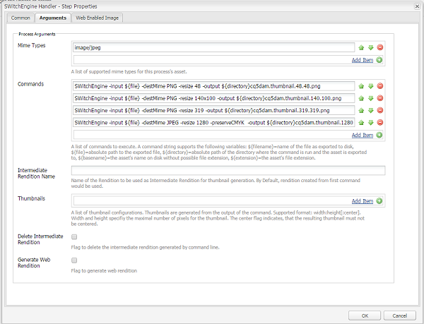

# 이미징 코드 변환 라이브러리 {#imaging-transcoding-library}

Adobe의 이미징 코드 변환 라이브러리는 다음과 같은 핵심 이미지 처리 기능을 수행할 수 있는 전용 이미지 처리 솔루션입니다.

* 인코딩
* 코드 변환(지원되는 형식 변환)
* PS 및 인텔 IPP 알고리즘을 사용한 이미지 재샘플링
* 비트 깊이 및 색상 프로파일 보존
* JPEG 품질 압축
* 이미지 크기 조정

이미징 코드 변환 라이브러리에서는 CMYK 지원 및 전체 알파 지원을 제공합니다(CMYK -Alpha 제외).

Imaging Transcoding Library는 다양한 파일 형식 및 프로필을 지원할 뿐만 아니라 성능, 확장성 및 품질 측면에서 다른 타사 솔루션보다 큰 이점을 제공합니다. Imaging Transcoding 라이브러리를 사용하면 다음과 같은 몇 가지 주요 이점이 있습니다.

* **파일 크기 또는 해상도를 높여 크기 조정**: 크기 조절은 주로 파일을 디코딩하는 동안 크기를 재조정할 수 있는 Imaging Transcoding Library의 특허 기능을 통해 수행됩니다. 이러한 기능을 통해 런타임 메모리 사용이 항상 최적의 상태로 유지되며 파일 크기 또는 해상도의 메가픽셀을 증가시키는 이차 기능이 아닙니다. 이미징 코드 변환 라이브러리는 더 크고 고해상도(더 높은 메가픽셀 포함) 파일을 처리할 수 있습니다. ImageMagick와 같은 타사 도구는 이러한 파일을 처리하는 동안 큰 파일 및 충돌을 처리할 수 없습니다.
* **Photoshop 품질 압축 및 크기 조정 알고리즘**: 다운샘플링 품질(매끄러운, 날카롭고 자동 쌍입방) 및 압축 품질 측면에서 업계 표준과 일관됩니다. Imaging Transcoding Library는 입력 이미지의 품질 요소를 추가로 평가하며 출력 이미지에 최적의 테이블 및 품질 설정을 지능적으로 사용합니다. 이 기능은 시각적 품질을 손상시키지 않고 최적의 크기의 파일을 생성합니다.
* **높은 처리량:** 응답 시간이 낮고 처리량이 ImageMagick보다 일관되게 높습니다. 따라서 이미징 코드 변환 라이브러리는 사용자의 대기 시간과 호스팅 비용을 줄일 수 있습니다.
* **동시 로드로 더 나은 확장:** 이미징 코드 변환 라이브러리는 동시 로드 조건에서 최적으로 수행됩니다. 최적의 CPU 성능, 메모리 사용 및 낮은 응답 시간으로 높은 처리량을 제공하여 호스팅 비용을 절감할 수 있습니다.

## 지원되는 플랫폼 {#supported-platforms}

이미징 코드 변환 라이브러리는 RHEL 7 및 CentOS 7 배포에서만 사용할 수 있습니다.

>[!NOTE]
>
>Mac OS 및 기타 *nix 배포(예: Debian 및 Ubuntu)는 지원되지 않습니다.

## 사용 {#usage}

이미징 코드 변환 라이브러리에 대한 명령줄 인수에는 다음을 포함할 수 있습니다.

```shell
 -destMime PNG/JPEG: Mime type of output rendition
 -BitDepth 8/16: Preserves Bit Depth. Bitdepth ‘4’ is automatically converted to ‘8’
 -preserveBitDepth: Downscales Bit Depth (No upscaling)
 -preserveCMYK: Preserves CMYK color space
 -jpegQuality: Provides jpeg quality parameter (0-12 , corresponding to Photoshop qualities)
 -ResamplingMethod BiCubic/Lanczos/PSBicubic: Provides resampling methods. PSBicubic is a Photoshop quality resampling method.
 -resize
```

에 대해 다음 옵션을 구성할 수 있습니다 `-resize` 매개 변수:

* `X`: 와 유사한 작업 [!DNL Experience Manager]. 예: -resize 319.
* `WxH`: 종횡비는 유지되지 않습니다. 예를 들면 다음과 같습니다 `-resize 319x319`.
* `Wx`: 너비를 수정하고 종횡비를 유지하면서 높이를 계산합니다. 예 `-resize 319x`.
* `xH`: 높이를 수정하고 종횡비를 유지하는 너비를 계산합니다. 예 `-resize x319`.

```shell
 -AllowUpsampling (Resizes smaller images)
 -input <fileName>
 -output <fileName>
```

## 이미징 코드 변환 라이브러리 구성 {#configuring-imaging-transcoding-library}

ITL 처리를 구성하려면 구성 파일을 만들고 워크플로우를 업데이트하여 실행합니다.

### 추출된 번들에 대한 구성 파일 만들기 {#create-conf-file}

라이브러리를 구성하려면 다음 단계를 사용하여 라이브러리를 나타내는 CONF 파일을 만듭니다. 관리자 또는 루트 권한이 필요합니다.

1. 다운로드 [소프트웨어 배포의 이미징 코드 변환 라이브러리 패키지](https://experience.adobe.com/#/downloads/content/software-distribution/en/aem.html?package=/content/software-distribution/en/details.html/content/dam/aem/public/adobe/packages/aem630/product/assets/aem-assets-imaging-transcoding-library-pkg) 패키지 관리자를 사용하여 설치합니다. 패키지는 [!DNL Experience Manager] 6.5.

1. 에 대한 번들 ID를 확인하려면 `com.day.cq.dam.cq-dam-switchengine`를 클릭하고 웹 콘솔에 로그인한 다음 **[!UICONTROL OSGi]** > **[!UICONTROL 번들]**. 또는 번들 콘솔을 열려면 다음을 수행하십시오. `https://[aem_server:[port]/system/console/bundles/` URL. 찾기 `com.day.cq.dam.cq-dam-switchengine` 번들과 해당 ID를 포함합니다.

1. 명령을 사용하여 폴더를 확인하여 필요한 모든 라이브러리가 추출되었는지 확인합니다 `ls -la /aem65/author/crx-quickstart/launchpad/felix/bundle<id>/data/binaries/`: 번들 ID를 사용하여 폴더 이름이 작성됩니다. 예를 들어 명령은 다음과 같습니다 `ls -la /aem65/author/crx-quickstart/launchpad/felix/bundle588/data/binaries/` 번들 id인 경우 `588`.

1. 만들기 `SWitchEngineLibs.conf` 파일에 연결할 수 없습니다.

   ```shell
   cd `/etc/ld.so.conf.d`
   touch SWitchEngineLibs.conf
   vi SWitchEngineLibs.conf
   ```

1. 추가 `/aem65/author/crx-quickstart/launchpad/felix/bundle<id>/data/binaries/` 를 사용하여 conf 파일에 대한 경로 `cat SWitchEngineLibs.conf` 명령.

1. 실행 `ldconfig` 필요한 링크 및 캐시를 만드는 명령

1. 시작하는 데 사용되는 계정에서 [!DNL Experience Manager], 편집 `.bash_profile` 파일. 추가 `LD_LIBRARY_PATH` 다음을 추가하여

   ```shell
   LD_LIBRARY_PATH=.
   export LD_LIBRARY_PATH
   ```

1. 경로 값이 `.`, 사용 `echo $LD_LIBRARY_PATH` 명령. 결과는 `.`. 값이 `.`를 눌러 세션을 다시 시작합니다.

### 구성 [!UICONTROL DAM 자산 업데이트] 워크플로우 {#configure-dam-asset-update-workflow}

업데이트 [!UICONTROL DAM 자산 업데이트] 이미지 처리에 라이브러리를 사용하는 워크플로우입니다.

1. in [!DNL Experience Manager] 사용자 인터페이스, 선택 **[!UICONTROL 도구]** > **[!UICONTROL 워크플로우]** > **[!UICONTROL 모델]**.

1. 에서 **[!UICONTROL 워크플로우 모델]** 페이지를 열고 **[!UICONTROL DAM 자산 업데이트]** 편집 모드의 워크플로우 모델.

1. 를 엽니다. **[!UICONTROL 프로세스 축소판]** 워크플로우 프로세스 단계. 에서 **[!UICONTROL 축소판 그림]** 탭에서 기본 축소판 생성 프로세스를 건너뛸 MIME 유형을 추가합니다 **[!UICONTROL Mime 유형 건너뛰기]** 목록.
예를 들어 이미지 변환 라이브러리를 사용하여 TIFF 이미지에 대한 축소판을 만들려면 `image/tiff` 에서 **[!UICONTROL Mime 유형 건너뛰기]** 필드.

1. 에서 **[!UICONTROL 웹 사용 이미지]** 탭에서 기본 웹 표현물 생성 프로세스를 건너뛸 MIME 유형을 추가합니다. **[!UICONTROL 목록 건너뛰기]**. 예를 들어 MIME 유형을 건너뛴 경우 `image/tiff` 위의 단계에서 `image/tiff` 건너뛰기 목록으로 이동합니다.

1. 를 엽니다. **[!UICONTROL EPS 축소판(ImageMagick 제공)]** 단계, 다음 위치로 이동합니다. **[!UICONTROL 인수]** 탭. 에서 **[!UICONTROL Mime 유형]** 목록에서 이미징 코드 변환 라이브러리를 처리할 MIME 유형을 추가합니다. 예를 들어 MIME 유형을 건너뛴 경우 `image/tiff` 위의 단계에서 `image/jpeg` 변환 후 **[!UICONTROL Mime 유형]** 목록.

1. 있는 경우 기본 명령을 제거합니다.

1. 사이드 패널 및 단계 목록에서 추가 **[!UICONTROL SWitchEngine 핸들러]**.

1. 에 명령 추가 [!UICONTROL SwitchEngine 핸들러] 사용자 지정 요구 사항을 기반으로 합니다. 요구 사항을 충족하도록 지정한 명령의 매개 변수를 조정합니다. 예를 들어 JPEG 이미지의 색상 프로필을 유지하려면 다음 명령을 **[!UICONTROL 명령]** 목록:

   * `SWitchEngine -input ${file} -destMime PNG -resize 48 -output ${directory}cq5dam.thumbnail.48.48.png`
   * `SWitchEngine -input ${file} -destMime PNG -resize 140x100 -output ${directory}cq5dam.thumbnail.140.100.png`
   * `SWitchEngine -input ${file} -destMime PNG -resize 319 -output ${directory}cq5dam.thumbnail.319.319.png`
   * `SWitchEngine -input ${file} -destMime JPEG -resize 1280 -preserveCMYK -output ${directory}cq5dam.web.1280.1280.jpeg`

   

1. (선택 사항) 단일 명령을 사용하여 중간 변환에서 축소판 생성 중간 렌디션은 정적 및 웹 렌디션을 생성하기 위한 소스 역할을 합니다. 이 방법은 이전 방법보다 빠릅니다. 그러나 이 방법을 사용하여 사용자 정의 매개 변수를 미리 보기에 적용할 수는 없습니다.

   

1. 웹 표현물을 생성하려면 **[!UICONTROL 웹 지원 이미지]** 탭.

1. 업데이트된 항목 동기화 [!UICONTROL DAM 자산 업데이트] 워크플로우 모델. 워크플로우를 저장합니다.

구성을 확인하고 TIFF 이미지를 업로드하고 error.log 파일을 모니터링합니다. 이 경우 `INFO` 언급 메시지 `SwitchEngineHandlingProcess execute: executing command line`. 로그에 생성된 표현물이 설명되어 있습니다. 워크플로우가 완료되면에서 새 표현물을 볼 수 있습니다. [!DNL Experience Manager].

>[!MORELIKETHIS]
>
>* [지원되는 MIME 유형 문서](assets-formats.md#supported-image-transcoding-library)

