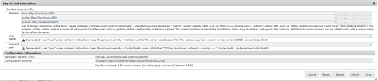

# 통합 [!DNL Adobe Experience Manager Assets] 및 [!DNL Adobe InDesign Server] 통합 {#integrating-aem-assets-with-indesign-server}

[!DNL Adobe Experience Manager Assets] CFP 패키지를:

* 특정 처리 작업의 로드를 배포하는 프록시. 프록시는 특정 작업을 수행하기 위해 프록시 작업자와 통신하는 [!DNL Experience Manager] 인스턴스와 결과를 전달하는 다른 [!DNL Experience Manager] 인스턴스입니다.
* 특정 작업을 정의 및 관리하는 프록시 작업자.
이러한 기능에는 다양한 작업이 포함될 수 있습니다.예를 들어, 를 사용하여 파일을 [!DNL InDesign Server] 처리할 수 있습니다.

프록시로 만든 파일을 완전히 업로드하는 [!DNL Experience Manager Assets] 것이 [!DNL Adobe InDesign] 사용됩니다. 이렇게 하면 프록시 작업자가 사용자와 통신하며 [!DNL Adobe InDesign Server]여기에서 [스크립트를](https://www.adobe.com/devnet/indesign/documentation.html#idscripting) 실행하여 메타데이터를 추출하고 다양한 변환을 [!DNL Experience Manager Assets]생성할 수 있습니다. 프록시 워커는 클라우드 구성에서 인스턴스와 인스턴스 간 양방향 통신을 [!DNL InDesign Server] [!DNL Experience Manager] 활성화합니다.

>[!NOTE]
>
>[!DNL Adobe InDesign] 는 두 개의 별도 서비스로 제공됩니다. [인쇄 및](https://www.adobe.com/products/indesign.html) 디지털 배포를 위한 페이지 레이아웃을 디자인하는 데 사용되는 Adobe InDesign 데스크탑 앱 [Adobe InDesign](https://www.adobe.com/products/indesignserver.html) Server를 사용하면 제작한 컨텐츠를 기반으로 프로그래밍 방식으로 자동화된 문서를 만들 수 [!DNL InDesign]있습니다. ExtendScript 엔진에 인터페이스를 제공하는 서비스로 작동합니다. [스크립트를](https://www.adobe.com/devnet/scripting.html) 작성할 수 [!DNL ExtendScript]있으며 이는 [!DNL JavaScript]비슷한 방식입니다. 스크립트에 대한 자세한 내용은 [!DNL InDesign] https://www.adobe.com/devnet/indesign/documentation.html#idscripting을 [참조하십시오](https://www.adobe.com/devnet/indesign/documentation.html#idscripting).

## 추출 작동 방식 {#how-the-extraction-works}

를 과 통합할 [!DNL Adobe InDesign Server] 수 [!DNL Experience Manager Assets] [!DNL InDesign] 있으므로 에서 만든 INDD 파일을 업로드하고, 표현물을 생성하며, 모든 미디어(예: 비디오)를 추출하여 자산으로 저장할 수 있습니다.

>[!NOTE]
>
>이전 버전의 [!DNL Experience Manager] 경우 XMP와 축소판을 추출할 수 있었지만 이제 모든 미디어를 추출할 수 있습니다.

1. INDD 파일을 업로드합니다 [!DNL Experience Manager Assets].
1. 프레임워크는 명령 스크립트를 SOAP(Simple Object Access Protocol)를 [!DNL InDesign Server] 통해 SOAP로 전송합니다.
이 명령 스크립트는 다음을 수행합니다.

   * INDD 파일을 검색합니다.
   * 실행 [!DNL InDesign Server] 명령:

      * 구조, 텍스트 및 모든 미디어 파일이 추출됩니다.
      * PDF 및 JPG 변환이 생성됩니다.
      * HTML 및 IDML 변환이 생성됩니다.
   * 결과 파일을 다시 에 [!DNL Experience Manager Assets]게시합니다.
   >[!NOTE]
   >
   >IDML 파섹 [!DNL InDesign] ZIP 압축을 사용하여 압축 패키지로 [저장됩니다](https://www.techterms.com/definition/zip) . 자세한 내용은 InDesign Interchange [Formats INX 및 IDML을 참조하십시오](http://www.peachpit.com/articles/article.aspx?p=1381880&amp;seqNum=8).

   >[!CAUTION]
   >
   >INDD 파일이 설치되어 [!DNL InDesign Server] 있지 않거나 구성되지 않은 경우에도 INDD 파일을 에 업로드할 수 [!DNL Experience Manager]있습니다. 그러나 생성된 변환은 PNG 및 JPEG로 제한됩니다. HTML, .idml 또는 페이지 변환을 생성할 수 없습니다.

1. 추출 및 변환 생성 후:

   * 구조가 `cq:Page` (변환 유형)에 복제됩니다.
   * 추출된 텍스트와 파일은 에 저장됩니다 [!DNL Experience Manager Assets].
   * 모든 변환은 자산 자체에 [!DNL Experience Manager Assets]저장됩니다.

## AEM과 [!DNL InDesign Server] 통합 {#integrating-the-indesign-server-with-aem}

프록시를 [!DNL InDesign Server] 구성할 때 및 [!DNL Experience Manager Assets] 구성 후에 사용할 수 있도록 통합하려면 다음을 수행해야 합니다.

1. [InDesign Server를 설치합니다](#installing-the-indesign-server).
1. 필요한 경우 Experience Manager 자산 워크플로우를 [구성합니다](#configuring-the-aem-assets-workflow).
기본값이 인스턴스에 적합하지 않은 경우에만 필요합니다.
1. InDesign Server에 대한 [프록시 작업자 구성을 참조하십시오](#configuring-the-proxy-worker-for-indesign-server).

### 설치 [!DNL InDesign Server]{#installing-the-indesign-server}

를 설치하고 사용할 [!DNL InDesign Server] 수 있도록 시작하려면 [!DNL Experience Manager]다음을 수행하십시오.

1. 를 다운로드하여 설치합니다. [!DNL InDesign Server]Adobe Experience Manager

1. 필요한 경우 [!DNL InDesign Server] 인스턴스의 구성을 사용자 정의할 수 있습니다.

1. 명령줄에서 서버를 시작합니다.

   `<*ids-installation-dir*>/InDesignServer.com -port 8080`

   그러면 포트 8080에서 SOAP 플러그인이 수신 대기하는 상태로 서버가 시작됩니다. 모든 로그 메시지와 출력은 명령 창에 직접 기록됩니다.

   >[!NOTE]
   >
   >출력 메시지를 파일에 저장하려면 리디렉션을 사용합니다.예를 들어 Windows에서 다음을 수행합니다.
   >`<ids-installation-dir>/InDesignServer.com -port 8080 > ~/temp/INDD-logfile.txt 2>&1`

### 워크플로우 [!DNL Experience Manager Assets] 구성 {#configuring-the-aem-assets-workflow}

[!DNL Experience Manager Assets] 에는 DAM Update Asset **[!UICONTROL 가]**&#x200B;사전 구성된 워크플로우 DAM Update Asset이 [!DNL InDesign]있으며, 이 프로세스에는 특별히다음을 위한 몇 가지 절차 단계가 있습니다.

* [미디어 추출](#media-extraction)
* [페이지 추출](#page-extraction)

이 워크플로우는 다양한 작성자 인스턴스에서 설정에 맞게 조정할 수 있는 기본값으로 설정되어 있습니다(표준 워크플로우이므로 워크플로우 편집에서 추가 정보를 [사용할 수 있습니다](/help/sites-developing/workflows-models.md#configuring-a-workflow-step)). 기본값(SOAP 포트 포함)을 사용하는 경우 구성이 필요하지 않습니다.

설정 후, 일반적인 방법 중 하나로 [!DNL InDesign] 파일을 [!DNL Experience Manager Assets] 업로드하면 워크플로우를 트리거하여 자산을 처리하고 다양한 변환을 준비합니다. INDD 파일을 업로드하여 구성을 테스트하여 IDS에서 만든 다른 변환이 [!DNL Experience Manager Assets]`<*your_asset*>.indd/Renditions`

#### Media extraction {#media-extraction}

이 단계는 INDD 파일에서 미디어를 추출하는 것을 제어합니다.

사용자 정의하려면 미디어 추출 **[!UICONTROL 단계의]** 인수 탭을 편집할 **[!UICONTROL 수]** 있습니다.

미디어 추출 인수 및 스크립트 경로

* **ExtendScript 라이브러리**:이는 다른 스크립트에 필요한 간단한 http get/post 메서드 라이브러리입니다.

* **스크립트 확장**:여기에서 다양한 스크립트 조합을 지정할 수 있습니다. 에서 스크립트를 직접 실행하려면 스크립트를 [!DNL InDesign Server]에 저장합니다 `/apps/settings/dam/indesign/scripts`.

Indesign 스크립트에 대한 자세한 내용은 InDesign [개발자 설명서를 참조하십시오](https://www.adobe.com/devnet/indesign/documentation.html#idscripting)

>[!CAUTION]
>
>ExtendScript 라이브러리를 변경하지 마십시오. 이 라이브러리는 Sling과 통신하는 데 필요한 HTTP 기능을 제공합니다. 이 설정은 사용할 라이브러리로 전송할 라이브러리를 [!DNL InDesign Server] 지정합니다.

미디어 추출 워크플로우 단계에서 실행되는 `ThumbnailExport.jsx` 스크립트는 축소판 변환을 JPG 형식으로 생성합니다. 이 변환은 [축소판 처리] 워크플로우 단계에서 필요한 정적 표현물을 생성하는 데 사용됩니다 [!DNL Experience Manager].

다른 크기로 정적 변환을 생성하도록 [축소판 처리] 워크플로우 단계를 구성할 수 있습니다. 기본값이 [!DNL Experience Manager Assets] 인터페이스에 필요하므로 해당 기본값을 제거하지 않도록 하십시오. 마지막으로 이미지 미리 보기 변환 삭제 워크플로우 단계에서는 더 이상 필요하지 않으므로 .jpg 축소판 변환을 제거합니다.

#### Page extraction {#page-extraction}

이렇게 하면 추출된 요소에서 [!DNL Experience Manager] 페이지가 만들어집니다. 추출 핸들러는 변환에서 데이터를 추출하는 데 사용됩니다(현재 HTML 또는 IDML). 그런 다음 이 데이터를 사용하여 PageBuilder를 사용하여 페이지를 만듭니다.

사용자 정의하려면 페이지 추출 **[!UICONTROL 단계의]** 인수 탭을 편집할 **[!UICONTROL 수]** 있습니다.

* **페이지 추출 처리기**:팝업 목록에서 사용할 처리기를 선택합니다. 추출 핸들러는 관련 API `RenditionPicker` 를 통해 선택한 특정 변환에서 작동합니다 `ExtractionHandler` . 표준 [!DNL Experience Manager] 설치에서는 다음을 사용할 수 있습니다.
   * IDML 내보내기 추출 핸들:MediaExtract 단계에서 생성된 `IDML` 변환에서 작동합니다.

* **페이지 이름**:결과 페이지에 지정할 이름을 지정합니다. 비워 두면 이름이 &quot;page&quot;(또는 &quot;page&quot;가 이미 존재하는 경우 파생됨)가 됩니다.

* **페이지 제목**:결과 페이지에 지정할 제목을 지정합니다.

* **페이지 루트 경로**:결과 페이지의 루트 위치에 대한 경로입니다. 비워 두면 자산의 표현물을 포함하는 노드가 사용됩니다.

* **페이지 템플릿**:결과 페이지를 생성할 때 사용할 템플릿입니다.

* **페이지 디자인**:결과 페이지를 생성할 때 사용할 페이지 디자인입니다.

### 프록시 작업자 [!DNL InDesign Server] 구성 {#configuring-the-proxy-worker-for-indesign-server}

>[!NOTE]
>
>워커는 프록시 인스턴스에 상주합니다.

1. 도구 콘솔의 왼쪽 창에서 **[!UICONTROL 클라우드 서비스]** 구성을 확장합니다. 그런 다음 클라우드 **[!UICONTROL 프록시 구성을 확장합니다]**.

1. IDS **[!UICONTROL 작업자를]** 두 번 클릭하여 구성을 엽니다.

1. 편집을 **[!UICONTROL 클릭하여]** 구성 대화 상자를 열고 필요한 설정을 정의합니다.

   

   * **IDS**&#x200B;풀 [!DNL InDesign Server]SOAP 끝점입니다. 항목을 추가, 제거 및 주문할 수 있습니다.

1. 확인을 클릭하여 저장합니다.

### 일 CQ 링크 외부라이저 구성 {#configuring-day-cq-link-externalizer}

다른 호스트 또는 두 호스트 중 하나 또는 둘 다에서 [!DNL InDesign Server] 및 [!DNL Experience Manager] 이 응용 프로그램이 모두 기본 포트에서 실행되지 않으면 [!UICONTROL Day CQ Link Externalizer] 를 구성하여 해당 호스트 이름, 포트 및 컨텐트 경로를 [!DNL InDesign Server]설정합니다.

1. 에서 웹 콘솔에 액세스합니다 `https://[aem_server]:[port]/system/console/configMgr`.
1. Day CQ Link **[!UICONTROL Externalizer 구성을]**&#x200B;찾아 편집을 **[!UICONTROL 눌러]** 엽니다.
1. 호스트 이름과 컨텍스트 경로를 [!DNL Indesign Server] 지정하고 저장을 **클릭합니다**.

   

### 병렬 작업 처리 [!DNL InDesign Server] 활성화 {#enabling-parallel-job-processing-for-indesign-server-s}

이제 ID에 대한 병렬 작업 처리를 활성화할 수 있습니다. 처리할 수 있는 최대 병렬 작업 수(`x`) [!DNL InDesign Server] 를 결정합니다.

* 단일 다중 프로세서 시스템에서 처리할 수 있는 최대 병렬 작업(`x`[!DNL InDesign Server] )은 IDS를 실행하는 프로세서 수보다 1개 적습니다.
* 여러 컴퓨터에서 IDS를 실행하는 경우 사용 가능한 프로세서(예: 모든 컴퓨터에서)의 총 수를 계산해야 합니다. 그런 다음 총 시스템 수를 빼야 합니다.

병렬 ID 작업 수를 구성하려면:

1. Felix **[!UICONTROL Console]** 의 구성 탭을 엽니다.예를 들면 다음과 같습니다. `https://[aem_server]:[port]/system/console/configMgr`Adobe

1. 아래에서 IDS 처리 큐를 `Apache Sling Job Queue Configuration`선택합니다.

1. 설정:

   * **유형** - `Parallel`
   * **최대 병렬 작업** - `<*x*>` (위에서 계산됨)

1. 이러한 변경 사항을 저장합니다.
1. Adobe CS6 이상 버전에 대한 다중 세션 지원을 활성화하려면 구성 `enable.multisession.name` 아래의 확인란을 `com.day.cq.dam.ids.impl.IDSJobProcessor.name` 선택하십시오.
1. IDS 작업자 구성에 [`x`](#configuring-the-proxy-worker-for-indesign-server)SOAP 끝점을 추가하여 IDS 작업자 풀을 만듭니다.

   실행 중인 컴퓨터가 여러 개인 [!DNL InDesign Server]경우 각 컴퓨터에 대해 SOAP 끝점(시스템당 프로세서 수 -1)을 추가합니다.

   >[!NOTE]
   >
   >근로자 풀을 사용하여 작업할 때 ID 근로자의 블랙리스트 사용을 선택할 수 있습니다.
   >
   >
   >이렇게 하려면 IDS 작업 검색을 활성화하는 **[!UICONTROL 구성 아래에서 enable.retry.name]** `com.day.cq.dam.ids.impl.IDSJobProcessor.name` 확인란을 활성화합니다.
   >
   >
   >또한, `com.day.cq.dam.ids.impl.IDSPoolImpl.name` 구성 아래에서 IDS를 작업 처리기 목록에서 제외하기 전에 작업 검색의 수를 결정하는 매개 변수에 대한 양수 값을 `max.errors.to.blacklist` 설정합니다.
   >
   >
   >기본적으로 구성 가능한(retry.interval.to.whitelist.name) 시간(분 단위) 후 IDS 워커의 유효성을 다시 검사해야 합니다. 이 씨가 온라인에서 발견되면 블랙 리스트에서 제거됩니다.

## 10.0 [!DNL InDesign Server] 이상 지원 활성화 {#enabling-support-for-indesign-server-or-later}

10.0 [!DNL InDesign Server] 이상의 경우 다음 단계를 수행하여 다중 세션 지원을 활성화합니다.

1. [!DNL Experience Manager Assets] 인스턴스에서 구성 관리자를 엽니다 `https://[aem_server]:[port]/system/console/configMgr`.
1. 구성을 `com.day.cq.dam.ids.impl.IDSJobProcessor.name`편집합니다.
1. ids.cc.en **[!UICONTROL 사용]** 가능 옵션을 선택하고 [저장]을 **[!UICONTROL 클릭합니다]**.

>[!NOTE]
>
>통합에 필요한 세션 지원 기능은 단일 코어 시스템에서 지원되지 않으므로 [!DNL InDesign Server] [!DNL Experience Manager Assets]멀티코어 프로세서를 사용하십시오.

## 자격 증명 [!DNL Experience Manager] 구성 {#configure-aem-credentials}

기본 관리자 자격 증명(사용자 이름 및 암호)을 변경하여 [!DNL InDesign Server] 인스턴스와의 통합을 중단하지 않고 [!DNL Experience Manager] 인스턴스에서 액세스할 수 [!DNL InDesign Server]있습니다.

1. 이동 `/etc/cloudservices/proxy.html`.
1. 대화 상자에서 새 사용자 이름과 암호를 지정합니다.
1. 자격 증명을 저장합니다.

>[!MORELIKETHIS]
>
>* [Adobe InDesign Server 정보](https://www.adobe.com/products/indesignserver/faq.html)

