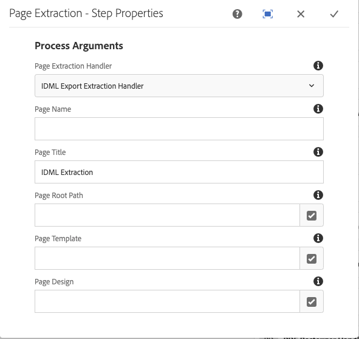

# 통합 [!DNL Adobe Experience Manager Assets] 포함 [!DNL Adobe InDesign Server] {#integrating-aem-assets-with-indesign-server}

[!DNL Adobe Experience Manager Assets] 사용:

* 특정 처리 작업의 로드를 분산하는 프록시입니다. 프록시는 [!DNL Experience Manager] 프록시 작업자와 통신하여 특정 작업을 수행하는 인스턴스 및 기타 [!DNL Experience Manager] 인스턴스: 결과를 전달합니다.
* 특정 작업을 정의하고 관리하는 프록시 작업자입니다.
다음과 같은 다양한 작업을 수행할 수 있습니다. 예를 들어 [!DNL InDesign Server] 을 클릭하여 파일을 처리합니다.

파일을 완전히 업로드하려면 [!DNL Experience Manager Assets] 을(를) 생성했습니다. [!DNL Adobe InDesign] 프록시가 사용됩니다. 프록시 작업자를 사용하여 [!DNL Adobe InDesign Server], 여기서 [스크립트](https://www.adobe.com/devnet/indesign/documentation.html#idscripting) 를 실행하여 메타데이터를 추출하고 다양한 렌디션을 생성합니다. [!DNL Experience Manager Assets]. 프록시 작업자는 [!DNL InDesign Server] 및 [!DNL Experience Manager] 클라우드 구성의 인스턴스입니다.

>[!NOTE]
>
>[!DNL Adobe InDesign] 는 두 개의 개별 오퍼로 제공됩니다. [Adobe InDesign](https://www.adobe.com/products/indesign.html) 인쇄 및 디지털 배포를 위한 페이지 레이아웃을 디자인하는 데 사용되는 데스크탑 앱입니다. [Adobe InDesign Server](https://www.adobe.com/products/indesignserver.html) 를 사용하면 로 만든 내용을 기반으로 자동화된 문서를 프로그래밍 방식으로 만들 수 있습니다 [!DNL InDesign]. 해당 ID에 대한 인터페이스를 제공하는 서비스로 작동합니다 [ExtendScript](https://www.adobe.com/devnet/indesign/documentation.html#idscripting) engine.scripts are written in [!DNL ExtendScript], 유사함 [!DNL JavaScript]. 다음에 대한 정보: [!DNL InDesign] 스크립트 참조 [https://www.adobe.com/devnet/indesign/documentation.html#idscripting](https://www.adobe.com/devnet/indesign/documentation.html#idscripting).

## 추출 작동 방식 {#how-the-extraction-works}

다음 [!DNL Adobe InDesign Server] 통합 가능 [!DNL Experience Manager Assets] INDD 파일이 [!DNL InDesign] 업로드, 렌디션 생성, 모든 미디어 추출(예: 비디오), 에셋으로 저장 등의 작업을 수행할 수 있습니다.

>[!NOTE]
>
>의 이전 버전 [!DNL Experience Manager] XMP과 썸네일을 추출할 수 있었지만, 이제 모든 미디어를 추출할 수 있습니다.

1. INDD 파일 업로드 [!DNL Experience Manager Assets].
1. 프레임워크는 명령 스크립트를 [!DNL InDesign Server] SOAP(단순 개체 액세스 프로토콜)를 통해
이 명령 스크립트는 다음을 수행합니다.

   * INDD 파일을 검색합니다.
   * 실행 [!DNL InDesign Server] 명령:

      * 구조, 텍스트 및 모든 미디어 파일이 추출됩니다.
      * PDF 및 JPG 렌디션이 생성됩니다.
      * HTML 및 IDML 렌디션이 생성됩니다.

   * 결과 파일을에 다시 게시 [!DNL Experience Manager Assets].

   >[!NOTE]
   >
   >IDML은 의 모든 콘텐츠를 렌더링하는 XML 기반 형식입니다 [!DNL InDesign] 파일. 다음을 사용하여 압축된 패키지로 저장됩니다. [ZIP](https://www.techterms.com/definition/zip) 압축. 자세한 내용은 [InDesign 교환 형식 INX 및 IDML](https://www.peachpit.com/articles/article.aspx?p=1381880&amp;seqNum=8).

   >[!CAUTION]
   >
   >다음과 같은 경우 [!DNL InDesign Server] 이(가) 설치되지 않았거나 구성되지 않았으므로 INDD 파일을에 업로드할 수 있습니다 [!DNL Experience Manager]. 그러나 생성된 렌디션은 PNG 및 JPEG으로 제한됩니다. HTML, .idml 또는 페이지 표현물을 생성할 수 없습니다.

1. 추출 및 렌디션 생성 후:

   * 구조가 로 복제됩니다. `cq:Page` (렌디션 유형).
   * 추출된 텍스트와 파일은에 저장됩니다. [!DNL Experience Manager Assets].
   * 모든 렌디션은에 저장됩니다. [!DNL Experience Manager Assets]를 입력합니다.

## 통합 [!DNL InDesign Server] Experience Manager 포함 {#integrating-the-indesign-server-with-aem}

를 통합하려면 [!DNL InDesign Server] (와 함께 사용) [!DNL Experience Manager Assets] 프록시를 구성한 후 다음을 수행해야 합니다.

1. [InDesign Server 설치](#installing-the-indesign-server).
1. 필요한 경우 [Experience Manager Assets 워크플로우 구성](#configuring-the-aem-assets-workflow).
기본값이 인스턴스에 적합하지 않은 경우에만 필요합니다.
1. 구성 [InDesign Server 프록시 작업자](#configuring-the-proxy-worker-for-indesign-server).

### 설치 [!DNL InDesign Server] {#installing-the-indesign-server}

을(를) 설치하고 시작하려면 [!DNL InDesign Server] (와 함께 사용) [!DNL Experience Manager]:

1. 다운로드 및 설치 [!DNL InDesign Server].

1. 필요한 경우 의 구성을 사용자 정의할 수 있습니다. [!DNL InDesign Server] 인스턴스.

1. 명령줄에서 서버를 시작합니다.

   `<*ids-installation-dir*>/InDesignServer.com -port 8080`

   이렇게 하면 포트 8080에서 수신하는 SOAP 플러그인으로 서버가 시작됩니다. 모든 로그 메시지와 출력은 명령 창에 직접 기록됩니다.

   >[!NOTE]
   >
   >출력 메시지를 파일에 저장하려면 리디렉션을 사용합니다(예: Windows에서).
   >`<ids-installation-dir>/InDesignServer.com -port 8080 > ~/temp/INDD-logfile.txt 2>&1`

### 구성 [!DNL Experience Manager Assets] 워크플로우 {#configuring-the-aem-assets-workflow}

[!DNL Experience Manager Assets] 에는 사전 구성된 워크플로가 있습니다. **[!UICONTROL DAM 자산 업데이트]**&#x200B;를 설정하는 데 필요한 몇 가지 프로세스 단계를 [!DNL InDesign]:

* [미디어 추출](#media-extraction)
* [페이지 추출](#page-extraction)

이 워크플로우는 다양한 작성자 인스턴스에서 설정에 적용할 수 있는 기본값으로 설정됩니다(표준 워크플로이므로, 다음에서 추가 정보를 사용할 수 있습니다. [워크플로우 편집](/help/sites-developing/workflows-models.md#configuring-a-workflow-step)). 기본값(SOAP 포트 포함)을 사용하는 경우 구성이 필요하지 않습니다.

설정 후 업로드 [!DNL InDesign] 에 있는 파일 [!DNL Experience Manager Assets] (일반적인 방법 중 하나를 사용하여) 워크플로우를 트리거하여 에셋을 처리하고 다양한 렌디션을 준비합니다. INDD 파일을에 업로드하여 구성을 테스트합니다 [!DNL Experience Manager Assets] 를 클릭하여 아래 ID에서 만든 다른 렌디션이 표시되는지 확인합니다. `<*your_asset*>.indd/Renditions`

#### 미디어 추출 {#media-extraction}

이 단계는 INDD 파일에서 미디어 추출을 제어합니다.

To customize, you can edit **[!UICONTROL Arguments]** tab of the **[!UICONTROL Media Extraction]** step.

미디어 추출 인수 및 스크립트 경로

* **ExtendScript 라이브러리**: 다른 스크립트에 필요한 간단한 http get/post 메서드 라이브러리입니다.

* **스크립트 확장**: 여기에서 다양한 스크립트 조합을 지정할 수 있습니다. 에서 고유한 스크립트를 실행하려면 [!DNL InDesign Server], 다음 위치에 스크립트 저장 `/apps/settings/dam/indesign/scripts`.

<!-- TBD: Hiding this link since ADC is not available anymore. 
For information about [!DNL Adobe InDesign] scripts, see [InDesign developer documentation](https://www.adobe.com/devnet/indesign/documentation.html#idscripting).
-->

>[!CAUTION]
>
>Do not change the ExtendScript library. 이 라이브러리는 Sling과 통신하는 데 필요한 HTTP 기능을 제공합니다. 이 설정은 로 보낼 라이브러리를 지정합니다. [!DNL InDesign Server] 거기에서 사용할 수 있습니다.

다음 `ThumbnailExport.jsx` 미디어 추출 워크플로우 단계에서 실행되는 스크립트는 JPG 형식의 썸네일 렌디션을 생성합니다. 이 렌디션은 프로세스 썸네일 워크플로 단계에서 필요한 정적 렌디션을 생성하는 데 사용됩니다. [!DNL Experience Manager].

프로세스 축소판 워크플로 단계를 구성하여 다양한 크기의 정적 렌디션을 생성할 수 있습니다. 기본값은 다음에 필요하므로 제거하지 마십시오. [!DNL Experience Manager Assets] 인터페이스. 마지막으로, 이미지 미리 보기 렌디션 삭제 워크플로 단계에서는 더 이상 필요하지 않으므로 JPG 썸네일 렌디션을 제거합니다.

#### 페이지 추출 {#page-extraction}

이렇게 하면 [!DNL Experience Manager] 추출된 요소의 페이지 추출 핸들러는 렌디션(현재 HTML 또는 IDML)에서 데이터를 추출하는 데 사용됩니다. 그런 다음 PageBuilder를 사용하여 페이지를 만드는 데 이 데이터를 사용합니다.

To customize, you can edit the **[!UICONTROL Arguments]** tab of the **[!UICONTROL Page Extraction]** step.

* **페이지 추출 핸들러**: 팝업 목록에서 사용할 핸들러를 선택합니다. 추출 처리기는 관련 사용자가 선택한 특정 렌디션에 대해 작동합니다 `RenditionPicker` (다음을 참조하십시오. `ExtractionHandler` API). 표준 [!DNL Experience Manager] 설치 사용 가능한 것은 다음과 같습니다.
   * IDML 내보내기 추출 핸들: `IDML` mediaExtract 단계에서 생성된 렌디션입니다.

* **페이지 이름**: 결과 페이지에 지정할 이름을 지정합니다. 비워 두면 이름은 &quot;page&quot;(또는 &quot;page&quot;가 이미 있으면 파생)입니다.

* **페이지 제목**: 결과 페이지에 지정할 제목을 지정합니다.

* **페이지 루트 경로**: 결과 페이지의 루트 위치에 대한 경로입니다. 비워 두면 에셋의 렌디션이 포함된 노드가 사용됩니다.

* **페이지 템플릿**: 결과 페이지를 생성할 때 사용할 템플릿입니다.

* **페이지 디자인**: 결과 페이지를 생성할 때 사용할 페이지 디자인입니다.

### 프록시 작업자 구성 [!DNL InDesign Server] {#configuring-the-proxy-worker-for-indesign-server}

>[!NOTE]
>
>작업자는 프록시 인스턴스에 상주합니다.

1. 도구 콘솔에서 을 확장합니다. **[!UICONTROL Cloud Service 구성]** 왼쪽 창에서 을 클릭합니다. 그런 다음 를 확장합니다 **[!UICONTROL 클라우드 프록시 구성]**.

1. Double-click the **[!UICONTROL IDS worker]** to open for configuration.

1. 클릭 **[!UICONTROL 편집]** 구성 대화 상자를 열고 필요한 설정을 정의하려면

   

   * **IDS 풀**
와 통신하는 데 사용할 SOAP 끝점 [!DNL InDesign Server]. 항목을 추가, 제거 및 주문해야 합니다.

1. 확인 을 클릭하여 저장합니다.

### 일별 CQ 링크 외부화 구성 {#configuring-day-cq-link-externalizer}

다음과 같은 경우 [!DNL InDesign Server] 및 [!DNL Experience Manager] 다른 호스트에 있거나 이러한 애플리케이션 중 하나 또는 둘 다가 기본 포트에서 작동하지 않는 경우 [!UICONTROL 일별 CQ 링크 외부화] 에 대한 호스트 이름, 포트 및 콘텐츠 경로를 설정하려면 [!DNL InDesign Server].

1. 웹 콘솔 액세스 `https://[aem_server]:[port]/system/console/configMgr`.
1. 구성 찾기 **[!UICONTROL 일별 CQ 링크 외부화]**. 클릭 **[!UICONTROL 편집]** 열게요.
1. 링크 외부화 설정은 의 절대 URL을 만드는 데 도움이 됩니다. [!DNL Experience Manager] 배포 및 대상 [!DNL InDesign Server]. 사용 **[!UICONTROL 도메인]** 에 대한 호스트 이름을 지정하는 필드 [!DNL Adobe InDesign Server]. **저장**&#x200B;을 클릭합니다.

   절대 URL에서 `localhost` 로컬(작성자) 인스턴스의 호스트 이름으로, 다음 그림과 같이 게시 인스턴스의 호스트 이름 또는 IP 주소로 사용됩니다.

   

### 병렬 작업 처리 활성화 [!DNL InDesign Server] {#enabling-parallel-job-processing-for-indesign-server}

이제 ID에 대해 병렬 작업 처리를 활성화할 수 있습니다. 최대 병렬 작업 수 결정(`x`) [!DNL InDesign Server] 다음을 처리할 수 있습니다.

* 단일 다중 프로세서 시스템에서 최대 병렬 작업 수(`x`) [!DNL InDesign Server] 은(는) ID를 실행하는 프로세서 수보다 한 개 적습니다.
* 여러 시스템에서 ID를 실행하는 경우 사용 가능한 총 프로세서 수(즉, 모든 시스템에서)를 계산한 다음 총 시스템 수를 빼야 합니다.

병렬 ID 작업 수를 구성하려면 다음을 수행합니다.

1. 를 엽니다. **[!UICONTROL 구성]** Felix 콘솔의 탭입니다. 예: `https://[aem_server]:[port]/system/console/configMgr`.

1. 아래에서 IDS 처리 큐 선택 `Apache Sling Job Queue Configuration`.

1. 설정:

   * **유형** - `Parallel`
   * **최대 병렬 작업** - `<*x*>` (위에서 계산됨)

1. 이러한 변경 사항을 저장합니다.
1. Adobe CS6 이상에 대한 다중 세션 지원을 활성화하려면 다음을 확인합니다 `enable.multisession.name` 확인란, `com.day.cq.dam.ids.impl.IDSJobProcessor.name` 구성.
1. 만들기 [풀 `x` IDS 작업자 구성에 SOAP 끝점을 추가하여 IDS 작업자](#configuring-the-proxy-worker-for-indesign-server).

   실행 중인 시스템이 여러 개인 경우 [!DNL InDesign Server]각 시스템에 대한 SOAP 끝점(시스템당 프로세서 수 -1)을 추가합니다.

<!-- 
TBD: Make updates to configurations for allow and block list after product updates are done.
-->

>[!NOTE]
>
>작업자 풀로 작업할 때 IDS 작업자 차단 목록을 활성화할 수 있습니다.
>
>이렇게 하려면 **[!UICONTROL enable.retry.name]** 확인란, `com.day.cq.dam.ids.impl.IDSJobProcessor.name` IDS 작업 재검색을 활성화하는 구성
>
>또한 `com.day.cq.dam.ids.impl.IDSPoolImpl.name` 구성, 다음에 대한 양의 값 설정 `max.errors.to.blacklist` 작업 핸들러 목록에서 ID를 중단하기 전에 작업 재시도 횟수를 결정하는 매개 변수입니다.
>
>기본적으로 구성 가능한 (`retry.interval.to.whitelist.name`) IDS 작업자의 유효성을 다시 검사하는 시간(분)입니다. 작업자가 온라인에서 발견되는 경우 해당 작업자는 차단 목록에서 제거됩니다.

## 다음에 대한 지원 활성화 [!DNL InDesign Server] 10.0 이상 {#enabling-support-for-indesign-server-or-later}

대상 [!DNL InDesign Server] 10.0 이상: 다중 세션 지원을 활성화하려면 다음 단계를 수행하십시오.

1. 에서 구성 관리자 열기 [!DNL Experience Manager Assets] 인스턴스 `https://[aem_server]:[port]/system/console/configMgr`.
1. 구성 편집 `com.day.cq.dam.ids.impl.IDSJobProcessor.name`.
1. 다음 항목 선택 **[!UICONTROL ids.cc.enable]** 옵션 및 클릭 **[!UICONTROL 저장]**.

>[!NOTE]
>
>대상 [!DNL InDesign Server] 과 통합 [!DNL Experience Manager Assets]통합에 필요한 세션 지원 기능이 단일 코어 시스템에서 지원되지 않으므로 멀티 코어 프로세서를 사용합니다.

## 구성 [!DNL Experience Manager] 자격 증명 {#configure-aem-credentials}

에 액세스하기 위한 기본 관리자 자격 증명(사용자 이름 및 암호)을 변경할 수 있습니다. [!DNL InDesign Server] (으)로부터 [!DNL Experience Manager] 와 통합을 중단하지 않고 배포 [!DNL InDesign Server].

1. `/etc/cloudservices/proxy.html`로 이동합니다.
1. 대화 상자에서 새 사용자 이름과 암호를 지정합니다.
1. 자격 증명을 저장합니다.

>[!MORELIKETHIS]
>
>* [Adobe InDesign Server 정보](https://www.adobe.com/products/indesignserver/faq.html)
