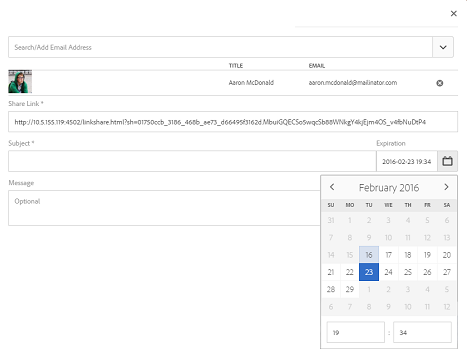

# 링크로 자산 공유 {#asset-link-sharing}

| 버전 | 문서 링크 |
| -------- | ---------------------------- |
| AEM as a Cloud Service | [여기 클릭](https://experienceleague.adobe.com/docs/experience-manager-cloud-service/content/assets/manage/share-assets.html?lang=ko) |
| AEM 6.5 | 이 문서 |

[!DNL Adobe Experience Manager Assets]을(를) 사용하면 조직 구성원 및 외부 엔터티(파트너 및 공급업체 포함)와 URL로 자산, 폴더 및 컬렉션을 공유할 수 있습니다. 링크를 통해 자산을 공유하면 [!DNL Assets]에 처음 로그인할 필요 없이 외부 당사자가 리소스를 사용할 수 있는 편리한 방법입니다.

>[!PREREQUISITES]
>
>* 링크로 공유할 폴더 또는 자산에 대한 `Edit ACL` 권한이 필요합니다.
>* 사용자에게 전자 메일을 보내려면 [일 CQ 메일 서비스](#configmailservice)에서 SMTP 서버 세부 정보를 구성하십시오.

## 자산 공유 {#share-assets}

사용자와 공유할 자산의 URL을 생성하려면 [!UICONTROL 링크 공유] 대화 상자를 사용합니다.

* 관리자 권한이 있거나 `/var/dam/share` 위치에서 읽기 권한이 있는 사용자는 사용자와 공유된 링크를 볼 수 있습니다.
* `/var/dam/jobs/download` 위치에서 읽기 권한이 있는 사용자는 공유 링크에서 자산을 다운로드할 수 있습니다.

1. [!DNL Assets] 사용자 인터페이스에서 링크로 공유할 자산을 선택합니다.

1. 도구 모음에서 **[!UICONTROL 링크 공유]** 을 클릭합니다. **[!UICONTROL 공유]**&#x200B;를 클릭한 후 만들어진 링크는 [!UICONTROL 링크 공유] 필드에 미리 표시됩니다. **[!UICONTROL 제출]**&#x200B;을(를) 선택할 때까지 링크가 만들어지지 않습니다.

   

   *그림: 링크로 자산을 공유할 수 있는 대화 상자.*

1. In the email address box of the **[!UICONTROL Link Sharing]** dialog, type the email ID of the user you want to share the link with. 한 명 이상의 사용자를 추가할 수 있습니다.

   >[!NOTE]
   >
   >조직의 구성원이 아닌 사용자의 전자 메일 ID를 입력하면 [!UICONTROL 외부 사용자]라는 단어 앞에 사용자의 전자 메일 ID가 붙습니다.

1. **[!UICONTROL 제목]** 상자에 공유할 에셋의 제목을 입력합니다.

1. **[!UICONTROL 메시지]** 상자에 선택적 메시지를 입력하십시오.

1. **[!UICONTROL 만료]** 필드에서 링크 작동을 중지할 만료 날짜와 시간을 지정합니다. 링크의 기본 만료 시간은 1일입니다.

   

1. 사용자가 원본 에셋을 다운로드할 수 있도록 하려면 **[!UICONTROL 원본 파일 다운로드 허용]**&#x200B;을 선택하세요. 사용자가 공유 에셋의 렌디션만 다운로드하도록 하려면 **[!UICONTROL 파일 렌디션 다운로드 허용]**&#x200B;을 선택합니다.

1. **[!UICONTROL 공유]**&#x200B;를 클릭합니다. 링크가 이메일을 통해 사용자와 공유됨을 확인하는 메시지가 표시됩니다.

1. 공유 에셋을 보려면 사용자에게 전송된 이메일의 링크를 클릭합니다. 에셋 미리보기를 생성하려면 공유 에셋을 클릭합니다. 미리 보기를 닫으려면 **[!UICONTROL 뒤로]**&#x200B;를 클릭하세요. 폴더를 공유한 경우 **[!UICONTROL 상위 폴더]**&#x200B;를 클릭하여 상위 폴더로 돌아갑니다.

   

   >[!NOTE]
   >
   >[!DNL Experience Manager]에서는 [지원되는 파일 형식](/help/assets/assets-formats.md)의 에셋 미리 보기 생성만 지원합니다. 다른 MIME 유형이 공유되는 경우 에셋만 다운로드할 수 있으며 미리 볼 수 없습니다.

1. 공유 에셋을 다운로드하려면 도구 모음에서 **[!UICONTROL 선택]**&#x200B;을 클릭하고 에셋을 클릭한 다음 도구 모음에서 **[!UICONTROL 다운로드]**&#x200B;를 클릭합니다.

   

1. 링크로 공유한 자산을 보려면 [!DNL Assets] 사용자 인터페이스로 이동하여 [!DNL Experience Manager] 로고를 클릭하십시오. **[!UICONTROL 탐색]**&#x200B;을 선택하세요. 탐색 창에서 **[!UICONTROL 공유 링크]**&#x200B;를 선택하여 공유 에셋 목록을 표시합니다.

1. 에셋의 공유를 취소하려면 에셋을 선택하고 도구 모음에서 **[!UICONTROL 공유 취소]**&#x200B;를 클릭합니다. 확인 메시지가 표시됩니다. 에셋의 항목이 목록에서 제거됩니다.

## 일별 CQ 메일 서비스 구성 {#configure-day-cq-mail-service}

1. [!DNL Experience Manager] 홈 페이지에서 **[!UICONTROL 도구]** > **[!UICONTROL 작업]** > **[!UICONTROL 웹 콘솔]**&#x200B;로 이동합니다.
1. 서비스 목록에서 **[!UICONTROL 일 CQ 메일 서비스]**&#x200B;를 찾습니다.
1. 서비스 옆의 **[!UICONTROL 편집]**&#x200B;을 클릭하고 **[!UICONTROL 일 CQ 메일 서비스]**&#x200B;에 대해 다음 매개 변수를 해당 이름에 대해 언급된 세부 정보로 구성합니다.

   * SMTP 서버 호스트 이름: 전자 메일 서버 호스트 이름
   * SMTP 서버 포트: 전자 메일 서버 포트
   * SMTP 사용자: 전자 메일 서버 사용자 이름
   * SMTP 암호: 전자 메일 서버 암호

   

1. **[!UICONTROL 저장]**&#x200B;을 클릭합니다.

## 최대 데이터 크기 구성 {#configure-maximum-data-size}

링크 공유 기능을 사용하여 공유된 링크에서 자산을 다운로드하면 [!DNL Experience Manager]에서 저장소의 자산 계층 구조를 압축한 다음 ZIP 파일에 있는 자산을 반환합니다. 그러나 ZIP 파일에서 압축할 수 있는 데이터 양에 대한 제한이 없는 경우 엄청난 양의 데이터가 압축되어 JVM에서 메모리 부족 오류가 발생합니다. 이 상황으로 인해 발생할 수 있는 서비스 거부 공격으로부터 시스템을 보호하려면 Configuration Manager의 **[!UICONTROL Day CQ DAM 임시 자산 공유 프록시 서블릿]**&#x200B;에 대한 **[!UICONTROL 최대 콘텐츠 크기(압축되지 않음)]** 매개 변수를 사용하여 최대 크기를 구성하십시오. 자산의 압축되지 않은 크기가 구성된 값을 초과하는 경우 자산 다운로드 요청이 거부됩니다. 기본값은 100MB입니다.

1. [!DNL Experience Manager] 로고를 클릭한 다음 **[!UICONTROL 도구]** > **[!UICONTROL 작업]** > **[!UICONTROL 웹 콘솔]**(으)로 이동합니다.
1. 웹 콘솔에서 **[!UICONTROL 일 CQ DAM 임시 자산 공유 프록시 서블릿]** 구성을 찾습니다.
1. Open the **[!UICONTROL Day CQ DAM Adhoc Asset Share Proxy Servlet]** configuration in edit mode, and modify the value of the **[!UICONTROL Max Content Size (uncompressed)]** parameter.

   

1. 변경 사항을 저장합니다.

## 우수 사례 및 문제 해결 {#best-practices-and-troubleshooting}

* 이름에 공백이 포함된 에셋 폴더 또는 컬렉션은 공유되지 않을 수 있습니다.
* 사용자가 공유 에셋을 다운로드할 수 없는 경우 [!DNL Experience Manager] 관리자에게 [다운로드 제한](#configure-maximum-data-size)을(를) 확인하십시오.
* 공유 에셋에 대한 링크가 포함된 전자 메일을 보낼 수 없거나 다른 사용자가 전자 메일을 받을 수 없는 경우 [전자 메일 서비스](#configure-day-cq-mail-service)가 구성되어 있는지 여부를 [!DNL Experience Manager] 관리자에게 문의하십시오.
* 링크 공유 기능을 사용하여 에셋을 공유할 수 없는 경우 적절한 권한이 있는지 확인하십시오. [자산 공유](#share-assets)를 참조하세요.
* 공유 에셋을 다른 위치로 이동하면 해당 링크가 작동하지 않습니다. 링크를 다시 만들고 사용자와 다시 공유합니다.

* [!DNL Experience Manager] 작성자 배포의 링크를 외부 엔터티에 공유하려면 `GET` 요청에 대해서만 링크 공유에 사용되는 다음 URL만 노출해야 합니다. 보안상의 이유로 다른 URL 차단

   * `http://[aem_server]:[port]/linkshare.html`
   * `http://[aem_server]:[port]/linksharepreview.html`
   * `http://[aem_server]:[port]/linkexpired.html`

  [!DNL Experience Manager] 인터페이스에서 **[!UICONTROL 도구]** > **[!UICONTROL 작업]** > **[!UICONTROL 웹 콘솔]**&#x200B;에 액세스합니다. **[!UICONTROL 일 CQ 링크 외부화]** 구성을 열고 **[!UICONTROL 도메인]** 필드에서 `local`, `author` 및 `publish`에 대해 언급된 값으로 다음 속성을 수정합니다. `local` 및 `author` 속성의 경우 각각 로컬 및 작성자 인스턴스의 URL을 제공하십시오. 단일 [!DNL Experience Manager] 작성자 인스턴스를 실행하는 경우 `local` 및 `author` 속성에 동일한 값을 사용하십시오. Publish 인스턴스의 경우 [!DNL Experience Manager] Publish 인스턴스의 URL을 제공하십시오.
