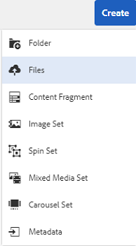
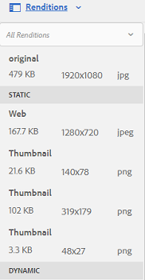
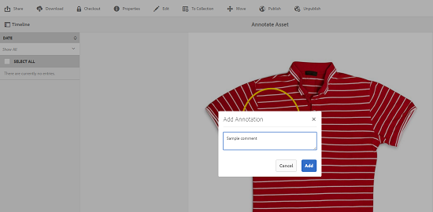
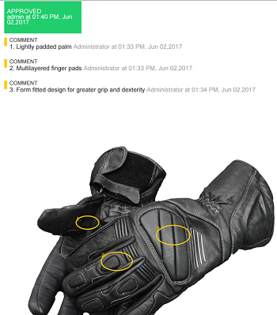

# 디지털 자산 관리 {#manage-digital-assets}

[!DNL Adobe Experience Manager Assets]에서는 에셋을 저장하고 관리하는 것 이상의 작업을 수행할 수 있습니다. [!DNL Experience Manager] 엔터프라이즈급 에셋 관리 기능을 제공합니다. 에셋을 편집 및 공유하고, 고급 검색을 실행하고, 지원되는 수십 개의 파일 포맷으로 구성된 여러 변환을 만들고, 버전과 디지털 권한을 관리하고, 에셋 처리를 자동화하고, 메타데이터를 관리 및 제어하고, 주석을 사용하여 공동 작업을 하는 등 다양한 작업을 수행할 수 있습니다.

이 문서에서는 만들기 또는 업로드와 같은 기본 자산 관리 작업에 대해 설명합니다.메타데이터 업데이트;복사, 이동 및 삭제;자산을 게시, 게시 취소 및 검색합니다. 사용자 인터페이스를 이해하려면 [자산 사용자 인터페이스 시작](/help/sites-authoring/basic-handling.md)을 참조하십시오. 컨텐츠 조각을 관리하려면 [컨텐츠 조각 관리](/help/assets/content-fragments/content-fragments-managing.md) 자산을 참조하십시오.

## {#creating-folders} 폴더 만들기

자산 컬렉션을 구성할 때(예: 모든 `Nature` 이미지) 함께 유지할 폴더를 만들 수 있습니다. 폴더를 사용하여 자산을 분류하고 구성할 수 있습니다. [!DNL Experience Manager Assets] 를 사용하면 보다 효과적으로 작동하도록 폴더의 에셋을 구성할 필요가 없습니다.

>[!NOTE]
>
>* Marketing Cloud에 공유할 때 `sling:OrderedFolder` 유형의 [!DNL Assets] 폴더 공유가 지원되지 않습니다. 폴더를 공유하려면 폴더를 만들 때 [!UICONTROL 주문됨]을 선택하지 마십시오.
>* [!DNL Experience Manager] 에서는 폴더 이름으로  `subassets` word를 사용할 수 없습니다. 복합 자산에 대한 하위 자산을 포함하는 노드에 예약된 키워드입니다.

1. 새 폴더를 만들 디지털 자산 폴더의 위치로 이동합니다. 메뉴에서 **[!UICONTROL 만들기]**&#x200B;를 클릭합니다. **[!UICONTROL 새 폴더]**&#x200B;를 선택합니다.
1. **[!UICONTROL 제목]** 필드에 폴더 이름을 입력합니다. 기본적으로 DAM은 폴더 이름으로 제공한 제목을 사용합니다. 폴더가 만들어지면 기본값을 무시하고 다른 폴더 이름을 지정할 수 있습니다.
1. **[!UICONTROL 만들기]**&#x200B;를 클릭합니다. 폴더가 디지털 자산 폴더에 표시됩니다.

다음(공백으로 구분된 목록) 문자는 지원되지 않습니다.

* 자산 파일 이름에는 다음 문자를 사용할 수 없습니다.`* / : [ \\ ] | # % { } ? &`
* 자산 폴더 이름에는 다음 문자를 사용할 수 없습니다.`* / : [ \\ ] | # % { } ? \" . ^ ; + & \t`

자산 파일 이름의 확장명에 특수 문자를 포함하지 마십시오.

## 자산 업로드 {#uploading-assets}

<!-- TBD the following:
Move this section into a new article. CQDOC-14874 ticket is created for this.
In this complete article, replace emphasis with UICONTROL where appropriate.
-->

로컬 폴더 또는 네트워크 드라이브에서 다양한 유형의 자산(이미지, PDF 파일, RAW 파일 등 포함)을 [!DNL Experience Manager Assets]으로 업로드할 수 있습니다.

>[!NOTE]
>
>Dynamic Media - Scene7 모드에서는 파일 크기가 2GB 이하인 에셋만 업로드할 수 있습니다.

처리 프로필이 할당된 폴더 또는 폴더에 자산을 업로드하도록 선택할 수 있습니다.

처리 프로필이 할당된 폴더의 경우 카드 보기의 축소판에 프로필 이름이 나타납니다. 목록 보기에서 프로필 이름이 **처리 프로필** 열에 나타납니다. [처리 프로필](/help/assets/processing-profiles.md)을 참조하십시오.

자산을 업로드하기 전에 [!DNL Experience Manager Assets]에서 지원하는 [형식](/help/assets/assets-formats.md)인지 확인하십시오.

1. [!DNL Assets] 사용자 인터페이스에서 디지털 자산을 추가할 위치로 이동합니다.
1. 자산을 업로드하려면 다음 중 하나를 수행합니다.

   * 도구 모음에서 **[!UICONTROL 만들기]**&#x200B;를 클릭합니다. 그런 다음 메뉴에서 **[!UICONTROL 파일]**&#x200B;을 클릭합니다. 필요한 경우 표시된 대화 상자에서 파일의 이름을 변경할 수 있습니다.
   * HTML5를 지원하는 브라우저에서 자산을 [!DNL Assets] 사용자 인터페이스에서 바로 드래그합니다. 파일 이름을 변경하는 대화 상자가 표시되지 않습니다.

   

   여러 파일을 선택하려면 `Ctrl` 또는 `Command` 키를 선택하고 파일 선택기 대화 상자에서 에셋을 선택합니다. iPad를 사용하는 경우 한 번에 하나의 파일만 선택할 수 있습니다.

   500MB보다 큰 자산의 업로드를 일시 중지하고 나중에 동일한 페이지에서 다시 시작할 수 있습니다. 업로드가 시작될 때 나타나는 진행률 표시줄 옆에 있는 **[!UICONTROL 일시 중지]**&#x200B;을 클릭합니다.

   

자산이 큰 자산으로 간주되는 크기를 구성할 수 있습니다. 예를 들어 1000MB 이상의 자산(500MB 대신)을 큰 자산으로 간주하도록 시스템을 구성할 수 있습니다. 이 경우 크기가 1000MB를 초과하는 에셋이 업로드되면 **[!UICONTROL Pause]**&#x200B;이 진행률 표시줄에 나타납니다.

1000MB보다 큰 파일이 1000MB 미만의 파일로 업로드된 경우 [일시 중지] 단추가 표시되지 않습니다. 그러나 1,000MB 미만의 파일 업로드를 취소하면 **[!UICONTROL 일시 중지]** 단추가 나타납니다.

크기 제한을 수정하려면 CRX 저장소에 있는 `fileupload` 노드의 `chunkUploadMinFileSize` 속성을 구성합니다.

**[!UICONTROL 일시 중지]**&#x200B;를 클릭하면 **[!UICONTROL 재생]** 옵션으로 전환됩니다. 업로드를 다시 시작하려면 **[!UICONTROL 재생]**&#x200B;을 클릭합니다.

진행 중인 업로드를 취소하려면 진행률 표시줄 옆에 있는 닫기(`X`)를 클릭합니다. 업로드 작업을 취소하면 [!DNL Assets]은 자산의 부분적으로 업로드된 부분을 삭제합니다.

업로드를 다시 시작하는 기능은 특히 큰 자산을 업로드하는 데 시간이 오래 걸리는 낮은 대역폭 시나리오 및 네트워크 오류에 유용합니다. 업로드 작업을 일시 중지하고 상황이 개선되면 나중에 계속할 수 있습니다. 다시 시작하면 업로드가 일시 정지한 지점에서 시작됩니다.

업로드 작업 중에 [!DNL Experience Manager]은 업로드되는 자산의 일부를 CRX 저장소에 데이터 청크로 저장합니다. 업로드가 완료되면 [!DNL Experience Manager] 이 청크를 저장소의 단일 데이터 블록으로 통합합니다.

완료되지 않은 청크 업로드 작업에 대한 정리 작업을 구성하려면 `https://[aem_server]:[port]/system/console/configMgr/org.apache.sling.servlets.post.impl.helper.ChunkCleanUpTask`으로 이동하십시오.

>[!CAUTION]
>
>청크 업로드를 트리거하는 기본값은 500MB이며 청크 크기는 50MB입니다. [Apache Jackrabbit Oak TokenConfiguration](https://helpx.adobe.com/experience-manager/kb/How-to-set-token-session-expiration-AEM.html)을 수정하여 `timeout configuration`을(를) 에셋을 업로드하는 데 소요되는 시간보다 적게 설정하면 에셋 업로드가 진행되는 동안 세션 시간 초과 상황이 발생할 수 있습니다. 따라서 각 청크 요청이 세션을 새로 고치도록 `chunkUploadMinFileSize` 및 `chunksize`을 변경해야 합니다.
>
>자격 증명 만료 시간 초과, 지연, 대역폭 및 예상 동시 업로드가 주어지면 다음을 선택할 수 있도록 하는 가장 높은 값입니다.
>
>* 업로드가 진행되는 동안 청크 업로드가 자격 증명 만료가 발생할 수 있는 크기의 파일에 대해 활성화되도록 합니다.
   >
   >
* 자격 증명이 만료되기 전에 각 청크가 완료되도록 합니다.

자산을 업로드하고 있는 위치에서 이미 사용할 수 있는 자산의 이름과 동일한 이름의 자산을 업로드하면 경고 대화 상자가 표시됩니다.

업로드된 새 자산의 이름을 변경하여 기존 자산을 바꾸거나, 다른 버전을 만들거나, 둘 다를 유지하도록 선택할 수 있습니다. 기존 자산을 대체할 경우, 자산에 대한 메타데이터와 기존 자산에 대한 이전 수정(예: 주석 또는 자르기)이 삭제됩니다. 두 자산을 모두 유지하도록 선택하면 새 자산의 이름이 이름에 `1` 숫자가 추가되어 이름이 바뀝니다.

>[!NOTE]
>
>[!UICONTROL 이름 충돌] 대화 상자에서 **[!UICONTROL 바꾸기]**&#x200B;를 선택하면 새 자산에 대해 자산 ID가 다시 생성됩니다. 이 ID는 이전 자산의 ID와 다릅니다.
>
>자산 통찰력을 사용하여 Adobe Analytics으로 노출/클릭 수를 추적하는 경우 재생성된 자산 ID는 Analytics에서 자산에 대해 캡처된 데이터를 무효화합니다.

업로드한 자산이 [!DNL Assets]에 존재하는 경우 **[!UICONTROL 감지된 중복]** 대화 상자에서 중복 자산을 업로드하려고 한다는 경고를 표시합니다. 이 대화 상자는 기존 자산의 이진 파일에 대한 `SHA 1` 체크섬 값이 업로드한 자산의 체크섬 값과 일치하는 경우에만 나타납니다. 이 경우 자산의 이름은 중요하지 않습니다.

>[!NOTE]
>
>중복 검색 기능이 활성화된 경우에만 [!UICONTROL 중복 검색] 대화 상자가 나타납니다. 중복 감지 기능을 활성화하려면 [복제 감지 활성화](/help/assets/duplicate-detection.md)를 참조하십시오.

[!DNL Assets]에 중복된 자산을 유지하려면 **[!UICONTROL 유지]**&#x200B;를 클릭합니다. 업로드한 중복 자산을 삭제하려면 **[!UICONTROL 삭제]**&#x200B;를 클릭합니다.

[!DNL Experience Manager Assets] 파일 이름에 금지된 문자가 포함된 에셋을 업로드할 수 없습니다. 허용되지 않은 문자 이상이 포함된 파일 이름의 자산을 업로드하려고 하면, [!DNL Assets]은 경고 메시지를 표시하고 이러한 문자를 제거하거나 허용되는 이름으로 업로드할 때까지 업로드를 중지합니다.

조직에 대한 특정 파일 이름 지정 규칙에 맞도록 [!UICONTROL 자산 업로드] 대화 상자를 사용하여 업로드하는 파일의 긴 이름을 지정할 수 있습니다.

그러나 다음 문자(공백으로 구분된 목록)는 지원되지 않습니다.

* 자산 파일 이름에 `* / : [ \\ ] | # % { } ? &`
* 자산 폴더 이름에 `* / : [ \\ ] | # % { } ? \" . ^ ; + & \t`

자산 파일 이름의 확장명에 특수 문자를 포함하지 마십시오.

또한 [!DNL Assets] 사용자 인터페이스는 업로드한 가장 최근의 에셋 또는 처음 만든 폴더를 표시합니다.

파일이 업로드되기 전에 업로드 작업을 취소하면 [!DNL Assets] 현재 파일 업로드를 중지하고 콘텐트를 새로 고칩니다. 하지만 이미 업로드된 파일은 삭제되지 않습니다.

[!DNL Assets]의 업로드 진행 대화 상자에는 업로드된 파일의 수와 업로드하지 못한 파일이 표시됩니다.

### 직렬 업로드 {#serialuploads}

대량의 자산을 업로드하면 상당한 입출력 리소스가 소비되므로 [!DNL Assets] 배포 성능에 부정적인 영향을 줄 수 있습니다. 특히 인터넷 연결이 느리면 디스크 I/O의 급증으로 업로드 시간이 크게 늘어납니다.또한 웹 브라우저는 동시 에셋 업로드에 대해 처리할 수 있는 POST 요청 수 [!DNL Assets]에 대한 추가적인 제한 사항을 도입할 수 있습니다. 따라서 업로드 작업이 실패하거나 너무 빨리 종료됩니다. 즉, [!DNL Experience Manager Assets]은(는) 많은 파일을 인제스트하는 동안 일부 파일을 놓치거나 파일을 인제스트하지 못할 수 있습니다.

이러한 상황을 극복하기 위해 모든 자산을 동시에 인제스트하는 대신 벌크 업로드 작업 중에 [!DNL Assets]은(는) 한 번에 하나의 자산을 인제스트합니다(직렬 업로드).

자산의 일련 업로드는 기본적으로 활성화되어 있습니다. 이 기능을 비활성화하고 동시 업로드를 허용하려면 Crx-de에서 `fileupload` 노드를 오버레이하고 `parallelUploads` 속성 값을 `true`로 설정합니다.

### FTP {#uploading-assets-using-ftp}를 사용하여 에셋 업로드

Dynamic Media을 사용하면 FTP 서버를 통해 자산을 일괄 업로드할 수 있습니다. 큰 자산(>1GB)을 업로드하거나 전체 폴더 및 하위 폴더를 업로드하려면 FTP를 사용해야 합니다. FTP 업로드는 반복 예약 기반으로 실행되도록 설정할 수도 있습니다.

>[!NOTE]
>
>Dynamic Media - Scene7 모드에서는 파일 크기가 2GB 이하인 에셋만 업로드할 수 있습니다.

>[!NOTE]
>
>Dynamic Media - Scene7 모드에서 FTP를 통해 에셋을 업로드하려면 [!DNL Experience Manager] 작성자 인스턴스에 Feature Pack 18912를 설치합니다. FP-18912에 액세스하고 FTP 계정 설정을 완료하려면 [Adobe 고객 지원 센터](https://helpx.adobe.com/kr/contact/enterprise-support.ec.html)에 문의하십시오. 자세한 내용은 벌크 에셋 마이그레이션](/help/assets/bulk-ingest-migrate.md)에 대한 [기능 팩 18912 설치를 참조하십시오.
>
>자산 업로드에 FTP를 사용하는 경우 [!DNL Experience Manager]에 지정된 업로드 설정이 무시됩니다. 대신 Dynamic Media Classic에 정의된 파일 처리 규칙이 사용됩니다.

**FTP를 사용하여 자산을 업로드하려면**

1. 원하는 FTP 클라이언트를 사용하여 프로비저닝 이메일에서 받은 FTP 사용자 이름과 암호를 사용하여 FTP 서버에 로그인합니다. FTP 클라이언트에서 FTP 서버에 파일 또는 폴더를 업로드합니다.

1. [Dynamic Media Classic 데스크톱 응용 프로그램](https://experienceleague.adobe.com/docs/dynamic-media-classic/using/intro/dynamic-media-classic-desktop-app.html?lang=en#system-requirements-dmc-app)을(를) 열고 계정에 로그인합니다.

   프로비저닝 시 Adobe에서 자격 증명 및 로그인을 제공했습니다. 이 정보가 없는 경우 기술 지원에 문의하십시오.

1. 전역 탐색 막대에서 **[!UICONTROL 업로드]**&#x200B;를 클릭합니다.
1. 업로드 페이지의 왼쪽 위 모서리 근처에 있는 **[!UICONTROL FTP 사용]** 탭을 클릭합니다.
1. 페이지 왼쪽에서 파일을 업로드할 FTP 폴더를 선택합니다.페이지 오른쪽에서 대상 폴더를 선택합니다.
1. 페이지의 오른쪽 아래 모서리 근처에 있는 **[!UICONTROL 작업 옵션]**&#x200B;을 클릭한 다음 선택한 폴더의 자산을 기반으로 원하는 옵션을 설정합니다.

   [업로드 작업 옵션](#upload-job-options)을 참조하십시오.

   >[!NOTE]
   >
   >FTP를 통해 자산을 업로드할 때 Dynamic Media Classic(S7)에서 설정한 업로드 작업 옵션은 이전에 [!DNL Experience Manager]에 설정된 자산 처리 매개 변수보다 우선합니다.

1. [업로드 작업 옵션] 대화 상자의 오른쪽 아래에서 **[!UICONTROL 저장]**&#x200B;을 클릭합니다.
1. 업로드 페이지의 오른쪽 아래 모서리에서 **[!UICONTROL 업로드 제출]**&#x200B;을 클릭합니다.

   업로드의 진행 상태를 보려면 글로벌 탐색 막대에서 **[!UICONTROL 작업]**&#x200B;을 클릭합니다. [작업] 페이지에는 업로드 진행률이 표시됩니다. [!DNL Experience Manager]에서 계속 작업하고 언제든지 Dynamic Media Classic의 작업 페이지로 돌아가 진행 중인 작업을 검토할 수 있습니다.
진행 중인 업로드 작업을 취소하려면 기간 시간 옆에 있는 **[!UICONTROL 취소]**&#x200B;를 클릭합니다.

#### 업로드 작업 옵션 {#upload-job-options}

| 업로드 옵션 | 하위 옵션 | 설명 |
|---|---|---|
| 작업 이름 |  | 텍스트 필드에 미리 입력되는 기본 이름에는 이름의 사용자 입력 부분과 날짜 및 시간 스탬프가 포함됩니다. 이 업로드 작업에 기본 이름을 사용하거나 직접 만든 이름을 입력할 수 있습니다.  작업 및 기타 업로드 및 게시 작업은 작업 페이지에 기록되므로 작업 상태를 확인할 수 있습니다. |
| 업로드 후 게시 |  | 업로드한 자산을 자동으로 게시합니다. |
| 확장명에 관계없이 동일한 기본 자산 이름으로 모든 폴더에 덮어쓰기 |  | 업로드한 파일이 동일한 이름으로 기존 파일을 대체하도록 하려면 이 옵션을 선택합니다. 이 옵션의 이름은 **[!UICONTROL 응용 프로그램 설정]** > **[!UICONTROL 일반 설정]** > **[!UICONTROL 응용 프로그램에 업로드]** > **[!UICONTROL 이미지 덮어쓰기]**&#x200B;의 설정에 따라 달라질 수 있습니다. |
| 업로드 시 Zip 또는 Tar 파일 압축 해제 |  |  |
| 작업 옵션 |  | **[!UICONTROL 작업 옵션]**&#x200B;을 클릭하여 [!UICONTROL 업로드 작업 옵션] 대화 상자를 열고 전체 업로드 작업에 영향을 주는 옵션을 선택합니다. 이러한 옵션은 모든 파일 유형에 대해 동일합니다. [응용 프로그램 일반 설정] 페이지에서 시작하는 파일을 업로드하기 위한 기본 옵션을 선택할 수 있습니다. 이 페이지를 열려면 **[!UICONTROL 설정]** > **[!UICONTROL 응용 프로그램 설정]**&#x200B;을 선택합니다. **[!UICONTROL 기본 업로드 옵션]** 단추를 클릭하여 [!UICONTROL 업로드 작업 옵션] 대화 상자를 엽니다. |
|  | http 화이트보드 | [1회] 또는 [반복]을 선택합니다. 반복 작업을 설정하려면 반복 옵션(일별, 주별, 월별 또는 사용자 지정)을 선택하여 FTP 업로드 작업이 반복되도록 할 시기를 지정합니다. 그런 다음 필요에 따라 예약 옵션을 지정합니다. |
|  | 하위 폴더 포함 | 업로드하려는 폴더 내의 모든 하위 폴더를 업로드합니다. 업로드한 폴더 및 하위 폴더의 이름은 [!DNL Experience Manager Assets]에 자동으로 입력됩니다. |
|  | 자르기 옵션 | 이미지 측면에서 수동으로 자르려면 [자르기] 메뉴를 선택하고 [수동]을 선택합니다. 그런 다음 이미지의 특정 측면 또는 각 측면에서 자를 픽셀 수를 입력합니다. 이미지 파일의 ppi(인치당 픽셀 수) 설정에 따라 이미지의 크기가 잘립니다. 예를 들어 이미지가 150ppi로 표시되고 [위쪽], [오른쪽], [아래쪽] 및 [왼쪽] 텍스트 상자에 75를 입력하면 각 면에서 1/2인치가 잘립니다.  이미지에서 공백 픽셀을 자동으로 자르려면 [자르기] 메뉴를 열고 [수동]을 선택한 다음 [위쪽], [오른쪽], [아래쪽] 및 [왼쪽] 필드에 픽셀 측정을 입력하여 양쪽에서 자를 수 있습니다. [자르기] 메뉴에서 [트리밍]을 선택하고 다음 옵션을 선택할 수도 있습니다.  **기준 트리밍** <ul><li>**색상**  - 색상 옵션을 선택합니다. 그런 다음 [모퉁이] 메뉴를 선택하고 자르려는 흰색 공간 색상을 가장 잘 나타내는 색상이 있는 이미지 모서리를 선택합니다.</li><li>**투명도**  - 투명도 옵션을 선택합니다.  **허용치**  - 슬라이더를 드래그하여 0에서 1까지의 허용치를 지정합니다. 색상을 기반으로 트리밍하는 경우 이미지 모서리에서 선택한 색상과 정확히 일치하는 경우에만 픽셀을 자르도록 0을 지정합니다. 1에 가까운 숫자는 더 많은 색상 차이를 허용합니다. 투명도를 기반으로 트리밍하는 경우 픽셀이 투명한 경우에만 픽셀을 자르도록 0을 지정합니다. 1에 가까운 숫자는 더 투명할 수 있습니다.</li></ul> 이러한 자르기 옵션은 원본을 훼손하지 않습니다. |
|  | 색상 프로파일 옵션 | 전달에 사용되는 최적화된 파일을 만들 때 색상 변환을 선택합니다.<ul><li>기본 색상 보존:이미지에 색상 공간 정보가 포함될 때마다 소스 이미지 색상을 유지합니다.색상 변환은 없습니다. 현재 거의 모든 이미지에 해당 색상 프로파일이 이미 포함되어 있습니다. 그러나 CMYK 소스 이미지에 포함된 색상 프로파일이 없으면 색상이 sRGB(표준 빨강 녹색 파랑) 색상 공간으로 변환됩니다. sRGB는 웹 페이지에 이미지를 표시하는 데 권장되는 색상 공간입니다.</li><li>원본 색상 공간 유지:이때 색상 변환 없이 원래 색상을 유지합니다. 포함된 색상 프로파일이 없는 이미지의 경우 [제작] 설정에 구성된 기본 색상 프로필을 사용하여 모든 색상 변환이 수행됩니다. 색상 프로파일이 이 옵션으로 만든 파일의 색상과 일치하지 않을 수 있습니다. 따라서 [기본 색상 보존] 옵션을 사용하는 것이 좋습니다.</li><li>[사용자 정의 시작] > [a0/>으로] 메뉴를 열어 [변환 시작] 및 [다음으로 변환] 색상 공간을 선택할 수 있습니다.   이 고급 옵션은 소스 파일에 포함된 모든 색상 정보를 무시합니다. 제출하는 모든 이미지에 잘못되었거나 누락된 색상 프로필 데이터가 포함되어 있는 경우 이 옵션을 선택합니다.</li></ul> |
|  | 이미지 편집 옵션 | 이미지의 클리핑 마스크를 유지할 수 있으며 색상 프로파일을 선택할 수 있습니다.  업로드 시  [이미지 편집 옵션 설정을 참조하십시오](#setting-image-editing-options-at-upload). |
|  | Postscript 옵션 | PostScript® 파일을 래스터화하고, 파일을 자르고, 투명한 배경을 유지하고, 해상도를 선택하고, 색상 공간을 선택할 수 있습니다.  PostScript  [및 Illustrator 업로드 옵션 설정을 참조하십시오](#setting-postscript-and-illustrator-upload-options). |
|  | Photoshop 옵션 | Adobe® Photoshop® 파일에서 템플릿을 만들고, 레이어를 유지하고, 레이어 이름 지정 방법을 지정하고, 텍스트를 추출하고, 이미지에 서식 파일을 연결하는 방법을 지정할 수 있습니다.  템플릿은 에서 지원되지 않습니다 [!DNL Experience Manager].  Photoshop  [업로드 옵션 설정을 참조하십시오](#setting-photoshop-upload-options). |
|  | PDF 옵션 | 파일을 래스터화하고, 검색어와 링크를 추출하고, eCatalog를 자동으로 생성하고, 해상도를 설정하고, 색상 공간을 선택할 수 있습니다.  eCatalog는 에서 지원되지 않습니다 [!DNL Experience Manager].   PDF  [업로드 옵션 설정을 참조하십시오](#setting-pdf-upload-options). |
|  | Illustrator 옵션 | Adobe Illustrator® 파일을 래스터화하고 투명한 배경을 유지하며 해상도를 선택하고 색상 공간을 선택할 수 있습니다.  PostScript  [및 Illustrator 업로드 옵션 설정을 참조하십시오](#setting-postscript-and-illustrator-upload-options). |
|  | 비디오 옵션 | 비디오 사전 설정을 선택하여 비디오 파일을 트랜스코딩할 수 있습니다.  eVideo  [업로드 옵션 설정을 참조하십시오](#setting-evideo-upload-options). |
|  | 일괄처리 집합 사전 설정 | 업로드된 파일에서 [이미지 세트] 또는 [회전 집합]을 만들려면 사용할 사전 설정에 대해 [활성] 열을 클릭합니다. 둘 이상의 사전 설정을 선택할 수 있습니다. Dynamic Media Classic의 [응용 프로그램 설정/배치 집합 사전 설정] 페이지에서 사전 설정을 만듭니다.  일괄  [세트 사전 설정 만들기에 대한 자세한 내용은 일괄 세트 사전 설정을 이미지 세트 자동 생성 및 ](config-dms7.md#creating-batch-set-presets-to-auto-generate-image-sets-and-spin-sets) 스핀 세트로 구성을 참조하십시오.  업로드  [시 일괄 세트 사전 설정 설정을 참조하십시오](#setting-batch-set-presets-at-upload). |

#### 업로드 시 이미지 편집 옵션 설정 {#setting-image-editing-options-at-upload}

AI, EPS 및 PSD 파일을 비롯한 이미지 파일을 업로드할 때 [!UICONTROL 업로드 작업 옵션] 대화 상자에서 다음 편집 작업을 수행할 수 있습니다.

* 이미지 가장자리에서 공백을 자릅니다(위 표의 설명 참조).
* 이미지 측면에서 수동으로 자를 수 있습니다(위 표의 설명 참조).
* 색상 프로파일을 선택합니다(위의 표에서 옵션 설명 참조).
* 클리핑 패스에서 마스크를 만듭니다.
* 언샵 마스킹 옵션을 사용하여 이미지 선명하게 하기
* 배경 녹아웃

<!--
| Option | Sub-option | Description |
|---|---|---|
| Create Mask From Clipping Path | | Create a mask for the image based on its clipping path information. This option applies to images created with image-editing applications in which a clipping path was created. |
| Unsharp Masking | | Lets you fine-tune a sharpening filter effect on the final downsampled image, controlling the intensity of the effect, the radius of the effect (as measured in pixels), and a threshold of contrast that is ignored.  This effect uses the same options as Photoshop’s Unsharp Mask filter. Contrary to what the name suggests, Unsharp Mask is a sharpening filter. Under Unsharp Masking, set the options you want. Setting options are described in the following: |
| | Amount | Controls the amount of contrast that is applied to edge pixels.  Think of it as the intensity of the effect. The main difference between the amount values of Unsharp Mask in Dynamic Media and the amount values in Adobe Photoshop, is that Photoshop has an amount range of 1% to 500%. Whereas, in Dynamic Media, the value range is 0.0 to 5.0. A value of 5.0 is the rough equivalent of 500% in Photoshop; a value of 0.9 is the equivalent of 90%, and so on. |
| | Radius | Controls the radius of the effect. The value range is 0-250.  The effect is run on all pixels in an image and radiates out from all pixels in all directions. The radius is measured in pixels. For example, to get a similar sharpening effect for a 2000 x 2000 pixel image and 500 x 500 pixel image, you would set a radius of two pixels on the 2000 x 2000 pixel image and a radius value of one pixel on the 500 x 500 pixel image. A larger value is used for an image that has more pixels. |
| | Threshold | Threshold is a range of contrast that is ignored when the Unsharp Mask filter is applied. It is important so that no "noise" is introduced to an image when this filter is used. The value range is 0-255, which is the number of brightness steps in a grayscale image. 0=black, 128=50% gray and 255=white.  For example, a threshold value of 12 ignores slight variations is skin tone brightness to avoid adding noise, but still add edge contrast to areas such as where eyelashes meet skin.  For example, if you have a photo of someone’s face, the Unsharp Mask affects the parts of the image, such as where eyelashes and skin meet to create an obvious area of contrast, and the smooth skin itself. Even the smoothest skin exhibits subtle changes in brightness values. If you do not use a threshold value, the filter accentuates these subtle changes in skin pixels. In turn, a noisy and undesirable effect is created while contrast on the eyelashes is increased, enhancing sharpness.  To avoid this issue, a threshold value is introduced that tells the filter to ignore pixels that do not change contrast dramatically, like smooth skin.  In the zipper graphic shown earlier, notice the texture next to the zippers. Image noise is exhibited because the threshold values were too low to suppress the noise. |
| | Monochrome | Select to unsharp-mask image brightness (intensity).  Deselect to unsharp-mask each color component separately. |
| Knockout Background | | Automatically removes the background of an image when you upload it. This technique is useful to draw attention to a particular object and make it stand out from a busy background. Select to enable or “turn on” the Knockout Background feature and the following sub-options: |
| | Corner | Required.  The corner of the image that is used to define the background color to knockout.  You can choose from **Upper Left**, **Bottom Left**, **Upper Right**, or **Bottom Right**. |
| | Fill Method | Required.  Controls pixel transparency from the Corner location that you set.  You can choose from the following fill methods: <ul><li>**Flood Fill** - turns all pixels transparent that match the Corner that you have specified and are connected to it.</li><li>**Match Pixel** - turns all matching pixels transparent, regardless of their location on the image.</li></ul> |
| | Tolerance | Optional.  Controls the allowable amount of variation in pixel color matching based on the Corner location that you set.  Use a value of 0.0 to match pixel colors exactly or, use a value of 1.0 to allow for the greatest variation. |
-->

#### PostScript 및 Illustrator 업로드 옵션 {#setting-postscript-and-illustrator-upload-options} 설정

PostScript(EPS) 또는 Illustrator(AI) 이미지 파일을 업로드할 때 다양한 방법으로 형식을 지정할 수 있습니다. 파일을 래스터화하고 투명한 배경을 유지하며 해상도를 선택하고 색상 공간을 선택할 수 있습니다. PostScript 및 Illustrator 파일 서식 옵션은 [!UICONTROL PostScript 옵션] 및 [!UICONTROL Illustrator 옵션]의 [!UICONTROL 업로드 작업 옵션] 대화 상자에서 사용할 수 있습니다.

| 옵션 | 하위 옵션 | 설명 |
|---|---|---|
| 처리 중 |  | 파일의 벡터 그래픽을 비트맵 형식으로 변환하려면 **[!UICONTROL 래스터화]**&#x200B;를 선택합니다. |
| 렌더링된 이미지에서 투명한 배경 유지 |  | 파일의 백그라운드 투명도를 유지합니다. |
| 해상도 |  | 해상도 설정을 결정합니다. 이 설정은 파일에 인치당 표시되는 픽셀 수를 결정합니다. |
| 색상 공간 |  | [색상 공간] 메뉴를 선택하고 다음 색상 공간 옵션 중에서 선택합니다. |
|  | 자동 감지 | 파일의 색상 공간을 유지합니다. |
|  | RGB로 강제 적용 | RGB 색상 공간으로 변환합니다. |
|  | CMYK로 강제 적용 | CMYK 색상 공간으로 변환합니다. |
|  | 회색 음영으로 강제 적용 | 회색 음영 색상 공간으로 변환합니다. |

#### Photoshop 업로드 옵션 {#setting-photoshop-upload-options} 설정

Photoshop 문서(PSD) 파일은 이미지 템플릿을 만드는 데 가장 많이 사용됩니다. PSD 파일을 업로드할 때 파일에서 자동으로 이미지 템플릿을 만들 수 있습니다(업로드 화면에서 [!UICONTROL 템플릿 만들기] 옵션 선택).

Dynamic Media은 파일을 사용하여 템플릿을 만드는 경우 레이어가 포함된 PSD 파일에서 여러 이미지를 만듭니다.각 레이어에 대해 하나의 이미지를 만듭니다.

Photoshop 업로드 옵션과 함께 위에 설명된 [!UICONTROL 자르기 옵션] 및 [!UICONTROL 색상 프로필 옵션]을 사용합니다.

>[!NOTE]
>
>템플릿은 [!DNL Experience Manager]에서 지원되지 않습니다.

| 옵션 | 하위 옵션 | 설명 |
|---|---|---|
| 레이어 유지 |  | PSD의 레이어가 있는 경우 개별 에셋으로 리핑됩니다. 에셋 레이어는 PSD와 연결되어 있습니다. [세부 사항 보기]에서 PSD 파일을 열고 레이어 패널을 선택하여 볼 수 있습니다. |
| 템플릿 만들기 |  | PSD 파일의 레이어에서 템플릿을 만듭니다. |
| 텍스트 추출 |  | 사용자가 뷰어에서 텍스트를 검색할 수 있도록 텍스트를 추출합니다. |
| 레이어를 배경 크기로 확장 |  | 분리된 이미지 레이어의 크기를 배경 레이어의 크기로 확장합니다. |
| 레이어 이름 지정 |  | PSD 파일의 레이어는 개별 이미지로 업로드됩니다. |
|  | 레이어 이름 | PSD 파일에서 레이어 이름 뒤에 이미지 이름을 지정합니다. 예를 들어 원본 PSD 파일의 Price Tag라는 레이어는 Price Tag라는 이미지가 됩니다. 그러나 PSD 파일의 레이어 이름이 기본 Photoshop 레이어 이름(배경, 레이어 1, 레이어 2 등)인 경우 이미지는 기본 레이어 이름이 아니라 PSD 파일의 레이어 번호 뒤에 이름이 지정됩니다. |
|  | Photoshop 및 레이어 번호 | 원본 레이어 이름은 무시하고 PSD 파일에서 레이어 번호 뒤에 이미지 이름을 지정합니다. 이미지 이름은 Photoshop 파일 이름과 레이어 번호가 추가됩니다. 예를 들어 Spring Ad.psd라는 파일의 두 번째 레이어는 Photoshop에 기본값이 아닌 이름이 있어도 Spring Ad_2로 이름이 지정됩니다. |
|  | Photoshop 및 레이어 이름 | PSD 파일 뒤에 레이어 이름 또는 레이어 번호가 나오는 이미지 이름을 지정합니다. 레이어 번호는 PSD 파일의 레이어 이름이 기본 Photoshop 레이어 이름인 경우에 사용됩니다. 예를 들어 SpringAd라는 PSD 파일의 Price Tag라는 레이어를 Spring Ad_Price Tag라고 합니다. 기본 이름이 레이어 2인 레이어를 Spring Ad_2라고 합니다. |
| 앵커 |  | PSD 파일에서 생성된 레이어로 구성된 컴포지션에서 생성된 템플릿에 이미지가 고정되는 방식을 지정합니다. 기본적으로 앵커는 가운데입니다. 가운데 앵커를 사용하면 대체 이미지의 종횡비에 상관없이 대체 이미지가 동일한 공간을 가장 잘 채울 수 있습니다. 템플릿을 참조하고 매개 변수 대체를 사용할 때 이 이미지를 대체하는 다른 측면이 있는 이미지는 동일한 공간을 효과적으로 차지합니다. 템플릿에서 할당된 공간을 채우기 위해 응용 프로그램에 교체 이미지가 필요한 경우 다른 설정으로 변경합니다. |

#### PDF 업로드 옵션 {#setting-pdf-upload-options} 설정

PDF 파일을 업로드할 때 다양한 방법으로 형식을 지정할 수 있습니다. 페이지를 자르고, 검색어를 추출하고, 인치당 픽셀 해상도를 입력하고, 색상 공간을 선택합니다. PDF 파일에는 트림 여백, 자르기 표시, 등록 표시 및 기타 프린터 표시가 포함되어 있는 경우가 많습니다. PDF 파일을 업로드할 때 페이지 측면에서 이러한 표시를 자를 수 있습니다.

>[!NOTE]
>
>eCatalog는 [!DNL Experience Manager]에서 지원되지 않습니다.

다음 옵션 중에서 선택합니다.

| 옵션 | 하위 옵션 | 설명 |
|---|---|---|
| 처리 중 | 래스터화 | (기본값) PDF 파일의 페이지를 리핑하고 벡터 그래픽을 비트맵 이미지로 변환합니다. eCatalog를 만들려면 이 옵션을 선택합니다. |
| 추출 | 검색어 | eCatalog 뷰어에서 파일을 키워드로 검색할 수 있도록 PDF 파일에서 단어를 추출합니다. |
|  | 링크 | PDF 파일에서 링크를 추출하고 eCatalog 뷰어에서 사용되는 이미지 맵으로 변환합니다. |
| 여러 페이지 PDF에서 전자 카탈로그 자동 생성 |  | PDF 파일에서 eCatalog를 자동으로 만듭니다. eCatalog는 업로드한 PDF 파일의 이름을 따서 이름이 지정됩니다. 이 옵션은 업로드할 때 PDF 파일을 래스터화하는 경우에만 사용할 수 있습니다. |
| 해상도 |  | 해상도 설정을 결정합니다. 이 설정은 PDF 파일에 인치당 표시되는 픽셀 수를 결정합니다. 기본값은 150입니다. |
| 색상 공간 |  | [색상 공간] 메뉴를 선택하고 PDF 파일의 색상 공간을 선택합니다. 대부분의 PDF 파일에는 RGB 및 CMYK 색상 이미지가 모두 있습니다. 온라인 보기에 RGB 색상 공간이 더 좋습니다. |
|  | 자동 감지 | PDF 파일의 색상 공간을 유지합니다. |
|  | RGB로 강제 적용 | RGB 색상 공간으로 변환합니다. |
|  | CMYK로 강제 적용 | CMYK 색상 공간으로 변환합니다. |
|  | 회색 음영으로 강제 적용 | 회색 음영 색상 공간으로 변환합니다. |

#### eVideo 업로드 옵션 {#setting-evideo-upload-options} 설정

다양한 비디오 사전 설정 중에서 선택하여 비디오 파일을 트랜스코딩합니다.

| 옵션 | 하위 옵션 | 설명 |
|---|---|---|
| 응용 비디오 |  | 모바일, 태블릿 및 데스크탑에 전달할 비디오를 제작하는 데 종횡비와 연동되는 단일 인코딩 사전 설정입니다. 이 사전 설정으로 인코딩된 업로드된 소스 비디오는 고정된 높이로 설정됩니다. 그러나 너비는 비디오의 종횡비를 유지하도록 자동으로 조절됩니다.  응용 비디오 인코딩을 사용하는 것이 좋습니다. |
| 단일 인코딩 사전 설정 | 인코딩 사전 설정 정렬 | 이름 또는 크기를 선택하여 이름 또는 해상도 크기별로 [데스크탑], [모바일] 및 [태블릿] 아래에 나열된 인코딩 사전 설정을 정렬합니다. |
|  | 데스크톱 | 데스크톱 컴퓨터에 스트리밍 또는 점진적 비디오 환경을 제공하기 위한 MP4 파일을 만듭니다.해상도 크기 및 대상 데이터 전송률을 사용하여 하나 이상의 종횡비를 선택하십시오. |
|  | 모바일 | iPhone 또는 Android 모바일 장치에 전달할 MP4 파일을 만듭니다.해상도 크기 및 대상 데이터 전송률을 사용하여 하나 이상의 종횡비를 선택하십시오. |
|  | 태블릿 | iPad 또는 Android 태블릿 장치에 전달할 MP4 파일을 만듭니다.해상도 크기 및 대상 데이터 전송률을 사용하여 하나 이상의 종횡비를 선택하십시오. |

#### 업로드 {#setting-batch-set-presets-at-upload}에 배치 집합 사전 설정 설정

업로드된 이미지에서 [이미지 세트] 또는 [회전 집합]을 자동으로 만들려면 사용할 사전 설정에 대해 [활성] 열을 클릭합니다. 둘 이상의 사전 설정을 선택할 수 있습니다.

일괄 세트 사전 설정 만들기에 대한 자세한 내용은 [일괄 세트 사전 설정을 이미지 세트 자동 생성 및 스핀 세트](/help/assets/config-dms7.md#creating-batch-set-presets-to-auto-generate-image-sets-and-spin-sets)로 구성을 참조하십시오.

### 스트리밍된 업로드 {#streamed-uploads}

Adobe Experience Manager에 많은 에셋을 업로드하면 I/O 요청이 크게 증가하여 업로드 효율성이 떨어지고 일부 업로드 작업이 시간 초과될 수도 있습니다. [!DNL Experience Manager Assets] 은 에셋의 스트리밍된 업로드를 지원합니다. 스트리밍된 업로드는 저장소에 복사하기 전에 서버의 임시 폴더에 에셋을 저장하지 않으므로 업로드 작업 중에 디스크 입출력이 줄어듭니다. 대신 데이터가 저장소로 직접 전송됩니다. 이렇게 하면 대규모 자산을 업로드할 시간과 시간 제한의 가능성이 줄어듭니다. 스트리밍된 업로드는 기본적으로 [!DNL Assets]에서 활성화됩니다.

>[!NOTE]
>
>3.1 미만의 servlet-api 버전이 있는 JEE 서버에서 실행되는 Adobe Experience Manager에 대해 스트리밍 업로드를 사용할 수 없습니다.

### {#extractzip} 에셋이 포함된 ZIP 아카이브 추출

다른 지원되는 자산처럼 ZIP 보관 파일을 업로드할 수 있습니다. 동일한 파일 이름 규칙이 ZIP 파일에 적용됩니다. [!DNL Experience Manager] DAM 위치에 ZIP 아카이브를 추출할 수 있습니다. 아카이브 파일에 ZIP이 확장자로 포함되어 있지 않으면 컨텐츠를 사용하여 파일 유형 검색을 활성화합니다.

한 번에 하나의 ZIP 아카이브를 선택하고 **[!UICONTROL 아카이브 추출]**&#x200B;을 클릭한 다음 대상 폴더를 선택합니다. 충돌을 처리할 옵션이 있으면 선택합니다. ZIP 파일의 에셋이 대상 폴더에 이미 있는 경우 다음 옵션 중 하나를 선택할 수 있습니다.추출 건너뛰기, 기존 파일 바꾸기, 이름을 변경하여 두 에셋을 모두 유지하거나 새 버전을 만듭니다.

압축 풀기가 완료되면 알림 영역에 [!DNL Experience Manager]이 알려줍니다. [!DNL Experience Manager]이(가) ZIP을 추출하는 동안 압축 풀기를 중단하지 않고 작업실로 돌아갈 수 있습니다.

이 기능의 일부 제한 사항은 다음과 같습니다.

* 동일한 이름의 폴더가 대상에 있으면 ZIP 파일의 에셋이 기존 폴더에 추출됩니다.
* 추출을 취소하면 이미 추출된 에셋은 삭제되지 않습니다.
* 동시에 두 개의 ZIP 파일을 선택하고 추출할 수 없습니다. 한 번에 하나의 ZIP 보관만 추출할 수 있습니다.
* ZIP 아카이브를 업로드할 때 업로드 대화 상자에 500 서버 오류가 표시되는 경우 최신 서비스 팩을 설치한 후 다시 시도하십시오.

## 자산 미리 보기 {#previewing-assets}

자산을 미리 보려면 다음 단계를 수행합니다.

1. [!DNL Assets] 사용자 인터페이스에서 미리 보려는 자산의 위치로 이동합니다.
1. 원하는 자산을 클릭하여 엽니다.

1. 미리 보기 모드에서 확대/축소 옵션은 [지원되는 이미지 유형](/help/assets/assets-formats.md#supported-raster-image-formats)(대화형 편집 포함)에 사용할 수 있습니다.

   자산을 확대하려면 `+`(또는 자산에서 돋보기를 클릭)을 클릭합니다. 축소하려면 `-`을 클릭합니다. 확대하면 패닝하여 이미지의 모든 영역을 자세히 볼 수 있습니다. 확대/축소 재설정 화살표를 사용하면 원래 보기로 돌아갑니다. 보기를 원래 크기로 재설정하려면 **[!UICONTROL 재설정]** 을 클릭합니다.

**키보드 키만 사용하여 에셋 미리 보기**

키보드를 사용하여 자산을 미리 보려면 다음 단계를 수행합니다.

1. [!DNL Assets] 사용자 인터페이스에서 `Tab` 및 화살표 키를 사용하여 원하는 에셋으로 이동합니다.

1. 원하는 자산에서 `Enter` 키를 선택하여 엽니다. 미리 보기 모드에서 자산을 확대할 수 있습니다.

1. 자산을 확대하려면:
   1. `Tab` 키를 사용하여 포커스를 확대 옵션으로 이동합니다.
   1. 이미지를 확대하려면 `Enter` 키를 사용합니다.

   축소하려면 `Tab` 키를 사용하여 포커스 축소 옵션으로 이동하고 `Enter`를 선택합니다.

1. `Shift` + `Tab` 키를 사용하여 포커스를 이미지에서 다시 이동합니다.

1. 화살표 키를 사용하여 확대된 이미지 주위로 이동합니다.

>[!MORELIKETHIS]
>
>* [Dynamic Media 자산 미리 보기를 참조하십시오](/help/assets/previewing-assets.md).
>* [하위 자산](managing-linked-subassets.md#viewing-subassets) 보기

## 속성 및 메타데이터 편집 {#editing-properties}

1. 자산을 편집할 자산의 위치로 이동합니다.

1. 자산을 선택하고 도구 모음에서 **[!UICONTROL 속성]**&#x200B;을 클릭하여 자산 속성을 봅니다. 또는 자산 카드에서 **[!UICONTROL 속성]** 빠른 작업을 선택합니다.

   

1. [!UICONTROL 속성] 페이지에서 다양한 탭에서 메타데이터 속성을 편집합니다. 예를 들어 **[!UICONTROL 기본]** 탭에서 제목, 설명 등을 편집합니다.

   >[!NOTE]
   >
   >[!UICONTROL 속성] 페이지의 레이아웃 및 사용 가능한 메타데이터 속성은 기본 메타데이터 스키마에 따라 다릅니다. [!UICONTROL 속성] 페이지의 레이아웃을 수정하는 방법에 대해 알려면 [메타데이터 스키마](/help/assets/metadata-schemas.md)를 참조하십시오.

1. 자산의 활성화를 위한 특정 날짜/시간을 예약하려면 **[!UICONTROL 설정 시간]** 필드 옆에 있는 날짜 선택기를 사용합니다.

   

   *그림:날짜 선택기를 사용하여 자산 활성화를 예약합니다.*

1. 특정 기간 후에 자산을 비활성화하려면 **[!UICONTROL 해제 시간]** 필드 옆에 있는 날짜 선택기에서 비활성화 날짜/시간을 선택합니다. 비활성화 날짜는 자산의 활성화 날짜보다 이후여야 합니다. [!UICONTROL 해제 시간] 이후에는 [!DNL Assets] 웹 인터페이스 또는 HTTP API를 통해 에셋 및 해당 변환을 사용할 수 없습니다.

1. **[!UICONTROL 태그]** 필드에서 하나 이상의 태그를 선택합니다. 사용자 지정 태그를 추가하려면 상자에 태그 이름을 입력하고 `Enter`을 선택합니다. 새 태그가 [!DNL Experience Manager]에 저장됩니다. [!DNL YouTube] 게시할 태그가 필요합니다. [YouTube](video.md#publishing-videos-to-youtube)에 비디오 게시를 참조하십시오.

   >[!NOTE]
   >
   >태그를 만들려면 CRX 저장소의 `/content/cq:tags/default`에서 쓰기 권한이 있어야 합니다.

1. 자산에 등급을 지정하려면 **[!UICONTROL 고급]** 탭을 클릭한 다음 적절한 위치에서 별을 클릭하여 원하는 등급을 지정합니다.

   

   자산에 할당하는 등급 점수는 **[!UICONTROL 등급]** 아래에 표시됩니다. 자산을 등급한 사용자로부터 자산이 받은 평균 등급 점수는 **[!UICONTROL 등급]** 아래에 표시됩니다. 또한 평균 등급 점수에 기여하는 등급 점수가 **[!UICONTROL 등급 분류]**&#x200B;에 표시됩니다. 평균 등급 점수를 기준으로 자산을 검색할 수 있습니다.

1. 자산에 대한 사용량 통계를 보려면 **[!UICONTROL 인사이트]** 탭을 클릭합니다.

   사용 통계에는 다음이 포함됩니다.

   * 자산을 보거나 다운로드한 횟수
   * 자산이 사용된 채널/장치
   * 자산이 최근 사용된 크리에이티브 솔루션

   자세한 내용은 [자산 인사이트](/help/assets/asset-insights.md)를 참조하십시오.

1. **[!UICONTROL 저장 후 닫기]**&#x200B;를 클릭합니다.
1. [!DNL Assets] 사용자 인터페이스로 이동합니다. 제목, 설명, 등급 등을 비롯한 편집한 메타데이터 속성은 카드 보기의 자산 카드 및 목록 보기의 관련 열 아래에 표시됩니다.

## 자산 복사 {#copying-assets}

에셋 또는 폴더를 복사하면 전체 에셋 또는 폴더가 컨텐츠 구조와 함께 복사됩니다. 복사된 자산 또는 폴더는 대상 위치에 복제됩니다. 소스 위치의 자산은 변경되지 않습니다.

자산의 특정 복사본에 고유한 몇 가지 속성은 전달되지 않습니다. 예를 들면 다음과 같습니다.

* 자산 ID, 작성 날짜 및 시간, 버전 및 버전 내역. 이러한 속성 중 일부는 `jcr:uuid`, `jcr:created` 및 `cq:name` 속성으로 표시됩니다.

* 제작 시간 및 참조된 경로는 각 자산과 각 표현물에 대해 고유합니다.

다른 속성 및 메타데이터 정보가 유지됩니다. 자산을 복사할 때 부분 복사본이 만들어지지 않습니다.

1. [!DNL Assets] 인터페이스에서 하나 이상의 자산을 선택하고 도구 모음에서 **[!UICONTROL 복사]**&#x200B;를 클릭합니다. 또는 자산 인터페이스에서 ](assets/do-not-localize/copy_icon.png) 빠른 작업을 수행할 때 도구 모음의 **[!UICONTROL 복사]** ![복사 옵션을 선택합니다.

   >[!NOTE]
   >
   >[!UICONTROL 복사] 빠른 작업을 사용하는 경우 한 번에 하나의 자산만 복사할 수 있습니다.

1. 자산을 복사할 위치로 이동합니다.

   >[!NOTE]
   >
   >동일한 위치에서 자산을 복사하면 [!DNL Experience Manager]은(는) 변형된 이름을 자동으로 생성합니다. 예를 들어 `Square`이라는 제목의 자산을 복사하면 [!DNL Experience Manager]은 자동으로 복사본 제목을 `Square1`로 생성합니다.

1. 도구 모음에서 자산 도구 모음](assets/do-not-localize/paste.png) 자산 옵션의 **[!UICONTROL 붙여넣기]** ![붙여넣기 옵션을 클릭합니다. 그런 다음 자산이 이 위치에 복사됩니다.

   >[!NOTE]
   >
   >붙여넣기 작업이 완료될 때까지 도구 모음에서 **[!UICONTROL 붙여넣기]** 옵션을 사용할 수 있습니다.

## 자산 {#moving-or-renaming-assets} 이동 및 이름 바꾸기

자산(또는 폴더)을 다른 위치로 이동할 때 자산을 복사할 때와 달리 자산(또는 폴더)은 복제되지 않습니다. 자산(또는 폴더)은 대상 위치에 배치되고 소스 위치에서 제거됩니다. 새 위치로 자산을 이동할 때 자산의 이름을 바꿀 수도 있습니다.
게시된 자산을 다른 위치로 이동하는 경우 자산을 다시 게시할 수 있는 옵션이 있습니다. 게시된 자산에 대한 기본적으로 이동 작업은 자동으로 게시 취소됩니다. 자산을 이동할 때 작성자가 [!UICONTROL 다시 게시] 옵션을 선택하면 이동한 에셋이 다시 게시됩니다.

자산 또는 폴더를 이동하려면:

1. 이동할 자산의 위치로 이동합니다.

1. 자산을 선택하고 도구 모음에서 **[!UICONTROL 이동]** 옵션을 클릭합니다.
   

1. [!UICONTROL 자산 이동] 마법사에서 다음 중 하나를 수행합니다.

   * 자산을 이동한 후 자산의 이름을 지정합니다. 그런 다음 **[!UICONTROL 다음]**&#x200B;을 클릭하여 계속 진행합니다.

   * 프로세스를 중지하려면 **[!UICONTROL 취소]**&#x200B;를 클릭합니다.
   >[!NOTE]
   >
   >* 새 위치에 해당 이름의 자산이 없는 경우 자산에 대해 동일한 이름을 지정할 수 있습니다. 하지만 자산을 같은 이름의 자산이 있는 위치로 이동하는 경우에는 다른 이름을 사용해야 합니다. 동일한 이름을 사용하면 변형된 이름이 자동으로 생성됩니다. 예를 들어, 에셋의 이름이 정사각형인 경우 사본에 대해 Square1 이름이 생성됩니다.
   >* 이름을 변경할 때 파일 이름에 공백을 사용할 수 없습니다.

1. **[!UICONTROL 대상 선택]** 대화 상자에서 다음 중 하나를 수행합니다.

   * 자산의 새 위치로 이동한 다음 **[!UICONTROL 다음]**&#x200B;을 클릭하여 계속 진행합니다.

   * **[!UICONTROL 뒤로]**&#x200B;를 클릭하여 **[!UICONTROL 이름 바꾸기]** 화면으로 돌아갑니다.

1. 이동되는 자산에 참조 페이지, 자산 또는 컬렉션이 있는 경우 **[!UICONTROL 참조 조정]** 탭이 **[!UICONTROL 대상 선택]** 탭 옆에 나타납니다.

   **[!UICONTROL 참조 조정]** 화면에서 다음 중 하나를 수행합니다.

   * 새 세부 사항에 따라 조정할 참조를 지정한 다음 **[!UICONTROL 이동]**&#x200B;을 클릭하여 계속 진행합니다.

   * **[!UICONTROL 조정]** 열에서 자산에 대한 참조를 선택/선택 취소합니다.
   * **[!UICONTROL 뒤로]**&#x200B;를 클릭하여 **[!UICONTROL 대상 선택]** 화면으로 돌아갑니다.

   * 이동 작업을 중지하려면 **[!UICONTROL 취소]**&#x200B;를 클릭합니다.

   참조를 업데이트하지 않으면 에셋의 이전 경로를 계속 가리킵니다. 참조를 조정하면 새 자산 경로로 업데이트됩니다.

### 드래그 작업 {#move-using-drag}을(를) 사용하여 에셋 이동

사용자 인터페이스에서 [!UICONTROL 이동] 옵션을 사용하는 대신 자산(또는 폴더)을 대상 위치로 드래그하여 동위 항목 폴더로 이동할 수 있습니다. 그러나 이 작업은 목록 보기에서만 가능합니다.

자산을 드래그하여 이동해도 [!UICONTROL 자산 이동] 마법사가 열리지 않으므로 이동하는 동안 자산 이름을 변경할 수 있는 옵션이 없습니다. 또한 이미 게시된 자산은 다시 게시할 사용자의 승인을 얻지 않고 드래그하여 이동하는 방식으로 다시 게시됩니다.

## 변환 관리 {#managing-renditions}

1. 원본을 제외한 자산에 대한 변환을 추가하거나 제거할 수 있습니다. 표현물을 추가하거나 제거할 자산의 위치로 이동합니다.

1. 자산을 클릭하여 해당 페이지를 엽니다.
1. Experience Manager 인터페이스의 목록에서 **[!UICONTROL 표현물]**&#x200B;을 선택합니다.
1. **[!UICONTROL 표현물]** 패널에서 자산에 대해 생성된 표현물 목록을 봅니다.

   

   >[!NOTE]
   >
   >기본적으로 [!DNL Assets]은(는) 미리 보기 모드에서 자산의 원래 변환을 표시하지 않습니다. 관리자는 오버레이를 사용하여 [!DNL Assets]을 구성하여 미리 보기 모드에서 원본 변환을 표시할 수 있습니다.

1. 변환을 보거나 삭제할 변환을 선택합니다.

   **변환 삭제**

   **[!UICONTROL 변환]** 패널에서 변환을 선택한 다음 **[!UICONTROL 변환 삭제]**  옵션을 삭제합니다. 자산 처리가 완료된 후에는 변환을 일괄적으로 삭제할 수 없습니다. 개별 자산의 경우 사용자 인터페이스에서 수동으로 변환을 제거할 수 있습니다. 여러 자산의 경우 Experience Manager을 사용자 지정하여 특정 표현물을 삭제하거나 자산을 삭제하고 삭제된 자산을 다시 업로드할 수 있습니다.

   **새 변환 업로드**

   자산에 대한 자산 세부 사항 페이지로 이동하고 도구 모음에서 **[!UICONTROL 변환 추가]**  옵션을 업로드하여 자산에 대한 새 변환을 업로드합니다.

   >[!NOTE]
   >
   >**[!UICONTROL 표현물]** 패널에서 변환을 선택하면 도구 모음이 컨텍스트를 변경하고 표현물과 관련된 작업만 표시합니다. [!UICONTROL 렌디션 업로드] 옵션과 같은 옵션이 표시되지 않습니다. 도구 모음에서 이러한 옵션을 보려면 자산의 세부 사항 페이지로 이동합니다.

   이미지 또는 비디오 자산의 세부 사항 페이지에 표시할 변환의 크기를 구성할 수 있습니다. 지정한 차원에 따라 [!DNL Assets]은 정확한 크기 또는 가장 가까운 크기로 변환을 표시합니다.

   이미지의 변환 크기를 자산 세부 사항 수준에서 구성하려면 `renditionpicker` 노드(`libs/dam/gui/content/assets/assetpage/jcr:content/body/content/content/items/assetdetail/items/col1/items/assetview/renditionpicker`)를 오버레이하고 width 속성의 값을 구성합니다. 이미지 크기에 따라 자산 세부 정보 페이지에서 변환을 사용자 정의하려면 속성 **[!UICONTROL 크기(긴)(KB]**)를 구성합니다. 크기 기반 맞춤화의 경우 일치하는 변환의 크기가 원본보다 큰 경우 속성 `preferOriginal`은 원본에 환경 설정을 할당합니다.

   마찬가지로 `libs/dam/gui/content/assets/annotate/jcr:content/body/content/content/items/content/renditionpicker`을(를) 오버레이하여 주석 페이지 이미지를 사용자 정의할 수 있습니다.

   

   비디오 자산에 대한 변환 크기를 구성하려면 `/libs/dam/gui/content/assets/assetpage/jcr:content/body/content/content/items/assetdetail/items/col1/items/assetview/videopicker` 위치의 CRX 저장소의 `videopicker` 노드로 이동하여 노드를 오버레이한 다음 적절한 속성을 편집합니다.

   >[!NOTE]
   >
   >비디오 주석은 HTML5 호환 비디오 포맷이 있는 브라우저에서만 지원됩니다. 또한 브라우저에 따라 다른 비디오 형식이 지원됩니다.

하위 자산 생성 및 보기에 대한 자세한 내용은 [하위 자산 관리](managing-linked-subassets.md#generate-subassets)를 참조하십시오.

## 자산 {#deleting-assets} 삭제

자산을 삭제하려면 `dam/asset`에 대한 삭제 권한이 필요합니다. 수정 권한만 있는 경우 자산 메타데이터만 편집하고 자산에 주석을 추가할 수 있습니다. 그러나 자산이나 해당 메타데이터는 삭제할 수 없습니다.

다른 페이지에서 들어오는 참조를 해결하거나 제거하려면 자산을 삭제하기 전에 관련 참조를 업데이트합니다. 사용자가 참조된 자산을 삭제하지 않고 끊어진 링크를 남기지 못하게 하려면 오버레이를 사용하여 강제 삭제 옵션을 비활성화하십시오.

자산 또는 자산이 들어 있는 폴더를 삭제하려면 다음을 수행하십시오.

1. 자산의 위치 또는 삭제할 폴더로 이동합니다.

1. 에셋 또는 폴더를 선택하고 도구 모음에서 **[!UICONTROL 삭제]** 을 클릭합니다.

   삭제를 확인하면 다음을 수행합니다.

   * 자산에 참조가 없으면 자산이 삭제됩니다.

   * 자산에 참조가 있으면, 오류 메시지가 **하나 이상의 자산이 참조되었다고 표시됩니다**. **[!UICONTROL 강제 삭제]**&#x200B;나 **[!UICONTROL 취소]**&#x200B;를 선택할 수 있습니다.
   >[!NOTE]
   >
   >* 다른 페이지에서 들어오는 참조를 해결하거나 제거하려면 자산을 삭제하기 전에 관련 참조를 업데이트합니다. 또한 오버레이를 사용하여 강제 삭제 단추를 비활성화하여 사용자가 참조된 자산을 삭제하지 않고 끊어진 링크를 남기지 못하도록 합니다.
   >* 체크 아웃된 자산 파일이 포함된 *폴더*&#x200B;를 삭제할 수 있습니다. 폴더를 삭제하기 전에 사용자가 디지털 자산을 체크 아웃하지 않았는지 확인합니다.

>[!NOTE]
>
>사용자 인터페이스에서 위의 메서드를 사용하여 폴더를 삭제하면 연결된 사용자 그룹도 삭제됩니다.
>
>그러나 기존 중복, 사용하지 않음 및 자동 생성된 사용자 그룹은 작성자 인스턴스의 JMX에서 `clean` 메서드를 사용하여 저장소에서 정리할 수 있습니다(`http://[server]:[port]/system/console/jmx/com.day.cq.dam.core.impl.team%3Atype%3DClean+redundant+groups+for+Assets`).

## 자산 다운로드 {#downloading-assets}

[Experience Manager](/help/assets/download-assets-from-aem.md)에서 자산 다운로드를 참조하십시오.

## 자산 게시 {#publishing-assets}

>[!NOTE]
>
>Dynamic Media에 대한 자세한 내용은 [Dynamic Media 자산 게시를 참조하십시오.](/help/assets/publishing-dynamicmedia-assets.md)

1. 게시할 자산/폴더의 위치로 이동합니다.

1. 자산 카드에서 **[!UICONTROL 게시]** 빠른 작업을 선택하거나 자산을 선택하고 도구 모음에서 **[!UICONTROL 빠른 게시]** 옵션을 클릭합니다.
1. 자산이 다른 자산을 참조하는 경우 해당 참조가 마법사에 나열됩니다. 게시되지 않았거나 마지막으로 게시됨/게시 취소된 참조만 표시됩니다. 게시할 참조를 선택합니다.

   >[!NOTE]
   >
   >게시한 폴더의 일부인 빈 폴더는 게시되지 않습니다.

1. **[!UICONTROL 게시]**&#x200B;를 클릭하여 자산에 대한 활성화를 확인합니다.

>[!CAUTION]
>
>처리 중인 자산을 게시하면 원래 컨텐츠만 게시됩니다. 변환이 없습니다. 처리가 완료될 때까지 기다린 다음 처리가 완료되면 자산을 게시하거나 다시 게시하십시오.

## 자산 {#unpublishing-assets} 게시 취소

1. 게시 환경(게시 취소)에서 제거할 자산/자산 폴더의 위치로 이동합니다.

1. 게시를 취소할 자산/폴더를 선택하고 도구 모음에서 **[!UICONTROL 발행물 관리]**  옵션을 클릭합니다.

1. 목록에서 **[!UICONTROL 게시 취소]** 작업을 선택합니다.

   

1. 나중에 자산을 게시 취소하려면 **[!UICONTROL 나중에 게시 취소]**&#x200B;를 선택한 다음 자산을 게시 취소할 날짜를 선택합니다.
1. 게시 환경에서 자산을 사용할 수 없는 날짜를 예약합니다.
1. 자산이 다른 자산을 참조하는 경우 게시를 취소할 참조를 선택합니다. **[!UICONTROL 게시 취소]**&#x200B;를 클릭합니다.
1. 확인 대화 상자에서 다음을 클릭합니다.

   * **[!UICONTROL 작업]** 을 중지하려면 취소됨
   * **[!UICONTROL 게시 취소]** 를 클릭하여 지정된 날짜에 자산 게시 취소(더 이상 게시 환경에서 사용할 수 없음)가 되었는지 확인합니다.

   >[!NOTE]
   >
   >복잡한 자산을 게시 취소하는 동안 자산만 게시 취소합니다. 게시된 다른 자산에서 참조될 수 있으므로 참조 자료의 게시를 취소하지 마십시오.

## 폐쇄된 사용자 그룹 {#closed-user-group}

닫힌 사용자 그룹(CUG)을 사용하여 [!DNL Experience Manager]에서 게시된 특정 자산 폴더에 대한 액세스를 제한합니다. 폴더에 대해 CUG를 만드는 경우 폴더(폴더 자산 및 하위 폴더 포함)에 대한 액세스는 할당된 구성원 또는 그룹으로만 제한됩니다. 폴더에 액세스하려면 보안 자격 증명을 사용하여 로그인해야 합니다.

CUG는 자산에 대한 액세스를 제한하는 추가 방법입니다. 폴더에 대한 로그인 페이지를 구성할 수도 있습니다.

1. [!DNL Assets] 인터페이스에서 폴더를 선택하고 도구 모음에서 [!UICONTROL 속성] 옵션을 클릭하여 속성 페이지를 표시합니다.
1. **[!UICONTROL 권한]** 탭에서 **[!UICONTROL 닫힌 사용자 그룹]**&#x200B;에 구성원 또는 그룹을 추가합니다.

   

1. 사용자가 폴더에 액세스할 때 로그인 화면을 표시하려면 **[!UICONTROL Enable]** 옵션을 선택합니다. 그런 다음 [!DNL Experience Manager]에서 로그인 페이지의 경로를 선택하고 변경 내용을 저장합니다.

   

   >[!NOTE]
   >
   >로그인 페이지의 경로를 지정하지 않으면 게시 인스턴스에 기본 로그인 페이지가 표시됩니다.[!DNL Experience Manager]

1. 폴더를 게시한 다음 게시 인스턴스에서 액세스합니다. 로그인 화면이 표시됩니다.
1. CUG 회원인 경우 보안 자격 증명을 입력합니다. [!DNL Experience Manager] 인증 후 폴더가 표시됩니다.

## 자산 검색 {#assetsearch}

자산 검색은 크리에이티브가 추가적으로 사용하거나 비즈니스 사용자 및 마케터가 자산을 안전하게 관리하거나 DAM 관리자의 관리를 위해 디지털 자산 관리 시스템을 사용하는 데 중요합니다.

가장 적절한 자산을 검색하고 사용하기 위한 단순, 고급 및 사용자 지정 검색을 보려면 Experience Manager](search-assets.md)에서 [자산 검색을 참조하십시오.

## 빠른 작업 {#quick-actions}

빠른 작업 아이콘은 한 번에 한 자산에 사용할 수 있습니다. 장치에 따라 다음 작업을 수행하여 빠른 작업 아이콘을 표시합니다.

* 터치 장치:길게 터치하세요. 예를 들어, iPad에서는 빠른 작업이 표시되도록 자산을 길게 탭할 수 있습니다.
* 비접촉 장치:포인터를 가져갑니다. 예를 들어 데스크톱 장치에서는 포인터를 에셋 축소판 위에 두면 빠른 작업 표시줄이 표시됩니다.

### 자산 {#navigating-and-selecting-assets} 탐색 및 선택

**[!UICONTROL 선택]** 옵션을 사용하여 사용 가능한 보기(카드, 열 및 목록)가 있는 자산을 보고, 탐색하고 선택할 수 있습니다.

목록 보기 및 열 보기에서 포인터를 에셋 축소판 위에 두면 **[!UICONTROL 선택]** 옵션이 표시됩니다.

카드 보기에서는 **[!UICONTROL 선택]** 옵션이 빠른 작업으로 표시됩니다.

브라우저의 [!DNL Assets] 사용자 인터페이스에서 폴더 또는 컬렉션을 검색할 때 오른쪽 위 모서리에서 [!UICONTROL 모두 선택] 옵션을 사용하여 표시되거나 로드된 모든 자산을 선택할 수 있습니다. 처음에는 100개의 에셋만 카드 보기로 로드되고 200개는 목록 보기로 로드됩니다. 검색 결과 페이지를 스크롤할 때 더 많은 자산이 보기에 로드됩니다. [!UICONTROL 모두 선택] 옵션은 로드된 자산만 선택합니다.

자세한 내용은 [리소스 보기 및 선택](/help/sites-authoring/basic-handling.md#viewing-and-selecting-resources)을 참조하십시오.

## 이미지 편집 {#editing-images}

[!DNL Assets] 인터페이스의 편집 도구를 사용하여 이미지 자산에 대해 작은 편집 작업을 수행할 수 있습니다. 이미지에서 자르기, 회전, 뒤집기 및 기타 편집 작업을 수행할 수 있습니다. 이미지 맵을 자산에 추가할 수도 있습니다.

>[!NOTE]
>
>일부 구성 요소의 경우 [전체 화면] 모드에 사용할 수 있는 추가 옵션이 있습니다.

1. 편집 모드에서 자산을 열려면 다음 중 하나를 수행합니다.

   * 자산을 선택한 다음 도구 모음에서 **[!UICONTROL 편집]**&#x200B;을 클릭합니다.
   * 카드 보기에서 자산에 표시되는 **[!UICONTROL 편집]** 옵션을 클릭합니다.
   * 도구 모음](assets/do-not-localize/edit_icon.png)의 ![편집 옵션 도구 모음에서 **[!UICONTROL 편집]**&#x200B;을 클릭합니다.

1. 이미지를 자르려면 **[!UICONTROL 자르기]** 를 자릅니다.

1. 목록에서 원하는 옵션을 선택합니다. 선택한 옵션에 따라 자르기 영역이 이미지에 나타납니다. **Free Hand** 옵션을 사용하면 종횡비 제한 없이 이미지를 자를 수 있습니다.

   

1. 잘라낼 영역을 선택하고 이미지의 크기를 조정하거나 위치를 변경합니다.

1. 잘라지지 않은 이미지로 되돌리거나 잘린 이미지를 유지하려면 **[!UICONTROL 실행 취소]**  및 **[!UICONTROL 다시 실행]**  옵션을 각각 사용합니다.
1. 이미지를 시계 방향 또는 반시계 방향으로 회전하려면 적절한 **[!UICONTROL 회전]** 옵션을 클릭합니다.

   

1. 해당 **[!UICONTROL 뒤집기]** 옵션을 클릭하여 이미지를 가로로 뒤집습니다.  또는 세로 을 반영합니다.

1. 이미지 편집을 완료하려면 **[!UICONTROL 완료]** 을 클릭합니다. **완료**&#x200B;를 클릭해도 표현물의 재생성이 시작됩니다.

>[!NOTE]
>
>이미지 편집은 BMP, GIF, PNG 및 JPEG 파일 포맷에 대해 지원됩니다.

이미지 편집기를 사용하여 이미지 맵을 추가할 수도 있습니다. 자세한 내용은 [이미지 맵 추가](/help/assets/image-maps.md)를 참조하십시오.

>[!NOTE]
>
>TXT 파일을 편집하려면 Configuration Manager에서 **Day CQ Link Externalizer**&#x200B;를 설정합니다.

## 타임라인 {#timeline}

타임라인을 사용하면 자산에 대한 활성 워크플로우, 댓글/주석, 활동 로그 및 버전과 같이 선택한 항목에 대한 다양한 이벤트를 볼 수 있습니다.

*그림:자산에 대한 타임라인 항목을 정렬합니다.*

>[!NOTE]
>
>[컬렉션 콘솔](/help/assets/manage-collections.md#navigating-the-collections-console)에서 **[!UICONTROL 모두 표시]** 목록은 주석 및 워크플로우만 볼 수 있는 옵션을 제공합니다. 또한 타임라인은 콘솔에 나열된 최상위 수준의 컬렉션에 대해서만 표시됩니다. 컬렉션 내에서 탐색하는 경우에는 표시되지 않습니다.

>[!NOTE]
>
>타임라인에는 컨텐츠 조각](/help/assets/content-fragments/content-fragments-managing.md#timeline-for-content-fragments)에 대한 몇 가지 [옵션이 포함되어 있습니다.

## 자산에 주석 추가 {#annotating}

주석은 이미지나 비디오에 추가된 주석 또는 설명 노트입니다. 주석을 통해 마케터는 공동 작업을 수행하고 에셋에 대한 피드백을 남길 수 있습니다.

비디오 주석은 HTML5 호환 비디오 포맷이 있는 브라우저에서만 지원됩니다. [!DNL Assets]에서 지원하는 비디오 형식은 브라우저에 따라 다릅니다.

>[!NOTE]
>
>컨텐츠 조각에 대해 [주석은 조각 편집기](/help/assets/content-fragments/content-fragments-variations.md#annotating-a-content-fragment)에 생성됩니다.

1. 주석을 추가할 자산의 위치로 이동합니다.
1. 다음 중 하나에서 **[!UICONTROL 주석]** 옵션을 클릭합니다.

   * [빠른 작업](/help/assets/manage-assets.md#quick-actions)
   * 자산을 선택하거나 자산 페이지로 이동한 후 도구 모음에서.

1. 타임라인 아래쪽에 있는 **[!UICONTROL 주석]** 상자에 주석을 추가합니다. 또는 이미지의 영역을 마크업하고 **[!UICONTROL 주석 추가]** 대화 상자에 주석을 추가합니다.

   

1. 사용자에게 주석을 알리려면 사용자의 이메일 주소를 지정하고 주석을 추가합니다. 예를 들어 주석을 Aaron MacDonald에 알리려면 @aa을 입력합니다. 일치하는 모든 사용자에 대한 힌트가 목록에 표시됩니다. 목록에서 Aaron의 이메일 주소를 선택하여 주석에 태그를 지정합니다. 마찬가지로 주석 내 또는 그 이전 또는 후에 더 많은 사용자에게 태그를 지정할 수 있습니다.

   

   >[!NOTE]
   >
   >관리자가 아닌 사용자의 경우 CRXDE의 `/home` 경로에서 사용자에게 읽기 권한이 있는 경우에만 제안 사항이 표시됩니다.

1. 주석을 추가한 후 **[!UICONTROL 추가]**&#x200B;를 클릭하여 저장합니다. 주석에 대한 알림이 Aaron에게 전송됩니다.

   >[!NOTE]
   >
   >저장하기 전에 여러 주석을 추가할 수 있습니다.

1. 주석 모드에서 종료하려면 **[!UICONTROL 닫기]**&#x200B;를 클릭합니다.
1. 알림을 보려면 Aaron MacDonald의 자격 증명으로 [!DNL Assets]에 로그인하고 **[!UICONTROL 알림]** 옵션을 클릭하여 알림을 봅니다.

   >[!NOTE]
   >
   >비디오 자산에 주석을 추가할 수도 있습니다. 비디오에 주석을 달 때 프레임에 주석을 달 수 있도록 플레이어가 일시 중지됩니다. 자세한 내용은 [비디오 자산 관리](/help/assets/managing-video-assets.md)를 참조하십시오.

1. 사용자 간에 차별화할 수 있도록 다른 색상을 선택하려면 [프로필] 옵션을 클릭하고 **[!UICONTROL 내 환경 설정]**&#x200B;을 클릭합니다.

   

   **[!UICONTROL 주석 색상]** 상자에 원하는 색상을 지정한 다음 **[!UICONTROL 승인]**&#x200B;을 클릭합니다.

   

>[!NOTE]
>
>컬렉션에 주석을 추가할 수도 있습니다. 그러나 컬렉션에 하위 컬렉션이 포함되어 있으면 상위 컬렉션에만 주석/주석을 추가할 수 있습니다. [주석] 옵션은 자식 컬렉션에 사용할 수 없습니다.

### 저장된 주석 보기 {#viewing-saved-annotations}

1. 자산에 대해 저장된 주석을 보려면 자산의 위치로 이동하고 자산의 자산 페이지를 엽니다.

1. Experience Manager 인터페이스에서 **[!UICONTROL 타임라인]**&#x200B;을 선택합니다.
1. 타임라인의 **[!UICONTROL 모두 표시]** 목록에서 **[!UICONTROL 주석]**&#x200B;을 선택하여 주석을 기반으로 결과를 필터링합니다.

   이미지에 해당하는 주석을 보려면 **[!UICONTROL 타임라인]** 패널에서 주석을 클릭합니다.

   

   특정 주석을 삭제하려면 **[!UICONTROL 삭제]**&#x200B;를 클릭합니다.

### 인쇄 주석 {#printing-annotations}

자산에 주석이 있거나 검토 워크플로우가 있는 경우 오프라인 검토를 위해 주석 및 검토 상태와 함께 자산을 PDF 파일로 인쇄할 수 있습니다.

주석만 인쇄하거나 상태를 검토하도록 선택할 수도 있습니다.

주석과 검토 상태를 인쇄하려면 **[!UICONTROL 인쇄]**&#x200B;를 클릭하고 마법사의 지침을 따릅니다. **[!UICONTROL 인쇄]** 옵션은 자산에 하나 이상의 주석 또는 검토 상태가 할당된 경우에만 도구 모음에 표시됩니다.

1. [!DNL Assets] 인터페이스에서 자산에 대한 미리 보기 페이지를 엽니다.
1. 다음 중 하나를 수행하십시오.

   * 모든 주석과 검토 상태를 인쇄하려면 3단계를 건너뛰고 4단계로 바로 이동합니다.
   * 특정 주석을 인쇄하고 상태를 검토하려면 [타임라인](/help/assets/manage-assets.md#timeline)을 연 다음 3단계로 이동합니다.

1. 특정 주석을 인쇄하려면 타임라인에서 주석을 선택합니다.

   

   검토 상태만 인쇄하려면 타임라인에서 선택합니다.

1. 도구 모음에서 **[!UICONTROL 인쇄]**&#x200B;를 클릭합니다.

1. [인쇄] 대화 상자에서 PDF에 주석/검토 상태를 표시할 위치를 선택합니다. 예를 들어 인쇄된 이미지가 포함된 페이지의 오른쪽 상단에 주석/상태를 인쇄하려면 **왼쪽 위** 설정을 사용합니다. 기본적으로 선택되어 있습니다.

   

   인쇄 PDF에 주석/상태를 표시할 위치에 따라 다른 설정을 선택할 수 있습니다. 인쇄된 자산과 별개의 페이지에 주석/상태를 표시하려면 **[!UICONTROL 다음 페이지]**&#x200B;를 선택합니다.

   >[!NOTE]
   >
   >PDF 파일에서 긴 주석이 제대로 렌더링되지 않을 수 있습니다. 최적의 렌더링을 위해 주석을 50단어로 제한하는 것이 좋습니다.

1. **[!UICONTROL 인쇄]**&#x200B;를 클릭합니다. 2단계에서 선택한 옵션에 따라, 생성된 PDF에 지정된 위치에 주석/상태가 표시됩니다. 예를 들어 **왼쪽 위** 설정을 사용하여 주석과 검토 상태를 모두 인쇄하도록 선택한 경우 생성된 출력이 여기에 설명된 PDF 파일과 유사합니다.

   

1. 오른쪽 상단의 옵션을 사용하여 PDF](assets/do-not-localize/download.png)에 대한 에서 ![인쇄 옵션을 인쇄합니다.

   >[!NOTE]
   >
   >자산에 하위 자산이 있는 경우 모든 하위 자산을 특정 페이지 기반 주석과 함께 인쇄할 수 있습니다.

   글꼴 색상, 크기 및 스타일, 주석 및 상태의 배경색 등 렌더링된 PDF 파일의 모양을 수정하려면 Configuration Manager에서 **[!UICONTROL 주석 PDF 구성]**&#x200B;을 열고 원하는 옵션을 수정합니다. 예를 들어, 승인된 상태의 표시 색상을 변경하려면 해당 필드에서 색상 코드를 수정합니다. 주석의 글꼴 색상 변경에 대한 자세한 내용은 [주석 달기](/help/assets/manage-assets.md#annotating)를 참조하십시오.

   

   렌더링된 PDF 파일로 돌아가 새로 고칩니다. 새로 고친 PDF는 변경한 내용을 반영합니다.

자산에 외국어로 된 주석(특히 라틴어가 아닌 언어)이 포함되어 있는 경우, 먼저 [!DNL Experience Manager] 서버에서 이러한 주석을 인쇄할 수 있도록 CQ-DAM-Handler-Gibson Font Manager Service를 구성해야 합니다. CQ-DAM-Handler-Gibson Font Manager 서비스를 구성할 때 원하는 언어의 글꼴이 있는 경로를 제공합니다.

1. URL `https://[aem_server]:[port]/system/console/configMgr/com.day.cq.dam.handler.gibson.fontmanager.impl.FontManagerServiceImpl`에서 CQ-DAM-Handler-Gibson Font Manager 서비스 구성 페이지를 엽니다.
1. CQ-DAM-Handler-Gibson Font Manager 서비스를 구성하려면 다음 중 하나를 수행합니다.

   * 시스템 글꼴 디렉토리 옵션에서 시스템에 있는 글꼴 디렉토리의 전체 경로를 지정합니다. 예를 들어 Mac 사용자의 경우 시스템 글꼴 디렉토리 옵션에서 경로를 */Library/Fonts* 로 지정할 수 있습니다. [!DNL Experience Manager] 이 디렉토리에서 글꼴을 가져옵니다.
   * `crx-quickstart` 폴더 내에 `fonts`이라는 디렉토리를 만듭니다. CQ-DAM-Handler-Gibson Font Manager Service는 `crx-quickstart/fonts` 위치의 글꼴을 자동으로 가져옵니다. Adobe 서버 글꼴 디렉토리 옵션 내에서 이 기본 경로를 재정의할 수 있습니다.

   * 시스템에 글꼴을 위한 새 폴더를 만들고 원하는 글꼴을 폴더에 저장합니다. 그런 다음 고객 글꼴 디렉토리 옵션에서 해당 폴더의 전체 경로를 지정합니다.

1. URL `https://[aem_server]:[4502]/system/console/configMgr/com.day.cq.dam.core.impl.annotation.pdf.AnnotationPdfConfig`에서 주석 PDF 구성에 액세스합니다.
1. 다음과 같이 올바른 글꼴 모음으로 주석 PDF를 구성합니다.

   * 글꼴 모음 옵션 내에 `<font_family_name_of_custom_font, sans-serif>` 문자열을 포함합니다. 예를 들어 CJK(중국어, 일본어 및 한국어)로 주석을 인쇄하려면 글꼴 모음 옵션에 `Arial Unicode MS, Noto Sans, Noto Sans CJK JP, sans-serif` 문자열을 포함시킵니다. 힌디어로 주석을 인쇄하려면 해당 글꼴을 다운로드하고 글꼴 모음을 Arial Unicode MS, Noto Sans, Noto Sans CJK JP, Noto Sans Devanagari, sans-serif로 구성합니다.

1. [!DNL Experience Manager] 배포를 다시 시작합니다.

다음은 CJK(중국어, 일본어 및 한국어)로 주석을 인쇄하도록 [!DNL Experience Manager]을 구성하는 방법의 예입니다.

1. 다음 링크에서 Google Noto CJK 글꼴을 다운로드하고 Font Manager Service에 구성된 글꼴 디렉토리에 저장합니다.

   * 하나의 슈퍼 CJK 글꼴에 모두 포함:[https://www.google.com/get/noto/help/cjk/](https://www.google.com/get/noto/help/cjk/)
   * No Sans(유럽 언어용):[https://www.google.com/get/noto/](https://www.google.com/get/noto/)
   * 원하는 언어의 글꼴을 찾을 수 없습니다.[https://www.google.com/get/noto/](https://www.google.com/get/noto/)

1. font-family 매개 변수를 `Arial Unicode MS, Noto Sans, Noto Sans CJK JP, sans-serif`으로 설정하여 주석 PDF 파일을 구성합니다. 이 구성은 기본적으로 사용할 수 있으며 모든 유럽 및 CJK 언어에 대해 작동합니다.
1. 선택한 언어가 2단계에서 언급한 언어와 다른 경우 기본 글꼴 모음에 적절한(쉼표로 구분된) 항목을 추가합니다.

## 에셋 버전 {#asset-versioning} 만들기, 관리, 미리 보기 및 되돌리기

버전 매기기를 통해 특정 시점의 디지털 자산 스냅샷을 만들 수 있습니다. 버전 관리를 통해 나중에 에셋을 이전 상태로 복원할 수 있습니다. 예를 들어, 자산에 대한 변경 내용을 취소하려는 경우 편집되지 않은 버전의 자산을 복원합니다. [!DNL Experience Manager]에서 버전을 만들고, 현재 버전을 보고, 두 버전의 이미지 간의 차이를 나란히 보고, 자산을 이전 버전으로 복원할 수 있습니다.

다음 시나리오에서는 [!DNL Experience Manager]에서 버전을 만들 수 있습니다.

* 동일한 위치에 있는 동일한 파일 이름으로 자산을 업로드합니다. 새 자산이거나 동일한 자산의 수정된 버전일 수 있습니다.
* [!DNL Experience Manager]에서 이미지를 편집하고 변경 내용을 저장합니다.
* 자산의 메타데이터를 편집합니다.
* [!DNL Experience Manager] 데스크탑 앱을 사용하여 기존 자산을 체크 아웃하고 편집하고 [변경 내용](https://experienceleague.adobe.com/docs/experience-manager-desktop-app/using/using.html?lang=en#edit-assets-upload-updated-assets)을 업로드합니다.

워크플로우에서 자동 버전 관리를 활성화할 수도 있습니다. 자산에 대한 버전을 만들면 메타데이터 및 표현물이 버전과 함께 저장됩니다. 변환은 업로드된 JPEG 파일의 PNG 변환과 같은 동일한 이미지의 대체 요소로 렌더링됩니다.

1. 버전을 만들 자산의 위치로 이동하고 클릭하여 미리 보기를 엽니다. 페이지의 왼쪽 위 모서리에서 메뉴를 열고 **[!UICONTROL 타임라인]**&#x200B;을 선택합니다.

   

   *그림:페이지의 왼쪽 위 영역에서 메뉴를 열고 타임라인 옵션을   선택합니다.*

1. 자산의 버전을 만들려면:

   * 맨 아래에 있는 **[!UICONTROL 작업]**&#x200B;을 클릭합니다.
   * 에셋의 버전을 만들려면 **[!UICONTROL 버전]**&#x200B;으로 저장을 클릭합니다. 원할 경우, 레이블과 주석을 추가합니다.
   * **[!UICONTROL 만들기]**&#x200B;를 클릭하여 버전을 만듭니다.

      

      *그림:타임라인 세로 막대에서 에셋 버전을   만듭니다.*

1. 자산의 버전을 보려면:

   * [!UICONTROL 타임라인]에서 **[!UICONTROL 모두 표시]**&#x200B;를 클릭합니다.
   * **[!UICONTROL 버전]**&#x200B;을 클릭합니다. 자산에 대해 만들어진 모든 버전은 왼쪽 사이드바에 나열됩니다.

   * 자산의 특정 버전을 선택하고 **[!UICONTROL 버전 미리 보기]**&#x200B;를 클릭합니다.

1. 자산의 이전 버전으로 되돌리려면 다음을 수행합니다. 복구 후 이 버전은 [!DNL Assets] 인터페이스에 표시되며 사용할 수 있습니다.

   * 자산의 버전을 클릭합니다. 원할 경우, 레이블과 설명을 추가합니다.
   * **[!UICONTROL 이 버전으로 되돌리기]**&#x200B;를 클릭합니다.

      

      *그림:버전을 선택하고 해당 버전으로 되돌립니다. DAM 사용자가 사용할 수 있는 현재 버전이 됩니다.*

1. 이미지의 두 버전을 비교하려면 다음 단계를 수행합니다.
   * 현재 버전과 비교할 버전을 클릭합니다.
   * 슬라이더를 왼쪽으로 드래그하여 현재 버전 위에 이 버전을 겹쳐서 비교합니다.

   

   *그림:슬라이더를 사용하여 선택한 에셋 버전을 현재 버전과 쉽게 비교할 수 있습니다.*

### 자산 {#starting-a-workflow-on-an-asset}에서 워크플로우 시작

자산을 처리하는 워크플로우를 적용하려면 자산](/help/assets/assets-workflow.md#apply-a-workflow-to-an-asset)에서 [워크플로우 시작을 참조하십시오.

## 컬렉션 {#collections}

컬렉션은 순차적 자산 세트입니다. 컬렉션을 사용하여 사용자 간에 관련 에셋을 공유하거나 유사한 에셋을 함께 클러스터링하여 간편하게 찾을 수 있습니다.

* 컬렉션은 이러한 자산에 대한 참조만 포함되기 때문에 다른 위치의 자산을 포함할 수 있습니다. 각 컬렉션은 자산의 참조 무결성을 유지합니다.
* 편집, 보기 등 다양한 권한 수준을 가진 여러 사용자와 컬렉션을 공유할 수 있습니다.

컬렉션 관리에 대한 자세한 내용은 [컬렉션 관리](/help/assets/manage-collections.md)를 참조하십시오.
