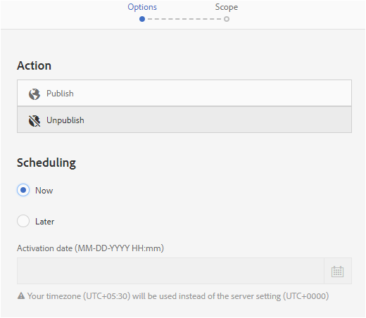

# 디지털 에셋 관리 {#manage-digital-assets}

| 버전 | 문서 링크 |
| -------- | ---------------------------- |
| AEM as a Cloud Service | [여기를 클릭하십시오.](https://experienceleague.adobe.com/docs/experience-manager-cloud-service/content/assets/manage/manage-digital-assets.html?lang=en) |
| AEM 6.5 | 이 문서 |
| AEM 6.4 | [여기를 클릭하십시오.](https://experienceleague.adobe.com/docs/experience-manager-64/assets/managing/managing-assets-touch-ui.html?lang=en) |

in [!DNL Adobe Experience Manager Assets]를 사용하면 자산을 저장하고 관리하는 것 이상을 수행할 수 있습니다. [!DNL Experience Manager] 는 엔터프라이즈급 자산 관리 기능을 제공합니다. 자산을 편집 및 공유하고, 고급 검색을 실행하고, 지원되는 수십 개의 파일 형식의 여러 표현물을 만들 수 있습니다. 버전 및 디지털 권한을 관리하고 자산 처리를 자동화하고 메타데이터를 관리 및 제어하며, 주석을 사용하여 공동 작업하는 등의 작업도 수행할 수 있습니다.

이 문서에서는 만들기 또는 업로드와 같은 기본 자산 관리 작업에 대해 설명합니다. 메타데이터 업데이트; 복사, 이동 및 삭제 자산을 게시, 게시 취소 및 검색합니다. 사용자 인터페이스를 이해하려면 다음을 참조하십시오 [자산 사용자 인터페이스 시작](/help/sites-authoring/basic-handling.md). 컨텐츠 조각을 관리하려면 다음을 참조하십시오 [컨텐츠 조각 관리](/help/assets/content-fragments/content-fragments-managing.md) 자산.

## 폴더 만들기 {#creating-folders}

자산 컬렉션을 구성할 때(예: 모두) `Nature` 이미지를 만들 수 있습니다. 폴더를 사용하여 자산을 분류하고 구성할 수 있습니다. [!DNL Experience Manager Assets] 가 더 잘 작동하도록 하려면 폴더에서 자산을 구성할 필요가 없습니다.

>[!NOTE]
>
>* 공유 [!DNL Assets] 유형의 폴더 `sling:OrderedFolder` Experience Cloud에 공유할 때에는 지원되지 않습니다. 폴더를 공유하려면 선택하지 마십시오 [!UICONTROL 주문] 폴더를 만들 때.
>* [!DNL Experience Manager] 사용을 허용하지 않음 `subassets` 폴더 이름으로 word를 지정합니다. 복합 자산에 대한 하위 자산을 포함하는 노드에 예약된 키워드입니다.


1. 폴더를 만들 디지털 자산 폴더의 위치로 이동합니다. 메뉴에서 **[!UICONTROL 만들기]**. 선택 **[!UICONTROL 새 폴더]**.
1. 에서 **[!UICONTROL 제목]** 필드에서 폴더 이름을 입력합니다. 기본적으로 DAM은 폴더 이름으로 제공한 제목을 사용합니다. 폴더를 만들면 기본값을 무시하고 다른 폴더 이름을 지정할 수 있습니다.
1. **[!UICONTROL 만들기]**&#x200B;를 클릭합니다. 폴더가 디지털 자산 폴더에 표시됩니다.

다음(공백으로 구분된 목록) 문자는 지원되지 않습니다.

* 자산 파일 이름에는 다음 문자를 사용할 수 없습니다. `* / : [ \\ ] | # % { } ? &`
* 자산 폴더 이름에는 다음 문자를 사용할 수 없습니다. `* / : [ \\ ] | # % { } ? \" . ^ ; + & \t`

자산 파일 이름의 확장에 특수 문자를 포함하지 마십시오.

## 에셋 업로드 {#uploading-assets}

<!-- TBD the following:
Move this section into a new article. CQDOC-14874 ticket is created for this.
In this complete article, replace emphasis with UICONTROL where appropriate.
-->

로컬 폴더 또는 네트워크 드라이브에서 다양한 유형의 자산(이미지, PDF 파일, RAW 파일 등)을 [!DNL Experience Manager Assets].

>[!NOTE]
>
>Dynamic Media - Scene7 모드에서 기본 자산 업로드 파일 크기는 2GB 이합니다. 최대 15GB까지의 2GB보다 큰 자산 업로드를 구성하려면 다음을 참조하십시오 [(선택 사항) 2GB보다 큰 자산을 업로드할 Dynamic Media - Scene7 모드 구성](/help/assets/config-dms7.md#optional-config-dms7-assets-larger-than-2gb).

처리 프로필이 할당된 폴더에 자산을 업로드하도록 선택할 수 있습니다.

처리 프로필이 할당된 폴더의 경우 카드 보기의 축소판에 프로필 이름이 나타납니다. 목록 보기에서 프로필 이름이 **처리 프로필** 열. 자세한 내용은 [처리 프로필](/help/assets/processing-profiles.md).

자산을 업로드하기 전에 자산이 [포맷](/help/assets/assets-formats.md) 그게 [!DNL Experience Manager Assets] 을 지원합니다.

1. 에서 [!DNL Assets] 사용자 인터페이스에서 디지털 자산을 추가할 위치로 이동합니다.
1. 자산을 업로드하려면 다음 중 하나를 수행합니다.

   * 도구 모음에서 **[!UICONTROL 만들기]**. 그런 다음 메뉴에서 **[!UICONTROL 파일]**. 필요한 경우 제공된 대화 상자에서 파일의 이름을 변경할 수 있습니다.
   * HTML5를 지원하는 브라우저에서 자산을 직접 [!DNL Assets] 사용자 인터페이스. 파일 이름을 바꿀 대화 상자가 표시되지 않습니다.

   

   여러 파일을 선택하려면 `Ctrl` 또는 `Command` 키를 누르고 파일 선택기 대화 상자에서 자산을 선택합니다. iPad을 사용하는 경우 한 번에 하나의 파일만 선택할 수 있습니다.

   큰 자산(500MB 이상)의 업로드를 일시 중지하고 동일한 페이지에서 나중에 다시 시작할 수 있습니다. 클릭 **[!UICONTROL 일시 정지]** 업로드가 시작될 때 표시되는 진행률 표시줄 옆에 표시됩니다.

   

자산이 큰 자산으로 간주되는 위의 크기를 구성할 수 있습니다. 예를 들어 시스템이 1000MB 이상의 자산(500MB 대신)을 큰 자산으로 간주하도록 구성할 수 있습니다. 이 경우 **[!UICONTROL 일시 정지]** 크기가 1000MB보다 큰 자산을 업로드할 때 진행률 표시줄에 가 표시됩니다.

다음 [!UICONTROL 일시 정지] 1000MB보다 큰 파일을 1000MB 미만의 파일로 업로드하면 옵션이 표시되지 않습니다. 그러나 1,000MB 미만의 파일 업로드를 취소하면 **[!UICONTROL 일시 정지]** 옵션이 나타납니다.

크기 제한을 수정하려면 다음을 구성합니다 `chunkUploadMinFileSize` 속성 `fileupload` 노드 아래에 있어야 합니다. `/apps/dam/gui/content/assets/jcr:content/actions/secondary/create/items/fileupload`.

를 클릭하면 **[!UICONTROL 일시 정지]**&#x200B;로 전환합니다. **[!UICONTROL 재생]** 선택 사항입니다. 업로드를 다시 시작하려면 다음을 클릭합니다 **[!UICONTROL 재생]**.

진행 중인 업로드를 취소하려면 닫기(`X`)을 클릭하여 제품에서 사용할 수 있습니다. 업로드 작업을 취소하면 [!DNL Assets] 자산의 부분적으로 업로드된 부분을 삭제합니다.

업로드를 다시 시작하는 기능은 특히 큰 자산을 업로드하는 데 시간이 오래 걸리는 낮은 대역폭 시나리오 및 네트워크 결함 시 유용합니다. 업로드 작업을 일시 중지하고 상황이 개선되면 나중에 계속 진행할 수 있습니다. 다시 시작하면 업로드가 일시 중지된 지점부터 시작됩니다.

업로드 작업 중에 [!DNL Experience Manager] 업로드되는 자산의 일부를 CRX 저장소에 데이터 청크로 저장합니다. 업로드가 완료되면, [!DNL Experience Manager] 이러한 청크를 저장소의 단일 데이터 블록으로 통합합니다.

완료되지 않은 청크 업로드 작업에 대한 정리 작업을 구성하려면 다음 위치로 이동하십시오. `https://[aem_server]:[port]/system/console/configMgr/org.apache.sling.servlets.post.impl.helper.ChunkCleanUpTask`.

>[!CAUTION]
>
>청크 업로드는 기본값이 500MB이고 청크 크기가 50MB이면 트리거됩니다. 편집할 경우 [Apache Jackrabbit Oak TokenConfiguration](https://experienceleague.adobe.com/docs/experience-cloud-kcs/kbarticles/KA-16464.html) 그리고 `timeout configuration` 자산을 업로드하는 데 걸리는 시간보다 작게는 자산 업로드가 진행 중인 동안 세션 시간 초과 상황이 발생합니다. 따라서 `chunkUploadMinFileSize` 및 `chunksize` 따라서 각 청크 요청이 세션을 새로 고침합니다.
>
>credential-expiry-timeout, 지연, 대역폭 및 예상 동시 업로드가 주어질 때 다음을 선택할 수 있도록 해주는 가장 높은 값입니다.
>
>* 업로드가 진행 중인 동안 크기가 있는 파일에 대해 청크 업로드를 활성화하면 자격 증명 만료가 발생할 수 있습니다.
>
>* 자격 증명이 만료되기 전에 각 청크가 완료되는지 확인합니다.


자산을 업로드하는 위치에서 이미 사용할 수 있는 자산과 동일한 이름의 자산을 업로드하는 경우 경고 대화 상자가 표시됩니다.

기존 자산을 대체하거나, 다른 버전을 만들거나, 업로드된 새 자산의 이름을 바꾸면서 두 자산을 모두 유지하도록 선택할 수 있습니다. 기존 자산을 바꿀 경우, 자산의 메타데이터와 기존 자산에 대해 수행한 이전 수정(예: 주석 또는 자르기)이 삭제됩니다. 두 자산을 모두 유지하도록 선택하면 새 자산의 이름이 숫자로 바뀝니다 `1` 해당 이름에 추가됩니다.


>[!NOTE]
>
>선택 시 **[!UICONTROL 바꾸기]** 에서 [!UICONTROL 이름 충돌] 대화 상자에서 새 자산에 대해 자산 ID가 다시 생성됩니다. 이 ID는 이전 자산의 ID와 다릅니다.
>
>Assets Insights가 를 사용하여 노출 횟수 또는 클릭 수를 추적할 수 있도록 활성화된 경우 [!DNL Adobe Analytics]재생성된 자산 ID는 자산에서 캡처된 데이터를 무효화합니다. [!DNL Analytics].

업로드하는 자산이 있는 경우 [!DNL Assets], **[!UICONTROL 중복 검색]** 대화 상자에 중복 자산을 업로드하려고 함을 알려줍니다. 이 대화 상자는 `SHA 1` 기존 자산의 이진 체크섬 값은 업로드한 자산의 체크섬 값과 일치합니다. 이 경우 자산의 이름은 중요하지 않습니다.

>[!NOTE]
>
>다음 [!UICONTROL 중복 검색] 대화 상자는 중복 감지 기능이 활성화된 경우에만 나타납니다. 중복 감지 기능을 활성화하려면 를 참조하십시오 [중복 감지 활성화](/help/assets/duplicate-detection.md).


중복 자산을 [!DNL Assets]를 클릭합니다. **[!UICONTROL 유지]**. 업로드한 중복 자산을 삭제하려면 **[!UICONTROL 삭제]**.

[!DNL Experience Manager Assets] 파일 이름에 사용할 수 없는 문자가 있는 자산을 업로드하지 못하도록 합니다. 허용되지 않는 문자 이상이 포함된 파일 이름의 자산을 업로드하려고 하면, [!DNL Assets] 경고 메시지를 표시하고 이러한 문자를 제거하거나 허용되는 이름으로 업로드할 때까지 업로드를 중지합니다.

조직에 대한 특정 파일 이름 지정 규칙에 맞추기 위해 [!UICONTROL 자산 업로드] 대화 상자에서는 업로드하는 파일의 긴 이름을 지정할 수 있습니다.

그러나 다음(공백으로 구분된 목록) 문자는 지원되지 않습니다.

* 자산 파일 이름은 포함하지 않아야 합니다. `* / : [ \\ ] | # % { } ? &`
* 자산 폴더 이름은 포함하지 않아야 합니다. `* / : [ \\ ] | # % { } ? \" . ^ ; + & \t`

자산 파일 이름의 확장에 특수 문자를 포함하지 마십시오.


또한 [!DNL Assets] 사용자 인터페이스에는 업로드한 가장 최근 자산 또는 처음 만든 폴더가 표시됩니다.

파일을 업로드하기 전에 업로드 작업을 취소하면 [!DNL Assets] 현재 파일 업로드를 중지하고 컨텐츠를 새로 고칩니다. 그러나 이미 업로드된 파일은 삭제되지 않습니다.

의 업로드 진행 대화 상자 [!DNL Assets] 업로드에 성공한 파일 수와 업로드에 실패한 파일을 표시합니다.

### 직렬 업로드 {#serialuploads}

많은 자산을 일괄적으로 업로드하면 상당한 I/O 리소스가 소모되므로 성능이 저하될 수 있습니다 [!DNL Assets] 배포. 특히 인터넷 연결이 느린 경우 디스크 I/O의 증가로 인해 업로드 시간이 크게 늘어납니다. 또한, 웹 브라우저에서는 POST 요청 수에 추가적인 제한 사항을 도입할 수 있습니다 [!DNL Assets] 동시 자산 업로드를 처리할 수 있습니다. 따라서 업로드 작업이 실패하거나 조기에 종료됩니다. 다시 말하면 [!DNL Experience Manager Assets] 여러 파일을 수집하는 동안 일부 파일이 누락되거나 파일을 모두 수집하지 못할 수 있습니다.

이 상황을 극복하려면 [!DNL Assets] 모든 자산을 동시에 섭취하는 대신 일괄 업로드 작업 동안 한 번에 하나의 자산(직렬 업로드)을 섭취합니다.

자산의 직렬 업로드는 기본적으로 활성화되어 있습니다. 기능을 비활성화하고 동시 업로드를 허용하려면 `fileupload` 노드(Crx-de)에 있고 `parallelUploads` 속성 대상 `true`.

### FTP를 사용하여 자산 업로드 {#uploading-assets-using-ftp}

Dynamic Media을 사용하면 FTP 서버를 통해 자산을 일괄 업로드할 수 있습니다. 큰 자산(>1GB)을 업로드하거나 전체 폴더와 하위 폴더를 업로드하려면 FTP를 사용해야 합니다. FTP 업로드를 반복 예약된 시간에 발생하도록 설정할 수도 있습니다.

>[!NOTE]
>
>Dynamic Media - Scene7 모드에서 기본 자산 업로드 파일 크기는 2GB 이합니다. 최대 15GB까지의 2GB보다 큰 자산 업로드를 구성하려면 다음을 참조하십시오 [(선택 사항) 2GB보다 큰 자산을 업로드할 Dynamic Media - Scene7 모드 구성](/help/assets/config-dms7.md#optional-config-dms7-assets-larger-than-2gb).

>[!NOTE]
>
>Dynamic Media - Scene7 모드에서 FTP를 통해 자산을 업로드하려면 [!DNL Experience Manager] 작성자 인스턴스. 연락처 [고객 지원 Adobe](https://experienceleague.adobe.com/?support-solution=General#support) fp-18912에 액세스하고 FTP 계정 설정을 완료합니다. 자세한 내용은 [벌크 자산 마이그레이션용 기능 팩 18912 설치](/help/assets/bulk-ingest-migrate.md).
>
>자산 업로드에 FTP를 사용하는 경우,에 지정된 업로드 설정입니다 [!DNL Experience Manager] 은 무시됩니다. 대신 Dynamic Media Classic에 정의된 대로 파일 처리 규칙이 사용됩니다.

**FTP를 사용하여 자산을 업로드하려면**

1. 원하는 FTP 클라이언트를 사용하여 프로비저닝 이메일에서 받은 FTP 사용자 이름과 암호를 사용하여 FTP 서버에 로그인합니다. FTP 클라이언트에서 파일 또는 폴더를 FTP 서버에 업로드합니다.

1. 를 엽니다. [Dynamic Media Classic 데스크탑 애플리케이션](https://experienceleague.adobe.com/docs/dynamic-media-classic/using/intro/dynamic-media-classic-desktop-app.html#system-requirements-dmc-app)그런 다음 계정에 로그인합니다.

   자격 증명 및 로그인은 프로비저닝 시 Adobe이 제공했습니다. 이 정보가 없는 경우 Adobe 고객 지원 센터에 문의하십시오.

1. 전역 탐색 막대에서 **[!UICONTROL 업로드]**.
1. 업로드 페이지의 왼쪽 위 모서리 근처에 있는 **[!UICONTROL FTP를 통해]** 탭.
1. 페이지 왼쪽에서 파일을 업로드할 FTP 폴더를 선택합니다. 페이지 오른쪽에서 대상 폴더를 선택합니다.
1. 페이지의 오른쪽 아래 모서리 근처에 있는 **[!UICONTROL 작업 옵션]** 그런 다음 선택한 폴더의 자산을 기반으로 원하는 옵션을 설정합니다.

   자세한 내용은 [업로드 작업 옵션](#upload-job-options).

   >[!NOTE]
   >
   >FTP를 통해 자산을 업로드할 때 Dynamic Media Classic(S7)에서 설정한 업로드 작업 옵션이 [!DNL Experience Manager].

1. 업로드 작업 옵션 대화 상자의 오른쪽 아래 모서리에서 **[!UICONTROL 저장]**.
1. 업로드 페이지의 오른쪽 아래 모서리에서 을(를) 클릭합니다. **[!UICONTROL 업로드 제출]**.

   업로드의 진행 상황을 보려면 전역 탐색 모음에서 를 클릭합니다 **[!UICONTROL 작업]**. 작업 페이지에는 업로드의 진행 상태가 표시됩니다. 에서 계속 작업할 수 있습니다. [!DNL Experience Manager] 언제든지 Dynamic Media Classic의 작업 페이지로 돌아가서 진행 중인 작업을 검토합니다.
진행 중인 업로드 작업을 취소하려면 **[!UICONTROL 취소]** 를 입력합니다.

#### 업로드 작업 옵션 {#upload-job-options}

| 업로드 옵션 | 하위 옵션 | 설명 |
|---|---|---|
| 작업 이름 |  | 텍스트 필드에 미리 입력되는 기본 이름은 이름의 사용자 입력 부분과 날짜 및 시간 스탬프를 포함합니다. 기본 이름을 사용하거나 이 업로드 작업에 대해 고유한 작성 이름을 입력할 수 있습니다. <br>작업 및 기타 업로드 및 게시 작업이 작업 페이지에 기록되며, 이 페이지에서 작업 상태를 확인할 수 있습니다. |
| 업로드 후 게시 |  | 업로드한 자산을 자동으로 게시합니다. |
| 확장명에 상관없이 동일한 기본 에셋 이름으로 모든 폴더에 덮어쓰기 |  | 업로드하는 파일을 동일한 이름으로 바꾸도록 하려면 이 옵션을 선택합니다. 이 옵션의 이름은 **[!UICONTROL 애플리케이션 설정]** > **[!UICONTROL 일반 설정]** > **[!UICONTROL 애플리케이션에 업로드]** > **[!UICONTROL 이미지 덮어쓰기]**. |
| 업로드 시 Zip 또는 Tar 파일 압축 해제 |  |  |
| 작업 옵션 |  | 클릭 **[!UICONTROL 작업 옵션]** 열어서 [!UICONTROL 업로드 작업 옵션] 대화 상자를 열고 전체 업로드 작업에 영향을 주는 옵션을 선택합니다. 이러한 옵션은 모든 파일 유형에 대해 동일합니다.<br>[응용 프로그램 일반 설정] 페이지에서 시작하여 파일을 업로드하기 위한 기본 옵션을 선택할 수 있습니다. 이 페이지를 열려면 **[!UICONTROL 설정]** > **[!UICONTROL 애플리케이션 설정]**. 을(를) 선택합니다 **[!UICONTROL 기본 업로드 옵션]** 옵션을 엽니다. [!UICONTROL 업로드 작업 옵션] 대화 상자 |
|  | http 화이트보드 | 1회 또는 반복을 선택합니다. 반복 작업을 설정하려면 반복 옵션(일별, 주별, 월별 또는 사용자 지정)을 선택하여 FTP 업로드 작업을 반복할 시기를 지정합니다. 그런 다음 필요에 따라 예약 옵션을 지정합니다. |
|  | 하위 폴더 포함 | 업로드할 폴더 내에서 모든 하위 폴더를 업로드합니다. 업로드하는 폴더 및 하위 폴더의 이름은 자동으로 입력됩니다 [!DNL Experience Manager Assets]. |
|  | 자르기 옵션 | 이미지의 양쪽에서 수동으로 자르려면 [자르기] 메뉴를 선택하고 [수동]을 선택합니다. 그런 다음 이미지의 측면이나 양쪽에서 자를 픽셀 수를 입력합니다. 이미지가 잘리는 양은 이미지 파일의 ppi(인치당 픽셀) 설정에 따라 달라집니다. 예를 들어, 이미지가 150ppi를 표시하고 [위쪽], [오른쪽], [아래쪽] 및 [왼쪽] 텍스트 상자에 75를 입력하면 각 면에서 1/2인치 잘립니다.<br> 이미지에서 공백 픽셀을 자동으로 자르려면 [자르기] 메뉴를 열고 [수동]을 선택한 다음 [위쪽], [오른쪽], [아래쪽] 및 [왼쪽] 필드에 픽셀 측정 값을 입력하여 양쪽에서 자를 수 있습니다. 자르기 메뉴에서 트림 을 선택하고 다음 옵션을 선택할 수도 있습니다.<br> **기준 재단** <ul><li>**색상** - 색상 옵션을 선택합니다. 그런 다음 [모퉁이] 메뉴를 선택하고 자르려는 공백 색상을 가장 잘 나타내는 색상이 있는 이미지 모서리를 선택합니다.</li><li>**투명도** - 투명도 옵션을 선택합니다.<br> **허용치** - 슬라이더를 드래그하여 0에서 1까지의 허용치를 지정합니다.색상을 기준으로 트리밍의 경우 0을 지정하여 이미지 모서리에서 선택한 색상과 정확히 일치하는 경우에만 픽셀을 자릅니다. 1에 가까운 숫자는 더 많은 색상 차이를 허용합니다.<br>투명도를 기반으로 트리밍하는 경우 픽셀이 투명할 경우에만 픽셀을 자르도록 0을 지정합니다. 1에 가까운 숫자는 더 투명할 수 있도록 해줍니다.</li></ul><br>이러한 자르기 옵션은 원본에 영향을 주지 않습니다. |
|  | 색상 프로필 옵션 | 게재에 사용되는 최적화된 파일을 만들 때 색상 변환을 선택합니다.<ul><li>기본 색상 유지: 이미지에 색상 공간 정보가 포함될 때마다 소스 이미지 색상을 유지합니다. 색상 변환이 없습니다. 현재 거의 모든 이미지에 적절한 색상 프로필이 이미 포함되어 있습니다. 그러나 CMYK 소스 이미지에 포함된 색상 프로파일이 없으면 색상이 sRGB(표준 빨간색 녹색 파란색) 색상 공간으로 변환됩니다. sRGB는 웹 페이지에 이미지를 표시하는 데 권장되는 색상 공간입니다.</li><li>원래 색상 공간 유지: 점에서 색상 변환 없이 원래 색상을 유지합니다. 포함된 색상 프로필이 없는 이미지의 경우, 모든 색상 변환은 게시 설정에 구성된 기본 색상 프로필을 사용하여 수행됩니다. 색상 프로필이 이 옵션으로 만든 파일의 색상과 일치하지 않을 수 있습니다. 따라서 기본 색상 유지 옵션을 사용하는 것이 좋습니다.</li><li>사용자 지정 시작 > 종료<br> [변환]과 [색상 공간으로 변환]을 선택할 수 있도록 메뉴를 엽니다. 이 고급 옵션은 소스 파일에 포함된 모든 색상 정보를 무시합니다. 제출하는 모든 이미지에 잘못되었거나 누락된 색상 프로필 데이터가 포함되어 있으면 이 옵션을 선택합니다.</li></ul> |
|  | 이미지 편집 옵션 | 이미지의 클리핑 마스크를 유지하고 색상 프로파일을 선택할 수 있습니다.<br> 자세한 내용은 [업로드 시 이미지 편집 옵션을 설정합니다.](#setting-image-editing-options-at-upload). |
|  | Postscript 옵션 | PostScript® 파일을 래스터화하고, 파일을 자르며, 투명한 배경을 유지하고, 해상도를 선택하고, 색상 공간을 선택할 수 있습니다.<br> 자세한 내용은 [PostScript 및 Illustrator 업로드 옵션 설정](#setting-postscript-and-illustrator-upload-options). |
|  | Photoshop 옵션 | Adobe® Photoshop® 파일에서 템플릿을 만들고, 레이어를 유지 관리하며, 레이어의 이름을 지정하는 방법을 지정하고, 텍스트를 추출하고, 이미지가 템플릿에 고정된 방식을 지정할 수 있습니다.<br> 템플릿은 [!DNL Experience Manager].<br> 자세한 내용은 [Photoshop 업로드 옵션 설정](#setting-photoshop-upload-options). |
|  | PDF 옵션 | 파일을 래스터화하고, 검색어와 링크를 추출하고, eCatalog를 자동으로 생성하고, 해상도를 설정하고, 색상 공간을 선택할 수 있습니다.<br>eCatalog는에서 지원되지 않습니다. [!DNL Experience Manager]. <br> 자세한 내용은 [PDF 업로드 옵션 설정](#setting-pdf-upload-options).<br>**참고**: 추출을 위해 고려할 PDF의 최대 페이지 수는 새 업로드를 위해 5000개입니다. 이 제한은 2022년 12월 31일에 100페이지(모든 PDF의 경우)로 변경됩니다. 참조 - [Dynamic Media 제한 사항](/help/assets/limitations.md). |
|  | Illustrator 옵션 | Adobe Illustrator® 파일을 래스터화하고 투명한 배경을 유지하고 해상도를 선택한 다음 색상 공간을 선택할 수 있습니다.<br> 자세한 내용은 [PostScript 및 Illustrator 업로드 옵션 설정](#setting-postscript-and-illustrator-upload-options). |
|  | 비디오 옵션 | 비디오 사전 설정을 선택하여 비디오 파일을 변환할 수 있습니다.<br> 자세한 내용은 [eVideo 업로드 옵션 설정](#setting-evideo-upload-options). |
|  | 일괄 처리 집합 사전 설정 | 업로드된 파일에서 이미지 세트 또는 스핀 세트를 만들려면 사용할 사전 설정에 대해 활성 열을 클릭합니다. 두 개 이상의 사전 설정을 선택할 수 있습니다. Dynamic Media Classic의 애플리케이션 설정/일괄처리 세트 사전 설정 페이지에서 사전 설정을 만듭니다.<br> 자세한 내용은 [이미지 세트 및 스핀 세트를 자동으로 생성하도록 일괄처리 집합 사전 설정 구성](config-dms7.md#creating-batch-set-presets-to-auto-generate-image-sets-and-spin-sets) 일괄처리 집합 사전 설정 만들기에 대해 자세히 알아보십시오.<br> 자세한 내용은 [업로드 시 일괄처리 집합 사전 설정 설정 설정](#setting-batch-set-presets-at-upload). |

#### 업로드 시 이미지 편집 옵션을 설정합니다. {#setting-image-editing-options-at-upload}

AI, EPS 및 PSD 파일을 비롯한 이미지 파일을 업로드할 때 [!UICONTROL 업로드 작업 옵션] 대화 상자:

* 이미지 가장자리에서 공백을 자릅니다(위 표에서 설명 참조).
* 이미지의 측면에서 수동으로 자르십시오(위 표의 설명 참조).
* 색상 프로필을 선택합니다(위의 표에서 옵션 설명 참조).
* 클리핑 패스에서 마스크를 만듭니다.
* 선명하게 하기 마스크 옵션을 사용하여 이미지 선명하게 하기
* 녹아웃 배경

<!--
| Option | Sub-option | Description |
|---|---|---|
| Create Mask From Clipping Path | | Create a mask for the image based on its clipping path information. This option applies to images created with image-editing applications in which a clipping path was created. |
| Unsharp Masking | | Lets you fine-tune a sharpening filter effect on the final downsampled image, controlling the intensity of the effect, the radius of the effect (as measured in pixels), and a threshold of contrast that is ignored.<br> This effect uses the same options as Photoshop's Unsharp Mask filter. Contrary to what the name suggests, Unsharp Mask is a sharpening filter. Under Unsharp Masking, set the options you want. Setting options are described in the following: |
| | Amount | Controls the amount of contrast that is applied to edge pixels.<br> Think of it as the intensity of the effect. The main difference between the amount values of Unsharp Mask in Dynamic Media and the amount values in Adobe Photoshop, is that Photoshop has an amount range of 1% to 500%. Whereas, in Dynamic Media, the value range is 0.0 to 5.0. A value of 5.0 is the rough equivalent of 500% in Photoshop; a value of 0.9 is the equivalent of 90%, and so on. |
| | Radius | Controls the radius of the effect. The value range is 0-250.<br> The effect is run on all pixels in an image and radiates out from all pixels in all directions. The radius is measured in pixels. For example, to get a similar sharpening effect for a 2000 x 2000 pixel image and 500 x 500 pixel image, you would set a radius of two pixels on the 2000 x 2000 pixel image and a radius value of one pixel on the 500 x 500 pixel image. A larger value is used for an image that has more pixels. |
| | Threshold | Threshold is a range of contrast that is ignored when the Unsharp Mask filter is applied. It is important so that no "noise" is introduced to an image when this filter is used. The value range is 0-255, which is the number of brightness steps in a grayscale image. 0=black, 128=50% gray and 255=white.<br> For example, a threshold value of 12 ignores slight variations is skin tone brightness to avoid adding noise, but still add edge contrast to areas such as where eyelashes meet skin.<br> For example, if you have a photo of someone's face, the Unsharp Mask affects the parts of the image, such as where eyelashes and skin meet to create an obvious area of contrast, and the smooth skin itself. Even the smoothest skin exhibits subtle changes in brightness values. If you do not use a threshold value, the filter accentuates these subtle changes in skin pixels. In turn, a noisy and undesirable effect is created while contrast on the eyelashes is increased, enhancing sharpness.<br> To avoid this issue, a threshold value is introduced that tells the filter to ignore pixels that do not change contrast dramatically, like smooth skin.<br> In the zipper graphic shown earlier, notice the texture next to the zippers. Image noise is exhibited because the threshold values were too low to suppress the noise. |
| | Monochrome | Select to unsharp-mask image brightness (intensity).<br> Deselect to unsharp-mask each color component separately. |
| Knockout Background | | Automatically removes the background of an image when you upload it. This technique is useful to draw attention to a particular object and make it stand out from a busy background. Select to enable or "turn on" the Knockout Background feature and the following sub-options: |
| | Corner | Required.<br> The corner of the image that is used to define the background color to knockout.<br> You can choose from **Upper Left**, **Bottom Left**, **Upper Right**, or **Bottom Right**. |
| | Fill Method | Required.<br> Controls pixel transparency from the Corner location that you set.<br> You can choose from the following fill methods: <ul><li>**Flood Fill** - turns all pixels transparent that match the Corner that you have specified and are connected to it.</li><li>**Match Pixel** - turns all matching pixels transparent, regardless of their location on the image.</li></ul> |
| | Tolerance | Optional.<br> Controls the allowable amount of variation in pixel color matching based on the Corner location that you set.<br> Use a value of 0.0 to match pixel colors exactly or, use a value of 1.0 to allow for the greatest variation. |
-->

#### PostScript 및 Illustrator 업로드 옵션 설정 {#setting-postscript-and-illustrator-upload-options}

PostScript(EPS) 또는 AI(Illustrator) 이미지 파일을 업로드할 때 다양한 방법으로 형식을 지정할 수 있습니다. 파일을 래스터화하고 투명한 배경을 유지하고 해상도를 선택한 다음 색상 공간을 선택할 수 있습니다. PostScript 및 Illustrator 파일 형식 옵션은 [!UICONTROL 업로드 작업 옵션] 아래의 대화 상자 [!UICONTROL PostScript 옵션] 및 [!UICONTROL Illustrator 옵션].

| 옵션 | 하위 옵션 | 설명 |
|---|---|---|
| 처리 중 |  | 선택 **[!UICONTROL 래스터화]** 파일의 벡터 그래픽을 비트맵 형식으로 변환하려면 |
| 렌더링된 이미지에서 투명한 배경 유지 |  | 파일의 배경 투명도를 유지합니다. |
| 해결 |  | 해상도 설정을 결정합니다. 이 설정은 파일에 인치당 표시되는 픽셀 수를 결정합니다. |
| 색상 공간 |  | [색상 공간] 메뉴를 선택하고 다음 색상 공간 옵션 중에서 선택합니다. |
|  | 자동으로 검색 | 파일의 색상 공간을 유지합니다. |
|  | 강제 RGB | RGB 색상 공간으로 변환합니다. |
|  | CMYK로 강제 적용 | CMYK 색상 공간으로 변환합니다. |
|  | 회색 음영으로 강제 적용 | 회색 음영 색상 공간으로 변환합니다. |

#### Photoshop 업로드 옵션 설정 {#setting-photoshop-upload-options}

Photoshop 문서(PSD) 파일은 이미지 템플릿을 만드는 데 가장 많이 사용됩니다. PSD 파일을 업로드할 때 파일에서 자동으로 이미지 템플릿을 만들 수 있습니다(을(를) 선택하여 [!UICONTROL 템플릿 만들기] 옵션이 표시됩니다.

Dynamic Media은 파일을 사용하여 템플릿을 만들 경우 레이어가 있는 PSD 파일에서 여러 이미지를 만듭니다. 각 레이어에 대해 하나의 이미지를 만듭니다.

를 사용하십시오 [!UICONTROL 자르기 옵션] 및 [!UICONTROL 색상 프로필 옵션], Photoshop 업로드 옵션 사용 시 위에 설명되어 있습니다.

>[!NOTE]
>
>템플릿은 [!DNL Experience Manager].

| 옵션 | 하위 옵션 | 설명 |
|---|---|---|
| 레이어 유지 |  | PSD의 레이어(있는 경우)를 개별 자산으로 이동합니다. 자산 레이어는 PSD과 계속 연결됩니다. 세부 사항 보기에서 PSD 파일을 열고 레이어 패널을 선택하여 볼 수 있습니다. |
| 템플릿 만들기 |  | PSD 파일의 레이어에서 템플릿을 만듭니다. |
| 텍스트 추출 |  | 사용자가 뷰어에서 텍스트를 검색할 수 있도록 텍스트를 추출합니다. |
| 레이어를 배경 크기로 확장 |  | 분리된 이미지 레이어의 크기를 배경 레이어의 크기로 확장합니다. |
| 레이어 이름 지정 |  | PSD 파일의 레이어는 별도의 이미지로 업로드됩니다. |
|  | 레이어 이름 | 이미지 이름을 PSD 파일에서 레이어 이름 뒤에 지정합니다. 예를 들어 원래 PSD 파일에서 가격 태그라는 레이어가 가격 태그라는 이미지가 됩니다. 그러나 PSD 파일의 레이어 이름이 기본 Photoshop 레이어 이름(배경, 레이어 1, 레이어 2 등)인 경우 해당 이미지의 이름은 PSD 파일의 레이어 번호 뒤에 지정됩니다. 기본 레이어 이름의 이름은 지정되지 않습니다. |
|  | Photoshop 및 레이어 번호 | 원본 레이어 이름을 무시하고 PSD 파일에서 레이어 번호 뒤에 이미지의 이름을 지정합니다. 이미지의 이름은 Photoshop 파일 이름과 추가된 레이어 번호로 지정됩니다. 예를 들어, Spring Ad.psd라는 파일의 두 번째 레이어는 Photoshop에서 기본이 아닌 이름이 있더라도 Spring Ad_2로 이름이 지정됩니다. |
|  | Photoshop 및 레이어 이름 | PSD 파일 뒤에 레이어 이름 또는 레이어 번호가 나오는 이미지 이름을 지정합니다. PSD 파일의 레이어 이름이 기본 Photoshop 레이어 이름인 경우 레이어 번호가 사용됩니다. 예를 들어 SpringAd라는 PSD 파일에서 Price Tag라는 레이어를 Spring Ad_Price Tag라고 합니다. 기본 이름이 Layer 2인 레이어를 Spring Ad_2라고 합니다. |
| 앵커 |  | PSD 파일에서 생성된 계층화된 컴포지션에서 생성된 템플릿에 이미지가 고정되는 방식을 지정합니다. 기본적으로 앵커는 중심입니다. 가운데 앵커는 교체 이미지의 종횡비에 상관없이 교체 이미지가 동일한 공간을 가장 잘 채울 수 있도록 합니다. 템플릿을 참조하고 매개 변수 대체를 사용할 때 이 이미지를 대체하는 다른 측면을 가진 이미지가 동일한 공간을 효과적으로 차지합니다. 템플릿의 할당된 공간을 채우기 위해 응용 프로그램에 교체 이미지가 필요한 경우 다른 설정으로 변경합니다. |

#### PDF 업로드 옵션 설정 {#setting-pdf-upload-options}

PDF 파일을 업로드할 때 다양한 방법으로 형식을 지정할 수 있습니다. 페이지를 자릅니다. 검색 단어를 추출하고 인치당 픽셀 수를 입력하고 색상 공간을 선택합니다. PDF 파일에는 트림 여백, 재단선 표시, 등록 표시 및 기타 프린터 표시가 들어 있습니다. PDF 파일을 업로드할 때 페이지 양쪽에서 이러한 표시를 자를 수 있습니다.

추출을 위해 고려할 PDF의 최대 페이지 수는 새 업로드를 위해 5000개입니다. 이 제한은 2022년 12월 31일에 100페이지(모든 PDF의 경우)로 변경됩니다. 참조 - [Dynamic Media 제한 사항](/help/assets/limitations.md).

>[!NOTE]
>
>eCatalog는에서 지원되지 않습니다. [!DNL Experience Manager].

다음 옵션 중에서 선택합니다.

| 옵션 | 하위 옵션 | 설명 |
|---|---|---|
| 처리 중 | 래스터화 | (기본값) PDF 파일의 페이지를 잘라내고 벡터 그래픽을 비트맵 이미지로 변환합니다. eCatalog를 만들려면 이 옵션을 선택합니다. |
| 추출 | 단어 검색 | eCatalog 뷰어에서 키워드로 파일을 검색할 수 있도록 PDF 파일에서 단어를 추출합니다. |
|  | 링크 | PDF 파일에서 링크를 추출하여 eCatalog 뷰어에서 사용되는 이미지 맵으로 변환합니다. |
| 여러 페이지 PDF에서 eCatalog 자동 생성 |  | PDF 파일에서 eCatalog 를 자동으로 만듭니다. eCatalog 는 업로드한 PDF 파일의 이름을 따라 명명됩니다. (이 옵션은 업로드할 때 PDF 파일을 래스터화하는 경우에만 사용할 수 있습니다.) |
| 해결 |  | 해상도 설정을 결정합니다. 이 설정은 PDF 파일에 인치당 표시되는 픽셀 수를 결정합니다. 기본값은 150입니다. |
| 색상 공간 |  | [색상 공간] 메뉴를 선택하고 PDF 파일의 색상 공간을 선택합니다. 대부분의 PDF 파일에는 RGB 이미지와 CMYK 색상 이미지가 모두 있습니다. RGB 색상 공간이 온라인 보기용으로 선호됩니다. |
|  | 자동 감지 | PDF 파일의 색상 공간을 유지합니다. |
|  | RGB로 강제 실행 | RGB 색상 공간으로 변환합니다. |
|  | CMYK로 강제 실행 | CMYK 색상 공간으로 변환합니다. |
|  | 회색 음영으로 강제 실행 | 회색 음영 색상 공간으로 변환합니다. |

#### eVideo 업로드 옵션 설정 {#setting-evideo-upload-options}

다양한 비디오 사전 설정 중에서 선택하여 비디오 파일을 트랜스코딩하려면

| 옵션 | 하위 옵션 | 설명 |
|---|---|---|
| 응용 비디오 |  | 모바일, 태블릿 및 데스크톱에 게재할 비디오를 만들기 위해 모든 종횡비에서 작동하는 단일 인코딩 사전 설정입니다. 이 사전 설정으로 인코딩된 업로드된 소스 비디오는 고정된 높이로 설정됩니다. 그러나 너비는 비디오의 종횡비를 유지하기 위해 자동으로 조정됩니다. <br>가장 좋은 방법은 응용 비디오 인코딩을 사용하는 것입니다. |
| 단일 인코딩 사전 설정 | 인코딩 사전 설정 정렬 | 선택 **[!UICONTROL 이름]** 또는 **[!UICONTROL 크기]** 데스크탑, 모바일 및 태블릿 아래에 나열된 인코딩 사전 설정을 이름이나 해상도 크기로 정렬하려면 |
|  | 데스크톱 | 데스크탑 컴퓨터에 스트리밍 또는 점진적 비디오 경험을 제공하기 위한 MP4 파일을 만듭니다. 해상도 크기와 원하는 대상 데이터 비율로 하나 이상의 종횡비를 선택합니다. |
|  | 모바일 | iPhone 또는 Android™ 모바일 장치에서 전달할 MP4 파일을 만듭니다. 해상도 크기와 원하는 대상 데이터 비율로 하나 이상의 종횡비를 선택합니다. |
|  | 태블릿 | iPad 또는 Android™ 태블릿 장치에서 전달할 MP4 파일을 만듭니다. 해상도 크기와 원하는 대상 데이터 비율로 하나 이상의 종횡비를 선택합니다. |

#### 업로드 시 일괄처리 집합 사전 설정 설정 설정 설정 {#setting-batch-set-presets-at-upload}

업로드된 이미지에서 이미지 세트 또는 스핀 세트를 자동으로 만들려면 사용할 사전 설정에 대해 활성 열을 클릭합니다. 두 개 이상의 사전 설정을 선택할 수 있습니다.

자세한 내용은 [이미지 세트 및 스핀 세트를 자동으로 생성하도록 일괄처리 집합 사전 설정 구성](/help/assets/config-dms7.md#creating-batch-set-presets-to-auto-generate-image-sets-and-spin-sets) 일괄처리 집합 사전 설정 만들기에 대해 자세히 알아보십시오.

### 스트리밍된 업로드 {#streamed-uploads}

많은 자산을 Adobe Experience Manager에 업로드하는 경우 서버 I/O 요청이 크게 증가하여 업로드 효율성이 떨어지고 일부 업로드 작업이 시간 초과될 수도 있습니다. [!DNL Experience Manager Assets] 는 스트리밍되는 자산 업로드를 지원합니다. 스트리밍된 업로드는 저장소에 복사하기 전에 서버의 임시 폴더에 있는 자산 저장소를 방지하여 업로드 작업 중 디스크 I/O를 줄입니다. 대신 데이터가 리포지토리로 직접 전송됩니다. 이 방법으로 큰 자산을 업로드하는 시간과 시간 초과가 발생할 가능성이 줄어듭니다. 스트리밍되는 업로드는에서 기본적으로 활성화됩니다. [!DNL Assets].

>[!NOTE]
>
>3.1 이하의 서블릿-api 버전을 사용하는 JEE 서버에서 실행되는 Adobe Experience Manager에 대해 스트리밍 업로드가 비활성화됩니다.

### 자산이 포함된 ZIP 아카이브 추출 {#extractzip}

지원되는 다른 자산처럼 ZIP 아카이브를 업로드할 수 있습니다. 동일한 파일 이름 규칙이 ZIP 파일에 적용됩니다. [!DNL Experience Manager] zip 아카이브를 DAM 위치에 추출할 수 있습니다. 아카이브 파일에 ZIP이 확장으로 포함되지 않은 경우 컨텐츠를 사용하여 파일 유형 검색을 활성화합니다.

한 번에 하나의 ZIP 아카이브를 선택하고 **[!UICONTROL 아카이브 추출]**, 대상 폴더를 선택합니다. 충돌을 처리할 옵션이 있는 경우 선택합니다. ZIP 파일의 자산이 대상 폴더에 있는 경우 다음 옵션 중 하나를 선택할 수 있습니다. 추출 건너뛰기, 기존 파일 바꾸기, 이름을 변경하여 두 자산을 유지하거나 버전을 만듭니다.

추출이 완료되면, [!DNL Experience Manager] 알림 영역에서 알림을 보냅니다. While [!DNL Experience Manager] zip을 추출하면 추출을 중단하지 않고 다시 작업으로 돌아갈 수 있습니다.


이 기능의 일부 제한 사항은 다음과 같습니다.

* 대상에 이름이 같은 폴더가 있는 경우 ZIP 파일의 자산은 기존 폴더에서 추출됩니다.
* 추출을 취소하면 이미 추출된 자산이 삭제되지 않습니다.
* ZIP 파일 두 개를 동시에 선택하고 추출할 수 없습니다. 한 번에 하나의 ZIP 아카이브를 추출할 수 있습니다.
* ZIP 아카이브를 업로드할 때 업로드 대화 상자에 500 서버 오류가 표시되면 설치 후 다시 시도하십시오 [최신 서비스 팩](/help/release-notes/release-notes.md).

## 에셋 미리보기 {#previewing-assets}

자산을 미리 보려면 다음 단계를 수행합니다.

1. 에서 [!DNL Assets] 사용자 인터페이스에서 미리 보려는 자산의 위치로 이동합니다.
1. 원하는 자산을 클릭하여 열 수 있습니다.

1. 미리 보기 모드에서 확대/축소 옵션을 사용할 수 있습니다 [지원되는 이미지 유형](/help/assets/assets-formats.md#supported-raster-image-formats) (대화형 편집 사용).

   자산을 확대하려면 `+` (또는 자산의 확대경을 클릭합니다.) 축소하려면 `-`. 확대하면 패닝하여 이미지의 모든 영역을 자세히 볼 수 있습니다. 확대/축소 재설정 화살표는 원래 보기로 돌아갑니다. 보기를 원래 크기로 재설정하려면 **[!UICONTROL 재설정]** .

**키보드 키만 사용하여 자산 미리 보기**

키보드를 사용하여 자산을 미리 보려면 다음 단계를 수행합니다.

1. 에서 [!DNL Assets] 사용자 인터페이스에서 을 사용하여 원하는 자산으로 이동합니다 `Tab` 및 화살표 키.

1. 누르기 `Enter` 키를 누릅니다. 미리 보기 모드에서 자산을 확대할 수 있습니다.

1. 자산을 확대하려면 다음을 수행하십시오.
   1. 사용 `Tab` 포커스를 확대 옵션으로 이동하는 키
   1. 사용 `Enter` 키를 누릅니다.

   축소하려면 `Tab` 확대/축소 옵션에 초점을 맞춘 다음 키를 누릅니다 `Enter`.

1. 사용 `Shift` + `Tab` 초점을 이미지에 다시 이동하려면 키를 누릅니다.

1. 화살표 키를 사용하여 확대/축소된 이미지 주변으로 이동합니다.

>[!MORELIKETHIS]
>
>* [Dynamic Media 자산 미리 보기](/help/assets/previewing-assets.md).
>* [하위 자산 보기](managing-linked-subassets.md#viewing-subassets).


## 속성 및 메타데이터 편집 {#editing-properties}

1. 메타데이터를 편집할 자산의 위치로 이동합니다.

1. 자산을 선택한 다음, 도구 모음에서 를 선택합니다 **[!UICONTROL 속성]** 자산의 속성을 볼 수 있습니다. 또는 을(를) 선택합니다 **[!UICONTROL 속성]** 자산 카드의 빠른 작업.

   

1. 에서 [!UICONTROL 속성] 페이지에서 다양한 탭에서 메타데이터 속성을 편집합니다. 예를 들어 **[!UICONTROL 기본]** 탭에서 제목 및 설명을 편집합니다.

   >[!NOTE]
   >
   >의 레이아웃 [!UICONTROL 속성] 페이지 및 사용 가능한 메타데이터 속성은 기본 메타데이터 스키마에 따라 다릅니다. 레이아웃을 수정하는 방법을 배우려면 [!UICONTROL 속성] 페이지를 참조하십시오. [메타데이터 스키마](/help/assets/metadata-schemas.md).

1. To schedule a particular date/time for the activation of the asset, use the date picker beside the **[!UICONTROL On Time]** field.

   

   *그림: 날짜 선택기를 사용하여 자산 활성화를 예약합니다.*

1. 특정 기간 후에 자산을 비활성화하려면 다음 항목 옆의 날짜 선택기에서 비활성화 날짜/시간을 선택합니다 **[!UICONTROL 해제 시간]** 필드. 비활성화 날짜는 자산의 활성화 날짜보다 이후여야 합니다. 다음 이후 [!UICONTROL 해제 시간], 자산 및 해당 표현물은 [!DNL Assets] 웹 인터페이스 또는 HTTP API를 통해 사용할 수 있습니다.

1. 에서 **[!UICONTROL 태그]** 필드에서 하나 이상의 태그를 선택합니다. 사용자 지정 태그를 추가하려면 상자에 태그 이름을 입력하고 를 선택합니다 `Enter`. 새 태그가에 저장됩니다. [!DNL Experience Manager]. [!DNL YouTube] 게시할 태그가 필요합니다. 자세한 내용은 [YouTube에 비디오 게시](video.md#publishing-videos-to-youtube).

   >[!NOTE]
   >
   >태그를 만들려면 다음에 쓰기 권한이 있어야 합니다. `/content/cq:tags/default` 를 입력합니다.

1. 자산에 등급을 제공하려면 **[!UICONTROL 고급]** 탭을 클릭한 다음 적절한 위치에서 별점을 클릭하여 원하는 등급을 지정합니다.

   

   자산에 지정하는 등급 점수가 아래에 표시됩니다 **[!UICONTROL 등급]**. 자산에 등급을 매긴 사용자로부터 받은 자산이 표시되는 평균 등급 점수입니다 **[!UICONTROL 등급]**. 또한, 평균 등급 점수에 기여하는 평점 이별 점수가 아래에 표시됩니다 **[!UICONTROL 등급 분류]**. 평균 등급 점수를 기준으로 자산을 검색할 수 있습니다.

1. 자산에 대한 사용 통계를 보려면 **[!UICONTROL Insights]** 탭.

   사용 통계에는 다음이 포함됩니다.

   * 자산을 보거나 다운로드한 횟수입니다
   * 자산이 사용된 채널/장치
   * 최근 자산이 사용된 크리에이티브 솔루션

   자세한 내용은 [자산 통찰력](/help/assets/asset-insights.md).

1. **[!UICONTROL 저장 및 닫기]**&#x200B;를 클릭합니다.
1. 로 이동합니다 [!DNL Assets] 사용자 인터페이스. 제목, 설명, 등급 등을 포함한 편집된 메타데이터 속성이 카드 보기의 자산 카드 및 목록 보기의 관련 열 아래에 표시됩니다.

## 에셋 복사 {#copying-assets}

자산 또는 폴더를 복사하면 전체 자산 또는 폴더가 해당 컨텐츠 구조와 함께 복사됩니다. 복사된 자산 또는 폴더는 대상 위치에 복제됩니다. 소스 위치의 자산은 변경되지 않습니다.

특정 자산 사본에 고유한 몇 가지 속성은 전달되지 않습니다. 예를 들면 다음과 같습니다.

* 자산 ID, 생성 날짜 및 시간, 버전 및 버전 내역. 이러한 속성 중 일부는 속성으로 표시됩니다 `jcr:uuid`, `jcr:created`, 및 `cq:name`.

* 작성 시간 및 참조된 경로는 각 자산 및 해당 표현물에 대해 고유합니다.

다른 속성 및 메타데이터 정보는 유지됩니다. 자산을 복사할 때 부분 복사본이 만들어지지 않습니다.

1. in [!DNL Assets] 인터페이스를 사용하여 하나 이상의 자산을 선택하고 **[!UICONTROL 복사]** 를 클릭합니다. 또는 을(를) 선택합니다 **[!UICONTROL 복사]**  자산 카드에서 빠른 작업 을 참조하십시오.

   >[!NOTE]
   >
   >를 사용하는 경우 [!UICONTROL 복사] 빠른 작업, 한 번에 하나의 자산만 복사할 수 있습니다.

1. 자산을 복사할 위치로 이동합니다.

   >[!NOTE]
   >
   >자산을 같은 위치에 복사하는 경우 [!DNL Experience Manager] 변형된 이름을 자동으로 생성합니다. 예를 들어, 라는 이름의 자산을 복사하는 경우 `Square`, [!DNL Experience Manager] 복사본 제목을 자동으로 생성 `Square1`.

1. 을(를) 클릭합니다. **[!UICONTROL 붙여넣기]**  도구 모음의 자산 옵션. 그런 다음 자산이 이 위치에 복사됩니다.

   >[!NOTE]
   >
   >다음 **[!UICONTROL 붙여넣기]** 붙여넣기 작업이 완료될 때까지 도구 모음에서 옵션을 사용할 수 있습니다.

## 자산 이동 및 이름 변경 {#moving-or-renaming-assets}

자산(또는 폴더)을 다른 위치로 이동하는 경우 자산을 복사하는 동안 자산(또는 폴더)이 중복되지 않습니다. 자산(또는 폴더)은 대상 위치에 배치되고 소스 위치에서 제거됩니다. 자산을 새 위치로 이동할 때 자산의 이름을 바꿀 수도 있습니다.
게시된 자산을 다른 위치로 이동하는 경우 자산을 선택적으로 다시 게시할 수 있습니다. 게시된 자산에 대한 기본적으로 이동 작업이 자동으로 게시 취소됩니다. 작성자가 [!UICONTROL 다시 게시] 옵션을 선택합니다.


자산 또는 폴더를 이동하려면 다음을 수행하십시오.

1. 이동할 자산의 위치로 이동합니다.

1. 자산을 선택하고 을(를) 클릭합니다 **[!UICONTROL 이동]** 옵션 을 클릭합니다.
   

1. 에서 [!UICONTROL 자산 이동] 마법사에서 다음 중 하나를 수행합니다.

   * 자산을 이동한 후 자산의 이름을 지정합니다. 그런 다음 **[!UICONTROL 다음]** 계속 진행합니다.

   * 클릭 **[!UICONTROL 취소]** 프로세스를 중지합니다.
   >[!NOTE]
   >
   >* 새 위치에 해당 이름의 자산이 없는 경우 자산에 대해 동일한 이름을 지정할 수 있습니다. 하지만 자산을 동일한 이름의 자산이 있는 위치로 이동하는 경우 다른 이름을 사용해야 합니다. 동일한 이름을 사용하는 경우 변형된 이름이 자동으로 생성됩니다. 예를 들어, 자산의 이름이 Square인 경우, 시스템은 해당 사본의 이름 Square1을 생성합니다.
   >* 이름을 바꿀 때 파일 이름에 공백을 사용할 수 없습니다.


1. 설정 **[!UICONTROL 대상 선택]** 대화 상자에서 다음 중 하나를 수행합니다.

   * 자산의 새 위치로 이동한 다음 를 클릭합니다 **[!UICONTROL 다음]** 계속 진행합니다.

   * 클릭 **[!UICONTROL 뒤로]** 로 돌아가기 **[!UICONTROL 이름 변경]** 화면.

1. 이동되는 자산에 참조 페이지, 자산 또는 컬렉션이 있는 경우, **[!UICONTROL 참조 조정]** 탭 옆에 표시됩니다 **[!UICONTROL 대상 선택]** 탭.

   에서 다음 중 하나를 수행합니다 **[!UICONTROL 참조 조정]** 화면:

   * 새 세부 사항을 기반으로 조정할 참조를 지정한 다음 를 클릭합니다 **[!UICONTROL 이동]** 계속 진행합니다.

   * 에서 **[!UICONTROL 조정]** 열에서 자산에 대한 참조를 선택/선택 취소합니다.
   * 클릭 **[!UICONTROL 뒤로]** 로 돌아가기 **[!UICONTROL 대상 선택]** 화면.

   * 클릭 **[!UICONTROL 취소]** 이동 작업을 중지하려면 다음을 수행하십시오.

   참조를 업데이트하지 않으면 이 참조는 자산의 이전 경로를 계속 가리킵니다. 참조를 조정하면 새 자산 경로로 업데이트됩니다.

### 드래그 작업을 사용하여 자산 이동 {#move-using-drag}

자산(또는 폴더)을 사용하는 대신 대상 위치로 끌어 동위 폴더로 이동할 수 있습니다 [!UICONTROL 이동] 사용자 인터페이스의 옵션. 그러나 이 작업은 목록 보기에서만 수행할 수 있습니다.

자산을 드래그하여 이동해도 열리지 않습니다 [!UICONTROL 자산 이동] 따라서 이동하는 동안 자산의 이름을 변경하는 옵션이 표시되지 않습니다. 또한 다시 게시하기 위한 사용자의 승인을 찾지 않고 드래그하여 자산을 이동할 때 이미 게시된 자산이 다시 게시됩니다.


## 표현물 관리 {#managing-renditions}

1. 원본을 제외하고 자산에 대한 표현물을 추가하거나 제거할 수 있습니다. 표현물을 추가하거나 제거할 자산의 위치로 이동합니다.

1. 해당 페이지가 열리도록 자산을 클릭합니다.
1. Experience Manager 인터페이스에서 을(를) 선택합니다 **[!UICONTROL 표현물]** 참조하십시오.
1. 에서 **[!UICONTROL 표현물]** 패널에서 자산에 대해 생성된 표현물 목록을 확인합니다.

   

   >[!NOTE]
   >
   >기본적으로 [!DNL Assets] 미리 보기 모드에서는 자산의 원래 표현물이 표시되지 않습니다. 관리자는 오버레이를 사용하여 다음을 구성할 수 있습니다 [!DNL Assets] 를 클릭하여 미리 보기 모드에서 원래 렌디션을 표시합니다.

1. 변환을 보거나 삭제할 변환을 선택합니다.

   **표현물 삭제**

   에서 렌디션을 선택합니다 **[!UICONTROL 표현물]** 패널을 클릭한 다음 **[!UICONTROL 표현물 삭제]**  옵션 을 클릭합니다. 자산 처리가 완료된 후에는 렌디션을 일괄적으로 삭제할 수 없습니다. 개별 자산의 경우 사용자 인터페이스에서 렌디션을 수동으로 제거할 수 있습니다. 여러 자산의 경우 특정 표현물을 삭제하거나 자산을 삭제하고 삭제된 자산을 다시 업로드하도록 Experience Manager을 사용자 지정할 수 있습니다.

   **새 표현물 업로드**

   자산에 대한 자산 세부 사항 페이지로 이동하고 **[!UICONTROL 표현물 추가]**  도구 모음에 있는 옵션을 사용하여 자산에 대한 새 렌디션을 업로드합니다.

   >[!NOTE]
   >
   >If you select a rendition from the **[!UICONTROL Renditions]** panel, the toolbar changes context and displays only those actions that are relevant to the rendition. 옵션(예: [!UICONTROL 표현물 업로드] 옵션이 표시되지 않습니다. To view these options in the toolbar, navigate to the details page for the asset.

   이미지 또는 비디오 자산의 세부 사항 페이지에 표시할 표현물에 대한 차원을 구성할 수 있습니다. 지정한 차원에 따라, [!DNL Assets] 표현물을 정확히 또는 가장 가까운 차원으로 표시합니다.

   To configure rendition dimensions of an image at the asset detail level, overlay the `renditionpicker` node (`libs/dam/gui/content/assets/assetpage/jcr:content/body/content/content/items/assetdetail/items/col1/items/assetview/renditionpicker`) and configure the value of the width property. 속성 구성 **[!UICONTROL 크기(긴)(KB)]** 이미지 크기에 따라 자산 세부 사항 페이지에서 렌디션을 사용자 지정할 수 있도록 폭 대신에 가 있습니다. For size-based customization, the property `preferOriginal` assigns preference to the original if the size of the matched rendition is greater than the original.

   마찬가지로 오버레이하여 주석 페이지 이미지를 사용자 지정할 수 있습니다 `libs/dam/gui/content/assets/annotate/jcr:content/body/content/content/items/content/renditionpicker`.

   

   비디오 자산에 대한 표현물 차원을 구성하려면 다음 위치로 이동합니다 `videopicker` 노드 아래의 CRX 저장소에 있는 `/libs/dam/gui/content/assets/assetpage/jcr:content/body/content/content/items/assetdetail/items/col1/items/assetview/videopicker`를 오버레이한 다음 해당 속성을 편집합니다.

   >[!NOTE]
   >
   >비디오 주석은 HTML5 호환 비디오 형식이 있는 브라우저에서만 지원됩니다. 또한 브라우저에 따라 다른 비디오 형식이 지원됩니다. 그러나 MXF 비디오 형식은 아직 비디오 주석에서 지원되지 않습니다.

하위 자산 생성 및 보기에 대한 자세한 내용은 [하위 자산 관리](managing-linked-subassets.md#generate-subassets).

## 자산 삭제 {#deleting-assets}

자산을 삭제하려면 다음에 대한 삭제 권한이 필요합니다. `dam/asset`. 수정 권한만 있는 경우 자산 메타데이터를 편집하고 자산에 주석을 추가할 수 있습니다. 하지만 자산이나 해당 메타데이터는 삭제할 수 없습니다.

다른 페이지에서 들어오는 참조를 해결하거나 제거하려면 자산을 삭제하기 전에 관련 참조를 업데이트하십시오. 사용자가 참조된 자산을 삭제하고 끊어진 링크를 떠나는 것을 허용하지 않으려면 오버레이를 사용하여 강제 삭제 옵션을 비활성화하십시오.

자산 또는 자산이 포함된 폴더를 삭제하려면 다음을 수행하십시오.

1. 삭제할 자산의 위치 또는 폴더로 이동합니다.

1. 자산 또는 폴더를 선택하고 **[!UICONTROL 삭제]**  를 클릭합니다.

   삭제를 확인하면:

   * 자산에 참조가 없으면, 자산이 삭제됩니다.

   * 자산에 참조가 있으면, 오류 메시지에 다음 내용이 표시됩니다 **하나 이상의 자산을 참조했습니다.**. **[!UICONTROL 강제 삭제]**&#x200B;나 **[!UICONTROL 취소]**&#x200B;를 선택할 수 있습니다.
   >[!NOTE]
   >
   >* 다른 페이지에서 들어오는 참조를 해결하거나 제거하려면 자산을 삭제하기 전에 관련 참조를 업데이트하십시오. 또한 오버레이를 사용하여 강제 삭제 옵션을 비활성화하여 사용자가 참조된 자산을 삭제하고 끊어진 링크를 떠나지 못하도록 합니다.
   >* 삭제할 수 있습니다 *폴더* 여기에는 체크아웃 자산 파일이 포함되어 있습니다. 폴더를 삭제하기 전에 사용자가 디지털 자산을 체크 아웃하지 않았는지 확인합니다.


>[!NOTE]
>
>사용자 인터페이스에서 위의 방법을 사용하여 폴더를 삭제하면 연결된 사용자 그룹도 삭제됩니다.
>
>그러나 기존의 중복, 미사용 및 자동 생성된 사용자 그룹은 `clean` 작성자 인스턴스의 JMX에 있는 메서드(`https://[server]:[port]/system/console/jmx/com.day.cq.dam.core.impl.team%3Atype%3DClean+redundant+groups+for+Assets`).

## 에셋 다운로드 {#downloading-assets}

자세한 내용은 [Experience Manager에서 자산 다운로드](/help/assets/download-assets-from-aem.md).

## 자산 게시 또는 게시 취소 {#publish-assets}

자산을 업로드, 처리 또는 편집한 후 [!DNL Experience Manager] 작성자는 자산을 게시 서버에 게시합니다. 게시를 사용하면 자산을 공개적으로 사용할 수 있습니다. 게시 취소 작업으로 게시 서버에서 자산이 제거되었지만 작성 서버에서 자산이 제거되었습니다.

에 해당하는 정보 [!DNL Dynamic Media]를 참조하십시오. [게시 [!DNL Dynamic Media] assets](/help/assets/publishing-dynamicmedia-assets.md).

1. 게시하려는 자산 또는 게시 환경에서 제거하려는 자산 폴더의 위치(게시 취소)로 이동합니다.

1. 게시를 취소하려는 자산 또는 폴더를 선택하고 **[!UICONTROL 게시 관리]**  옵션 을 클릭합니다. 또는 빠르게 게시하려면 **[!UICONTROL 빠른 게시]** 옵션 을 클릭합니다. 게시하려는 폴더에 빈 폴더가 포함되어 있으면 빈 폴더가 게시되지 않습니다.

1. 을(를) 선택합니다 **[!UICONTROL 게시]** 또는 **[!UICONTROL 게시 취소]** 선택 사항.

   
   *그림: 게시 및 게시 취소 옵션 및 예약 옵션.*

1. 선택 **[!UICONTROL 지금]** 자산을 바로 사용하거나 **[!UICONTROL 나중에]** 를 눌러 작업을 예약합니다. 을(를) 선택하는 경우 날짜 및 시간을 선택합니다 **[!UICONTROL 나중에]** 선택 사항입니다. **[!UICONTROL 다음]**&#x200B;을 클릭합니다.

1. 게시할 때 자산이 다른 자산을 참조하는 경우 해당 참조가 마법사에 나열됩니다. 마지막 게시 이후 게시 취소되거나 수정된 참조만 표시됩니다. 게시할 참조를 선택합니다.

1. 게시를 취소할 때 자산이 다른 자산을 참조하는 경우 게시를 취소하려는 참조를 선택합니다. 클릭 **[!UICONTROL 게시 취소]**. 확인 대화 상자에서 **[!UICONTROL 취소]** 작업을 중지하려면 를 클릭하거나 **[!UICONTROL 게시 취소]** 지정된 날짜에 자산의 게시를 취소할지 확인합니다.

자산 또는 폴더의 게시 또는 게시 취소와 관련된 다음 제한 사항과 팁을 이해합니다.

* 다음 옵션 [!UICONTROL 게시 관리] 복제 권한이 있는 사용자 계정에만 이 기능을 사용할 수 있습니다.
* 복잡한 자산의 게시를 취소하는 동안 자산만 게시 취소합니다. 게시된 다른 자산에서 참조될 수 있으므로 참조 게시를 취소하지 마십시오.
* 빈 폴더가 게시되지 않습니다.
* 처리 중인 자산을 게시하면 원래 컨텐츠만 게시됩니다. 표현물이 없습니다. 처리가 완료될 때까지 기다렸다가 처리가 완료되면 자산을 게시하거나 다시 게시하십시오.

## 폐쇄된 사용자 그룹 {#closed-user-group}

CUG(폐쇄된 사용자 그룹)를 사용하여 [!DNL Experience Manager]. 폴더에 대한 CUG를 만드는 경우 폴더(폴더 자산 및 하위 폴더 포함)에 대한 액세스가 할당된 구성원 또는 그룹으로만 제한됩니다. 폴더에 액세스하려면 보안 자격 증명을 사용하여 로그인해야 합니다.

CUG는 자산에 대한 액세스를 제한하는 추가 방법입니다. 폴더에 대한 로그인 페이지를 구성할 수도 있습니다.

1. 에서 폴더를 선택합니다 [!DNL Assets] 인터페이스를 만들고 [!UICONTROL 속성] 옵션을 선택합니다.
1. 에서 **[!UICONTROL 권한]** 탭에서 **[!UICONTROL 폐쇄된 사용자 그룹]**.

   

1. 사용자가 폴더에 액세스할 때 로그인 화면을 표시하려면 **[!UICONTROL 활성화]** 선택 사항입니다. 그런 다음 의 로그인 페이지 경로를 선택합니다 [!DNL Experience Manager], 그리고 변경 사항을 저장합니다.

   

   >[!NOTE]
   >
   >로그인 페이지의 경로를 지정하지 않으면 [!DNL Experience Manager] 게시 인스턴스에 기본 로그인 페이지를 표시합니다.

1. 폴더를 게시한 다음 게시 인스턴스에서 해당 폴더에 액세스해 보십시오. 로그인 화면이 표시됩니다.
1. CUG 멤버인 경우 보안 자격 증명을 입력합니다. 폴더는 다음에 표시됩니다 [!DNL Experience Manager] 인증을 받습니다.

## 에셋 검색 {#assetsearch}

자산 검색은 디지털 자산 관리 시스템을 사용하는 데 중요합니다. 이 기능은 크리에이티브, 비즈니스 사용자 및 마케터의 강력한 자산 관리 또는 DAM 관리자가 관리하는 데 중요합니다.

가장 적절한 자산을 검색하고 사용하기 위한 간단한 고급 및 사용자 지정 검색에 대해서는 를 참조하십시오. [Experience Manager에서 자산 검색](search-assets.md).

## 빠른 작업 {#quick-actions}

빠른 작업 아이콘은 한 번에 한 자산에 사용할 수 있습니다. 장치에 따라 다음 작업을 수행하여 빠른 작업 아이콘을 표시합니다.

* 터치 장치: 길게 터치하세요. 예를 들어 iPad에서 자산을 길게 탭하여 빠른 작업이 표시됩니다.
* 비터치 장치: 포인터를 가져갑니다. 예를 들어, 데스크탑 장치에서 포인터를 자산 축소판 위에 두면 빠른 작업 모음이 표시됩니다.

### 자산 탐색 및 선택 {#navigating-and-selecting-assets}

를 사용하여 사용 가능한 보기(카드, 열 및 목록)가 있는 자산을 보고, 탐색하고 선택할 수 있습니다 **[!UICONTROL 선택]** 선택 사항입니다.

목록 보기 및 열 보기에서 **[!UICONTROL 선택]** 자산 축소판 위에 포인터를 두면 옵션이 표시됩니다.

카드 보기에서 **[!UICONTROL 선택]** 옵션이 빠른 작업으로 표시됩니다.

에서 폴더 또는 컬렉션을 검색할 때 [!DNL Assets] 브라우저의 사용자 인터페이스에서는 [!UICONTROL 모두 선택] 오른쪽 위 모서리의 옵션. 처음에는 100개의 자산만 카드 보기에 로드되고 목록 보기에서 200개의 자산만 로드됩니다. 검색 결과 페이지를 스크롤할 때 보기에 더 많은 자산이 로드됩니다. 다음 [!UICONTROL 모두 선택] 옵션을 선택하면 로드된 자산만 선택합니다.

자세한 내용은 [리소스 보기 및 선택](/help/sites-authoring/basic-handling.md#viewing-and-selecting-resources).

## 이미지 편집 {#editing-images}

의 편집 도구 [!DNL Assets] 인터페이스를 사용하면 이미지 자산에 대해 작은 편집 작업을 수행할 수 있습니다. 이미지에서 자르기, 회전, 뒤집기 및 기타 편집 작업을 수행할 수 있습니다. 이미지 맵을 자산에 추가할 수도 있습니다.

>[!NOTE]
>
>일부 구성 요소의 경우 전체 화면 모드에는 추가 옵션을 사용할 수 있습니다.

1. 다음 중 하나를 수행하여 편집 모드에서 자산을 엽니다.

   * 자산을 선택한 다음 를 클릭합니다 **[!UICONTROL 편집]** 클릭합니다.
   * 클릭 **[!UICONTROL 편집]** 카드 보기에서 자산에 표시되는 옵션입니다.
   * 클릭 **[!UICONTROL 편집]** 도구 모음에서 .

1. 이미지를 자르려면 **[!UICONTROL 자르기]** .

1. Select the desired option from the list. The crop area appears on the image based on the option you choose. The **Free Hand** option lets you crop the image without any aspect ratio restrictions.

1. 잘릴 영역을 선택하고 이미지에서 크기를 조정하거나 위치를 변경합니다.

1. 를 사용하십시오 **[!UICONTROL 실행 취소]**  및 **[!UICONTROL 다시 실행]**  잘리지 않은 이미지로 되돌리기 위한 옵션 또는 잘려진 이미지를 각각 보존할 옵션.
1. 적절한 **[!UICONTROL 회전]** 이미지를 시계 방향 또는 시계 반대 방향으로 회전하는 옵션.

   

1. 적절한 **[!UICONTROL 뒤집기]** 이미지를 가로로 뒤집으려는 옵션  또는 세로 또는 세로 또는 .

1. 이미지 편집을 완료하려면 **[!UICONTROL 완료]** . 클릭 **완료** 또한 표현물의 재생성을 시작합니다.

>[!NOTE]
>
>BMP, GIF, PNG 및 JPEG 파일 형식에 대해 이미지 편집이 지원됩니다.

이미지 편집기를 사용하여 이미지 맵을 추가할 수도 있습니다. 자세한 내용은 [이미지 맵 추가](/help/assets/image-maps.md).

>[!NOTE]
>
>TXT 파일을 편집하려면 다음을 설정합니다. **Day CQ Link Externalizer** 구성 관리자에서 가져옵니다.

## 타임라인 {#timeline}

타임라인을 사용하면 자산에 대한 활성 워크플로우, 댓글/주석, 활동 로그 및 버전과 같은 선택한 항목에 대한 다양한 이벤트를 볼 수 있습니다.


*그림: 자산에 대한 타임라인 항목을 정렬합니다.*

>[!NOTE]
>
>에서 [컬렉션 콘솔](/help/assets/manage-collections.md#navigating-the-collections-console), **[!UICONTROL 모두 표시]** 목록에는 댓글 및 워크플로우만 볼 수 있는 옵션이 있습니다. 또한 타임라인은 콘솔에 나열된 최상위 수준의 컬렉션에만 표시됩니다. 컬렉션 내부를 탐색하는 경우에는 표시되지 않습니다.

>[!NOTE]
>
>타임라인에 여러 항목이 포함되어 있습니다 [컨텐츠 조각별 옵션](/help/assets/content-fragments/content-fragments-managing.md#timeline-for-content-fragments).

## 자산에 주석 달기 {#annotating}

주석은 이미지나 비디오에 추가된 주석 또는 설명 노트입니다. 주석은 마케터가 자산에 대한 공동 작업을 수행하고 피드백을 남길 수 있는 기능을 제공합니다.

비디오 주석은 HTML5 호환 비디오 형식이 있는 브라우저에서만 지원됩니다. 다음 비디오 형식 [!DNL Assets] 은 브라우저에 따라 다릅니다. 그러나 MXF 비디오 형식은 아직 비디오 주석에서 지원되지 않습니다.

>[!NOTE]
>
>컨텐츠 조각의 경우, [주석은 조각 편집기에서 작성됩니다](/help/assets/content-fragments/content-fragments-variations.md#annotating-a-content-fragment).

1. 주석을 추가할 자산의 위치로 이동합니다.
1. 을(를) 클릭합니다. **[!UICONTROL 주석 달기]** 옵션:

   * [빠른 작업](/help/assets/manage-assets.md#quick-actions)
   * 자산을 선택하거나 자산 페이지로 이동한 후 도구 모음에서 를 클릭합니다.

1. Add a comment in the **[!UICONTROL Comment]** box at the bottom of the timeline. Alternatively, mark up an area on the image and add an annotation in the **[!UICONTROL Add Annotation]** dialog.

1. 사용자에게 주석에 대해 알리려면 사용자의 이메일 주소를 지정하고 설명을 추가합니다. 예를 들어, Aaron MacDonald에 주석을 알리려면 @aa을 입력합니다. 일치하는 모든 사용자에 대한 힌트가 목록에 표시됩니다. 목록에서 Aaron의 이메일 주소를 선택하여 해당 사람에게 주석을 달 수 있습니다. 마찬가지로 주석 내 또는 그 전 또는 후에 더 많은 사용자에게 태그를 지정할 수 있습니다.

   

   >[!NOTE]
   >
   >관리자가 아닌 사용자의 경우 사용자에게 읽기 권한이 있는 경우에만 제안이 표시됩니다. `/home` CRXDE의 경로.

1. 주석을 추가한 후 **[!UICONTROL 추가]** 저장하려고 노트에 대한 알림이 Aaron에게 전송됩니다.

   >[!NOTE]
   >
   >주석을 저장하기 전에 여러 주석을 추가할 수 있습니다.

1. 클릭 **[!UICONTROL 닫기]** 주석 모드를 종료하려면 다음을 수행하십시오.
1. 알림을 보려면 로그인하십시오 [!DNL Assets] Aaron MacDonald의 자격 증명을 사용하여 **[!UICONTROL 알림 을 참조하십시오]** 알림을 보는 옵션.

   >[!NOTE]
   >
   >비디오 자산에 주석을 추가할 수도 있습니다. 비디오에 주석을 추가하는 동안 플레이어는 프레임에 주석을 달 수 있도록 일시 중지합니다. 자세한 내용은 [비디오 자산 관리](/help/assets/managing-video-assets.md). MXF 비디오 형식은 아직 비디오 주석에서 지원되지 않습니다.

1. 사용자를 구분하기 위해 다른 색상을 선택하려면 프로필 옵션을 클릭하고 **[!UICONTROL 내 환경 설정]**.

   

   에서 원하는 색상을 지정합니다 **[!UICONTROL 주석 색상]** 상자를 열고 **[!UICONTROL 수락]**.

   

>[!NOTE]
>
>컬렉션에 주석을 추가할 수도 있습니다. 그러나 컬렉션에 하위 컬렉션이 포함되어 있으면 상위 컬렉션에만 주석/주석을 추가할 수 있습니다. 하위 컬렉션에는 주석 옵션을 사용할 수 없습니다.

### 저장된 주석 보기 {#viewing-saved-annotations}

주석을 한 번에 하나씩만 볼 수 있습니다.

>[!NOTE]
>
>여러 주석을 선택하는 경우 사용자 인터페이스에 최신 주석이 표시됩니다.
>
>다중 선택은 주석 처리된 자산을 PDF으로 인쇄하기 위해서만 지원됩니다.

**자산에 대해 저장된 주석을 보려면 다음을 수행하십시오.**

1. 자산의 위치로 이동하고 자산 페이지를 엽니다.

1. Experience Manager 인터페이스에서 을(를) 선택합니다. **[!UICONTROL 타임라인]**.
1. From the **[!UICONTROL Show All]** list in the timeline, select **[!UICONTROL Comments]** to filter the results based on annotations.

   에서 주석 을 클릭합니다. **[!UICONTROL 타임라인]** 패널에서 이미지를 해당 주석을 보려면 해당 주석을 선택합니다.

   

   클릭 **[!UICONTROL 삭제]**&#x200B;를 눌러 특정 설명을 삭제합니다.

### 주석 인쇄 {#printing-annotations}

자산에 주석이 있거나 검토 워크플로우가 있었던 경우, 오프라인 검토를 위해 PDF 파일로 주석 및 검토 상태와 함께 자산을 인쇄할 수 있습니다.

주석이나 검토 상태만 인쇄하도록 선택할 수도 있습니다.

>[!NOTE]
>
>주석 처리된 자산을 PDF으로 인쇄하는 동안 여러 주석을 선택할 수 있습니다.

주석 및 검토 상태를 인쇄하려면 **[!UICONTROL 인쇄]** 마법사의 지침을 따릅니다. 다음 **[!UICONTROL 인쇄]** 옵션에 하나 이상의 주석 또는 검토 상태가 지정된 경우에만 도구 모음에 옵션이 나타납니다.

1. 에서 [!DNL Assets] 인터페이스에서 자산에 대한 미리 보기 페이지를 엽니다.
1. 다음 중 하나를 수행하십시오.

   * 모든 주석 및 검토 상태를 인쇄하려면 3단계를 건너뛰고 4단계로 바로 이동합니다.
   * 특정 주석을 인쇄하고 상태를 검토하려면 [타임라인](/help/assets/manage-assets.md#timeline) 그리고 3단계로 가십시오.

1. 특정 주석을 인쇄하려면 타임라인에서 주석을 선택합니다.

   

   검토 상태만 인쇄하려면 타임라인에서 선택합니다.

1. 클릭 **[!UICONTROL 인쇄]** 를 클릭합니다.

1. 인쇄 대화 상자에서 PDF에 주석/검토 상태를 표시할 위치를 선택합니다. 예를 들어, 인쇄된 이미지가 포함된 페이지의 오른쪽 상단에 주석/상태를 인쇄하려면 **왼쪽 위** 설정 기본적으로 선택됩니다.

   You can choose other settings depending on the position where you want the annotations/status to appear in the printed PDF. If you want the annotations/status to appear in a page that is separate from the printed asset, choose **[!UICONTROL Next Page]**.

1. 클릭 **[!UICONTROL 인쇄]**. Depending upon the option you choose in step 2, the generated PDF displays the annotations/status at the specified position. For example, if you choose to print both annotations and the review status using the **Top-Left** setting, the generated output resembles the PDF file depicted here.

   

1. 다운로드  인쇄  오른쪽 상단에 있는 옵션을 사용하여 PDF을 클릭합니다.

   >[!NOTE]
   >
   >자산에 하위 자산이 있는 경우, 모든 하위 자산을 특정 페이지 기반 주석과 함께 인쇄할 수 있습니다.

   글꼴 색상, 크기, 스타일 등 렌더링된 PDF 파일의 모양을 편집하려면 **[!UICONTROL 주석 PDF 구성]** 구성 관리자에서 원하는 옵션을 수정합니다. 예를 들어, 승인됨 상태의 표시 색상을 변경하려면 해당 필드에서 색상 코드를 수정합니다. 주석의 글꼴 색상 변경에 대한 자세한 내용은 [주석 달기](/help/assets/manage-assets.md#annotating).

   

   렌더링된 PDF 파일로 돌아가서 새로 고칩니다. 새로 고친 PDF은 사용자가 변경한 내용을 반영합니다.

자산에 외국어(특히 라틴어가 아닌 언어)의 주석이 포함되어 있는 경우, 먼저 CQ-DAM-Handler-Gibson Font Manager Service를 [!DNL Experience Manager] 이러한 주석을 인쇄할 수 있는 서버입니다. CQ-DAM-Handler-Gibson Font Manager 서비스를 구성할 때 원하는 언어의 글꼴이 있는 경로를 제공합니다.

1. URL에서 CQ-DAM-Handler-Gibson Font Manager 서비스 구성 페이지를 엽니다. `https://[aem_server]:[port]/system/console/configMgr/com.day.cq.dam.handler.gibson.fontmanager.impl.FontManagerServiceImpl`.
1. CQ-DAM-Handler-Gibson Font Manager 서비스를 구성하려면 다음 중 하나를 수행합니다.

   * System Fonts 디렉토리 옵션에서 시스템의 fonts 디렉토리에 대한 전체 경로를 지정합니다. 예를 들어 Mac 사용자인 경우 경로를 로 지정할 수 있습니다. */Library/Fonts* 시스템 글꼴 디렉토리 옵션 [!DNL Experience Manager] 이 디렉터리에서 글꼴을 가져옵니다.
   * 이름이 지정된 디렉토리 만들기 `fonts` 내부 `crx-quickstart` 폴더를 입력합니다. CQ-DAM-Handler-Gibson Font Manager Service는 위치에 있는 글꼴을 자동으로 가져옵니다 `crx-quickstart/fonts`. [Adobe 서버 글꼴 디렉토리] 옵션 내에서 이 기본 경로를 재정의할 수 있습니다.

   * 시스템에서 글꼴용 폴더를 만들고 원하는 글꼴을 폴더에 저장합니다. 그런 다음 Customer Fonts 디렉토리 옵션에서 해당 폴더의 전체 경로를 지정합니다.

1. URL에서 주석 PDF 구성에 액세스합니다 `https://[aem_server]:[4502]/system/console/configMgr/com.day.cq.dam.core.impl.annotation.pdf.AnnotationPdfConfig`.
1. 다음과 같이 올바른 글꼴 패밀리 세트로 주석 PDF을 구성합니다.

   * 문자열 포함 `<font_family_name_of_custom_font, sans-serif>` 글꼴 패밀리 옵션 내에서 선택할 수 있습니다. 예를 들어, 한중일(중국어, 일본어 및 한국어)로 주석을 인쇄하려면 문자열을 포함합니다 `Arial Unicode MS, Noto Sans, Noto Sans CJK JP, sans-serif` 글꼴 패밀리 옵션 힌디어로 주석을 인쇄하려면 적절한 글꼴을 다운로드하고 글꼴 모음을 Arial® 유니코드 MS®, Noto Sans, Noto Sans CJK JP, Noto Sans Devanagari, sans-serif로 구성합니다.

1. 를 다시 시작합니다. [!DNL Experience Manager] 배포.

다음은 구성 방법의 예입니다 [!DNL Experience Manager] 주석을 CJK(중국어, 일본어 및 한국어)로 인쇄하려면 다음을 수행하십시오.

1. 다음 링크에서 Google Noto CJK 글꼴을 다운로드하고 Font Manager Service에 구성된 글꼴 디렉토리에 저장합니다.

   * 모두 한 개의 슈퍼 CJK 글꼴입니다. [https://www.google.com/get/noto/help/cjk/](https://www.google.com/get/noto/help/cjk/)
   * Noto Sans(유럽 언어용): [https://www.google.com/get/noto/](https://www.google.com/get/noto/)
   * 원하는 언어의 노토 글꼴: [https://www.google.com/get/noto/](https://www.google.com/get/noto/)

1. font-family 매개 변수를 로 설정하여 주석 PDF 파일을 구성합니다. `Arial Unicode MS, Noto Sans, Noto Sans CJK JP, sans-serif`. 이 구성은 기본적으로 제공되며, 모든 유럽 및 CJK 언어에 대해 작동합니다.
1. 선택한 언어가 2단계에서 언급한 언어와 다른 경우 적절한(쉼표로 구분된) 항목을 기본 글꼴 패밀리에 추가합니다.

## 자산 버전 만들기, 관리, 미리 보기 및 되돌리기 {#asset-versioning}

버전 매기기를 통해 특정 시점의 디지털 자산 스냅샷을 만들 수 있습니다. 버전 관리를 통해 자산을 이전 상태로 복원할 수 있습니다. 예를 들어, 자산에 대한 변경 사항을 실행 취소하려면, 편집되지 않은 버전의 자산을 복원합니다. in [!DNL Experience Manager]를 채울 수도 있습니다. 버전을 만들고 현재 버전을 보고 두 버전의 이미지 간의 차이점을 확인하고 자산을 이전 버전으로 복원할 수 있습니다.

에서 버전을 만들 수 있습니다 [!DNL Experience Manager] 다음 시나리오에서

* 같은 위치에 있는 동일한 파일 이름의 자산을 업로드합니다. 새 자산이거나 동일한 자산의 수정된 버전일 수 있습니다.
* 에서 이미지 편집 [!DNL Experience Manager] 변경 사항을 저장합니다.
* 자산의 메타데이터를 편집합니다.
* 사용 [!DNL Experience Manager] 기존 자산을 체크 아웃하고 편집하는 데스크탑 앱 [변경 내용 업로드](https://experienceleague.adobe.com/docs/experience-manager-desktop-app/using/using.html#edit-assets-upload-updated-assets).

워크플로우를 통해 자동 버전 지정을 활성화할 수도 있습니다. 자산에 대한 버전을 만들면 메타데이터 및 표현물이 버전과 함께 저장됩니다. 표현물은 동일한 이미지의 대체 요소(예: 업로드된 JPEG 파일의 PNG 표현물)로 렌더링됩니다.

1. 버전을 만들 자산의 위치로 이동하고 클릭하여 해당 미리 보기를 엽니다. 페이지의 왼쪽 위 모서리에서 메뉴를 열고 을(를) 선택합니다 **[!UICONTROL 타임라인]**.

   

   *그림: 페이지의 왼쪽 위 영역에서 메뉴를 열고 을 선택합니다 [!UICONTROL 타임라인] 선택 사항입니다.*

1. 자산의 버전을 만드는 방법은 다음과 같습니다.

   * 을(를) 클릭합니다. **[!UICONTROL 작업]** 아래에 있습니다.
   * 클릭 **[!UICONTROL 다른 버전으로 저장]** 자산의 버전을 만들 수 있습니다. 원할 경우 레이블과 설명을 추가합니다.
   * 클릭 **[!UICONTROL 만들기]** 버전을 만들려면

      

      *그림: 에서 자산 버전 만들기 [!UICONTROL 타임라인] 왼쪽 사이드바*

1. 자산의 버전을 보려면 다음을 수행하십시오.

   * 클릭 **[!UICONTROL 모두 표시]** in [!UICONTROL 타임라인].
   * 클릭 **[!UICONTROL 버전]**. 자산에 대해 만들어진 모든 버전은 왼쪽 사이드바에 나열됩니다.

   * 자산의 특정 버전을 선택하고 **[!UICONTROL 버전 미리 보기]**.

1. 이전 버전의 자산으로 되돌리려면 다음을 수행하십시오. 되돌린 후 이 버전은 [!DNL Assets] 인터페이스 및 를 사용할 수 있습니다.

   * 자산의 버전을 클릭합니다. 원할 경우 레이블과 설명을 추가합니다.
   * 클릭 **[!UICONTROL 이 버전으로 되돌리기]**.

      

      *그림: 버전을 선택하고 해당 버전으로 되돌립니다. DAM 사용자가 사용할 수 있는 현재 버전이 됩니다.*

1. 두 버전의 이미지 간에 비교하려면 다음 단계를 수행합니다.
   * 현재 버전과 비교할 버전을 클릭합니다.
   * 슬라이더를 왼쪽으로 드래그하여 이 버전을 현재 버전 위에 겹쳐놓고 비교합니다.

   

   *그림: 슬라이더를 사용하여 선택한 자산 버전을 현재 버전과 쉽게 비교할 수 있습니다.*

### 자산에서 워크플로우 시작 {#starting-a-workflow-on-an-asset}

워크플로우를 적용하여 자산을 처리하려면 [자산에서 워크플로우 시작](/help/assets/assets-workflow.md#apply-a-workflow-to-an-asset).

## 컬렉션 {#collections}

컬렉션은 순서가 지정된 자산 세트입니다. 컬렉션을 사용하여 사용자 간에 관련 자산을 공유하거나 유사한 자산을 함께 클러스터링하여 쉽게 검색할 수 있습니다.

* 컬렉션에는 이러한 자산에 대한 참조만 포함되므로 다른 위치의 자산이 포함될 수 있습니다. 각 컬렉션은 자산의 참조 무결성을 유지합니다.
* 편집, 보기 등을 포함하여 권한 수준이 다른 여러 사용자와 컬렉션을 공유할 수 있습니다.

컬렉션 관리에 대한 자세한 내용은 [컬렉션 관리](/help/assets/manage-collections.md).

## 데스크탑 앱 또는 Adobe 자산 링크에서 자산을 볼 때 만료된 자산 숨기기 {#hide-expired-assets-via-acp-api}

[!DNL Experience Manager] 데스크탑 앱을 사용하면 Windows 또는 Mac 데스크탑에서 DAM 저장소에 액세스할 수 있습니다. Adobe 자산 링크를 사용하면 지원되는 내에서 자산에 액세스할 수 있습니다 [!DNL Creative Cloud] 데스크탑 응용 프로그램.

내에서 자산을 검색할 때 [!DNL Experience Manager] 사용자 인터페이스에서는 만료된 자산이 표시되지 않습니다. 데스크탑 앱 및 자산 링크에서 자산을 검색할 때 만료된 자산을 보고, 검색하고, 가져올 수 없도록 관리자는 다음 구성을 수행할 수 있습니다. 구성은 관리자 권한에 관계없이 모든 사용자에 대해 작동합니다.

다음 CURL 명령을 실행합니다. 읽기 액세스 설정 `/conf/global/settings/dam/acpapi/` 자산에 액세스하는 사용자용. 에 속하는 사용자 `dam-user` 그룹에는 기본적으로 권한이 있습니다.

```curl
curl -v -u admin:admin --location --request POST 'http://localhost:4502/conf/global/settings/dam/acpapi/configuration/_jcr_content' \
--header 'Content-Type: application/x-www-form-urlencoded' \
--data-urlencode 'jcr:title=acpapiconfig' \
--data-urlencode 'hideExpiredAssets=true' \
--data-urlencode 'hideExpiredAssets@TypeHint=Boolean' \
--data-urlencode 'jcr:primaryType=nt:unstructured' \
--data-urlencode '../../jcr:primaryType=sling:Folder'
```

자세한 내용은 방법 을 참조하십시오. [데스크탑 앱을 사용하여 DAM 자산 찾아보기](https://experienceleague.adobe.com/docs/experience-manager-desktop-app/using/using.html#browse-search-preview-assets) 및 [Adobe 자산 링크 사용 방법](https://helpx.adobe.com/enterprise/admin-guide.html/enterprise/using/manage-assets-using-adobe-asset-link.ug.html).
