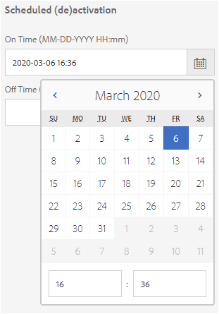
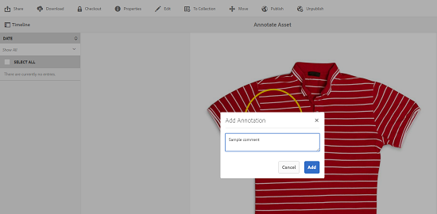
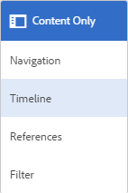
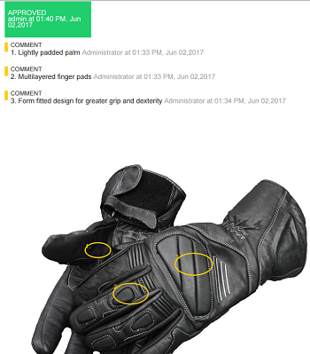

# 디지털 자산 관리 {#managing-assets-with-the-touch-optimized-ui}

이 문서에서는 AEM(Adobe Experience Manager) 자산에서 자산을 관리하고 편집하는 방법에 대해 설명합니다. 사용자 인터페이스 및 레이아웃을 시작하려면 터치 UI [의 기본 처리를 참조하십시오](/help/sites-authoring/basic-handling.md). 컨텐츠 조각을 관리하려면 컨텐츠 조각 [자산 관리를 참조하십시오](content-fragments-managing.md) .

## 폴더 만들기 {#creating-folders}

모든 이미지와 같은 자산 컬렉션을 구성할 때 폴더를 만들어 함께 유지할 수 있습니다. `Nature` 폴더를 사용하여 자산을 분류하고 구성할 수 있습니다. AEM Assets에서는 더 잘 작동하도록 폴더의 자산을 구성할 필요가 없습니다.

>[!NOTE]
>
>* Marketing Cloud에 공유할 때 해당 유형의 자산 폴더 `sling:OrderedFolder`공유가 지원되지 않습니다. 폴더를 공유하려면 폴더를 만들 때 [!UICONTROL 순서가] 지정되지 않습니다.
>* Experience Manager에서는 폴더 이름으로 `subassets` 단어를 사용할 수 없습니다. 복합 자산에 대한 하위 자산을 포함하는 노드에 예약된 키워드입니다.

1. 새 폴더를 만들 디지털 자산 폴더의 위치로 이동합니다. 메뉴에서 만들기를 **[!UICONTROL 클릭합니다]**. [새 **[!UICONTROL 폴더]를 선택합니다]**.
1. 제목 **[!UICONTROL 필드에]** 폴더 이름을 입력합니다. 기본적으로 DAM은 폴더 이름으로 제공한 제목을 사용합니다. 폴더가 만들어지면 기본값을 무시하고 다른 폴더 이름을 지정할 수 있습니다.
1. **[!UICONTROL 만들기]**&#x200B;를 클릭합니다. 폴더가 디지털 자산 폴더에 표시됩니다.

다음(공백으로 구분된) 문자는 지원되지 않습니다.

* 자산 파일 이름에는 다음 문자를 사용할 수 없습니다. `* / : [ \\ ] | # % { } ? &`
* 자산 폴더 이름에는 다음 문자를 사용할 수 없습니다. `* / : [ \\ ] | # % { } ? \" . ^ ; + & \t`

## Upload assets {#uploading-assets}

<!-- TBD the following:
Move this section into a new article. CQDOC-14874 ticket is created for this.
In this complete article, replace emphasis with UICONTROL where appropriate.
-->

로컬 폴더 또는 네트워크 드라이브에서 AEM 자산에 다양한 유형의 자산(이미지, PDF 파일, RAW 파일 등)을 업로드할 수 있습니다.

>[!NOTE]
>
>Dynamic Media - Scene7 모드에서는 파일 크기가 2GB 이하인 자산만 업로드할 수 있습니다.

처리 프로필이 할당된 폴더 또는 폴더에 자산을 업로드하도록 선택할 수 있습니다.

처리 프로필이 할당된 폴더의 경우 카드 보기의 축소판에 프로필 이름이 나타납니다. 목록 보기에서 프로필 이름이 처리 프로필 **열에 나타납니다** . 처리 [프로필을 참조하십시오](/help/assets/processing-profiles.md).

자산을 업로드하기 전에 AEM 자산에서 지원하는 [형식으로](/help/assets/assets-formats.md) 자산을 업로드해야 합니다.

1. 자산 사용자 인터페이스에서 디지털 자산을 추가할 위치로 이동합니다.
1. 자산을 업로드하려면 다음 중 하나를 수행합니다.

   * 도구 모음에서 만들기 **[!UICONTROL 아이콘을 누릅니다]** . 메뉴에서 파일을 **[!UICONTROL 누릅니다]**. 필요한 경우 표시된 대화 상자에서 파일의 이름을 변경할 수 있습니다.
   * HTML5를 지원하는 브라우저에서 자산을 자산 사용자 인터페이스에서 직접 드래그합니다. 파일 이름 바꾸기 대화 상자가 표시되지 않습니다.
   

   여러 파일을 선택하려면 Ctrl 또는 Command 키를 누르고 파일 선택기 대화 상자에서 자산을 선택합니다. iPad를 사용하는 경우 한 번에 하나의 파일만 선택할 수 있습니다.

   500MB보다 큰 자산의 업로드를 일시 중지하고 동일한 페이지에서 나중에 다시 시작할 수 있습니다. 업로드가 **[!UICONTROL 시작될 때]** 표시되는 진행률 표시줄 옆에 있는 일시 중지 아이콘을 누릅니다.

   

   자산이 큰 자산으로 간주되는 크기를 구성할 수 있습니다. 예를 들어 1000MB 이상의 자산(500MB 대신)을 큰 자산으로 간주하도록 시스템을 구성할 수 있습니다. 이 경우 1000 **[!UICONTROL MB보다]** 큰 에셋이 업로드되면 일시 중지가 진행률 표시줄에 나타납니다.

   1000MB보다 큰 파일이 1000MB보다 작은 파일로 업로드되면 [일시 중지] 단추가 표시되지 않습니다. 그러나 1,000MB 미만의 파일 업로드를 취소하면 [일시 중지] **[!UICONTROL 단추가]** 나타납니다.

   크기 제한을 수정하려면 CRX 저장소에 있는 `chunkUploadMinFileSize` 노드의 `fileupload`속성을 구성합니다.

   일시 중지 아이콘을 클릭하면 **[!UICONTROL 재생]** 아이콘으로 **[!UICONTROL 전환됩니다]** . 업로드를 다시 시작하려면 [재생] **[!UICONTROL 아이콘을 클릭합니다]** .

   

   진행 중인 업로드를 취소하려면 진행률 표시줄 옆에 있는 닫기(`X`)를 클릭합니다. 업로드 작업을 취소하면 AEM 자산에서 부분적으로 업로드된 에셋이 삭제됩니다.

   업로드를 다시 시작하는 기능은 특히 큰 자산을 업로드하는 데 시간이 오래 걸리는 저대역폭 시나리오 및 네트워크 결함 시 유용합니다. 업로드 작업을 일시 중지하고 상황이 개선되면 나중에 계속할 수 있습니다. 다시 시작하면 업로드가 일시 중지된 지점부터 시작됩니다.

   업로드 작업 중에 AEM은 업로드되는 자산의 일부를 CRX 저장소에 데이터 청크로 저장합니다. 업로드가 완료되면 AEM은 이러한 청크를 저장소의 단일 데이터 블록으로 통합합니다.

   완료되지 않은 청크 업로드 작업에 대한 정리 작업을 구성하려면 로 `https://[aem_server]:[port]/system/console/configMgr/org.apache.sling.servlets.post.impl.helper.ChunkCleanUpTask`이동하십시오.

   자산을 업로드하고 있는 위치에서 이미 사용할 수 있는 자산의 이름과 같은 이름으로 자산을 업로드하면 경고 대화 상자가 표시됩니다.

   기존 자산을 교체하거나, 다른 버전을 만들거나, 업로드된 새 자산의 이름을 변경하여 두 가지 모두를 유지하도록 선택할 수 있습니다. 기존 자산을 대체할 경우, 자산에 대한 메타데이터와 기존 자산에 대해 수행한 이전 수정(예: 주석 또는 자르기)은 삭제됩니다. 두 자산을 모두 유지하려면 새 자산의 이름이 이름에 숫자가 `1` 추가되어 변경됩니다.

   

   >[!NOTE]
   >
   >이름 충돌 **[!UICONTROL 대화 상자에서]** 대체를 선택하면  새 자산에 대해 자산 ID가 다시 생성됩니다. 이 ID는 이전 자산의 ID와 다릅니다.
   >
   >자산 통찰력이 Adobe Analytics를 사용하여 노출 횟수/클릭 수를 추적하도록 활성화되면 재생성된 자산 ID가 Analytics에서 자산에 대해 캡처된 데이터를 무효화합니다.

   업로드한 자산이 AEM 자산에 존재하는 경우 중복 **[!UICONTROL 자산]** 검색 대화 상자가 중복 자산을 업로드하려고 함을 경고합니다. 이 대화 상자는 기존 자산의 바이너리의 `SHA 1` 체크섬 값이 업로드한 자산의 체크섬 값과 일치하는 경우에만 나타납니다. 이 경우 자산의 이름은 중요하지 않습니다.

   >[!NOTE]
   >
   >중복 [!UICONTROL 검색] 기능이 활성화된 경우에만 검색된 복제 대화 상자가 나타납니다. 중복 감지 기능을 활성화하려면 복제 감지 [활성화를 참조하십시오](/help/assets/duplicate-detection.md).

   

   AEM 자산에 중복 자산을 유지하려면 유지를 탭/ **[!UICONTROL 클릭합니다]**. 업로드한 중복 자산을 삭제하려면 삭제를 탭/ **[!UICONTROL 클릭합니다]**.

   AEM Assets에서는 파일 이름에 금지된 문자가 포함된 자산을 업로드할 수 없습니다. 허용되지 않은 문자 등이 들어 있는 파일 이름으로 자산을 업로드하려고 하면 AEM Assets는 경고 메시지를 표시하고 이러한 문자를 제거하거나 허용되는 이름으로 업로드할 때까지 업로드를 중지합니다.

   조직에 대한 특정 파일 이름 지정 규칙에 맞추기 위해 자산 [!UICONTROL 업로드] 대화 상자를 사용하여 업로드하는 파일의 긴 이름을 지정할 수 있습니다.

   그러나 다음(공백으로 구분된) 문자는 지원되지 않습니다.

   * 자산 파일 이름에 `* / : [ \\ ] | # % { } ? &`
   * 에셋 폴더 이름은 포함하지 않아야 합니다. `* / : [ \\ ] | # % { } ? \" . ^ ; + & \t`
   

   또한 자산 사용자 인터페이스에는 업로드한 최신 자산 또는 처음 만든 폴더가 표시됩니다.

   파일이 업로드되기 전에 업로드 작업을 취소하면 AEM 자산에서 현재 파일 업로드를 중지하고 컨텐츠를 새로 고칩니다. 하지만 이미 업로드된 파일은 삭제되지 않습니다.

   AEM 자산의 업로드 진행 대화 상자에는 업로드된 파일 수와 업로드하지 못한 파일의 수가 표시됩니다.

### 시리얼 업로드 {#serialuploads}

대량의 자산을 일괄 업로드하면 상당한 입출력 리소스가 소비되므로 AEM 자산 인스턴스의 성능에 부정적인 영향을 줄 수 있습니다. 특히 인터넷 연결이 느린 경우 디스크 I/O의 급증으로 인해 업로드 시간이 크게 늘어납니다.또한, 웹 브라우저에서는 동시 자산 업로드에 대해 AEM Assets가 처리할 수 있는 POST 요청 수에 대한 추가 제한을 도입할 수 있습니다. 따라서 업로드 작업이 실패하거나 너무 빨리 종료됩니다. 즉, AEM 자산은 여러 파일을 인제스트하는 동안 일부 파일을 놓치거나 파일을 인제스트하지 못할 수 있습니다.

이러한 상황을 극복하기 위해 AEM Assets는 일괄 업로드 작업 중에 모든 자산을 동시에 인제스트하는 대신 한 번에 하나의 자산을 인제스트합니다(시리얼 업로드).

자산 일련 업로드는 기본적으로 활성화되어 있습니다. 이 기능을 비활성화하고 동시 업로드를 허용하려면 `fileupload` 노드를 Crx-de로 오버레이하고 `parallelUploads` 속성 값을 로 `true`설정합니다.

### FTP를 사용하여 자산 업로드 {#uploading-assets-using-ftp}

Dynamic Media를 사용하면 FTP 서버를 통해 자산을 일괄 업로드할 수 있습니다. 큰 자산(> 1GB)을 업로드하거나 전체 폴더 및 하위 폴더를 업로드하려면 FTP를 사용해야 합니다. FTP 업로드를 반복 예약 기반으로 설정할 수도 있습니다.

>[!NOTE]
>
>Dynamic Media - Scene7 모드에서는 파일 크기가 2GB 이하인 자산만 업로드할 수 있습니다.

>[!NOTE]
>
>Dynamic Media - Scene7 모드에서 FTP를 통해 자산을 업로드하려면 AEM 작성자 인스턴스에 Feature Pack 18912를 설치합니다. FP- [18912에](https://helpx.adobe.com/kr/contact/enterprise-support.ec.html) 액세스하고 FTP 계정 설정을 완료하려면 Adobe 고객 지원 센터에 문의하십시오. 자세한 내용은 벌크 에셋 [마이그레이션을](/help/assets/bulk-ingest-migrate.md)위한 기능 팩 18912 설치를 참조하십시오.
>
>자산을 업로드하기 위해 FTP를 사용하는 경우 AEM에 지정된 업로드 설정이 무시됩니다. 대신 Dynamic Media Classic에 정의된 파일 처리 규칙이 사용됩니다.

**FTP를 사용하여 자산을 업로드하려면**

1. 원하는 FTP 클라이언트를 사용하여 프로비저닝 이메일에서 받은 FTP 사용자 이름과 암호를 사용하여 FTP 서버에 로그인합니다. FTP 클라이언트에서 FTP 서버에 파일이나 폴더를 업로드합니다.
1. [프로비저닝 이메일에서 받은](https://www.adobe.com/marketing-cloud/experience-manager/scene7-login.html) 자격 증명을 사용하여 Dynamic Media Classic에 로그인합니다. 전역 탐색 막대에서 업로드를 **[!UICONTROL 누릅니다]**.

1. 왼쪽 위 모서리 근처의 업로드 페이지에서 FTP **[!UICONTROL 사용]** 탭을 누릅니다.
1. 페이지 왼쪽에서 파일을 업로드할 FTP 폴더를 선택합니다.페이지 오른쪽에서 대상 폴더를 선택합니다.
1. 페이지의 오른쪽 아래 모서리 근처에 있는 작업 **[!UICONTROL 옵션을]** 클릭한 다음 선택한 폴더의 자산을 기반으로 원하는 옵션을 설정합니다.

   업로드 [작업 옵션을 참조하십시오](#upload-job-options).

   >[!NOTE]
   >
   >FTP를 통해 자산을 업로드하면 Dynamic Media Classic(S7)에서 설정한 업로드 작업 옵션이 AEM에서 설정된 자산 처리 매개 변수보다 우선합니다.

1. [업로드 작업 옵션] 대화 상자의 오른쪽 아래에 있는 [저장]을 **[!UICONTROL 탭합니다]**.
1. [업로드] 페이지의 오른쪽 아래에 있는 [업로드 제출]을 **[!UICONTROL 누릅니다]**.

   업로드의 진행 상태를 보려면 글로벌 탐색 막대에서 작업을 **[!UICONTROL 누릅니다]**. [작업] 페이지에는 업로드 진행률이 표시됩니다. AEM에서 계속 작업하고 언제든지 Dynamic Media Classic의 작업 페이지로 돌아가 진행 중인 작업을 검토할 수 있습니다.
진행 중인 업로드 작업을 취소하려면 기간 **[!UICONTROL 옆에 있는]** 취소를 누릅니다.

#### 업로드 작업 옵션 {#upload-job-options}

| 업로드 옵션 | 하위 옵션 | 설명 |
|---|---|---|
| 작업 이름 |  | 텍스트 필드에 미리 입력되어 있는 기본 이름에는 사용자가 입력한 이름과 날짜 및 시간 스탬프가 포함됩니다. 이 업로드 작업에 기본 이름을 사용하거나 직접 만든 이름을 입력할 수 있습니다.  작업 및 기타 업로드 및 게시 작업은 작업 페이지에 기록되므로 작업 상태를 확인할 수 있습니다. |
| 업로드 후 게시 |  | 업로드한 자산을 자동으로 게시합니다. |
| 확장명에 상관없이 동일한 기본 자산 이름으로 모든 폴더에 덮어쓰기 |  | 업로드한 파일을 동일한 이름으로 대체하려면 이 옵션을 선택합니다. 이 옵션의 이름은 [응용 프로그램 설정] > [일반 설정] > [응용 프로그램에 **[!UICONTROL 대한]** **** 설정 **]** > [이미지 **[!UICONTROL 덮어쓰기]**]의 설정에 따라달라질 수있습니다. |
| 업로드 시 Zip 또는 Tar 파일 압축 해제 |  |  |
| 작업 옵션 |  | 작업 옵션을 탭/ **[!UICONTROL 클릭하여]** 업로드 [!UICONTROL 작업 옵션] 대화 상자를 열고 전체 업로드 작업에 영향을 주는 옵션을 선택합니다. 이러한 옵션은 모든 파일 유형에 대해 동일합니다. [응용 프로그램 일반 설정] 페이지에서 시작하는 파일을 업로드하기 위한 기본 옵션을 선택할 수 있습니다. 이 페이지를 열려면 설정 > **[!UICONTROL 애플리케이션]** 설정을 **[!UICONTROL 선택합니다]**. 기본 업로드 **[!UICONTROL 옵션]** 단추를 눌러 업로드 작업 [!UICONTROL 옵션] 대화 상자를 엽니다. |
|  | 화이트보드 | [1회] 또는 [반복]을 선택합니다. 반복 작업을 설정하려면 반복 옵션(일별, 주별, 월별 또는 사용자 지정)을 선택하여 FTP 업로드 작업이 반복될 시기를 지정합니다. 그런 다음 필요에 따라 예약 옵션을 지정합니다. |
|  | 하위 폴더 포함 | 업로드할 폴더 내의 모든 하위 폴더를 업로드합니다. 업로드한 폴더 및 하위 폴더의 이름은 AEM 자산에 자동으로 입력됩니다. |
|  | 자르기 옵션 | 이미지의 양쪽에서 수동으로 자르려면 [자르기] 메뉴를 선택하고 [수동]을 선택합니다. 그런 다음 이미지의 특정 측면이나 각 면에서 자를 픽셀 수를 입력합니다. 이미지 파일의 ppi(인치당 픽셀 수) 설정에 따라 이미지의 크기가 잘립니다. 예를 들어 이미지가 150ppi로 표시되고 [위쪽], [오른쪽], [아래쪽] 및 [왼쪽] 텍스트 상자에 75를 입력하면 각 면에서 1/2인치가 잘립니다.  이미지에서 공백 픽셀을 자동으로 자르려면 [자르기] 메뉴를 열고 [수동]을 선택한 다음 [위쪽], [오른쪽], [아래쪽] 및 [왼쪽] 필드에 픽셀 측정을 입력하여 양쪽에서 자를 수 있습니다. 자르기 메뉴에서 트리밍을 선택하고 다음 옵션을 선택할 수도 있습니다.  **트리밍 기준** <ul><li>**색상** - 색상 옵션을 선택합니다. 그런 다음 [모퉁이] 메뉴를 선택하고 자르려는 흰색 공간을 가장 잘 나타내는 색상이 있는 이미지 모서리를 선택합니다.</li><li>**투명도** - 투명도 옵션을 선택합니다.  **허용치** - 슬라이더를 드래그하여 0에서 1까지의 허용치를 지정합니다. 색상을 기반으로 트리밍하는 경우 이미지 모서리에서 선택한 색상과 정확히 일치하는 경우에만 픽셀을 자르려면 0을 지정합니다. 숫자가 1에 가까울수록 색상 차이가 더 커집니다. 투명도를 기반으로 트리밍하는 경우 투명할 경우에만 픽셀을 자르려면 0을 지정합니다. 숫자가 1에 가까울수록 투명도가 높아집니다.</li></ul> 이러한 자르기 옵션은 원본을 훼손하지 않습니다. |
|  | 색상 프로파일 옵션 | 전달에 사용되는 최적화된 파일을 만들 때 색상 변환을 선택합니다.<ul><li>기본 색상 유지:이미지에 색상 공간 정보가 포함될 때마다 소스 이미지 색상을 유지합니다.색상 변환은 없습니다. 현재 거의 모든 이미지에 해당 색상 프로파일이 이미 포함되어 있습니다. 그러나 CMYK 소스 이미지에 포함된 색상 프로필이 없으면 색상이 sRGB(표준 빨강 녹색 파랑) 색상 공간으로 변환됩니다. sRGB는 웹 페이지에 이미지를 표시하기 위한 권장 색상 공간입니다.</li><li>원본 색상 공간 유지:이때 색상 변환 없이 원래 색상을 유지합니다. 포함된 색상 프로파일이 없는 이미지의 경우 모든 색상 변환은 [게시] 설정에 구성된 기본 색상 프로파일을 사용하여 수행됩니다. 색상 프로필은 이 옵션으로 만든 파일의 색상과 일치하지 않을 수 있습니다. 따라서 [기본 색상 유지] 옵션을 사용하는 것이 좋습니다.</li><li>[사용자 정의 시작  ] > [대상] 메뉴를 열어 [변환 대상] 및 [색상 공간으로 변환]을 선택할 수 있습니다. 이 고급 옵션은 소스 파일에 포함된 모든 색상 정보를 무시합니다. 제출하는 모든 이미지에 잘못된 색상 프로파일 데이터가 있거나 누락된 경우 이 옵션을 선택합니다.</li></ul> |
|  | 이미지 편집 옵션 | 이미지의 클리핑 마스크를 유지하고 색상 프로파일을 선택할 수 있습니다.  업로드할 [때](#setting-image-editing-options-at-upload)이미지 편집 옵션 설정을 참조하십시오. |
|  | Postscript 옵션 | PostScript® 파일을 래스터화하고, 파일을 자르고, 투명한 배경을 유지하고, 해상도를 선택하고, 색상 공간을 선택할 수 있습니다.  PostScript [및 Illustrator 업로드 옵션](#setting-postscript-and-illustrator-upload-options)설정을 참조하십시오. |
|  | Photoshop 옵션 | Adobe® Photoshop® 파일에서 템플릿을 만들고, 레이어를 유지하고, 레이어 이름 지정 방법을 지정하고, 텍스트를 추출하고, 이미지를 템플릿에 고정하는 방법을 지정할 수 있습니다.  템플릿은 AEM에서 지원되지 않습니다.  Photoshop [업로드 옵션](#setting-photoshop-upload-options)설정을 참조하십시오. |
|  | PDF 옵션 | 파일을 래스터화하고, 검색어와 링크를 추출하고, eCatalog를 자동 생성하고, 해상도를 설정하고, 색상 공간을 선택할 수 있습니다.  eCatalog는 AEM에서 지원되지 않습니다.   PDF [업로드 옵션](#setting-pdf-upload-options)설정을 참조하십시오. |
|  | Illustrator 옵션 | Adobe Illustrator® 파일을 래스터화하고 투명한 배경을 유지하며 해상도를 선택하고 색상 공간을 선택할 수 있습니다.  PostScript [및 Illustrator 업로드 옵션](#setting-postscript-and-illustrator-upload-options)설정을 참조하십시오. |
|  | EVideo 옵션 | 비디오 사전 설정을 선택하여 비디오 파일을 트랜스코딩할 수 있습니다.  eVideo [업로드 옵션](#setting-evideo-upload-options)설정을 참조하십시오. |
|  | 배치 집합 사전 설정 | 업로드된 파일에서 이미지 세트 또는 회전 집합을 만들려면 사용할 사전 설정에 대한 활성 열을 클릭합니다. 두 개 이상의 사전 설정을 선택할 수 있습니다. Dynamic Media Classic의 [응용 프로그램 설정/배치 집합 사전 설정] 페이지에서 사전 설정을 만듭니다.  일괄 [세트 사전 설정 만들기에 대한 자세한 내용은 일괄 세트 사전 설정을 이미지 세트 및 스핀](config-dms7.md#creating-batch-set-presets-to-auto-generate-image-sets-and-spin-sets) 세트 자동 생성으로 구성을 참조하십시오.  업로드할 [때](#setting-batch-set-presets-at-upload)배치 집합 사전 설정 설정을 참조하십시오. |

#### 업로드 시 이미지 편집 옵션 설정 {#setting-image-editing-options-at-upload}

AI, EPS 및 PSD 파일을 비롯한 이미지 파일을 업로드할 때 [업로드 작업 옵션] [!UICONTROL 대화 상자에서 다음 편집 작업을 수행할 수] 있습니다.

* 이미지 가장자리에서 공백을 자릅니다(위 표의 설명 참조).
* 이미지 측면에서 수동으로 자를 수 있습니다(위 표의 설명 참조).
* 색상 프로파일을 선택합니다(위 표의 옵션 설명 참조).
* 클리핑 패스에서 마스크를 만듭니다.
* 언샵 마스크 옵션을 사용하여 이미지 선명하게 하기
* 녹아웃 배경

<!--
| Option | Sub-option | Description |
|---|---|---|
| Create Mask From Clipping Path | | Create a mask for the image based on its clipping path information. This option applies to images created with image-editing applications in which a clipping path was created. |
| Unsharp Masking | | Lets you fine-tune a sharpening filter effect on the final downsampled image, controlling the intensity of the effect, the radius of the effect (as measured in pixels), and a threshold of contrast that is ignored.  This effect uses the same options as Photoshop’s Unsharp Mask filter. Contrary to what the name suggests, Unsharp Mask is a sharpening filter. Under Unsharp Masking, set the options you want. Setting options are described in the following: |
| | Amount | Controls the amount of contrast that is applied to edge pixels.  Think of it as the intensity of the effect. The main difference between the amount values of Unsharp Mask in Dynamic Media and the amount values in Adobe Photoshop, is that Photoshop has an amount range of 1% to 500%. Whereas, in Dynamic Media, the value range is 0.0 to 5.0. A value of 5.0 is the rough equivalent of 500% in Photoshop; a value of 0.9 is the equivalent of 90%, and so on. |
| | Radius | Controls the radius of the effect. The value range is 0-250.  The effect is run on all pixels in an image and radiates out from all pixels in all directions. The radius is measured in pixels. For example, to get a similar sharpening effect for a 2000 x 2000 pixel image and 500 x 500 pixel image, you would set a radius of two pixels on the 2000 x 2000 pixel image and a radius value of one pixel on the 500 x 500 pixel image. A larger value is used for an image that has more pixels. |
| | Threshold | Threshold is a range of contrast that is ignored when the Unsharp Mask filter is applied. It is important so that no "noise" is introduced to an image when this filter is used. The value range is 0-255, which is the number of brightness steps in a grayscale image. 0=black, 128=50% gray and 255=white.  For example, a threshold value of 12 ignores slight variations is skin tone brightness to avoid adding noise, but still add edge contrast to areas such as where eyelashes meet skin.  For example, if you have a photo of someone’s face, the Unsharp Mask affects the parts of the image, such as where eyelashes and skin meet to create an obvious area of contrast, and the smooth skin itself. Even the smoothest skin exhibits subtle changes in brightness values. If you do not use a threshold value, the filter accentuates these subtle changes in skin pixels. In turn, a noisy and undesirable effect is created while contrast on the eyelashes is increased, enhancing sharpness.  To avoid this issue, a threshold value is introduced that tells the filter to ignore pixels that do not change contrast dramatically, like smooth skin.  In the zipper graphic shown earlier, notice the texture next to the zippers. Image noise is exhibited because the threshold values were too low to suppress the noise. |
| | Monochrome | Select to unsharp-mask image brightness (intensity).  Deselect to unsharp-mask each color component separately. |
| Knockout Background | | Automatically removes the background of an image when you upload it. This technique is useful to draw attention to a particular object and make it stand out from a busy background. Select to enable or “turn on” the Knockout Background feature and the following sub-options: |
| | Corner | Required.  The corner of the image that is used to define the background color to knockout.  You can choose from **Upper Left**, **Bottom Left**, **Upper Right**, or **Bottom Right**. |
| | Fill Method | Required.  Controls pixel transparency from the Corner location that you set.  You can choose from the following fill methods: <ul><li>**Flood Fill** - turns all pixels transparent that match the Corner that you have specified and are connected to it.</li><li>**Match Pixel** - turns all matching pixels transparent, regardless of their location on the image.</li></ul> |
| | Tolerance | Optional.  Controls the allowable amount of variation in pixel color matching based on the Corner location that you set.  Use a value of 0.0 to match pixel colors exactly or, use a value of 1.0 to allow for the greatest variation. |
-->

#### PostScript 및 Illustrator 업로드 옵션 설정 {#setting-postscript-and-illustrator-upload-options}

PostScript(EPS) 또는 Illustrator(AI 파섹) 이미지 파일을 업로드할 때 다양한 방법으로 형식을 지정할 수 있습니다. 파일을 래스터화하고 투명한 배경을 유지하고 해상도를 선택한 다음 색상 공간을 선택할 수 있습니다. PostScript 및 Illustrator 파일의 서식 지정 옵션은 PostScript 옵션 및 Illustrator [!UICONTROL 옵션] 아래의 [!UICONTROL 업로드] 작업 [!UICONTROL 옵션]대화상자에서 사용할 수있습니다.

| 옵션 | 하위 옵션 | 설명 |
|---|---|---|
| 처리 중 |  | 래스터화를 **[!UICONTROL 선택하여]** 파일의 벡터 그래픽을 비트맵 포맷으로 변환합니다. |
| 렌더링된 이미지에서 투명한 배경 유지 |  | 파일의 백그라운드 투명도를 유지합니다. |
| 해상도 |  | 해상도 설정을 결정합니다. 이 설정은 파일에 인치당 표시되는 픽셀 수를 결정합니다. |
| 색상 공간 |  | 색상 공간 메뉴를 선택하고 다음 색상 공간 옵션 중에서 선택합니다. |
|  | 자동으로 검색 | 파일의 색상 공간을 유지합니다. |
|  | RGB로 강제 적용 | RGB 색상 공간으로 변환합니다. |
|  | CMYK로 강제 적용 | CMYK 색상 공간으로 변환합니다. |
|  | 회색 음영으로 강제 적용 | 회색 음영 색상 공간으로 변환합니다. |

#### Photoshop 업로드 옵션 설정 {#setting-photoshop-upload-options}

Photoshop 문서(PSD) 파일은 이미지 템플릿을 만드는 데 가장 많이 사용됩니다. PSD 파일을 업로드할 때 파일에서 자동으로 이미지 템플릿을 만들 수 있습니다(업로드 화면에서 템플릿 [!UICONTROL 만들기] 옵션 선택).

Dynamic Media는 파일을 사용하여 템플릿을 만들 경우 레이어가 포함된 PSD 파일에서 여러 이미지를 만듭니다.각 레이어에 대해 하나의 이미지를 만듭니다.

Photoshop [!UICONTROL 업로드] 옵션과 [!UICONTROL 함께 위에 설명된]자르기 옵션 및 색상 프로파일 옵션을 사용합니다.

>[!NOTE]
>
>템플릿은 AEM에서 지원되지 않습니다.

| 옵션 | 하위 옵션 | 설명 |
|---|---|---|
| 레이어 유지 |  | PSD의 레이어(있는 경우)를 개별 에셋으로 리핑합니다. 에셋 레이어는 PSD와 연결된 상태로 유지됩니다. 세부 사항 보기에서 PSD 파일을 열고 레이어 패널을 선택하여 볼 수 있습니다. |
| 템플릿 만들기 |  | PSD 파일의 레이어에서 템플릿을 만듭니다. |
| 텍스트 추출 |  | 사용자가 뷰어에서 텍스트를 검색할 수 있도록 텍스트를 추출합니다. |
| 레이어를 배경 크기로 확장 |  | 리핑된 이미지 레이어의 크기를 배경 레이어 크기로 확장합니다. |
| 레이어 이름 지정 |  | PSD 파일의 레이어는 별도의 이미지로 업로드됩니다. |
|  | 레이어 이름 | PSD 파일에서 이미지 이름을 레이어 이름 다음에 지정합니다. 예를 들어 원본 PSD 파일의 Price Tag라는 레이어는 Price Tag라는 이미지가 됩니다. 그러나 PSD 파일의 레이어 이름이 기본 Photoshop 레이어 이름(배경, 레이어 1, 레이어 2 등)인 경우 이미지는 기본 레이어 이름이 아니라 PSD 파일에서 레이어 번호의 이름을 따릅니다. |
|  | Photoshop 및 레이어 번호 | 원본 레이어 이름은 무시하고 PSD 파일에서 레이어 번호 다음에 이미지 이름을 지정합니다. 이미지 이름은 Photoshop 파일 이름과 추가된 레이어 번호로 지정됩니다. 예를 들어 Spring Ad.psd라는 파일의 두 번째 레이어는 Photoshop에서 기본값이 아닌 이름을 사용하더라도 Spring Ad_2로 지정됩니다. |
|  | Photoshop 및 레이어 이름 | PSD 파일 다음에 레이어 이름 또는 레이어 번호가 나오는 이미지 이름을 지정합니다. 레이어 번호는 PSD 파일의 레이어 이름이 기본 Photoshop 레이어 이름인 경우에 사용됩니다. 예를 들어 SpringAd라는 PSD 파일의 Price Tag라는 레이어는 Spring Ad_Price Tag라고 합니다. 기본 이름이 Layer 2인 레이어를 Spring Ad_2라고 합니다. |
| 앵커 |  | PSD 파일에서 생성된 레이어로 구성된 컴포지션에서 생성된 템플릿에 이미지를 고정시키는 방법을 지정합니다. 기본적으로 앵커는 가운데입니다. 가운데 앵커를 사용하면 교체 이미지의 종횡비에 상관없이 대체 이미지가 동일한 공간을 가장 잘 채울 수 있습니다. 템플릿을 참조하고 매개 변수 대체를 사용할 때 이 이미지를 대체하는 다른 측면을 가진 이미지가 동일한 공간을 효과적으로 차지합니다. 애플리케이션에서 템플릿의 할당된 공간을 채우려면 대체 이미지가 필요한 경우 다른 설정으로 변경합니다. |

#### PDF 업로드 옵션 설정 {#setting-pdf-upload-options}

PDF 파일을 업로드할 때 다양한 방법으로 형식을 지정할 수 있습니다. 페이지를 자르고, 검색어를 추출하고, 인치당 픽셀 해상도를 입력하고, 색상 공간을 선택합니다. PDF 파일에는 트림 여백, 자르기 표시, 등록 표시 및 기타 프린터 표시가 포함되어 있는 경우가 많습니다. PDF 파일을 업로드할 때 페이지 측면에서 이러한 표시를 자를 수 있습니다.

>[!NOTE]
>
>eCatalog는 AEM에서 지원되지 않습니다.

다음 옵션 중에서 선택합니다.

| 옵션 | 하위 옵션 | 설명 |
|---|---|---|
| 처리 중 | 래스터화 | (기본값) PDF 파일의 페이지를 자르고 벡터 그래픽을 비트맵 이미지로 변환합니다. eCatalog를 만들려면 이 옵션을 선택합니다. |
| 추출 | 검색어 | eCatalog 뷰어에서 파일을 키워드로 검색할 수 있도록 PDF 파일에서 단어를 추출합니다. |
|  | 링크 | PDF 파일에서 링크를 추출하여 eCatalog 뷰어에서 사용되는 이미지 맵으로 변환합니다. |
| 여러 페이지 PDF에서 eCatalog 자동 생성 |  | PDF 파일에서 eCatalog를 자동으로 만듭니다. eCatalog는 업로드한 PDF 파일의 이름을 따릅니다. 이 옵션은 업로드할 때 PDF 파일을 래스터화하는 경우에만 사용할 수 있습니다. |
| 해상도 |  | 해상도 설정을 결정합니다. 이 설정은 PDF 파일에서 인치당 표시되는 픽셀 수를 결정합니다. 기본값은 150입니다. |
| 색상 공간 |  | [색상 공간] 메뉴를 선택하고 PDF 파일의 색상 공간을 선택합니다. 대부분의 PDF 파일에는 RGB 및 CMYK 색상 이미지가 모두 있습니다. RGB 색상 공간은 온라인 보기용으로 선호됩니다. |
|  | 자동으로 검색 | PDF 파일의 색상 공간을 유지합니다. |
|  | RGB로 강제 적용 | RGB 색상 공간으로 변환합니다. |
|  | CMYK로 강제 적용 | CMYK 색상 공간으로 변환합니다. |
|  | 회색 음영으로 강제 적용 | 회색 음영 색상 공간으로 변환합니다. |

#### eVideo 업로드 옵션 설정 {#setting-evideo-upload-options}

다양한 비디오 사전 설정 중에서 선택하여 비디오 파일을 트랜스코딩합니다.

| 옵션 | 하위 옵션 | 설명 |
|---|---|---|
| 응용 비디오 |  | 모바일, 태블릿 및 데스크탑에 전달할 비디오를 제작하는 데 필요한 모든 종횡비와 연동되는 단일 인코딩 사전 설정 이 사전 설정으로 인코딩된 업로드된 소스 비디오는 고정된 높이로 설정됩니다. 그러나 너비는 비디오의 종횡비를 유지하도록 자동으로 조절됩니다.  응용 비디오 인코딩을 사용하는 것이 좋습니다. |
| 단일 인코딩 사전 설정 | 인코딩 사전 설정 정렬 | 이름 또는 크기를 선택하여 이름 또는 해상도 크기로 데스크탑, 모바일 및 태블릿 아래에 나열된 인코딩 사전 설정을 정렬합니다. |
|  | 데스크톱 | 데스크탑 컴퓨터에 스트리밍 또는 점진적 비디오 경험을 전달하기 위한 MP4 파일을 만듭니다.해상도 크기와 원하는 대상 데이터 속도로 종횡비를 하나 이상 선택하십시오. |
|  | 모바일 | iPhone 또는 Android 모바일 장치에 전달할 MP4 파일을 만듭니다.해상도 크기와 원하는 대상 데이터 속도로 종횡비를 하나 이상 선택하십시오. |
|  | 태블릿 | iPad 또는 Android 태블릿 장치에 전달할 MP4 파일을 만듭니다.해상도 크기와 원하는 대상 데이터 속도로 종횡비를 하나 이상 선택하십시오. |

#### 업로드 시 배치 집합 사전 설정 설정 {#setting-batch-set-presets-at-upload}

업로드된 이미지에서 이미지 세트 또는 회전 집합을 자동으로 만들려면 사용하려는 사전 설정의 활성 열을 클릭합니다. 두 개 이상의 사전 설정을 선택할 수 있습니다.

일괄 [세트 사전 설정 만들기에 대한 자세한 내용은 일괄 세트 사전 설정을 이미지 세트 및 스핀](/help/assets/config-dms7.md#creating-batch-set-presets-to-auto-generate-image-sets-and-spin-sets) 세트 자동 생성으로 구성을 참조하십시오.

### 스트리밍 업로드 {#streamed-uploads}

AEM에 많은 자산을 업로드하면 I/O 요청이 크게 증가하여 업로드 효율성이 줄어들고 일부 업로드 작업이 시간 초과될 수도 있습니다. AEM Assets는 자산 스트리밍을 지원합니다. 스트리밍된 업로드는 업로드 작업 중 디스크 I/O를 줄여줍니다. 이렇게 하면 서버에 있는 임시 폴더의 에셋을 보관소에 복사하기 전에 저장할 수 없습니다. 대신 데이터가 저장소로 직접 전송됩니다. 이렇게 하면 대용량 에셋을 업로드할 시간과 제한 시간이 줄어듭니다. AEM 자산에서 기본적으로 스트리밍된 업로드가 활성화됩니다.

>[!NOTE]
>
>servlet-api 버전이 3.1보다 낮은 JEE 서버에서 실행되는 AEM에 대해 스트리밍 업로드가 비활성화됩니다.

### 에셋이 포함된 ZIP 아카이브 추출 {#extractzip}

지원되는 다른 자산과 마찬가지로 ZIP 아카이브를 업로드할 수 있습니다. 동일한 파일 이름 규칙이 ZIP 파일에 적용됩니다. AEM에서는 ZIP 아카이브를 DAM 위치에 추출할 수 있습니다. 아카이브 파일에 ZIP이 확장명으로 들어 있지 않으면 컨텐츠를 사용하여 파일 유형 검색을 활성화합니다.

한 번에 하나의 ZIP 아카이브를 선택하고 아카이브 **[!UICONTROL 추출을]**&#x200B;클릭한 다음 대상 폴더를 선택합니다. 충돌을 처리할 옵션을 선택합니다(있는 경우). ZIP 파일의 자산이 이미 대상 폴더에 있는 경우 다음 옵션 중 하나를 선택할 수 있습니다.추출 생략, 기존 파일 바꾸기, 이름을 변경하여 두 에셋 모두 유지 또는 새 버전 만들기

추적이 완료되면 AEM에서 알림 영역에 알려줍니다. AEM이 ZIP을 추출하는 동안 추출을 중단하지 않고 작업을 다시 시작할 수 있습니다.

이 기능의 일부 제한 사항은 다음과 같습니다.

* 동일한 이름의 폴더가 대상에 있으면 ZIP 파일의 에셋이 기존 폴더에 추출됩니다.
* 압축을 취소하면 이미 추출된 에셋이 삭제되지 않습니다.
* 두 개의 ZIP 파일을 동시에 선택하여 추출할 수 없습니다. 한 번에 하나의 ZIP 보관만 추출할 수 있습니다.
* ZIP 아카이브를 업로드할 때 업로드 대화 상자에 500 서버 오류가 표시되면 최신 서비스 팩을 설치한 후 다시 시도하십시오.

## 에셋 미리 보기 {#previewing-assets}

자산을 미리 보려면 다음 단계를 따르십시오.

1. 자산 사용자 인터페이스에서 미리 보려는 자산의 위치로 이동합니다.
1. 원하는 자산을 눌러 엽니다.

1. 미리 보기 모드에서는 [지원되는 이미지 유형](/help/assets/assets-formats.md#supported-raster-image-formats) (대화형 편집 포함)에 대해 확대/축소 옵션을 사용할 수 있습니다.

   자산을 확대하려면 자산을 탭/클릭( `+` 또는 자산에서 확대경을 탭/클릭)합니다. 축소하려면 탭/클릭합니다 `-`. 확대하면 패닝하여 이미지의 모든 영역을 자세히 볼 수 있습니다. 확대/축소 재설정 화살표를 클릭하면 원래 보기로 돌아갑니다.

   

   재설정을 **[!UICONTROL 눌러]** 보기를 원래 크기로 재설정합니다.

   

**키보드 키만 사용하여 에셋 미리 보기**

키보드를 사용하여 자산을 미리 보려면 다음 단계를 따르십시오.

1. 자산 사용자 인터페이스에서 `Tab` 및 화살표 키를 사용하여 원하는 자산으로 이동합니다.

1. 원하는 자산의 `Enter` 키를 눌러 엽니다. 미리 보기 모드에서 자산을 확대할 수 있습니다.

1. 자산을 확대하려면:
   1. 키를 사용하여 포커스를 확대 아이콘으로 이동합니다. `Tab`
   1. 키를 사용하여 이미지를 확대합니다. `Enter`
   축소하려면 `Tab` 키를 사용하여 포커스를 확대/축소 아이콘으로 이동한 다음 키를 누릅니다 `Enter`.

1. + `Shift` `Tab` 키를 사용하여 이미지에서 포커스를 다시 이동합니다.

1. 화살표 키를 사용하여 확대된 이미지 주위로 이동합니다.

다이내믹 [미디어 자산 미리 보기를 참조하십시오.](/help/assets/previewing-assets.md)

## 속성 및 메타데이터 편집 {#editing-properties}

1. 편집할 메타데이터가 있는 자산의 위치로 이동합니다.

1. 자산을 선택하고 도구 모음에서 **[!UICONTROL 속성을]** 탭/클릭하여 자산 속성을 봅니다. 또는 자산 **[!UICONTROL 카드에서 속성]** 빠른 작업을 선택합니다.

   

1. 속성 [!UICONTROL 페이지에서] 다양한 탭에서 메타데이터 속성을 편집합니다. 예를 들어 기본 **[!UICONTROL 탭에서]** 제목, 설명 등을 편집합니다.

   >[!NOTE]
   >
   >속성 페이지의 레이아웃 [!UICONTROL 및] 사용 가능한 메타데이터 속성은 기본 메타데이터 스키마에 따라 다릅니다. 속성 페이지의 레이아웃을 수정하는 방법에 대해 [!UICONTROL 알아보려면] 메타데이터 스키마를 [참조하십시오](/help/assets/metadata-schemas.md).

1. 자산의 활성화를 위한 특정 날짜/시간을 예약하려면 [설정 시간] 필드 옆에 있는 날짜 **[!UICONTROL 선택기를 사용합니다]** .

   

   *그림:자산 활성화 예약*

1. 특정 기간 후에 자산을 비활성화하려면 해제 시간 필드 옆에 있는 날짜 선택기에서 비활성화 날짜/시간을 **[!UICONTROL 선택합니다]** . 비활성화 날짜는 자산의 활성화 날짜보다 이후여야 합니다. 해제 [!UICONTROL 시간]후에는 자산 웹 인터페이스 또는 HTTP API를 통해 자산 및 표현물을 사용할 수 없습니다.

   

   *그림:자산 비활성화 예약*

1. 태그 **[!UICONTROL 필드에서]** 하나 이상의 태그를 선택합니다. 사용자 지정 태그를 추가하려면 상자에 태그 이름을 입력하고 Enter 키를 누릅니다. 새 태그가 AEM에 저장됩니다. YouTube를 게시하려면 태그가 필요합니다. YouTube에 비디오 [게시를 참조하십시오](video.md#publishing-videos-to-youtube).

   >[!NOTE]
   >
   >태그를 만들려면 CRX `/content/cq:tags/default` 저장소에서 쓰기 권한이 필요합니다.

1. 자산에 등급을 제공하려면 고급 **[!UICONTROL 탭을 탭/클릭한]** 다음 적절한 위치에서 별을 탭/클릭하여 원하는 등급을 지정합니다.

   

   자산에 지정하는 등급 점수는 등급 아래에 **[!UICONTROL 표시됩니다]**. 자산을 평가한 사용자로부터 자산이 받은 평균 등급 점수가 등급 아래에 **[!UICONTROL 표시됩니다]**. 또한 평균 등급 점수에 기여하는 평점 점수가 **[!UICONTROL 분류로 표시됩니다]**. 평균 등급 점수를 기준으로 자산을 검색할 수 있습니다.

1. 자산에 대한 사용량 통계를 보려면 인사이트 **[!UICONTROL 탭을 클릭/탭합니다]** .

   사용 통계에는 다음이 포함됩니다.

   * 자산을 보거나 다운로드한 횟수
   * 자산이 사용된 채널/장치
   * 자산이 최근에 사용된 크리에이티브 솔루션
   자세한 내용은 자산 통찰력을 [참조하십시오](/help/assets/touch-ui-asset-insights.md).

1. 저장 및 **[!UICONTROL 닫기를 탭/클릭합니다]**.
1. 자산 사용자 인터페이스로 이동합니다. 제목, 설명, 등급 등을 포함한 편집된 메타데이터 속성은 카드 보기의 자산 카드와 목록 보기의 관련 열 아래에 표시됩니다.

## 자산 복사 {#copying-assets}

자산 또는 폴더를 복사하면 전체 자산이나 폴더가 컨텐츠 구조와 함께 복사됩니다. 복사된 자산 또는 폴더는 대상 위치에 복제됩니다. 소스 위치의 자산은 변경되지 않습니다.

자산의 특정 사본에 고유한 몇 가지 특성은 전달되지 않습니다. 몇 가지 예는 다음과 같습니다.

* 자산 ID, 작성 날짜 및 시간, 버전 및 버전 내역. 이러한 속성 중 일부는 속성 `jcr:uuid``jcr:created`및 `cq:name`로 표시됩니다.

* 작성 시간 및 참조된 경로는 각 자산과 각 변환에 대해 고유합니다.

다른 속성과 메타데이터 정보는 그대로 유지됩니다. 자산을 복사할 때 부분 복사본이 만들어지지 않습니다.

1. 자산 UI에서 하나 이상의 자산을 선택한 다음 도구 모음에서 **[!UICONTROL 복사]** 아이콘을 탭/클릭합니다. 또는 자산 **[!UICONTROL 카드에서]** 빠른 복사 작업을 선택합니다.
   

   >[!NOTE]
   >
   >빠른 복사 [!UICONTROL 작업을] 사용하는 경우 한 번에 하나의 자산만 복사할 수 있습니다.

1. 자산을 복사할 위치로 이동합니다.

   >[!NOTE]
   >
   >동일한 위치에서 자산을 복사하면 AEM에서 변형된 이름을 자동으로 생성합니다. 예를 들어 제목이 지정된 자산을 복사하면 AEM에서 `Square`해당 사본의 제목을 자동으로 생성합니다 `Square1`.

1. 도구 모음에서 자산 **[!UICONTROL 붙여넣기]** 아이콘을 클릭/탭합니다.

   219 자산이 이 위치로 복사됩니다.

   >[!NOTE]
   >
   >붙여넣기 **[!UICONTROL 아이콘은]** 붙여넣기 작업이 완료될 때까지 도구 모음에서 사용할 수 있습니다.

### 자산 이동 또는 이름 바꾸기 {#moving-or-renaming-assets}

1. 이동할 자산의 위치로 이동합니다.

1. 자산을 선택하고 도구 모음에서 **[!UICONTROL 이동]** 아이콘을 탭/클릭합니다.
   

1. 자산 이동 마법사에서 다음 중 하나를 수행합니다.

   * 자산을 이동한 후 자산의 이름을 지정합니다. 그런 다음 다음을 탭/ **[!UICONTROL 클릭하여]** 진행합니다.

   * 취소를 탭/클릭하여 **[!UICONTROL 프로세스를]** 중지합니다.
   >[!NOTE]
   >
   >* 새 위치에 해당 이름의 자산이 없을 경우 자산에 대해 동일한 이름을 지정할 수 있습니다. 하지만 자산을 같은 이름의 자산이 있는 위치로 이동하는 경우 다른 이름을 사용해야 합니다. 동일한 이름을 사용하면 변형된 이름이 자동으로 생성됩니다. 예를 들어 자산의 이름이 Square인 경우 시스템에서는 해당 사본에 대해 Square1이라는 이름을 생성합니다.
   >* 이름을 변경할 때 파일 이름에 공백을 사용할 수 없습니다.

1. 대상 **[!UICONTROL 선택]** 대화 상자에서 다음 중 하나를 수행합니다.

   * 자산의 새 위치로 이동한 다음 다음을 탭/클릭하여 **[!UICONTROL 계속 진행합니다]** .

   * 뒤로를 탭/ **[!UICONTROL 클릭하여]** 이름 변경 **[!UICONTROL 화면으로 돌아갑니다]** .

1. 이동되는 자산에 참조 페이지, 자산 또는 컬렉션이 있으면 대상 **[!UICONTROL 선택]** 탭 옆에 참조 조정 **[!UICONTROL 탭이]** 나타납니다.

   참조 조정 **[!UICONTROL 화면에서 다음 중 하나를 수행합니다]** .

   * 새 세부 정보에 따라 조정할 참조를 지정한 다음 이동을 탭/ **[!UICONTROL 클릭하여]** 진행합니다.

   * 조정 **[!UICONTROL 열에서]** 자산에 대한 참조를 선택/선택 취소합니다.
   * 뒤로 를 탭/ **[!UICONTROL 클릭하여]** 대상 **[!UICONTROL 선택]** 화면으로 돌아갑니다.

   * 취소를 탭/클릭하여 **[!UICONTROL 이동]** 작업을 중지합니다.
   참조를 업데이트하지 않으면 해당 참조는 자산의 이전 경로를 계속 가리킵니다. 참조를 조정하면 새 자산 경로로 업데이트됩니다.

## 변환 관리 {#managing-renditions}

1. 원본을 제외하고 자산에 대한 변환을 추가하거나 제거할 수 있습니다. 표현물을 추가하거나 제거할 자산의 위치로 이동합니다.

1. 자산을 탭/클릭하여 자산 페이지를 엽니다.

   

1. GlobalNav 아이콘을 탭/클릭하고 목록에서 **[!UICONTROL 표현물을]** 선택합니다.

   

1. 표현물 **[!UICONTROL 패널에서]** 자산에 대해 생성된 표현물 목록을 봅니다.

   

   >[!NOTE]
   >
   >기본적으로 AEM 자산은 미리 보기 모드에서 자산의 원본 변환을 표시하지 않습니다. 관리자의 경우 오버레이를 사용하여 AEM 자산을 구성하여 미리 보기 모드에서 원본 변환을 표시할 수 있습니다.

1. 변환을 보거나 삭제할 변환을 선택합니다.

   **변환 삭제**

   [표현물] 패널에서 **[!UICONTROL 표현물을]** 선택한 다음 도구 모음에서 **[!UICONTROL 표현물 삭제]** 아이콘을 탭/클릭합니다.

   

   **새 변환 업로드**

   자산에 대한 자산 세부 사항 페이지로 이동하고 도구 모음에서 **[!UICONTROL 변환 추가]** 아이콘을 탭/클릭하여 자산에 대한 새 변환을 업로드합니다.

   

   >[!NOTE]
   >
   >[표현물] 패널에서 표현물을 **[!UICONTROL 선택하면]** 도구 모음이 컨텍스트를 변경하고 표현물과 관련된 작업만 표시합니다. 변환 업로드 아이콘과 같은 옵션은 표시되지 않습니다. 도구 모음에서 이러한 옵션을 보려면 자산의 세부 정보 페이지로 이동합니다.

   이미지 또는 비디오 자산의 세부 정보 페이지에 표시할 변환의 크기를 구성할 수 있습니다. 지정한 차원에 따라 AEM 자산에 정확히 또는 가장 가까운 차원이 있는 변환이 표시됩니다.

   이미지의 변환 크기를 자산 세부 사항 수준에서 구성하려면 `renditionpicker` 노드(`libs/dam/gui/content/assets/assetpage/jcr:content/body/content/content/items/assetdetail/items/col1/items/assetview/renditionpicker`)를 오버레이하고 폭 속성 값을 구성합니다. 이미지 크기에 따라 자산 세부 정보 페이지에서 변환을 사용자 **** 지정할 수 있도록 속성 크기(길이)를 너비 대신 KB로 구성합니다. 크기 기반 맞춤화의 경우, 일치된 표현물의 크기가 원본보다 큰 경우 속성은 원본에 기본 설정을 `preferOriginal` 할당합니다.

   마찬가지로 오버레이하여 주석 페이지 이미지를 사용자 정의할 수 `libs/dam/gui/content/assets/annotate/jcr:content/body/content/content/items/content/renditionpicker`있습니다.

   

   비디오 자산에 대한 변환 크기를 구성하려면 CRX 저장소의 `videopicker` 노드로 이동한 `/libs/dam/gui/content/assets/assetpage/jcr:content/body/content/content/items/assetdetail/items/col1/items/assetview/videopicker`후 해당 속성을 편집합니다.

   >[!NOTE]
   >
   >비디오 주석은 HTML5 호환 비디오 포맷이 있는 브라우저에서만 지원됩니다. 또한 브라우저에 따라 다른 비디오 형식이 지원됩니다.

하위 자산 생성 및 보기에 대한 자세한 내용은 하위 자산 [관리를](managing-linked-subassets.md#generate-subassets)참조하십시오.

## Delete assets {#deleting-assets}

다른 페이지에서 들어오는 참조를 해결하거나 제거하려면 자산을 삭제하기 전에 관련 참조를 업데이트하십시오.

또한 오버레이를 사용하여 강제 삭제 단추를 비활성화하여 사용자가 참조된 자산을 삭제하고 끊어진 링크를 떠나지 않도록 합니다.

1. 삭제할 자산의 위치로 이동합니다.

1. 자산을 선택하고 도구 모음에서 **[!UICONTROL 삭제]** 아이콘을 탭/클릭합니다.

   

1. 확인 대화 상자에서 다음을 클릭합니다.

   * **[!UICONTROL 작업을 중지하려면]** 취소
   * 해당 작업을 승인하려면 **[!UICONTROL 삭제]**

      * 자산에 참조가 없으면 자산이 삭제됩니다.
      * 자산에 참조가 있으면, 하나 이상의 자산이 **참조되었다고 오류 메시지가 표시됩니다.** **[!UICONTROL 강제 삭제]**&#x200B;나 **[!UICONTROL 취소]**&#x200B;를 선택할 수 있습니다.
   >[!NOTE]
   >
   >자산을 삭제하려면 사용자에게 삭제 권한이 필요합니다 `dam/asset`. 수정 권한만 있는 경우 자산 메타데이터를 편집하고 자산에 주석만 추가할 수 있습니다. 하지만 자산이나 해당 메타데이터는 삭제할 수 없습니다.

   >[!NOTE]
   >
   >다른 페이지에서 들어오는 참조를 해결하거나 제거하려면 자산을 삭제하기 전에 관련 참조를 업데이트하십시오. 또한 오버레이를 사용하여 강제 삭제 단추를 비활성화하여 사용자가 참조된 자산을 삭제하고 끊어진 링크를 떠나지 않도록 합니다.

## 자산 다운로드 {#downloading-assets}

See [Download assets from AEM](/help/assets/download-assets-from-aem.md).

## Publish assets {#publishing-assets}

>[!NOTE]
>
>다이내믹 미디어와 관련된 자세한 내용은 다이내믹 미디어 [자산 게시를 참조하십시오.](/help/assets/publishing-dynamicmedia-assets.md)

1. 게시할 자산/폴더의 위치로 이동합니다.

1. 자산 **[!UICONTROL 카드에서 빠른 게시]** 작업을 선택하거나 자산을 선택하고 도구 모음에서 **[!UICONTROL 빠른 게시]** 아이콘을 탭/클릭합니다.
1. 자산이 다른 자산을 참조하는 경우 해당 참조가 마법사에 나열됩니다. 마지막으로 게시되었거나 게시 취소된 후 게시 취소되거나 수정된 참조만 표시됩니다. 게시할 참조를 선택합니다.

   >[!NOTE]
   >
   >게시한 폴더의 일부인 빈 폴더는 게시되지 않습니다.

1. 게시를 탭/ **[!UICONTROL 클릭하여]** 자산에 대한 활성화를 확인합니다.

>[!CAUTION]
>
>처리 중인 자산을 게시하면 원래 컨텐츠만 게시됩니다. 변환이 없습니다. 처리가 완료될 때까지 기다렸다가 게시 또는 처리가 완료되면 자산을 다시 게시하십시오.

## 자산 게시 취소 {#unpublishing-assets}

1. 게시 환경(게시 취소)에서 제거할 자산/자산 폴더의 위치로 이동합니다.

1. 게시를 취소할 자산/폴더를 선택하고 도구 모음에서 게시 **[!UICONTROL 관리]** 아이콘을 탭/클릭합니다.

   

1. 목록에서 **[!UICONTROL 게시]** 취소 작업을 선택합니다.

   

1. 나중에 자산을 게시 취소하려면 [나중에 게시 **[!UICONTROL 취소]를]**&#x200B;선택한 다음 자산의 게시 취소 날짜를 선택합니다.
1. 게시 환경에서 자산을 사용할 수 없는 날짜를 예약합니다.
1. 자산이 다른 자산을 참조하는 경우 게시 취소할 참조를 선택합니다. 게시 취소를 탭/ **[!UICONTROL 클릭합니다]**.
1. 확인 대화 상자에서 다음을 탭/클릭합니다.

   * **[!UICONTROL 작업을 중지하려면]** 취소
   * **[!UICONTROL 게시]** 취소를 클릭하여 지정된 날짜에 자산 게시 취소(더 이상 게시 환경에서 사용할 수 없음)가 되었는지 확인합니다.
   >[!NOTE]
   >
   >복잡한 자산의 게시를 취소하는 동안 자산만 게시 취소합니다. 다른 게시된 자산에서 참조될 수 있으므로 참조를 게시 취소하지 마십시오.

## 폐쇄된 사용자 그룹 {#closed-user-group}

CUG(폐쇄된 사용자 그룹)는 AEM에서 게시한 특정 자산 폴더에 대한 액세스를 제한하는 데 사용됩니다. 폴더에 대한 CUG를 만드는 경우 폴더(폴더 자산 및 하위 폴더 포함)에 대한 액세스 권한은 지정된 구성원 또는 그룹으로만 제한됩니다. 폴더에 액세스하려면 보안 자격 증명을 사용하여 로그인해야 합니다.

CUG 파섹 폴더에 대한 로그인 페이지를 구성할 수도 있습니다.

1. 자산 UI에서 폴더를 선택하고 도구 모음에서 속성 아이콘을 탭/클릭하여 속성 페이지를 표시합니다.
1. 권한 **[!UICONTROL 탭에서]** 닫힌 사용자 그룹 아래에 구성원 또는 그룹을 **[!UICONTROL 추가합니다]**.

   

1. 사용자가 폴더에 액세스할 때 로그인 화면을 표시하려면 활성화 **[!UICONTROL 옵션을 선택합니다]** . 그런 다음 AEM에서 로그인 페이지의 경로를 선택하고 변경 내용을 저장합니다.

   

   >[!NOTE]
   >
   >로그인 페이지의 경로를 지정하지 않으면 게시 인스턴스에 기본 로그인 페이지가 표시됩니다.

1. 폴더를 게시한 다음 게시 인스턴스에서 액세스합니다. 로그인 화면이 표시됩니다.
1. CUG 회원인 경우 보안 자격 증명을 입력합니다. AEM에서 사용자를 인증한 후 폴더가 표시됩니다.

## 자산 검색 {#assetsearch}

자산 검색은 크리에이티브 전문가가 추가적으로 사용하거나 비즈니스 사용자 및 마케터가 자산을 안전하게 관리하거나 DAM 관리자의 관리를 위해 디지털 자산 관리 시스템을 사용하는 데 중요합니다.

간단한, 고급 및 사용자 지정 검색을 통해 가장 적절한 자산을 검색하고 사용하려면 AEM에서 [검색 자산을 참조하십시오](search-assets.md).

## 빠른 작업 {#quick-actions}

빠른 작업 아이콘은 한 번에 한 자산에 사용할 수 있습니다. 장치에 따라 다음 작업을 수행하여 빠른 작업 아이콘을 표시합니다.

* 터치 장치:길게 터치하세요. 예를 들어, iPad에서는 빠른 작업이 표시되도록 자산을 길게 탭할 수 있습니다.
* 비터치 장치:포인터를 가져갑니다. 예를 들어, 데스크톱 장치에서는 포인터를 에셋 축소판 위에 두면 빠른 작업 막대가 표시됩니다.

### 자산 탐색 및 선택 {#navigating-and-selecting-assets}

선택 옵션을 사용하여 사용 가능한 보기(카드, 열 및 목록)가 있는 자산을 보고, 탐색하고 선택할 **[!UICONTROL 수]** 있습니다.

목록 보기 및 열 보기에서 **[!UICONTROL 자산]** 축소판 위에 포인터를 두면 선택 옵션이 표시됩니다.

카드 보기에서는 선택 **[!UICONTROL 옵션이]** 빠른 작업으로 표시됩니다.

브라우저의 자산 사용자 인터페이스에서 폴더 또는 컬렉션을 검색할 때 오른쪽 위 모서리에서 모두 선택 [!UICONTROL 옵션을 사용하여] 표시되거나 로드된 모든 자산을 선택할 수 있습니다. 아래로 스크롤하지 않으면 100개의 자산만 카드 보기에 로드되고 200개의 자산만 목록 보기로 로드됩니다. 모두 선택 옵션을 선택하면 이러한 많은 자산만 선택됩니다.

자세한 내용은 리소스 [보기 및 선택을 참조하십시오](/help/sites-authoring/basic-handling.md#viewing-and-selecting-resources).

## 이미지 편집 {#editing-images}

AEM 자산 인터페이스의 편집 도구를 사용하여 이미지 자산에 대해 작은 편집 작업을 수행할 수 있습니다. 이미지에서 자르기, 회전, 뒤집기 및 기타 편집 작업을 수행할 수 있습니다. 이미지 맵을 자산에 추가할 수도 있습니다.

>[!NOTE]
>
>일부 구성 요소의 경우 전체 화면 모드에는 추가 옵션을 사용할 수 있습니다.

1. 편집 모드에서 자산을 열려면 다음 중 하나를 수행합니다.

   * 자산을 선택한 다음 도구 모음에서 **[!UICONTROL 편집]** 아이콘을 클릭/탭합니다.
   * 카드 보기에서 자산에 **[!UICONTROL 표시되는]** 편집 아이콘을 탭/클릭합니다.
   * 자산 페이지의 도구 모음에서 편집 **[!UICONTROL 아이콘을 탭]** /클릭합니다.
   

1. 이미지를 자르려면 자르기 아이콘을 탭/ **클릭합니다** .

   

1. 목록에서 원하는 옵션을 선택합니다. 자르기 영역은 선택한 옵션에 따라 이미지에 나타납니다. [ **무료 손** ] 옵션을 사용하면 종횡비 제한 없이 이미지를 자를 수 있습니다.

   

1. 잘라낼 영역을 선택하고 이미지에서 크기를 조정하거나 위치를 변경합니다.
1. 마침 **아이콘** (오른쪽 상단)을 사용하여 이미지를 자릅니다. 마침 **아이콘을** 클릭하면 표현물의 재재생도 트리거됩니다.

   

1. 오른쪽 **위에 있는** [실행 취소 **] 및 [다시 실행** ] 아이콘을 사용하여 잘리지 않은 이미지로 되돌리거나 잘린 이미지를 각각 유지합니다.

   

1. 이미지를 시계 방향 또는 반시계 방향으로 회전하려면 해당 회전 아이콘을 탭/클릭합니다.

   

1. 해당 대칭 이동 아이콘을 탭/클릭하여 이미지를 가로 또는 세로로 뒤집습니다.

   

1. 마침 아이콘을 탭/클릭하여 **변경** 사항을 저장합니다.

   

>[!NOTE]
>
>BMP, GIF, PNG 및 JPEG 파일 포맷에 대한 이미지 편집 기능이 지원됩니다.

이미지 편집기를 사용하여 이미지 맵을 추가할 수도 있습니다. 자세한 내용은 이미지 맵 [추가를 참조하십시오](/help/assets/image-maps.md).

>[!NOTE]
>
>TXT 파일을 편집하려면 Configuration Manager **에서 Day CQ Link** Externalizer를 설정합니다.

## 타임라인 {#timeline}

타임라인을 사용하면 자산, 주석/주석, 활동 로그 및 버전에 대한 활성 워크플로우 등 선택한 항목에 대한 다양한 이벤트를 볼 수 있습니다.

*그림:자산에 대한 타임라인 항목 정렬*

>[!NOTE]
>
>컬렉션 [콘솔에서](/help/assets/managing-collections-touch-ui.md#navigating-the-collections-console)모두 **[!UICONTROL 표시]** 목록은 댓글 및 워크플로우만 볼 수 있는 옵션을 제공합니다. 또한 타임라인은 콘솔에 나열된 최상위 수준의 컬렉션에 대해서만 표시됩니다. 컬렉션 내에서 탐색하는 경우에는 표시되지 않습니다.

>[!NOTE]
>
>타임라인에는 컨텐츠 조각에 관련된 몇 가지 옵션이 있습니다.

## 자산에 주석 추가 {#annotating}

주석은 이미지나 비디오에 추가된 설명 또는 설명서입니다. 주석을 통해 마케터는 공동 작업을 수행하고 에셋에 대한 피드백을 남길 수 있습니다.

비디오 주석은 HTML5 호환 비디오 포맷이 있는 브라우저에서만 지원됩니다. AEM 자산에서 지원하는 비디오 형식은 브라우저에 따라 다릅니다.

>[!NOTE]
>
>컨텐츠 조각의 경우 [주석이 조각 편집기에서](/help/assets/content-fragments-variations.md#annotating-a-content-fragment)생성됩니다.

1. 주석을 추가할 자산의 위치로 이동합니다.
1. 다음 중 하나에서 **[!UICONTROL 주석]** 아이콘을 탭/클릭합니다.

   * [빠른 작업](/help/assets/managing-assets-touch-ui.md#quick-actions)
   * 자산을 선택하거나 자산 페이지로 이동한 후 도구 모음에서
   

1. 타임라인 아래쪽에 있는 **[!UICONTROL [주석]** ] 상자에 주석을 추가합니다. 또는 이미지의 영역을 마크업하고 주석 추가 **[!UICONTROL 대화 상자에서 주석을]** 추가합니다.

   

1. 주석에 대해 사용자에게 알리려면 사용자의 이메일 주소를 지정하고 주석을 추가합니다. 예를 들어 주석을 Aaron MacDonald에 알리려면 @aa를 입력합니다. 일치하는 모든 사용자에 대한 힌트가 목록에 표시됩니다. 목록에서 Aaron의 이메일 주소를 선택하여 주석에 태그를 지정합니다. 마찬가지로 주석 내 또는 그 이전 또는 후에 더 많은 사용자에게 태그를 지정할 수 있습니다.

   >[!NOTE]
   >
   >관리자가 아닌 사용자의 경우, 사용자에게 Crx-de의 */home* 읽기 권한이 있는 경우에만 제안이 나타납니다.

   

1. 주석을 추가한 후 추가를 **[!UICONTROL 클릭하여]** 저장합니다. 주석에 대한 알림이 Aaron에게 전송됩니다.

   

   >[!NOTE]
   >
   >여러 주석을 저장하기 전에 추가할 수 있습니다.

1. 닫기를 탭/ **[!UICONTROL 클릭하여]** 주석 모드에서 종료합니다.
1. 알림을 보려면 Aaron MacDonald의 자격 증명으로 AEM 자산에 로그인하고 알림 **[!UICONTROL 아이콘을 클릭하여]** 알림을 확인합니다.

   >[!NOTE]
   >
   >주석을 비디오 자산에 추가할 수도 있습니다. 비디오에 주석을 달 때 플레이어에서 프레임에 주석을 달 수 있도록 일시 중지됩니다. 자세한 내용은 비디오 자산 [관리를 참조하십시오](/help/assets/managing-video-assets.md).

1. 사용자를 차별화할 수 있도록 다른 색상을 선택하려면 프로필 아이콘을 클릭/탭하고 내 기본 설정을 클릭/ **[!UICONTROL 탭합니다]**.

   

   [주석 색상] 상자에서 원하는 색상을 **[!UICONTROL 지정한]** 다음 [승인]을 클릭/ **[!UICONTROL 탭합니다]**.

   

>[!NOTE]
>
>컬렉션에 주석을 추가할 수도 있습니다. 그러나 컬렉션에 하위 컬렉션이 포함된 경우 상위 컬렉션에만 주석/주석을 추가할 수 있습니다. 자식 컬렉션에는 주석 옵션을 사용할 수 없습니다.

### 저장된 주석 보기 {#viewing-saved-annotations}

1. 자산에 대해 저장된 주석을 보려면 자산의 위치로 이동하고 자산의 자산 페이지를 엽니다.

1. GlobalNav 아이콘을 탭/클릭하고 **[!UICONTROL 목록에서 타임라인을]** 선택합니다.

   

1. 타임라인의 **[!UICONTROL 모든]** 표시 목록에서 주석을 **[!UICONTROL 기반으로 결과를]** 필터링하려면 주석을 선택합니다.

   

   타임라인 패널에서 주석을 탭/클릭하여 **[!UICONTROL 이미지에]** 해당하는 주석을 표시합니다.

   

   삭제를 탭/ **[!UICONTROL 클릭하여]**&#x200B;특정 주석을 삭제합니다.

### 주석 인쇄 {#printing-annotations}

에셋에 주석이 있거나 검토 워크플로우가 있는 경우, 오프라인 검토를 위해 주석과 함께 에셋을 인쇄하고 상태를 PDF 파일로 검토할 수 있습니다.

주석만 인쇄하거나 상태를 검토하도록 선택할 수도 있습니다.

주석을 인쇄하고 상태를 검토하려면 인쇄 **[!UICONTROL 아이콘을 탭/클릭하고]** 마법사의 지침을 따릅니다. 인쇄 **[!UICONTROL 아이콘은]** 자산에 하나 이상의 주석 또는 검토 상태가 할당된 경우에만 도구 모음에 표시됩니다.

1. 자산 UI에서 자산의 미리 보기 페이지를 엽니다.
1. 다음 중 하나를 수행하십시오.

   * 모든 주석과 검토 상태를 인쇄하려면 3단계를 건너뛰고 4단계로 바로 이동합니다.
   * 특정 주석을 인쇄하고 상태를 검토하려면 [타임라인을](/help/assets/managing-assets-touch-ui.md#timeline) 연 다음 3단계로 이동합니다.

1. 특정 주석을 인쇄하려면 타임라인에서 주석을 선택합니다.

   

   검토 상태만 인쇄하려면 타임라인에서 선택합니다.

   

1. Tap/click the **[!UICONTROL Print]** icon from the toolbar.

   

1. 인쇄 대화 상자에서 주석/검토 상태를 PDF에 표시할 위치를 선택합니다. 예를 들어 인쇄된 이미지가 들어 있는 페이지의 오른쪽 위에 주석/상태를 인쇄하려면 왼쪽 **위 설정을 사용합니다** . 기본적으로 선택됩니다.

   

   인쇄 PDF에 주석/상태를 표시할 위치에 따라 다른 설정을 선택할 수 있습니다. 인쇄된 자산과 별개인 페이지에 주석/상태를 표시하려면 [다음 페이지]를 **[!UICONTROL 선택합니다]**.

   >[!NOTE]
   >
   >긴 주석이 PDF 파일에서 제대로 렌더링되지 않을 수 있습니다. 최적의 렌더링을 위해 주석을 50단어로 제한하는 것이 좋습니다.

1. 인쇄를 탭/ **[!UICONTROL 클릭합니다]**. 2단계에서 선택한 옵션에 따라 생성된 PDF에 지정된 위치에 주석/상태가 표시됩니다. 예를 들어 왼쪽 위 설정을 사용하여 주석과 검토 상태를 모두 인쇄하도록 선택한 **경우** 생성된 출력은 여기에 설명된 PDF 파일과 유사합니다.

   

1. 오른쪽 상단의 옵션을 사용하여 PDF를 다운로드하거나 인쇄할 수 있습니다.

   

   >[!NOTE]
   >
   >자산에 하위 자산이 있는 경우 모든 하위 자산을 특정 페이지 단위 주석과 함께 인쇄할 수 있습니다.

   글꼴 색상, 크기 및 스타일, 주석 및 상태의 배경색 등 렌더링된 PDF 파일의 모양을 수정하려면 Configuration Manager에서 **[!UICONTROL 주석 PDF 구성을]** 열고 원하는 옵션을 수정합니다. 예를 들어, 승인된 상태의 표시 색상을 변경하려면 해당 필드에서 색상 코드를 수정합니다. 주석의 글꼴 색상 변경에 대한 자세한 내용은 주석 [달기를 참조하십시오](/help/assets/managing-assets-touch-ui.md#annotating).

   

   렌더링된 PDF 파일로 돌아가 새로 고칩니다. 새로 고친 PDF는 변경한 내용을 반영합니다.

자산에 외국어(특히 라틴 언어가 아닌 언어)의 주석이 포함된 경우, 먼저 AEM 서버에서 이러한 주석을 인쇄할 수 있도록 CQ-DAM-Handler-Gibson Font Manager Service를 구성해야 합니다. CQ-DAM-Handler-Gibson Font Manager 서비스를 구성할 때 원하는 언어의 글꼴이 있는 경로를 제공합니다.

1. URL에서 CQ-DAM-Handler-Gibson Font Manager 서비스 구성 페이지를 엽니다 `https://[aem_server]:[port]/system/console/configMgr/com.day.cq.dam.handler.gibson.fontmanager.impl.FontManagerServiceImpl`.
1. CQ-DAM-Handler-Gibson Font Manager 서비스를 구성하려면 다음 중 하나를 수행합니다.

   * 시스템 글꼴 디렉토리 옵션에서 시스템의 글꼴 디렉토리에 대한 전체 경로를 지정합니다. 예를 들어 Mac 사용자의 경우 시스템 글꼴 디렉토리 옵션에서 */라이브러리/* 글꼴을 지정할 수 있습니다. AEM 파섹
   * 폴더 `fonts` 안에 이름이 지정된 디렉토리를 만듭니다 ``crx-quickstart`` . CQ-DAM-Handler-Gibson Font Manager Service는 해당 위치에서 글꼴을 자동으로 가져옵니다 `crx-quickstart/fonts`. Adobe Server Fonts 디렉토리 옵션 내에서 이 기본 경로를 재정의할 수 있습니다.

   * 시스템에 글꼴을 위한 새 폴더를 만들고 원하는 글꼴을 폴더에 저장합니다. 그런 다음 고객 글꼴 디렉토리 옵션에서 해당 폴더의 전체 경로를 지정합니다.

1. URL에서 주석 PDF 구성에 액세스합니다 `https://[aem_server]:[4502]/system/console/configMgr/com.day.cq.dam.core.impl.annotation.pdf.AnnotationPdfConfig`.
1. 다음과 같이 올바른 글꼴 모음으로 주석 PDF를 구성합니다.

   * 글꼴 모음 옵션 `<font_family_name_of_custom_font, sans-serif>` 내에 문자열을 포함합니다. 예를 들어 CJK(중국어, 일본어 및 한국어)로 주석을 인쇄하려면 글꼴 모음 옵션에 문자열을 `Arial Unicode MS, Noto Sans, Noto Sans CJK JP, sans-serif` 포함시킵니다. 힌디어로 주석을 인쇄하려면 해당 글꼴을 다운로드하고 글꼴 모음을 Arial Unicode MS, Noto Sans, Noto Sans CJK JP, Noto Sans Devanagari, sans-serif로 구성합니다.

1. AEM 인스턴스를 다시 시작합니다.

다음은 CJK(중국어, 일본어 및 한국어)에서 주석을 인쇄하도록 AEM을 구성하는 방법의 예입니다.

1. 다음 링크에서 Google Noto CJK 글꼴을 다운로드하여 Font Manager Service에 구성된 글꼴 디렉토리에 저장합니다.

   * All In One Super CJK font: [https://www.google.com/get/noto/help/cjk/](https://www.google.com/get/noto/help/cjk/)
   * Noto Sans(유럽 언어용): [https://www.google.com/get/noto/](https://www.google.com/get/noto/)
   * 원하는 언어의 글꼴을 찾을 수 없습니다. [https://www.google.com/get/noto/](https://www.google.com/get/noto/)

1. font-family 매개 변수를 로 설정하여 주석 PDF 파일을 `Arial Unicode MS, Noto Sans, Noto Sans CJK JP, sans-serif`구성합니다. 이 구성은 기본적으로 사용할 수 있으며 모든 유럽 및 CJK 언어에서 작동합니다.
1. 선택한 언어가 2단계에서 언급한 언어와 다른 경우, 기본 글꼴 모음에 적절한(쉼표로 구분된) 항목을 추가합니다.

## 자산 버전 {#asset-versioning}

버전 매기기를 통해 특정 시점의 디지털 자산 스냅샷을 만들 수 있습니다. 버전 관리를 통해 나중에 에셋을 이전 상태로 복원할 수 있습니다. 예를 들어, 자산에 대한 변경 사항을 취소하려는 경우 편집되지 않은 버전의 자산을 복원합니다.

다음은 버전을 만드는 시나리오입니다.

* 다른 애플리케이션에서 이미지를 수정하고 AEM 자산에 업로드합니다. 원본 이미지를 덮어쓰지 않도록 이미지 버전이 만들어집니다.
* 자산의 메타데이터를 편집합니다.
* AEM 데스크톱 앱을 사용하여 기존 자산을 체크 아웃하고 변경 내용을 저장합니다. 에셋을 저장할 때마다 새 버전이 만들어집니다.

워크플로우를 통해 자동 버전 관리를 활성화할 수도 있습니다. 자산에 대한 버전을 만들면 메타데이터와 표현물이 버전과 함께 저장됩니다. 변환은 업로드된 JPEG 파일의 PNG 변환과 같은 동일한 이미지의 대체 요소가 렌더링됩니다.

버전 관리 기능을 사용하면 다음을 수행할 수 있습니다.

* 자산의 버전을 만듭니다.
* 자산에 대한 현재 개정판을 봅니다.
* 자산을 이전 버전으로 복원합니다.

1. 버전을 만들 자산의 위치로 이동한 후 자산을 탭/클릭하여 자산 페이지를 엽니다.

1. 전역 탐색 아이콘을 탭/클릭하고 메뉴에서 **[!UICONTROL 타임라인을]** 선택합니다.

   

1. 하단에 **[!UICONTROL 있는 작업]** (화살표) 아이콘을 탭/클릭하여 자산에서 수행할 수 있는 사용 가능한 작업을 봅니다.

   

1. 버전으로 저장을 탭/ **[!UICONTROL 클릭하여]** 자산에 대한 버전을 만듭니다.

   

1. 레이블과 주석을 추가한 다음 만들기를 클릭하여 **[!UICONTROL 버전을]** 만듭니다. 또는 취소를 탭/클릭하여 **작업을** 종료합니다.

   

1. 새 버전을 보려면 자산 세부 사항 **[!UICONTROL 페이지]** 또는 자산 UI에서 타임라인에서 모두 표시 목록을 열고 버전을 **[!UICONTROL 선택합니다]**. 자산에 대해 만들어진 모든 버전은 타임라인 탭 아래에 나열됩니다. 드롭다운 화살표를 클릭하고 목록에서 버전을 선택하여 버전을 표시하도록 **[!UICONTROL 목록을 필터링할]** 수 있습니다.

   

1. 자산을 미리 보거나 자산 UI에 표시할 특정 버전을 선택합니다.

   

   >[!NOTE]
   >
   >목록 보기 [또는 열 보기에서 자산을 선택할 수도](/help/sites-authoring/basic-handling.md#viewing-and-selecting-resources) 있습니다 .

1. 버전에 대한 레이블 및 주석을 추가하여 자산 UI의 특정 버전으로 되돌립니다.

   

1. 버전에 대한 미리 보기를 생성하려면 버전 미리 보기를 탭/ **[!UICONTROL 클릭합니다]**.
1. 자산 UI에서 이 버전을 표시하려면 이 버전으로 **[!UICONTROL 되돌리기를 선택합니다]**.
1. 두 버전 간에 비교하려면 자산의 자산 페이지로 이동하여 현재 버전과 비교할 버전을 탭/클릭합니다.

   

1. 타임라인에서 비교할 버전을 선택하고 슬라이더를 왼쪽으로 드래그하면 현재 버전 위에 이 버전을 오버레이하고 비교할 수 있습니다.

   

### 자산에서 워크플로우 시작 {#starting-a-workflow-on-an-asset}

자산을 처리하는 워크플로우를 적용하려면 자산에서 [워크플로우](/help/assets/assets-workflow.md#apply-a-workflow-to-an-asset)시작을 참조하십시오.

## 컬렉션 {#collections}

컬렉션은 순차적 자산 세트입니다. 컬렉션을 사용하여 사용자 간에 관련 자산을 공유하거나 유사한 자산을 함께 클러스터하여 간편하게 검색할 수 있습니다.

* 컬렉션은 이러한 자산에 대한 참조만 포함하므로 다른 위치의 자산을 포함할 수 있습니다. 각 컬렉션은 자산의 참조 무결성을 유지합니다.
* 편집, 보기 등 다양한 권한 수준을 가진 여러 사용자와 컬렉션을 공유할 수 있습니다.

컬렉션 관리에 대한 자세한 내용은 컬렉션  관리를 참조하십시오.
