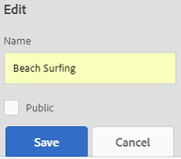

# Manage collections {#managing-collections}

컬렉션은 AEM(Adobe Experience Manager) 자산 내의 자산 세트입니다. 컬렉션을 사용하여 사용자 간에 자산을 공유합니다.

* 컬렉션에는 다른 위치의 자산이 포함될 수 있습니다.
* 보기, 편집 등 다양한 수준의 권한이 할당된 다양한 사용자와 컬렉션을 공유할 수 있습니다.

여러 컬렉션을 사용자와 공유할 수 있습니다. 각 컬렉션에는 자산에 대한 참조가 포함되어 있습니다. 자산의 참조 무결성은 컬렉션 간에 유지됩니다.

컬렉션은 자산을 수집하는 방법에 따라 다음과 같은 유형입니다.

* 자산, 폴더 및 기타 컬렉션의 정적 참조 목록이 포함된 컬렉션

* 검색 조건을 기반으로 자산을 동적으로 포함하는 스마트 컬렉션

## 컬렉션 콘솔 탐색 {#navigating-the-collections-console}

컬렉션 **[!UICONTROL 콘솔을]** 열려면

1. AEM 로고를 탭하거나 클릭합니다.
1. 탐색 페이지에서 자산 > **[!UICONTROL 컬렉션으로]** 이동합니다 ****. 컬렉션 **[!UICONTROL 콘솔이]** 표시됩니다.

## 컬렉션 만들기 {#creating-a-collection}

정적 참조를 [사용하거나](#creating-a-collection-with-static-references) 검색 조건 기반 필터를 기반으로 컬렉션을 만들 수 있습니다. Lightbox에서 컬렉션을 만들 수도 있습니다.

### 정적 참조를 사용하여 컬렉션 만들기 {#creating-a-collection-with-static-references}

정적 참조(예: 자산, 폴더, 컬렉션, 스핀 세트 및 이미지 세트에 대한 참조 포함)를 사용하여 컬렉션을 만들 수 있습니다.

1. 컬렉션 **[!UICONTROL 콘솔로]** 이동합니다.
1. 도구 모음에서 만들기를 탭/ **[!UICONTROL 클릭합니다]**.
1. 컬렉션 **[!UICONTROL 만들기]** 페이지에서 컬렉션에 대한 제목과 선택적 설명을 입력합니다.
1. 구성원을 컬렉션에 추가하고 적절한 권한을 할당합니다. 또는 공개 **[!UICONTROL 컬렉션을 선택하여]** 모든 사용자가 컬렉션에 액세스할 수 있도록 합니다.

   >[!NOTE]
   >
   >구성원이 다른 사용자와 컬렉션을 공유할 수 있도록 하려면 해당 `dam-users` 그룹에 대한 읽기 권한을 `home/users`제공합니다. 사용자가 팝업 목록에서 컬렉션을 볼 수 있도록 `/content/dam/collections` 위치 사용자에게 권한을 부여합니다. 또는 사용자를 `dam-users` 그룹의 일부로 만듭니다.

1. (선택 사항) 컬렉션에 대한 축소판 이미지를 추가합니다.
1. 만들기를 탭/ **[!UICONTROL 클릭한]**&#x200B;다음 확인을 탭/ **[!UICONTROL 클릭하여]** 대화 상자를 닫습니다. 지정된 제목과 속성이 있는 컬렉션이 컬렉션 콘솔에서 열립니다.

   >[!NOTE]
   >
   >AEM Assets에서는 자산 폴더에 대한 검토 작업을 만드는 방법과 유사한 방법으로 컬렉션에 대한 검토 작업을 만들 수 있습니다.

   자산을 컬렉션에 추가하려면 자산 사용자 인터페이스로 이동합니다. 자세한 내용은 [컬렉션에](/help/assets/managing-collections-touch-ui.md#adding-assets-to-a-collection)자산 추가를 참조하십시오.

### dropzone을 사용하여 컬렉션 제작 {#create-collections-using-dropzone}

자산 UI에서 컬렉션으로 자산을 드래그할 수 있습니다. 컬렉션의 복사본을 만들고 자산을 거기에서 드래그할 수도 있습니다.

1. 자산 UI에서 컬렉션에 추가할 자산을 선택합니다.
1. 자산을 컬렉션에 **[!UICONTROL 놓기 영역으로]** 드래그합니다.

   

   Dropzone이 활성화되면 마우스 버튼을 놓으면 레이블이 [추가할 **[!UICONTROL 드롭]으로 변경됩니다]**.

   

   또는 도구 모음에서 컬렉션으로 **[!UICONTROL 이동]** 아이콘을 탭/클릭합니다.

   

1. 컬렉션에 **[!UICONTROL 추가]** 페이지의 도구 모음에서 컬렉션 **[!UICONTROL 만들기]** 아이콘을 탭/클릭합니다.

   기존 컬렉션에 자산을 추가하려면 페이지에서 자산을 선택하고 추가를 탭/ **[!UICONTROL 클릭합니다]**. 기본적으로 가장 최근에 업데이트된 컬렉션이 선택됩니다.

1. 새 **[!UICONTROL 컬렉션 만들기]** 대화 상자에서 컬렉션 이름을 지정합니다. 모든 사용자가 컬렉션을 액세스할 수 있게 하려면 공개 컬렉션을 **[!UICONTROL 선택합니다]**.
1. 계속을 탭/클릭하여 **[!UICONTROL 컬렉션을]** 만듭니다.

### 스마트 컬렉션 만들기 {#creating-a-smart-collection}

Smart Collection은 검색 기준을 사용하여 자산을 동적으로 채웁니다. 폴더나 파일 및 폴더가 아닌 파일만 사용하여 스마트 컬렉션을 만들 수 있습니다.

1. 자산 UI 파섹  ****
1. Omnisearch 상자에 search 키워드를 입력하고 Enter 키를 누릅니다. GlobalNav 아이콘을 탭/클릭하여 필터 패널을 표시하고 검색 패널에서 검색 필터를 적용합니다.
1. 파일 및 **[!UICONTROL 폴더]** 목록에서 파일을 **[!UICONTROL 선택합니다]**.

   

1. 스마트 컬렉션 저장을 탭/ **[!UICONTROL 클릭합니다]**.
1. 컬렉션 이름을 지정합니다. [ **[!UICONTROL 공용]** ]을 선택하여 뷰어 역할이 있는 DAM 사용자 그룹을 스마트 컬렉션에 추가합니다.

   

   >[!NOTE]
   >
   >[공용] **[!UICONTROL 을]**&#x200B;선택하면 스마트 컬렉션을 만든 후 소유자 역할을 가진 모든 사람이 스마트 컬렉션을 사용할 수 있습니다.
   >
   >
   >[공용] **[!UICONTROL 옵션을]** 선택 해제하면 DAM 사용자 그룹이 더 이상 스마트 컬렉션과 연결되지 않습니다.

1. 저장을 탭/ **[!UICONTROL 클릭하여]** 스마트 컬렉션을 만든 다음 메시지 상자를 닫고 프로세스를 완료합니다.

   새로운 스마트 컬렉션은 저장된 검색 **[!UICONTROL 목록에도]** 추가됩니다.

   

   스마트 선택 만들기 **[!UICONTROL 단추의]** 레이블이 스마트 선택 **[!UICONTROL 편집으로 변경됩니다]**. 스마트 컬렉션의 설정을 편집하려면 파일 및 폴더 **[!UICONTROL 목록에서]** **[!UICONTROL 파일을]** 선택합니다. 그런 다음 스마트 선택 편집 **[!UICONTROL 단추를 탭/클릭합니다]** .

   

## 컬렉션에 자산 추가 {#adding-assets-to-a-collection}

참조된 자산 또는 폴더 목록이 포함된 자산을 컬렉션에 추가할 수 있습니다.

>[!NOTE]
>
>스마트 컬렉션은 검색 쿼리를 사용하여 자산을 채웁니다. 따라서 자산 및 폴더에 대한 정적 참조는 적용되지 않습니다.

1. 자산 UI 파섹
1. 자산을 선택하고 도구 모음에서 **[!UICONTROL 컬렉션으로]** 이동 아이콘을 탭/클릭합니다.

   

   또는 자산을 컬렉션에 놓기 **[!UICONTROL 영역으로 끌 수]** 있습니다. 드롭 영역이 활성화되고 레이블이 [추가에 놓기]로 변경되면 마우스 **[!UICONTROL 단추를 놓습니다]**.

1. 컬렉션에 **[!UICONTROL 추가]** 페이지에서 자산을 추가할 컬렉션을 선택합니다.
1. 추가를 탭/ **[!UICONTROL 클릭한]**&#x200B;다음 확인 메시지를 닫습니다. 자산이 컬렉션에 추가됩니다.

## 스마트 컬렉션 편집 {#editing-a-smart-collection}

스마트 컬렉션은 검색을 저장하여 작성되므로 [저장된 검색의](#editing-saved-searches)검색 매개 변수를 수정하여 콘텐츠를 변경할 수 있습니다.

1. 자산 UI의 도구 모음에서 **[!UICONTROL 검색]** 아이콘을 탭/클릭합니다.

   

1. Omnisearch 상자에 커서를 놓고 Return 키를 누릅니다.
1. GlobalNav 아이콘을 탭/클릭하여 필터 패널을 표시합니다.
1. 저장된 **[!UICONTROL 검색]** 목록에서 수정할 스마트 컬렉션을 선택합니다. 검색 패널에는 저장된 검색에 대해 구성된 필터가 표시됩니다.

   

1. 파일 및 **[!UICONTROL 폴더]** 목록에서 파일을 **[!UICONTROL 선택합니다]**.
1. 필요에 따라 하나 이상의 필터를 수정합니다. 스마트 컬렉션 편집을 탭/ **[!UICONTROL 클릭합니다]**.

   스마트 컬렉션의 이름을 편집할 수도 있습니다.

   

1. Tap/click **[!UICONTROL Save]**. 스마트 **[!UICONTROL 컬렉션 편집]** 대화 상자가 나타납니다.
1. 덮어쓰기를 탭/ **[!UICONTROL 클릭하여]** 원본 스마트 컬렉션을 편집된 컬렉션으로 바꿉니다. 또는 다른 이름으로 **[!UICONTROL 저장을 선택하여]** 편집된 컬렉션을 별도로 저장합니다.
1. 확인 대화 상자에서 저장을 탭/클릭하여 **[!UICONTROL 프로세스를]** 완료합니다.

## 컬렉션 메타데이터 보기 및 편집 {#viewing-and-editing-collection-metadata}

컬렉션 메타데이터는 추가되는 태그를 포함하여 컬렉션에 대한 데이터로 구성됩니다.

1. 컬렉션 콘솔에서 컬렉션을 선택하고 도구 모음에서 **[!UICONTROL 속성]** 아이콘을 탭/클릭합니다.
1. 컬렉션 **[!UICONTROL 메타데이터]** 페이지에서 기본 및 고급 **[!UICONTROL 탭에서]** 컬렉션 **메타데이터를** 볼수있습니다.
1. 필요에 따라 메타데이터를 수정한 다음 도구 모음에서 저장 **[!UICONTROL 및]** 닫기를 탭/클릭하여 변경 내용을 저장합니다.

### 컬렉션 메타데이터 일괄 편집 {#editing-collection-metadata-in-bulk}

여러 컬렉션의 메타데이터를 동시에 편집할 수 있습니다. 이 기능을 사용하면 여러 컬렉션의 공통 메타데이터를 신속하게 복제할 수 있습니다.

1. 컬렉션 콘솔에서 메타데이터를 편집할 컬렉션을 두 개 이상 선택합니다.
1. 도구 모음에서 속성 **[!UICONTROL 아이콘을 탭/클릭합니다]** .
1. 컬렉션 **[!UICONTROL 메타데이터]** 페이지에서 필요에 따라 기본 **[!UICONTROL 및 고급]** **** 탭 아래에서메타데이터를 편집합니다.
1. 도구 모음에서 **[!UICONTROL 저장 및]** 닫기를 탭/클릭한 다음 확인 대화 상자를 닫아서 프로세스를 완료합니다.
1. 기존 메타데이터에 새 메타데이터를 추가하려면 [적용 모드] **[!UICONTROL 를]**&#x200B;선택합니다. 이 옵션을 선택하지 않으면 새 메타데이터가 필드의 기존 메타데이터를 대체합니다. 제출을 탭/ **[!UICONTROL 클릭합니다]**.

   >[!NOTE]
   >
   >추가 모드는 여러 값을 포함할 수 있는 필드에만 작동합니다. 단일 값만 포함할 수 있는 필드의 경우 추가 모드를 ****&#x200B;선택하더라도 새 메타데이터는 필드의 기존 값에 추가되지 않습니다.

## 컬렉션 검색 {#searching-collections}

컬렉션 콘솔에서 컬렉션을 검색할 수 있습니다. Omnisearch 상자에서 키워드로 검색할 때 AEM Assets는 컬렉션 이름, 메타데이터 및 컬렉션에 추가된 태그를 검색합니다.

최상위 수준에서 컬렉션을 검색하면 개별 컬렉션만 검색 결과에 반환됩니다. 컬렉션 내의 자산 또는 폴더는 제외됩니다. 다른 모든 경우(예: 개별 컬렉션 또는 폴더 계층 구조) 모든 관련 자산, 폴더 및 컬렉션이 반환됩니다.

## 컬렉션 내에서 검색 {#searching-within-collections}

컬렉션 콘솔에서 컬렉션을 탭/클릭하여 엽니다.

컬렉션 내에서 AEM 자산 검색은 보고 있는 컬렉션 내의 자산(및 해당 태그 및 메타데이터)으로 제한됩니다. 폴더 내에서 검색하면 현재 폴더 내의 일치하는 모든 자산 및 하위 폴더가 반환됩니다. 컬렉션 내에서 검색할 때 컬렉션의 직접 구성원인 자산, 폴더 및 기타 컬렉션만 반환됩니다.

## 컬렉션 설정 편집 {#editing-collection-settings}

제목 및 설명과 같은 컬렉션 설정을 편집하거나 구성원을 컬렉션에 추가할 수 있습니다.

1. 컬렉션을 선택하고 도구 모음에서 **[!UICONTROL 설정]** 아이콘을 탭/클릭합니다. 또는 컬렉션 축소판에서 **[!UICONTROL 설정]** 빠른 작업을 사용합니다.
1. 컬렉션 설정 페이지에서 컬렉션 설정을 **[!UICONTROL 수정합니다]** . 예를 들어 컬렉션 추가에서 설명한 대로 컬렉션 제목, 설명, 멤버 및 권한을 [수정합니다](#creating-a-collection).

1. Tap/click **[!UICONTROL Save]** to save the changes.

## 컬렉션 삭제 {#deleting-a-collection}

1. 컬렉션 콘솔에서 하나 이상의 컬렉션을 선택하고 도구 모음에서 삭제 아이콘을 탭/클릭합니다.

   

1. 대화 상자에서 삭제를 탭/클릭하여 **[!UICONTROL 삭제]** 작업을 확인합니다.

   >[!NOTE]
   >
   >저장된 검색을 [삭제하여 스마트 컬렉션을 삭제할](#deleting-saved-searches)수도 있습니다.

## 컬렉션 다운로드 {#downloading-a-collection}

컬렉션을 다운로드하면 폴더 및 하위 컬렉션을 포함하여 컬렉션 내의 자산의 전체 계층이 다운로드됩니다.

1. 컬렉션 콘솔에서 다운로드할 컬렉션을 하나 이상 선택합니다.
1. 도구 모음에서 다운로드 아이콘을 탭/클릭합니다.
1. 다운로드 **[!UICONTROL 대화 상자에서]** 다운로드를 탭/ **[!UICONTROL 클릭합니다]**. 컬렉션 내에서 자산의 표현물을 다운로드하려면 표현물을 **[!UICONTROL 선택합니다]**. 이메일 **[!UICONTROL 옵션을 선택하여]** 컬렉션의 소유자에게 이메일 알림을 보냅니다.

   다운로드할 컬렉션을 선택하면 컬렉션 아래의 전체 폴더 계층 구조가 다운로드됩니다. 다운로드한 각 컬렉션(상위 컬렉션 아래에 중첩된 하위 컬렉션에 있는 자산 포함)을 개별 폴더에 포함하려면 각 자산에 **[!UICONTROL 대해]**&#x200B;별도의 폴더 만들기를 선택합니다.

## 중첩된 컬렉션 만들기 {#creating-nested-collections}

다른 컬렉션에 컬렉션을 추가하여 중첩된 컬렉션을 만들 수 있습니다.

1. 컬렉션 콘솔에서 원하는 컬렉션 또는 컬렉션 그룹을 선택하고 도구 모음에서 컬렉션으로 **[!UICONTROL 이동]** 아이콘을 탭하거나 클릭합니다.

   

1. 컬렉션에 **[!UICONTROL 추가]** 페이지에서 컬렉션을 추가할 컬렉션을 선택합니다.

   >[!NOTE]
   >
   >가장 최근에 업데이트된 컬렉션은 컬렉션에 추가 **[!UICONTROL 페이지에서 기본적으로 선택됩니다]** .

1. 추가를 탭/ **[!UICONTROL 클릭합니다]**. 대상 선택 페이지에서 컬렉션이 대상 컬렉션에 추가되었음을 **[!UICONTROL 확인하는 메시지가]** 표시됩니다. 메시지를 닫고 프로세스를 완료합니다.

>[!NOTE]
>
>스마트 컬렉션은 중첩될 수 없습니다. 즉, 스마트 컬렉션은 다른 컬렉션을 포함할 수 없습니다.

## Saved searches {#saved-searches}

자산 UI 파섹 이러한 검색을 저장된 검색으로 **[!UICONTROL 저장하는]**&#x200B;경우 나중에 필터 패널의 **[!UICONTROL 저장된 검색]** 목록에서 액세스할 수있습니다. 저장된 검색을 만들면 스마트 컬렉션도 생성됩니다.

### 저장된 검색 만들기 {#creating-saved-searches}

스마트 컬렉션을 만들 때 저장된 검색이 만들어집니다. 스마트 컬렉션은 저장된 검색 **[!UICONTROL 목록에 자동으로]** 추가됩니다. 컬렉션에 대한 저장된 검색 쿼리는 상대적 위치에 있는 `dam:query` 속성의 `/content/dam/collections/`목록에 저장됩니다.

>[!NOTE]
>
>정적 컬렉션을 공유하는 것과 같은 방법으로 스마트 컬렉션을 공유할 수 있습니다.

### 저장된 검색 편집 {#editing-saved-searches}

저장된 검색 편집은 스마트 컬렉션 편집과 동일합니다. 자세한 내용은 스마트 [컬렉션](/help/assets/managing-collections-touch-ui.md#editing-a-smart-collection)편집을 참조하십시오.

### 저장된 검색 삭제 {#deleting-saved-searches}

1. 자산 UI로 이동하고 도구 모음에서 검색 아이콘을 탭/클릭합니다.

   

1. 전체 검색 상자에 커서를 놓고 Return 키를 누릅니다.
1. GlobalNav 아이콘을 클릭하거나 탭하여 필터 패널을 표시합니다.

1. 저장된 **[!UICONTROL 검색]** 목록에서 삭제할 **[!UICONTROL 스마트]** 컬렉션 옆에 있는 삭제를 누릅니다.

   

1. 대화 상자에서 삭제를 눌러 **[!UICONTROL 저장된]** 검색을 삭제합니다.

## 컬렉션에서 워크플로우 실행 {#running-a-workflow-on-a-collection}

컬렉션 내의 자산에 대한 워크플로우를 실행할 수 있습니다. 컬렉션에 중첩된 컬렉션이 포함된 경우 중첩된 컬렉션 내의 자산에서도 워크플로우가 실행됩니다. 그러나 컬렉션과 중첩된 컬렉션에 중복된 자산이 포함되어 있으면 이러한 자산에 대해 워크플로우가 한 번만 실행됩니다.

1. 컬렉션 콘솔에서 워크플로우를 실행할 컬렉션을 선택합니다.
1. GlobalNav 아이콘을 탭/클릭하고 **[!UICONTROL 목록에서 타임라인을]** 선택합니다.
1. 타임라인에서 하단의 삽입 기호 아이콘을 클릭하거나 탭한 다음 워크플로우 **[!UICONTROL 시작을 누릅니다]**.

   

1. 워크플로우 **[!UICONTROL 시작]** 섹션의 목록에서 워크플로우 모델을 선택합니다. 예를 들어 DAM 자산 **[!UICONTROL 업데이트 모델을]** 선택합니다.
1. 워크플로우의 제목을 입력하고 시작을 탭/ **[!UICONTROL 클릭합니다]**.
1. 대화 상자에서 진행을 탭/ **[!UICONTROL 클릭합니다]**. 워크플로우는 컬렉션의 모든 자산에서 실행됩니다.

>[!MORELIKETHIS]
>
>* [AEM 자산 이메일 알림 구성](/help/sites-administering/notification.md#assetsconfig)
>* [여러 컬렉션의 메타데이터 속성 편집](/help/assets/managing-multiple-assets.md)
>* [컬렉션에 대한 검토 작업 만들기](/help/assets/bulk-approval.md)

