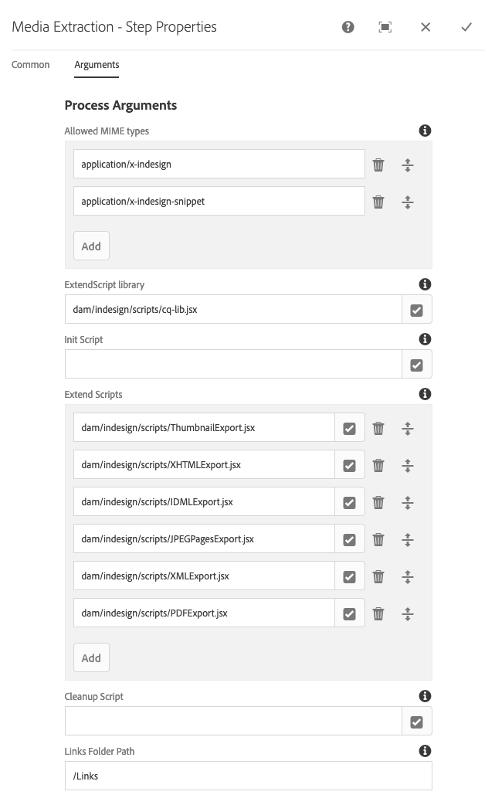
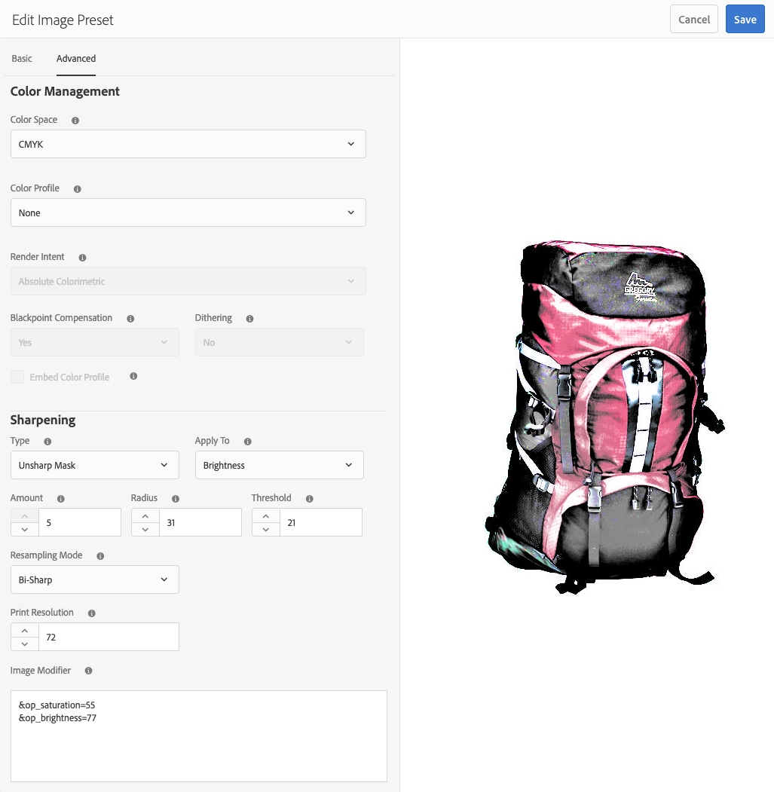

# Dynamic Media 이미지 사전 설정 관리{#managing-image-presets}

이미지 사전 설정을 사용하면 Adobe Experience Manager Assets에서 동적으로 생성된 다른 크기, 다른 형식 또는 다른 이미지 속성을 사용하여 이미지를 동적으로 전달할 수 있습니다. 각 이미지 사전 설정은 이미지 표시를 위한 크기 및 형식 지정 명령의 사전 정의된 컬렉션을 나타냅니다. 이미지 사전 설정을 만들 때 이미지 제공 크기를 선택합니다. 또한, 이미지를 볼 수 있도록 전달할 때 이미지의 모양을 최적화하도록 서식 명령을 선택할 수도 있습니다.

관리자는 자산을 내보내기 위해 사전 설정을 만들 수 있습니다. 사용자는 이미지를 내보낼 때 사전 설정을 선택할 수 있으며, 이 경우 관리자가 지정하는 사양에 맞게 이미지를 재포맷할 수도 있습니다.

응답형 이미지 사전 설정을 만들 수도 있습니다. 응답형 이미지 사전 설정을 자산에 적용하는 경우, 표시되는 장치나 화면 크기에 따라 달라집니다. RGB 또는 회색 외에 색상 공간에서 CMYK를 사용하도록 이미지 사전 설정을 구성할 수 있습니다.

이 섹션에서는 이미지 사전 설정을 만들고, 수정하고, 일반적으로 관리하는 방법을 설명합니다. 미리 볼 때 언제든지 이미지에 이미지 사전 설정을 적용할 수 있습니다. 자세한 내용은 [이미지 사전 설정 적용](/help/assets/image-presets.md).

>[!NOTE]
>
>스마트 이미징은 기존 이미지 사전 설정에서 작동하며 마지막 전달 순간에 인텔리전스를 사용하여 브라우저 또는 네트워크 연결 속도에 따라 이미지 파일 크기를 더 줄입니다. 자세한 내용은 [스마트 이미징](/help/assets/imaging-faq.md) 추가 정보.

## Dynamic Media 이미지 사전 설정 이해 {#understanding-image-presets}

매크로와 마찬가지로 이미지 사전 설정은 이름 아래에 저장된 크기 및 형식 명령의 사전 정의된 컬렉션입니다. 이미지 사전 설정 작동 방식을 이해하려면 웹 사이트에서 각 제품 이미지를 데스크탑 및 모바일 게재에 대해 서로 다른 크기, 서로 다른 형식 및 압축률을 나타내야 한다고 가정합니다.

>[!NOTE]
>
>Dynamic Media - Scene7 모드에서 이미지 사전 설정은 이미지 자산에 대해서만 지원됩니다.

두 개의 이미지 사전 설정을 만들 수 있습니다. 데스크탑 버전의 경우 500 x 500 픽셀과 모바일 버전의 경우 150 x 150 픽셀이 포함된 픽셀 두 개의 이미지 사전 설정을 만듭니다. 이 사전 설정은 `Enlarge` 이미지를 500x500픽셀과 `Thumbnail` 이미지를 150 x 150픽셀로 표시하기 위해 에서 이미지를 전달하려면 `Enlarge` 및 `Thumbnail` 크기, Experience Manager은 이미지 사전 설정 확대 및 축소판 이미지 사전 설정의 정의를 조회합니다. 그런 다음 Experience Manager은 각 이미지 사전 설정의 크기 및 형식 지정 사양에 따라 이미지를 동적으로 생성합니다.

동적으로 전달될 때 크기가 줄어든 이미지는 선명도와 세부 사항을 잃을 수 있습니다. 이러한 이유로, 각 이미지 사전 설정에는 특정 크기로 전달될 때 이미지를 최적화하는 형식 지정 컨트롤이 포함되어 있습니다. 이러한 컨트롤을 사용하면 웹 사이트나 애플리케이션에 이미지가 전달될 때 이미지가 선명하고 명확하게 표시됩니다.

관리자는 이미지 사전 설정을 만들 수 있습니다. 이미지 사전 설정을 만들려면 처음부터 시작하거나 기존 이미지 사전 설정에서 시작하여 새 이름으로 저장할 수 있습니다.

## Dynamic Media 이미지 사전 설정 관리 {#managing-image-presets-1}

Experience Manager 로고를 탭하거나 클릭하여 전역 탐색 콘솔에 액세스한 다음, 도구 아이콘을 탭하거나 클릭하고 다음 위치로 이동하여 Experience Manager에서 이미지 사전 설정을 관리합니다 **[!UICONTROL 자산 > 이미지 사전 설정]**.


>[!NOTE]
>
>자산을 미리 보거나 전달할 때 만들어지는 모든 이미지 사전 설정은 동적 변환으로도 사용할 수 있습니다.
>
>in *Dynamic Media - Scene7 모드*, 다음을 수행합니다. *not* 이미지 사전 설정이 자동으로 게시되므로 이미지 사전 설정을 게시해야 합니다.
>
>in *Dynamic Media - 하이브리드 모드*, 이미지 사전 설정을 수동으로 게시해야 합니다.
>
>자세한 내용은 [이미지 사전 설정 게시](#publishing-image-presets).

>[!NOTE]
>
>선택하면 시스템에 다양한 표현물이 표시됩니다 **[!UICONTROL 표현물]** 를 입력합니다. 표시되는 이미지 사전 설정 수를 늘리거나 줄일 수 있습니다. 자세한 내용은 [표시되는 이미지 사전 설정 수 증가](#increasing-or-decreasing-the-number-of-image-presets-that-display).

### 스마트 자르기, Adobe Illustrator(AI), Postscript(EPS) 및 PDF 파일 형식 {#adobe-illustrator-ai-postscript-eps-and-pdf-file-formats}

>[!NOTE]
>
>이 항목은 Dynamic Media - 하이브리드 모드에만 적용할 수 있습니다.

이러한 파일 형식의 동적 렌디션을 생성할 수 있도록 AI, EPS 및 PDF 파일 수집을 지원하려는 경우 이미지 사전 설정을 만들기 전에 다음 정보를 검토하십시오.

Adobe Illustrator의 파일 형식은 PDF의 변형입니다. Experience Manager Assets 컨텍스트에서 주요 차이점은 다음과 같습니다.

* Adobe Illustrator 문서는 여러 레이어가 있는 단일 페이지로 구성됩니다. 각 레이어는 기본 Illustrator 자산 아래에 PNG 하위 자산으로 추출됩니다.
* PDF 문서는 하나 이상의 페이지로 구성됩니다. 각 페이지는 주 다중 페이지 PDF 문서 아래에 단일 페이지 PDF 하위 자산으로 추출됩니다.

하위 자산은 `Create Sub Asset process` 전체 내의 구성 요소 `DAM Update Asset` 워크플로우. 워크플로우 내에서 이 프로세스 구성 요소를 보려면 **[!UICONTROL 도구]** > **[!UICONTROL 워크플로우]** > **[!UICONTROL 모델]** > **[!UICONTROL DAM 자산 업데이트]** > **[!UICONTROL 편집]**.

참조 - [다중 페이지 파일의 페이지 보기](/help/assets/managing-linked-subassets.md#view-pages-of-a-multi-page-file).

자산을 열 때 하위 자산이나 페이지를 보고, 콘텐츠 메뉴를 탭하고, 을 선택할 수 있습니다 **[!UICONTROL 하위 자산]** 또는 **[!UICONTROL 페이지]**. 하위 자산은 실제 자산입니다. 즉, PDF 페이지는 `Create Sub Asset` 워크플로우 구성 요소입니다. 그런 다음 `page1.pdf`, `page2.pdf`등의 정보를 추가할 수도 있습니다. 저장된 후에는 `DAM Update Asset` 워크플로우가 처리합니다.

Dynamic Media을 사용하여 AI, EPS 또는 PDF 파일에 대한 동적 렌디션을 미리 보고 생성하려면 다음 처리 단계를 수행해야 합니다.

1. 에서 `DAM Update Asset` 워크플로우, `Rasterize PDF/AI Image Preview Rendition` 프로세스 구성 요소는 구성된 해상도를 사용하여 원본 자산의 첫 페이지를 `cqdam.preview.png` 변환.

1. 다음 `cqdam.preview.png` 그런 다음 표현물은 `Dynamic Media Process Image Assets` 워크플로우 내에서 구성 요소를 처리합니다.

>[!NOTE]
>
>에서 [!UICONTROL DAM 자산 업데이트] 워크플로우, **[!UICONTROL EPS 축소판]** 단계는 EPS 파일에 대한 축소판 그림을 생성합니다.

#### PDF/AI/EPS 자산 메타데이터 속성 {#pdf-ai-eps-asset-metadata-properties}

| **메타데이터 속성** | **설명** |
|---|---|
| `dam:Physicalwidthininches` | 문서 너비(인치) |
| `dam:Physicalheightininches` | 문서 높이(인치) |

액세스할 수 있습니다. `Rasterize PDF/AI Image Preview Rendition` 다음 방법으로 구성 요소 옵션 처리 `DAM Update Asset` 워크플로우.

왼쪽 상단에 있는 Adobe Experience Manager을 탭하고 다음 위치로 이동합니다. **[!UICONTROL 도구]** > **[!UICONTROL 워크플로우]** > **[!UICONTROL 모델]**. 워크플로우 모델 페이지에서 을 선택합니다 **[!UICONTROL DAM 자산 업데이트]**&#x200B;를 누르고 도구 모음에서 탭 **[!UICONTROL 편집]**. 설정 [!UICONTROL DAM 자산 업데이트] 워크플로우 페이지에서 두 번 누릅니다 `Rasterize PDF/AI Image Preview Rendition` 프로세스 구성 요소를 사용하여 해당 단계 속성 대화 상자를 엽니다.

#### PDF/AI 이미지 미리 보기 변환 옵션 래스터화 {#rasterize-pdf-ai-image-preview-rendition-options}


PDF 또는 AI 워크플로우를 래스터화하는 인수

<table>
 <tbody>
  <tr>
   <td><strong>프로세스 인수</strong></td>
   <td><strong>기본 설정</strong></td>
   <td><strong>설명</strong></td>
  </tr>
  <tr>
   <td>MIME 유형</td>
   <td><p>application/pdf</p> <p>application/postscript</p> <p>응용 프로그램/illustrator<br /> </p> </td>
   <td>PDF 또는 Illustrator 문서로 간주되는 문서 MIME 유형 목록입니다.<br /> </td>
  </tr>
  <tr>
   <td>최대 너비</td>
   <td>2048년</td>
   <td>생성된 미리 보기 표현물의 최대 너비(픽셀 단위)입니다.<br /> </td>
  </tr>
  <tr>
   <td>최대 높이</td>
   <td>2048년</td>
   <td>생성된 미리 보기 표현물의 최대 높이(픽셀 단위)입니다.<br /> </td>
  </tr>
  <tr>
   <td>해결</td>
   <td>72</td>
   <td>첫 번째 페이지를 ppi(인치당 픽셀 수)로 래스터화하는 해상도.</td>
  </tr>
 </tbody>
</table>

기본 프로세스 인수를 사용하면 PDF/AI 문서의 첫 번째 페이지가 72ppi로 래스터화되고 생성된 미리 보기 이미지의 크기가 2048 x 2048픽셀로 지정됩니다. 일반적인 배포의 경우 해상도를 최소 150ppi 이상으로 늘릴 수 있습니다. 예를 들어, 300ppi의 미국 문자 크기 문서는 각각 최대 너비 및 높이가 2550 x 3300픽셀이어야 합니다.

[최대 너비] 및 [최대 높이]는 래스터화할 해상도를 제한합니다. 예를 들어 최대 값이 변경되지 않고 해상도가 300ppi로 설정되는 경우 미국 편지 문서는 186ppi로 래스터화됩니다. 즉, 문서는 1581 x 2046 픽셀입니다.

다음 `Rasterize PDF/AI Image Preview Rendition` 프로세스 구성 요소는 메모리에 지나치게 큰 이미지를 만들지 않도록 최대로 정의됩니다. 이러한 큰 이미지는 JVM(Java™ Virtual Machine)에 제공된 메모리를 오버플로할 수 있습니다. 구성된 최대 구성 크기로 이미지를 만들 수 있는 충분한 메모리를 JVM에 제공하여 구성된 병렬 워크플로우 수를 관리할 수 있도록 해야 합니다.

### InDesign(INDD) 파일 형식 {#indesign-indd-file-format}

이 파일 형식의 동적 렌디션을 생성할 수 있도록 INDD 파일 처리를 지원하려는 경우 이미지 사전 설정을 만들기 전에 다음 정보를 검토할 수 있습니다.

InDesign 파일의 경우, Adobe InDesign Server이 Experience Manager과 통합된 경우에만 하위 자산이 추출됩니다. 참조된 자산은 메타데이터를 기준으로 연결됩니다. InDesign Server은 연결에 필요하지 않습니다. 그러나 InDesign 파일과 참조된 자산 간에 링크를 만들려면 InDesign 파일이 처리되기 전에 참조된 자산이 Experience Manager 내에 있어야 합니다.

자세한 내용은 [Experience Manager Assets과 InDesign Server 통합](/help/assets/indesign.md).

의 미디어 추출 프로세스 구성 요소 `DAM Update Asset` 워크플로우는 사전 구성된 확장 스크립트를 실행하여 InDesign 파일을 처리합니다.



ExtendScript은 [!UICONTROL DAM 자산 업데이트] 워크플로우.

다음 스크립트는 Dynamic Media 통합에서 사용됩니다.

<table>
 <tbody>
  <tr>
   <td><strong>ExtendScript 이름</strong></td>
   <td><strong>기본값</strong></td>
   <td><strong>설명</strong></td>
  </tr>
  <tr>
   <td>ThumbnailExport.jsx</td>
   <td>예</td>
   <td>300ppi 생성 <code>thumbnail.jpg</code> 최적화되어 PTIFF 표현물로 전환된 변환 <code>Dynamic Media Process Image Assets</code> 프로세스 구성 요소입니다.<br /> </td>
  </tr>
  <tr>
   <td>JPEGPagesExport.jsx</td>
   <td>예</td>
   <td>각 페이지에 대해 300PPI JPEG 하위 자산을 생성합니다. JPEG 하위 자산은 InDesign 자산 아래에 저장된 실제 자산입니다. 또한 최적화된 상태이며 <code>DAM Update Asset</code> 워크플로우.<br /> </td>
  </tr>
  <tr>
   <td>PDFPagesExport.jsx</td>
   <td>아니요</td>
   <td>각 페이지에 대한 PDF 하위 자산을 생성합니다. PDF 하위 자산은 앞에서 설명한 대로 처리됩니다. PDF에 단일 페이지만 포함되어 있으므로 하위 자산이 생성되지 않습니다.<br /> </td>
  </tr>
 </tbody>
</table>

## 이미지 축소판 크기 구성 {#configuring-image-thumbnail-size}

에서 이러한 설정을 구성하여 축소판의 크기를 구성할 수 있습니다 **[!UICONTROL DAM 자산 업데이트]** 워크플로우. 워크플로우에서는 이미지 자산의 축소판 크기를 구성할 수 있는 두 가지 단계가 있습니다. (**[!UICONTROL Dynamic Media 처리 이미지 자산]**)가 동적 이미지 자산에 사용되고(**[!UICONTROL 프로세스 축소판]**)는 정적 축소판 생성을 위한 것이거나, 다른 모든 프로세스가 축소판을 생성하지 못할 때 사용됩니다. *둘 다* 설정이 같아야 합니다.

With the **[!UICONTROL Dynamic Media Process Image Assets]** step, thumbnails are generated by the image server, and this configuration is independent of the configuration applied to the **[!UICONTROL Process Thumbnails]** step. Generating thumbnails through the **[!UICONTROL Process Thumbnails]** step is the slowest and most memory intensive way to create thumbnails.

축소판 크기 조절은 다음 형식으로 정의됩니다. **[!UICONTROL 너비:height:센터]**, 예 `80:80:false`. 너비와 높이는 축소판의 크기(픽셀 단위)를 결정합니다. 가운데 값은 false 또는 true이고, true로 설정하면 축소판 이미지의 크기가 구성에 지정된 크기와 정확히 일치함을 나타냅니다. 크기가 조정된 이미지가 더 작으면 축소판 안에 가운데에 표시됩니다.

>[!NOTE]
>
>* EPS 파일의 축소판 크기는 **[!UICONTROL EPS 축소판]** 단계, **[!UICONTROL 인수]** 탭 아래의 축소판
>
>* 비디오의 축소판 크기는 **[!UICONTROL FFmpeg 축소판]** 단계, **[!UICONTROL 프로세스]** 아래의 탭 **[!UICONTROL 인수]**.
>


**이미지 축소판 크기를 구성하려면**

1. 탭 **[!UICONTROL 도구]** > **[!UICONTROL 워크플로우]** > **[!UICONTROL 모델]** > **[!UICONTROL DAM 자산 업데이트]** > **[!UICONTROL 편집]**.
1. 탭하기 **[!UICONTROL Dynamic Media 처리 이미지 자산]** 한 단계씩 탭 또는 클릭 **[!UICONTROL 축소판 그림]** 탭. Change the thumbnail size, as needed, then tap **[!UICONTROL OK]**.

   

1. Tap the **[!UICONTROL Process Thumbnails]** step, then tap the **[!UICONTROL Thumbnails]** tab. 필요에 따라 축소판 크기를 변경한 다음 **[!UICONTROL 확인]**.

   >[!NOTE]
   >
   >The values in the thumbnails argument in the **[!UICONTROL Process Thumbnails]** step must match the thumbnails argument in the **[!UICONTROL Dynamic Media Process Image Assets]** step.

1. 탭 **[!UICONTROL 저장]** 워크플로우에 변경 사항을 저장하려면 을 클릭합니다.

### 표시되는 Dynamic Media 이미지 사전 설정 수를 늘리거나 줄입니다 {#increasing-or-decreasing-the-number-of-image-presets-that-display}

만드는 이미지 사전 설정은 자산을 미리 볼 때 동적 변환으로 사용할 수 있습니다. Experience Manager에서 자산을 볼 때 다양한 동적 표현물이 표시됩니다 **[!UICONTROL 세부 사항 보기 > 표현물]**. 표시되는 표현물의 제한을 늘리거나 줄일 수 있습니다.

**표시되는 Dynamic Media 이미지 사전 설정 수를 늘리거나 줄입니다.**

1. CRXDE Lite([https://localhost:4502/crx/de](https://localhost:4502/crx/de)).
1. 다음 위치의 이미지 사전 설정 목록 노드로 이동합니다 `/libs/dam/gui/coral/content/commons/sidepanels/imagepresetsdetail/imgagepresetslist`

   

1. In the **[!UICONTROL limit]** property, change the **[!UICONTROL Value]**, which is set to 15 by default, to the desired number.
1. 의 이미지 사전 설정 데이터 소스로 이동합니다. `/libs/dam/gui/coral/content/commons/sidepanels/imagepresetsdetail/imgagepresetslist/datasource`

   

1. limit 속성에서 숫자를 원하는 숫자로 변경합니다(예: ). `{empty requestPathInfo.selectors[1] ? "20" : requestPathInfo.selectors[1]}`
1. 탭 **[!UICONTROL 모두 저장]**.

## Dynamic Media 이미지 사전 설정 만들기 {#creating-image-presets}

Dynamic Media 이미지 사전 설정을 만들면 미리 보거나 게시할 때 이미지에 이러한 설정을 적용할 수 있습니다.

>[!NOTE]
>
>Internet Explorer 9를 사용하는 경우 사전 설정을 만들면 저장 후 바로 사전 설정 목록에 표시되지 않습니다. 이 문제를 해결하려면 IE9용 캐시를 비활성화합니다.

이러한 파일 형식의 동적 렌디션을 생성할 수 있도록 AI, PDF 및 EPS 파일 수집을 지원하려는 경우 이미지 사전 설정을 만들기 전에 다음 정보를 검토하십시오.
자세한 내용은 [Adobe Illustrator(AI), Postscript(EPS) 및 PDF 파일 형식](#adobe-illustrator-ai-postscript-eps-and-pdf-file-formats).

이 파일 형식의 동적 렌디션을 생성할 수 있도록 INDD 파일 처리를 지원하려는 경우 이미지 사전 설정을 만들기 전에 다음 정보를 검토할 수 있습니다.
자세한 내용은 [InDesign(INDD) 파일 형식](#indesign-indd-file-format).

>[!NOTE]
>
>Dynamic Media 이미지 사전 설정을 만들려면 Experience Manager 관리자 또는 Admin Console 관리자로서의 관리자 권한이 있어야 합니다.

**Dynamic Media 이미지 사전 설정을 만들려면:**

1. Experience Manager에서 Experience Manager 로고를 탭하여 전역 탐색 콘솔에 액세스한 다음, **[!UICONTROL 도구]** > **[!UICONTROL 자산]** > **[!UICONTROL 이미지 사전 설정]**.
1. **[!UICONTROL 만들기]**&#x200B;를 클릭합니다. 다음 **[!UICONTROL 이미지 사전 설정 편집]** 창이 열립니다.

   

   >[!NOTE]
   >
   >To make this image preset responsive, erase the values in the **[!UICONTROL width]** and **[!UICONTROL height]** fields and leave them blank.

1. Enter values into the **[!UICONTROL Basic]** and **[!UICONTROL Advanced]** tabs as appropriate, including a name. The options are outlined in [Image Preset Options](#image-preset-options). Presets appear in the left pane and can be used on-the-fly with other assets.

   

1. **[!UICONTROL 저장]**&#x200B;을 클릭합니다.

## 응답형 이미지 사전 설정 만들기 {#creating-a-responsive-image-preset}

응답형 이미지 사전 설정을 만들려면 다음 단계를 수행하십시오. [이미지 사전 설정 만들기](#creating-image-presets). 의 높이와 너비를 입력할 때 **[!UICONTROL 이미지 사전 설정 편집]** 창에서 값을 지우고 비워 둡니다.

이 필드를 비워 두면 Experience Manager이 이 이미지 사전 설정이 응답형임을 알려줍니다. 다른 값을 적절하게 조정할 수 있습니다.


>[!NOTE]
>
>를 보려면 **[!UICONTROL URL]** 및 **[!UICONTROL RESS]** 자산에 이미지 사전 설정을 적용할 때 자산을 게시해야 합니다.
>
>
>
>Dynamic Media - Scene7 모드에서는 이미지 사전 설정 및 이미지 자산이 자동으로 게시됩니다.
>
>Dynamic Media - 하이브리드 모드에서 이미지 사전 설정 및 이미지 자산을 수동으로 게시해야 합니다.

### 이미지 사전 설정 옵션 {#image-preset-options}

이미지 사전 설정을 만들거나 편집할 때 이 섹션에 설명된 옵션이 있습니다. 또한 Adobe은 다음과 같은 &quot;우수 사례&quot; 선택 사항을 시작할 것을 권장합니다.

* **[!UICONTROL Format]** (**[!UICONTROL Basic]** tab) - Select **[!UICONTROL JPEG]** or another format that meets your requirements. All web browsers support the JPEG image format; it offers a good balance between small files sizes and image quality. However, JPEG format images use a lossy compression scheme that can introduce unwanted image artifacts if the compression setting is too low. For that reason, Adobe recommends setting the compression quality to 75. This setting offers a good balance between image quality and small file size.

* **[!UICONTROL Enable Simple Sharpening]** - Do not select **[!UICONTROL Enable Simple Sharpening]** (this sharpening filter offers less control than Unsharp Masking settings).

* **[!UICONTROL 선명하게 하기: 재샘플링 모드]** - 선택 **[!UICONTROL Sharp2]**.

#### 기본 탭 옵션 {#basic-tab-options}

<table>
 <tbody>
  <tr>
   <td><strong>필드</strong></td>
   <td><strong>설명</strong></td>
  </tr>
  <tr>
   <td><strong>이름</strong></td>
   <td>공백 없이 수사적 이름을 입력합니다. 사용자가 이 이미지 사전 설정을 식별하는 데 도움이 되도록 이름에 이미지 크기 사양을 포함하십시오.</td>
  </tr>
  <tr>
   <td><strong>폭과 높이</strong></td>
   <td>이미지가 전달되는 크기를 픽셀 단위로 입력하십시오. 너비와 높이는 0픽셀보다 커야 합니다. 두 값 중 하나가 0이면 사전 설정이 만들어지지 않습니다. 두 값이 모두 비어 있으면 응답형 이미지 사전 설정이 만들어집니다.</td>
  </tr>
  <tr>
   <td><strong>형식</strong></td>
   <td><p>메뉴에서 형식을 선택합니다.</p> <p>선택 <strong>JPEG</strong> 에서는 다음 추가 옵션을 제공합니다.</p>
    <ul>
     <li><strong>품질</strong> - JPEG 압축 수준을 제어합니다. 이 설정은 파일 크기와 이미지 품질에 모두 영향을 줍니다. JPEG 품질 척도는 1-100입니다. 슬라이더를 드래그하면 배율이 표시됩니다.</li>
     <li><strong>JPG 색차 다운샘플링 활성화</strong> - 눈은 고주파 휘도보다 고주파 색상 정보에 덜 민감하므로 JPEG 이미지는 이미지 정보를 휘도 및 색상 컴포넌트로 나눕니다. JPEG 이미지를 압축하면 휘도 구성 요소를 전체 해상도로 두고 색상 구성 요소는 픽셀 그룹을 평균화하여 다운샘플링됩니다. 다운샘플링을 수행하면 데이터 볼륨이 1/3 또는 1/3까지 감소하며 파악된 품질에 거의 영향을 주지 않습니다. 다운샘플링은 회색 음영 이미지에는 적용할 수 없습니다. 이 기술은 대비가 높은 이미지(예: 텍스트가 오버레이된 이미지)에 유용한 압축 양을 줄입니다.</li>
    </ul>
    <div>
      선택
     <strong>GIF</strong> 또는
     <strong>알파 GIF</strong> 이 추가
     <strong>GIF 색상 양자화</strong> 옵션:
    </div>
    <ul>
     <li><strong>유형 </strong>- 선택 <strong>적응형</strong> (기본값), <strong>웹</strong>, 또는 <strong>Macintosh</strong>. 선택하는 경우 <strong>알파 GIF</strong>을 눌러 Macintosh 옵션을 사용할 수 없습니다.</li>
     <li><strong>디터</strong> - 선택 <strong>Diffuse</strong> 또는 <strong>해제</strong>.</li>
     <li><strong>색상 수 </strong>- 2부터 256까지의 숫자를 입력합니다.</li>
     <li><strong>색상 목록</strong> - 쉼표로 구분된 목록을 입력합니다. 예를 들어, 흰색, 회색 및 검정색의 경우 를 입력합니다. <code>000000,888888,ffffff</code>.</li>
    </ul>
    <div>
      선택
     <strong>PDF</strong>,
     <strong>TIFF</strong>, 또는
     <strong>알파 TIFF</strong> 이 추가 옵션을 제공합니다.
    </div>
    <ul>
     <li><strong>압축</strong> - 압축 알고리즘을 선택합니다. PDF 알고리즘 옵션은 다음과 같습니다 <strong>없음</strong>, <strong>Zip</strong>, 및 <strong>Jpeg</strong>; TIFF의 경우 옵션은 다음과 같습니다. <strong>없음</strong>, <strong>LZW</strong>, <strong>Jpeg</strong>, 및 <strong>Zip</strong>; 알파 포함 TIFF의 경우 <strong>없음</strong>, <strong>LZW</strong>, 및 <strong>Zip</strong>.</li>
    </ul> <p>선택 <strong>PNG</strong>, <strong>알파 포함 PNG,</strong> 또는 <strong>EPS</strong> 추가 옵션을 제공하지 않습니다.</p> </td>
  </tr>
  <tr>
   <td><strong>선명하게 하기</strong></td>
   <td>을(를) 선택합니다 <strong>단순 선명하게 하기 사용</strong> 모든 크기 조절이 수행된 후 이미지에 기본 선명도 필터를 적용하는 옵션입니다. 선명하게 하면 이미지를 다른 크기로 표시할 때 나타날 수 있는 흐림 효과를 보상하는 데 도움이 됩니다. </td>
  </tr>
 </tbody>
</table>

#### 고급 탭 옵션 {#advanced-tab-options}

<table>
 <tbody>
  <tr>
   <td><strong>필드</strong></td>
   <td><strong>설명</strong></td>
  </tr>
  <tr>
   <td><strong>색상 공간</strong></td>
   <td>선택 <strong>RGB, CMYK,</strong> 또는 <strong>회색 음영</strong> 색상 공간</td>
  </tr>
  <tr>
   <td><strong>색상 프로필</strong></td>
   <td>작업 프로필과 다른 경우 자산을 변환해야 하는 출력 색상 공간 프로필을 선택합니다.</td>
  </tr>
  <tr>
   <td><strong>렌더링 의도</strong></td>
   <td>기본 렌더링 의도를 무시할 수 있습니다. 렌더링 의자는 대상 색상 프로필(색상 영역 외)에서 재현할 수 없는 색상에 대해 발생하는 결과를 결정합니다. Render Intent가 ICC 프로파일과 호환되지 않으면 무시됩니다.
    <ul>
     <li>선택 <strong>지각</strong> 원본 이미지의 하나 이상의 색상이 대상 색상 공간의 색상 영역을 벗어나는 경우 한 색상 공간에서 다른 색상 공간으로 전체 색상 영역을 압축합니다.</li>
     <li>선택 <strong>상대 색각</strong> 현재 색상 공간의 색상이 대상 색상 공간의 색상 영역을 벗어나는 경우 또한 다른 색상에 영향을 주지 않고 대상 색상 공간의 색상 영역 내에서 가장 가까운 색상으로 매핑하려고 합니다. </li>
     <li>선택 <strong>채도</strong> 대상 색상 공간으로 변환할 때 원본 이미지 색상 채도를 재현하려면 </li>
     <li>선택 <strong>절대 색각</strong> 이미지의 밝기를 변경하는 흰색 점 또는 검정색 점을 조정하지 않고 정확하게 색상을 일치시키기 위한 것입니다.</li>
    </ul> </td>
  </tr>
  <tr>
   <td><strong>검은 점 보상</strong></td>
   <td>출력 프로파일이 이 기능을 지원하는 경우 이 옵션을 선택합니다. 지정한 ICC 프로필과 호환되지 않는 경우에는 Blackpoint 보상이 무시됩니다.</td>
  </tr>
  <tr>
   <td><strong>디더링</strong></td>
   <td>색상 밴딩 아티팩트를 방지하거나 줄이려면 이 옵션을 선택합니다. </td>
  </tr>
  <tr>
   <td><strong>선명하게 하기 유형</strong></td>
   <td><p>선택 <strong>없음</strong>, <strong>선명 효과</strong>, 또는 <strong>언샵 마스크</strong>. </p>
    <ul>
     <li>선택 <strong>없음</strong> 선명하게 하기를 사용하지 않으려면</li>
     <li>선택 <strong>선명 효과</strong> 모든 크기 조절이 수행된 후 이미지에 기본 선명하게 하기 필터를 적용하려면, 선명하게 하면 이미지를 다른 크기로 표시할 때 나타날 수 있는 흐림 효과를 보상하는 데 도움이 됩니다. </li>
     <li>선택<strong> 언샵 마스크</strong> 최종 다운샘플링된 이미지에 선명도 필터 효과를 세밀하게 조정하려면 효과의 강도, 효과의 반경(픽셀 단위 측정) 및 무시되는 조명의 임계값을 제어할 수 있습니다. 이 효과는 Photoshop의 "언샵 마스크" 필터와 동일한 옵션을 사용합니다.</li>
    </ul> <p>in <strong>언샵 마스크</strong>에는 다음 선택 사항이 있습니다.</p>
    <ul>
     <li><strong>금액</strong> - 가장자리 픽셀에 적용된 대비 크기를 제어합니다. 기본 실수 값은 1.0입니다. 고해상도 이미지의 경우 최대 5.0까지 늘릴 수 있습니다. [금액]을 필터 강도 측정에 대해 생각해 보십시오.</li>
     <li><strong>반경</strong> - 선명하게 하기에 영향을 주는 가장자리 픽셀을 둘러싸는 픽셀 수를 결정합니다. 고해상도 이미지의 경우 1부터 2까지의 실수를 입력합니다. 낮은 값은 가장자리 픽셀만 선명하게 합니다. 값이 높을수록 더 넓은 범위의 픽셀이 선명해집니다. 올바른 값은 이미지의 크기에 따라 다릅니다.</li>
     <li><strong>임계값</strong> - 언샵 마스크 필터를 적용할 때 무시할 대비 범위를 결정합니다. 즉, 이 옵션은 가장자리 픽셀로 간주되고 선명하게 되기 전에 선명하게 된 픽셀이 주변 영역과 얼마나 다른지를 결정합니다. 노이즈가 발생하지 않도록 하려면 2~20의 정수 값을 사용해 보십시오. </li>
     <li><strong>적용 대상</strong> - 선명하게 하기 취소가 각 색상이나 밝기에 적용되는지 여부를 결정합니다.</li>
    </ul>
    <div>
      선명하게 하기는
     <a href="https://experienceleague.adobe.com/docs/experience-manager-65/assets/sharpening_images.pdf">이미지 선명하게 하기</a>.
    </div> </td>
  </tr>
  <tr>
   <td><strong>리샘플링 모드</strong></td>
   <td>선택 <strong>재샘플링 모드</strong> 선택 사항입니다. 이러한 옵션은 이미지를 다운샘플링할 때 이미지를 선명하게 합니다.
    <ul>
     <li><strong>양방향 선형</strong> - 가장 빠른 재샘플링 방법 일부 앨리어싱 가공물들은 눈에 띄습니다.</li>
     <li><strong>2입방</strong> - CPU 사용을 증가시키지만 앨리어싱 가공물이 덜 나타나면서 더 선명한 이미지를 생성합니다.</li>
     <li><strong>Sharp2</strong> - Bi-Cubic보다 약간 더 선명한 결과를 얻을 수 있지만 CPU 비용이 훨씬 더 높습니다.</li>
     <li><strong>Bi-Sharp</strong> - 이미지 크기를 줄이기 위한 Photoshop 기본 리샘플러를 선택합니다. <strong>쌍광선</strong> Adobe Photoshop.</li>
     <li><strong>각 색상</strong> 및 <strong>명도</strong> - 각 방법은 색상 또는 밝기를 기반으로 할 수 있습니다. 기본적으로 <strong>각 색상</strong> 이 선택되어 있습니다.</li>
    </ul> </td>
  </tr>
  <tr>
   <td><strong>인쇄 해상도</strong></td>
   <td>이 이미지를 인쇄할 해상도를 선택하십시오. 기본값은 72픽셀입니다.</td>
  </tr>
  <tr>
   <td><strong>이미지 수정자</strong></td>
   <td><p>UI에서 사용할 수 있는 일반적인 이미지 설정 외에도 Dynamic Media에서는 <strong>이미지 수정자</strong> 필드. 이러한 매개 변수는 <a href="https://experienceleague.adobe.com/docs/dynamic-media-developer-resources/image-serving-api/image-serving-api/http-protocol-reference/command-reference/c-command-reference.html#image-serving-api">이미지 서버 프로토콜 명령 참조</a>.</p> <p>중요 사항: API에 나열된 다음 기능은 지원되지 않습니다.</p>
    <ul>
     <li>기본 템플릿 및 텍스트 렌더링 명령: <code>text= textAngle= textAttr= textFlowPath= textFlowXPath= textPath=</code> 및 <code>textPs=</code></li>
     <li>로컬라이제이션 명령: <code>locale=</code> 및 <code>req=xlate</code></li>
     <li><code>req=set</code> 은 일반적인 용도로 사용할 수 없습니다.</li>
     <li><code>req=mbrset</code></li>
     <li><code>req=saveToFile</code></li>
     <li><code>req=targets</code></li>
     <li><code>template=</code></li>
     <li>비핵심 Dynamic Media 서비스: SVG, 이미지 렌더링 및 Web-to-Print</li>
    </ul> </td>
  </tr>
 </tbody>
</table>

## 이미지 수정자를 사용하여 이미지 사전 설정 옵션 정의 {#defining-image-preset-options-with-image-modifiers}

기본 및 고급 탭에서 사용할 수 있는 옵션 외에도 이미지 사전 설정을 정의할 때 더 많은 옵션을 제공하는 이미지 수정자를 정의할 수 있습니다. 이미지 렌더링은 이미지 렌더링 API를 사용하며, 이미지 렌더링 API는 [HTTP 프로토콜 참조](https://experienceleague.adobe.com/docs/dynamic-media-developer-resources/image-serving-api/image-serving-api/http-protocol-reference/command-reference/c-command-reference.html#image-serving-api).

다음은 이미지 수정자로 수행할 수 있는 작업의 몇 가지 기본 예입니다.

>[!NOTE]
>
>일부 이미지 수정자 [Experience Manager에 사용할 수 없습니다.](#advanced-tab-options).

* [op_invert](https://experienceleague.adobe.com/docs/dynamic-media-developer-resources/image-serving-api/image-serving-api/http-protocol-reference/command-reference/r-op-invert.html#image-serving-api) - 음수 이미지 효과를 위해 각 색상 구성 요소를 반전시킨다.

   ```xml
   &op_invert=1
   ```

   

* [op_blur](https://experienceleague.adobe.com/docs/dynamic-media-developer-resources/image-serving-api/image-serving-api/http-protocol-reference/command-reference/r-op-blur.html#image-serving-api) - 이미지에 흐림 효과 필터를 적용합니다.

   ```xml
   &op_blur=7
   ```

   

* 결합된 명령 - op_blur 및 op-invert

   ```xml
   &op_invert=1&op_blur=7
   ```

   

* [op_brightness](https://experienceleague.adobe.com/docs/dynamic-media-developer-resources/image-serving-api/image-serving-api/http-protocol-reference/command-reference/r-op-brightness.html#image-serving-api) - 밝기를 줄이거나 늘립니다.

   ```xml
   &op_brightness=58
   ```

   

* [opac](https://experienceleague.adobe.com/docs/dynamic-media-developer-resources/image-serving-api/image-serving-api/http-protocol-reference/command-reference/r-opac.html#image-serving-api) - 이미지 불투명도를 조정합니다. 전경 불투명도를 줄일 수 있습니다.

   ```xml
   opac=29
   ```

   

## 이미지 사전 설정 편집 {#modifying-image-presets}

1. Experience Manager에서 Experience Manager 로고를 탭하여 전역 탐색 콘솔에 액세스한 다음, **[!UICONTROL 도구]** > **[!UICONTROL 자산]** > **[!UICONTROL 이미지 사전 설정]**.

   

1. 사전 설정을 선택한 다음 를 클릭합니다 **[!UICONTROL 편집]**. 다음 **[!UICONTROL 이미지 사전 설정 편집]** 창이 열립니다.
1. 변경한 후 클릭 **[!UICONTROL 저장]** 변경 내용을 저장하려면 또는 **[!UICONTROL 취소]** 변경 사항을 취소하려면

## Dynamic Media 이미지 사전 설정 게시 {#publishing-image-presets}

Dynamic Media - 하이브리드 모드를 실행하는 경우 이미지 사전 설정을 수동으로 게시해야 합니다.

(Dynamic Media - Scene7 모드를 실행하는 경우 이미지 사전 설정이 자동으로 게시됩니다. 이 단계를 완료할 필요는 없습니다.)

**Dynamic Media - 하이브리드 모드에서 이미지 사전 설정을 게시하려면 다음을 수행하십시오.**

1. Experience Manager에서 Experience Manager 로고를 탭하거나 클릭하여 전역 탐색 콘솔에 액세스하고 도구 아이콘을 탭하거나 클릭하고 다음 위치로 이동합니다 **[!UICONTROL 자산]** > **[!UICONTROL 이미지 사전 설정]**.
1. 이미지 사전 설정 목록에서 이미지 사전 설정 또는 여러 이미지 사전 설정을 선택하고 을(를) 클릭하거나 탭합니다 **[!UICONTROL 게시]**.
1. 이미지 사전 설정이 게시되면 상태가 게시 취소에서 게시됨으로 변경됩니다.

   

## Dynamic Media 이미지 사전 설정 삭제 {#deleting-image-presets}

1. Experience Manager에서 Experience Manager 로고를 탭하거나 클릭하여 전역 탐색 콘솔에 액세스합니다.
1. 탭하기 **[!UICONTROL 도구]** 아이콘, 다음 위치로 이동 **[!UICONTROL 자산]** > **[!UICONTROL 이미지 사전 설정]**.
1. 사전 설정을 선택한 다음 를 클릭합니다 **[!UICONTROL 삭제]**. Dynamic Media에서 삭제를 확인합니다. 탭 **[!UICONTROL 삭제]** 삭제하거나 탭하기 **[!UICONTROL 취소]** 을 중단합니다.
