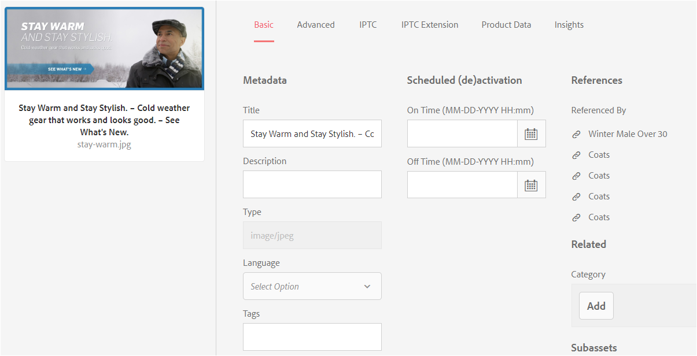

# 복합 자산 및 다중 페이지 자산 관리 {#managing-compound-assets}

AEM(Adobe Experience Manager) 자산은 업로드된 파일에 이미 저장소에 있는 자산에 대한 참조가 포함되어 있는지 식별할 수 있습니다. 이 기능은 지원되는 파일 포맷에서만 사용할 수 있습니다. 업로드된 자산에 AEM 자산에 대한 참조가 포함되어 있으면 업로드된 자산과 참조된 자산 사이에 양방향 링크가 만들어집니다.

중복성을 제거할 수 있을 뿐만 아니라 Adobe Creative Cloud 애플리케이션에서 AEM 자산을 참조하면 공동 작업을 향상시킬 수 있고 사용자의 효율성과 생산성을 향상시킬 수 있습니다.

AEM Assets는 양방향 참조를 지원합니다. 업로드된 파일의 자산 세부 사항 페이지에서 참조된 자산을 찾을 수 있습니다. 또한 참조된 자산의 자산 세부 사항 페이지에서 AEM 자산에 대한 참조 파일을 볼 수 있습니다.

참조는 참조된 자산의 경로, 문서 ID 및 인스턴스 ID를 기반으로 결정됩니다.

## Adobe Illustrator에서 AEM 자산을 참조로 추가 {#refai}

Adobe Illustrator 파일 내에서 기존 AEM 자산을 참조할 수 있습니다.

1. AEM [데스크탑 앱을](https://docs.adobe.com/content/help/en/experience-manager-desktop-app/using/using.html)사용하여 AEM 자산 저장소를 로컬 시스템의 드라이브로 마운트합니다. 마운트된 드라이브 내에서 참조할 자산의 위치로 이동합니다.
1. 마운트된 드라이브에서 Illustrator 파일로 에셋을 드래그합니다.
1. Illustrator 파일을 마운트된 드라이브에 저장하거나 AEM 저장소에 [업로드합니다](/help/assets/managing-assets-touch-ui.md#uploading-assets) .
1. 워크플로우가 완료되면 자산의 자산 세부 사항 페이지로 이동합니다. 기존 AEM 자산에 대한 참조는 참조 **[!UICONTROL 열의 종속성]** 아래에 **[!UICONTROL 나열됩니다]** .

   

1. 종속성 아래에 표시되는 참조된 **[!UICONTROL 자산은]** 현재 자산 이외의 파일에서도 참조할 수 있습니다. 자산에 대한 참조 파일 목록을 보려면 종속성 아래의 자산을 **[!UICONTROL 클릭합니다]**.

   

1. 도구 **[!UICONTROL 모음에서 속성]** 보기를 클릭합니다. 속성 [!UICONTROL 페이지에서] 현재 자산을 참조하는 파일 목록이 기본 **[!UICONTROL 탭의 참조]** 열 아래에 **[!UICONTROL 표시됩니다]** .

   

## Adobe InDesign에서 AEM 자산을 참조로 추가 {#add-aem-assets-as-references-in-adobe-indesign}

InDesign 파일 내에서 AEM 자산을 참조하려면 AEM 자산을 InDesign 파일로 드래그하거나 InDesign 파일을 ZIP 파일로 내보내십시오.

참조된 자산이 AEM 자산에 이미 있습니다. InDesign 서버를 [구성하여 하위 자산을](/help/assets/indesign.md)추출할 수 있습니다. InDesign 파일에 포함된 에셋은 하위 에셋으로 추출됩니다.

>[!NOTE]
>
>InDesign 서버가 프록시되면 InDesign 파일의 미리 보기가 XMP 메타데이터 내에 임베드되어 있습니다. 이 경우 축소판 추출이 명시적으로 필요하지 않습니다. 그러나 InDesign 서버가 프록시되지 않은 경우 InDesign 파일에 대해 축소판을 명시적으로 추출해야 합니다.

### 자산을 드래그하여 참조 만들기 {#create-references-by-dragging-aem-assets}

이 절차는 Adobe Illustrator [에서 AEM 자산을 참조로 추가와 유사합니다](#refai).

### ZIP 파일을 내보내 에셋에 대한 참조 만들기 {#create-references-to-aem-assets-by-exporting-a-zip-file}

1. 워크플로우 모델 [만들기의 단계를 수행하여](/help/sites-developing/workflows-models.md) 새 워크플로우를 만듭니다.
1. Adobe InDesign의 패키지 기능을 사용하여 문서를 내보냅니다.
Adobe InDesign에서 문서와 연결된 에셋을 패키지로 내보낼 수 있습니다. 이 경우 내보낸 폴더에는 InDesign 파일의 하위 자산이 들어 있는 링크 폴더가 포함됩니다.
1. ZIP 파일을 만들어 AEM 저장소에 업로드합니다.
1. 워크플로우를 `Unarchiver` 시작합니다.
1. 워크플로우가 완료되면 링크 폴더의 참조는 자동으로 하위 자산으로 참조됩니다. 참조된 자산 목록을 보려면 InDesign 자산의 자산 세부 사항 페이지로 이동하여 레일을 [닫습니다](/help/sites-authoring/basic-handling.md#rail-selector).

## Adobe Photoshop에서 AEM 자산을 참조로 추가 {#refps}

1. WebDav 클라이언트를 사용하여 AEM 자산을 드라이브로 마운트합니다.
1. Photoshop 파일에서 AEM 자산에 대한 참조를 만들려면 Photoshop에서 연결된 가져오기 기능을 사용하여 마운트된 드라이브의 해당 에셋으로 이동합니다.

   

1. Photoshop 파일에 저장하여 마운트된 드라이브에 저장하거나 AEM 저장소에 [업로드할](/help/assets/managing-assets-touch-ui.md#uploading-assets) 수 있습니다.
1. 워크플로우가 완료되면 기존 AEM 자산에 대한 참조가 자산 세부 사항 페이지에 나열됩니다.

   참조된 자산을 보려면 자산 세부 정보 [페이지에서 레일을](/help/sites-authoring/basic-handling.md#rail-selector) 닫습니다.

1. 참조된 자산에는 참조되는 자산의 목록도 포함되어 있습니다. 참조된 자산 목록을 보려면 자산 세부 사항 페이지로 이동하여 레일을 [닫습니다](/help/sites-authoring/basic-handling.md#rail-selector).

>[!NOTE]
>
>복합 자산 내의 자산은 문서 ID 및 인스턴스 ID를 기반으로 참조할 수도 있습니다. 이 기능은 Adobe Illustrator 및 Adobe Photoshop 버전에서만 사용할 수 있습니다. 다른 경우, 참조는 이전 버전의 AEM에서와 마찬가지로 기본 복합 자산에서 연결된 자산의 상대 경로를 기준으로 수행됩니다.

## 하위 자산 만들기 {#generate-subassets}

다중 페이지 형식을 사용하는 지원되는 자산의 경우 — PDF 파일, AI 파일, Microsoft PowerPoint 및 Apple Keynote 파일, Adobe InDesign 파일 — AEM에서는 원본 자산의 각 개별 페이지에 해당하는 하위 자산을 생성할 수 있습니다. 이러한 하위 자산은 *상위* 자산에 연결되어 여러 페이지 보기를 용이하게 합니다. 기타 모든 목적으로 하위 자산은 AEM의 일반 자산처럼 처리됩니다.

하위 자산 생성이 기본적으로 비활성화됩니다. 하위 자산 생성을 활성화하려면 다음 단계를 수행합니다.

1. Experience Manager에 관리자로 로그인합니다. 도구 **[!UICONTROL > 워크플로우 > 모델에 액세스합니다]**.
1. DAM **[!UICONTROL 자산 업데이트]** 워크플로우를 선택하고 편집을 **[!UICONTROL 클릭합니다]**.
1. 사이드 **[!UICONTROL 패널 전환을]** 클릭하고 하위 자산 **[!UICONTROL 만들기 단계를]** 찾습니다. 워크플로우에 단계를 추가합니다. 동기화를 **[!UICONTROL 클릭합니다]**.

하위 자산을 생성하려면 다음 중 하나를 수행합니다.

* 새 자산:DAM [!UICONTROL 자산 업데이트] 워크플로우는 AEM에 업로드된 새 자산에서 실행됩니다. 하위 자산은 새로운 다중 페이지 자산에 대해 자동으로 생성됩니다.
* 기존 다중 페이지 자산:다음 단계 중 [!UICONTROL 하나를] 따라 DAM 자산 업데이트 워크플로우를 수동으로 실행합니다.

   * 자산을 선택하고 [!UICONTROL 타임라인을] 클릭하여 왼쪽 패널을 엽니다. 또는 키보드 단축키를 사용합니다 `alt + 3`. 워크플로우 [!UICONTROL 시작을]클릭하고 [!UICONTROL DAM 자산]업데이트 [!UICONTROL 를]선택한 다음 [!UICONTROL 시작을 클릭하고]계속을 클릭합니다.
   * 자산을 선택하고 도구 [!UICONTROL 모음에서 만들기 > 워크플로우를] 클릭합니다. 팝업 대화 상자에서 DAM 자산 [!UICONTROL 업데이트] 워크플로우를 선택하고 시작을 [!UICONTROL 클릭한]다음 [!UICONTROL 진행을]클릭합니다.

특히 Microsoft Word 문서의 경우 DAM Parse **[!UICONTROL Word 문서 워크플로우를]** 실행합니다. Microsoft Word 문서의 내용에서 구성 요소를 생성합니다. `cq:Page` 문서에서 추출한 이미지가 구성 요소에서 참조됩니다. `cq:Page` 이러한 이미지는 하위 자산 생성이 비활성화된 경우에도 추출됩니다.

## View subassets {#viewing-subassets}

하위 자산은 하위 자산이 생성되어 선택된 다중 페이지 자산에 사용할 수 있는 경우에만 표시됩니다. 생성된 하위 자산을 보려면 다중 페이지 자산을 엽니다. 페이지의 왼쪽 위 영역에서 왼쪽 레일  클릭하고 목록에서 **[!UICONTROL 하위 자산을]** 클릭합니다. 목록에서 하위 **[!UICONTROL 자산을]** 선택하는 경우. 또는 키보드 단축키를 사용합니다 `alt + 5`.

## 여러 페이지 파일의 페이지 보기 {#view-pages-of-a-multi-page-file}

AEM 자산의 페이지 뷰어 기능을 사용하여 PDF, INDD, PPT, PPTX 및 AI 파일과 같은 여러 페이지 파일을 볼 수 있습니다. 다중 페이지 자산을 열고 **[!UICONTROL 페이지의 왼쪽]** 위 모서리에서 페이지 보기를 클릭합니다. 자산 페이지와 각 페이지를 탐색하고 확대/축소하는 컨트롤을 표시하는 페이지 뷰어입니다.

InDesign의 경우 InDesign 서버를 사용하여 페이지를 추출할 수 있습니다. InDesign 파일을 만드는 동안 페이지 미리 보기가 저장된 경우 페이지 추출을 위해 InDesign Server가 필요하지 않습니다.

도구 모음, 왼쪽 레일 및 페이지 뷰어 컨트롤에서 다음 옵션을 사용할 수 있습니다.

* **[!UICONTROL 데스크톱 작업을]** 클릭하여 AEM 데스크톱 앱을 사용하여 특정 하위 자산을 열거나 표시합니다. AEM 데스크톱 앱을 사용하는 경우  데스크톱 작업을 구성하는 방법을 참조하십시오.

* **[!UICONTROL 속성]** 옵션을 선택하면 [!UICONTROL 특정 하위] 자산의 속성 페이지가 열립니다.

* **[!UICONTROL 주석]** 옵션을 사용하면 특정 하위 자산에 주석을 달 수 있습니다. 개별 하위 자산에서 사용하는 주석은 상위 자산을 보기 위해 열 때 함께 수집되고 표시됩니다.

* **[!UICONTROL 페이지 개요]** 옵션은 모든 하위 자산을 동시에 표시합니다.

* **[!UICONTROL 왼쪽 레일 아이콘을]** 클릭한 후 왼쪽 레일의 타임라인  해당 파일의 활동 스트림을 표시합니다.
