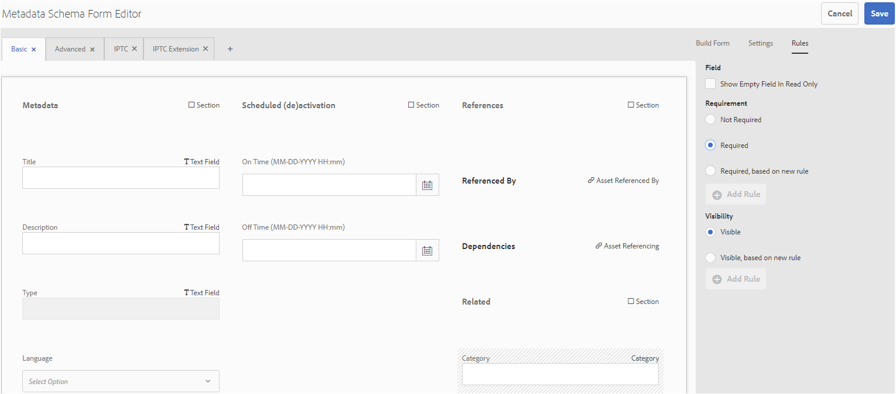

# 메타데이터 스키마 {#metadata-schemas}

Organizations come up with a metadata model that enhances the asset discovery, usage, interoperability, and so on. Correct metadata application is sacrosanct to maintaining metadata-driven workflows and processes. To adhere to organization-wide metadata strategy and standards, you can use metadata schemas that help DAM users to align. [!DNL Adobe Experience Manager] allows easy and flexible methods to create, maintain, and apply metadata schemas.

In [!DNL Adobe Experience Manager Assets], schemas contain specific fields for specific information to be filled in. It also contains layout information to display metadata fields in a user-friendly way. Metadata properties include title, description, MIME types, tags, and more. You can use the [!UICONTROL Metadata Schema Forms] editor to modify the existing schemas or add custom metadata schemas.

To view and edit the properties page for an asset, follow these steps:

1. Click the **[!UICONTROL View Properties]** option from the quick actions on the asset tile in card view.

   

   Alternatively, select an asset and then click **[!UICONTROL Properties]** from the toolbar.

1. You can edit the various editable metadata properties under the available tabs. However, you cannot modify the asset [!UICONTROL Type] in the [!UICONTROL Basic] tab of properties page.

   

*Figure: Basic tab on asset[!UICONTROL Properties].*

To modify the MIME type for an asset, use a custom metadata schema form or modify an existing form. 자세한 [내용은 메타데이터 스키마 양식](/help/assets/metadata-schemas.md#edit-metadata-schema-forms) 편집을 참조하십시오. If you modify the metadata schema of a MIME type, the properties page layout for the assets and all subtypes are modified. For example, modifying a jpeg schema under `default/image` only modifies the metadata layout (asset properties) for assets with MIME type `image/jpeg`. However, if you edit the default schema, your changes modify the metadata layout for all types of assets.

## 메타데이터 스키마 양식 {#default-metadata-schema-forms}

To view a list of forms or templates, in [!DNL Experience Manager] interface navigate to **[!UICONTROL Tools]** > **[!UICONTROL Assets]** > **[!UICONTROL Metadata Schemas]**.

[!DNL Experience Manager] 에는 다음 메타데이터 스키마 양식 템플릿이 제공됩니다.

| 템플릿 |  | 설명 |
|---|---|---|
| [!UICONTROL 기본값] |  | 자산에 대한 기본 메타데이터 스키마 양식입니다. |
|  | 다음 하위 양식은 [!UICONTROL 기본] 양식의 속성을 상속합니다. |  |
|  | [!UICONTROL 이미지] | 및 같은 MIME 형식의 이미지에 대한 스키마 양식 `image/jpeg` 을 참조하십시오 `image/png`.   이미지 [!UICONTROL 양식에는 다음과 같은 하위] 양식 템플릿이 있습니다. <ul><li> [!UICONTROL jpeg]: 하위 유형 jpeg가 있는 자산에 대한 스키마 [!UICONTROL 양식입니다].</li> <li>[!UICONTROL tiff]: 하위 유형 TIFF가 있는 자산의 스키마 양식입니다.</li></ul> |
|  | [!UICONTROL 응용 프로그램] | 및 같은 MIME 형식의 자산에 대한 스키마 양식 `application/pdf``application/zip`.  [!UICONTROL pdf]: Schema form for assets with sub type PDF. |
|  | [!UICONTROL 비디오] | Schema form for video assets with MIME type such as `video/avi` and `video/mp4`. |
| [!UICONTROL 컬렉션] |  | Schema form for collections. |
| [!UICONTROL contentfragment] |  | [Schema form for content fragments](/help/sites-developing/customizing-content-fragments.md). |
| [!UICONTROL 양식] |  | 이 스키마 양식은 [Adobe Experience Manager 양식과 관련되어 있습니다](/help/forms/home.md). |

<!-- 
TBD: Add dm_video child for the default form OOTB.
video doesn't contain any sub types as listed above OOTB.
application doesn't contain the sub type zip OOTB.
-->

>[!NOTE]
>
>To view the child forms of a schema form, click the schema form name.

## 메타데이터 스키마 양식 추가 {#add-a-metadata-schema-form}

To add a metadata schema form, follow these steps:

1. To add a custom template to the list, click **[!UICONTROL Create]** from the toolbar.

   >[!NOTE]
   >
   >A lock symbol is displayed with the unedited templates. If you customize a template, it is not locked .

1. In the dialog, provide the title of the schema form and click **[!UICONTROL Create]** to complete the form creation process.

## 메타데이터 스키마 양식 편집 {#edit-metadata-schema-forms}

새로 추가되거나 기존 메타데이터 스키마 양식을 편집할 수 있습니다. 메타데이터 스키마 양식에는 탭 내의 탭 및 양식 항목이 포함됩니다. 이러한 양식 항목을 CRX 저장소의 메타데이터 노드 내의 필드에 매핑/구성할 수 있습니다. 메타데이터 스키마 양식에 탭 또는 양식 항목을 추가할 수 있습니다. 상위에서 파생된 탭 및 양식 항목은 잠긴 상태입니다. You cannot alter them at the child level.

1. On the [!UICONTROL Metadata Schema Forms] page, select a form and click **[!UICONTROL Edit]** in the toolbar.

1. On the **[!UICONTROL Metadata Schema Form Editor]** page, customize the metadata form. Drag the needed components from the **[!UICONTROL Build Form]** tab to one of the tabs.

   

   *Figure: A[!UICONTROL Metadata Schema Form Editor]page with available tabs.*

1. 구성 요소를 구성하려면 구성 요소를 선택하고 설정 **[!UICONTROL 탭에서 해당 속성을]** 수정합니다.

### 양식 [!UICONTROL 작성 탭 내의] 구성 요소 {#components-within-the-build-form-tab}

The **[!UICONTROL Build Form]** tab lists form items that you use in your schema form. The **[!UICONTROL Settings]** tab provides the attributes of each item that you select in the **[!UICONTROL Build Form]** tab. 다음 표에는 양식 작성 탭에서 사용할 수 있는 양식 **[!UICONTROL 항목이]** 나열됩니다.

| 구성 요소 이름 | 설명 |
| -------------------------------- | ----------------------------------------------------------------------------------- |
| [!UICONTROL 섹션 머리글] | 공통 구성 요소 목록에 대한 섹션 머리글을 추가합니다. |
| [!UICONTROL 한 줄 텍스트] | 단일 행 텍스트 속성을 추가합니다. 문자열로 저장됩니다. |
| [!UICONTROL 다중 값 텍스트] | 다중 값 텍스트 속성을 추가합니다. 문자열 배열로 저장됩니다. |
| [!UICONTROL 번호] | 숫자 구성 요소를 추가합니다. |
| [!UICONTROL 날짜] | 날짜 구성 요소를 추가합니다. |
| [!UICONTROL 드롭다운] | 드롭다운 목록을 추가합니다. |
| [!UICONTROL 표준 태그] | 태그 추가. |
| [!UICONTROL 스마트 태그] | Add to augment search capabilities by automatically adding metadata tags. |
| [!UICONTROL 숨김 필드] | 숨김 필드를 추가합니다. 자산이 저장되면 POST 매개 변수로 전송됩니다. |
| [!UICONTROL 자산 참조자] | 이 구성 요소를 추가하여 자산에서 참조하는 자산 목록을 봅니다. |
| [!UICONTROL 자산 참조] | 자산을 참조하는 자산 목록을 표시하려면 추가합니다. |
| [!UICONTROL 제품 참조] | 자산에 연결된 제품 목록을 표시하려면 추가합니다. |
| [!UICONTROL 자산 등급] | 자산 등급을 위한 표시 옵션에 추가합니다. |
| [!UICONTROL 상황에 맞는 메타데이터] | 자산의 속성 페이지에서 다른 메타데이터 탭의 표시를 제어하는 데 추가합니다. |

#### 메타데이터 구성 요소 편집 {#edit-the-metadata-component}

양식에서 메타데이터 구성 요소의 속성을 편집하려면 구성 요소를 클릭하여 **[!UICONTROL 설정]** 탭에서 다음 속성의 전체 또는 하위 집합을 편집합니다.

**필드 레이블**: 자산의 속성 페이지에 표시되는 메타데이터 속성의 이름입니다.

**속성에 매핑**: 이 속성은 자산 노드가 CRX 저장소에 저장되는 자산 노드의 상대 경로를 지정합니다. 경로 `./` 가 자산의 노드 아래에 있음을 나타내기 위해 시작합니다.

다음은 이 속성에 유효한 값입니다.

* `./jcr:content/metadata/dc:title`: 자산의 메타데이터 노드에 값을 속성으로 저장합니다 `dc:title`.

* `./jcr:created`: 자산의 생성 날짜와 시간을 저장합니다. 보호된 속성입니다. 이러한 속성을 구성하는 경우 [편집 비활성화]로 표시하는 것이 좋습니다.

구성 요소가 메타데이터 스키마 양식에서 제대로 표시되도록 하려면 속성 경로에 공백이 없어야 합니다.

* **자리 표시자**: 이 속성을 사용하여 메타데이터 속성과 관련된 관련 자리 표시자 텍스트를 지정합니다.
* **필수**: 속성 페이지에서 메타데이터 속성을 필수로 표시하려면 이 속성을 사용합니다.
* **편집 비활성화**: 이 속성을 사용하여 속성 페이지의 속성에 대한 편집을 허용하지 않습니다.
* **빈 필드를 읽기 전용으로 표시**: 값이 없더라도 속성 페이지에 메타데이터 속성을 표시하려면 이 속성을 표시합니다. 기본적으로 메타데이터 속성에 값이 없으면 속성 페이지에 나열되지 않습니다.
* **목록 순서 표시**: 이 속성을 사용하여 순차 선택 항목 목록을 표시합니다.
* **선택 사항**: 이 속성을 사용하여 목록에서 선택 사항을 지정합니다.
* **설명** : 이 속성을 사용하여 메타데이터 구성 요소에 대한 짧은 설명을 추가합니다.
* **클래스**: 속성이 연결된 객체 클래스입니다.
* **삭제**: 스키마 [!UICONTROL 양식에서] 구성 요소를 삭제하려면 삭제를 클릭합니다.

>[!NOTE]
>
>숨김 [!UICONTROL 필드] 구성 요소에는 이러한 속성이 포함되어 있지 않습니다. 대신 속성 이름, 값, 필드 레이블 및 설명과 같은 속성을 포함합니다. 숨김 필드 구성 요소의 값은 자산을 저장할 때마다 POST 매개 변수로 전송됩니다. 자산에 대한 메타데이터로 저장되지 않습니다.

필수 **[!UICONTROL 옵션을]** 선택하면 필수 메타데이터가 없는 자산을 검색할 수 있습니다. 필터 **** 패널에서 **[!UICONTROL 메타데이터 유효성 검사]** 설명 **[!UICONTROL 을 확장하고]** 잘못된옵션을선택합니다. 검색 결과에는 스키마 양식을 통해 구성한 필수 메타데이터가 누락된 에셋이 표시됩니다.

컨텍스트 메타데이터 구성 요소를 스키마 양식의 임의 탭에 추가하는 경우 구성 요소는 특정 스키마가 적용되는 자산의 속성 페이지에 목록으로 나타납니다. 목록에는 컨텍스트 메타데이터 구성 요소를 적용한 탭을 제외한 다른 모든 탭이 포함되어 있습니다. 현재 이 기능은 컨텍스트에 따라 메타데이터 표시를 제어하는 기본 기능을 제공합니다.

컨텍스트 메타데이터 구성 요소가 적용된 탭 외에 속성 페이지에 탭을 표시하려면 목록에서 탭을 선택합니다. 탭이 속성 페이지에 추가됩니다.

*그림: 자산 속성 페이지의 컨텍스트 메타데이터*

### JSON 파일에서 속성 지정 {#specify-properties-in-json-file}

[ **[!UICONTROL 설정]** ] 탭에서 옵션에 대한 속성을 지정하는 대신 해당 키-값 쌍을 지정하여 JSON 파일에서 옵션을 정의할 수 있습니다. JSON 경로 **[!UICONTROL 필드에 JSON 파일 경로를]** 지정합니다.

#### 스키마 양식에서 탭 추가 또는 삭제 {#adding-deleting-a-tab-in-the-schema-form}

스키마 편집기를 사용하면 탭을 추가하거나 삭제할 수 있습니다. 기본 스키마 양식에는 **[!UICONTROL 기본]**, **[!UICONTROL 고급]** , **[!UICONTROL IPTC]****[!UICONTROL 및]** IPTC 확장탭이포함됩니다.

스키마 양식 `+` 에 탭을 추가하려면 을 클릭합니다. 기본적으로 새 탭에 이름이 지정됩니다 `Unnamed-1`. 설정 탭에서 이름을 수정할 수 **[!UICONTROL 있습니다]** .

탭 `X` 을 삭제하려면 클릭합니다.

## 메타데이터 스키마 양식 삭제 {#delete-metadata-schema-forms}

[!DNL Experience Manager] 사용자 정의 스키마 양식만 삭제할 수 있습니다. 기본 스키마 양식/템플릿을 삭제할 수 없습니다. 그러나 이러한 양식에서 사용자 정의 변경 사항을 삭제할 수 있습니다.

양식을 삭제하려면 양식을 선택하고 삭제를 클릭합니다.

>[!NOTE]
>
>* 기본 양식에 대한 사용자 지정 변경 사항을 삭제하면 잠금  앞에 다시 나타납니다. 양식은 기본 상태로 되돌려졌음을 나타냅니다.
>* 기본 메타데이터 스키마 양식은 삭제할 수 없습니다 [!DNL Assets].

## MIME 형식의 스키마 양식 {#schema-forms-for-mime-types}

[!DNL Experience Manager] 기본적으로 다양한 MIME 유형에 대한 기본 양식을 제공합니다. 그러나 다양한 MIME 형식의 자산에 대해 사용자 지정 양식을 추가할 수 있습니다.

### MIME 유형에 새 양식 추가 {#add-new-forms-for-mime-types}

적절한 양식 유형 아래에서 양식을 만듭니다. 예를 들어 하위 유형에 대한 템플릿을 추가하려면 &quot;이미지&quot; 양식 아래에 양식을 `image/png` 만듭니다. 스키마 양식의 제목은 하위 유형 이름입니다. 이 경우 제목은 입니다 `png`.

#### 다양한 MIME 유형에 기존 스키마 템플릿 사용 {#use-an-existing-schema-template-for-various-mime-types}

기존 템플릿을 다른 MIME 유형에 사용할 수 있습니다. 예를 들어 MIME 형식의 자산에 `image/jpeg` 양식을 사용하십시오 `image/png`.

이 경우 CRX 저장소의 노드 `/etc/dam/metadataeditor/mimetypemappings` 를 만듭니다. 노드의 이름을 지정하고 다음 속성을 정의합니다.

| 이름 | 설명 | 유형 | 값 |
|------|-------------|------|-------|
| `exposedmimetype` | 매핑할 기존 양식의 이름 | `String` | `image/jpeg` |
| `mimetypes` | 특성에 정의된 양식을 사용하는 MIME 형식 `exposedmimetype` 목록 | `String` | `image/png` |

[!DNL Assets] 다음 MIME 형식과 스키마 양식을 매핑합니다.

| 스키마 양식 | MIME 형식 |
| --------------------------- | --------------------------------------------------- |
| image/jpeg | image/pjpeg |
| image/tiff | image/x-tiff |
| application/pdf | application/postscript |
| application/x-ImageSet | Multipart/Related; type=application/x-ImageSet |
| application/x-SpinSet | Multipart/Related; type=application/x-SpinSet |
| application/x-mixedMediaSet | Multipart/Related; type=application/x-MixedMediaSet |
| video/quicktime | video/x-quicktime |
| video/mpeg4 | video/mp4 |
| 비디오/avi | video/avi, video/msvideo, video/x-msvideo |
| video/wmv | video/x-ms-wmv |
| 비디오/flv | video/x-flv |

## 메타데이터 스키마에 대한 액세스 권한 부여 {#grant-access-to-metadata-schemas}

메타데이터 스키마 기능은 관리자만 사용할 수 있습니다. 하지만 관리자는 일부 권한을 수정하여 비관리자에게 액세스할 수 있습니다. 관리자가 아닌 사용자가 폴더에 대한 권한을 만들고, 수정하고, 삭제할 수 있도록 `/conf` 합니다.

## 폴더별 메타데이터 적용 {#apply-folder-specific-metadata}

[!DNL Assets] 메타데이터 스키마의 변형을 정의하고 특정 폴더에 적용할 수 있습니다.

예를 들어 기본 메타데이터 스키마의 변형을 정의하고 폴더에 적용할 수 있습니다. 수정된 스키마를 적용하면 폴더 내의 자산에 적용되는 원본 기본 메타데이터 스키마를 무시합니다.

이 스키마가 적용되는 폴더에 업로드된 자산만 변형 메타데이터 스키마에 정의된 수정된 메타데이터에 따릅니다. [!DNL Assets] 원본 스키마가 적용된 다른 폴더에서는 원본 스키마에 정의된 메타데이터를 계속 준수하므로

자산별 메타데이터 상속은 계층의 첫 번째 수준 폴더에 적용되는 스키마를 기반으로 합니다. 즉, 폴더에 하위 폴더가 없으면 폴더 내의 에셋은 폴더에 적용된 스키마의 메타데이터를 상속합니다.

하위 폴더에 다른 스키마를 적용할 수 있습니다. 하위 폴더 내의 에셋은 바로 가기 하위 폴더의 메타데이터 스키마를 상속합니다. 하위 폴더 수준에 스키마나 동일한 스키마가 적용되지 않으면 해당 에셋은 상위 폴더에서 스키마를 상속합니다.

1. 인터페이스에서 [!DNL Experience Manager] 도구 **[!UICONTROL > 자산]** **[!UICONTROL >]** 메타데이터 스키마 **[!UICONTROL 로 이동합니다]**. 메타데이터 **[!UICONTROL 스키마 양식]** 페이지가 표시됩니다.
1. 양식 앞에 있는 확인란(예: 기본 메타데이터 양식)을 선택하고 **[!UICONTROL 복사를]** 클릭하고 사용자 지정 양식으로 저장합니다. 예를 들어 양식의 사용자 지정 이름을 지정합니다 `my_default`. 또는 사용자 지정 양식을 만들 수 있습니다.

1. [ **[!UICONTROL 메타데이터 스키마 양식]** ] 페이지에서 `my_default` 양식을 선택한 다음 편집을 **[!UICONTROL 클릭합니다]**.

1. [ **[!UICONTROL 메타데이터 스키마 편집기]** ] 페이지에서 스키마 양식에 텍스트 필드를 추가합니다. 예를 들어 레이블 카테고리와 함께 필드를 **[!UICONTROL 추가합니다]**.

   

   *그림: 메타데이터 스키마 양식 편집기에 텍스트 필드가 추가되었습니다.*

1. **[!UICONTROL 저장]**&#x200B;을 클릭합니다. 수정된 양식이 [ **[!UICONTROL 메타데이터 스키마 양식] 페이지에]** 나열됩니다.
1. 도구 모음 **[!UICONTROL 에서]** 폴더에 적용을 클릭하여 사용자 지정 메타데이터를 폴더에 적용합니다.

1. 수정된 스키마를 적용할 폴더를 선택한 다음 적용을 **[!UICONTROL 클릭합니다]**.

   

1. 폴더에 다른 메타데이터 스키마가 적용된 경우 기존 메타데이터 스키마를 덮어쓸지 묻는 메시지가 나타납니다. 덮어쓰기를 **클릭합니다**.
1. 확인 **을** 클릭하여 성공 메시지를 닫습니다.
1. 수정된 메타데이터 스키마를 적용한 폴더로 이동합니다.

## 필수 메타데이터 정의 {#define-mandatory-metadata}

폴더에 업로드된 자산에 대해 적용되는 폴더 수준에서 필수 필드를 정의할 수 있습니다. 앞에서 정의된 필수 필드에 대해 메타데이터가 없는 자산을 업로드하면 카드 보기의 자산에 누락된 메타데이터에 대한 시각적 표시가 나타납니다.

>[!NOTE]
>
>메타데이터 필드는 다른 필드의 값을 기준으로 필수로 정의할 수 있습니다. 카드 보기에서는 이러한 필수 메타데이터 필드에 대한 누락된 메타데이터에 대한 경고 메시지를 표시하지 [!DNL Experience Manager] 않습니다.

1. 인터페이스에서 [!DNL Experience Manager] 도구 **[!UICONTROL > 자산]** **[!UICONTROL >]** 메타데이터 스키마 **[!UICONTROL 로 이동합니다]**. The **[!UICONTROL Metadata Schema Forms]** page is displayed.
1. 기본 메타데이터 양식을 사용자 지정 양식으로 저장합니다. 예를 들어 다른 이름으로 저장합니다 `my_default`.

1. 사용자 지정 양식을 편집합니다. 필수 필드를 추가합니다. 예를 들어 카테고리 **** 필드를 추가하고 필드를 필수 필드로 만듭니다.

   

   *Figure: Mandatory field in metadata schema form editor.*

1. **[!UICONTROL 저장]**&#x200B;을 클릭합니다. 수정된 양식이 [ **[!UICONTROL 메타데이터 스키마 양식] 페이지에]** 나열됩니다. 양식을 선택한 다음 도구 모음 **[!UICONTROL 에서 폴더에]** 적용을 클릭하여 사용자 지정 메타데이터를 폴더에 적용합니다.

1. 사용자 지정 양식에 추가한 필수 필드에 대한 메타데이터가 없는 일부 자산을 폴더로 이동하고 업로드합니다. A message for the missing metadata for the mandatory field is displayed on the card view of the asset.

   

1. (Optional) Access `https://[aem_server]:[port]/system/console/components/`. 기본적으로 비활성화된 구성 `com.day.cq.dam.core.impl.MissingMetadataNotificationJob` 요소를 구성하고 활성화합니다. Set a frequency at which [!DNL Experience Manager] checks for the validity of metadata on the assets. This configuration adds a property `hasValidMetadata` to `jcr:content` of assets. [!DNL Experience Manager] uses this property to filter the invalid assets in a search result. If you add an asset after a check, the asset is not flagged with `hasValidMetadata` until the next scheduled check. Hence the assets do not appear in search filters for invalid metadata untill after the next scheduled check.

   >[!CAUTION]
   >
   >The metadata validation checks are resource-intensive and may impact the performance of your system. Schedule the checks accordingly. If the server cannot cope up with the load, try disabling this job.

<!-- TBD: Add this method to find invalid metadata in the metadata.md article later when it is published as a top-level metadata article.
-->
