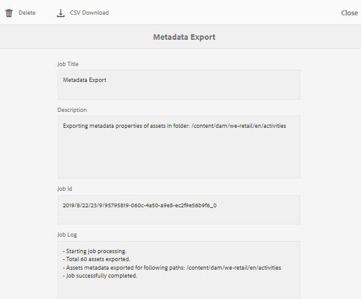

# 디지털 자산의 메타데이터 {#managing-metadata-for-digital-assets} 관리

<!-- Scope of metadata articles:
* metadata.md: The scope of this article is basic metadata updates, changes, etc. operations that end-users can do.
* metadata-concepts.md: All conceptual information. Minor instructions are OK but it is an FYI article about support and standards.
* metadata-config.md: New article. Contains all configuration and administration how-to info related to metadata of assets.
-->

[!DNL Adobe Experience Manager Assets] 모든 자산에 대한 메타데이터를 유지합니다. 자산을 보다 쉽게 분류하고 구성할 수 있으며 특정 자산을 찾는 사람에게 도움이 됩니다. [!DNL Experience Manager Assets]에 업로드된 파일에서 메타데이터를 추출하는 기능을 통해 메타데이터 관리는 크리에이티브 워크플로우와 통합됩니다. 자산으로 메타데이터를 유지 및 관리하는 기능을 사용하면 메타데이터를 기반으로 자산을 자동으로 구성하고 처리할 수 있습니다.

## 메타데이터 및 해당 원본 {#how-to-edit-or-add-metadata}

메타데이터는 검색할 수 있는 자산에 대한 추가 정보입니다. 자산에 추가되고, [!DNL Experience Manager]에서 자산을 업로드할 때 처리됩니다. 기존 메타데이터를 편집하고 기존 필드에 새 메타데이터 속성을 추가할 수 있습니다. 조직에는 제어되고 신뢰할 수 있는 메타데이터 어휘가 필요합니다. 따라서 [!DNL Experience Manager Assets]에서는 새 메타데이터 속성을 주문형 추가할 수 없습니다. 관리자 및 개발자만 메타데이터를 포함하는 새 속성 또는 필드를 추가할 수 있습니다. 사용자는 기존 필드를 메타데이터로 채울 수 있습니다.

다음 방법을 사용하여 디지털 자산에 메타데이터를 추가할 수 있습니다.

* 먼저 자산을 만드는 기본 애플리케이션에서 메타데이터를 추가합니다. 예를 들어 [Acrobat은 일부 메타데이터](https://helpx.adobe.com/acrobat/using/pdf-properties-metadata.html)을 PDF 파일에 추가하거나 카메라가 사진에 일부 기본 메타데이터를 추가합니다. 자산을 생성할 때 기본 애플리케이션 자체에 메타데이터를 추가할 수 있습니다. 예를 들어 Adobe Lightroom](https://helpx.adobe.com/lightroom-classic/help/metadata-basics-actions.html)에서 [IPTC 메타데이터를 추가할 수 있습니다.

* 자산을 [!DNL Experience Manager]에 업로드하기 전에 자산을 만들거나 다른 메타데이터 편집 응용 프로그램을 사용하여 메타데이터를 편집하고 수정할 수 있습니다. 자산을 Experience Manager에 업로드하면 메타데이터가 처리됩니다. 예를 들어 [이 [!DNL Adobe Bridge]](https://helpx.adobe.com/bridge/user-guide.html/bridge/using/metadata-adobe-bridge.ug.html)에서 메타데이터를 사용하여 작업하는 방법을 참조하고, [!DNL Adobe Exchange]에서 [!DNL Bridge CC]](https://exchange.adobe.com/creativecloud.details.20009.aem-tags-panel-for-bridge-cc.html)태그 패널을 참조하십시오.[

* [!DNL Experience Manager Assets]에서 [!UICONTROL 속성] 페이지에서 자산의 메타데이터를 수동으로 추가하거나 편집할 수 있습니다.

* 자산이 DAM에 업로드될 때 [메타데이터 프로필](/help/assets/metadata-config.md#metadata-profiles) 기능을 활용하여 메타데이터를 자동으로 추가할 수 있습니다.[!DNL Experience Manager Assets]

## [!DNL Experience Manager Assets] {#add-edit-metadata}에서 메타데이터 추가 또는 편집

[!DNL Assets] 사용자 인터페이스에서 자산의 메타데이터를 편집하려면 다음 단계를 따르십시오.

1. 다음 중 하나를 수행하십시오.

   * [!DNL Assets] 인터페이스에서 자산을 선택하고 도구 모음에서 **[!UICONTROL 속성 보기]**&#x200B;를 클릭합니다.
   * 자산 축소판에서 **[!UICONTROL 속성 보기]** 빠른 작업을 선택합니다.
   * 자산 페이지에서 도구 모음에서 **[!UICONTROL 속성 보기]** 을 클릭합니다.

   자산 페이지에 모든 자산의 메타데이터가 표시됩니다. 자산이 [!DNL Experience Manager]에 업로드될 때 메타데이터가 추출됩니다(수집된).

   

   *그림:자산 속성 페이지에서 메타데이터를 편집하거나   추가합니다.*

1. 필요에 따라 다양한 탭 아래에서 메타데이터를 편집하고, 완료되면 도구 모음에서 **[!UICONTROL 저장]** 을 클릭하여 변경 사항을 저장합니다. **[!UICONTROL 닫기]** 를 클릭하여 [!DNL Assets] 웹 인터페이스로 돌아갑니다.

   >[!NOTE]
   >
   >텍스트 필드가 비어 있으면 기존 메타데이터 세트가 없습니다. 필드에 값을 입력하고 저장하여 해당 메타데이터 속성을 추가할 수 있습니다.

자산의 메타데이터에 대한 모든 변경 사항은 XMP 데이터의 일부로서 원래 바이너리에 다시 작성됩니다. 메타데이터 다시 쓰기 워크플로우는 메타데이터를 원래 바이너리에 추가합니다. 기존 속성(예: `dc:title`)에 대한 변경 사항을 덮어쓰고 새 속성(`cq:tags` 등의 사용자 지정 속성 포함)이 스키마와 함께 추가됩니다.

XMP Write-back은 [기술 요구 사항에 설명된 플랫폼 및 파일 형식에 대해 지원되고 활성화됩니다.](/help/sites-deploying/technical-requirements.md)

## 여러 자산 {#editing-metadata-properties-of-multiple-assets}의 메타데이터 속성 편집

[!DNL Adobe Enterprise Manager Assets] 여러 자산의 메타데이터를 동시에 편집할 수 있으므로 일반적인 메타데이터 변경 사항을 자산에 빠르게 전파할 수 있습니다. 여러 컬렉션의 메타데이터를 일괄적으로 편집할 수도 있습니다. 속성 페이지를 사용하여 여러 자산 또는 컬렉션에서 메타데이터 변경 작업을 수행합니다.

* 메타데이터 속성을 공통 값으로 변경
* 태그 추가 또는 수정

메타데이터 속성 추가, 수정, 삭제 등 메타데이터 속성 페이지를 사용자 지정하려면 [스키마 편집기](metadata-config.md#folder-metadata-schema)를 사용합니다.

>[!NOTE]
>
>벌크 편집 방법은 폴더 또는 컬렉션에서 사용할 수 있는 자산에 대해 작동합니다. 폴더 간에 사용할 수 있거나 일반적인 기준과 일치하는 자산의 경우, [검색 후 메타데이터를 벌크로 업데이트할 수 있습니다](search-assets.md#metadataupdates).

1. [!DNL Assets] 사용자 인터페이스에서 편집할 자산의 위치로 이동합니다.
1. 공통 속성을 편집할 자산을 선택합니다.
1. 도구 모음에서 **[!UICONTROL 속성]** 을 클릭하여 선택한 자산에 대한 속성 페이지를 엽니다.
1. 다양한 탭에서 선택한 자산에 대한 메타데이터 속성을 수정합니다.
1. 특정 자산의 메타데이터를 보려면 목록에 있는 나머지 자산의 선택을 취소합니다. [!UICONTROL 속성] 페이지에서 몇 개의 자산 선택을 취소하면 해당 자산의 메타데이터가 업데이트되지 않습니다.
1. 자산에 대해 다른 메타데이터 스키마를 선택하려면 도구 모음에서 **[!UICONTROL 설정]**&#x200B;을 클릭하고 스키마를 선택합니다. **[!UICONTROL 저장 후 닫기]**&#x200B;를 클릭합니다.
1. 여러 값을 포함하는 필드에 기존 메타데이터와 새 메타데이터를 추가하려면 **[!UICONTROL 추가 모드]**&#x200B;를 선택합니다. 이 옵션을 선택하지 않으면 새 메타데이터가 필드에서 기존 메타데이터를 대체합니다. **[!UICONTROL 제출]**&#x200B;을 클릭합니다.

>[!CAUTION]
>
>단일 값 필드의 경우 **[!UICONTROL 추가 모드]**&#x200B;를 선택하더라도 새 메타데이터가 필드의 기존 값에 추가되지 않습니다.

## 메타데이터 가져오기 {#import-metadata}

[!DNL Assets] csv 파일을 사용하여 자산 메타데이터를 일괄적으로 가져올 수 있습니다. CSV 파일을 가져와서 최근에 업로드한 자산 또는 기존 자산에 대한 벌크 업데이트를 수행할 수 있습니다. 타사 시스템에서 CSV 형식으로 자산 메타데이터를 일괄적으로 수집할 수도 있습니다.

메타데이터 가져오기는 비동기적이며 시스템 성능에 영향을 주지 않습니다. 워크플로우 플래그를 선택하는 경우 XMP 원본에 쓰기 활동으로 인해 여러 자산에 대한 메타데이터를 동시에 업데이트할 때 리소스를 많이 사용할 수 있습니다. 다른 사용자의 성능에 영향을 주지 않도록 서버 사용 공간을 적게 사용하는 동안 이러한 가져오기를 계획합니다.

>[!NOTE]
>
>사용자 지정 네임스페이스에 메타데이터를 가져오려면 먼저 네임스페이스를 등록합니다.

1. [!DNL Assets] 사용자 인터페이스로 이동하고 도구 모음에서 **[!UICONTROL 만들기]**&#x200B;를 클릭합니다.
1. 메뉴에서 **[!UICONTROL 메타데이터]**&#x200B;를 선택합니다.
1. **[!UICONTROL 메타데이터 가져오기]** 페이지에서 **[!UICONTROL 파일 선택]**&#x200B;을 클릭합니다. 메타데이터가 있는 CSV 파일을 선택합니다.
1. 다음 매개 변수를 지정합니다. [메타데이터-import-sample-file.csv](/help/assets/assets/metadata-import-sample-file.csv)에서 샘플 CSV 파일을 참조하십시오.

   | 메타데이터 가져오기 매개 변수 | 설명 |
   |:---|:---|
   | [!UICONTROL 배치 크기] | 메타데이터를 가져올 일괄 처리의 자산 수입니다. 기본값은 50입니다. 최대값은 100입니다. |
   | [!UICONTROL 필드 분리 기호] | 기본값은 `,`(쉼표)입니다. 다른 문자를 지정할 수 있습니다. |
   | [!UICONTROL 다중 값 구분 기호] | 메타데이터 값에 대한 구분자입니다. 기본값은 `|`입니다. |
   | [!UICONTROL 워크플로우 실행] | 기본적으로 False입니다. `true`(으)로 설정되고 기본 런처 설정이 [!UICONTROL DAM 메타데이터 WriteBack] 워크플로우(이진 XMP 데이터에 메타데이터를 쓰는 경우)에 적용됩니다. 실행 워크플로우를 활성화하면 시스템이 느려집니다. |
   | [!UICONTROL 자산 경로 열 이름] | 자산이 있는 CSV 파일의 열 이름을 정의합니다. |

1. 도구 모음에서 **[!UICONTROL 가져오기]**&#x200B;를 클릭합니다. 메타데이터를 가져온 후에는 [!UICONTROL Notification] 받은 편지함에 알림이 표시됩니다.

1. 올바른 가져오기를 확인하려면 자산의 [!UICONTROL 속성] 페이지로 이동하여 필드의 값을 확인합니다.

메타데이터를 가져올 때 날짜 및 타임스탬프를 추가하려면 날짜 및 시간에 `YYYY-MM-DDThh:mm:ss.fff-00:00` 형식을 사용하십시오. 날짜와 시간은 `T`으로 구분되고, `hh`은 24시간 형식의 시간, `fff`는 나노초이고, `-00:00`은 시간대 오프셋입니다. 예를 들어 `2020-03-26T11:26:00.000-07:00`은 2020년 3월 26일, 11:26:00.000AM PST 시간입니다.

>[!CAUTION]
>
>날짜 형식이 `YYYY-MM-DDThh:mm:ss.fff-00:00`과 일치하지 않으면 날짜 값이 설정되지 않습니다. 내보낸 메타데이터 CSV 파일의 날짜 형식은 `YYYY-MM-DDThh:mm:ss-00:00` 형식입니다. 가져오려면 `fff`으로 표시된 나노 초 값을 추가하여 허용 가능한 형식으로 변환하십시오.

## 메타데이터 {#export-metadata} 내보내기

여러 자산에 대한 메타데이터를 CSV 형식으로 내보낼 수 있습니다. 메타데이터는 비동기식으로 내보내지므로 시스템 성능에 영향을 주지 않습니다. 메타데이터를 내보내려면 [!DNL Experience Manager]이 자산 노드 `jcr:content/metadata` 및 해당 하위 노드의 속성을 통과하여 CSV 파일로 메타데이터 속성을 내보냅니다.

메타데이터를 일괄적으로 내보내는 사용 사례는 다음과 같습니다.

* 자산을 마이그레이션할 때 서드파티 시스템에서 메타데이터를 가져옵니다.
* 더 넓은 프로젝트 팀과 자산 메타데이터를 공유합니다.
* 메타데이터를 테스트하거나 감사하여 규정을 준수합니다.
* 메타데이터를 외부화하여 별도로 현지화합니다.

1. 메타데이터를 내보낼 자산이 들어 있는 자산 폴더를 선택합니다. 도구 모음에서 **[!UICONTROL 메타데이터 내보내기]**&#x200B;를 선택합니다.

1. [!UICONTROL 메타데이터 내보내기] 대화 상자에서 CSV 파일의 이름을 지정합니다. 하위 폴더의 자산에 대한 메타데이터를 내보내려면 **[!UICONTROL 하위 폴더에 자산 포함]**&#x200B;을 선택합니다.

   

1. 원하는 옵션을 선택합니다. 파일 이름을 입력하고 필요한 경우 날짜를 입력합니다.

1. **[!UICONTROL 내보낼 속성]** 필드에서 모든 속성을 내보내할지 특정 속성을 내보내할지를 지정합니다. 내보낼 선택적 속성 을 선택하는 경우 원하는 속성을 추가합니다.

1. 도구 모음에서 **[!UICONTROL 내보내기]**&#x200B;를 클릭합니다. 메타데이터가 내보내지는지 확인하는 메시지가 나타납니다. 메시지를 닫습니다.

1. 내보내기 작업에 대한 받은 편지함 알림을 엽니다. 작업을 선택하고 도구 모음에서 **[!UICONTROL 열기]**&#x200B;를 클릭합니다. 메타데이터가 포함된 CSV 파일을 다운로드하려면 도구 모음에서 **[!UICONTROL CSV 다운로드]** 를 클릭합니다. **[!UICONTROL 닫기]**&#x200B;를 클릭합니다.

   

   *그림:대량으로 내보낸 메타데이터가 포함된 CSV 파일을 다운로드하는 대화 상자*

## {#collections-metadata} 컬렉션의 메타데이터 편집

자세한 내용은 [컬렉션 메타데이터](/help/assets/manage-collections.md#view-edit-collection-metadata) 보기 및 편집 및 [일괄](/help/assets/manage-collections.md#editing-collection-metadata-in-bulk)에서 여러 컬렉션의 메타데이터 편집을 참조하십시오.

## 폴더 {#applying-a-metadata-profile-to-folders}에 메타데이터 프로필 적용

<!-- TBD: Review this overview.
-->

메타데이터 프로필을 폴더에 할당하면 모든 하위 폴더는 해당 상위 폴더에서 프로필을 자동으로 상속합니다. 즉, 폴더에 하나의 메타데이터 프로필만 할당할 수 있습니다. 따라서 자산을 업로드, 저장, 사용 및 보관하는 의 폴더 구조를 신중하게 고려하십시오.

폴더에 다른 메타데이터 프로필을 할당한 경우 새 프로필이 이전 프로필을 무시합니다. 이전에 기존 폴더 자산은 변경되지 않은 상태로 유지됩니다. 새 프로필은 나중에 폴더에 추가된 자산에 적용됩니다.

프로필이 할당된 폴더는 카드 이름에 표시되는 프로필의 이름으로 사용자 인터페이스에 표시됩니다.

특정 폴더에 메타데이터 프로필을 적용하거나 모든 자산에 전체적으로 적용할 수 있습니다.

나중에 변경한 기존 메타데이터 프로필이 이미 있는 폴더에서 자산을 재처리할 수 있습니다. [폴더의 자산에 대한 처리 프로필을 편집한 후 재처리](processing-profiles.md#reprocessing-assets)를 참조하십시오.

**[!UICONTROL 도구]** 메뉴 내에서 또는 폴더에 있는 경우 **[!UICONTROL 속성]**&#x200B;에서 메타데이터 프로필을 폴더에 적용할 수 있습니다. 이 섹션에서는 두 가지 방법으로 폴더에 메타데이터 프로필을 적용하는 방법을 설명합니다.

프로필이 이미 할당된 폴더는 폴더 이름 바로 아래에 프로필 이름이 표시되어 표시됩니다.

나중에 변경한 기존 비디오 프로필이 이미 있는 폴더에서 자산을 재처리할 수 있습니다. [폴더의 자산에 대한 처리 프로필을 편집한 후 재처리](processing-profiles.md#reprocessing-assets)를 참조하십시오.

### [!UICONTROL 프로필] 사용자 인터페이스 {#applying-metadata-profiles-to-folders-from-profiles-user-interface}의 폴더에 메타데이터 프로필을 적용합니다.

메타데이터 프로필을 적용하려면 다음 단계를 수행합니다.

1. [!DNL Experience Manager] 로고를 클릭하고 **[!UICONTROL 도구]** > **[!UICONTROL 자산]** > **[!UICONTROL 메타데이터 프로필]**&#x200B;으로 이동합니다.
1. 폴더 또는 여러 폴더에 적용할 메타데이터 프로필을 선택합니다.
1. **[!UICONTROL 메타데이터 프로필을 폴더에 적용]**&#x200B;을 클릭하고 새로 업로드한 자산을 받는 데 사용할 폴더 또는 여러 폴더를 선택하고 **[!UICONTROL 완료]**&#x200B;를 클릭합니다. 프로필이 이미 할당된 폴더는 폴더 이름 바로 아래에 프로필 이름이 표시되어 표시됩니다.

### [!UICONTROL 속성] {#applying-metadata-profiles-to-folders-from-properties}의 폴더에 메타데이터 프로필 적용

1. 왼쪽 레일에서 **[!UICONTROL 자산]**&#x200B;을 클릭한 다음 메타데이터 프로필을 적용할 폴더로 이동합니다.
1. 폴더에서 확인 표시를 클릭하여 선택한 다음 **[!UICONTROL 속성]**&#x200B;을 클릭합니다.

1. **[!UICONTROL 메타데이터 프로필]** 탭을 선택하고 팝업 메뉴에서 프로필을 선택한 다음 **[!UICONTROL 저장]**&#x200B;을 클릭합니다.

프로필이 이미 할당된 폴더는 폴더 이름 바로 아래에 프로필 이름이 표시되어 표시됩니다.

<!-- TBD: Commenting as the topic in metadata-config.md is incomplete.

### Apply metadata profile globally {#metadata-profile-global}

For details, see [configuration to apply metadata profile globally](/help/assets/metadata-config.md#apply-a-metadata-profile-globally). -->

### {#removing-a-metadata-profile-from-folders} 폴더에서 메타데이터 프로필을 제거합니다.

폴더에서 메타데이터 프로필을 제거하면 모든 하위 폴더는 해당 상위 폴더에서 프로필을 자동으로 상속받게 됩니다. 그러나 폴더 내에서 발생한 파일의 모든 처리가 그대로 유지됩니다.

**[!UICONTROL 도구]** 메뉴 또는 폴더 내의 **[!UICONTROL 속성]**&#x200B;에서 메타데이터 프로필을 제거할 수 있습니다.

#### 프로필 사용자 인터페이스 {#removing-metadata-profiles-from-folders-via-profiles-user-interface}을 통해 폴더에서 메타데이터 프로필을 제거합니다

1. [!DNL Experience Manager] 로고를 클릭하고 **[!UICONTROL 도구]** > **[!UICONTROL 자산]** > **[!UICONTROL 메타데이터 프로필]**&#x200B;으로 이동합니다.
1. 폴더 또는 여러 폴더에서 제거할 메타데이터 프로필을 선택합니다.
1. **[!UICONTROL 폴더에서 메타데이터 프로필 제거]**&#x200B;를 클릭하고 프로필을 제거하는 데 사용할 폴더 또는 여러 폴더를 선택하고 **[!UICONTROL 완료]**&#x200B;를 클릭합니다.

   이름이 더 이상 폴더 이름 아래에 표시되지 않으므로 메타데이터 프로필이 더 이상 폴더에 적용되지 않았는지 확인할 수 있습니다.

#### 속성 {#removing-metadata-profiles-from-folders-via-properties}을 통해 폴더에서 메타데이터 프로필을 제거합니다

1. [!DNL Experience Manager] 로고를 클릭하고 **[!UICONTROL 자산]**&#x200B;으로 이동한 다음 메타데이터 프로필을 제거할 폴더로 이동합니다.
1. 폴더에서 확인 표시를 클릭하여 선택한 다음 **[!UICONTROL 속성]**&#x200B;을 클릭합니다.
1. **[!UICONTROL 메타데이터 프로필]** 탭을 선택하고 드롭다운 메뉴에서 **[!UICONTROL 없음]**&#x200B;을 선택하고 **[!UICONTROL 저장]**&#x200B;을 클릭합니다. 프로필이 이미 할당된 폴더는 폴더 이름 바로 아래에 프로필 이름이 표시되어 표시됩니다.

## 팁 및 제한 사항 {#best-practices-limitations}

* 사용자 인터페이스를 통한 메타데이터 업데이트는 `dc` 네임스페이스의 메타데이터 속성을 변경합니다. HTTP API를 통해 수행된 모든 업데이트는 `jcr` 네임스페이스의 메타데이터 속성을 변경합니다. HTTP API](/help/assets/mac-api-assets.md#update-asset-metadata)를 사용하여 메타데이터를 업데이트하는 방법 [을 참조하십시오.

* 자산 메타데이터를 가져오기 위한 CSV 파일은 매우 특정 형식입니다. 노력과 시간을 절약하고 의도하지 않은 오류를 방지하기 위해 내보낸 CSV 파일의 형식을 사용하여 CSV 만들기를 시작할 수 있습니다.

* CSV 파일을 사용하여 메타데이터를 가져오는 경우 필요한 날짜 날짜 형식은 `YYYY-MM-DDThh:mm:ss.fff-00:00`입니다. 다른 형식을 사용하는 경우 날짜 값이 설정되지 않습니다. 내보낸 메타데이터 CSV 파일의 날짜 형식은 `YYYY-MM-DDThh:mm:ss-00:00` 형식입니다. 가져오려면 `fff`으로 표시된 나노 초 값을 추가하여 허용 가능한 형식으로 변환하십시오.

>[!MORELIKETHIS]
>
>* [메타데이터 개념 및 이해](metadata-concepts.md).
>* [여러 컬렉션의 메타데이터 속성 편집](manage-collections.md#editing-collection-metadata-in-bulk)
* [Experience Manager 자산에서 메타데이터 가져오기 및 내보내기](https://experienceleague.adobe.com/docs/experience-manager-learn/assets/metadata/metadata-import-feature-video-use.html)

<!-- TBD: Try filling the available information in these topics to the extent possible. As and when complete, publish the sections live.

## Where to find metadata of an asset or folder {#find-metadata}

What all methods to access asset Properties. More Details option in column view. Select asset and click Properties. Keyboard shortcut `p`. What else?

## Understand metadata handling in Experience Manager {#metadata-possibilities-with-aem}

Describe the journey of an assets' metadata. What all happens to metadata when an asset is added to Experience Manager.

## Add metadata to your digital assets {#add-metadata}

* To begin with, assets come with some metadata. The applications that create digital assets add some metadata to the assets created. Before uploading an asset to Experience Manager, you can edit and modify metadata using either the native application used to create an asset or using some other metadata editing application. When you upload an asset to Experience Manager, the metadata is processed.

* Link to PS, ID, AI, PDF, etc. metadata-related help articles.

* Link to XMP writeback.

* Manually add (or edit) metadata in AEM in Properties page.

* Metadata profiles

* Any workflows related to metadata?

* Advanced topic: Add, edit, modify, process and writeback metadata of subassets.

## Metadata of assets, folders, and collections {#metadata-of-assets-folders-collections}

Similarities and differences between metadata of asset and folder. 

Link to metadata handling of collections.

## Modify metadata of an asset, folder, or collection {#modify-metadata}

* While creating assets: Native application.

* Before ingesting assets: Metadata editors

* After ingesting assets: Properties of an asset, folder, collection, etc.

* Any supported programmatic method to bulk edit metadata directly in JCR?

## Modify metadata in bulk {#modify-metadata-in-bulk}

[!DNL Adobe Enterprise Manager Assets] lets you edit the metadata of multiple assets simultaneously so you can quickly propagate common metadata changes to assets in bulk. You can also edit the metadata for multiple collections in bulk.

Use the properties page to perform metadata changes on multiple assets or collections:

* Change metadata properties to a common value

* Add or modify tags

To customize the metadata properties page, including adding, modifying, deleting metadata properties, use the schema editor.

>[!NOTE]
>
>The bulk editing methods work for assets available in a folder or a collection. For the assets that are available across folders or match a common criteria, it is possible to [bulk update the metadata after searching](search-assets.md#metadataupdates).

1. In the [!DNL Assets] user interface, navigate to the location of the assets you want to edit.
1. Select the assets for which you want to edit common properties.
1. From the toolbar, click **[!UICONTROL Properties]** to open the properties page for the selected assets.

   >[!NOTE]
   >
   >When you select multiple assets, the lowest common parent form is selected for the assets. In other words, the properties page only displays metadata fields that are common across the properties pages of all the individual assets.

1. Modify the metadata properties for selected assets under the various tabs.
1. To view the metadata editor for a specific asset, deselect the remaining assets in the list. The metadata editor fields are populated with the metadata for the particular asset.

   >[!NOTE]
   >
   >* In the Properties page, you can remove assets from the asset list by deselecting them. The asset list has all the assets selected by default. The metadata for assets that you remove from the list is not updated.
   >
   >* At the top of assets list, select the check box near **[!UICONTROL Title]** to toggle between selecting the assets and clearing the list.

1. To select a different metadata schema for the assets, click **[!UICONTROL Settings]** from the toolbar, and select the desired schema.
1. Save the changes.
1. To append the new metadata with the existing metadata in fields that contain multiple values, select **[!UICONTROL Append mode]**. If you do not select this option, the new metadata replaces the existing metadata in the fields. click **[!UICONTROL Submit]**.

   >[!CAUTION]
   >
   >For single-value fields, the new metadata is not appended to the existing value in the field even if you select **[!UICONTROL Append mode]**.

-->
