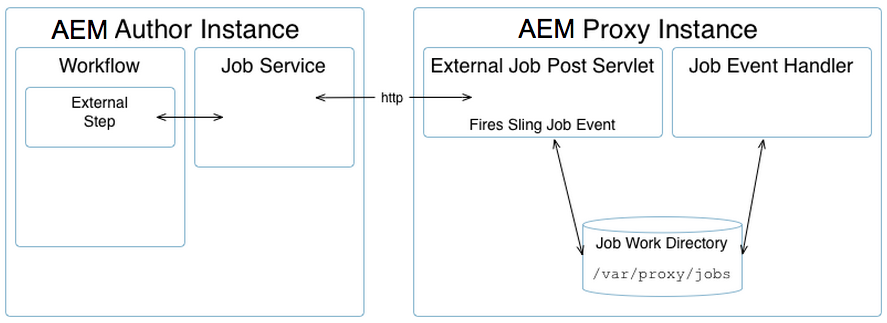

# [!DNL Assets] 프록시 개발  {#assets-proxy-development}

[!DNL Adobe Experience Manager Assets] 프록시를 사용하여 특정 작업에 대한 처리를 배포합니다.

프록시는 작업을 처리하고 결과를 만드는 처리자로 프록시 작업자를 사용하는 특정(또는 경우에 따라 분리) Experience Manager 인스턴스입니다. 프록시 워커는 다양한 작업에 사용할 수 있습니다. [!DNL Assets] 프록시의 경우 자산 내에서 렌더링하기 위해 자산을 로드하는 데 사용할 수 있습니다. 예를 들어 [IDS 프록시 작업자](indesign.md)는 [!DNL Adobe InDesign] 서버를 사용하여 자산에 사용할 파일을 처리합니다.

프록시가 별도의 [!DNL Experience Manager] 인스턴스인 경우 Experience Manager 작성 인스턴스에서의 로드를 줄이는 데 도움이 됩니다. 기본적으로 [!DNL Assets]은 동일한 JVM에서 자산 처리 작업(프록시를 통해 외부화됨)을 실행하여 Experience Manager 작성 인스턴스의 로드를 줄입니다.

## 프록시(HTTP 액세스) {#proxy-http-access}

프록시는 다음 위치에서 처리 작업을 허용하도록 구성된 경우 HTTP 서블릿을 통해 사용할 수 있습니다.`/libs/dam/cloud/proxy`. 이 서블릿은 게시된 매개 변수에서 슬링 작업을 만듭니다. 그러면 프록시 작업 큐에 추가되고 해당 프록시 워커에 연결됩니다.

### 지원되는 작업 {#supported-operations}

* `job`

   **요구 사항**:이 매개 변수는 직렬화된 값 맵으로 설정해야  `jobevent` 합니다. 작업 프로세서의 `Event`을(를) 만드는 데 사용됩니다.

   **결과**:새 작업을 추가합니다. 성공하면 고유한 작업 ID가 반환됩니다.

```shell
curl -u admin:admin -F":operation=job" -F"someproperty=xxxxxxxxxxxx"
    -F"jobevent=serialized value map" http://localhost:4502/libs/dam/cloud/proxy
```

* `result`

   **요구 사항**:매개 변수를 설정해야  `jobid` 합니다.

   **결과**:작업 프로세서에서 만든 결과 노드의 JSON 표현을 반환합니다.

```shell
curl -u admin:admin -F":operation=result" -F"jobid=xxxxxxxxxxxx"
    http://localhost:4502   /libs/dam/cloud/proxy
```

* `resource`

   **요구 사항**:매개 변수 jobid를 설정해야 합니다.

   **결과**:주어진 작업과 연관된 리소스를 반환합니다.

```shell
curl -u admin:admin -F":operation=resource" -F"jobid=xxxxxxxxxxxx"
    -F"resourcePath=something.pdf" http://localhost:4502/libs/dam/cloud/proxy
```

* `remove`

   **요구 사항**:매개 변수 jobid를 설정해야 합니다.

   **결과**:찾은 경우 작업을 제거합니다.

```shell
curl -u admin:admin -F":operation=remove" -F"jobid=xxxxxxxxxxxx"
    http://localhost:4502/libs/dam/cloud/proxy
```

### 프록시 작업자 {#proxy-worker}

프록시 워커는 작업을 처리하고 결과를 만드는 프로세서입니다. 워커는 프록시 인스턴스에 상주하며 프록시 워커로 인식되도록 [sling JobProcessor](https://sling.apache.org/site/eventing-and-jobs.html)를 구현해야 합니다.

>[!NOTE]
>
>워커는 프록시 워커로 인식하려면 [sling JobProcessor](https://sling.apache.org/site/eventing-and-jobs.html)를 구현해야 합니다.

### 클라이언트 API {#client-api}

[`JobService`](https://helpx.adobe.com/experience-manager/6-5/sites/developing/using/reference-materials/javadoc/index.html) 작업 생성, 작업 제거 및 해당 작업에서 결과를 얻는 방법을 제공하는 OSGi 서비스로 사용할 수 있습니다. 이 서비스의 기본 구현(`JobServiceImpl`)은 HTTP 클라이언트를 사용하여 원격 프록시 서블릿과 통신합니다.

다음은 API 사용의 예입니다.

```java
@Reference
 JobService proxyJobService;

 // to create a new job
 final Hashtable props = new Hashtable();
 props.put("someproperty", "some value");
 props.put(JobUtil.PROPERTY_JOB_TOPIC, "myworker/job"); // this is an identifier of the worker
 final String jobId = proxyJobService.addJob(props, new Asset[]{asset});

 // to check status (returns JobService.STATUS_FINISHED or JobService.STATUS_INPROGRESS)
 int status = proxyJobService.getStatus(jobId)

 // to get the result
 final String jsonString = proxyJobService.getResult(jobId);

 // to remove job and cleanup
 proxyJobService.removeJob(jobId);
```

### 클라우드 서비스 구성 {#cloud-service-configurations}

>[!NOTE]
>
>프록시 API에 대한 참조 설명서는 [`com.day.cq.dam.api.proxy`](https://helpx.adobe.com/experience-manager/6-5/sites/developing/using/reference-materials/javadoc/com/day/cq/dam/api/proxy/package-summary.html)에서 사용할 수 있습니다.

프록시 및 프록시 작업자 구성은 모두 [!DNL Assets] **도구** 콘솔 또는 `/etc/cloudservices/proxy`에서 액세스할 수 있는 클라우드 서비스 구성을 통해 사용할 수 있습니다. 각 프록시 작업자는 작업자별 구성 세부 정보(예: `/etc/cloudservices/proxy/workername`)에 대해 `/etc/cloudservices/proxy` 아래에 노드를 추가해야 합니다.

>[!NOTE]
>
>자세한 내용은 [InDesign Server 프록시 작업자 구성](indesign.md#configuring-the-proxy-worker-for-indesign-server) 및 [Cloud Services 구성](../sites-developing/extending-cloud-config.md)을 참조하십시오.

다음은 API 사용의 예입니다.

```java
@Reference(policy = ReferencePolicy.STATIC)
 ProxyConfig proxyConfig;

 // to get proxy config
 Configuration cloudConfig = proxyConfig.getConfiguration();
 final String value = cloudConfig.get("someProperty", "defaultValue");

 // to get worker config
 Configuration cloudConfig = proxyConfig.getConfiguration("workername");
 final String value = cloudConfig.get("someProperty", "defaultValue");
```

### 사용자 지정된 프록시 작업자 {#developing-a-customized-proxy-worker} 개발

[IDS 프록시 작업자](indesign.md)는 InDesign 자산 처리를 아웃소싱하기 위해 이미 기본 제공 중인 [!DNL Assets] 프록시 워커의 예입니다.

자신의 [!DNL Assets] 프록시 작업자를 개발 및 구성하여 [!DNL Assets] 처리 작업을 전달하고 아웃소싱할 전문 작업자를 만들 수도 있습니다.

사용자 지정 프록시 워커를 설정하려면 다음을 수행해야 합니다.

* 설정 및 구현(Sling 이벤트 사용):

   * 사용자 정의 작업 주제
   * 사용자 지정 작업 이벤트 핸들러

* 그런 다음 JobService API를 사용하여 다음을 수행합니다.

   * 사용자 지정 작업을 프록시에 전달합니다.
   * 작업 관리

* 워크플로에서 프록시를 사용하려면 WorkflowExternalProcess API 및 JobService API를 사용하여 사용자 지정 외부 단계를 구현해야 합니다.

다음 다이어그램과 단계는 진행하는 방법에 대해 자세히 설명합니다.



>[!NOTE]
>
>다음 단계에서 InDesign 상당 부분이 참조 예로 표시됩니다.

1. [Sling 작업](https://sling.apache.org/site/eventing-and-jobs.html)이 사용되므로 사용 사례에 대한 작업 항목을 정의해야 합니다.

   예를 들어 IDS 프록시 워커에 대한 `IDSJob.IDS_EXTENDSCRIPT_JOB`을(를) 참조하십시오.

1. 외부 단계는 이벤트를 트리거한 다음 완료될 때까지 기다리는 데 사용됩니다.이것은 id에서 폴링하여 수행됩니다. 새 기능을 구현하려면 자신만의 단계를 개발해야 합니다.

   `WorkflowExternalProcess`을(를) 구현한 다음 JobService API와 작업 항목을 사용하여 작업 이벤트를 준비하고 JobService(OSGi 서비스)에 전달합니다.

   예를 들면 IDS 프록시 워커에 대한 `INDDMediaExtractProcess`.java를 참조하십시오.

1. 항목에 대한 작업 핸들러를 구현합니다. 이 처리기는 특정 작업을 수행하고 작업자 구현으로 간주되도록 개발을 필요로 합니다.

   예를 들어 IDS 프록시 워커에 대한 `IDSJobProcessor.java`을(를) 참조하십시오.

1. dam-commons에서 `ProxyUtil.java`을 사용합니다. 이렇게 하면 dam 프록시를 사용하여 작업자에게 작업을 전달할 수 있습니다.

>[!NOTE]
>
>[!DNL Assets] 프록시 프레임워크에서 기본적으로 제공하지 않는 것은 풀 메커니즘입니다.
>
>[!DNL InDesign] 통합을 통해 [!DNL InDesign] 서버(IDSPool)의 풀에 액세스할 수 있습니다. 이 풀링은 [!DNL Assets] 프록시 프레임워크의 일부가 아닌 [!DNL InDesign] 통합 전용입니다.

>[!NOTE]
>
>결과 동기화:
>
>동일한 프록시를 사용하는 인스턴스가 없으면 처리 결과는 프록시에 유지됩니다. 작업 생성 시 클라이언트에 주어진 동일한 고유 작업 ID를 사용하여 결과를 요청하는 것은 클라이언트(Experience Manager 작성자)의 작업입니다. 프록시는 작업을 완료하고 결과를 요청할 준비가 되도록 유지합니다.
