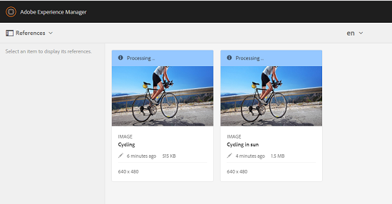

# 관련 에셋 {#related-assets}

[!DNL Adobe Experience Manager Assets]을(를) 사용하면 관련 에셋 기능을 사용하여 조직의 필요에 따라 에셋을 수동으로 연결할 수 있습니다. 예를 들어 유사한 주제에 대한 에셋 또는 이미지/비디오와 라이선스 파일을 연결할 수 있습니다. 특정 공통 속성을 공유하는 에셋의 관계를 설정할 수 있습니다. 이 기능을 사용하여 에셋 간의 소스/파생 관계를 만들 수도 있습니다. 예를 들어 INDD 파일에서 생성된 PDF 파일이 있는 경우 PDF 파일을 해당 소스 INDD 파일과 연결할 수 있습니다.

이 기능을 사용하면 저해상도 PDF 파일 또는 JPG 파일을 공급업체 또는 에이전시와 공유할 수 있으며 고해상도 INDD 파일을 요청 시에만 사용할 수 있도록 하는 유연성이 있습니다.

>[!NOTE]
>
>에셋에 대한 편집 권한이 있는 사용자만 에셋을 연결 및 연결 해제할 수 있습니다.

## 에셋 관계 설정 {#relating-assets}

1. [!DNL Experience Manager] 인터페이스에서 연결할 자산의 **[!UICONTROL 속성]** 페이지를 엽니다.

   

   *그림: [!DNL Assets] 자산을 연결할 [!UICONTROL 속성] 페이지.*

   또는 목록 보기에서 에셋을 선택합니다.

   

   컬렉션에서 에셋을 선택할 수도 있습니다.

   

1. 다른 에셋을 선택한 에셋과 연결하려면 도구 모음에서 **[!UICONTROL 관련]** 을 클릭합니다.
1. 다음 중 하나를 수행하십시오.

   * 에셋의 원본 파일을 연결하려면 목록에서 **[!UICONTROL Source]**&#x200B;을(를) 선택하십시오.
   * 파생 파일을 연결하려면 목록에서 **[!UICONTROL 파생]**&#x200B;을(를) 선택하십시오.
   * 자산 간에 양방향 관계를 만들려면 목록에서 **[!UICONTROL 기타]**&#x200B;를 선택하십시오.

1. **[!UICONTROL 자산 선택]** 화면에서 연결할 자산의 위치로 이동하여 선택합니다.

   

1. **[!UICONTROL 확인]**&#x200B;을 클릭합니다.
1. 대화 상자를 닫으려면 **[!UICONTROL 확인]**&#x200B;을 클릭하세요. 3단계에서 선택한 관계에 따라 관련 에셋이 **[!UICONTROL 관련]** 섹션의 적절한 범주 아래에 나열됩니다. 예를 들어 관련된 에셋이 현재 에셋의 원본 파일인 경우 **[!UICONTROL Source]** 아래에 나열됩니다.

   

1. 에셋의 관계를 해제하려면 도구 모음에서 **[!UICONTROL 관계 해제]** 를 클릭하십시오.

1. **[!UICONTROL 관계 제거]** 대화 상자에서 관계를 끊을 자산을 선택하고 **[!UICONTROL 관계 해제]**&#x200B;을 클릭합니다.

   

1. 대화 상자를 닫으려면 **[!UICONTROL 확인]**&#x200B;을 클릭하세요. 관계를 제거한 자산은 **[!UICONTROL 관련]** 섹션 아래의 관련 자산 목록에서 삭제됩니다.

## 관련 에셋 번역 {#translating-related-assets}

관련 에셋 기능을 사용하여 에셋 간의 소스/파생 관계를 만드는 것도 번역 워크플로에서 유용합니다. 파생된 에셋에서 번역 워크플로우를 실행하면 [!DNL Experience Manager Assets]에서 원본 파일이 참조하는 모든 에셋을 자동으로 가져와서 번역을 위해 포함합니다. 이렇게 하면 소스 에셋에서 참조하는 에셋이 소스 및 파생된 에셋과 함께 번역됩니다. 예를 들어 영어 사본에 표시된 대로 파생된 에셋과 소스 파일이 포함된 시나리오를 생각해 보십시오.

원본 파일이 다른 에셋과 관련된 경우 [!DNL Experience Manager Assets]은(는) 참조된 에셋을 가져와서 번역을 위해 포함시킵니다.

*그림: 번역에 포함할 관련 자산의 Source 자산*

1. [번역 프로젝트 만들기](translation-projects.md#create-a-new-translation-project)의 단계에 따라 소스 폴더의 자산을 대상 언어로 번역합니다. 예를 들어 이 경우 에셋을 프랑스어로 번역합니다.

1. [!UICONTROL 프로젝트] 페이지에서 번역 폴더를 엽니다.

1. 프로젝트 타일을 클릭하여 세부 정보 페이지를 엽니다.

   

1. 번역 상태를 보려면 번역 작업 카드 아래의 생략 부호를 클릭합니다.

   

1. 에셋을 선택한 다음 도구 모음에서 **[!UICONTROL Assets에 표시]**&#x200B;를 클릭하여 에셋의 번역 상태를 확인합니다.

   

1. 소스와 관련된 에셋이 번역되었는지 확인하려면 소스 에셋을 클릭합니다.

1. 소스와 관련된 에셋을 선택한 다음 **[!UICONTROL Assets에 표시]**&#x200B;를 클릭합니다. 번역된 관련 에셋이 표시됩니다.
