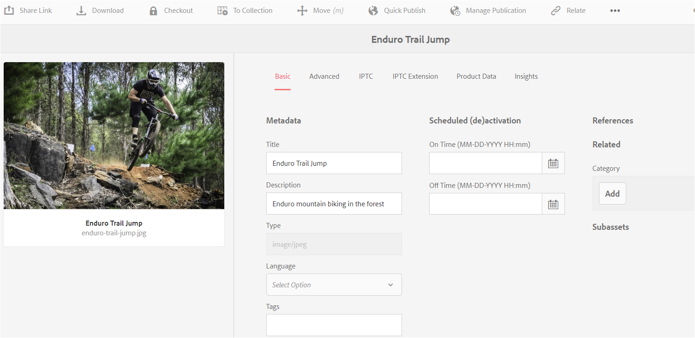
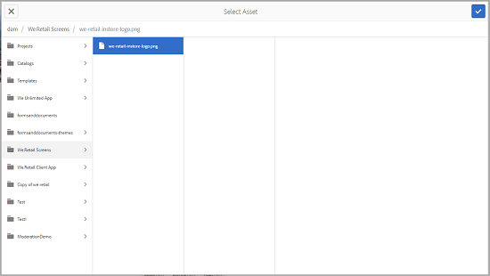
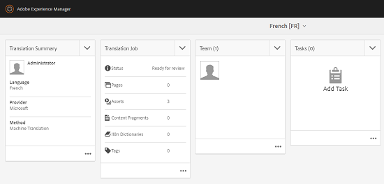

# 관련 자산 {#related-assets}

[!DNL Adobe Experience Manager Assets] 관련 자산 기능을 사용하여 조직의 요구 사항에 따라 자산을 수동으로 연결할 수 있습니다. 예를 들어 라이센스 파일을 유사한 항목에 대한 에셋 또는 이미지/비디오와 연결할 수 있습니다. 특정 공통 속성을 공유하는 자산과 연결할 수 있습니다. 이 기능을 사용하여 자산 간의 소스/파생 관계를 만들 수도 있습니다. 예를 들어 INDD 파일에서 생성된 PDF 파일이 있는 경우 PDF 파일을 소스 INDD 파일에 연결할 수 있습니다.

이 기능을 사용하면 벤더 또는 에이전시와 저해상도 PDF 파일 또는 JPG 파일을 공유하고 요청 시 고해상도 INDD 파일을 사용할 수 있도록 할 수 있습니다.

>[!NOTE]
>
>자산에 대한 편집 권한이 있는 사용자만 자산을 관련시키거나 관계를 해제할 수 있습니다.

## 자산 관계 {#relating-assets}

1. [!DNL Experience Manager] 인터페이스에서 연결하려는 자산의 **[!UICONTROL 속성]** 페이지를 엽니다.

   

   *그림: [!DNL Assets] [!UICONTROL 자산] 을 연결할 속성 페이지입니다.*

   또는 목록 보기에서 자산을 선택합니다.

   

   컬렉션에서 자산을 선택할 수도 있습니다.

   

1. 다른 자산을 선택한 자산과 연결하려면 도구 모음에서 **[!UICONTROL 연결]** 연결을 클릭합니다.
1. 다음 중 하나를 수행하십시오.

   * 에셋의 소스 파일을 연결하려면 목록에서 **[!UICONTROL 소스]**&#x200B;를 선택합니다.
   * 파생된 파일을 연결하려면 목록에서 **[!UICONTROL 파생]**&#x200B;을 선택합니다.
   * 자산 간의 양방향 관계를 만들려면 목록에서 **[!UICONTROL 기타]**&#x200B;를 선택합니다.

1. **[!UICONTROL 자산 선택]** 화면에서 연결하려는 자산의 위치로 이동하여 선택합니다.

   

1. **[!UICONTROL 확인]**&#x200B;을 클릭합니다.
1. **[!UICONTROL 확인]**&#x200B;을 클릭하여 대화 상자를 닫습니다. 3단계에서 선택한 관계에 따라 관련 자산이 **[!UICONTROL 관련]** 섹션의 해당 카테고리 아래에 나열됩니다. 예를 들어, 관련된 자산이 현재 자산의 소스 파일인 경우 **[!UICONTROL 소스]** 아래에 나열됩니다.

   

1. 자산 관계를 해제하려면 도구 모음에서 **[!UICONTROL 관계 해제]** 를 클릭합니다.

1. **[!UICONTROL 관계 제거]** 대화 상자에서 관계를 해제할 자산을 선택하고 **[!UICONTROL 관계 해제]**&#x200B;를 클릭합니다.

   

1. **[!UICONTROL 확인]**&#x200B;을 클릭하여 대화 상자를 닫습니다. 관계를 제거한 자산은 **[!UICONTROL 관련]** 섹션 아래의 관련 자산 목록에서 삭제됩니다.

## 관련 자산 번역 {#translating-related-assets}

관련 자산 기능을 사용하여 자산 간 소스/파생 관계를 만드는 것은 번역 워크플로우에서 유용합니다. 파생된 자산에서 번역 작업 과정을 실행하면 [!DNL Experience Manager Assets]은 소스 파일이 참조하는 모든 에셋을 자동으로 가져와서 번역용으로 포함합니다. 이렇게 하면 소스 자산에서 참조하는 자산이 소스 및 파생 자산과 함께 변환됩니다. 예를 들어 영어 사본에 파생된 에셋과 소스 파일이 표시된 대로 포함되어 있는 시나리오를 생각해 보십시오.

소스 파일이 다른 에셋과 관련된 경우 [!DNL Experience Manager Assets]은 참조된 에셋을 가져오고 번역용으로 포함합니다.

*그림:번역용으로 포함할 관련 자산의 소스 자산입니다.*

1. [새 번역 프로젝트 만들기](translation-projects.md#create-a-new-translation-project)의 단계에 따라 소스 폴더의 에셋을 대상 언어로 변환합니다. 예를 들어 이 경우 자산을 프랑스어로 번역합니다.

1. [!UICONTROL 프로젝트] 페이지에서 번역 폴더를 엽니다.

1. 프로젝트 타일을 클릭하여 세부 사항 페이지를 엽니다.

   

1. 번역 상태를 보려면 번역 작업 카드 아래의 줄임표를 클릭합니다.

   

1. 자산을 선택한 다음 도구 모음에서 **[!UICONTROL 자산]**&#x200B;에 표시를 클릭하여 자산의 번역 상태를 봅니다.

   

1. 소스와 관련된 자산이 번역되었는지 확인하려면 소스 자산을 클릭합니다.

1. 소스와 관련된 자산을 선택한 다음 **[!UICONTROL 자산에 표시]**&#x200B;를 클릭합니다. 번역된 관련 자산이 표시됩니다.
