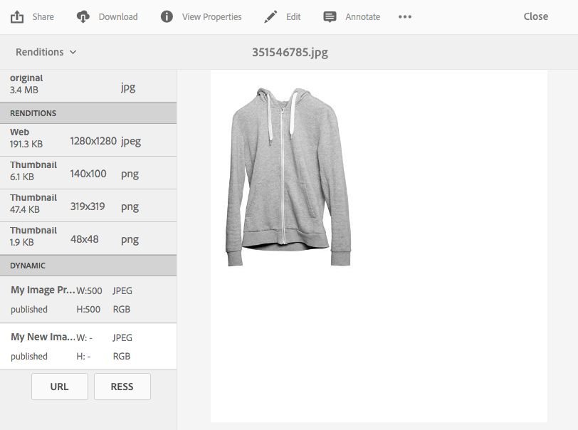

# 응답형 사이트용으로 최적화된 이미지 제공 {#delivering-optimized-images-for-a-responsive-site}

웹 개발자와 응답형 서비스를 위한 코드를 공유하려면 응답형 코드 기능을 사용하십시오. 응답형(**[!UICONTROL RESS]**) 코드를 클립보드에 복사하여 웹 개발자와 공유할 수 있습니다.

웹 사이트가 타사 WCM에 있는 경우 이 기능을 사용하는 것이 적절합니다. 그러나 웹 사이트가 대신 Adobe Experience Manager에 있는 경우 오프사이트 이미지 서버가 이미지를 렌더링하여 웹 페이지에 제공합니다.

또한 [웹 페이지에 비디오 뷰어 포함](embed-code.md)을 참조하십시오.

또한 [웹 응용 프로그램에 URL 연결](linking-urls-to-yourwebapplication.md)을 참조하십시오.

**응답형 사이트용으로 최적화된 이미지를 전달하려면:**

1. 응답형 코드를 제공할 이미지로 이동하여 드롭다운 메뉴에서 **[!UICONTROL 표현물]**&#x200B;을 선택합니다.

   

1. 응답형 이미지 사전 설정을 선택합니다. **[!UICONTROL URL]** 및 **[!UICONTROL RESS]** 단추가 나타납니다.

   

   >[!NOTE]
   >
   >선택한 자산 **[!UICONTROL URL]** 또는 **[!UICONTROL RESS]** 단추를 사용할 수 있도록 선택한 이미지 사전 설정 또는 뷰어 사전 설정을 게시해야 합니다.**
   >
   >Dynamic Media - 하이브리드 모드를 사용하려면 이미지 사전 설정을 게시해야 합니다. Dynamic Media - Scene7 모드는 이미지 사전 설정을 자동으로 게시합니다.

1. **[!UICONTROL RESS]**&#x200B;을 선택합니다.

   

1. **[!UICONTROL 응답형 이미지 포함]** 대화 상자에서 응답형 코드 텍스트를 선택하고 복사하여 웹 사이트에 붙여넣어 응답형 자산에 액세스합니다.
1. 코드에서 직접 응답형 웹 사이트의 중단점과 일치하도록 포함 코드의 기본 중단점을 편집합니다. 또한 다른 페이지 중단점에서 제공되는 다양한 이미지 해상도를 테스트합니다.

## HTTP/2를 사용하여 Dynamic Media 자산을 제공합니다 {#using-http-to-delivery-your-dynamic-media-assets}

HTTP/2는 브라우저 및 서버의 통신 방식을 향상시키는 업데이트된 새로운 웹 프로토콜입니다. 보다 신속하게 정보를 전송할 수 있고 필요한 처리 능력을 줄일 수 있습니다. Dynamic Media 자산의 배달은 HTTP/2를 사용하여 지원되며, 이 경우 더 나은 응답 및 로드 시간이 제공됩니다.

Dynamic Media 계정에서 HTTP/2를 사용하는 시작에 대한 자세한 내용은 [HTTP2 컨텐츠 전달](http2.md)을 참조하십시오.
