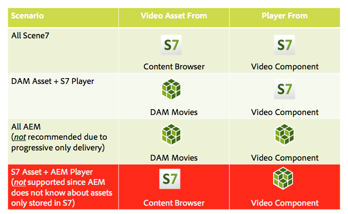

# 비디오 {#video}

자산은 Dynamic Media Classic으로 자동 인코딩을 위해 자산으로 비디오를 직접 업로드하고, 페이지 작성을 위해 자산에서 직접 Dynamic Media Classic 비디오에 액세스할 수 있는 중앙 집중식 비디오 자산 관리를 제공합니다.

Dynamic Media Classic 비디오 통합은 모든 화면으로 최적화된 비디오의 범위를 확장합니다(자동 장치 및 대역폭 검색).

* **[!UICONTROL Scene7 Video]** 구성 요소는 장치 및 대역폭 검색을 자동으로 수행하여 데스크톱, 태블릿 및 모바일에서 올바른 형식 및 올바른 품질의 비디오를 재생합니다.
* 자산 - 단일 비디오 자산만이 아닌 응용 비디오 세트를 포함할 수 있습니다. 응용 비디오 세트는 여러 화면에서 비디오를 원활하게 재생하는 데 필요한 모든 비디오 표현물을 위한 컨테이너입니다. 응용 비디오 세트는 다른 비트율 및 형식(예: 400kbps, 800kbps 및 1000kbps)으로 인코딩된 동일한 비디오 버전을 그룹화합니다. 데스크톱, iOS, Android, Blackberry 및 Windows 모바일 장치를 포함하는 여러 화면에서 응용 비디오 스트리밍을 위해 S7 비디오 구성 요소와 함께 응용 비디오 세트를 사용합니다.

## FFMPEG 및 Dynamic Media Classic 정보 {#about-ffmpeg-and-scene}

기본 비디오 인코딩 프로세스는 FFMPEG 기반의 비디오 프로필 통합 사용을 기준으로 합니다. 따라서 즉시 사용 가능한 DAM 통합 워크플로우에는 다음과 같은 2가지 ffmpeg 기반 워크플로우 단계가 포함됩니다.

* FFMPEG 썸네일
* FFMPEG 인코딩

Dynamic Media Classic 통합을 활성화하고 구성해도 곧바로 사용할 수 있는 DAM 통합 워크플로우에서 이러한 두 워크플로우 단계가 자동으로 제거되거나 비활성화되지는 않습니다. AEM에서 이미 FFMPEG 기반 비디오 인코딩을 사용하고 있다면 작성 환경에 FFMPEG가 설치되어 있을 수 있습니다. 이 경우 DAM을 사용하여 인제스트한 새 비디오는 다음 두 번 인코딩됩니다.FFMPEG 인코더에서 한 번, Dynamic Media Classic 통합에서 한 번 제공됩니다.

AEM에서 FFMPEG 기반 비디오 인코딩이 구성되고 FFMPEG가 설치되어 있는 경우 DAM 통합 워크플로우에서 2개의 FFMPEG 워크플로우를 제거하는 것이 좋습니다.

## 지원되는 형식 {#supported-formats}

Scene7 비디오 구성 요소에 대해 다음 형식이 지원됩니다.

* F4V H.264
* MP4 H.264

## 비디오를 업로드할 위치 결정 {#deciding-where-to-upload-your-video}

비디오 자산 업로드 위치를 결정할 때는 다음을 고려합니다.

* 비디오 자산에 대한 워크플로우가 필요합니까?
* 비디오 자산에 대한 버전 제어가 필요합니까?

이러한 질문에 대한 답변이 하나 또는 둘 다 &quot;예&quot;인 경우, 비디오를 Adobe DAM에 바로 업로드하십시오. 두 질문에 대한 답변이 모두 &quot;아니요&quot;이면 비디오를 Dynamic Media Classic에 직접 업로드하십시오. 각 시나리오에 대한 워크플로우는 다음 섹션에 설명되어 있습니다.

### 비디오를 Adobe DAM {#if-you-are-uploading-your-video-directly-to-adobe-dam}에 직접 업로드하는 경우

자산에 대한 워크플로우 또는 버전 관리가 필요한 경우 먼저 Adobe DAM에 업로드해야 합니다. 다음은 권장되는 워크플로우입니다.

1. 비디오 에셋을 Adobe DAM에 업로드하고 자동으로 인코딩하여 Dynamic Media Classic에 게시할 수 있습니다.
1. AEM에서 컨텐츠 파인더의 **[!UICONTROL 동영상]** 탭에서 WCM의 비디오 자산에 액세스합니다.
1. **[!UICONTROL Scene7 Video]** 또는 **[!UICONTROL 기본 비디오]** 구성 요소로 작성합니다.

### Dynamic Media Classic에 비디오를 업로드하는 경우 {#if-you-are-uploading-your-video-to-scene}

자산에 대해 워크플로우 또는 버전 관리가 필요하지 않은 경우 자산을 Scene7으로 업로드해야 합니다. 다음은 권장되는 워크플로우입니다.

1. Dynamic Media Classic에서 [Scene7에 대한 예약된 FTP 업로드 및 인코딩(시스템 자동화)](https://experienceleague.adobe.com/docs/dynamic-media-classic/using/upload-publish/uploading-files.html#upload-files-using-via-ftp)을 설정합니다.
1. AEM에서 컨텐츠 파인더의 **[!UICONTROL Scene7]** 탭에서 WCM의 비디오 자산에 액세스합니다.
1. **[!UICONTROL Scene7 Video]** 구성 요소로 작성합니다.

## Scene7 비디오에 대한 통합 구성 {#configuring-integration-with-scene-video}

범용 사전 설정을 구성하려면:

1. **[!UICONTROL Cloud Services]**&#x200B;에서 **[!UICONTROL Scene7]** 구성으로 이동한 후 **[!UICONTROL 편집을 클릭합니다.]**
1. **[!UICONTROL 비디오]** 탭을 선택합니다.

   

   >[!NOTE]
   >
   >페이지에 클라우드 구성이 없는 경우 **[!UICONTROL 비디오]** 탭이 표시되지 않습니다.

1. 응용 비디오 인코딩 프로필, 곧바로 사용 가능한 단일 비디오 인코딩 프로필 또는 사용자 지정 비디오 인코딩 프로필을 선택합니다.

   >[!NOTE]
   >
   >비디오 사전 설정의 의미에 대한 자세한 내용은 [Dynamic Media Classic 설명서](https://experienceleague.adobe.com/docs/dynamic-media-classic/using/setup/application-setup.html#video-presets-for-encoding-video-files)를 참조하십시오.
   >
   >범용 사전 설정을 구성할 때 응용 비디오 설정을 선택하거나 **[!UICONTROL 응용 비디오 인코딩]** 옵션을 선택하는 것이 좋습니다.

1. 선택한 인코딩 프로필을 이 Scene7 클라우드 구성에 대해 설정한 CQ DAM 대상 폴더에 업로드된 모든 비디오에 자동으로 적용됩니다. 필요에 따라 서로 다른 대상 폴더가 있는 여러 Scene7 클라우드 구성을 설정하여 다른 인코딩 프로필을 적용할 수 있습니다.

## 뷰어 및 인코딩 사전 설정 업데이트 {#updating-viewer-and-encoding-presets}

Scene7에서 사전 설정이 업데이트되었기 때문에 AEM에서 비디오에 대한 뷰어 및 인코딩 사전 설정을 업데이트해야 하는 경우 클라우드 구성에서 Scene7 구성으로 이동한 다음 **[!UICONTROL 뷰어 및 인코딩 사전 설정 업데이트를 클릭합니다.]**

## Adobe DAM {#uploading-your-master-video}에서 Scene7에 기본 소스 비디오 업로드

1. Scene7 인코딩 프로필을 사용하여 클라우드 구성을 설정한 CQ DAM 대상 폴더로 이동합니다.
1. **[!UICONTROL 업로드]**&#x200B;를 클릭하여 기본 소스 비디오를 업로드합니다. 비디오 업로드 및 인코딩은 [!UICONTROL DAM 자산 업데이트] 워크플로우가 완료되고 **[!UICONTROL Scene7에 게시]**&#x200B;에 확인 표시가 있으면 완료됩니다.

   >[!NOTE]
   >
   >비디오 썸네일을 생성하는 데 시간이 다소 걸릴 수 있습니다.

   DAM 기본 소스 비디오를 비디오 구성 요소로 드래그하면 전달을 위해 Scene7 인코딩 프록시 표현물의 *모든*&#x200B;에 액세스합니다.

## 기본 비디오 구성 요소 및 Scene7 비디오 구성 요소 {#foundation-video-component-versus-scene-video-component}

AEM을 사용하는 경우, 사이트에서 사용할 수 있는 비디오 구성 요소와 Scene7 비디오 구성 요소 둘 다에 액세스할 수 있습니다. 이러한 구성 요소는 서로 바꿔서 사용할 수 없습니다.

Scene7 비디오 구성 요소는 Scene7 비디오에만 작동합니다. 기본 구성 요소는 AEM(ffmpeg 사용)에서 저장된 비디오와 Scene7 비디오에 작동합니다.

다음 매트릭스에서는 어떤 구성 요소를 언제 사용해야 할지를 설명합니다.

>[!NOTE]
>
>곧바로 사용할 수 있는 S7 비디오 구성 요소는 범용 비디오 프로필을 사용합니다. 그러나 Scene7에서 다음 중 하나를 수행하여 AEM에서 사용할 HTML5 기반 비디오 플레이어를 얻을 수 있습니다.즉시 사용 가능한 HTML5 비디오 플레이어의 임베드 코드를 복사하여 AEM 페이지에 넣습니다.

## AEM 비디오 구성 요소 {#aem-video-component}

Scene7 비디오를 볼 때는 Scene7 비디오 구성 요소를 사용하도록 권장되지만, 이 섹션에서는 완벽을 기하기 위해 AEM의 기본 비디오 구성 요소와 함께 Scene7 비디오를 사용하는 방법을 설명합니다.

### AEM 비디오 및 Scene7 비디오 비교  {#aem-video-and-scene-video-comparison}

다음 표에서는 AEM 기본 비디오 구성 요소와 Scene7 비디오 구성 요소의 지원되는 기능을 개괄적으로 비교해서 설명합니다.

|  | AEM 기본 비디오 | Scene7 비디오 |
|---|---|---|
| 접근 방법 | HTML5 우선 접근 방법. Flash는 HTML5 이외의 폴백에만 사용됩니다. | 대부분의 데스크톱에 포함된 Flash. HTML5는 모바일 및 태블릿에 사용됩니다. |
| 배달 | 점진적 | 적응형 스트리밍 |
| 추적 | 예 | 예 |
| 확장성 | 예 | 아니오 |
| 모바일 비디오 | 예 | 예 |

### 설정  {#setting-up}

#### 비디오 프로필 만들기 {#creating-video-profiles}

S7 클라우드 구성에서 선택한 S7 인코딩 사전 설정에 따라 다양한 비디오 인코딩이 생성됩니다. 기본 비디오 구성 요소에서 이러한 인코딩을 사용하려면 선택한 각 S7 인코딩에 대해 비디오 프로필을 만들어야 합니다. 이렇게 하면 비디오 구성 요소가 DAM 표현물을 적절히 선택할 수 있습니다.

>[!NOTE]
>
>새 비디오 프로필 및 해당 변경 사항을 게시하려면 활성화해야 합니다.

1. AEM에서 **[!UICONTROL 도구] > [!UICONTROL 구성 콘솔]**&#x200B;을 탭합니다.
1. **[!UICONTROL 구성 콘솔]**&#x200B;에서 탐색 트리의 **[!UICONTROL 도구 > DAM > 비디오 프로필]**&#x200B;으로 이동합니다.
1. 새 S7 비디오 프로필을 만듭니다. **[!UICONTROL 새로 만들기...]** 메뉴에서 **[!UICONTROL 페이지 만들기]**&#x200B;를 선택한 다음 Scene7 비디오 프로필 템플릿을 선택합니다. 새 비디오 프로필 페이지에 이름을 지정하고 **[!UICONTROL 만들기]**&#x200B;를 클릭합니다.

   

1. 새 비디오 프로필을 편집합니다. 먼저 클라우드 구성을 선택합니다. 그런 다음 클라우드 구성에서 선택한 것과 동일한 인코딩 사전 설정을 선택합니다.

   

   | 속성 | 설명 |
   |---|---|
   | Scene7 클라우드 구성 | 인코딩 사전 설정에 사용할 클라우드 구성 |
   | Scene7 인코딩 사전 설정 | 이 비디오 프로필을 매핑할 인코딩 사전 설정입니다. |
   | HTML5 비디오 유형 | 이 속성을 사용하면 HTML5 비디오 소스 요소의 유형 속성 값을 설정할 수 있습니다. 이 정보는 S7 인코딩 사전 설정에서 제공되지 않지만 HTML5 비디오 요소를 사용하여 비디오를 적절히 렌더링하는 데 필요합니다. 공통 형식의 목록이 제공되지만 다른 형식으로 덮어쓸 수 있습니다. |

   비디오 구성 요소에서 사용하기 위해 클라우드 구성에서 선택한 모든 인코딩 사전 설정에 대해 이 단계를 반복하십시오.

#### 디자인 {#configuring-design} 구성

**[!UICONTROL 기본 비디오]** 구성 요소는 비디오 소스 목록을 작성하기 위해 사용할 비디오 프로필에 대해 알아야 합니다. 비디오 구성 요소 디자인 대화 상자를 열고 새 비디오 프로필을 사용하기 위한 구성 요소 디자인을 구성해야 합니다.

>[!NOTE]
>
>모바일 페이지에서 **[!UICONTROL 기본 비디오]** 구성 요소를 사용하는 경우 모바일 페이지의 디자인에서 이러한 단계를 반복해야 할 수 있습니다.

>[!NOTE]
>
>디자인 변경 사항이 게시에 적용되려면 디자인을 활성화해야 합니다.

1. **[!UICONTROL 기본 비디오]** 구성 요소의 디자인 대화 상자를 열고 **[!UICONTROL 프로필]** 탭으로 변경합니다. 그런 다음 곧바로 사용할 수 있는 프로필을 삭제하고 새로운 S7 비디오 프로필을 추가합니다. 디자인 대화 상자의 프로파일 목록 순서는 렌더링 시 비디오 소스 요소의 순서를 정의합니다.
1. HTML5를 지원하지 않는 브라우저의 경우 비디오 구성 요소를 사용하여 Flash 폴백을 구성할 수 있습니다. 비디오 구성 요소 디자인 대화 상자를 열고 **[!UICONTROL Flash]** 탭으로 변경합니다. Flash 플레이어 설정을 구성하고 Flash Player에 대한 폴백 프로필을 지정합니다.

#### 확인 목록 {#checklist}

1. S7 클라우드 구성을 만듭니다. 비디오 인코딩 사전 설정이 지정되어 있고 Importer가 실행 중인지 확인합니다.
1. 클라우드 구성에서 선택한 각 비디오 인코딩 사전 설정에 대해 S7 비디오 프로필을 만듭니다.
1. 비디오 프로필을 활성화해야 합니다.
1. 페이지에서 **[!UICONTROL 기본 비디오]** 구성 요소의 디자인을 구성합니다.
1. 디자인 변경을 수행한 후 디자인을 활성화합니다.

