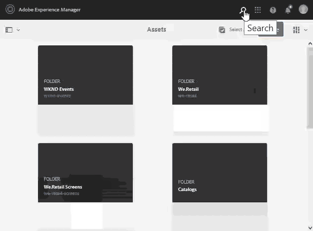

# [!DNL Adobe Experience Manager] {#search-assets-in-aem}의 자산 검색

[!DNL Adobe Experience Manager Assets] 콘텐츠 제작 시간을 단축할 수 있는 강력한 에셋 검색 방법을 제공합니다. 팀은 즉시 사용 가능한 기능과 맞춤형 방법을 사용하여 매끄럽고 지능적인 검색 경험을 제공함으로써 출시 시간을 단축할 수 있습니다. 자산 검색은 크리에이티브한 사람들이 더 많이 사용할 수 있도록 하거나, 비즈니스 사용자와 마케터가 자산을 안전하게 관리하거나, DAM 관리자가 관리하는 데 중요한 역할을 하는 디지털 자산 관리 시스템의 용도로만 사용할 수 있습니다. [!DNL Assets] 사용자 인터페이스 또는 기타 앱 및 표면을 통해 수행할 수 있는 단순, 고급 및 사용자 정의 검색은 이러한 사용 사례를 수행하는 데 도움이 됩니다.

[!DNL Experience Manager Assets] 에서는 다음 사용 사례를 지원하며 이 문서에서는 이러한 사용 사례에 대한 사용, 개념, 구성, 제한 사항 및 문제 해결에 대해 설명합니다.

| 자산 검색 | 구성 및 관리 | 검색 결과를 사용한 작업 |
|---|---|---|
| [기본 검색](#searchbasics) | [검색 색인](#searchindex) | [결과 정렬](#sort) |
| [검색 UI 이해](#searchui) | [시각적 또는 유사성 검색](#configvisualsearch) | [자산의 속성 및 메타데이터 확인](#checkinfo) |
| [검색 제안](#searchsuggestions) | [필수 메타데이터](#mandatorymetadata) | [다운로드](#download) |
| [검색 결과 및 행동 이해](#searchbehavior) | [검색 패싯 수정](#searchfacets) | [일괄 메타데이터 업데이트](#metadataupdates) |
| [검색 순위 및 향상](#searchrank) | [텍스트 추출](#extracttextupload) | [스마트 컬렉션](#collections) |
| [고급 검색:검색 필터링 및 범위](#scope) | [사용자 정의 설명](#custompredicates) | [예상치 못한 결과 이해 및 문제 해결](#unexpectedresults) |
| [다른 솔루션 및 앱에서 검색](#beyondomnisearch):<ul><li>[Adobe Asset Link](#aal)</li><li>[Brand Portal](#brandportal)</li><li>[Experience Manager 데스크탑 앱](#desktopapp)</li><li>[Adobe Stock 이미지](#adobestock)</li><li>[다이내믹 미디어 자산](#dynamicmedia)</li></ul> |  |  |
| [자산 선택기](#assetpicker) |  |  |
| [제한 ](#limitations) 사항 및  [팁](#tips) |  |  |
| [일러스트레이션 예제](#samples) |  |  |

[!DNL Experience Manager] 웹 인터페이스 상단에 있는 Omnisearch 필드를 사용하여 자산을 검색합니다. ]**자산**[!UICONTROL  > ]**파일**[!UICONTROL &#x200B;로 이동하고 맨 위 막대에서 [!DNL Experience Manager]search_icon을 선택합니다. `Return` 또는 키워드 단축키 `/`(슬래시)를 사용하여 Omnisearch 필드를 엽니다. `Location:Assets` 는 검색을 DAM 자산으로 제한하도록 미리 선택되어 있습니다. [!DNL Experience Manager] 검색 키워드를 입력하기 시작할 때 제안을 제공합니다.

**[!UICONTROL 필터]** 패널을 사용하여 자산, 폴더, 태그 및 메타데이터를 검색합니다. 파일 유형, 파일 크기, 마지막 수정 날짜, 자산 상태, 인사이트 데이터, Adobe Stock 라이선스와 같은 다양한 옵션(예측 가능)을 기반으로 검색 결과를 필터링할 수 있습니다. 필터 패널을 사용자 정의하고 [검색 패싯](/help/assets/search-facets.md)을 사용하여 검색 예측자를 추가 또는 제거할 수 있습니다. [!UICONTROL 필터] 패널의 [!UICONTROL 파일 유형] 필터에는 혼합 상태 확인란이 있습니다. 따라서 중첩된 설명(또는 형식)을 모두 선택하지 않으면 첫 번째 수준 확인란은 부분적으로 선택되어 있습니다.

[!DNL Experience Manager] 검색 기능은 컬렉션 검색 및 컬렉션 내 자산 검색을 지원합니다. [검색 컬렉션](/help/assets/manage-collections.md)을 참조하십시오.

## 검색 인터페이스 {#searchui} 이해

검색 인터페이스와 사용 가능한 작업에 대해 숙지하십시오.

*그림:검색  [!DNL Experience Manager Assets] 결과 인터페이스를 파악합니다.*

**A.** 검색을 스마트 컬렉션으로 저장합니다. **B.** 검색 결과의 범위를 좁히도록 필터 또는 예측합니다. **C.** 파일, 폴더 또는 둘 다를 표시합니다. **D.** 필터를 클릭하여 왼쪽 레일을 열거나 닫습니다. **e.** 검색 위치는 DAM입니다. **사용자가 제공한** 검색 키워드가 포함된 F.Omnisearch 필드 **G.** 로드된 검색 결과를 선택합니다. **H.** 총 검색 결과 중 표시되는 검색 결과의 수입니다. **검색을** 닫습니다. **J.** 카드 보기와 목록 보기 간에 전환합니다.

### 동적 검색 패싯 {#dynamicfacets}

검색 패싯에서 동적으로 업데이트되는 예상 검색 결과 수를 사용하여 검색 결과 페이지에서 원하는 자산을 더 빠르게 찾을 수 있습니다. 예상 자산 수는 검색 필터를 적용하기 전에도 업데이트됩니다. 필터에 대한 예상 카운트를 보면 검색 결과를 빠르고 효율적으로 탐색할 수 있습니다.

*그림:검색 패싯에서 검색 결과를 필터링하지 않고 대략적인 자산 수를 참조하십시오.*

## 검색 결과 및 동작 이해 {#searchbehavior}

### 기본 검색어 및 결과 {#searchbasics}

OmniSearch 필드에서 키워드 검색을 실행할 수 있습니다. 키워드 검색은 대소문자를 구분하지 않으며 널리 사용되는 메타데이터 필드에서 전체 텍스트 검색입니다. 둘 이상의 키워드를 사용하는 경우 키워드 간의 기본 연산자는 `AND`입니다.

결과는 가장 가까운 일치부터 관련성별로 정렬됩니다. 여러 키워드의 경우 메타데이터에 두 용어가 모두 포함된 자산이 관련성이 더 높습니다. 메타데이터 내에서 스마트 태그로 나타나는 키워드는 다른 메타데이터 필드에 나타나는 키워드보다 등급이 높습니다. [!DNL Experience Manager] 특정 검색어를 보다 큰 가중치로 지정할 수 있습니다. 또한 [특정 검색어에 대한 몇 개의 타깃팅된 자산의 등급](#searchrank)을 늘릴 수도 있습니다.

관련 자산을 신속하게 찾기 위해 리치 인터페이스를 통해 필터링, 정렬 및 선택 메커니즘을 제공합니다. 여러 기준을 기반으로 결과를 필터링하고 다양한 필터에 대해 검색된 자산의 수를 확인할 수 있습니다. 또는 Omnisearch 필드에서 질의를 변경하여 검색을 다시 실행할 수 있습니다. 검색어 또는 필터를 변경하면 다른 필터는 검색 컨텍스트를 유지하기 위해 계속 적용됩니다.

결과가 많은 자산이 있는 경우, [!DNL Experience Manager]은 카드 보기에 첫 번째 100을 표시하고 목록 보기에는 200을 표시합니다. 사용자가 스크롤하면 더 많은 자산이 로드됩니다. 이것은 성능을 개선하기 위한 것입니다. [표시된 자산 수의 비디오 데모를 시청하십시오](https://www.youtube.com/watch?v=LcrGPDLDf4o).

경우에 따라 검색 결과에 예기치 않은 에셋이 표시될 수 있습니다. 자세한 내용은 [예기치 않은 결과](#troubleshoot-unexpected-search-results-and-issues)를 참조하십시오.

[!DNL Experience Manager] 다양한 파일 형식을 검색할 수 있으며 비즈니스 요구 사항에 맞게 검색 필터를 사용자 정의할 수 있습니다. DAM 저장소에 사용할 수 있는 검색 옵션과 계정의 제한 사항에 대해 알아보려면 관리자에게 문의하십시오.

### 향상된 스마트 태그 {#withsmarttags} 포함 및 없는 결과

기본적으로 [!DNL Experience Manager] 검색은 검색어와 AND 절을 결합합니다. 예를 들어 실행 중인 키워드 우미를 검색하는 것이 좋습니다. 메타데이터에 여성과 실행 중인 키워드가 모두 있는 자산만 기본적으로 검색 결과에 표시됩니다. 키워드에 특수 문자(마침표, 밑줄 또는 대시)를 사용하는 경우에도 동일한 비헤이비어가 유지됩니다. 다음 검색 쿼리는 동일한 결과를 반환합니다.

* `woman running`
* `woman.running`
* `woman-running`

하지만 쿼리 `woman -running`은 메타데이터에서 `running` 없이 자산을 반환합니다.
스마트 태그를 사용하면 추가적인 `OR` 절이 추가되어 적용된 스마트 태그로 검색어를 찾습니다. 스마트 태그를 사용하여 `woman` 또는 `running` 태그가 지정된 자산도 이러한 검색 쿼리에 나타납니다. 검색 결과는

* 메타데이터에 `woman` 및 `running` 키워드가 있는 자산(기본 동작).

* 키워드 중 하나로 태그 지정된 자산(스마트 태그 동작)

### {#searchsuggestions}을 입력할 때 제안 검색

키워드 입력을 시작하면 [!DNL Experience Manager]에서 가능한 검색 키워드 또는 구문을 제안합니다. 제안은 기존 자산의 메타데이터를 기반으로 합니다. [!DNL Experience Manager] 검색에 도움이 되도록 모든 메타데이터 필드를 인덱싱합니다. 검색 제안을 제공하기 위해 시스템에서는 다음 몇 가지 메타데이터 필드의 값을 사용합니다. 검색 제안을 제공하려면 다음 필드를 적절한 키워드로 채우는 것이 좋습니다.

* 자산 태그. (은(는) `jcr:content/metadata/cq:tags`에 매핑)
* 자산 제목. (은(는) `jcr:content/metadata/dc:title`에 매핑)
* 자산 설명입니다. (은(는) `jcr:content/metadata/dc:description`에 매핑)
* JCR 저장소의 제목입니다. 이 값은 자산 제목에 매핑될 수 있습니다. (은(는) `jcr:content/jcr:title`에 매핑)
* JCR 저장소의 설명입니다. 이 값은 자산 설명에 매핑될 수 있습니다. (은(는) `jcr:content/jcr:description`에 매핑)

둘 이상의 검색 키워드에 대한 제안을 받으려면 단일 키워드에 대한 제안을 선택하지 않고 모든 키워드를 계속 입력합니다.

*그림:여러 키워드를 입력하여 모든 키워드에 맞는 제안을 봅니다.*

### 검색 등급 및 {#searchrank} 증가

메타데이터 필드의 모든 검색어와 일치하는 검색 결과가 먼저 표시되고, 그 다음에 스마트 태그의 검색어와 일치하는 검색 결과가 표시됩니다. 위 예에서 검색 결과의 대략적인 표시 순서는 다음과 같습니다.

1. 다양한 메타데이터 필드에 있는 `woman running`과 일치합니다.
1. 스마트 태그의 `woman running`과 일치합니다.
1. 스마트 태그에 있는 `woman` 또는 `running`의 일치

특정 자산에 대한 키워드의 연관성을 개선하여 키워드를 기반으로 검색을 강화할 수 있습니다. 즉, 특정 키워드를 홍보하는 이미지가 이러한 키워드를 기반으로 검색할 때 검색 결과의 맨 위에 표시됩니다.

1. [!DNL Assets] 사용자 인터페이스에서 자산의 속성 페이지를 엽니다. **[!UICONTROL 고급]**&#x200B;을 클릭하고 **[!UICONTROL 검색 키워드]**&#x200B;에 대한 에스컬레이션 아래에서 **[!UICONTROL 추가]**&#x200B;를 클릭합니다.
1. **[!UICONTROL 검색 홍보]** 상자에서 이미지 검색을 강화할 키워드를 지정한 다음 **[!UICONTROL 추가]**&#x200B;를 클릭합니다. 동일한 방법으로 여러 키워드를 지정할 수 있습니다.
1. **[!UICONTROL 저장 후 닫기]**&#x200B;를 클릭합니다. 이 키워드에 대해 홍보한 자산이 상위 검색 결과 사이에 나타납니다.

타깃팅된 키워드에 대한 검색 결과의 일부 자산의 등급을 강화하여 이 분류를 장점으로 사용할 수 있습니다. 아래 예제 비디오를 참조하십시오. 자세한 내용은  [!DNL Experience Manager]](https://experienceleague.adobe.com/docs/experience-manager-learn/assets/search-and-discovery/search-boost.html)에서 [검색을 참조하십시오.

>[!VIDEO](https://video.tv.adobe.com/v/16766/?quality=6)

*비디오:검색 결과의 등급 지정 방법과 등급에 영향을 주는 방법을 이해합니다.*

## 고급 검색 {#scope}

[!DNL Experience Manager] 는 원하는 에셋을 보다 신속하게 찾을 수 있도록 검색된 에셋에 적용되는 필터와 같은 다양한 방법을 제공합니다. 다음은 흔히 사용되는 몇 가지 방법을 설명한 것입니다. 일부 [일러스트레이션 예제](#samples)는 아래에 공유됩니다.

**파일 또는 폴더** 검색:검색 결과에서 파일, 폴더 또는 둘 다를 참조하십시오. **[!UICONTROL 필터]** 패널에서 적절한 옵션을 선택할 수 있습니다. [검색 인터페이스](#searchui)를 참조하십시오.

**폴더 내의 자산 검색**:검색을 특정 폴더로 제한할 수 있습니다. **[!UICONTROL 필터]** 패널에서 폴더의 경로를 추가합니다. 한 번에 하나의 폴더만 선택할 수 있습니다.

*그림:필터 패널에서 폴더 경로를 추가하여 검색 결과를 폴더로 제한합니다.*

### 유사한 이미지 {#visualsearch} 찾기

사용자가 선택한 이미지와 시각적으로 유사한 이미지를 찾으려면 이미지 또는 도구 모음에서 **[!UICONTROL 비슷한 항목 찾기]** 옵션을 클릭합니다. [!DNL Experience Manager]는 사용자가 선택한 이미지와 유사한 DAM 저장소에서 스마트 태그가 지정된 이미지를 표시합니다. 유사성 검색[을 구성하는 방법을 참조하십시오.](#configvisualsearch)

*그림:카드 보기에서 옵션을 사용하여 유사한 이미지를 찾습니다.*

### Adobe Stock 이미지 {#adobestock}

[!DNL Experience Manager] 사용자 인터페이스 내에서 사용자는 [Adobe Stock 에셋](/help/assets/aem-assets-adobe-stock.md)을 검색하고 필요한 에셋에 라이선스를 부여할 수 있습니다. Omnisearch 막대에 `Location: Adobe Stock`을 추가합니다. 또한 필터 패널을 사용하여 라이선스가 부여되거나 라이선스가 부여되지 않은 모든 에셋을 찾거나 Adobe Stock 파일 번호를 사용하여 특정 에셋을 검색할 수도 있습니다.

### 다이내믹 미디어 자산 {#dmassets}

**[!UICONTROL 필터]** 패널에서 **[!UICONTROL Dynamic Media]** > **[!UICONTROL Sets]**&#x200B;를 선택하여 Dynamic Media 이미지를 필터링할 수 있습니다. 이미지 세트, 회전 메뉴, 혼합 미디어 집합 및 스핀 세트와 같은 에셋을 필터링하고 표시합니다.

### 메타데이터 필드 {#gqlsearch}에서 특정 값을 사용하여 검색

제목, 설명 및 작성자와 같은 특정 메타데이터 필드의 정확한 값을 기반으로 자산을 검색할 수 있습니다. GQL 전체 텍스트 검색 기능은 메타데이터 값이 검색 쿼리와 정확히 일치하는 자산만 가져옵니다. 속성 이름(예: 작성자, 제목 등)과 값은 대/소문자를 구분합니다.

| 메타데이터 필드 | 패싯 값 및 사용 |
| ----------------------------------------- | ------------------------------------- |
| 제목 | 제목:John |
| 작성자 | creator:John |
| 위치 | 위치:북미 |
| 설명 | 설명:&quot;샘플 이미지&quot; |
| 작성자 도구 | creatortool:&quot;Adobe Photoshop CC 2020&quot; |
| 저작권 소유자 | copyrightowner:&quot;Adobe Systems&quot; |
| 내용 작성자 | contributor:John |
| 사용 약관 | usagterms:&quot;CopyRights Reserved&quot; |
| 작성일 | created:YYYY-MM-DDTHH |
| 만료 날짜 | explose:YYYY-MM-DDTHH |
| 정시 | ontime:YYYY-MM-DDTHH |
| 해제 시간 | offtime:YYYY-MM-DDTHH |
| 시간 범위(만료일 시간, 시간 해제) | 패싯 필드:하한...맨 |
| 경로 | /content/dam/&lt;폴더 이름> |
| PDF 제목 | pdftitle:&quot;Adobe 문서&quot; |
| 제목 | 제목:&quot;교육&quot; |
| 태그 | 태그:&quot;위치 및 여행&quot; |
| 유형 | type:&quot;image\png&quot; |
| 이미지 너비 | width:lowbound.맨 |
| 이미지 높이 | height:lower bound.맨 |
| 개인 | 사람:John |

`path`, `limit`, `size` 및 `orderby` 속성은 `OR` 연산자를 다른 속성과 함께 사용하여 결합할 수 없습니다.

사용자 생성 속성의 키워드는 속성 편집기의 필드 레이블이며 공백이 제거됩니다.

다음은 복잡한 쿼리에 대한 검색 형식의 몇 가지 예입니다.

* 여러 패싯 필드가 있는 모든 자산을 표시하려면(예:title=John Doe 및 creator 도구 = Adobe Photoshop):`title:"John Doe" creatortool:Adobe*`
* 패싯 값이 단일 단어가 아닌 문장(예:title=Scott Reynolds):`title:"Scott Reynolds"`
* 단일 속성의 여러 값이 있는 자산을 표시하려면(예:title=Scott Reynolds or John Doe):`title:"Scott Reynolds" OR "John Doe"`
* 속성 값이 있는 자산을 특정 문자열로 표시하려면(예:제목이 스캇 레이놀즈):`title:Scott*`
* 특정 문자열로 끝나는 속성 값이 있는 자산을 표시하려면(예:제목이 스캇 레이놀즈):`title:*Reynolds`
* 특정 문자열이 포함된 속성 값이 있는 자산을 표시하려면(예:title = Basel 회의실):`title:*Meeting*`
* 특정 문자열이 들어 있고 특정 속성 값이 있는 자산을 표시하려면(예:title=John Doe가 있는 자산에서 문자열 Adobe 검색):`*Adobe* title:"John Doe"`

## 다른 [!DNL Experience Manager] 제공 또는 인터페이스 {#beyondomnisearch}에서 자산 검색

[!DNL Adobe Experience Manager] DAM 저장소를 다른 다양한  [!DNL Experience Manager] 솔루션에 연결하여 디지털 에셋에 보다 신속하게 액세스하고 크리에이티브 워크플로우를 간소화할 수 있습니다. 모든 자산 검색은 검색 또는 검색으로 시작합니다. 검색 동작은 다양한 표면과 솔루션에서 동일하게 유지됩니다. 일부 검색 방법은 대상 대상, 사용 사례 및 사용자 인터페이스가 [!DNL Experience Manager] 솔루션에 따라 달라집니다. 아래 링크에서 개별 솔루션에 대한 특정 방법을 문서화합니다. 일반적으로 적용할 수 있는 팁과 행동은 이 문서에 설명되어 있습니다.

### Adobe 에셋 링크 패널 {#aal}에서 에셋 검색

이제 크리에이티브 전문가는 Adobe 에셋 링크를 사용하여 지원되는 Adobe Creative Cloud 앱을 종료하지 않고도 [!DNL Experience Manager Assets]에 저장된 컨텐츠에 액세스할 수 있습니다. 크리에이티브 전문가는 [!DNL Adobe Creative Cloud apps]의 인앱 패널을 사용하여 에셋을 원활하게 검색하고 체크 아웃하고 확인할 수 있습니다.[!DNL Adobe Photoshop], [!DNL Adobe Illustrator] 및 [!DNL Adobe InDesign]. 에셋 링크를 사용하면 시각적으로 유사한 결과를 검색할 수도 있습니다. 시각적인 검색 디스플레이 결과는 Adobe Sensei의 머신 러닝 알고리즘을 기반으로 하며 미적으로 유사한 이미지를 찾는 데 도움이 됩니다. Adobe 자산 링크를 사용하여 [자산 검색 및 찾아보기](https://helpx.adobe.com/kr/enterprise/using/manage-assets-using-adobe-asset-link.html#UseAdobeAssetLink)를 참조하십시오.

### [!DNL Experience Manager] 데스크톱 앱 {#desktopapp}에서 자산 검색

크리에이티브 전문가는 데스크탑 앱을 사용하여 로컬 데스크탑(Win 또는 Mac)에서 검색 및 이용할 수 있는 [!DNL Experience Manager Assets]을(를) 쉽게 만들 수 있습니다. 크리에이티브 전문가는 Mac Finder 또는 Windows 탐색기에서 원하는 에셋을 쉽게 표시하고, 데스크탑 애플리케이션에서 열고 로컬에서 변경할 수 있습니다. 변경 내용은 저장소에서 만든 새 버전으로 다시 [!DNL Experience Manager]에 저장됩니다. 응용 프로그램은 하나 이상의 키워드, `*` 및 `?` 와일드카드 및 `AND` 연산자를 사용하는 기본 검색을 지원합니다. 데스크탑 앱의 [에셋 검색 및 미리 보기](https://experienceleague.adobe.com/docs/experience-manager-desktop-app/using/using.html#browse-search-preview-assets)를 참조하십시오.

### [!DNL Brand Portal] {#brandportal}의 자산 검색

비즈니스 라인 사용자와 마케터는 브랜드 포털을 사용하여 승인된 디지털 자산을 다양한 내부 팀, 파트너 및 리셀러와 효율적이고 안전하게 공유합니다. 브랜드 포털에서 [검색 자산](https://experienceleague.adobe.com/docs/experience-manager-brand-portal/using/search-capabilities/brand-portal-searching.html)을 참조하십시오.

### [!DNL Adobe Stock] 이미지 {#adobestock-1} 검색

[!DNL Experience Manager] 사용자 인터페이스 내에서 사용자는 Adobe Stock 자산을 검색하고 필요한 자산에 라이선스를 부여할 수 있습니다. Omnisearch 필드에 `Location: Adobe Stock`을 추가합니다. 또한 **[!UICONTROL 필터]** 패널을 사용하여 라이선스가 부여되거나 라이선스가 부여되지 않은 모든 자산을 찾거나 Adobe Stock 파일 번호를 사용하여 특정 자산을 검색할 수도 있습니다. Experience Manager[에서 Adobe Stock 이미지 관리를 참조하십시오.](/help/assets/aem-assets-adobe-stock.md#usemanage)

### 다이내믹 미디어 자산 검색 {#dynamicmedia}

**[!UICONTROL 필터]** 패널에서 **[!UICONTROL Dynamic Media]** > **[!UICONTROL Sets]**&#x200B;를 선택하여 Dynamic Media 이미지를 필터링할 수 있습니다. 이미지 세트, 회전 메뉴, 혼합 미디어 집합 및 스핀 세트와 같은 에셋을 필터링하고 표시합니다. 웹 페이지를 작성하는 동안 작성자는 컨텐츠 파인더 내에서 세트를 검색할 수 있습니다. 설정 필터는 팝업 메뉴에서 사용할 수 있습니다.

### 웹 페이지 {#contentfinder} 작성 시 Content Finder에서 자산 검색

작성자는 컨텐츠 파인더를 사용하여 DAM 리포지토리에서 관련 자산을 검색하고, 만든 웹 페이지에서 자산을 사용할 수 있습니다. 또한 작성자는 연결된 자산 기능을 사용하여 원격 [!DNL Experience Manager] 배포에서 사용할 수 있는 자산을 검색할 수도 있습니다. 그런 다음 작성자는 로컬 [!DNL Experience Manager] 배포의 웹 페이지에서 이러한 자산을 사용할 수 있습니다. [원격 자산 사용](/help/assets/use-assets-across-connected-assets-instances.md#use-remote-assets)을 참조하십시오.

### 컬렉션 검색 {#collections}

[!DNL Experience Manager] 검색 기능은 컬렉션 검색 및 컬렉션 내 자산 검색을 지원합니다. [검색 컬렉션](/help/assets/manage-collections.md)을 참조하십시오.

## 자산 선택기 {#assetpicker}

>[!NOTE]
>
>이전 버전의 [!DNL Adobe Experience Manager]에서는 자산 선택기를 [자산 선택기](https://helpx.adobe.com/experience-manager/6-2/assets/using/asset-picker.html)라고 불렀습니다.

자산 선택기를 사용하면 DAM 자산을 특별한 방식으로 검색, 검색 및 필터링할 수 있습니다. `https://[aem-server]:[port]/aem/assetpicker.html`을(를) 사용하여 [!DNL Experience Manager] 인스턴스에서 자산 선택기를 시작할 수 있습니다. 이 URL은 검색 모드에서 자산 선택기를 엽니다. 지원되는 요청 매개 변수를 접미어로 사용합니다(예: `mode`(단일 또는 다중 선택) 또는 `assettype`(이미지, 비디오, 텍스트) 및 `mimetype`과 함께 `viewmode`). 이러한 매개 변수는 특정 검색 인스턴스에 대한 자산 선택기의 컨텍스트를 설정하고 선택 내내 그대로 유지됩니다. 이 기능을 사용하여 선택한 자산의 메타데이터를 가져올 수도 있습니다.

자산 선택기는 HTML5 `Window.postMessage` 메시지를 사용하여 선택한 자산에 대한 데이터를 수신자에게 보냅니다. 검색 모드에서만 작동하며 Omnisearch 결과 페이지에서만 작동합니다.

다음 요청 매개 변수를 URL에 전달하여 특정 컨텍스트에서 자산 선택기를 시작합니다.

| 이름 | 값 | 예 | 목적 |
|---|---|---|---|
| 리소스 접미어(B) | URL에 있는 리소스 접미어의 폴더 경로:[https://localhost:4502/aem/assetpicker.html/&lt;folder_path>](https://localhost:4502/aem/assetpicker.html) | 특정 폴더를 선택한 상태로 자산 선택기를 실행하려면(예: `/content/dam/we-retail/en/activities` 폴더가 선택된 경우) URL이 형식이어야 합니다.[https://localhost:4502/aem/assetpicker.html/content/dam/we-retail/en/activities?assettype=images](https://localhost:4502/aem/assetpicker.html/content/dam/we-retail/en/activities?assettype=images) | 자산 선택기가 시작될 때 특정 폴더를 선택해야 하는 경우 리소스 접미어로 전달합니다. |
| mode | 단일, 다중 | <ul><li>[https://localhost:4502/aem/assetpicker.html?mode=single](https://localhost:4502/aem/assetpicker.html?mode=single)</li><li>[https://localhost:4502/aem/assetpicker.html?mode=multiple](https://localhost:4502/aem/assetpicker.html?mode=multiple)</li></ul> | 여러 모드에서 자산 선택기를 사용하여 여러 자산을 동시에 선택할 수 있습니다. |
| 문제가 발생합니다 | true, false | [https://localhost:4502/aem/assetpicker.html?dialog=true](https://localhost:4502/aem/assetpicker.html?dialog=true) | 이러한 매개 변수를 사용하여 자산 선택기를 [화강암 대화 상자]로 엽니다. 이 옵션은 [화강암 경로 필드]를 통해 자산 선택기를 실행하고 pickerSrc URL로 구성하는 경우에만 적용됩니다. |
| 루트 | &lt;folder_path> | [https://localhost:4502/aem/assetpicker.html?assettype=images&amp;root=/content/dam/we-retail/en/activities](https://localhost:4502/aem/assetpicker.html?assettype=images&amp;root=/content/dam/we-retail/en/activities) | 자산 선택기의 루트 폴더를 지정하려면 이 옵션을 사용합니다. 이 경우 자산 선택기를 사용하면 루트 폴더 아래에서 하위 자산(직접/간접)만 선택할 수 있습니다. |
| 보기 모드 | 검색을 |  | 자산 유형 및 MIMETYPE 매개 변수를 사용하여 검색 모드에서 자산 선택기를 실행하려면 |
| asettype | 이미지, 문서, 멀티미디어, 아카이브 | <ul><li>[https://localhost:4502/aem/assetpicker.html?viewmode=search&amp;assettype=images](https://localhost:4502/aem/assetpicker.html?viewmode=search&amp;assettype=images)</li><li>[https://localhost:4502/aem/assetpicker.html?viewmode=search&amp;assettype=documents](https://localhost:4502/aem/assetpicker.html?assettype=documents)</li><li>[https://localhost:4502/aem/assetpicker.html?viewmode=search&amp;assettype=multimedia](https://localhost:4502/aem/assetpicker.html?viewmode=search&amp;assettype=multimedia)</li><li>[https://localhost:4502/aem/assetpicker.html?viewmode=search&amp;assettype=archives](https://localhost:4502/aem/assetpicker.html?viewmode=search&amp;assettype=archives)</li></ul> | 전달된 값을 기준으로 자산 유형을 필터링하려면 이 옵션을 사용합니다. |
| mimetype | 자산의 mimetype(`/jcr:content/metadata/dc:format`)(와일드카드도 지원됨) | <ul><li>[https://localhost:4502/aem/assetpicker.html?viewmode=search&amp;mimetype=image/png](https://localhost:4502/aem/assetpicker.html?viewmode=search&amp;mimetype=image/png)</li><li>[https://localhost:4502/aem/assetpicker.html?viewmode=search&amp;mimetype=*png](https://localhost:4502/aem/assetpicker.html?viewmode=search&amp;mimetype=*png)</li><li>[https://localhost:4502/aem/assetpicker.html?viewmode=search&amp;mimetype=*presentation](https://localhost:4502/aem/assetpicker.html?viewmode=search&amp;mimetype=*presentation)</li><li>[https://localhost:4502/aem/assetpicker.html?viewmode=search&amp;mimetype=*presentation&amp;mimetype=*png](https://localhost:4502/aem/assetpicker.html?viewmode=search&amp;mimetype=*presentation&amp;mimetype=*png)</li></ul> | MIME 형식을 기반으로 자산을 필터링하는 데 사용합니다. |

자산 선택기 인터페이스에 액세스하려면 `https://[aem_server]:[port]/aem/assetpicker`으로 이동합니다. 원하는 폴더로 이동하고 하나 이상의 자산을 선택합니다. 또는 Omnisearch 상자에서 원하는 자산을 검색하고 필요에 따라 필터를 적용한 다음 선택합니다.

*그림:자산 선택기에서 자산을 검색하고 선택합니다.*

## 제한 사항 {#limitations}

[!DNL Experience Manager Assets]의 검색 기능에는 다음과 같은 제한 사항이 있습니다.

* 검색 쿼리에 선행 공백을 입력하지 마십시오. 그렇지 않으면 검색이 작동하지 않습니다.
* [!DNL Experience Manager] 검색된 결과에서 자산의 속성을 선택한 다음 검색을 취소한 후에도 검색어를 계속 표시할 수 있습니다.  <!-- (CQ-4273540) -->
* 폴더 또는 파일 및 폴더를 검색할 때 어떤 매개 변수에서든 검색 결과를 정렬할 수 없습니다.
* Omnisearch 막대에 입력하지 않고 `Return`을 선택하면 폴더가 아닌 파일 목록만 반환됩니다. [!DNL Experience Manager] 키워드를 사용하지 않고 폴더를 특히 검색하는 경우 [!DNL Experience Manager]은 결과를 반환하지 않습니다.

시각적 검색 또는 유사성 검색에는 다음과 같은 제한이 있습니다.

* 시각적 검색은 더 큰 저장소에서 가장 잘 작동합니다. 좋은 결과를 얻기 위해 필요한 최소 이미지 수는 없지만, 몇 개의 이미지가 있는 일치 항목의 품질이 큰 저장소의 일치 항목 만큼 좋지 않을 수 있습니다.
* 모델을 변경하거나 [!DNL Experience Manager]에서 유사한 이미지를 찾을 수 없습니다. 예를 들어 일부 자산에 스마트 태그를 추가하거나 제거해도 모델이 변경되지 않습니다. 에셋은 시각적으로 유사한 검색 결과에서 제외됩니다.

검색 기능은 다음 시나리오에서 성능 제한을 가질 수 있습니다.

* 카드 보기는 검색 결과를 표시하는 목록 보기와 비교하여 로드 시간이 더 빠릅니다.

## 검색 팁 {#tips}

* 자산의 검토 상태를 모니터링할 때 적절한 옵션을 사용하여 승인되는 자산이나 승인 대기 중인 자산을 찾습니다.
* 인사이트 술어를 사용하여 다양한 크리에이티브 앱에서 얻은 사용 통계를 기반으로 지원되는 자산을 검색합니다. 사용 데이터는 자산이 카테고리가 표시되는 사용량 점수, 노출 횟수, 클릭 수 및 미디어 채널로 그룹화됩니다.
* **[!UICONTROL 모두 선택]** 확인란을 사용하여 검색된 자산을 선택합니다. [!DNL Experience Manager] 처음에는 카드 보기에 100개의 자산이 표시되고 목록 보기에는 200개의 자산이 표시됩니다. 검색 결과를 스크롤하면 더 많은 자산이 로드됩니다. 로드된 자산보다 더 많은 자산을 선택할 수 있습니다. 선택한 자산의 수가 검색 결과 페이지의 오른쪽 위 모서리에 표시됩니다. 선택한 자산을 다운로드하거나, 선택한 자산에 대해 메타데이터 속성을 일괄 업데이트하거나, 선택한 자산을 컬렉션에 추가하는 등의 작업을 선택할 수 있습니다. 표시된 자산 수보다 많은 자산을 선택하면 선택한 모든 자산에 작업이 적용되거나 대화 상자에 적용된 자산 수가 표시됩니다. 로드되지 않은 자산에 작업을 적용하려면 모든 자산이 명시적으로 선택되어 있는지 확인합니다.
* 필수 메타데이터가 포함되지 않은 자산을 검색하려면 [필수 메타데이터](#mandatorymetadata)를 참조하십시오.
* 검색은 모든 메타데이터 필드를 사용합니다. 12를 검색하는 것과 같은 일반 검색은 일반적으로 많은 결과를 반환합니다. 더 나은 결과를 얻으려면 큰 따옴표(작은 따옴표가 아님)를 사용하거나 숫자가 특수 문자(예: `shoe12`)가 없는 단어에 인접하는지 확인합니다.
* 전체 텍스트 검색은 `-` 및 `^` 등의 연산자를 지원합니다. 이러한 문자를 문자열 리터럴으로 검색하려면 검색 표현식을 큰 따옴표로 묶습니다. 예를 들어 `Notebook - Beauty` 대신 `"Notebook - Beauty"`을 사용하십시오.
* 검색 결과가 너무 많으면 원하는 자산에서 검색](#scope)의 [범위를 0으로 제한하십시오. 특정 파일 유형, 특정 위치, 특정 메타데이터 등 원하는 에셋을 보다 효과적으로 찾는 방법을 알고 있을 때 가장 적합합니다.

* **태그 지정**:태그를 사용하면 보다 효율적으로 검색 및 검색할 수 있는 자산을 분류할 수 있습니다. Tagging을 사용하면 적절한 분류법을 다른 사용자 및 워크플로우에 전파할 수 있습니다. [!DNL Experience Manager] 사용 및 트레이닝을 통해 에셋에 태그를 보다 효과적으로 지정할 수 있는 Adobe Sensei의 지능적인 서비스를 사용하여 에셋에 자동으로 태그를 지정하는 방법을 제공합니다. 자산을 검색할 때 계정에서 기능이 활성화되면 스마트 태그가 포함됩니다. 내장된 검색 기능과 함께 작동합니다. [검색 동작](#searchbehavior)을 참조하십시오. 검색 결과가 표시되는 순서를 최적화하기 위해 일부 선택한 자산의 검색 등급[을 늘릴 수 있습니다.](#searchrank)

* **인덱싱**:인덱싱된 메타데이터와 자산만 검색 결과에 반환됩니다. 더 나은 취재와 성과를 위해서는 적절한 색인 작성 및 우수 사례를 따르십시오. [인덱싱](#searchindex)을 참조하십시오.

* 검색 결과에서 특정 자산을 제외하려면 Lucene 색인에서 `excludedPath` 속성을 사용하십시오.

## {#samples} 검색을 보여 주는 몇 가지 예

키워드 주위에 이중 인용구를 사용하여 사용자가 지정한 정확한 순서로 구문이 포함된 자산을 찾습니다.

*그림:따옴표가 있는 경우와 없는 경우에는 검색 동작을 참조하십시오.*

**별표 와일드카드를 사용하여 검색**:검색을 확장하려면 검색어 앞이나 뒤에 별표를 사용하여 문자 수에 관계없이 검색어를 찾습니다. 예를 들어 별표 없이 실행만 검색해도 변형된 단어(메타데이터에 포함)가 포함된 에셋은 반환되지 않습니다. 별표는 문자 수에 관계없이 쓰인다. 예,

* `run` 정확히 run 키워드로 자산 반환
* `run*` 실행, 실행, 실행 취소 등으로 자산을 반환합니다.
* `*run` learn, rerun 등을 반환합니다.
* `*run*` 가능한 모든 조합을 반환합니다.

*그림:예를 사용하여 자산 검색에서 별표 와일드카드의 사용을 보여 줍니다.*

**물음표 와일드카드로 검색**:검색을 확장하려면 하나 이상의 &#39;?&#39;를 사용하십시오. 문자를 정확하게 개수와 일치시킵니다. 예를 들어 다음 그림에서는

* `run???` 쿼리가 자산이 일치하지 않습니다.

* `run????` query는 그 다음 `running` 에 4자가 있는 단어와 일치합니다  `run`.

* `??run` 쿼리는 앞에 두 문자 `rerun` 가 있는 단어와 일치합니다  `run`.

*그림:예를 사용하여 자산 검색에서 물음표 와일드카드의 사용을 보여 줍니다.*

**키워드 제외**:키워드를 포함하지 않는 자산을 검색하려면 대시를 사용합니다. 예를 들어 `running -shoe` 쿼리는 `running`이(가) 들어 있지만 `shoe`가 아닌 자산을 반환합니다. 마찬가지로 `camp -night` 쿼리는 `camp`이(가) 포함되어 있지만 `night`이 아닌 자산을 반환합니다. 쿼리 `camp-night`은 `camp` 및 `night`를 모두 포함하는 자산을 반환합니다.

*그림:제외된 키워드를 포함하지 않는 자산을 검색하려면 대시를 사용합니다.*

## 검색 기능과 관련된 구성 및 관리 작업 {#configadmin}

### 색인 구성 검색 {#searchindex}

자산 검색은 메타데이터를 포함한 DAM 컨텐츠의 인덱싱을 사용합니다. 최적화된 색인 및 적절한 구성에 따라 보다 빠르고 정확하게 에셋을 검색할 수 있습니다. [검색 색인](/help/assets/performance-tuning-guidelines.md#search-indexes), [oak 쿼리 및 색인](/help/sites-deploying/queries-and-indexing.md) 및 [우수 사례](/help/sites-deploying/best-practices-for-queries-and-indexing.md)를 참조하십시오.

검색 결과에서 특정 자산을 제외하려면 Lucene 색인에서 `excludedPath` 속성을 사용하십시오.

### 시각적 또는 유사성 검색 {#configvisualsearch}

시각적 검색은 스마트 태그 지정을 사용하며 [!DNL Experience Manager] 6.5.2.0 이상이 필요합니다. 스마트 태그 지정 기능을 구성한 후 다음 단계를 수행합니다.

1. [!DNL Experience Manager] CRXDE의 `/oak:index/lucene` 노드에서 다음 속성과 값을 추가하고 변경 사항을 저장합니다.

   * `costPerEntry` property of type  `Double` with the value  `10`.
   * `costPerExecution` property of type  `Double` with the value  `2`.
   * `refresh` property of type  `Boolean` with the value  `true`.

   이 구성을 사용하면 해당 인덱스에서 검색할 수 있습니다.

1. CRXDE의 Lucene 색인을 만들려면 `/oak:index/damAssetLucene/indexRules/dam:Asset/properties`에 `nt-unstructured` 유형의 `imageFeatures`이라는 노드를 만듭니다. `imageFeatures` 노드에서

   * `String` 유형의 `name` 속성을 `jcr:content/metadata/imageFeatures/haystack0` 값과 함께 추가합니다.
   * `Boolean` 유형의 `nodeScopeIndex` 속성을 `true` 값과 함께 추가합니다.
   * `Boolean` 유형의 `propertyIndex` 속성을 `true` 값과 함께 추가합니다.
   * `Boolean` 유형의 `useInSimilarity` 속성을 `true` 값과 함께 추가합니다.

   변경 사항을 저장합니다.

1. `/oak:index/damAssetLucene/indexRules/dam:Asset/properties/predictedTags`에 액세스하고 `Boolean` 유형의 `similarityTags` 속성을 `true` 값과 함께 추가합니다.
1. [!DNL Experience Manager] 저장소의 자산에 스마트 태그를 적용합니다.
1. CRXDE의 `/oak-index/damAssetLucene` 노드에서 `reindex` 속성을 `true`로 설정합니다. 변경 사항을 저장합니다.
1. (선택 사항) 검색 양식을 사용자 지정한 경우 `/libs/settings/dam/search/facets/assets/jcr%3Acontent/items/similaritysearch` 노드를 `/conf/global/settings/dam/search/facets/assets/jcr:content/items`에 복사합니다. 변경 사항을 저장합니다.

관련 정보는 [Experience Manager](https://experienceleague.adobe.com/docs/experience-manager-learn/assets/metadata/image-smart-tags.html) 및 [스마트 태그 관리 방법](/help/assets/enhanced-smart-tags.md)을 참조하십시오.

>[!CAUTION]
>
>[!DNL Adobe Experience Manager]에서 Lucene 색인화가 완료된 경우 스마트 태그를 기반으로 한 검색이 예상대로 작동하지 않습니다.

### 필수 메타데이터 {#mandatorymetadata}

비즈니스 사용자, 관리자 또는 DAM 라이브러리 사용자는 일부 메타데이터를 필수 메타데이터로 정의할 수 있습니다. 이 메타데이터는 비즈니스 프로세스가 작동해야 합니다. 다양한 이유로, 레거시 자산 또는 일괄적으로 마이그레이션된 자산과 같은 일부 자산에 이 메타데이터가 누락될 수 있습니다. 메타데이터가 누락되거나 잘못된 에셋이 인덱싱된 메타데이터 속성에 따라 검색되고 보고됩니다. 구성하려면 [필수 메타데이터](/help/assets/metadata-schemas.md#define-mandatory-metadata)를 참조하십시오.

### 검색 패싯 수정 {#searchfacets}

검색 속도를 개선하기 위해 [!DNL Experience Manager Assets]은 검색 결과를 필터링할 수 있는 검색 패싯을 제공합니다. 필터 패널에는 기본적으로 몇 가지 표준 패싯이 포함되어 있습니다. 관리자는 내장된 설명을 사용하여 필터 패널을 사용자 정의하여 기본 패싯을 수정할 수 있습니다. [!DNL Experience Manager] 에서는 패싯을 사용자 정의하는 내장 설명 및 편집기의 좋은 컬렉션을 제공합니다. [검색 패싯](/help/assets/search-facets.md)을 참조하십시오.

### 에셋을 업로드할 때 텍스트 추출{#extracttextupload}

사용자가 PSD 또는 PDF 파일과 같은 에셋을 업로드할 때 에셋에서 텍스트를 추출하도록 [!DNL Experience Manager]을 구성할 수 있습니다. [!DNL Experience Manager] 추출된 텍스트를 색인화하고 추출된 텍스트를 기반으로 이러한 에셋을 검색하는 데 도움이 됩니다. [자산 업로드](/help/assets/manage-assets.md#uploading-assets)를 참조하십시오.

텍스트 추출을 배포하기에 너무 많은 리소스가 소모되는 경우 텍스트 추출[을 비활성화하는 것이 좋습니다.](https://helpx.adobe.com/experience-manager/kb/Disable-binary-text-extraction-to-optimize-Lucene-indexing-AEM.html)

### 검색 결과 필터링 사용자 지정 설명 {#custompredicates}

예측자는 패싯을 만드는 데 사용됩니다. 관리자는 사전 구성된 예측자를 사용하여 필터 패널에서 검색 패싯을 사용자 정의할 수 있습니다. 이러한 예측자는 오버레이를 사용하여 사용자 지정할 수 있습니다. [사용자 지정 설명 만들기](/help/assets/searchx.md)를 참조하십시오.

다음 속성 중 하나 이상을 기반으로 디지털 자산을 검색할 수 있습니다. 이러한 속성 중 일부에 적용되는 필터는 기본적으로 사용할 수 있으며, 다른 속성에 적용하기 위해 일부 다른 필터를 사용자 정의할 수 있습니다.

| 검색 필드 | 속성 값 검색 |
|-----------------|----------------------------------------------------------------------------------------------------------------------------------------|
| MIME 형식 | 이미지, 문서, 멀티미디어, 아카이브 또는 기타. |
| 마지막 수정 날짜 | 시간, 일, 주, 월 또는 연도. |
| 파일 크기 | 작은, 중간 또는 큰 |
| 게시 상태 | 게시됨 또는 게시 취소됨. |
| 승인 상태 | 승인됨 또는 거부됨. |
| 방향 | 가로, 세로 또는 정사각형입니다. |
| 스타일 | 색상 또는 흑백 |
| 비디오 높이 | 최소값과 최대값으로 지정됩니다. 값은 비디오 표현물의 메타데이터에만 저장됩니다. |
| 비디오 폭 | 최소값과 최대값으로 지정됩니다. 값은 비디오 표현물의 메타데이터에만 저장됩니다. |
| 비디오 형식 | DVI, Flash, MPEG4, MPEG, OGG Theora, QuickTime, Windows Media. 값은 소스 비디오 및 모든 표현물의 메타데이터에 저장됩니다. |
| Video Codec | x264. 값은 비디오 표현물의 메타데이터에만 저장됩니다. |
| 비디오 비트율 | 최소값과 최대값으로 지정됩니다. 값은 비디오 표현물의 메타데이터에만 저장됩니다. |
| 오디오 코덱 | Libvorbis, Lang MP3, AAC Encoding. 값은 비디오 표현물의 메타데이터에만 저장됩니다. |
| 오디오 비트율 | 최소값과 최대값으로 지정됩니다. 값은 비디오 표현물의 메타데이터에만 저장됩니다. |

## 자산 검색 결과 작업 {#aftersearch}

[!DNL Experience Manager]에서 검색된 자산으로 다음을 수행할 수 있습니다.

* 메타데이터 속성 및 기타 정보를 봅니다.
* 하나 이상의 자산을 다운로드합니다.
* 데스크톱 작업을 사용하여 이러한 자산을 데스크톱 앱에서 엽니다.
* 스마트 컬렉션 제작

### 검색 결과 정렬 {#sort}

검색 결과를 정렬하여 필요한 에셋을 보다 신속하게 검색할 수 있습니다. **[!UICONTROL 필터]** 패널에서 **[[!UICONTROL 파일]](#searchui)**&#x200B;을 선택한 경우에만 검색 결과를 정렬할 수 있습니다. [!DNL Assets] 서버측 정렬을 사용하여 폴더 또는 검색 쿼리의 결과 내의 모든 자산(wherever)을 빠르게 정렬합니다. 서버측 정렬은 클라이언트측 정렬보다 빠르고 정확한 결과를 제공합니다.

모든 폴더에서 에셋을 정렬할 수 있는 것처럼 검색 결과를 정렬할 수 있습니다. 정렬은 이름, 제목, 상태, Dimension, 크기, 등급, 사용, (날짜) 생성됨, (날짜) 수정됨, (날짜) 게시됨, 워크플로우 및 체크 아웃과 같은 열에서 작동합니다.

정렬 기능에 대한 제한 사항은 [제한 사항](#limitations)을 참조하십시오.

### 자산 {#checkinfo} 세부 정보 확인

검색 결과 페이지에서 검색된 자산의 세부 정보를 확인할 수 있습니다.

자산의 모든 메타데이터를 보려면 자산을 선택하고 도구 모음에서 **[!UICONTROL 속성]**&#x200B;을 클릭합니다.

자산의 자산이나 버전 내역에 대한 주석을 확인하려면 자산을 클릭하여 큰 크기의 미리 보기를 엽니다. 왼쪽 레일에서 타임라인을 열고 **[!UICONTROL 댓글]** 또는 **[!UICONTROL 버전]**&#x200B;을 선택합니다. 댓글 또는 버전과 같은 타임라인 활동을 시간순으로 정렬할 수도 있습니다.

*그림:검색 자산에 대한 타임라인 항목을 정렬합니다.*

### 검색된 자산 {#download} 다운로드

폴더에서 일반 자산을 다운로드하는 것처럼 검색된 자산과 해당 표현물을 다운로드할 수 있습니다. 검색 결과에서 하나 이상의 자산을 선택하고 도구 모음에서 **[!UICONTROL 다운로드]**&#x200B;를 클릭합니다.

### 메타데이터 속성 {#metadataupdates} 일괄 업데이트

여러 자산의 공통 메타데이터 필드를 일괄 업데이트할 수 있습니다. 검색 결과에서 하나 이상의 자산을 선택합니다. 도구 모음에서 **[!UICONTROL 속성]**&#x200B;을 클릭하고 필요에 따라 메타데이터를 업데이트합니다. 완료되면 **[!UICONTROL 저장 및 닫기]**&#x200B;를 클릭합니다. 업데이트된 필드의 기존 메타데이터를 덮어씁니다.

단일 폴더 또는 컬렉션에서 사용할 수 있는 자산의 경우 검색 기능을 사용하지 않고 메타데이터를 벌크[로 업데이트하는 것이 더 쉽습니다. ](/help/assets/metadata.md) 여러 폴더에서 사용할 수 있거나 일반적인 기준과 일치하는 자산의 경우 검색을 통해 메타데이터를 일괄 업데이트하는 것이 더 빠릅니다.

### 스마트 컬렉션 {#smart-collections}

컬렉션은 컬렉션이 이러한 자산에 대한 참조만 포함되기 때문에 다른 위치의 자산을 포함할 수 있는 순차적 자산 집합입니다. 컬렉션은 다음 두 가지 유형입니다.

* 자산, 폴더 및 기타 컬렉션의 정적 참조 목록입니다.
* 검색 기준을 기반으로 컬렉션의 자산을 채우는 동적 목록(스마트 컬렉션)

검색 조건에 따라 스마트 컬렉션을 만들 수 있습니다. **[!UICONTROL 필터]** 패널에서 **[!UICONTROL 파일]**&#x200B;을 선택하고 **[!UICONTROL 스마트 컬렉션 저장]**&#x200B;을 클릭합니다. [컬렉션 관리](/help/assets/manage-collections.md)를 참조하십시오.

## 예기치 않은 검색 결과 및 문제 {#unexpectedresults}

| 오류, 문제, 증상 | 가능한 이유 | 문제의 수정 또는 이해 가능 |
|---|---|---|
| 메타데이터가 누락된 자산을 검색할 때 결과가 잘못되었습니다. | 필수 메타데이터가 없는 자산을 검색할 때 [!DNL Experience Manager]에 유효한 메타데이터가 있는 일부 자산이 표시될 수 있습니다. 결과는 인덱싱된 메타데이터 속성을 기반으로 합니다. | 메타데이터가 업데이트되면 자산 메타데이터의 올바른 상태를 반영하려면 다시 인덱싱해야 합니다. [필수 메타데이터](metadata-schemas.md#define-mandatory-metadata)를 참조하십시오. |
| 검색 결과가 너무 많습니다. | 광범위한 검색 매개 변수 | [검색 범위 제한 ](#scope) 스마트 태그를 사용하면 예상보다 더 많은 검색 결과를 얻을 수 있습니다. 스마트 태그](#withsmarttags)가 있는 [검색 동작을 참조하십시오. |
| 관련 없거나 일부 관련 검색 결과 | 스마트 태깅을 통해 검색 동작이 변경됩니다. | [스마트 태그 지정 후 검색이 변경되는 방법을 이해합니다](#withsmarttags). |
| 자산에 대한 자동 완성 제안이 없습니다. | 새로 업로드된 에셋은 아직 색인이 없습니다. Omnisearch 막대에서 검색 키워드를 입력하기 시작하면 메타데이터를 제안으로 즉시 사용할 수 없습니다. | [!DNL Assets] 백그라운드 작업을 실행하기 전에 시간 제한 기간 만료(기본적으로 1시간)까지 기다렸다가 새로 업로드되거나 업데이트된 모든 자산에 대한 메타데이터를 색인화한 다음 메타데이터를 제안 목록에 추가합니다. |
| 검색 결과 없음. | <ul><li>쿼리와 일치하는 자산이 없습니다. </li><li> 검색 쿼리 앞에 공백이 추가되었습니다. </li><li> 지원되지 않는 메타데이터 필드에 검색한 키워드가 포함되어 있습니다.</li><li> 자산의 비정기 동안 검색을 수행했습니다. </li></ul> | <ul><li>다른 키워드를 사용하여 검색합니다. 또는 스마트 태그 지정 또는 유사성 검색을 사용하여 검색 결과를 향상시킬 수 있습니다. </li><li>[알려진 제한](#limitations).</li><li>모든 메타데이터 필드는 검색으로 간주되지 않습니다. [범위](#scope)를 참조하십시오.</li><li>나중에 검색하거나 필요한 자산에 대한 설정 및 해제 시간을 수정합니다.</li></ul> |
| 검색 필터 또는 조건자를 사용할 수 없습니다. | <ul><li>검색 필터가 구성되지 않았습니다.</li><li>로그인에는 사용할 수 없습니다.</li><li>(가능성이 더 낮음) 사용 중인 배포에 대해 검색 옵션이 사용자 지정되지 않습니다.</li></ul> | <ul><li>사용자 지정 검색을 사용할 수 있는지 여부를 확인하려면 관리자에게 문의하십시오.</li><li>계정에 사용자 지정을 사용할 수 있는 권한/권한이 있는지 확인하려면 관리자에게 문의하십시오.</li><li>관리자에게 문의하여 사용 중인 [!DNL Assets] 배포에 대한 사용 가능한 사용자 지정을 확인하십시오.</li></ul> |
| 시각적으로 유사한 이미지를 검색할 때 예상 이미지가 없습니다. | <ul><li>[!DNL Experience Manager]에서는 이미지를 사용할 수 없습니다.</li><li>이미지가 인덱싱되지 않았습니다. 일반적으로 최근에 업로드된 경우입니다.</li><li>이미지에 스마트 태그가 없습니다.</li></ul> | <ul><li>이미지를 [!DNL Assets]에 추가합니다.</li><li>보관소의 색인을 다시 지정하려면 관리자에게 문의하십시오. 또한 적절한 인덱스를 사용하고 있는지 확인합니다.</li><li>관리자에게 연락하여 관련 에셋에 스마트 태그를 지정합니다.</li></ul> |
| 시각적으로 유사한 이미지를 검색할 때 관련 없는 이미지가 표시됩니다. | 시각적 검색 동작 | [!DNL Experience Manager] 가능한 한 많은 관련 자산을 표시합니다. 관련성이 낮은 이미지가 있는 경우 결과에 추가되지만 검색 등급이 낮습니다. 검색 결과를 아래로 스크롤하면 검색 자산의 일치 항목 및 연관성이 줄어듭니다. |
| 검색 결과를 선택하고 실행할 때 검색된 모든 자산은 작동하지 않습니다. | [!UICONTROL 모두 선택] 옵션은 카드 보기에서 처음 100개의 검색 결과와 목록 보기에서 처음 200개의 검색 결과만 선택합니다. |  |

>[!MORELIKETHIS]
>
>* [[!DNL Experience Manager] 검색 구현 안내서](https://experienceleague.adobe.com/docs/experience-manager-learn/sites/developing/search-tutorial-develop.html)
>* [검색 결과 향상을 위한 고급 구성](https://experienceleague.adobe.com/docs/experience-manager-learn/assets/search-and-discovery/search-boost.html)
>* [고급 번역 검색 구성](https://experienceleague.adobe.com/docs/experience-manager-learn/assets/translation/smart-translation-search-technical-video-setup.html)

