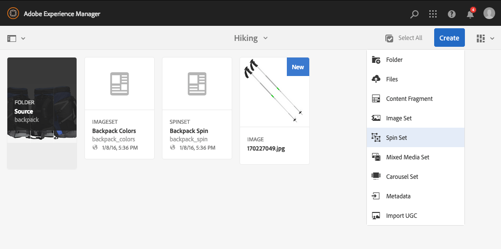

# 스핀 세트{#spin-sets}

스핀 세트는 물체를 돌아서 그것을 살펴보는 실제 행동을 시뮬레이션한다. 스핀 세트를 사용하면 모든 각도에서 항목을 볼 수 있으므로 모든 각도에서 주요 시각적 세부 정보를 얻을 수 있습니다.

회전 세트는 360도 보기 환경을 시뮬레이션합니다. Dynamic Media은 뷰어가 항목을 회전할 수 있는 단일 축 스핀 세트를 제공합니다. 또한 사용자는 몇 번의 마우스 클릭만으로 &quot;자유 형식&quot;으로 보기를 확대/축소하고 이동할 수 있습니다. 이러한 방식으로, 사용자는 특정 관점에서 항목을 더 가까이 검사할 수 있다.

회전 집합은 배너에 의해 **[!UICONTROL SPINSET]** 단어로 지정됩니다. 또한 회전 집합이 게시되면 **[!UICONTROL World]** 아이콘으로 표시된 게시 날짜가 **[!UICONTROL Pencil]** 아이콘으로 표시된 마지막 수정 날짜와 함께 배너에 표시됩니다.

>[!NOTE]
>
>Assets 사용자 인터페이스에 대한 자세한 내용은 [자산 관리](/help/assets/manage-assets.md)를 참조하십시오.

회전 집합을 만들 때 Adobe은 다음 모범 사례를 권장하며 다음 제한을 적용합니다.

| 제한 유형 | 모범 사례 | 제한 적용됨 |
| --- | --- | --- |
| 2D 세트당 최대 행/열 수 | 세트당 12~18개 이미지 | 1000년 |

[Dynamic Media 제한 사항](/help/assets/limitations.md)도 참조하세요.

## 빠른 시작: 스핀 세트 {#quick-start-spin-sets}

스핀 세트를 빠르게 시작하고 실행하려면 다음 단계를 따르십시오.

1. [여러 보기로 이미지를 업로드](#uploading-assets-for-spin-sets)합니다.

   최소한 1차원 스핀 세트의 경우 8-12개의 샷이 필요하고 2차원 스핀 세트의 경우 16-24개의 샷이 필요합니다. 촬영은 항목이 회전하고 뒤집히고 있다는 인상을 주기 위해 일정한 간격으로 촬영해야 합니다. 예를 들어 1차원 스핀 세트에 12개의 샷이 포함되어 있으면 각 샷에 대해 항목을 30°(360/12)로 회전합니다.

   회전 집합에서 지원하는 형식 목록은 [Dynamic Media - 지원되는 래스터 이미지 형식](/help/assets/assets-formats.md#supported-raster-image-formats-dynamic-media)을 참조하십시오.

1. [회전 집합을 만듭니다](#creating-spin-sets).

   회전 집합을 만들려면 **[!UICONTROL 만들기 > 회전 집합]**&#x200B;을 선택한 다음 집합 이름을 지정하고 자산을 선택한 다음 이미지가 표시되는 순서를 선택하십시오.

   [선택기를 사용하여 작업](/help/assets/working-with-selectors.md)을 참조하세요.

   >[!NOTE]
   >
   >You can also create spin sets automatically through [batch set presets](/help/assets/config-dms7.md#creating-batch-set-presets-to-auto-generate-image-sets-and-spin-sets). **중요:** 일괄 처리 집합은 IPS(이미지 프로덕션 시스템)에 의해 자산 수집의 일부로 만들어지며 Dynamic Media - Scene7 모드에서만 사용할 수 있습니다.

1. 필요에 따라 [회전 집합 뷰어 사전 설정](/help/assets/managing-viewer-presets.md)을 설정합니다.

   Administrators can create or modify Spin Set Viewer Presets. To see your spin set with a viewer preset, select the spin set, and in the left-rail drop-down menu, select **Viewers**.

   뷰어 사전 설정을 만들거나 편집하려면 **[!UICONTROL 도구]** > **[!UICONTROL Assets]** > **[!UICONTROL 뷰어 사전 설정]**&#x200B;을 참조하십시오.

   [뷰어 사전 설정 추가 및 편집](/help/assets/managing-viewer-presets.md)을 참조하십시오.

1. [회전 집합 보기](#viewing-spin-sets).

   세 가지 방법으로 일괄처리 집합 사전 설정을 통해 만든 집합을 보고 액세스할 수 있습니다. (일괄처리 집합 사전 설정을 사용하여 만든 집합입니다. *not*&#x200B;은(는) 사용자 인터페이스에 표시되지 않습니다.)

1. [회전 집합 미리 보기](/help/assets/previewing-assets.md).

   회전 세트를 선택하면 미리 볼 수 있습니다. 회전 세트를 회전합니다. 왼쪽 레일 드롭다운 메뉴에서 사용할 수 있는 **[!UICONTROL 뷰어]** 메뉴에서 다른 뷰어를 선택할 수 있습니다.

1. [회전 집합 Publish](/help/assets/publishing-dynamicmedia-assets.md).

   회전 세트를 게시하면 URL 및 포함 문자열이 활성화됩니다. 또한 [뷰어 사전 설정을 게시](/help/assets/managing-viewer-presets.md)해야 합니다.

1. [웹 응용 프로그램에 URL 연결](/help/assets/linking-urls-to-yourwebapplication.md) 또는 [비디오 또는 이미지 뷰어를 포함](/help/assets/embed-code.md).

   Adobe Experience Manager Assets은 스핀 세트에 대한 URL 호출을 생성하고 스핀 세트를 게시한 후 이를 활성화합니다. 에셋을 미리 볼 때 이러한 URL을 복사할 수 있습니다. 또는 웹 사이트에 포함할 수 있습니다.

   Select the Spin Set, then in the left rail drop-down menu, select **[!UICONTROL Viewers]**.

   [회전 집합을 웹 페이지에 연결](/help/assets/linking-urls-to-yourwebapplication.md) 및 [비디오 또는 이미지 뷰어 포함](/help/assets/embed-code.md)을 참조하십시오.

필요한 경우 회전 집합을 [편집](#editing-spin-sets)할 수 있습니다. 또한 [회전 집합 속성](/help/assets/manage-assets.md#editing-properties)을 보고 수정할 수 있습니다.

## 회전 집합에 대한 자산 업로드 {#uploading-assets-for-spin-sets}

최소한 1차원 스핀 세트의 경우 8-12개의 샷이 필요하고 2차원 스핀 세트의 경우 16-24개의 샷이 필요합니다. 촬영은 항목이 회전하고 뒤집히고 있다는 인상을 주기 위해 일정한 간격으로 촬영해야 합니다. 예를 들어 1차원 스핀 세트에 12개의 샷이 포함되어 있으면 각 샷에 대해 항목을 30°(360/12)로 회전합니다.

[Experience Manager Assets의 다른 에셋을 업로드](/help/assets/manage-assets.md)하는 것처럼 회전 집합에 대한 이미지를 업로드할 수 있습니다.

회전 집합에서 지원하는 형식 목록은 [Dynamic Media - 지원되는 래스터 이미지 형식](/help/assets/assets-formats.md#supported-raster-image-formats-dynamic-media)을 참조하십시오.

### 회전 집합에 대한 이미지 캡처 지침 {#guidelines-for-shooting-spin-set-images}

다음은 스핀 세트 이미지에 대한 몇 가지 모범 사례입니다. 일반적으로 [회전 세트]에 이미지가 많을수록 이미지 회전 효과가 향상됩니다. 그러나 세트에 많은 이미지를 포함하면 이미지가 로드되는 데 걸리는 시간도 늘어납니다. Experience Manager은 스핀 세트에서 사용할 이미지를 촬영하기 위해 다음 지침을 권장합니다.

* 최소한 1차원 회전 집합에서는 8~12개의 이미지를 사용하고 2차원 회전 집합에서는 16~24개의 이미지를 사용합니다. 360도 회전이 가능하려면 최소 8개의 이미지가 필요합니다. 1차원 스핀 세트는 2차원 스핀 세트를 만드는 데 노동 집약적이므로 더 일반적입니다.
* 무손실 형식을 사용하십시오. TIFF 및 PNG가 권장됩니다.
* 모든 이미지를 마스크하여 항목이 순수한 흰색 또는 기타 고대비 배경에 나타나도록 합니다. 섀도우를 추가합니다(선택 사항).
* 제품 세부 사항이 잘 표시되고 초점을 맞춥니다.
* 마네킹이나 모델로 패션 의류에 대한 스핀 이미지를 찍으세요. 종종 마네킹은 마스크(유리 마네킹을 사용)되거나 양식화된 마네킹/드레스폼이 이미지에 표시됩니다. 각도 수를 정의하여 모델 상의 회전 세트를 생성할 수 있습니다. 각 각도를 바닥에 있는 테이프로 표시하면 모델이 각 샷의 방향을 따라 걷고 볼 수 있도록 안내할 수 있습니다.

## 회전 집합 만들기 {#creating-spin-sets}

이 섹션에서는 Experience Manager에서 회전 집합을 만드는 방법을 설명합니다.

>[!NOTE]
>
>You can also create spin sets automatically through [batch set presets](/help/assets/config-dms7.md#creating-batch-set-presets-to-auto-generate-image-sets-and-spin-sets). **중요:** 일괄 처리 집합은 IPS(이미지 프로덕션 시스템)에 의해 자산 수집의 일부로 만들어지며 Dynamic Media - Scene7 모드에서만 사용할 수 있습니다.
>
>[Dynamic Media 구성 - Scene7 모드](/help/assets/config-dms7.md#creating-batch-set-presets-to-auto-generate-image-sets-and-spin-sets)에서 &quot;이미지 집합 및 스핀 집합을 자동으로 생성하는 일괄처리 집합 사전 설정 만들기&quot;를 참조하십시오.
>

>[!NOTE]
>
>회전 집합에 이미지가 나타나는 순서입니다. 스핀이 360도 부드럽게 보이도록 주문하십시오.

회전 집합을 만들 때 Adobe은 다음 모범 사례를 권장하며 다음 제한을 적용합니다.

| 제한 유형 | 모범 사례 | 제한적 부과 |
| --- | --- | --- |
| 2D 세트당 최대 행/열 수 | 세트당 12~18개 이미지 | 1000 |

[Dynamic Media 제한 사항](/help/assets/limitations.md)도 참조하세요.

**회전 집합을 만들려면:**

1. Assets에서 회전 집합을 만들 위치로 이동하여 **[!UICONTROL 만들기]**&#x200B;를 선택하고 **[!UICONTROL 회전 집합]**&#x200B;을 선택합니다. You can also create the set from inside a folder that contains your assets. The Spin Set Editor displays.

   

1. 회전 집합 편집기의 **[!UICONTROL 제목]** 필드에 회전 집합의 이름을 입력합니다. 이 이름은 회전 집합의 배너에 나타납니다. 설명을 입력합니다(선택적).

   

   >[!NOTE]
   >
   >회전 세트를 만들 때 회전 세트 축소판을 변경하거나 회전 세트의 에셋에 따라 Experience Manager이 축소판을 자동으로 선택하도록 할 수 있습니다. 썸네일을 선택하려면 **[!UICONTROL 썸네일 변경]**&#x200B;을 선택하고 이미지를 선택합니다(다른 폴더로 이동하여 이미지를 찾을 수도 있음). 썸네일을 선택한 다음 회전 집합에서 썸네일을 생성하도록 Experience Manager을 결정한 경우 **[!UICONTROL 자동 썸네일로 전환]**&#x200B;을 선택합니다.

1. 다음 중 하나를 수행합니다.

   * 회전 집합 편집기 페이지의 왼쪽 상단 모서리 근처에서 **[!UICONTROL 자산 추가]**&#x200B;를 선택합니다.

   * 회전 집합 편집기 페이지의 중간 부근에서 **[!UICONTROL 자산 선택기를 열려면 선택]**&#x200B;을 선택합니다.

   회전 세트에 포함할 자산을 선택하려면 를 선택합니다. Selected assets have a checkmark icon over them. 완료되면 페이지의 오른쪽 상단 근처에서 **[!UICONTROL 선택]**&#x200B;을 선택합니다.

   With the Asset Selector, you can search for assets by typing in a keyword and tapping **[!UICONTROL Return]**. You can also apply filters to refine your search results. You can filter by path, collection, file type, and tag. 필터를 선택한 다음 도구 모음에서 **[!UICONTROL 필터]** 아이콘을 선택합니다. Change the view by tapping the View icon and selecting **[!UICONTROL Column View]**, **[!UICONTROL Card View]**, or **[!UICONTROL List View]**.

   [선택기를 사용하여 작업](/help/assets/working-with-selectors.md)을 참조하세요.

   

1. 세트에 자산을 추가하면 영숫자 순서로 자산이 자동으로 추가됩니다. 에셋을 추가한 후 수동으로 에셋을 재정렬하거나 정렬할 수 있습니다.

   필요한 경우 에셋의 파일 이름 오른쪽으로 에셋의 순서 변경 아이콘을 드래그하여 세트 목록 위 또는 아래로 이미지의 순서를 변경합니다.

   .

   회전 세트에서 프레임 11을 새 위치로 드래그하여 재정렬합니다.

1. (선택 사항) 다음 중 하나를 수행합니다.

   * 이미지를 삭제하려면 이미지를 선택하고 **[!UICONTROL 자산 삭제]**&#x200B;를 선택합니다.

   * 페이지의 오른쪽 상단 모서리에서 사전 설정을 적용하려면 **[!UICONTROL 사전 설정]**&#x200B;을 선택한 다음 모든 에셋에 한 번에 적용할 사전 설정을 선택합니다.

1. **[!UICONTROL 저장]**&#x200B;을 선택합니다. 새로 만든 회전 세트가 해당 회전 세트를 만든 폴더에 나타납니다.

## 회전 집합 보기 {#viewing-spin-sets}

사용자 인터페이스에서 또는 [일괄처리 집합 사전 설정](/help/assets/config-dms7.md#creating-batch-set-presets-to-auto-generate-image-sets-and-spin-sets)을 사용하여 자동으로 회전 집합을 만들 수 있습니다. 그러나 일괄처리 집합 사전 설정을 사용하여 만든 집합은 사용자 인터페이스에 나타나지 않습니다 *not*. 세 가지 방법으로 일괄처리 집합 사전 설정을 통해 만든 집합에 액세스할 수 있습니다. (이러한 메서드는 사용자 인터페이스에서 스핀 세트를 만든 경우에도 사용할 수 있습니다.)

>[!NOTE]
>
>[회전 집합 편집](#editing-spin-sets)에 설명된 대로 사용자 인터페이스를 통해 집합을 볼 수도 있습니다.

**회전 집합을 보려면:**

1. 개별 에셋의 속성을 열 때. 속성은 선택한 자산이 구성원인 집합을 나타냅니다(**[!UICONTROL 집합의 구성원]** 아래). 전체 세트를 볼 수 있도록 세트 이름을 선택합니다.

   

1. From a member image of any set. **[!UICONTROL 집합]** 메뉴를 선택하여 자산이 구성원인 집합을 표시합니다.

   

1. From search, you can Select **[!UICONTROL Filters]**, then expand **[!UICONTROL Dynamic Media]** and select **[!UICONTROL Sets]**.

   UI에서 수동으로 만들었거나 일괄처리 집합 사전 설정을 통해 자동으로 만든 일치 세트가 검색 결과에 반환됩니다. 자동화된 집합의 경우 검색 쿼리는 `Contains` 검색 조건을 사용하는 Experience Manager 검색과 다른 `Starts with` 검색 조건을 사용하여 수행됩니다. 필터를 **[!UICONTROL 집합]**(으)로 설정하는 것만이 자동화된 집합을 검색하는 유일한 방법입니다.

   

## 회전 집합 편집 {#editing-spin-sets}

스핀 세트에서 다음과 같은 다양한 편집 작업을 수행할 수 있습니다.

* 회전 집합에 이미지를 추가합니다.
* 회전 집합에서 이미지 순서를 변경합니다.
* 회전 집합에서 자산을 삭제합니다.
* 뷰어 사전 설정을 적용합니다.
* 회전 집합을 삭제합니다.

**회전 집합을 편집하려면:**

1. 다음 중 하나를 수행합니다.

   * 회전 집합 자산을 마우스로 가리킨 다음 **[!UICONTROL 편집]**(연필 아이콘)을 선택합니다.
   * 회전 집합 자산을 마우스로 가리키고 **[!UICONTROL 선택]**(확인 표시 아이콘)을 선택한 다음 도구 모음에서 **[!UICONTROL 편집]**&#x200B;을 선택합니다.

   * 회전 집합 에셋에서 을(를) 선택한 다음 도구 모음에서 **[!UICONTROL 편집]**(연필 아이콘)을 선택합니다.

1. 회전 집합을 편집하려면 다음 중 하나를 수행합니다.

   * 이미지 순서를 조정하려면 이미지를 새 위치로 드래그합니다(항목을 이동하려면 순서 조정 아이콘을 선택합니다.).
   * 항목을 오름차순 또는 내림차순으로 정렬하려면 열 머리글을 선택합니다.
   * 자산을 추가하거나 기존 자산을 업데이트하려면 **[!UICONTROL 자산 추가]**&#x200B;를 선택하십시오. 자산으로 이동하여 선택한 다음 오른쪽 상단 모서리에서 **[!UICONTROL 선택]**을 선택합니다.
Experience Manager이 썸네일에 사용하는 이미지를 다른 이미지로 교체하여 삭제해도 원래 에셋이 계속 표시됩니다.
   * 자산을 삭제하려면 자산을 선택하고 **[!UICONTROL 자산 삭제]**&#x200B;를 선택합니다.
   * 사전 설정을 적용하려면 [사전 설정] 아이콘을 선택하고 사전 설정을 선택합니다.
   * 회전 집합 전체를 삭제하려면 회전 집합으로 이동하여 선택한 다음 **[!UICONTROL 삭제]**&#x200B;를 선택합니다
   >[!NOTE]
   >
   >회전 집합으로 이동하여 왼쪽 레일에서 **[!UICONTROL 구성원 설정]**&#x200B;을 선택한 다음 개별 자산에서 연필 아이콘을 선택하여 편집 창을 열면 회전 집합의 이미지를 편집할 수 있습니다.

1. 편집을 마치면 **[!UICONTROL 저장]**&#x200B;을(를) 선택합니다.

## 회전 집합 미리 보기 {#previewing-spin-sets}

[자산 미리 보기](/help/assets/previewing-assets.md)를 참조하세요.

## Publish a 스핀 세트 {#publishing-spin-sets}

[Publish 자산](/help/assets/publishing-dynamicmedia-assets.md)을 참조하세요.
