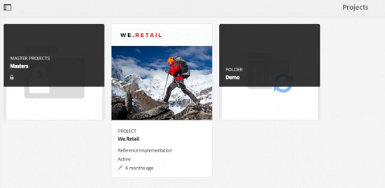

# 번역 프로젝트 만들기 {#creating-translation-projects}

언어 사본을 만들려면 [!DNL Experience Manager] 사용자 인터페이스의 참조 레일 아래에서 다음 언어 복사 워크플로우 중 하나를 트리거합니다.

* **작성 및 번역**:이 워크플로우에서 번역할 에셋은 번역할 언어의 언어 루트로 복사됩니다. 또한 선택한 옵션에 따라 [프로젝트] 콘솔의 자산에 대한 번역 프로젝트가 생성됩니다. 설정에 따라 번역 프로젝트를 수동으로 시작하거나 번역 프로젝트를 만드는 즉시 자동으로 실행할 수 있습니다.

* **언어 사본 업데이트**:이 워크플로우를 실행하여 추가 자산 그룹을 번역하고 특정 로케일의 언어 복사본에 포함시킬 수 있습니다. 이 경우 번역된 자산은 이미 이전에 번역된 에셋이 포함된 대상 폴더에 추가됩니다.

>[!PREREQUISITES]
>
>* 번역 프로젝트를 만드는 사용자는 그룹 `projects-administrators`의 멤버입니다.
>* 번역 서비스 공급자는 이진 파일의 변환을 지원합니다.

## 워크플로 {#create-and-translate-workflow} 만들기 및 번역

작성 및 번역 워크플로우를 사용하여 처음으로 특정 언어의 언어 사본을 생성할 수 있습니다. 워크플로우는 다음 옵션을 제공합니다.

* 구조만 생성.
* 새 번역 프로젝트 만들기.
* 기존 번역 프로젝트에 추가.

### 구조만 생성 {#create-structure-only}

소스 언어 루트 내의 소스 폴더 계층 구조와 일치하도록 대상 언어 루트 내에 대상 폴더 계층 구조를 만들려면 **[!UICONTROL 구조만 만들기 옵션을 사용합니다.]** 이 경우 소스 에셋이 대상 폴더에 복사됩니다. 그러나 번역 프로젝트는 생성되지 않습니다.

1. [!DNL Assets] 인터페이스에서 대상 언어 루트에서 구조를 만들 소스 폴더를 선택합니다.

1. **[!UICONTROL 참조]** 창을 열고 **[!UICONTROL 복사]**&#x200B;아래의 **[!UICONTROL 언어 사본]**&#x200B;을 클릭합니다.

   

1. **[!UICONTROL 만들기 및 번역]**&#x200B;을 클릭합니다. **[!UICONTROL Target 언어]** 목록에서 폴더 구조를 만들 언어를 선택합니다.

1. **[!UICONTROL 프로젝트]** 목록에서 **[!UICONTROL 구조만 만들기]**&#x200B;를 선택합니다.

1. **[!UICONTROL 만들기]**&#x200B;를 클릭합니다. 대상 언어의 새 구조는 **[!UICONTROL 언어 사본]** 아래에 나열됩니다.

   

1. 목록에서 구조를 클릭한 다음 **[!UICONTROL 자산]**&#x200B;에 표시를 클릭하여 대상 언어 내의 폴더 구조로 이동합니다.

   

### 새 번역 프로젝트 만들기 {#create-a-new-translation-project}

이 옵션을 사용하면 변환할 에셋이 번역하려는 언어의 언어 루트로 복사됩니다. 선택한 옵션에 따라 프로젝트 콘솔에서 자산에 대한 번역 프로젝트가 생성됩니다. 설정에 따라 번역 프로젝트를 수동으로 시작하거나 번역 프로젝트를 만드는 즉시 자동으로 실행할 수 있습니다.

1. [!DNL Assets] 사용자 인터페이스에서 언어 사본을 만들 소스 폴더를 선택합니다.
1. **[!UICONTROL 참조]** 창을 열고 **[!UICONTROL 복사]**&#x200B;아래의 **[!UICONTROL 언어 사본]**&#x200B;을 클릭합니다.

   

1. 맨 아래에 있는 **[!UICONTROL 만들기 및 번역]**&#x200B;을 클릭합니다.

1. **[!UICONTROL Target 언어]** 목록에서 폴더 구조를 만들 언어를 선택합니다.

   

1. **[!UICONTROL 프로젝트]** 목록에서 **[!UICONTROL 새 번역 프로젝트 만들기]**&#x200B;를 선택합니다.

   

1. **[!UICONTROL 프로젝트 제목]** 필드에 프로젝트의 제목을 입력합니다.

   

1. **[!UICONTROL 만들기]**&#x200B;를 클릭합니다. [!DNL Assets] 소스 폴더에서 4단계에서 선택한 로케일의 대상 폴더로 복사됩니다.

   

1. 폴더로 이동하려면 언어 사본을 선택하고 **[!UICONTROL 자산에 표시]**&#x200B;를 클릭합니다.

   

1. 프로젝트 콘솔로 이동합니다. 번역 폴더가 프로젝트 콘솔에 복사됩니다.

   

1. 번역 프로젝트를 보려면 폴더를 엽니다.

   

1. 프로젝트를 클릭하여 세부 사항 페이지를 엽니다.

   

1. 번역 작업의 상태를 보려면 **[!UICONTROL 번역 작업]** 타일 맨 아래에 있는 줄임표를 클릭합니다.

   

   작업 상태에 대한 자세한 내용은 [번역 작업 상태 모니터링](/help/sites-administering/tc-manage.md#monitoring-the-status-of-a-translation-job)을 참조하십시오.

1. [!DNL Assets] 사용자 인터페이스로 이동하고 번역된 각 에셋에 대한 [!UICONTROL 속성] 페이지를 열어 번역된 메타데이터를 봅니다.

   

   *그림:자산 속성 페이지에서 번역된 메타데이터입니다.*

   >[!NOTE]
   >
   >이 기능은 자산 및 폴더에 모두 사용할 수 있습니다. 폴더 대신 에셋을 선택하면 언어 루트에 이르는 폴더의 전체 계층 구조가 복사되어 에셋의 언어 사본을 만듭니다.

### 기존 번역 프로젝트에 추가 {#add-to-existing-translation-project}

이 옵션을 사용하면 이전 번역 워크플로우를 실행한 후 소스 폴더에 추가하는 자산에 대해 번역 워크플로우가 실행됩니다. 새로 추가된 자산만 이전에 번역된 에셋이 포함된 대상 폴더에 복사됩니다. 이 경우 새 번역 프로젝트가 생성되지 않습니다.

1. [!DNL Assets] UI에서 번역되지 않은 에셋이 포함된 소스 폴더로 이동합니다.
1. 변환할 자산을 선택하고 **[!UICONTROL 참조 창]**&#x200B;을 엽니다. **[!UICONTROL 언어 사본]** 섹션에는 현재 사용 가능한 번역 사본 수가 표시됩니다.
1. **[!UICONTROL 사본]**&#x200B;에서 **[!UICONTROL 언어 사본]**&#x200B;을 클릭합니다. 사용 가능한 번역 사본 목록이 표시됩니다.
1. 맨 아래에 있는 **[!UICONTROL 만들기 및 번역]**&#x200B;을 클릭합니다.

1. **[!UICONTROL Target 언어]** 목록에서 폴더 구조를 만들 언어를 선택합니다.

1. **[!UICONTROL 프로젝트]** 목록에서 **[!UICONTROL 기존 번역 프로젝트에 추가]**&#x200B;를 선택하여 폴더에서 번역 워크플로우를 실행합니다.

   >[!NOTE]
   >
   >**[!UICONTROL 기존 번역 프로젝트에 추가]** 옵션을 선택하면 프로젝트 설정이 기존 프로젝트의 설정과 정확히 일치하는 경우에만 번역 프로젝트가 기존 프로젝트에 추가됩니다. 그렇지 않으면 새 프로젝트가 만들어집니다.

1. **[!UICONTROL 기존 번역 프로젝트]** 목록에서 번역 자산을 추가할 프로젝트를 선택합니다.

1. **[!UICONTROL 만들기]**&#x200B;를 클릭합니다. 변환할 에셋이 대상 폴더에 추가됩니다. 업데이트된 폴더가 **[!UICONTROL 언어 사본]** 섹션 아래에 나열됩니다.

   

1. 프로젝트 콘솔로 이동하고 추가한 기존 번역 프로젝트를 엽니다.
1. 번역 프로젝트 보기를 클릭하고 프로젝트 세부 사항 페이지를 클릭합니다.

   

1. 번역 워크플로우에서 자산을 보려면 **번역 작업** 타일 맨 아래에 있는 줄임표를 클릭합니다. 번역 작업 목록에는 자산 메타데이터와 태그에 대한 항목도 표시됩니다. 이 항목들은 자산의 메타데이터와 태그도 번역됨을 나타냅니다.

   >[!NOTE]
   >
   >태그나 메타데이터의 항목을 삭제하면 해당 에셋에 대해 태그나 메타데이터가 변환되지 않습니다.

   >[!NOTE]
   >
   >번역 작업에 추가하는 자산에 하위 자산이 포함되어 있는 경우, 번역 작업을 위해 하위 자산을 선택하고 제거합니다. 이렇게 해서 아무 문제도 발생하지 않습니다.

1. 자산에 대한 번역을 시작하려면 **[!UICONTROL 번역 작업]** 타일의 화살표를 클릭하고 목록에서 **[!UICONTROL 시작]**&#x200B;을 선택합니다.

   

   변환 작업 시작을 알리는 메시지가 표시됩니다.

1. 번역 작업의 상태를 보려면 **[!UICONTROL 번역 작업]** 타일 맨 아래에 있는 줄임표를 클릭합니다.

   

   자세한 내용은 [번역 작업 상태 모니터링](/help/sites-administering/tc-manage.md#monitoring-the-status-of-a-translation-job)을 참조하십시오.

1. 번역이 완료되면 상태가 검토 준비가 됨으로 변경됩니다. [!DNL Assets] 사용자 인터페이스로 이동하고 번역된 각 자산에 대한 속성 페이지를 열어 번역된 메타데이터를 봅니다.

## 언어 복사 업데이트 {#update-language-copies}

이 워크플로우를 실행하여 추가 자산 세트를 변환하고 특정 로케일의 언어 복사본에 포함시킬 수 있습니다. 이 경우 번역된 자산은 이미 이전에 번역된 에셋이 포함된 대상 폴더에 추가됩니다. 선택 사항에 따라 번역 프로젝트가 만들어지거나 새 자산에 대해 기존 번역 프로젝트가 업데이트됩니다. 언어 사본 업데이트 워크플로우에는 다음 옵션이 포함됩니다.

* 새 번역 프로젝트 만들기
* 기존 번역 프로젝트에 추가

### 새 번역 프로젝트 만들기 {#create-a-new-translation-project-1}

이 옵션을 사용하면 언어 사본을 업데이트할 에셋 세트에 대한 번역 프로젝트가 생성됩니다.

1. [!DNL Assets] UI에서 자산을 추가한 소스 폴더를 선택합니다.
1. **[!UICONTROL 참조]** 창을 열고 **[!UICONTROL 복사]**&#x200B;에서 **[!UICONTROL 언어 사본]**&#x200B;을 클릭하여 언어 사본 목록을 표시합니다.
1. **[!UICONTROL 언어 사본]** 앞에 있는 확인란을 선택한 다음 해당 로케일에 해당하는 대상 폴더를 선택합니다.

   

1. 맨 아래에 있는 **[!UICONTROL 언어 사본 업데이트]**&#x200B;를 클릭합니다.

1. **[!UICONTROL 프로젝트]** 목록에서 **[!UICONTROL 새 번역 프로젝트 만들기]**&#x200B;를 선택합니다.

1. **[!UICONTROL 프로젝트 제목]** 필드에 프로젝트의 제목을 입력합니다.

1. **[!UICONTROL 시작]**&#x200B;을 클릭합니다.
1. 프로젝트 콘솔로 이동합니다. 번역 폴더가 프로젝트 콘솔에 복사됩니다.

   

1. 번역 프로젝트를 보려면 폴더를 엽니다.

   

1. 프로젝트를 클릭하여 세부 사항 페이지를 엽니다.

   

1. 자산에 대한 번역을 시작하려면 **[!UICONTROL 번역 작업]** 타일의 화살표를 클릭하고 목록에서 **[!UICONTROL 시작]**&#x200B;을 선택합니다.

   

   변환 작업 시작을 알리는 메시지가 표시됩니다.

1. 번역 작업의 상태를 보려면 **[!UICONTROL 번역 작업]** 타일 맨 아래에 있는 줄임표를 클릭합니다.

   

   작업 상태에 대한 자세한 내용은 [번역 작업 상태 모니터링](../sites-administering/tc-manage.md#monitoring-the-status-of-a-translation-job)을 참조하십시오.

1. [!DNL Assets] 사용자 인터페이스로 이동하고 번역된 각 자산에 대한 속성 페이지를 열어 번역된 메타데이터를 봅니다.

### 기존 번역 프로젝트에 추가 {#add-to-existing-translation-project-1}

이 옵션을 사용하는 경우 자산 세트가 기존 번역 프로젝트에 추가되어 선택한 로케일에 대한 언어 사본을 업데이트합니다.

1. [!DNL Assets] UI에서 자산 폴더를 추가한 소스 폴더를 선택합니다.
1. **[!UICONTROL 참조 창]**&#x200B;을 열고 **[!UICONTROL 복사]**&#x200B;에서 **[!UICONTROL 언어 사본]**&#x200B;을 클릭하여 언어 사본 목록을 표시합니다.

   

1. 모든 언어 사본을 선택하는 **[!UICONTROL 언어 사본]** 앞에 있는 확인란을 선택합니다. 번역할 로케일에 해당하는 언어 사본(복사본)을 제외한 다른 사본의 선택을 취소합니다.

   

1. 맨 아래에 있는 **[!UICONTROL 언어 사본 업데이트]**&#x200B;를 클릭합니다.

1. **[!UICONTROL 프로젝트]** 목록에서 **[!UICONTROL 기존 번역 프로젝트에 추가]**&#x200B;를 선택합니다.

   

1. **[!UICONTROL 기존 번역 프로젝트]** 목록에서 번역 자산을 추가할 프로젝트를 선택합니다.

1. **[!UICONTROL 시작]**&#x200B;을 클릭합니다.
1. 나머지 절차를 완료하려면 [기존 번역 프로젝트에 추가](translation-projects.md#add-to-existing-translation-project) 단계 중 9-14를 참조하십시오.

## 임시 언어 사본 만들기 {#creating-temporary-language-copies}

번역 워크플로우를 실행하여 원본 자산의 편집된 버전으로 언어 사본을 업데이트할 때 번역된 자산을 승인할 때까지 기존 언어 복사본이 유지됩니다. [!DNL Adobe Experience Manager Assets] 새로 번역된 자산을 임시 위치에 저장하고 자산을 명시적으로 승인한 후 기존 언어 사본을 업데이트합니다. 자산을 거부하면 언어 사본은 변경되지 않습니다.

1. 언어 복사본을 이미 만든 **[!UICONTROL 언어 사본]** 아래의 소스 루트 폴더를 클릭한 다음 **[!UICONTROL 자산]**&#x200B;에 표시를 클릭하여 [!DNL Experience Manager Assets]에서 폴더를 엽니다.

   

1. [!DNL Assets] 인터페이스에서 이미 번역한 자산을 선택하고 도구 모음에서 **[!UICONTROL 편집]**&#x200B;을 클릭하여 편집 모드에서 자산을 엽니다.
1. 자산을 편집한 다음 변경 내용을 저장합니다.
1. 언어 사본을 업데이트하려면 [기존 번역 프로젝트에 추가](#add-to-existing-translation-project) 절차의 2-14단계를 수행합니다.
1. **[!UICONTROL 번역 작업]** 타일 맨 아래에 있는 줄임표를 클릭합니다. **[!UICONTROL 번역 작업]** 페이지의 자산 목록에서 번역된 버전의 자산이 저장되는 임시 위치를 명확하게 볼 수 있습니다.

   

1. **[!UICONTROL 제목]** 옆의 확인란을 선택합니다.
1. 도구 모음에서 **[!UICONTROL 번역 수락]** 을 클릭한 다음 대화 상자에서 **[!UICONTROL 수락]**&#x200B;을 클릭하여 대상 폴더의 번역된 자산을 편집된 에셋 버전으로 덮어씁니다.

   >[!NOTE]
   >
   >번역 워크플로우에서 대상 자산을 업데이트하려면 자산과 메타데이터를 모두 수락합니다.

   대상 로케일 루트에서 원래 번역된 에셋 버전을 유지하고 편집한 버전을 거부하려면 **[!UICONTROL 번역 거부]** 를 클릭합니다.

1. 번역된 메타데이터를 보려면 [!DNL Assets] 콘솔로 이동하고 번역된 각 에셋에 대해 [!UICONTROL 속성] 페이지를 엽니다.

## 팁 및 제한 사항 {#tips-limitations}

* PDF 및 [!DNL Adobe InDesign] 파일과 같은 복잡한 자산에 대한 번역 워크플로우를 실행하는 경우 해당 하위 자산이나 변환(있는 경우)이 번역을 위해 제출되지 않습니다.
* 기계 번역을 사용하는 경우 자산 이진 파일이 변환되지 않습니다.
