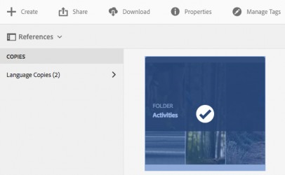

# 번역 프로젝트 만들기 {#creating-translation-projects}

언어 사본을 만들려면 의 참조 레일에서 사용할 수 있는 다음 언어 사본 워크플로 중 하나를 트리거합니다 [!DNL Experience Manager] 사용자 인터페이스.

* **만들기 및 번역**: 이 워크플로우에서는 번역할 에셋이 번역하려는 언어의 언어 루트에 복사됩니다. 또한 선택한 옵션에 따라 프로젝트 콘솔에서 에셋에 대한 번역 프로젝트가 만들어집니다. 설정에 따라 번역 프로젝트를 수동으로 시작하거나 번역 프로젝트를 만드는 즉시 자동으로 실행되도록 할 수 있습니다.

* **언어 사본 업데이트**: 이 워크플로우를 실행하여 추가 자산 그룹을 번역하고 특정 로케일의 언어 사본에 포함합니다. 이 경우 번역된 에셋은 이전에 번역된 에셋이 이미 포함된 대상 폴더에 추가됩니다.

>[!PREREQUISITES]
>
>* 번역 프로젝트를 만드는 사용자는 그룹의 구성원입니다 `projects-administrators`.
>* 번역 서비스 공급업체는 바이너리 번역을 지원합니다.

## 워크플로우 만들기 및 번역 {#create-and-translate-workflow}

만들기 및 번역 워크플로우를 사용하여 처음으로 특정 언어에 대한 언어 사본을 생성합니다. 워크플로는 다음과 같은 옵션을 제공합니다.

* 구조만 생성합니다.
* 번역 프로젝트를 만듭니다.
* 기존 번역 프로젝트에 을 추가합니다.

### 구조만 생성 {#create-structure-only}

Use the **[!UICONTROL Create structure only]** option to create a target folder hierarchy within the target language root to match the hierarchy of the source folder within the source language root. In this case, source assets are copied to the destination folder. However, no translation project is generated.

1. 다음에서 [!DNL Assets] 인터페이스를 사용하여 타겟 언어 루트에서 구조를 만들 소스 폴더를 선택합니다.

1. 를 엽니다. **[!UICONTROL 참조]** 창 및 클릭 **[!UICONTROL 언어 복사]** 아래에 **[!UICONTROL 사본]**.

   

1. 클릭 **[!UICONTROL 만들기 및 번역]**. 다음에서 **[!UICONTROL 타겟 언어]** 목록에서 폴더 구조를 만들 언어를 선택합니다.

1. From the **[!UICONTROL Project]** list, choose **[!UICONTROL Create structure only]**.

1. **[!UICONTROL 만들기]**&#x200B;를 클릭합니다. 대상 언어의 새 구조는 아래에 나열됩니다. **[!UICONTROL 언어 복사]**.

   

1. 목록에서 구조를 클릭한 다음 **[!UICONTROL 에셋에 표시]** 대상 언어 내에서 폴더 구조로 이동합니다.

   

### 번역 프로젝트 만들기 {#create-a-new-translation-project}

이 옵션을 사용하면 번역할 에셋이 번역하려는 언어의 언어 루트에 복사됩니다. 선택한 옵션에 따라 프로젝트 콘솔에서 에셋에 대한 번역 프로젝트가 만들어집니다. 설정에 따라 번역 프로젝트를 수동으로 시작하거나 번역 프로젝트를 만드는 즉시 자동으로 실행할 수 있습니다.

1. 다음에서 [!DNL Assets] 사용자 인터페이스에서 언어 사본을 만들 소스 폴더를 선택합니다.
1. 를 엽니다. **[!UICONTROL 참조]** 창 및 클릭 **[!UICONTROL 언어 복사]** 아래에 **[!UICONTROL 사본]**.

   

1. 클릭 **[!UICONTROL 만들기 및 번역]** 맨 아래에

1. 다음에서 **[!UICONTROL 타겟 언어]** 폴더 구조를 만들 언어를 선택합니다.

1. 다음에서 **[!UICONTROL 프로젝트]** 목록, 선택 **[!UICONTROL 새 번역 프로젝트 만들기]**.

1. In the **[!UICONTROL Project Title]** field, enter a title for the project.

1. **[!UICONTROL 만들기]**&#x200B;를 클릭합니다. [!DNL Assets] 소스 폴더에서 4단계에서 선택한 로케일의 대상 폴더로 복사됩니다.

   

1. 폴더로 이동하려면 언어 사본을 선택하고 **[!UICONTROL 에셋에 표시]**.

   

1. 프로젝트 콘솔로 이동합니다. 번역 폴더가 프로젝트 콘솔에 복사됩니다.

   

1. 번역 프로젝트를 보려면 폴더를 엽니다.

   

1. 프로젝트를 클릭하여 세부 정보 페이지를 엽니다.

   

1. 번역 작업의 상태를 보려면 아래쪽의 생략 부호를 클릭합니다 **[!UICONTROL 번역 작업]** 타일.

   

   작업 상태에 대한 자세한 내용은 [번역 작업 상태 모니터링](/help/sites-administering/tc-manage.md#monitoring-the-status-of-a-translation-job).

1. 다음 위치로 이동 [!DNL Assets] 사용자 인터페이스를 열고 [!UICONTROL 속성] 번역된 메타데이터를 볼 수 있는 번역된 각 자산의 페이지입니다.

   

   *그림: 에셋 속성 페이지에서 번역된 메타데이터*

   >[!NOTE]
   >
   >이 기능은 에셋과 폴더 모두에서 사용할 수 있습니다. 폴더 대신 에셋을 선택하면 언어 루트까지 폴더의 전체 계층 구조가 복사되어 에셋에 대한 언어 사본을 만듭니다.

### 기존 번역 프로젝트에 추가 {#add-to-existing-translation-project}

이 옵션을 사용하면 이전 번역 워크플로를 실행한 후 소스 폴더에 추가하는 에셋에 대해 번역 워크플로가 실행됩니다. 새로 추가된 에셋만 이전에 번역된 에셋이 포함된 대상 폴더에 복사됩니다. 이 경우 새로운 번역 프로젝트가 생성되지 않습니다.

1. 다음에서 [!DNL Assets] UI에서 번역되지 않은 에셋이 포함된 소스 폴더로 이동합니다.
1. Select an asset you want to translate, and open the **[!UICONTROL Reference pane]**. The **[!UICONTROL Language Copies]** section displays the number of translation copies that are currently available.
1. 클릭 **[!UICONTROL 언어 복사]** 아래에 **[!UICONTROL 사본]**. A list of available translation copies is displayed.
1. 클릭 **[!UICONTROL 만들기 및 번역]** 맨 아래에

1. 다음에서 **[!UICONTROL 타겟 언어]** 폴더 구조를 만들 언어를 선택합니다.

1. From the **[!UICONTROL Project]** list, select **[!UICONTROL Add to existing translation project]** to run the translation workflow on the folder.

   >[!NOTE]
   >
   >다음을 선택하면 **[!UICONTROL 기존 번역 프로젝트에 추가]** 옵션을 선택하면 프로젝트 설정이 기존 프로젝트의 설정과 정확히 일치하는 경우에만 번역 프로젝트가 기존 프로젝트에 추가됩니다. 그렇지 않으면 새 프로젝트가 만들어집니다.

1. 다음에서 **[!UICONTROL 기존 번역 프로젝트]** 목록에서 번역을 위해 에셋을 추가할 프로젝트를 선택합니다.

1. **[!UICONTROL 만들기]**&#x200B;를 클릭합니다. The assets to be translated are added to the target folder. The updated folder is listed under the **[!UICONTROL Language Copies]** section.

   

1. 프로젝트 콘솔로 이동한 다음 추가한 기존 번역 프로젝트를 엽니다.
1. 번역 프로젝트를 클릭하여 프로젝트 세부 정보 페이지를 조회합니다.

   

1. 아래쪽의 생략 부호를 클릭합니다. **번역 작업** 타일을 사용하여 번역 워크플로우에서 에셋을 볼 수 있습니다. 번역 작업 목록에는 자산 메타데이터와 태그에 대한 항목도 표시됩니다. 이 항목들은 자산의 메타데이터와 태그도 번역됨을 나타냅니다.

   >[!NOTE]
   >
   >태그나 메타데이터에 대한 항목을 삭제하면 어떤 에셋에 대해서도 태그나 메타데이터가 번역되지 않습니다.

   >[!NOTE]
   >
   >번역 작업에 추가하는 에셋에 하위 에셋이 포함된 경우, 하위 에셋을 선택하고 이를 제거하여 결함 없이 번역을 진행합니다.

1. 에셋에 대한 번역을 시작하려면 **[!UICONTROL 번역 작업]** 타일 및 선택 **[!UICONTROL 시작]** 목록에서 삭제할 수 있습니다.

   

   번역 작업이 시작되었음을 알리는 메시지가 표시됩니다.

1. 번역 작업의 상태를 보려면 아래쪽의 생략 부호를 클릭합니다 **[!UICONTROL 번역 작업]** 타일.

   

   자세한 내용은 [번역 작업 상태 모니터링](/help/sites-administering/tc-manage.md#monitoring-the-status-of-a-translation-job).

1. 번역이 완료되면 상태가 검토 준비됨으로 변경됩니다. 다음 위치로 이동 [!DNL Assets] 사용자 인터페이스를 참조하고 번역된 각 에셋의 속성 페이지를 열어 번역된 메타데이터를 봅니다.

## 언어 복사 업데이트 {#update-language-copies}

이 워크플로우를 실행하여 추가 자산 세트를 번역하고 특정 로케일의 언어 사본에 포함합니다. 이 경우 번역된 에셋은 이전에 번역된 에셋이 이미 포함된 대상 폴더에 추가됩니다. 옵션 선택에 따라 번역 프로젝트가 생성되거나 기존 번역 프로젝트가 새 에셋에 대해 업데이트됩니다. 언어 사본 업데이트 워크플로에는 다음 옵션이 포함됩니다.

* 번역 프로젝트 만들기
* 기존 번역 프로젝트에 추가

### 번역 프로젝트 만들기 {#create-a-new-translation-project-1}

이 옵션을 사용하면 언어 사본을 업데이트할 에셋 세트에 대해 번역 프로젝트가 만들어집니다.

1. 다음에서 [!DNL Assets] UI에서 에셋을 추가한 소스 폴더를 선택합니다.
1. 를 엽니다. **[!UICONTROL 참조]** 창 및 클릭 **[!UICONTROL 언어 복사]** 아래에 **[!UICONTROL 사본]** 언어 사본 목록을 표시합니다.
1. Select the check box before **[!UICONTROL Language Copies]**, and then select the target folder corresponding to the appropriate locale.

   

1. 클릭 **[!UICONTROL 언어 사본 업데이트]** 맨 아래에

1. 다음에서 **[!UICONTROL 프로젝트]** 목록, 선택 **[!UICONTROL 새 번역 프로젝트 만들기]**.

1. In the **[!UICONTROL Project Title]** field, enter a title for the project.

1. 클릭 **[!UICONTROL 시작]**.
1. 프로젝트 콘솔로 이동합니다. 번역 폴더가 프로젝트 콘솔에 복사됩니다.

   

1. 번역 프로젝트를 보려면 폴더를 엽니다.

   

1. 프로젝트를 클릭하여 세부 정보 페이지를 엽니다.

   

1. 에셋에 대한 번역을 시작하려면 **[!UICONTROL 번역 작업]** 타일 및 선택 **[!UICONTROL 시작]** 목록에서 삭제할 수 있습니다.

   

   번역 작업이 시작되었음을 알리는 메시지가 표시됩니다.

1. 번역 작업의 상태를 보려면 아래쪽의 생략 부호를 클릭합니다 **[!UICONTROL 번역 작업]** 타일.

   

   작업 상태에 대한 자세한 내용은 [번역 작업 상태 모니터링](../sites-administering/tc-manage.md#monitoring-the-status-of-a-translation-job).

1. 다음 위치로 이동 [!DNL Assets] 사용자 인터페이스를 참조하고 번역된 각 에셋의 속성 페이지를 열어 번역된 메타데이터를 봅니다.

### 기존 번역 프로젝트에 추가 {#add-to-existing-translation-project-1}

이 옵션을 사용하면 선택한 로케일에 대한 언어 사본을 업데이트하기 위해 에셋 세트가 기존 번역 프로젝트에 추가됩니다.

1. 다음에서 [!DNL Assets] UI에서 에셋 폴더를 추가한 소스 폴더를 선택합니다.
1. 를 엽니다. **[!UICONTROL 참조 창]**, 및 클릭 **[!UICONTROL 언어 복사]** 아래에 **[!UICONTROL 사본]** 언어 사본 목록을 표시합니다.

   

1. Select the check box before **[!UICONTROL Language Copies]**, which selects all language copies. Unselect other copies except the language copy (copies) corresponding to the locale(s) to which you want to translate.

   

1. 클릭 **[!UICONTROL 언어 사본 업데이트]** 맨 아래에

1. 다음에서 **[!UICONTROL 프로젝트]** 목록, 선택 **[!UICONTROL 기존 번역 프로젝트에 추가]**.

1. 다음에서 **[!UICONTROL 기존 번역 프로젝트]** 목록에서 번역을 위해 에셋을 추가할 프로젝트를 선택합니다.

1. 클릭 **[!UICONTROL 시작]**.
1. 의 9~14단계 참조 [기존 번역 프로젝트에 추가](translation-projects.md#add-to-existing-translation-project) 나머지 절차를 완료합니다.

## 임시 언어 사본 만들기 {#creating-temporary-language-copies}

번역 워크플로우를 실행하여 언어 사본을 원본 에셋의 편집된 버전으로 업데이트하면 번역된 에셋을 승인할 때까지 기존 언어 사본이 유지됩니다. [!DNL Adobe Experience Manager Assets] 새로 번역된 에셋을 임시 위치에 저장하고 에셋을 명시적으로 승인한 후 기존 언어 사본을 업데이트합니다. 에셋을 거부하면 언어 사본은 변경되지 않은 상태로 유지됩니다.

1. 아래의 소스 루트 폴더를 클릭합니다. **[!UICONTROL 언어 복사]** 언어 사본을 이미 만든 다음 **[!UICONTROL 에셋에 표시]** 에서 폴더를 열려면 [!DNL Experience Manager Assets].

   

1. 다음에서 [!DNL Assets] 인터페이스에서 이미 번역한 에셋을 선택하고 **[!UICONTROL 편집]** 를 클릭하여 자산을 편집 모드로 엽니다.
1. 에셋을 편집한 다음 변경 사항을 저장합니다.
1. 의 2-14단계를 수행합니다. [기존 번역 프로젝트에 추가](#add-to-existing-translation-project) 언어 사본을 업데이트하는 절차.
1. 아래쪽의 생략 부호를 클릭합니다. **[!UICONTROL 번역 작업]** 타일. 의 자산 목록에서 **[!UICONTROL 번역 작업]** 페이지에서 자산의 번역본이 저장된 임시 위치를 명확하게 볼 수 있습니다.

   

1. 옆에 있는 확인란을 선택합니다. **[!UICONTROL 제목]**.
1. 도구 모음에서 를 클릭합니다 **[!UICONTROL 번역 수락]**  그런 다음 을 클릭합니다. **[!UICONTROL Accept]** 대상 폴더의 번역된 에셋을 편집된 에셋의 번역된 버전으로 덮어쓰는 대화 상자에서

   >[!NOTE]
   >
   >번역 워크플로를 활성화하여 대상 에셋을 업데이트하려면 에셋과 메타데이터 모두를 수락하십시오.

   클릭 **[!UICONTROL 번역 거부]**  대상 로케일 루트에 있는 에셋의 원래 번역 버전을 유지하고 편집된 버전을 거부합니다.

1. 번역된 메타데이터를 보려면 [!DNL Assets] 콘솔을 열고 [!UICONTROL 속성] 번역된 각 자산의 페이지입니다.

## 팁 및 제한 사항 {#tips-limitations}

* PDF 및 와 같은 복잡한 에셋에 대한 번역 워크플로를 시작하는 경우 [!DNL Adobe InDesign] 파일, 해당 하위 자산 또는 렌디션(있는 경우)은 번역용으로 제출되지 않습니다.
* 기계 번역을 사용하는 경우 에셋 바이너리는 번역되지 않습니다.
