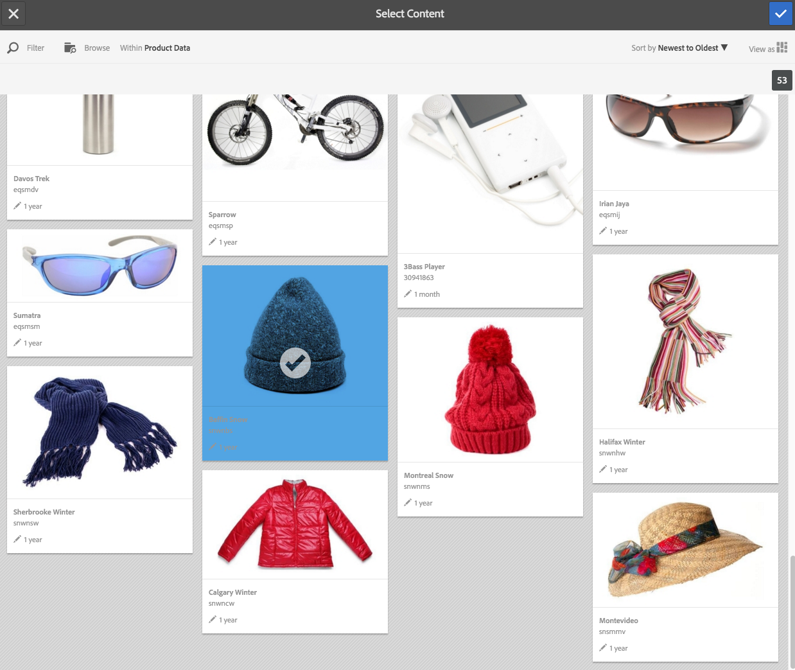
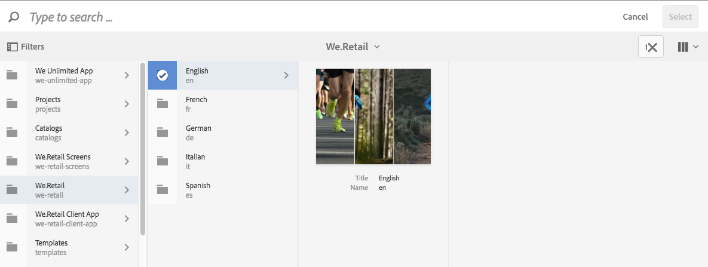
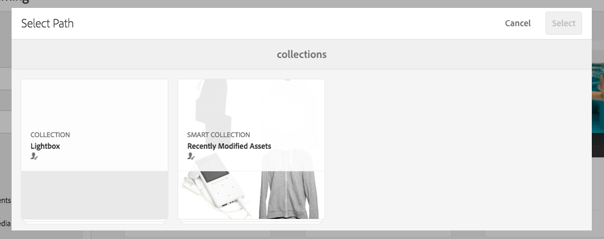

# 선택기를 사용하여 작업 {#working-with-selectors}

대화형 이미지, 대화형 비디오 또는 회전 배너를 사용하여 작업할 때 에셋을 선택하고 핫스팟 및 이미지 맵에 대해 링크할 사이트 및 제품을 선택합니다. 이미지 세트, 스핀 세트 및 멀티미디어 세트로 작업할 때 에셋 선택기를 사용하여 에셋을 선택할 수도 있습니다.

이 항목에서는 선택기 내에서 검색, 필터링, 정렬 기능을 포함하여 제품, 사이트 및 에셋 선택기를 사용하는 방법을 다룹니다.

회전 메뉴 세트를 만들고, 핫스팟과 이미지 맵을 추가하고, 대화형 비디오와 이미지를 만드는 동안 선택기에 액세스합니다.

예를 들어 핫스팟 또는 이미지 맵을 빠른 보기 페이지에 연결하는 경우 이 회전 배너에서 제품 선택기를 사용합니다. 핫스팟 또는 이미지 맵을 하이퍼링크에 연결하는 경우 사이트 선택기를 사용하고, 슬라이드를 만드는 경우 에셋 선택기를 사용합니다.

핫스팟이나 이미지 맵이 이동할 위치를 수동으로 입력하지 않고 선택하는 경우에는 선택기를 사용합니다. 사이트 선택기는 Experience Manager Sites 고객인 경우에만 작동합니다. 제품 선택기에도 Commerce Experience Manager이 필요합니다.

## 제품 선택기 사용 {#selecting-products}

핫스팟 또는 이미지 맵이 제품 카탈로그의 특정 제품에 빠른 보기를 제공하려면 제품 선택기를 사용하여 제품을 선택합니다.

1. 회전 메뉴 세트, 대화형 이미지 또는 대화형 비디오로 이동하여 **[!UICONTROL 작업]** 탭을 선택합니다(핫스팟이나 이미지 맵을 정의한 경우에만 사용 가능).

   제품 선택기가 **[!UICONTROL 작업 유형]** 영역에 있습니다.

   

1. **[!UICONTROL 제품 선택기]** 아이콘(돋보기)을 선택하고 카탈로그의 제품으로 이동합니다.

   

   **[!UICONTROL Filter]**&#x200B;를 탭하고 키워드를 입력하거나 태그를 선택하거나 둘 다 선택하여 키워드 또는 태그로 필터링합니다.

   

   **[!UICONTROL 찾아보기]**&#x200B;를 탭하고 다른 폴더로 이동하여 Experience Manager이 제품 데이터를 검색하는 위치를 변경합니다.

   

   **[!UICONTROL 정렬]**&#x200B;을(를) 선택하여 Experience Manager이 가장 최근에서 가장 오래된 순으로 정렬하는지 또는 가장 오래된 항목에서 가장 최근으로 정렬하는지 여부를 변경합니다.

   

   **[!UICONTROL 다음으로 보기]**&#x200B;를 선택하여 **[!UICONTROL 목록 보기]** 또는 **[!UICONTROL 카드 보기]** 중 제품을 보는 방법을 변경합니다.

   

1. 제품을 선택하면 필드가 제품 썸네일과 이름으로 채워집니다.

   

1. **[!UICONTROL 미리 보기]** 모드에서는 핫스팟 또는 이미지 맵을 선택하고 빠른 보기의 모양을 확인할 수 있습니다.

   

## 사이트 선택기 사용 {#selecting-sites}

핫스팟 또는 이미지 맵이 Experience Manager Sites 내에서 관리되는 웹 페이지에 연결되게 하려면 사이트 선택기를 사용하여 웹 페이지를 선택하십시오.

1. 회전 메뉴 세트, 대화형 이미지 또는 대화형 비디오로 이동하여 **[!UICONTROL 작업]** 탭을 선택합니다(핫스팟이나 이미지 맵을 정의한 경우에만 사용 가능).

   The Site Selector is in the **[!UICONTROL Action Type]** area.

   

1. **[!UICONTROL 사이트 선택기]** 아이콘(확대경이 있는 폴더)을 선택하고 핫스팟이나 이미지 맵을 연결할 Experience Manager Sites의 페이지로 이동합니다.

   

1. 사이트를 선택하면 필드가 경로로 채워집니다.

   

1. **[!UICONTROL 미리 보기]** 모드에서는 핫스팟 또는 이미지 맵을 선택하면 지정한 Experience Manager 사이트 페이지로 이동합니다.

## 자산 선택기 사용 {#selecting-assets}

이 선택기를 사용하여 회전 배너, 대화형 비디오, 이미지 세트, 혼합 미디어 세트 및 스핀 세트에서 사용할 이미지를 선택합니다. 대화형 비디오에서는 **[!UICONTROL 컨텐츠]** 탭에서 **[!UICONTROL Assets 선택]**&#x200B;을 선택하면 자산 선택기를 사용할 수 있습니다. 슬라이드 세트에서 슬라이드를 만들 때 에셋 선택기를 사용할 수 있습니다. 이미지 세트, 혼합 미디어 세트 및 스핀 세트에서 자산 선택기는 이미지 세트, 혼합 미디어 세트 또는 스핀 세트를 각각 만들 때 사용할 수 있습니다.

자세한 내용은 [자산 선택기](search-assets.md#assetpicker)도 참조하세요.

1. 슬라이드 세트로 이동하여 슬라이드를 만듭니다. 또는 대화형 비디오로 이동하여 **[!UICONTROL 콘텐츠]** 탭으로 이동한 다음 에셋을 선택합니다. 또는 혼합 미디어 세트, 이미지 세트 또는 스핀 세트를 만듭니다.
1. **[!UICONTROL 자산 선택기]** 아이콘(확대경이 있는 폴더)을 선택하고 자산으로 이동합니다.

   

   **[!UICONTROL 필터]**&#x200B;를 탭하고 키워드를 입력하거나 기준을 추가하거나 두 가지 모두를 사용하여 키워드 또는 태그로 필터링합니다.

   

   **[!UICONTROL 경로]** 필드의 다른 폴더로 이동하여 Experience Manager이 자산을 검색하는 위치를 변경합니다.

   컬렉션 내의 자산만 검색하려면 **[!UICONTROL 컬렉션]**&#x200B;을(를) 선택하십시오.

   

   **[!UICONTROL 다음으로 보기]**&#x200B;를 선택하여 **[!UICONTROL 목록 보기]**, **[!UICONTROL 열 보기]** 또는 **[!UICONTROL 카드 보기]**&#x200B;와 같은 제품 보기 방법을 변경합니다.

   

1. 확인 표시를 탭하여 에셋을 선택합니다. 에셋이 표시됩니다.

   
